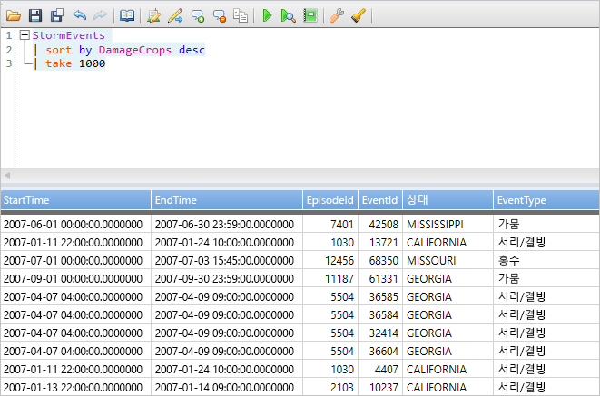
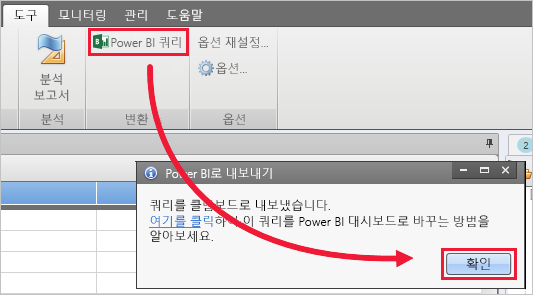
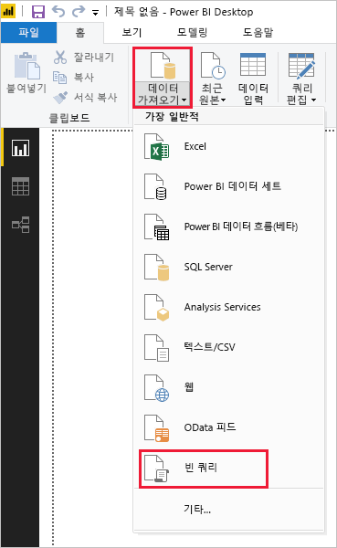
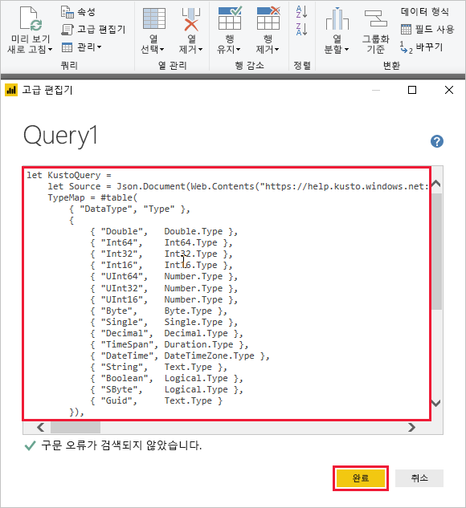
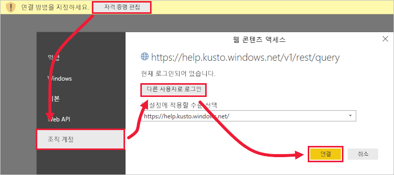
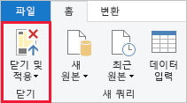

# <a name="visualize-data-using-a-query-imported-into-power-bi"></a>Power BI로 가져온 쿼리를 사용하여 데이터 시각화

Azure 데이터 탐색기는 로그 및 원격 분석 데이터에 사용 가능한 빠르고 확장성이 우수한 데이터 탐색 서비스입니다. Power BI는 데이터를 시각화하고 조직 전체에서 결과를 공유할 수 있는 비즈니스 분석 솔루션입니다.

Azure Data Explorer는 Power BI에서 데이터에 연결하기 위한 세 가지 옵션, 즉 기본 제공 커넥터 사용, Azure Data Explorer에서 쿼리 가져오기 또는 SQL 쿼리 사용을 제공합니다. 이 문서에서는 데이터를 가져와 Power BI 보고서에서 시각화 수 있도록 쿼리를 가져오는 방법을 보여 줍니다.

Azure 구독이 아직 없는 경우 시작하기 전에 [Azure 체험 계정](https://azure.microsoft.com/free/)을 만듭니다.

## <a name="prerequisites"></a>필수 조건

이 문서를 완료 하려면 다음이 필요 합니다.

* [Azure Data Explorer 도움말 클러스터](https://dataexplorer.azure.com/clusters/help/databases/samples)에 연결하기 위한 Active Directory 디렉터리의 구성원인 조직 이메일 계정

* [Power BI Desktop](https://powerbi.microsoft.com/get-started/)(**무료 다운로드** 선택)

* [Azure Data Explorer 데스크톱 앱](/azure/kusto/tools/kusto-explorer)

## <a name="get-data-from-azure-data-explorer"></a>Azure Data Explorer에서 데이터 가져오기

먼저, Azure Data Explorer 데스크톱 앱에서 쿼리를 만들고 Power BI에서 사용하기 위해 내보냅니다. 그런 다음, Azure Data Explorer 도움말 클러스터에 연결하고 *StormEvents* 테이블에서 데이터의 하위 세트를 불러옵니다. [!INCLUDE [data-explorer-storm-events](../../includes/data-explorer-storm-events.md)]

1. 브라우저에서 [https://help.kusto.windows.net/](https://help.kusto.windows.net/)으로 이동하여 Azure Data Explorer 데스크톱 앱을 시작합니다.

1. 데스크톱 앱에서 다음 쿼리를 실행하여 오른쪽 위 쿼리 창에 복사한 후 실행합니다.

    ```Kusto
    StormEvents
    | sort by DamageCrops desc
    | take 1000
    ```

    결과 세트의 처음 몇 개 행은 다음 이미지와 비슷해야 합니다.

    

1. **도구** 탭에서 **Power BI에 쿼리**를 선택하고 **확인**을 선택합니다.

    

1. Power BI Desktop의 **홈** 탭에서 **데이터 가져오기**, **빈 쿼리**를 차례로 선택합니다.

    

1. Power 쿼리 편집기의 **홈** 탭에서 **고급 편집기**를 선택합니다.

1. **고급 편집기** 창에서 내보낸 쿼리를 붙여 넣은 후 **완료**를 선택합니다.

    

1. 주 파워 쿼리 편집기 창에서 **자격 증명 편집**을 선택합니다. **조직 계정**을 선택하여 로그인한 후 **연결**을 선택합니다.

    

1. **홈** 에서 **닫기 및 적용**을 선택합니다.

    

## <a name="visualize-data-in-a-report"></a>보고서의 데이터 시각화

[!INCLUDE [data-explorer-power-bi-visualize-basic](../../includes/data-explorer-power-bi-visualize-basic.md)]

## <a name="clean-up-resources"></a>리소스 정리

이 문서에 대해 작성 된 보고서를 더 이상 해야 하는 경우 Power BI Desktop (.pbix) 파일을 삭제 합니다.

## <a name="next-steps"></a>다음 단계

[Power BI에서 가져온된 쿼리를 사용 하 여 데이터 시각화](power-bi-sql-query.md)