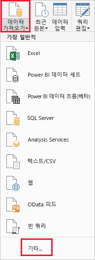
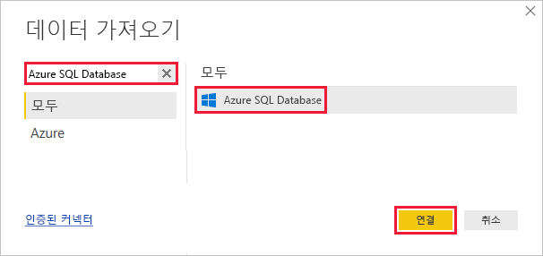
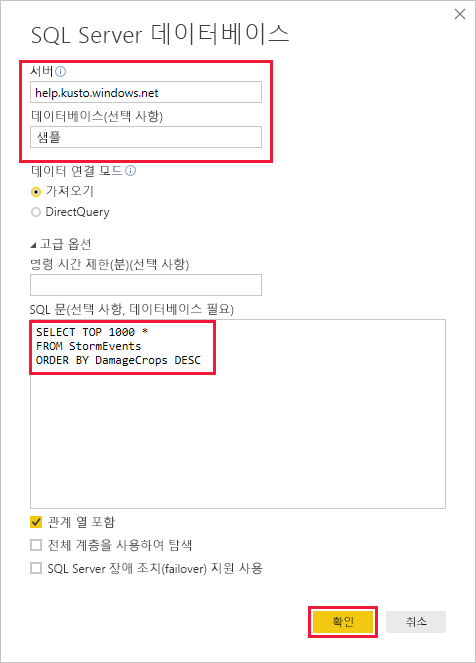
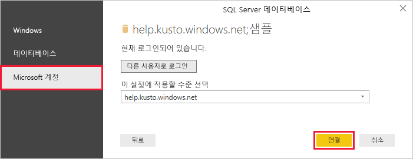
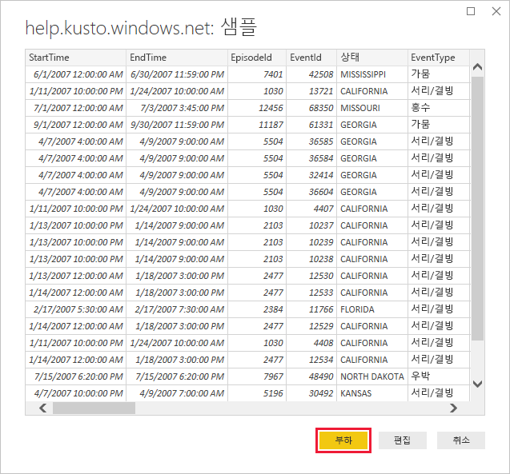

# <a name="visualize-data-using-the-azure-data-explorer-connector-for-power-bi"></a>Power BI용 Azure Data Explorer 커넥터를 사용하여 데이터 시각화

Azure 데이터 탐색기는 로그 및 원격 분석 데이터에 사용 가능한 빠르고 확장성이 우수한 데이터 탐색 서비스입니다. Power BI는 데이터를 시각화하고 조직 전체에서 결과를 공유할 수 있는 비즈니스 분석 솔루션입니다.

Azure Data Explorer는 Power BI에서 데이터에 연결하기 위한 세 가지 옵션, 즉 기본 제공 커넥터 사용, Azure Data Explorer에서 쿼리 가져오기 또는 SQL 쿼리 사용을 제공합니다. 이 문서에서는 SQL 쿼리를 사용 하 여 데이터를 가져와 Power BI 보고서에서 시각화 하는 방법을 보여 줍니다.

Azure 구독이 아직 없는 경우 시작하기 전에 [Azure 체험 계정](https://azure.microsoft.com/free/)을 만듭니다.

## <a name="prerequisites"></a>필수 조건

이 문서를 완료 하려면 다음이 필요 합니다.

* [Azure Data Explorer 도움말 클러스터](https://dataexplorer.azure.com/clusters/help/databases/samples)에 연결하기 위한 Active Directory 디렉터리의 구성원인 조직 이메일 계정

* [Power BI Desktop](https://powerbi.microsoft.com/get-started/)(**무료 다운로드** 선택)

## <a name="get-data-from-azure-data-explorer"></a>Azure Data Explorer에서 데이터 가져오기

먼저 Azure Data Explorer 도움말 클러스터에 연결한 후, *StormEvents* 테이블에서 데이터의 하위 세트를 불러옵니다. [!INCLUDE [data-explorer-storm-events](../../includes/data-explorer-storm-events.md)]

일반적으로 Azure Data Explorer에서 기본 쿼리 언어를 사용하지만 여기에서 사용되는 SQL 쿼리도 지원됩니다. Azure Data Explorer는 SQL 쿼리를 기본 쿼리로 변환합니다.

1. Power BI Desktop의 **홈** 탭에서 **데이터 가져오기**, **자세히**를 차례로 선택합니다.

    

1. *Azure SQL Database*를 검색하고 **Azure SQL Database**를 선택한 다음, **연결**을 선택합니다.

    

1. **SQL Server Database** 화면에서 다음 정보로 양식을 작성합니다.

    

    **설정** | **값** | **필드 설명**
    |---|---|---|
    | 서버 | *help.kusto.windows.net* | 도움말 클러스터의 URL입니다(*https://* 제외). 다른 클러스터의 경우 이 URL은 *\<ClusterName\>.\<Region\>.kusto.windows.net* 형식입니다. |
    | 데이터베이스 | *샘플* | 연결 중인 클러스터에서 호스트되는 샘플 데이터베이스입니다. |
    | 데이터 연결 모드 | *가져오기* | Power BI가 데이터를 가져올지 또는 데이터 원본에 직접 연결될지를 결정합니다. 이 커넥터에서는 두 옵션을 모두 사용할 수 있습니다. |
    | 명령 시간 제한 | 비워 둠 | 제한 오류를 throw하기 전에 쿼리가 실행되는 기간입니다. |
    | SQL 문 | 이 테이블 아래에 쿼리 복사 | Azure Data Explorer가 기본 쿼리로 변환하는 SQL 문입니다. |
    | 기타 옵션 | 기본값대로 유지 | 옵션이 Azure Data Explorer 클러스터에 적용되지 않습니다. |
    | | | |

    ```SQL
    SELECT TOP 1000 *
    FROM StormEvents
    ORDER BY DamageCrops DESC
    ```

1. 도움말 클러스터에 아직 연결되지 않은 경우 로그인합니다. Microsoft 계정으로 로그인한 다음, **연결**을 선택합니다.

    

1. **help.kusto.windows.net: 샘플** 화면에서 **로드**를 선택합니다.

    

    주 Power BI 창의 보고서 보기에서 테이블이 열립니다. 여기서 샘플 데이터를 기준으로 보고서를 만들 수 있습니다.

## <a name="visualize-data-in-a-report"></a>보고서의 데이터 시각화

[!INCLUDE [data-explorer-power-bi-visualize-basic](../../includes/data-explorer-power-bi-visualize-basic.md)]

## <a name="clean-up-resources"></a>리소스 정리

이 문서에 대해 작성 된 보고서를 더 이상 해야 하는 경우 Power BI Desktop (.pbix) 파일을 삭제 합니다.

## <a name="next-steps"></a>다음 단계

[Power BI에서 가져온된 쿼리를 사용 하 여 데이터 시각화](power-bi-connector.md)