# <a name="quickstart-query-data-in-azure-data-explorer"></a>빠른 시작: Azure Data Explorer에서 데이터 쿼리

Azure 데이터 탐색기는 로그 및 원격 분석 데이터에 사용 가능한 빠르고 확장성이 우수한 데이터 탐색 서비스입니다. Azure 데이터 탐색기에서는 쿼리를 실행하고 공유할 수 있는 웹 애플리케이션이 제공됩니다. 이 애플리케이션은 Azure Portal에서 그리고 독립 실행형 웹 애플리케이션으로 사용할 수 있습니다. 이 문서에서는 독립 실행형 버전을 사용합니다. 이 버전의 경우 여러 클러스터에 연결하고 쿼리에 대한 딥 링크를 공유할 수 있습니다.

Azure 구독이 아직 없는 경우 시작하기 전에 [Azure 체험 계정](https://azure.microsoft.com/free/)을 만듭니다.

## <a name="prerequisites"></a>필수 조건

이 빠른 시작을 완료하려면 Azure 구독 외에 [테스트 클러스터와 데이터베이스](create-cluster-database-portal.md)가 필요합니다.

## <a name="sign-in-to-the-application"></a>애플리케이션에 로그인합니다.

[애플리케이션](https://dataexplorer.azure.com/)에 로그인합니다.

## <a name="add-clusters"></a>클러스터 추가

애플리케이션을 처음 열 때는 연결이 없습니다.


쿼리 실행을 시작하려면 클러스터 하나 이상에 대한 연결을 추가해야 합니다. 이 섹션에서는 학습 지원을 위해 설정된 Azure 데이터 탐색기 *help 클러스터*와 이전 빠른 시작에서 사용자가 만든 테스트 클러스터에 대한 연결을 추가합니다.

1. 애플리케이션의 왼쪽 위에서 **클러스터 추가**를 선택합니다.

1. **클러스터 추가** 대화 상자에서 URI를 입력한 다음, **추가**를 선택합니다.

   `https://help.kusto.windows.net` help 클러스터 URI를 사용할 수 있습니다. 사용자 고유의 클러스터가 있는 경우 해당 클러스터의 URI를 제공합니다. 예를 들어 다음 이미지와 같이 `https://mydataexplorercluster.westus.kusto.windows.net`이 있습니다.

    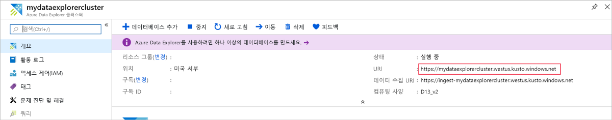

1. 이제 왼쪽 창에 **help** 클러스터가 표시됩니다. 액세스 권한이 있는 샘플 테이블을 확인할 수 있도록 **Samples** 데이터베이스를 확장합니다.

    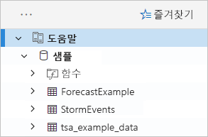

    이 빠른 시작의 뒷부분과 다른 Azure 데이터 탐색기 문서에서는 **StormEvents** 테이블을 사용합니다.

이제 사용자가 만든 테스트 클러스터를 추가 합니다.

1. **클러스터 추가**를 선택합니다.

1. **클러스터 추가** 대화 상자에 `https://<ClusterName>.<Region>.kusto.windows.net/` 형식으로 테스트 클러스터 URL을 입력하고 **추가**를 선택합니다.

    아래 예제에는 **help** 클러스터와 새 클러스터인 **docscluster.westus**(전체 URL: `https://docscluster.westus.kusto.windows.net/`)가 표시되어 있습니다.

    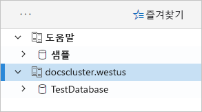

## <a name="run-queries"></a>쿼리 실행

이제 연결한 두 클러스터에 대해 쿼리를 실행할 수 있습니다(테스트 클러스터에 데이터가 있다고 가정함). 여기서는 **help** 클러스터를 중심으로 설명하겠습니다.

1. 왼쪽 창의 **help** 클러스터 아래에서 **Samples** 데이터베이스를 선택합니다.

1. 다음 쿼리를 복사하여 쿼리 창에 붙여넣습니다. 창 위쪽에서 **실행**을 선택합니다.

    ```Kusto
    StormEvents
    | sort by StartTime desc
    | take 10
    ```
    이 쿼리는 **StormEvents** 테이블에서 최신 레코드 10개를 반환합니다. 결과 왼쪽은 다음 테이블과 같이 표시됩니다.

    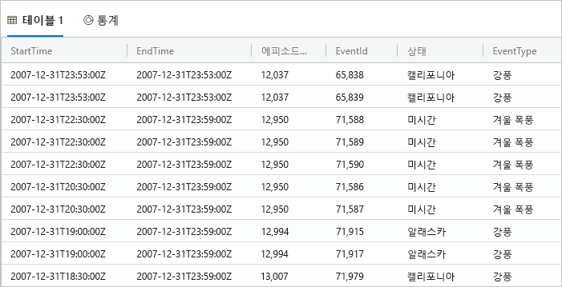

    다음 이미지에는 클러스터를 추가하고 쿼리를 실행하여 결과가 반환된 애플리케이션의 현재 상태가 나와 있습니다.

    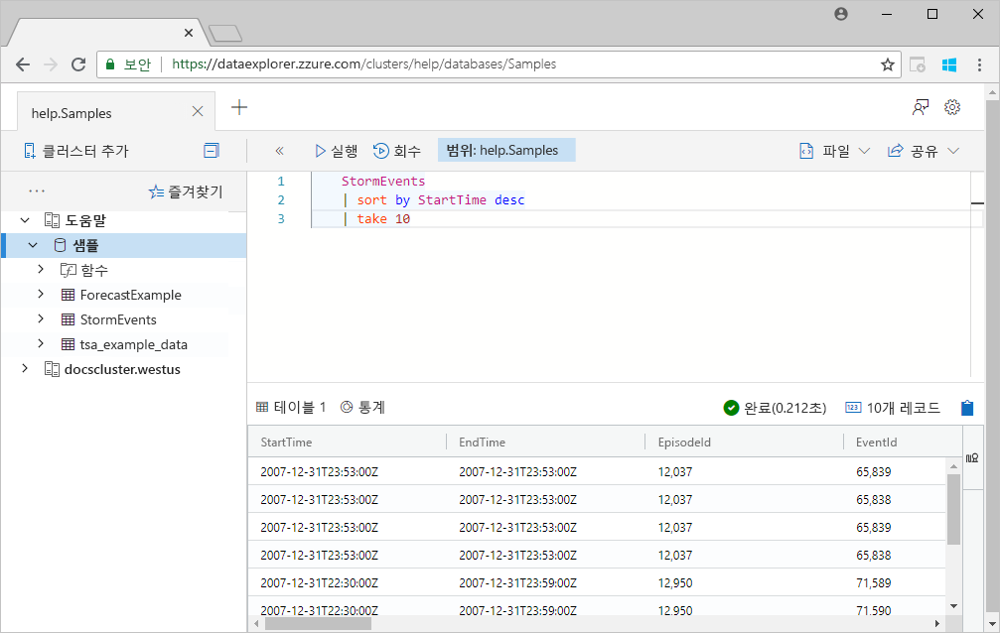

1. 다음 쿼리를 복사하여 쿼리 창에서 첫 번째 쿼리 아래에 붙여넣습니다. 이 쿼리는 첫 번째 쿼리처럼 개별 줄 형식이 아닙니다.

    ```Kusto
    StormEvents | sort by StartTime desc | project StartTime, EndTime, State, EventType, DamageProperty, EpisodeNarrative | take 10
    ```

1. 창에서 새 쿼리를 클릭하면 쿼리가 선택됩니다. Shift+Alt+F를 눌러 쿼리가 다음과 같이 표시되도록 서식을 지정합니다.

    

1. 쿼리 실행의 바로 가기인 Shift+Enter를 누릅니다.

   이 쿼리는 첫 번째 쿼리와 같은 레코드를 반환하지만 `project` 문에 지정된 열만 포함합니다. 결과는 다음 테이블과 같이 표시됩니다.

    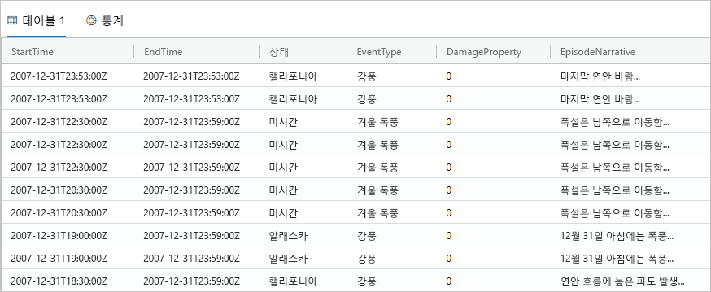

1. 쿼리 창 위쪽에서 **회수**를 선택합니다.

    그러면 쿼리를 다시 실행하지 않아도 이제 쿼리 창에 첫 번째 쿼리의 결과 집합이 표시됩니다. 분석 중에는 여러 쿼리를 실행하는 경우가 많은데, **회수**를 사용하면 이전 쿼리의 결과를 다시 표시할 수 있습니다.

1. 쿼리를 하나 더 실행하여 다른 출력 유형을 확인해 보겠습니다.

    ```Kusto
    StormEvents
    | summarize event_count=count(), mid = avg(BeginLat) by State
    | sort by mid
    | where event_count > 1800
    | project State, event_count
    | render columnchart
    ```
    결과는 다음 차트와 같이 표시됩니다.

    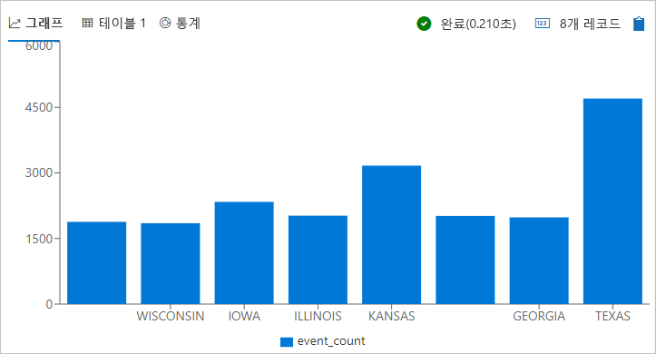

## <a name="work-with-the-table-grid"></a>테이블 모눈 사용

기본적인 쿼리의 작동 방식을 확인했으므로 테이블 모눈을 사용하여 결과를 사용자 지정하고 추가 분석을 수행하는 방법을 살펴보겠습니다.

1. 첫 번째 쿼리를 다시 실행합니다. **State** 열 위에 마우스를 놓고 메뉴를 선택한 다음 **그룹화 방법: State**를 선택합니다.

    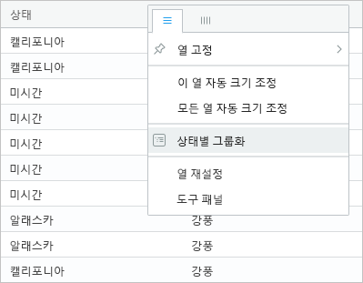

1. 모눈에서 **California**를 확장하여 해당 주의 레코드를 확인합니다.

    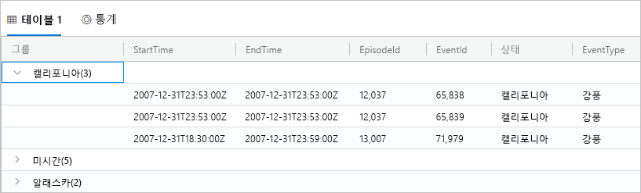

    이러한 유형의 그룹화는 예비 분석을 수행할 때 유용할 수 있습니다.

1. **Group** 열 위에 마우스를 놓고 **열 다시 설정**을 선택합니다.

    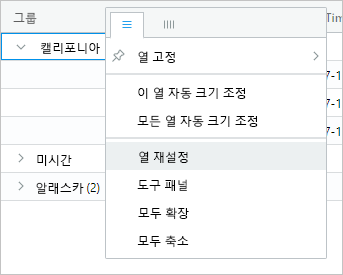

    그러면 모눈이 원래 상태로 돌아갑니다.

1. 다음 쿼리를 실행합니다.

    ```Kusto
    StormEvents
    | sort by StartTime desc
    | where DamageProperty > 5000
    | project StartTime, State, EventType, DamageProperty, Source
    | take 10
    ```

1. 모눈 오른쪽에서 **열**을 선택하여 도구 패널을 표시합니다.

    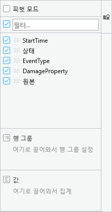

    Excel의 피벗 테이블 필드 목록과 비슷하게 작동하는 이 패널을 통해 모눈 자체에서 추가 분석을 수행할 수 있습니다.

1. **피벗 모드**를 선택한 다음, **State** 열을 **행 그룹**으로, **DamageProperty** 열을 **값**으로, **EventType** 열을 **열 레이블**로 각각 끕니다.  

    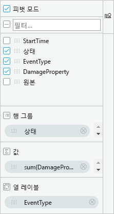

    결과는 다음 피벗 테이블과 같이 표시됩니다.

    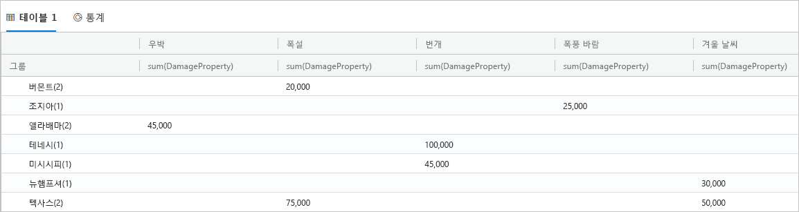

    Vermont와 Alabama에는 각각 같은 범주 아래에 이벤트가 두 개씩 있는 반면 Texas에는 서로 다른 범주 아래에 이벤트가 두 개 있습니다. 이러한 이벤트를 빠르게 파악할 수 있는 피벗 테이블은 신속한 분석에 효율적인 도구입니다.

## <a name="share-queries"></a>쿼리 공유

대부분의 경우에는 직접 만든 쿼리를 공유하게 됩니다. 클러스터 액세스 권한이 있는 다른 사용자들이 쿼리를 실행할 수 있도록 딥 링크를 제공할 수 있습니다.

1. 쿼리 창에서 복사한 첫 번째 쿼리를 선택합니다.

1. 쿼리 창 위쪽에서 **공유**를 선택합니다.

1. **쿼리를 클립보드에 연결**을 선택합니다.

1. 링크와 쿼리를 텍스트 파일에 복사합니다.

1. 새 브라우저 창에 링크를 붙여넣습니다. 쿼리가 실행된 후의 결과는 다음과 같이 표시됩니다.

    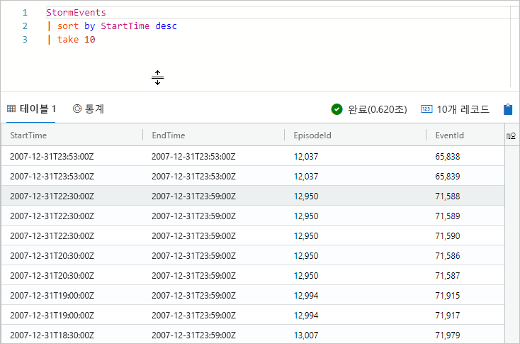

## <a name="provide-feedback"></a>피드백 제공

데이터 탐색기는 현재 미리 보기 상태입니다. Microsoft는 여러분의 사용 경험에 대한 피드백을 기다리고 있습니다. 지금 피드백을 제공할 수도 있고 데이터 탐색기를 더 사용해 본 후에 제공할 수도 있습니다.

1. 피드백을 제공하려면 애플리케이션 오른쪽 위의 피드백 아이콘을 선택합니다. .

1. 피드백을 입력하고 **제출**을 선택합니다.

## <a name="clean-up-resources"></a>리소스 정리

이 빠른 시작에서는 리소스를 만들지 않았지만, 애플리케이션에서 클러스터 중 하나 또는 둘 다 제거하려는 경우 클러스터를 마우스 오른쪽 단추로 클릭하고 **연결 제거**를 선택합니다.

## <a name="next-steps"></a>다음 단계

> [!div class="nextstepaction"]
> [Azure 데이터 탐색기용 쿼리 작성](write-queries.md)
