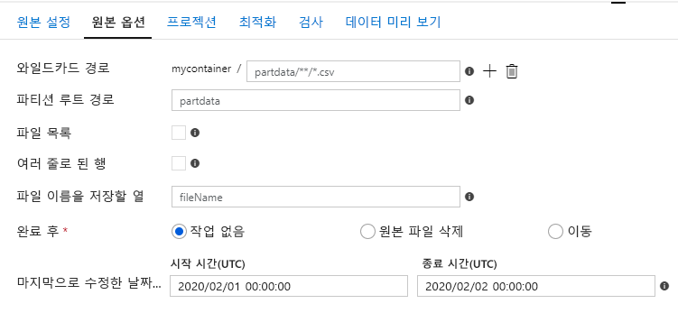
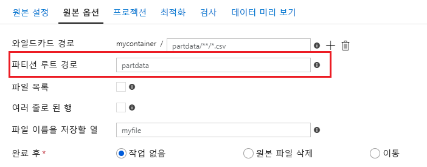
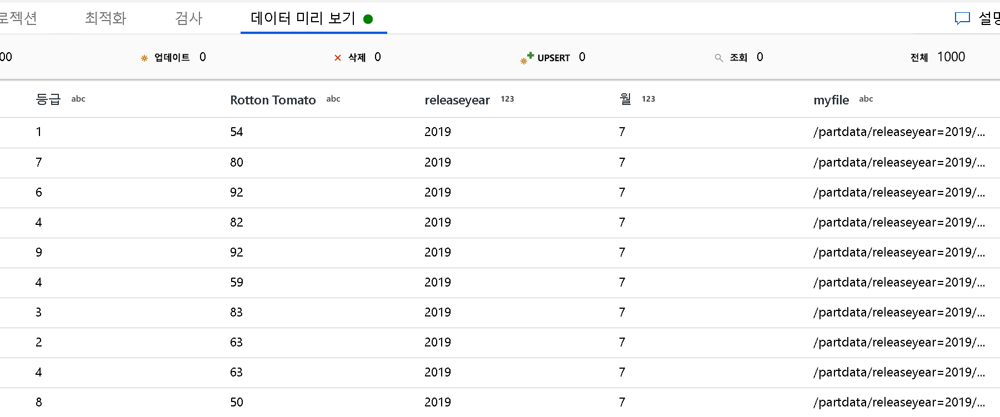
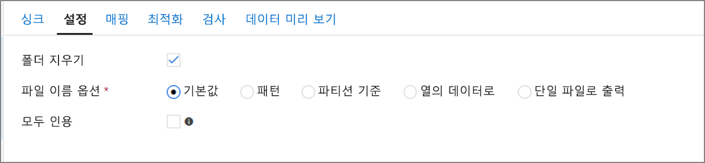

# <a name="copy-and-transform-data-in-azure-data-lake-storage-gen2-using-azure-data-factory"></a>Azure Data Factory를 사용하여 Azure Data Lake Storage Gen2에서 데이터 복사 및 변환

[!INCLUDE[appliesto-adf-asa-md](includes/appliesto-adf-asa-md.md)]

Azure Data Lake Storage Gen2(ADLS Gen2)는 [Azure Blob Storage](../storage/blobs/storage-blobs-introduction.md)를 기반으로 하는 빅 데이터 분석 전용 기능 집합입니다. 파일 시스템 및 개체 스토리지 패러다임을 모두 사용하여 데이터를 조작하는 데 이 기능을 이용할 수 있습니다.

이 문서에서는 Azure Data Factory의 복사 작업을 사용하여 Azure Data Lake Storage Gen2 간에 데이터를 복사하고, Data Flow를 사용하여 Azure Data Lake Storage Gen2에서 데이터를 변환하는 방법을 설명합니다. Azure Data Factory에 대해 자세히 알아보려면 [소개 문서](introduction.md)를 참조하세요.

>[!TIP]
>데이터 레이크 또는 데이터 웨어하우스 마이그레이션 시나리오를 통해 [Azure Data Factory를 사용하여 데이터 레이크 또는 데이터 웨어하우스의 데이터를 Azure로 마이그레이션하는 방법](data-migration-guidance-overview.md)에 대해 알아보세요.

## <a name="supported-capabilities"></a>지원되는 기능

이 Azure Data Lake Storage Gen2 커넥터는 다음과 같은 작업에 지원됩니다.

- [지원되는 원본/싱크 매트릭스](copy-activity-overview.md)를 사용한 [복사 작업](copy-activity-overview.md)
- [매핑 데이터 흐름](concepts-data-flow-overview.md)
- [조회 작업](control-flow-lookup-activity.md)
- [GetMetadata 작업](control-flow-get-metadata-activity.md)
- [삭제 작업](delete-activity.md)

복사 작업에서는 이 커넥터를 사용하여 다음을 수행할 수 있습니다.

- Azure 리소스 인증을 위해 계정 키, 서비스 주체 또는 관리 ID를 사용하여 Azure Data Lake Storage Gen2 간에 데이터를 복사합니다.
- 파일을 있는 그대로 복사하거나, [지원되는 파일 형식 및 압축 코덱](supported-file-formats-and-compression-codecs.md)을 사용하여 파일을 구문 분석 또는 생성합니다.
- [복사하는 동안 파일 메타데이터를 유지](#preserve-metadata-during-copy)합니다.
- Azure Data Lake Storage Gen1/Gen2에서 복사할 때 [ACL을 유지](#preserve-acls)합니다.

>[!IMPORTANT]
>Azure Storage 방화벽 설정에서 **Allow trusted Microsoft services to access this storage account**(신뢰할 수 있는 Microsoft 서비스가 이 스토리지 계정에 액세스하도록 허용)를 사용하도록 설정하고 Azure 통합 런타임을 Data Lake Storage Gen2에 연결하려면 ADLS Gen2에 대한 [관리 ID 인증](#managed-identity)을 사용해야 합니다.


## <a name="get-started"></a>시작하기

>[!TIP]
>Data Lake Storage Gen2 커넥터를 사용하는 방법에 대한 연습은 [Azure Data Lake Storage Gen2에 데이터 로드](load-azure-data-lake-storage-gen2.md)를 참조하세요.

[!INCLUDE [data-factory-v2-connector-get-started](../../includes/data-factory-v2-connector-get-started.md)]

다음 섹션에서는 Data Lake Storage Gen2에 지정된 Data Factory 엔터티를 정의하는 데 사용되는 속성에 대한 정보를 제공합니다.

## <a name="linked-service-properties"></a>연결된 서비스 속성

Azure Data Lake Storage Gen2 커넥터는 다음과 같은 인증 유형을 지원합니다. 자세한 내용은 해당 섹션을 참조하세요.

- [계정 키 인증](#account-key-authentication)
- [서비스 주체 인증](#service-principal-authentication)
- [Azure 리소스 인증용 관리 ID](#managed-identity)

>[!NOTE]
>PolyBase를 사용하여 데이터를 SQL Data Warehouse에 로드하는 경우 원본 Data Lake Storage Gen2가 Virtual Network 엔트포인트로 구성되어 있으면 PolyBase에서 요구하는 대로 관리 ID 인증을 사용해야 합니다. 추가 구성 필수 구성 요소가 있는 [관리 ID 인증](#managed-identity) 섹션을 참조하세요.

### <a name="account-key-authentication"></a>계정 키 인증

스토리지 계정 키 인증을 사용하는 데 지원되는 속성은 다음과 같습니다.

| 속성 | Description | 필수 |
|:--- |:--- |:--- |
| type | 형식 속성은 **AzureBlobFS**로 설정되어야 합니다. |예 |
| url | `https://<accountname>.dfs.core.windows.net`의 패턴을 포함한 Data Lake Storage Gen2의 엔드포인트입니다. | 예 |
| accountKey | Data Lake Storage Gen2의 계정 키입니다. 이 필드를 SecureString으로 표시하여 Data Factory에 안전하게 저장하거나 [Azure Key Vault에 저장되는 비밀을 참조](store-credentials-in-key-vault.md)합니다. |예 |
| connectVia | 데이터 저장소에 연결하는 데 사용할 [통합 런타임](concepts-integration-runtime.md)입니다. Azure 통합 런타임 또는 데이터 저장소가 프라이빗 네트워크에 있는 경우 자체 호스팅 통합 런타임을 사용할 수 있습니다. 이 속성을 지정하지 않으면 기본 Azure 통합 런타임이 사용됩니다. |예 |

>[!NOTE]
>계정 키 인증을 사용하는 경우 보조 ADLS 파일 시스템 엔드포인트가 지원되지 않습니다. 다른 인증 유형을 사용할 수 있습니다.

**예:**

```json
{
    "name": "AzureDataLakeStorageGen2LinkedService",
    "properties": {
        "type": "AzureBlobFS",
        "typeProperties": {
            "url": "https://<accountname>.dfs.core.windows.net", 
            "accountkey": { 
                "type": "SecureString", 
                "value": "<accountkey>" 
            }
        },
        "connectVia": {
            "referenceName": "<name of Integration Runtime>",
            "type": "IntegrationRuntimeReference"
        }
    }
}
```

### <a name="service-principal-authentication"></a>서비스 주체 인증

서비스 주체 인증을 사용하려면 다음 단계를 수행합니다.

1. [Azure AD(Azure Active Directory) 테넌트에 애플리케이션 등록](../storage/common/storage-auth-aad-app.md#register-your-application-with-an-azure-ad-tenant) 단계에 따라 Azure AD에 애플리케이션 엔터티를 등록합니다. 연결된 서비스를 정의하는 데 사용되므로 다음 값을 적어둡니다.

    - 애플리케이션 UI
    - 애플리케이션 키
    - 테넌트 ID

2. 서비스 주체에게 적절한 사용 권한을 부여합니다. [파일 및 디렉터리의 액세스 제어 목록](../storage/blobs/data-lake-storage-access-control.md#access-control-lists-on-files-and-directories)에서 Data Lake Storage Gen2의 권한 작동 방식에 대한 예제를 참조하세요.

    - **원본으로**: Storage Explorer에서 복사할 파일에 대한 **읽기** 권한과 함께 모든 업스트림 폴더 및 파일 시스템에 대해 최소한 **실행** 권한을 부여합니다. 또는 액세스 제어(IAM)에서 최소한 **Storage Blob 데이터 읽기 권한자** 역할을 부여합니다.
    - **싱크로**: Storage Explorer에서 싱크 폴더에 대한 **쓰기** 권한과 함께 모든 업스트림 폴더 및 파일 시스템에 대해 최소한 **실행** 권한을 부여합니다. 또는 액세스 제어(IAM)에서 최소한 **Storage Blob 데이터 기여자** 역할을 부여합니다.

>[!NOTE]
>Data Factory UI를 사용하여 작성하고 서비스 주체를 IAM의 "Storage Blob 데이터 읽기 권한자/기여자"로 설정하지 않은 경우, 연결을 테스트하거나 폴더를 검색/탐색할 때 "파일 경로에 대한 연결 테스트" 또는 "지정된 경로에서 찾아보기"를 선택하고 **읽기 + 실행** 권한이 있는 경로를 지정하여 계속 진행합니다.

연결된 서비스에 지원되는 속성은 다음과 같습니다.

| 속성 | Description | 필수 |
|:--- |:--- |:--- |
| type | 형식 속성은 **AzureBlobFS**로 설정되어야 합니다. |예 |
| url | `https://<accountname>.dfs.core.windows.net`의 패턴을 포함한 Data Lake Storage Gen2의 엔드포인트입니다. | 예 |
| servicePrincipalId | 애플리케이션의 클라이언트 ID를 지정합니다. | 예 |
| servicePrincipalKey | 애플리케이션의 키를 지정합니다. 이 필드를 `SecureString`으로 표시하여 Data Factory에서 안전하게 저장합니다. 또는 [Azure Key Vault에 저장된 비밀을 참조](store-credentials-in-key-vault.md)할 수 있습니다. | 예 |
| tenant | 애플리케이션이 있는 테넌트 정보(도메인 이름 또는 테넌트 ID)를 지정합니다. Azure 포털의 오른쪽 위 모서리를 마우스로 가리켜 검색합니다. | 예 |
| connectVia | 데이터 저장소에 연결하는 데 사용할 [통합 런타임](concepts-integration-runtime.md)입니다. Azure 통합 런타임 또는 데이터 저장소가 프라이빗 네트워크에 있는 경우 자체 호스팅 통합 런타임을 사용할 수 있습니다. 지정하지 않으면 기본 Azure 통합 런타임이 사용됩니다. |예 |

**예:**

```json
{
    "name": "AzureDataLakeStorageGen2LinkedService",
    "properties": {
        "type": "AzureBlobFS",
        "typeProperties": {
            "url": "https://<accountname>.dfs.core.windows.net", 
            "servicePrincipalId": "<service principal id>",
            "servicePrincipalKey": {
                "type": "SecureString",
                "value": "<service principal key>"
            },
            "tenant": "<tenant info, e.g. microsoft.onmicrosoft.com>" 
        },
        "connectVia": {
            "referenceName": "<name of Integration Runtime>",
            "type": "IntegrationRuntimeReference"
        }
    }
}
```

### <a name="managed-identities-for-azure-resources-authentication"></a><a name="managed-identity"></a>Azure 리소스 인증용 관리 ID

특정 데이터 팩터리를 나타내는 [Azure 리소스용 관리 ID](data-factory-service-identity.md)와 데이터 팩터리를 연결할 수 있습니다. 고유한 서비스 주체를 사용하는 것과 유사하게 Data Lake Store Gen2 인증에 이 관리 ID를 직접 사용할 수 있습니다. 이 지정된 팩터리는 Data Lake Store Gen2 간에서 데이터에 액세스하고 이를 복사할 수 있습니다.

Azure 리소스 인증에 관리 ID를 사용하려면 다음 단계를 수행합니다.

1. 팩터리와 함께 생성된 **관리 ID개체 ID**의 값을 복사하여 [Data Factory 관리 ID 정보를 검색](data-factory-service-identity.md#retrieve-managed-identity)합니다.

2. 적절한 사용 권한을 관리 ID에 부여합니다. [파일 및 디렉터리의 액세서 제어 목록](../storage/blobs/data-lake-storage-access-control.md#access-control-lists-on-files-and-directories)에서 Data Lake Storage Gen2의 권한 작동 방식에 대한 예제를 참조하세요.

    - **원본으로**: Storage Explorer에서 복사할 파일에 대한 **읽기** 권한과 함께 모든 업스트림 폴더 및 파일 시스템에 대해 최소한 **실행** 권한을 부여합니다. 또는 액세스 제어(IAM)에서 최소한 **Storage Blob 데이터 읽기 권한자** 역할을 부여합니다.
    - **싱크로**: Storage Explorer에서 싱크 폴더에 대한 **쓰기** 권한과 함께 모든 업스트림 폴더 및 파일 시스템에 대해 최소한 **실행** 권한을 부여합니다. 또는 액세스 제어(IAM)에서 최소한 **Storage Blob 데이터 기여자** 역할을 부여합니다.

>[!NOTE]
>Data Factory UI를 사용하여 작성하고 관리 ID를 IAM의 "Storage Blob 데이터 읽기 권한자/기여자" 역할로 설정하지 않은 경우, 연결을 테스트하거나 폴더를 검색/탐색할 때 "파일 경로에 대한 연결 테스트" 또는 "지정된 경로에서 찾아보기"를 선택하고 **읽기 + 실행** 권한이 있는 경로를 지정하여 계속 진행합니다.

>[!IMPORTANT]
>PolyBase를 사용 하 여 Data Lake Storage Gen2에서 SQL Data Warehouse로 데이터를 로드 하는 경우 Data Lake Storage Gen2에 대해 관리 id 인증을 사용 하는 경우 [이 가이드](../azure-sql/database/vnet-service-endpoint-rule-overview.md#impact-of-using-vnet-service-endpoints-with-azure-storage) 의 1 단계와 2 단계를 수행 해야 합니다. 또한 Azure Active Directory (Azure AD)를 사용 하 여 등록 하 고 2) 저장소 Blob 데이터 참가자 역할을 서버에 할당 합니다. 나머지는 Data Factory에 의해 처리 됩니다. Data Lake Storage Gen2가 Azure Virtual Network 엔드포인트로 구성되어 있어 PolyBase를 사용하여 데이터를 로드하는 경우 PolyBase에서 요구하는 대로 관리 ID 인증을 사용해야 합니다.

연결된 서비스에 지원되는 속성은 다음과 같습니다.

| 속성 | Description | 필수 |
|:--- |:--- |:--- |
| type | 형식 속성은 **AzureBlobFS**로 설정되어야 합니다. |예 |
| url | `https://<accountname>.dfs.core.windows.net`의 패턴을 포함한 Data Lake Storage Gen2의 엔드포인트입니다. | 예 |
| connectVia | 데이터 저장소에 연결하는 데 사용할 [통합 런타임](concepts-integration-runtime.md)입니다. Azure 통합 런타임 또는 데이터 저장소가 프라이빗 네트워크에 있는 경우 자체 호스팅 통합 런타임을 사용할 수 있습니다. 지정하지 않으면 기본 Azure 통합 런타임이 사용됩니다. |예 |

**예:**

```json
{
    "name": "AzureDataLakeStorageGen2LinkedService",
    "properties": {
        "type": "AzureBlobFS",
        "typeProperties": {
            "url": "https://<accountname>.dfs.core.windows.net", 
        },
        "connectVia": {
            "referenceName": "<name of Integration Runtime>",
            "type": "IntegrationRuntimeReference"
        }
    }
}
```

## <a name="dataset-properties"></a>데이터 세트 속성

데이터 세트 정의에 사용할 수 있는 섹션 및 속성의 전체 목록은 [데이터 세트](concepts-datasets-linked-services.md)를 참조하세요.

[!INCLUDE [data-factory-v2-file-formats](../../includes/data-factory-v2-file-formats.md)] 

형식 기반 데이터 세트의 `location` 설정에서 Data Lake Storage Gen2에 지원되는 속성은 다음과 같습니다.

| 속성   | Description                                                  | 필수 |
| ---------- | ------------------------------------------------------------ | -------- |
| type       | 데이터 세트의 `location`에 있는 type 속성은 **AzureBlobFSLocation**으로 설정되어야 합니다. | 예      |
| fileSystem | Data Lake Storage Gen2 파일 시스템 이름입니다.                              | 예       |
| folderPath | 지정된 파일 시스템의 폴더 경로입니다. 와일드카드를 사용하여 폴더를 필터링하려면 이 설정을 건너뛰고 작업 원본 설정에서 지정합니다. | 예       |
| fileName   | 지정된 fileSystem + folderPath의 파일 이름입니다. 와일드카드를 사용하여 파일을 필터링하려면 이 설정을 건너뛰고 작업 원본 설정에서 지정합니다. | 예       |

**예:**

```json
{
    "name": "DelimitedTextDataset",
    "properties": {
        "type": "DelimitedText",
        "linkedServiceName": {
            "referenceName": "<Data Lake Storage Gen2 linked service name>",
            "type": "LinkedServiceReference"
        },
        "schema": [ < physical schema, optional, auto retrieved during authoring > ],
        "typeProperties": {
            "location": {
                "type": "AzureBlobFSLocation",
                "fileSystem": "filesystemname",
                "folderPath": "folder/subfolder"
            },
            "columnDelimiter": ",",
            "quoteChar": "\"",
            "firstRowAsHeader": true,
            "compressionCodec": "gzip"
        }
    }
}
```

## <a name="copy-activity-properties"></a>복사 작업 속성

작업 정의에 사용할 수 있는 섹션 및 속성의 전체 목록은 [복사 작업 구성](copy-activity-overview.md#configuration)과 [파이프라인 및 작업](concepts-pipelines-activities.md) 문서를 참조하세요. 이 섹션에서는 Data Lake Storage Gen2 원본 및 싱크에서 지원하는 속성 목록을 제공합니다.

### <a name="azure-data-lake-storage-gen2-as-a-source-type"></a>원본 형식인 Azure Data Lake Storage Gen2

[!INCLUDE [data-factory-v2-file-formats](../../includes/data-factory-v2-file-formats.md)] 

ADLS Gen2에서 데이터를 복사할 수 있는 옵션이 몇 가지 있습니다.

- 데이터 세트에 지정된 경로에서 복사
- 폴더 경로 또는 파일 이름에 대한 와일드카드 필터(`wildcardFolderPath` 및 `wildcardFileName` 참조)
- 지정된 텍스트 파일에 정의된 파일을 파일 집합으로 복사(`fileListPath` 참조)

형식 기반 복사 원본의 `storeSettings` 설정에서 Data Lake Storage Gen2에 지원되는 속성은 다음과 같습니다.

| 속성                 | Description                                                  | 필수                                      |
| ------------------------ | ------------------------------------------------------------ | --------------------------------------------- |
| type                     | `storeSettings`의 type 속성은 **AzureBlobFSReadSettings**로 설정되어야 합니다. | 예                                           |
| ***복사할 파일 찾기:*** |  |  |
| 옵션 1: 정적 경로<br> | 지정된 파일 시스템 또는 데이터 세트에 지정된 폴더/파일 경로에서 복사합니다. 파일 시스템/폴더에서 모든 파일을 복사하려면 추가로 `wildcardFileName`을 `*`로 지정합니다. |  |
| 옵션 2: 와일드카드<br>- wildcardFolderPath | 원본 폴더를 필터링하도록 데이터 세트에 구성된, 지정된 파일 시스템 아래에 와일드카드 문자가 포함된 폴더 경로입니다. <br>허용되는 와일드카드는 `*`(0개 이상의 문자 일치) 및 `?`(0-1개의 문자 일치)입니다. 실제 폴더 이름에 와일드카드 또는 이 이스케이프 문자가 있는 경우 `^`을 사용하여 이스케이프합니다. <br>더 많은 예는 [폴더 및 파일 필터 예제](#folder-and-file-filter-examples)를 참조하세요. | 예                                            |
| 옵션 2: 와일드카드<br>- wildcardFileName | 소스 파일을 필터링하도록 지정된 파일 시스템 + folderPath/wildcardFolderPath 아래에 와일드카드 문자가 포함된 파일 이름입니다. <br>허용되는 와일드카드는 `*`(0개 이상의 문자 일치) 및 `?`(0-1개의 문자 일치)입니다. 실제 폴더 이름에 와일드카드 또는 이 이스케이프 문자가 있는 경우 `^`을 사용하여 이스케이프합니다.  더 많은 예는 [폴더 및 파일 필터 예제](#folder-and-file-filter-examples)를 참조하세요. | 예 |
| 옵션 3: 파일 목록<br>- fileListPath | 지정된 파일 집합을 복사함을 나타냅니다. 복사할 파일 목록이 포함 된 텍스트 파일을 가리키고, 데이터 집합에 구성 된 경로에 대 한 상대 경로인 한 줄에 하나씩 파일을 표시 합니다.<br/>이 옵션을 사용하는 경우 데이터 세트에서 파일 이름을 지정하지 마세요. [파일 목록 예제](#file-list-examples)에서 추가 예제를 참조하세요. |예 |
| ***추가 설정:*** |  | |
| recursive | 하위 폴더 또는 지정된 폴더에서만 데이터를 재귀적으로 읽을지 여부를 나타냅니다. recursive를 true로 설정하고 싱크가 파일 기반 저장소인 경우 빈 폴더 또는 하위 폴더가 싱크에 복사되거나 만들어지지 않습니다. <br>허용되는 값은 **true**(기본값) 및 **false**입니다.<br>`fileListPath`를 구성할 때에는 이 속성이 적용되지 않습니다. |예 |
| deleteFilesAfterCompletion | 대상 저장소로 이동한 후에 소스 저장소에서 이진 파일을 삭제할지 여부를 나타냅니다. 파일 삭제는 파일 단위 이므로 복사 작업에 실패 하면 일부 파일이 이미 대상에 복사 되 고 원본에서 삭제 된 것을 확인할 수 있습니다. 반면 다른 파일은 원본 저장소에 남아 있습니다. <br/>이 속성은 이진 복사 시나리오 에서만 유효 합니다. 여기에서 데이터 원본 저장소는 Blob, ADLS Gen1, ADLS Gen2, S3, Google 클라우드 저장소, 파일, Azure 파일, SFTP 또는 FTP입니다. 기본값은 false입니다. |아니요 |
| modifiedDatetimeStart    | 특성에 기반한 파일 필터링: 마지막으로 수정한 날짜 <br>마지막 수정 시간이 `modifiedDatetimeStart`와 `modifiedDatetimeEnd` 사이의 시간 범위 내에 있으면 파일이 선택됩니다. 시간은 UTC 표준 시간대에 "2018-12-01T05:00:00Z" 형식으로 적용됩니다. <br> 속성은 NULL 일 수 있습니다. 즉, 파일 특성 필터가 데이터 집합에 적용 되지 않습니다.  `modifiedDatetimeStart`에 datetime 값이 있지만 `modifiedDatetimeEnd`가 NULL이면, 마지막으로 수정된 특성이 datetime 값보다 크거나 같은 파일이 선택됩니다.  `modifiedDatetimeEnd`에 datetime 값이 있지만 `modifiedDatetimeStart`가 NULL이면, 마지막으로 수정된 특성이 datetime 값보다 작은 파일이 선택됩니다.<br/>`fileListPath`를 구성하는 경우에는 이 속성이 적용되지 않습니다. | 아니요                                            |
| modifiedDatetimeEnd      | 위와 동일합니다.                                               | 아니요                                            |
| maxConcurrentConnections | 스토리지 저장소에 동시에 연결할 수 있는 연결 수입니다. 데이터 저장소에 대한 동시 연결 수를 제한하려는 경우에만 지정합니다. | 아니요                                            |

**예:**

```json
"activities":[
    {
        "name": "CopyFromADLSGen2",
        "type": "Copy",
        "inputs": [
            {
                "referenceName": "<Delimited text input dataset name>",
                "type": "DatasetReference"
            }
        ],
        "outputs": [
            {
                "referenceName": "<output dataset name>",
                "type": "DatasetReference"
            }
        ],
        "typeProperties": {
            "source": {
                "type": "DelimitedTextSource",
                "formatSettings":{
                    "type": "DelimitedTextReadSettings",
                    "skipLineCount": 10
                },
                "storeSettings":{
                    "type": "AzureBlobFSReadSettings",
                    "recursive": true,
                    "wildcardFolderPath": "myfolder*A",
                    "wildcardFileName": "*.csv"
                }
            },
            "sink": {
                "type": "<sink type>"
            }
        }
    }
]
```

### <a name="azure-data-lake-storage-gen2-as-a-sink-type"></a>싱크 형식인 Azure Data Lake Storage Gen2

[!INCLUDE [data-factory-v2-file-formats](../../includes/data-factory-v2-file-formats.md)] 

형식 기반 복사 싱크의 `storeSettings` 설정에서 Data Lake Storage Gen2에 지원되는 속성은 다음과 같습니다.

| 속성                 | 설명                                                  | 필수 |
| ------------------------ | ------------------------------------------------------------ | -------- |
| type                     | `storeSettings` 아래의 type 속성은 **AzureBlobFSWriteSettings**로 설정되어야 합니다. | 예      |
| copyBehavior             | 원본이 파일 기반 데이터 저장소의 파일인 경우 복사 동작을 정의합니다.<br/><br/>허용된 값은<br/><b>- PreserveHierarchy(기본값)</b>: 대상 폴더에서 파일 계층 구조를 유지합니다. 원본 폴더의 원본 파일 상대 경로는 대상 폴더의 대상 파일 상대 경로와 동일합니다.<br/><b>- FlattenHierarchy</b>: 원본 폴더의 모든 파일이 대상 폴더의 첫 번째 수준에 있습니다. 대상 파일은 자동 생성된 이름을 갖습니다. <br/><b>- MergeFiles</b>: 원본 폴더의 모든 파일을 하나의 파일로 병합합니다. 파일 이름이 지정된 경우 병합되는 파일 이름은 지정된 이름입니다. 그렇지 않으면 자동 생성되는 파일 이름이 적용됩니다. | 예       |
| blockSizeInMB | ADLS Gen2에 데이터를 쓰는 데 사용되는 블록 크기(MB)를 지정합니다. [블록 Blob에 대해](https://docs.microsoft.com/rest/api/storageservices/understanding-block-blobs--append-blobs--and-page-blobs#about-block-blobs) 자세히 알아보세요. <br/>허용 되는 값은 **4mb에서 100 mb 사이**입니다. <br/>기본적으로 ADF는 원본 저장소 유형과 데이터에 따라 블록 크기를 자동으로 결정합니다. ADLS Gen2에 대 한 이진이 아닌 복사의 경우 기본 블록 크기는 최대 4.95 TB 데이터에 맞도록 100입니다. 데이터가 크지 않은 경우, 특히 네트워크 상태가 불량하여 작업 시간 초과 또는 성능 문제가 발생하는 자체 호스팅 IR을 사용하는 경우에는 최적이 아닐 수 있습니다. 블록 크기를 명시적으로 지정할 수는 있지만 blockSizeInMB*50000이 데이터를 저장할 수 있을 만큼 커야 합니다. 그러지 않으면 복사 작업 실행에 실패합니다. | 예 |
| maxConcurrentConnections | 데이터 저장소에 동시에 연결할 수 있는 연결 수입니다. 데이터 저장소에 대한 동시 연결 수를 제한하려는 경우에만 지정합니다. | 아니요       |

**예:**

```json
"activities":[
    {
        "name": "CopyToADLSGen2",
        "type": "Copy",
        "inputs": [
            {
                "referenceName": "<input dataset name>",
                "type": "DatasetReference"
            }
        ],
        "outputs": [
            {
                "referenceName": "<Parquet output dataset name>",
                "type": "DatasetReference"
            }
        ],
        "typeProperties": {
            "source": {
                "type": "<source type>"
            },
            "sink": {
                "type": "ParquetSink",
                "storeSettings":{
                    "type": "AzureBlobFSWriteSettings",
                    "copyBehavior": "PreserveHierarchy"
                }
            }
        }
    }
]
```

### <a name="folder-and-file-filter-examples"></a>폴더 및 파일 필터 예제

이 섹션에서는 와일드카드 필터가 있는 폴더 경로 및 파일 이름의 결과 동작에 대해 설명합니다.

| folderPath | fileName | recursive | 원본 폴더 구조 및 필터 결과(**굵게** 표시된 파일이 검색됨)|
|:--- |:--- |:--- |:--- |
| `Folder*` | (비어 있음, 기본값 사용) | false | FolderA<br/>&nbsp;&nbsp;&nbsp;&nbsp;**File1.csv**<br/>&nbsp;&nbsp;&nbsp;&nbsp;**File2.json**<br/>&nbsp;&nbsp;&nbsp;&nbsp;Subfolder1<br/>&nbsp;&nbsp;&nbsp;&nbsp;&nbsp;&nbsp;&nbsp;&nbsp;File3.csv<br/>&nbsp;&nbsp;&nbsp;&nbsp;&nbsp;&nbsp;&nbsp;&nbsp;File4.json<br/>&nbsp;&nbsp;&nbsp;&nbsp;&nbsp;&nbsp;&nbsp;&nbsp;File5.csv<br/>AnotherFolderB<br/>&nbsp;&nbsp;&nbsp;&nbsp;File6.csv |
| `Folder*` | (비어 있음, 기본값 사용) | true | FolderA<br/>&nbsp;&nbsp;&nbsp;&nbsp;**File1.csv**<br/>&nbsp;&nbsp;&nbsp;&nbsp;**File2.json**<br/>&nbsp;&nbsp;&nbsp;&nbsp;Subfolder1<br/>&nbsp;&nbsp;&nbsp;&nbsp;&nbsp;&nbsp;&nbsp;&nbsp;**File3.csv**<br/>&nbsp;&nbsp;&nbsp;&nbsp;&nbsp;&nbsp;&nbsp;&nbsp;**File4.json**<br/>&nbsp;&nbsp;&nbsp;&nbsp;&nbsp;&nbsp;&nbsp;&nbsp;**File5.csv**<br/>AnotherFolderB<br/>&nbsp;&nbsp;&nbsp;&nbsp;File6.csv |
| `Folder*` | `*.csv` | false | FolderA<br/>&nbsp;&nbsp;&nbsp;&nbsp;**File1.csv**<br/>&nbsp;&nbsp;&nbsp;&nbsp;File2.json<br/>&nbsp;&nbsp;&nbsp;&nbsp;Subfolder1<br/>&nbsp;&nbsp;&nbsp;&nbsp;&nbsp;&nbsp;&nbsp;&nbsp;File3.csv<br/>&nbsp;&nbsp;&nbsp;&nbsp;&nbsp;&nbsp;&nbsp;&nbsp;File4.json<br/>&nbsp;&nbsp;&nbsp;&nbsp;&nbsp;&nbsp;&nbsp;&nbsp;File5.csv<br/>AnotherFolderB<br/>&nbsp;&nbsp;&nbsp;&nbsp;File6.csv |
| `Folder*` | `*.csv` | true | FolderA<br/>&nbsp;&nbsp;&nbsp;&nbsp;**File1.csv**<br/>&nbsp;&nbsp;&nbsp;&nbsp;File2.json<br/>&nbsp;&nbsp;&nbsp;&nbsp;Subfolder1<br/>&nbsp;&nbsp;&nbsp;&nbsp;&nbsp;&nbsp;&nbsp;&nbsp;**File3.csv**<br/>&nbsp;&nbsp;&nbsp;&nbsp;&nbsp;&nbsp;&nbsp;&nbsp;File4.json<br/>&nbsp;&nbsp;&nbsp;&nbsp;&nbsp;&nbsp;&nbsp;&nbsp;**File5.csv**<br/>AnotherFolderB<br/>&nbsp;&nbsp;&nbsp;&nbsp;File6.csv |

### <a name="file-list-examples"></a>파일 목록 예

이 섹션에서는 복사 작업 원본에서 파일 목록 경로를 사용하는 경우의 결과 동작을 설명합니다.

원본 폴더 구조가 다음과 같고 굵게 표시된 파일을 복사하려는 것으로 가정합니다.

| 샘플 원본 구조                                      | FileListToCopy.txt의 콘텐츠                             | ADF 구성                                            |
| ------------------------------------------------------------ | --------------------------------------------------------- | ------------------------------------------------------------ |
| filesystem<br/>&nbsp;&nbsp;&nbsp;&nbsp;FolderA<br/>&nbsp;&nbsp;&nbsp;&nbsp;&nbsp;&nbsp;&nbsp;&nbsp;**File1.csv**<br/>&nbsp;&nbsp;&nbsp;&nbsp;&nbsp;&nbsp;&nbsp;&nbsp;File2.json<br/>&nbsp;&nbsp;&nbsp;&nbsp;&nbsp;&nbsp;&nbsp;&nbsp;Subfolder1<br/>&nbsp;&nbsp;&nbsp;&nbsp;&nbsp;&nbsp;&nbsp;&nbsp;&nbsp;&nbsp;&nbsp;&nbsp;**File3.csv**<br/>&nbsp;&nbsp;&nbsp;&nbsp;&nbsp;&nbsp;&nbsp;&nbsp;&nbsp;&nbsp;&nbsp;&nbsp;File4.json<br/>&nbsp;&nbsp;&nbsp;&nbsp;&nbsp;&nbsp;&nbsp;&nbsp;&nbsp;&nbsp;&nbsp;&nbsp;**File5.csv**<br/>&nbsp;&nbsp;&nbsp;&nbsp;메타데이터<br/>&nbsp;&nbsp;&nbsp;&nbsp;&nbsp;&nbsp;&nbsp;&nbsp;FileListToCopy.txt | File1.csv<br>Subfolder1/File3.csv<br>Subfolder1/File5.csv | **데이터 세트:**<br>- 파일 시스템: `filesystem`<br>- 폴더 경로: `FolderA`<br><br>**복사 작업 원본:**<br>- 파일 목록 경로: `filesystem/Metadata/FileListToCopy.txt` <br><br>파일 목록 경로는 복사하려는 파일 목록이 포함된 동일한 데이터 저장소에 있는 텍스트 파일을 가리키며, 데이터 세트에 구성된 경로의 상대 경로를 사용하여 한 줄에 하나씩 파일을 가리킵니다. |


### <a name="some-recursive-and-copybehavior-examples"></a>일부 recursive 및 copyBehavior 예제

이 섹션에서는 다양한 recursive 및 copyBehavior 값 조합에 대한 복사 작업의 결과 동작을 설명합니다.

| recursive | copyBehavior | 원본 폴더 구조 | 결과 대상 |
|:--- |:--- |:--- |:--- |
| true |preserveHierarchy | Folder1<br/>&nbsp;&nbsp;&nbsp;&nbsp;File1<br/>&nbsp;&nbsp;&nbsp;&nbsp;File2<br/>&nbsp;&nbsp;&nbsp;&nbsp;Subfolder1<br/>&nbsp;&nbsp;&nbsp;&nbsp;&nbsp;&nbsp;&nbsp;&nbsp;File3<br/>&nbsp;&nbsp;&nbsp;&nbsp;&nbsp;&nbsp;&nbsp;&nbsp;File4<br/>&nbsp;&nbsp;&nbsp;&nbsp;&nbsp;&nbsp;&nbsp;&nbsp;File5 | Folder1 대상이 다음과 같이 원본 폴더와 동일한 구조로 만들어집니다.<br/><br/>Folder1<br/>&nbsp;&nbsp;&nbsp;&nbsp;File1<br/>&nbsp;&nbsp;&nbsp;&nbsp;File2<br/>&nbsp;&nbsp;&nbsp;&nbsp;Subfolder1<br/>&nbsp;&nbsp;&nbsp;&nbsp;&nbsp;&nbsp;&nbsp;&nbsp;File3<br/>&nbsp;&nbsp;&nbsp;&nbsp;&nbsp;&nbsp;&nbsp;&nbsp;File4<br/>&nbsp;&nbsp;&nbsp;&nbsp;&nbsp;&nbsp;&nbsp;&nbsp;File5 |
| true |flattenHierarchy | Folder1<br/>&nbsp;&nbsp;&nbsp;&nbsp;File1<br/>&nbsp;&nbsp;&nbsp;&nbsp;File2<br/>&nbsp;&nbsp;&nbsp;&nbsp;Subfolder1<br/>&nbsp;&nbsp;&nbsp;&nbsp;&nbsp;&nbsp;&nbsp;&nbsp;File3<br/>&nbsp;&nbsp;&nbsp;&nbsp;&nbsp;&nbsp;&nbsp;&nbsp;File4<br/>&nbsp;&nbsp;&nbsp;&nbsp;&nbsp;&nbsp;&nbsp;&nbsp;File5 | Folder1 대상 폴더가 다음과 같은 구조로 만들어집니다. <br/><br/>Folder1<br/>&nbsp;&nbsp;&nbsp;&nbsp;File1에 대해 자동 생성된 이름<br/>&nbsp;&nbsp;&nbsp;&nbsp;File2에 대해 자동 생성된 이름<br/>&nbsp;&nbsp;&nbsp;&nbsp;File3에 대해 자동 생성된 이름<br/>&nbsp;&nbsp;&nbsp;&nbsp;File4에 대해 자동 생성된 이름<br/>&nbsp;&nbsp;&nbsp;&nbsp;File5에 대해 자동 생성된 이름 |
| true |mergeFiles | Folder1<br/>&nbsp;&nbsp;&nbsp;&nbsp;File1<br/>&nbsp;&nbsp;&nbsp;&nbsp;File2<br/>&nbsp;&nbsp;&nbsp;&nbsp;Subfolder1<br/>&nbsp;&nbsp;&nbsp;&nbsp;&nbsp;&nbsp;&nbsp;&nbsp;File3<br/>&nbsp;&nbsp;&nbsp;&nbsp;&nbsp;&nbsp;&nbsp;&nbsp;File4<br/>&nbsp;&nbsp;&nbsp;&nbsp;&nbsp;&nbsp;&nbsp;&nbsp;File5 | Folder1 대상 폴더가 다음과 같은 구조로 만들어집니다. <br/><br/>Folder1<br/>&nbsp;&nbsp;&nbsp;&nbsp;File1, File2, File3, File4 및 File5의 내용이 자동 생성된 파일 이름이 있는 하나의 파일로 병합됩니다. |
| false |preserveHierarchy | Folder1<br/>&nbsp;&nbsp;&nbsp;&nbsp;File1<br/>&nbsp;&nbsp;&nbsp;&nbsp;File2<br/>&nbsp;&nbsp;&nbsp;&nbsp;Subfolder1<br/>&nbsp;&nbsp;&nbsp;&nbsp;&nbsp;&nbsp;&nbsp;&nbsp;File3<br/>&nbsp;&nbsp;&nbsp;&nbsp;&nbsp;&nbsp;&nbsp;&nbsp;File4<br/>&nbsp;&nbsp;&nbsp;&nbsp;&nbsp;&nbsp;&nbsp;&nbsp;File5 | Folder1 대상 폴더가 다음과 같은 구조로 만들어집니다. <br/><br/>Folder1<br/>&nbsp;&nbsp;&nbsp;&nbsp;File1<br/>&nbsp;&nbsp;&nbsp;&nbsp;File2<br/><br/>File3, File4, File5가 포함된 Subfolder1은 선택되지 않습니다. |
| false |flattenHierarchy | Folder1<br/>&nbsp;&nbsp;&nbsp;&nbsp;File1<br/>&nbsp;&nbsp;&nbsp;&nbsp;File2<br/>&nbsp;&nbsp;&nbsp;&nbsp;Subfolder1<br/>&nbsp;&nbsp;&nbsp;&nbsp;&nbsp;&nbsp;&nbsp;&nbsp;File3<br/>&nbsp;&nbsp;&nbsp;&nbsp;&nbsp;&nbsp;&nbsp;&nbsp;File4<br/>&nbsp;&nbsp;&nbsp;&nbsp;&nbsp;&nbsp;&nbsp;&nbsp;File5 | Folder1 대상 폴더가 다음과 같은 구조로 만들어집니다. <br/><br/>Folder1<br/>&nbsp;&nbsp;&nbsp;&nbsp;File1에 대해 자동 생성된 이름<br/>&nbsp;&nbsp;&nbsp;&nbsp;File2에 대해 자동 생성된 이름<br/><br/>File3, File4, File5가 포함된 Subfolder1은 선택되지 않습니다. |
| false |mergeFiles | Folder1<br/>&nbsp;&nbsp;&nbsp;&nbsp;File1<br/>&nbsp;&nbsp;&nbsp;&nbsp;File2<br/>&nbsp;&nbsp;&nbsp;&nbsp;Subfolder1<br/>&nbsp;&nbsp;&nbsp;&nbsp;&nbsp;&nbsp;&nbsp;&nbsp;File3<br/>&nbsp;&nbsp;&nbsp;&nbsp;&nbsp;&nbsp;&nbsp;&nbsp;File4<br/>&nbsp;&nbsp;&nbsp;&nbsp;&nbsp;&nbsp;&nbsp;&nbsp;File5 | Folder1 대상 폴더가 다음과 같은 구조로 만들어집니다. <br/><br/>Folder1<br/>&nbsp;&nbsp;&nbsp;&nbsp;File1과 File2의 내용이 자동 생성된 파일 이름이 있는 하나의 파일로 병합됩니다. File1에 대해 자동 생성된 이름<br/><br/>File3, File4, File5가 포함된 Subfolder1은 선택되지 않습니다. |

## <a name="preserve-metadata-during-copy"></a>복사하는 동안 메타데이터 유지

Amazon S3/Azure Blob/Azure Data Lake Storage Gen2의 파일을 Azure Data Lake Storage Gen2/Azure Blob에 복사할 때 데이터와 함께 파일 메타데이터를 유지하도록 선택할 수 있습니다. [메타데이터 유지](copy-activity-preserve-metadata.md#preserve-metadata)에서 자세히 알아보세요.

## <a name="preserve-acls-from-data-lake-storage-gen1gen2"></a><a name="preserve-acls"></a> Data Lake Storage Gen1/Gen2에서 ACL 유지

Azure Data Lake Storage Gen1/Gen2의 파일을 Gen2에 복사할 때 데이터와 함께 POSIX ACL(액세스 제어 목록)을 유지하도록 선택할 수 있습니다. [Data Lake Storage Gen1/Gen2의 ACL을 Gen2에 유지](copy-activity-preserve-metadata.md#preserve-acls)에서 자세히 알아보세요.

>[!TIP]
>일반적으로 Azure Data Lake Storage Gen1의 데이터를 Gen2에 복사하려면 연습 및 모범 사례에서 [Azure Data Factory를 사용하여 Azure Data Lake Storage Gen1의 데이터를 Gen2에 복사](load-azure-data-lake-storage-gen2-from-gen1.md)를 참조하세요.

## <a name="mapping-data-flow-properties"></a>매핑 데이터 흐름 속성

데이터 흐름 매핑에서 데이터를 변환 하는 경우 다음 형식의 Azure Data Lake Storage Gen2에서 파일을 읽고 쓸 수 있습니다.
* [Avro](format-avro.md#mapping-data-flow-properties)
* [Common Data Model (미리 보기)](format-common-data-model.md#mapping-data-flow-properties)
* [구분된 텍스트](format-delimited-text.md#mapping-data-flow-properties)
* [델타](format-delta.md#mapping-data-flow-properties)
* [Excel](format-excel.md#mapping-data-flow-properties)
* [JSON](format-json.md#mapping-data-flow-properties)
* [Parquet](format-parquet.md#mapping-data-flow-properties)

서식 지정 설정은 해당 형식에 대 한 설명서에 있습니다. 자세한 내용은 데이터 흐름 매핑에서 데이터 흐름 매핑 및 [싱크 변환](data-flow-sink.md) [의 원본 변환](data-flow-source.md) 을 참조 하세요.

### <a name="source-transformation"></a>원본 변환

원본 변환 시 Azure Data Lake Storage Gen2의 컨테이너, 폴더 또는 개별 파일에서 읽을 수 있습니다. **원본 옵션** 탭을 사용하여 파일을 읽는 방법을 관리할 수 있습니다. 



**와일드카드 경로:** 와일드카드 패턴을 사용하면 ADF가 일치하는 각 폴더와 파일을 단일 원본 변환에서 반복하도록 지시합니다. 이는 단일 흐름 내에서 여러 파일을 처리하는 효과적인 방법입니다. 기존 와일드카드 패턴을 마우스로 가리키면 표시되는 + 기호를 사용하여 와일드카드 일치 패턴을 여러 개 추가합니다.

원본 컨테이너에서 패턴과 일치하는 일련의 파일을 선택합니다. 데이터 세트에는 컨테이너만 지정할 수 있습니다. 따라서 와일드카드 경로에는 루트 폴더의 폴더 경로도 포함되어야 합니다.

와일드카드 예제:

* ```*``` 모든 문자 집합 나타내기
* ```**``` 재귀 디렉터리 중첩 나타내기
* ```?``` 한 문자 바꾸기
* ```[]``` 괄호 안에 있는 하나 이상의 문자와 일치시키기

* ```/data/sales/**/*.csv``` /data/sales에서 csv 파일 모두 가져오기
* ```/data/sales/20??/**/``` 20세기의 파일 모두 가져오기
* ```/data/sales/*/*/*.csv``` /data/sales에서 csv 파일을 두 가지 수준으로 가져오기
* ```/data/sales/2004/*/12/[XY]1?.csv``` X 또는 Y 접두사가 두 자리 숫자로 시작하는 2004년 12월 자 csv 파일 모두 가져오기

**파티션 루트 경로:** 파일 원본에 ```key=value``` 형식으로 분할된 폴더(예: year=2019)가 있는 경우 해당 파티션 폴더 트리의 최상위 수준을 데이터 흐름 데이터 스트림의 열 이름에 할당할 수 있습니다.

먼저, 분할된 폴더와 읽으려는 리프 파일이 있는 경로를 모두 포함하도록 와일드카드를 설정합니다.



파티션 루트 경로 설정을 사용하여 폴더 구조의 최상위 수준을 정의합니다. 데이터 미리 보기를 통해 데이터 콘텐츠를 볼 때 ADF가 각 폴더 수준에서 찾은 확인된 파티션을 추가함을 확인할 수 있습니다.



**파일 목록:** 파일 집합입니다. 처리할 상대 경로 파일 목록이 포함된 텍스트 파일을 만듭니다. 이 텍스트 파일을 가리킵니다.

**파일 이름을 저장할 열:** 원본 파일의 이름을 데이터 열에 저장합니다. 파일 이름 문자열을 저장하려면 여기에 새 열 이름을 입력합니다.

**완료 후 기간(일):** 데이터 흐름이 실행된 후 원본 파일을 사용해 아무 작업도 수행하지 않도록 선택하거나, 원본 파일을 삭제 또는 이동합니다. 이동 경로는 상대 경로입니다.

원본 파일을 다른 위치에 후처리로 이동하려면 먼저 파일 작업에서 "이동"을 선택합니다. 그런 다음, "원본" 디렉터리를 설정합니다. 경로에 와일드카드를 사용하지 않을 경우 "원본" 설정은 원본 폴더와 같은 폴더에 있습니다.

와일드카드가 있는 원본 경로를 사용하는 경우 구문은 다음과 같습니다.

```/data/sales/20??/**/*.csv```

"원본"은 다음과 같이 지정할 수 있습니다.

```/data/sales```

"대상"은 다음과 같이 지정할 수 있습니다.

```/backup/priorSales```

이 경우 /data/sale 아래에 원본이 있는 모든 파일이 /backup/priorSales로 이동됩니다.

> [!NOTE]
> 파이프라인에서 Data Flow 실행 작업을 사용하는 파이프라인 실행(파이프라인 디버그 또는 실행)에서 데이터 흐름을 시작하는 경우에만 파일 작업이 실행됩니다. Data Flow 디버그 모드에서는 파일 작업이 실행되지 *않습니다.*

**마지막으로 수정한 사람 필터링:** 마지막으로 수정된 날짜 범위를 지정하여 처리하는 파일을 필터링할 수 있습니다. 모든 날짜-시간은 UTC 기준입니다. 

### <a name="sink-properties"></a>싱크 속성

싱크 변환에서 Azure Data Lake Storage Gen2의 컨테이너 또는 폴더에 쓸 수 있습니다. **설정** 탭을 사용하여 파일을 작성하는 방법을 관리할 수 있습니다.



**폴더 선택 취소:** 데이터를 쓰기 전에 대상 폴더를 지울 것인지 여부를 결정합니다.

**파일 이름 옵션:** 대상 폴더에서 대상 파일의 이름을 지정하는 방법을 결정합니다. 파일 이름 옵션은 다음과 같습니다.
   * **기본값**: Spark에서 PART 기본값에 따라 파일 이름을 지정하도록 허용합니다.
   * **패턴**: 파티션별로 출력 파일을 열거하는 패턴을 입력합니다. 예를 들어, **loans[n].csv**에서 loans1.csv, loans2.csv 등을 만듭니다.
   * **파티션 기준**: 파티션별 파일 이름을 입력합니다.
   * **열의 데이터로**: 출력 파일을 열 값으로 설정합니다. 경로는 대상 폴더가 아닌 데이터 세트 컨테이너를 기준으로 합니다. 데이터 세트에 폴더 경로가 있는 경우 재정의됩니다.
   * **단일 파일로 출력**: 분할된 출력 파일을 명명된 단일 파일로 결합합니다. 경로는 데이터 세트 폴더를 기준으로 합니다. 병합 작업은 노드 크기에 따라 실패할 수 있습니다. 이 옵션은 대용량의 데이터 세트에는 권장되지 않습니다.

**모두 인용:** 모든 값을 따옴표로 묶을 것인지 여부를 결정합니다.

## <a name="lookup-activity-properties"></a>조회 작업 속성

속성에 대한 자세한 내용을 보려면 [조회 작업](control-flow-lookup-activity.md)을 확인하세요.

## <a name="getmetadata-activity-properties"></a>GetMetadata 작업 속성

속성에 대한 자세한 내용을 보려면 [GetMetadata 작업](control-flow-get-metadata-activity.md)을 확인하세요. 

## <a name="delete-activity-properties"></a>삭제 작업 속성

속성에 대한 자세한 내용을 보려면 [삭제 작업](delete-activity.md)을 확인하세요.

## <a name="legacy-models"></a>레거시 모델

>[!NOTE]
>다음 모델은 이전 버전과의 호환성을 위해 그대로 계속 지원됩니다. 앞의 섹션에서 설명한 새 모델을 사용하는 것이 좋습니다. 그러면 ADF 작성 UI가 새 모델을 생성하도록 전환됩니다.

### <a name="legacy-dataset-model"></a>레거시 데이터 세트 모델

| 속성 | 설명 | 필수 |
|:--- |:--- |:--- |
| type | 데이터 세트의 형식 속성을 **AzureBlobFSFile**로 설정해야 합니다. |예 |
| folderPath | Data Lake Storage Gen2의 폴더 경로입니다. 지정하지 않으면 루트를 가리킵니다. <br/><br/>와일드카드 필터는 지원되지 않습니다. 허용되는 와일드카드는 `*`(문자 0자 이상 일치) 및 `?`(문자 0자 또는 1자 일치)입니다. 실제 폴더 이름에 와일드카드 또는 이 이스케이프 문자가 있는 경우 `^`를 사용하여 이스케이프합니다. <br/><br/>예: filesystem/folder/. 더 많은 예는 [폴더 및 파일 필터 예제](#folder-and-file-filter-examples)를 참조하세요. |아니요 |
| fileName | 지정된 "folderPath" 아래의 파일에 대한 이름 또는 와일드카드 필터입니다. 이 속성의 값을 지정하지 않으면 데이터 세트는 폴더에 있는 모든 파일을 가리킵니다. <br/><br/>필터의 경우 와일드카드에는 `*`(문자 0자 이상 일치) 및 `?`(문자 0자 또는 1자 일치)가 허용됩니다.<br/>- 예 1: `"fileName": "*.csv"`<br/>- 예 2: `"fileName": "???20180427.txt"`<br/>실제 파일 이름에 와일드카드 또는 이 이스케이프 문자가 있는 경우 `^`를 사용하여 이스케이프합니다.<br/><br/>fileName이 출력 데이터 세트에 대해 지정되지 않고 **preserveHierarchy**가 작업 싱크에 지정되지 않으면, 복사 작업은 다음과 같은 패턴으로 파일 이름을 자동으로 생성합니다. "*Data.[활동 실행 ID GUID].[FlattenHierarchy인 경우 GUID].[구성된 경우 형식].[구성된 경우 압축compression if configured]* ", 예: "Data.0a405f8a-93ff-4c6f-b3be-f69616f1df7a.txt.gz". 쿼리 대신 테이블 이름을 사용하여 테이블 형식 원본에서 복사하는 경우 이름 패턴은 " *[테이블 이름].[형식].[구성된 경우 압축]* "(예: "MyTable.csv")입니다. |아니요 |
| modifiedDatetimeStart | 마지막으로 수정한 특성에 따라 파일을 필터링합니다. 마지막 수정 시간이 `modifiedDatetimeStart`와 `modifiedDatetimeEnd`의 시간 범위 내에 있으면 파일이 선택됩니다. 시간은 UTC 표준 시간대에 "2018-12-01T05:00:00Z" 형식으로 적용됩니다. <br/><br/> 대용량 파일을 사용하여 파일을 필터링하려는 경우 이 설정을 사용하면 데이터 이동의 전반적인 성능이 영향을 받습니다. <br/><br/> 속성은 NULL일 수 있습니다. 이 경우 파일 특성 필터가 데이터 세트에 적용되지 않습니다. `modifiedDatetimeStart`에 datetime 값이 있지만 `modifiedDatetimeEnd`가 NULL이면, 마지막으로 수정된 특성이 datetime 값보다 크거나 같은 파일이 선택됩니다. `modifiedDatetimeEnd`에 datetime 값이 있지만 `modifiedDatetimeStart`가 NULL이면, 마지막으로 수정된 특성이 datetime 값보다 작은 파일이 선택됩니다.| 아니요 |
| modifiedDatetimeEnd | 마지막으로 수정한 특성에 따라 파일을 필터링합니다. 마지막 수정 시간이 `modifiedDatetimeStart`와 `modifiedDatetimeEnd`의 시간 범위 내에 있으면 파일이 선택됩니다. 시간은 UTC 표준 시간대에 "2018-12-01T05:00:00Z" 형식으로 적용됩니다. <br/><br/> 대용량 파일을 사용하여 파일을 필터링하려는 경우 이 설정을 사용하면 데이터 이동의 전반적인 성능이 영향을 받습니다. <br/><br/> 속성은 NULL일 수 있습니다. 이 경우 파일 특성 필터가 데이터 세트에 적용되지 않습니다. `modifiedDatetimeStart`에 datetime 값이 있지만 `modifiedDatetimeEnd`가 NULL이면, 마지막으로 수정된 특성이 datetime 값보다 크거나 같은 파일이 선택됩니다. `modifiedDatetimeEnd`에 datetime 값이 있지만 `modifiedDatetimeStart`가 NULL이면, 마지막으로 수정된 특성이 datetime 값보다 작은 파일이 선택됩니다.| 아니요 |
| format | 파일 기반 저장소(이진 복사본) 간에 파일을 있는 그대로 복사하려는 경우 입력 및 출력 데이터 세트 정의 둘 다에서 format 섹션을 건너뜁니다.<br/><br/>특정 형식의 파일을 구문 분석하거나 생성하려는 경우, 지원되는 파일 형식 유형은 **TextFormat**, **JsonFormat**, **AvroFormat**, **OrcFormat** 및 **ParquetFormat**입니다. **format**의 **type** 속성을 이 값 중 하나로 설정합니다. 자세한 내용은 [텍스트 형식](supported-file-formats-and-compression-codecs-legacy.md#text-format), [JSON 형식](supported-file-formats-and-compression-codecs-legacy.md#json-format), [Avro 형식](supported-file-formats-and-compression-codecs-legacy.md#avro-format), [ORC 형식](supported-file-formats-and-compression-codecs-legacy.md#orc-format) 및 [Parquet 형식](supported-file-formats-and-compression-codecs-legacy.md#parquet-format) 섹션을 참조하세요. |아니요(이진 복사 시나리오에만 해당) |
| 압축 | 데이터에 대한 압축 유형 및 수준을 지정합니다. 자세한 내용은 [지원되는 파일 형식 및 압축 코덱](supported-file-formats-and-compression-codecs-legacy.md#compression-support)을 참조하세요.<br/>지원되는 형식은 **GZip**, **Deflate**, **BZip2** 및 **ZipDeflate**입니다.<br/>**Optimal** 및 **Fastest** 수준이 지원됩니다. |예 |

>[!TIP]
>폴더 아래에서 모든 파일을 복사하려면 **folderPath**만을 지정합니다.<br>이름이 지정된 단일 파일을 복사하려면 폴더 부분으로 **folderPath**를, 파일 이름으로 **fileName**을 지정합니다.<br>폴더 아래에서 파일의 하위 집합을 복사하려면 폴더 부분으로 **folderPath**를, 와일드카드 필터로 **fileName**을 지정합니다. 

**예:**

```json
{
    "name": "ADLSGen2Dataset",
    "properties": {
        "type": "AzureBlobFSFile",
        "linkedServiceName": {
            "referenceName": "<Azure Data Lake Storage Gen2 linked service name>",
            "type": "LinkedServiceReference"
        },
        "typeProperties": {
            "folderPath": "myfilesystem/myfolder",
            "fileName": "*",
            "modifiedDatetimeStart": "2018-12-01T05:00:00Z",
            "modifiedDatetimeEnd": "2018-12-01T06:00:00Z",
            "format": {
                "type": "TextFormat",
                "columnDelimiter": ",",
                "rowDelimiter": "\n"
            },
            "compression": {
                "type": "GZip",
                "level": "Optimal"
            }
        }
    }
}
```

### <a name="legacy-copy-activity-source-model"></a>레거시 복사 작업 원본 모델

| 속성 | 설명 | 필수 |
|:--- |:--- |:--- |
| type | 복사 작업 원본의 형식 속성을 **AzureBlobFSSource**로 설정해야 합니다. |예 |
| recursive | 하위 폴더 또는 지정된 폴더에서만 데이터를 재귀적으로 읽을지 여부를 나타냅니다. recursive를 true로 설정하고 싱크가 파일 기반 저장소인 경우 빈 폴더 또는 하위 폴더가 싱크에 복사되거나 만들어지지 않습니다.<br/>허용되는 값은 **true**(기본값) 및 **false**입니다. | 예 |
| maxConcurrentConnections | 데이터 저장소에 동시에 연결할 수 있는 연결 수입니다. 데이터 저장소에 대한 동시 연결 수를 제한하려는 경우에만 지정합니다. | 아니요 |

**예:**

```json
"activities":[
    {
        "name": "CopyFromADLSGen2",
        "type": "Copy",
        "inputs": [
            {
                "referenceName": "<ADLS Gen2 input dataset name>",
                "type": "DatasetReference"
            }
        ],
        "outputs": [
            {
                "referenceName": "<output dataset name>",
                "type": "DatasetReference"
            }
        ],
        "typeProperties": {
            "source": {
                "type": "AzureBlobFSSource",
                "recursive": true
            },
            "sink": {
                "type": "<sink type>"
            }
        }
    }
]
```

### <a name="legacy-copy-activity-sink-model"></a>레거시 복사 작업 싱크 모델

| 속성 | 설명 | 필수 |
|:--- |:--- |:--- |
| type | 복사 작업 싱크의 형식 속성은 **AzureBlobFSSink**로 설정해야 합니다. |예 |
| copyBehavior | 원본이 파일 기반 데이터 저장소의 파일인 경우 복사 동작을 정의합니다.<br/><br/>허용된 값은<br/><b>- PreserveHierarchy(기본값)</b>: 대상 폴더에서 파일 계층 구조를 유지합니다. 원본 폴더의 원본 파일 상대 경로는 대상 폴더의 대상 파일 상대 경로와 동일합니다.<br/><b>- FlattenHierarchy</b>: 원본 폴더의 모든 파일이 대상 폴더의 첫 번째 수준에 있습니다. 대상 파일은 자동 생성된 이름을 갖습니다. <br/><b>- MergeFiles</b>: 원본 폴더의 모든 파일을 하나의 파일로 병합합니다. 파일 이름이 지정된 경우 병합되는 파일 이름은 지정된 이름입니다. 그렇지 않으면 자동 생성되는 파일 이름이 적용됩니다. | 예 |
| maxConcurrentConnections | 데이터 저장소에 동시에 연결할 수 있는 연결 수입니다. 데이터 저장소에 대한 동시 연결 수를 제한하려는 경우에만 지정합니다. | 아니요 |

**예:**

```json
"activities":[
    {
        "name": "CopyToADLSGen2",
        "type": "Copy",
        "inputs": [
            {
                "referenceName": "<input dataset name>",
                "type": "DatasetReference"
            }
        ],
        "outputs": [
            {
                "referenceName": "<ADLS Gen2 output dataset name>",
                "type": "DatasetReference"
            }
        ],
        "typeProperties": {
            "source": {
                "type": "<source type>"
            },
            "sink": {
                "type": "AzureBlobFSSink",
                "copyBehavior": "PreserveHierarchy"
            }
        }
    }
]
```

## <a name="next-steps"></a>다음 단계

Data Factory에서 복사 활동을 통해 원본 및 싱크로 지원되는 데이터 저장소의 목록은 [지원되는 데이터 저장소](copy-activity-overview.md#supported-data-stores-and-formats)를 참조하세요.
