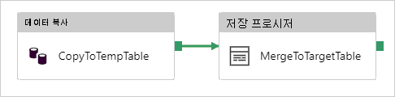

# <a name="copy-data-to-or-from-azure-sql-database-by-using-azure-data-factory"></a>Azure Data Factory를 사용하여 Azure SQL Database 간 데이터 복사
> [!div class="op_single_selector" title1="사용 중인 Azure Data Factory의 버전을 선택 합니다."]
> * [버전 1](v1/data-factory-azure-sql-connector.md)
> * [현재 버전](connector-azure-sql-database.md)

이 문서에서는 Azure SQL Database에서 데이터를 복사 하는 방법을 설명 합니다. Azure Data Factory에 대해 자세히 알아보려면 [소개 문서](introduction.md)를 참조하세요.

## <a name="supported-capabilities"></a>지원되는 기능

이 Azure SQL Database 커넥터는 다음 작업에 대 한 지원 됩니다.

- [복사 활동](copy-activity-overview.md) 사용 하 여 [원본/싱크 행렬 지원](copy-activity-overview.md) 테이블
- [데이터 흐름 매핑](concepts-data-flow-overview.md)
- [조회 작업](control-flow-lookup-activity.md)
- [GetMetadata 작업](control-flow-get-metadata-activity.md)

특히 이 Azure SQL Database 커넥터는 다음 함수를 지원합니다.

- Azure 리소스에 대 한 서비스 주체 또는 관리 되는 id를 사용 하 여 SQL 인증 및 Azure Active Directory (Azure AD) 응용 프로그램 토큰 인증을 사용 하 여 데이터를 복사 합니다.
- 원본으로 SQL 쿼리 또는 저장된 프로시저를 사용 하 여 데이터를 검색 합니다.
- 싱크로, 대상 테이블에 데이터를 추가 하거나 복사 하는 동안 사용자 지정 논리를 사용 하 여 저장된 프로시저를 호출 합니다.

>[!NOTE]
>Azure SQL Database [Always Encrypted](https://docs.microsoft.com/sql/relational-databases/security/encryption/always-encrypted-database-engine?view=azuresqldb-current) 이제이 커넥터에서 지원 되지 않습니다. 이 문제를 해결 하려면 사용을 [제네릭 ODBC 커넥터](connector-odbc.md) 및 자체 호스팅된 통합 런타임을 통해 SQL Server ODBC 드라이버. 따릅니다 [이 지침은](https://docs.microsoft.com/sql/connect/odbc/using-always-encrypted-with-the-odbc-driver?view=azuresqldb-current) ODBC 드라이버 다운로드 하 고 연결 문자열 구성으로 합니다.

> [!IMPORTANT]
> Azure Data Factory integration runtime을 사용 하 여 데이터를 복사 하는 경우 구성 프로그램 [Azure SQL Server 방화벽](https://msdn.microsoft.com/library/azure/ee621782.aspx#ConnectingFromAzure) Azure 서비스가 서버에 액세스할 수 있도록 합니다.
> 자체 호스팅된 통합 런타임을 사용 하 여 데이터를 복사 하는 경우 적절 한 IP 범위를 허용 하도록 Azure SQL Server 방화벽을 구성 합니다. 이 범위는 Azure SQL Database에 연결 하는 데 사용 되는 컴퓨터의 IP를 포함 합니다.

## <a name="get-started"></a>시작하기

[!INCLUDE [data-factory-v2-connector-get-started](../../includes/data-factory-v2-connector-get-started.md)]

다음 섹션에서는 Azure SQL Database 커넥터에 한정 되는 Azure Data Factory 엔터티를 정의 하는 데 사용 되는 속성에 대해 자세히 설명 합니다.

## <a name="linked-service-properties"></a>연결된 서비스 속성

Azure SQL Database 연결된 서비스에 대해 지원되는 속성은 다음과 같습니다.

| 자산 | 설명 | 필수 |
|:--- |:--- |:--- |
| type | **type** 속성은 **AzureSqlDatabase**로 설정해야 합니다. | 예 |
| connectionString | Azure SQL Database 인스턴스에 연결하는 데 필요한 정보를 **connectionString** 속성에 대해 지정합니다. <br/>이 필드를 표시 **SecureString** Azure Data Factory에 안전 하 게 저장 합니다. Azure Key Vault에 암호 또는 서비스 주체 키를 넣을 수도 있습니다. SQL 인증 인 경우 끌어오기는 `password` 연결 문자열에서 구성 합니다. 자세한 내용은 표의 다음 JSON 예제를 참조 하 고 [Azure Key Vault에 자격 증명을 저장](store-credentials-in-key-vault.md)합니다. | 예 |
| servicePrincipalId | 애플리케이션의 클라이언트 ID를 지정합니다. | 서비스 주체를 사용 하 여 Azure AD 인증을 사용 하는 경우 예 |
| servicePrincipalKey | 애플리케이션의 키를 지정합니다. 이 필드를 표시 **SecureString** Azure Data Factory에 안전 하 게 저장 하거나 [Azure Key Vault에 저장 된 비밀을 참조](store-credentials-in-key-vault.md). | 서비스 주체를 사용 하 여 Azure AD 인증을 사용 하는 경우 예 |
| tenant | 도메인 이름과 같은 테 넌 트 정보를 지정 하거나 테 넌 트 ID, 응용 프로그램이 상주 하는 합니다. Azure portal의 오른쪽 위 모서리에 마우스를 이동 하 여 검색 합니다. | 서비스 주체를 사용 하 여 Azure AD 인증을 사용 하는 경우 예 |
| connectVia | 이 [Integration Runtime](concepts-integration-runtime.md)은 데이터 저장소에 연결하는 데 사용됩니다. 데이터 저장소가 개인 네트워크에 있는 경우 Azure integration runtime 또는 자체 호스팅된 integration runtime을 사용할 수 있습니다. 지정 하지 않으면 기본 Azure integration runtime 사용 됩니다. | 아닙니다. |

다른 인증 형식의 경우, 각각의 필수 조건 및 JSON 샘플에 대한 다음 섹션을 참조하세요.

- [SQL 인증](#sql-authentication)
- [Azure AD 애플리케이션 토큰 인증: 서비스 주체](#service-principal-authentication)
- [Azure AD 애플리케이션 토큰 인증: Azure 리소스에 대한 관리 ID](#managed-identity)

>[!TIP]
>에 도달 하면 오류 코드: "UserErrorFailedToConnectToSqlServer" 오류가 및 메시지 "데이터베이스에 대 한 세션 제한 XXX는 및에 도달 했습니다."와 같은 추가 `Pooling=false` 연결 문자열을 다시 시도 하세요.

### <a name="sql-authentication"></a>SQL 인증

#### <a name="linked-service-example-that-uses-sql-authentication"></a>SQL 인증을 사용하는 연결된 서비스 예제

```json
{
    "name": "AzureSqlDbLinkedService",
    "properties": {
        "type": "AzureSqlDatabase",
        "typeProperties": {
            "connectionString": {
                "type": "SecureString",
                "value": "Server=tcp:<servername>.database.windows.net,1433;Database=<databasename>;User ID=<username>@<servername>;Password=<password>;Trusted_Connection=False;Encrypt=True;Connection Timeout=30"
            }
        },
        "connectVia": {
            "referenceName": "<name of Integration Runtime>",
            "type": "IntegrationRuntimeReference"
        }
    }
}
```

**Azure Key Vault의 암호** 

```json
{
    "name": "AzureSqlDbLinkedService",
    "properties": {
        "type": "AzureSqlDatabase",
        "typeProperties": {
            "connectionString": {
                "type": "SecureString",
                "value": "Server=tcp:<servername>.database.windows.net,1433;Database=<databasename>;User ID=<username>@<servername>;Trusted_Connection=False;Encrypt=True;Connection Timeout=30"
            },
            "password": { 
                "type": "AzureKeyVaultSecret", 
                "store": { 
                    "referenceName": "<Azure Key Vault linked service name>", 
                    "type": "LinkedServiceReference" 
                }, 
                "secretName": "<secretName>" 
            }
        },
        "connectVia": {
            "referenceName": "<name of Integration Runtime>",
            "type": "IntegrationRuntimeReference"
        }
    }
}
```

### <a name="service-principal-authentication"></a>서비스 주체 인증

서비스 주체 기반의 Azure AD 애플리케이션 토큰 인증을 사용하려면 다음 단계를 따르세요.

1. [Azure Active Directory 응용 프로그램 만들기](../active-directory/develop/howto-create-service-principal-portal.md#create-an-azure-active-directory-application) Azure portal에서 합니다. 애플리케이션 이름 및 연결된 서비스를 정의하는 다음 값을 적어 둡니다.

    - 애플리케이션 UI
    - 애플리케이션 키
    - 테넌트 ID

2. [Azure Active Directory 관리자 프로 비전](../sql-database/sql-database-aad-authentication-configure.md#provision-an-azure-active-directory-administrator-for-your-azure-sql-database-server) 아직 수행 하지 않은 경우 Azure portal에서 Azure SQL Server에 대 한 합니다. Azure AD 관리자는 Azure AD 사용자 또는 Azure AD 그룹이어야 하지만 서비스 주체일 수는 없습니다. 이 단계가 수행되면, 이후 단계에서 Azure AD ID를 사용하여 서비스 주체에 대한 포함된 데이터베이스 사용자를 만들 수 있습니다.

3. [포함 된 데이터베이스 사용자를 만듭니다](../sql-database/sql-database-aad-authentication-configure.md#create-contained-database-users-in-your-database-mapped-to-azure-ad-identities) 서비스 주체에 대 한 합니다. 데이터베이스를 Azure AD id를 사용 하 여 SQL Server Management Studio와 같은 도구를 사용 하 여 데이터를 복사 하려는에 연결할 ALTER ANY USER 권한입니다. 다음 T-SQL을 실행합니다. 
  
    ```sql
    CREATE USER [your application name] FROM EXTERNAL PROVIDER;
    ```

4. 일반적으로 수행 하듯이 SQL 사용자 또는 다른 사용자에 대 한 서비스 주체에 필요한 권한을 부여 합니다. 다음 코드를 실행 합니다. 더 많은 옵션을 참조 하세요 [이 문서](https://docs.microsoft.com/sql/relational-databases/system-stored-procedures/sp-addrolemember-transact-sql?view=sql-server-2017)합니다.

    ```sql
    EXEC sp_addrolemember [role name], [your application name];
    ```

5. Azure Data Factory에서 Azure SQL Database 연결 된 서비스를 구성 합니다.


#### <a name="linked-service-example-that-uses-service-principal-authentication"></a>서비스 주체 인증을 사용하는 연결된 서비스 예제

```json
{
    "name": "AzureSqlDbLinkedService",
    "properties": {
        "type": "AzureSqlDatabase",
        "typeProperties": {
            "connectionString": {
                "type": "SecureString",
                "value": "Server=tcp:<servername>.database.windows.net,1433;Database=<databasename>;Connection Timeout=30"
            },
            "servicePrincipalId": "<service principal id>",
            "servicePrincipalKey": {
                "type": "SecureString",
                "value": "<service principal key>"
            },
            "tenant": "<tenant info, e.g. microsoft.onmicrosoft.com>"
        },
        "connectVia": {
            "referenceName": "<name of Integration Runtime>",
            "type": "IntegrationRuntimeReference"
        }
    }
}
```

### <a name="managed-identity"></a>Azure 리소스 인증용 관리 ID

특정 데이터 팩터리를 나타내는 [Azure 리소스용 관리 ID](data-factory-service-identity.md)와 데이터 팩터리를 연결할 수 있습니다. Azure SQL Database 인증에 대 한 관리 되는이 id를 사용할 수 있습니다. 지정된 팩터리는 이 ID를 사용하여 데이터베이스의 데이터에 액세스하고 복사할 수 있습니다.

관리 되는 id 인증을 사용 하려면 다음이 단계를 수행 합니다.

1. [Azure Active Directory 관리자 프로 비전](../sql-database/sql-database-aad-authentication-configure.md#provision-an-azure-active-directory-administrator-for-your-azure-sql-database-server) 아직 수행 하지 않은 경우 Azure portal에서 Azure SQL Server에 대 한 합니다. Azure AD 관리자는 Azure AD 사용자 또는 Azure AD 그룹을 수 있습니다. 관리 되는 id 관리자 역할을 사용 하 여 그룹에 부여 하면 3-4 단계를 건너뜁니다. 관리자는 데이터베이스에 대 한 모든 권한을 갖습니다.

2. [포함 된 데이터베이스 사용자를 만듭니다](../sql-database/sql-database-aad-authentication-configure.md#create-contained-database-users-in-your-database-mapped-to-azure-ad-identities) Azure Data Factory에 대 한 관리 되는 id입니다. 데이터베이스를 Azure AD id를 사용 하 여 SQL Server Management Studio와 같은 도구를 사용 하 여 데이터를 복사 하려는에 연결할 ALTER ANY USER 권한입니다. 다음 T-SQL을 실행합니다. 
  
    ```sql
    CREATE USER [your Data Factory name] FROM EXTERNAL PROVIDER;
    ```

3. Data Factory 관리 id를 필요한 대로 사용 권한을 일반적으로 수행 SQL 사용자 및 다른 사용자에 대 한 권한을 부여 합니다. 다음 코드를 실행 합니다. 더 많은 옵션을 참조 하세요 [이 문서](https://docs.microsoft.com/sql/relational-databases/system-stored-procedures/sp-addrolemember-transact-sql?view=sql-server-2017)합니다.

    ```sql
    EXEC sp_addrolemember [role name], [your Data Factory name];
    ```

4. Azure Data Factory에서 Azure SQL Database 연결 된 서비스를 구성 합니다.

**예제**

```json
{
    "name": "AzureSqlDbLinkedService",
    "properties": {
        "type": "AzureSqlDatabase",
        "typeProperties": {
            "connectionString": {
                "type": "SecureString",
                "value": "Server=tcp:<servername>.database.windows.net,1433;Database=<databasename>;Connection Timeout=30"
            }
        },
        "connectVia": {
            "referenceName": "<name of Integration Runtime>",
            "type": "IntegrationRuntimeReference"
        }
    }
}
```

## <a name="dataset-properties"></a>데이터 세트 속성

섹션 및 데이터 집합 정의에 사용할 수 있는 속성의 전체 목록을 참조 하세요 [데이터 집합](https://docs.microsoft.com/azure/data-factory/concepts-datasets-linked-services)합니다. 이 섹션에서는 Azure SQL Database 데이터 세트에서 지원하는 속성 목록을 제공합니다.

또는 Azure SQL Database로 데이터를 복사 하는 다음 속성이 지원 됩니다.

| 자산 | 설명 | 필수 |
|:--- |:--- |:--- |
| type | 데이터 세트의 **type** 속성을 **AzureSqlTable**로 설정해야 합니다. | 예 |
| tableName | 연결된 서비스가 참조하는 Azure SQL Database 인스턴스의 테이블 또는 뷰 이름입니다. | 원본에는 아니요이고 싱크에는 예입니다 |

#### <a name="dataset-properties-example"></a>데이터 세트 속성 예제

```json
{
    "name": "AzureSQLDbDataset",
    "properties":
    {
        "type": "AzureSqlTable",
        "linkedServiceName": {
            "referenceName": "<Azure SQL Database linked service name>",
            "type": "LinkedServiceReference"
        },
        "schema": [ < physical schema, optional, retrievable during authoring > ],
        "typeProperties": {
            "tableName": "MyTable"
        }
    }
}
```

## <a name="copy-activity-properties"></a>복사 작업 속성

작업 정의에 사용할 수 있는 섹션 및 속성의 전체 목록은 [파이프라인](concepts-pipelines-activities.md)을 참조하세요. 이 섹션에서는 Azure SQL Database 원본 및 싱크에서 지원하는 속성 목록을 제공합니다.

### <a name="azure-sql-database-as-the-source"></a>Azure SQL Database가 원본인 경우

Azure SQL Database에서 데이터를 복사 하려면 합니다 **형식** 복사 활동 원본의 속성 **SqlSource**합니다. 복사 작업 **source** 섹션에서 다음 속성이 지원됩니다.

| 자산 | 설명 | 필수 |
|:--- |:--- |:--- |
| 형식 | 합니다 **형식** 복사 활동 source의 속성으로 설정 되어 있어야 **SqlSource**합니다. | 예 |
| sqlReaderQuery | 이 속성은 사용자 지정 SQL 쿼리를 사용하여 데이터를 읽습니다. 예는 `select * from MyTable`입니다. | 아닙니다. |
| sqlReaderStoredProcedureName | 원본 테이블에서 데이터를 읽는 저장 프로시저의 이름입니다. 마지막 SQL 문은 저장 프로시저의 SELECT 문이어야 합니다. | 아니오 |
| storedProcedureParameters | 저장 프로시저에 대한 매개 변수입니다.<br/>허용되는 값은 이름 또는 값 쌍입니다. 이름 및 대/소문자는 저장된 프로시저 매개 변수의 이름과 매개 변수는 대/소문자 구분 일치 해야 합니다. | 아닙니다. |

**주의할 사항:**

- 하는 경우 **sqlReaderQuery** 에 대해 지정 된 **SqlSource**, 복사 작업은 데이터를 가져오는 Azure SQL Database 원본에 대해이 쿼리를 실행 합니다. 저장 프로시저가 매개 변수를 사용하는 경우에는 **sqlReaderStoredProcedureName** 및 **storedProcedureParameters**를 지정하여 저장 프로시저를 지정할 수도 있습니다.
- 지정 하지 않으면 **sqlReaderQuery** 또는 **sqlReaderStoredProcedureName**, JSON 데이터 집합의 "structure" 섹션에 정의 된 열을 사용 하는 쿼리를 생성할 수 있습니다. 쿼리 `select column1, column2 from mytable` Azure SQL Database에 대해 실행 합니다. 데이터 세트 정의에 "structure"가 없는 경우 테이블에서 모든 열이 선택됩니다.

#### <a name="sql-query-example"></a>SQL 쿼리 예제

```json
"activities":[
    {
        "name": "CopyFromAzureSQLDatabase",
        "type": "Copy",
        "inputs": [
            {
                "referenceName": "<Azure SQL Database input dataset name>",
                "type": "DatasetReference"
            }
        ],
        "outputs": [
            {
                "referenceName": "<output dataset name>",
                "type": "DatasetReference"
            }
        ],
        "typeProperties": {
            "source": {
                "type": "SqlSource",
                "sqlReaderQuery": "SELECT * FROM MyTable"
            },
            "sink": {
                "type": "<sink type>"
            }
        }
    }
]
```

#### <a name="stored-procedure-example"></a>저장 프로시저 예제

```json
"activities":[
    {
        "name": "CopyFromAzureSQLDatabase",
        "type": "Copy",
        "inputs": [
            {
                "referenceName": "<Azure SQL Database input dataset name>",
                "type": "DatasetReference"
            }
        ],
        "outputs": [
            {
                "referenceName": "<output dataset name>",
                "type": "DatasetReference"
            }
        ],
        "typeProperties": {
            "source": {
                "type": "SqlSource",
                "sqlReaderStoredProcedureName": "CopyTestSrcStoredProcedureWithParameters",
                "storedProcedureParameters": {
                    "stringData": { "value": "str3" },
                    "identifier": { "value": "$$Text.Format('{0:yyyy}', <datetime parameter>)", "type": "Int"}
                }
            },
            "sink": {
                "type": "<sink type>"
            }
        }
    }
]
```

### <a name="stored-procedure-definition"></a>저장 프로시저 정의

```sql
CREATE PROCEDURE CopyTestSrcStoredProcedureWithParameters
(
    @stringData varchar(20),
    @identifier int
)
AS
SET NOCOUNT ON;
BEGIN
     select *
     from dbo.UnitTestSrcTable
     where dbo.UnitTestSrcTable.stringData != stringData
    and dbo.UnitTestSrcTable.identifier != identifier
END
GO
```

### <a name="azure-sql-database-as-the-sink"></a>Azure SQL Database가 싱크인 경우

> [!TIP]
> 지원 되는 쓰기 동작, 구성 및에서 모범 사례에 자세히 알아보려면 [모범 사례를 Azure SQL Database로 데이터를 로드 하기 위한](#best-practice-for-loading-data-into-azure-sql-database)합니다.

Azure SQL Database로 데이터를 복사 하려면 합니다 **형식** 복사 작업의 속성에 싱크 **SqlSink**합니다. 복사 작업 **sink** 섹션에서 다음 속성이 지원됩니다.

| 자산 | 설명 | 필수 |
|:--- |:--- |:--- |
| 형식 | 합니다 **형식** 복사 활동 sink의 속성으로 설정 되어 있어야 **SqlSink**합니다. | 예 |
| writeBatchSize | SQL 테이블에 삽입할 행 수가 *일괄 처리당*합니다.<br/> 허용되는 값은 **정수**(행 수)입니다. 기본적으로 Azure Data Factory는 행의 크기에 따라 적절 한 일괄 처리 크기를 동적으로 결정 합니다. | 아닙니다. |
| writeBatchTimeout | 시간 초과되기 전에 배치 삽입 작업을 완료하기 위한 대기 시간입니다.<br/> 허용되는 값은 **시간 범위**입니다. 예로 "00: 30:00" (30 분)입니다. | 아닙니다. |
| preCopyScript | Azure SQL Database로 데이터를 쓰기 전에 실행할 복사 작업에 대 한 SQL 쿼리를 지정 합니다. 복사 실행당 한 번만 호출됩니다. 이 속성을 사용하여 미리 로드된 데이터를 정리합니다. | 아닙니다. |
| sqlWriterStoredProcedureName | 원본 데이터를 대상 테이블에 적용하는 방법을 정의하는 저장 프로시저의 이름입니다. <br/>이 저장 프로시저는 *배치마다 호출*됩니다. 실행 하는 한 번만 수행 원본 데이터를 사용 하 여 예를 들어, delete 또는 관련이 없는 작업을 사용 합니다 `preCopyScript` 속성입니다. | 아닙니다. |
| storedProcedureParameters |저장 프로시저에 대한 매개 변수입니다.<br/>허용되는 값은 이름 및 값 쌍입니다. 매개 변수의 이름 및 대소문자와, 저장 프로시저 매개변수의 이름 및 대소문자와 일치해야 합니다. | 아닙니다. |
| sqlWriterTableType | 저장 프로시저에 사용할 테이블 형식 이름을 지정합니다. 복사 작업에서는 이동 하는 데이터를이 테이블 형식 사용 하 여 임시 테이블을 사용할 수 있습니다. 그러면 저장 프로시저 코드가 복사 중인 데이터를 기존 데이터와 병합할 수 있습니다. | 아닙니다. |

**예제 1: 데이터 추가**

```json
"activities":[
    {
        "name": "CopyToAzureSQLDatabase",
        "type": "Copy",
        "inputs": [
            {
                "referenceName": "<input dataset name>",
                "type": "DatasetReference"
            }
        ],
        "outputs": [
            {
                "referenceName": "<Azure SQL Database output dataset name>",
                "type": "DatasetReference"
            }
        ],
        "typeProperties": {
            "source": {
                "type": "<source type>"
            },
            "sink": {
                "type": "SqlSink",
                "writeBatchSize": 100000
            }
        }
    }
]
```

**예제 2: 복사 중 저장된 프로시저를 호출 합니다.**

자세한 내용은 [SQL 싱크에서 저장 프로시저 호출](#invoke-a-stored-procedure-from-a-sql-sink)을 참조하세요.

```json
"activities":[
    {
        "name": "CopyToAzureSQLDatabase",
        "type": "Copy",
        "inputs": [
            {
                "referenceName": "<input dataset name>",
                "type": "DatasetReference"
            }
        ],
        "outputs": [
            {
                "referenceName": "<Azure SQL Database output dataset name>",
                "type": "DatasetReference"
            }
        ],
        "typeProperties": {
            "source": {
                "type": "<source type>"
            },
            "sink": {
                "type": "SqlSink",
                "sqlWriterStoredProcedureName": "CopyTestStoredProcedureWithParameters",
                "sqlWriterTableType": "CopyTestTableType",
                "storedProcedureParameters": {
                    "identifier": { "value": "1", "type": "Int" },
                    "stringData": { "value": "str1" }
                }
            }
        }
    }
]
```

## <a name="best-practice-for-loading-data-into-azure-sql-database"></a>Azure SQL Database로 데이터를 로드 하기 위한 모범 사례

Azure SQL Database로 데이터를 복사할 때 다른 쓰기 동작이 필요할 수 있습니다.

- [추가](#append-data): 원본 데이터 내에 새 레코드만 있습니다.
- [Upsert](#upsert-data): 내 원본 데이터는 삽입 및 업데이트를 모두에 있습니다.
- [덮어쓰기](#overwrite-the-entire-table): 전체 차원 테이블을 매번 다시 로드 합니다.
- [사용자 지정 논리를 사용 하 여 작성](#write-data-with-custom-logic): 대상 테이블에 최종 삽입 전에 추가 처리가 필요합니다.

Azure Data Factory 및 모범 사례에 구성 하는 방법에 대 한 각 섹션을 참조 하세요.

### <a name="append-data"></a>데이터를 추가 합니다.

데이터를 추가 하는 것은이 Azure SQL Database 싱크 커넥터의 기본 동작입니다. Azure Data Factory에는 테이블에 효율적으로 쓸 대량 삽입을 수행 합니다. 소스를 구성 하 고 그에 따라 싱크 복사 작업의 합니다.

### <a name="upsert-data"></a>데이터 Upsert

**옵션 1:** 많은 양의 데이터를 복사, 간단한 삽입을 수행 하려면 다음 방법을 사용 하 여 설치한 경우: 

- 먼저 사용 하 여는 [데이터베이스 범위 임시 테이블](https://docs.microsoft.com/sql/t-sql/statements/create-table-transact-sql?view=azuresqldb-current#database-scoped-global-temporary-tables-azure-sql-database) 모든 레코드가 복사 작업을 사용 하 여 대량 로드 합니다. 데이터베이스 범위 임시 테이블에 대 한 작업 기록 되지 때문에 초에서 수백만 개의 레코드를 로드할 수 있습니다.
- 적용할 Azure Data Factory에서 저장된 프로시저 작업이 실행을 [병합](https://docs.microsoft.com/sql/t-sql/statements/merge-transact-sql?view=azuresqldb-current) 문이나 삽입/업데이트 합니다. 모두를 수행 하려면 소스를 단일 트랜잭션으로 삽입 하거나 업데이트 하는 대로 임시 테이블을 사용 합니다. 따라서에서 로그 작업과 왕복 수가 줄어듭니다. 저장된 프로시저 작업의 끝 다음 upsert 주기에 대 한 준비로 임시 테이블을 자를 수 있습니다.

예를 들어 Azure Data Factory를 만들 수 있습니다 사용 하는 파이프라인을 **복사 활동** 연계 하 여를 **저장 프로시저 작업**합니다. 이전의 복사 데이터 원본 저장소에서 Azure SQL Database 임시 테이블 예를 들어 **##UpsertTempTable**, 데이터 집합의 테이블 이름으로 합니다. 그런 다음 후자의 경우 임시 테이블에서 데이터 원본에서 대상 테이블로 병합 하 고 임시 테이블을 정리 하는 저장된 프로시저를 호출 합니다.



데이터베이스에서 이전 저장된 프로시저 활동에서 지정 하는 다음 예제와 같이 병합 논리를 사용 하 여 저장된 프로시저를 정의 합니다. 대상 있다고 가정 합니다 **마케팅** 세 열이 있는 테이블: **ProfileID**, **State** 및 **Category**. 기준으로 upsert를 수행 합니다 **ProfileID** 열입니다.

```sql
CREATE PROCEDURE [dbo].[spMergeData]
AS
BEGIN
    MERGE TargetTable AS target
    USING ##UpsertTempTable AS source
    ON (target.[ProfileID] = source.[ProfileID])
    WHEN MATCHED THEN
        UPDATE SET State = source.State
    WHEN NOT matched THEN
        INSERT ([ProfileID], [State], [Category])
      VALUES (source.ProfileID, source.State, source.Category);
    
    TRUNCATE TABLE ##UpsertTempTable
END
```

**옵션 2:** 또한 하도록 선택할 수 있습니다 [복사 작업 내에서 저장된 프로시저를 호출](#invoke-a-stored-procedure-from-a-sql-sink)합니다. 이 방법은 대규모 upsert에 적절 하지 않습니다는 복사 작업의 경우에 기본 접근 방식으로 대량 삽입을 사용 하는 대신 원본 테이블의 각 행을 실행 합니다.

### <a name="overwrite-the-entire-table"></a>전체 테이블 덮어쓰기

구성할 수 있습니다 합니다 **preCopyScript** 복사 활동 sink의 속성입니다. 이 경우 실행 되는 각 복사 작업의 Azure Data Factory 스크립트를 먼저 실행 합니다. 그런 다음 데이터를 삽입 하려면 복사본을 실행 합니다. 예를 들어 최신 데이터를 사용 하 여 전체 테이블을 덮어쓰려면 원본에서 새 데이터를 로드 하는 대량 전에 먼저 모든 레코드를 삭제 하는 스크립트를 지정 합니다.

### <a name="write-data-with-custom-logic"></a>사용자 지정 논리를 사용 하 여 데이터를 작성 합니다.

사용자 지정 논리를 사용 하 여 데이터를 작성 하는 단계에 설명 된 비슷합니다는 [Upsert 데이터](#upsert-data) 섹션입니다. 적용 해야 할 때 대규모 확장에 대 한 대상 테이블에 원본 데이터의 최종 삽입 전에 처리 추가 하면 두 가지 중 하나:

- 데이터베이스 범위 임시 테이블에 로드 하 고 저장된 프로시저를 호출 합니다. 
- 복사 중 저장된 프로시저를 호출 합니다.

## <a name="invoke-a-stored-procedure-from-a-sql-sink"></a> SQL 싱크에서 저장 프로시저 호출

Azure SQL Database로 데이터를 복사할 때 구성 하 고 추가 매개 변수를 사용 하 여 사용자 지정 저장된 프로시저를 호출할 수 있습니다.

> [!TIP]
> 대량 복사에 대 한 권장 하지 않습니다는 대량 작업을 사용 하 여 데이터 대신 행 단위로 처리 저장된 프로시저를 호출 합니다. 자세히 알아보세요 [모범 사례를 Azure SQL Database로 데이터를 로드 하기 위한](#best-practice-for-loading-data-into-azure-sql-database)합니다.

기본 제공 복사 메커니즘이 용도에 적합하지 않은 경우, 저장 프로시저를 사용할 수 있습니다. 예에는 대상 테이블에 원본 데이터의 최종 삽입 전에 추가 처리를 적용 하려는 경우입니다. 추가 처리 예 열 병합, 추가 값을 조회 및 둘 이상의 테이블에 삽입 하려는 경우에 속합니다.

다음 샘플에서는 저장 프로시저를 사용하여 Azure SQL Database의 테이블에 upsert(업데이트/삽입)를 수행하는 방법을 보여 줍니다. 가정 입력된 데이터와 싱크 **마케팅** 테이블에는 각 3 개 열이 있어야 합니다. **ProfileID**, **State** 및 **Category**. **ProfileID** 열을 기준으로 upsert(업데이트/삽입)를 수행하고 특정 범주에 대해서만 적용합니다.

**출력 데이터 집합:** "TableName" 다음 저장된 프로시저 스크립트에 표시 된 것과 같이 저장된 프로시저에서 테이블 형식 매개 변수 이름이 같은입니다.

```json
{
    "name": "AzureSQLDbDataset",
    "properties":
    {
        "type": "AzureSqlTable",
        "linkedServiceName": {
            "referenceName": "<Azure SQL Database linked service name>",
            "type": "LinkedServiceReference"
        },
        "typeProperties": {
            "tableName": "Marketing"
        }
    }
}
```

정의 된 **SQL 싱크** 다음과 같이 복사 작업의 섹션:

```json
"sink": {
    "type": "SqlSink",
    "SqlWriterTableType": "MarketingType",
    "SqlWriterStoredProcedureName": "spOverwriteMarketing",
    "storedProcedureParameters": {
        "category": {
            "value": "ProductA"
        }
    }
}
```

데이터베이스에서 **SqlWriterStoredProcedureName**과 동일한 이름으로 저장 프로시저를 정의합니다. 지정된 원본의 입력 데이터를 처리하고 출력 테이블에 병합합니다. 매개 변수는 저장된 프로시저에서 테이블 형식의 이름은 동일 **tableName** 데이터 집합의 정의 합니다.

```sql
CREATE PROCEDURE spOverwriteMarketing @Marketing [dbo].[MarketingType] READONLY, @category varchar(256)
AS
BEGIN
  MERGE [dbo].[Marketing] AS target
  USING @Marketing AS source
  ON (target.ProfileID = source.ProfileID and target.Category = @category)
  WHEN MATCHED THEN
      UPDATE SET State = source.State
  WHEN NOT MATCHED THEN
      INSERT (ProfileID, State, Category)
      VALUES (source.ProfileID, source.State, source.Category);
END
```

데이터베이스에서 동일한 이름 사용 하 여 테이블 형식 정의 **sqlWriterTableType**합니다. 테이블 형식의 스키마는 입력 데이터에서 반환된 스키마와 같아야 합니다.

```sql
CREATE TYPE [dbo].[MarketingType] AS TABLE(
    [ProfileID] [varchar](256) NOT NULL,
    [State] [varchar](256) NOT NULL,
    [Category] [varchar](256) NOT NULL
)
```

저장 프로시저 기능은 [테이블 반환 매개 변수](https://msdn.microsoft.com/library/bb675163.aspx)을 활용합니다.

## <a name="mapping-data-flow-properties"></a>데이터 흐름 속성 매핑

자세한 내용은 [소스 변환](data-flow-source.md) 하 고 [변환 싱크](data-flow-sink.md) 데이터 흐름 매핑.

## <a name="data-type-mapping-for-azure-sql-database"></a>Azure SQL Database에 대한 데이터 형식 매핑

또는 Azure SQL Database로 데이터를 복사 하면 Azure Data Factory 중간 데이터 형식에 Azure SQL Database 데이터 형식에서 다음과 같은 매핑이 사용 됩니다. 복사 활동에서 원본 스키마와 데이터 형식을 싱크에 매핑하는 방법에 대한 자세한 내용은 [스키마 및 데이터 형식 매핑](copy-activity-schema-and-type-mapping.md)을 참조하세요.

| Azure SQL Database 데이터 형식 | Azure Data Factory 중간 데이터 형식 |
|:--- |:--- |
| bigint |Int64 |
| binary |Byte[] |
| bit |Boolean |
| char |String, Char[] |
| date |Datetime |
| Datetime |Datetime |
| datetime2 |Datetime |
| Datetimeoffset |DateTimeOffset |
| Decimal |Decimal |
| FILESTREAM attribute (varbinary(max)) |Byte[] |
| Float |Double |
| image |Byte[] |
| int |Int32 |
| money |Decimal |
| nchar |String, Char[] |
| ntext |String, Char[] |
| numeric |Decimal |
| nvarchar |String, Char[] |
| real |Single |
| rowversion |Byte[] |
| smalldatetime |Datetime |
| smallint |Int16 |
| smallmoney |Decimal |
| sql_variant |Object |
| 텍스트 |String, Char[] |
| time |TimeSpan |
| timestamp |Byte[] |
| tinyint |Byte |
| uniqueidentifier |Guid |
| varbinary |Byte[] |
| varchar |String, Char[] |
| xml |Xml |

>[!NOTE]
> 10진수 중간 형식으로 매핑되는 데이터 형식의 경우 Azure Data Factory는 현재 최대 28자리의 데이터를 지원합니다. 데이터 전체 자릿수가 28 보다 큰 경우에 SQL 쿼리에서를 문자열로 변환 하는 것이 좋습니다.

## <a name="next-steps"></a>다음 단계
Azure Data Factory의 복사 작업은 원본 및 싱크로 지원 되는 데이터 저장소 목록은 참조 하세요 [지원 되는 데이터 저장소 및 형식](copy-activity-overview.md##supported-data-stores-and-formats)합니다.
