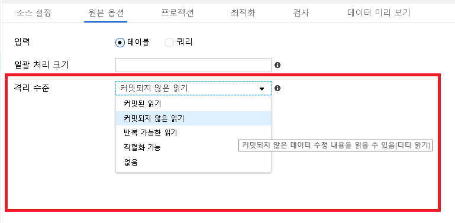
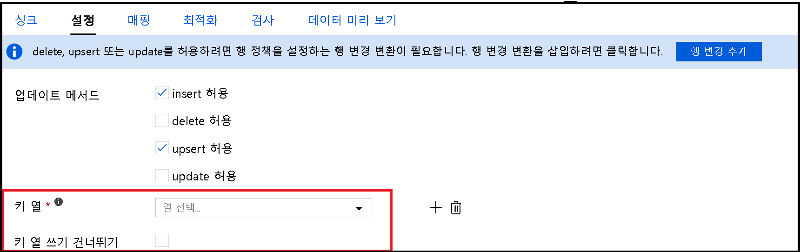
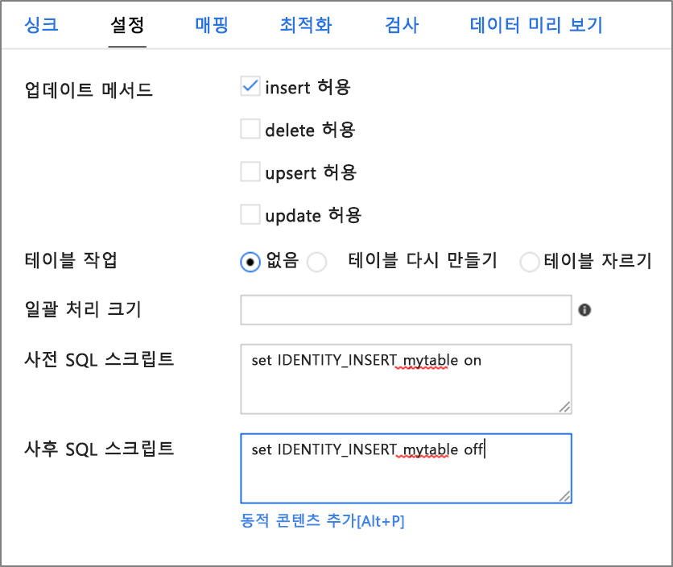

# <a name="copy-and-transform-data-in-azure-sql-database-by-using-azure-data-factory"></a>Azure Data Factory를 사용 하 여 Azure SQL Database 데이터 복사 및 변환

> [!div class="op_single_selector" title1="사용 중인 Azure Data Factory 버전을 선택하세요."]
>
> - [버전 1](v1/data-factory-azure-sql-connector.md)
> - [현재 버전](connector-azure-sql-database.md)

[!INCLUDE[appliesto-adf-asa-md](includes/appliesto-adf-asa-md.md)]

이 문서에서는 Azure Data Factory의 복사 작업을 사용 하 여 Azure SQL Database 간에 데이터를 복사 하 고 데이터 흐름을 사용 하 여 Azure SQL Database 데이터를 변환 하는 방법을 설명 합니다. Azure Data Factory에 대해 자세히 알아보려면 [소개 문서](introduction.md)를 참조하세요.

## <a name="supported-capabilities"></a>지원되는 기능

이 Azure SQL Database 커넥터는 다음과 같은 작업에 대해 지원 됩니다.

- [지원되는 원본/싱크 매트릭스](copy-activity-overview.md) 테이블을 사용하여 [복사 작업](copy-activity-overview.md)
- [매핑 데이터 흐름](concepts-data-flow-overview.md)
- [조회 작업](control-flow-lookup-activity.md)
- [GetMetadata 작업](control-flow-get-metadata-activity.md)

복사 활동의 경우이 Azure SQL Database 커넥터는 다음과 같은 기능을 지원 합니다.

- SQL 인증 Azure Active Directory 및 azure AD (azure AD) 응용 프로그램 토큰 인증을 사용 하 여 Azure 리소스에 대 한 서비스 주체 또는 관리 id로 데이터를 복사 합니다.
- 원본으로 SQL 쿼리 또는 저장 프로시저를 사용 하 여 데이터를 검색 합니다. Azure SQL Database 원본에서 병렬 복사를 선택할 수도 있습니다. 자세한 내용은 [SQL Database에서 병렬 복사](#parallel-copy-from-sql-database) 섹션을 참조 하세요.
- 싱크로 서 원본 스키마에 따라 존재 하지 않는 경우 대상 테이블을 자동으로 만듭니다. 테이블에 데이터를 추가 하거나 복사 하는 동안 사용자 지정 논리를 사용 하 여 저장 프로시저를 호출 합니다.

서버를 사용 하지 않는 [계층](../azure-sql/database/serverless-tier-overview.md)Azure SQL Database 사용 하는 경우 서버가 일시 중지 되 면 자동 다시 시작이 준비 될 때까지 기다리는 대신 작업 실행이 실패 합니다. 활동 다시 시도를 추가 하거나 추가 활동을 연결 하 여 서버가 실제 실행 될 때 라이브 상태를 유지할 수 있습니다.

>[!NOTE]
> 지금은이 커넥터에서 Azure SQL Database [Always Encrypted](https://docs.microsoft.com/sql/relational-databases/security/encryption/always-encrypted-database-engine) 지원 되지 않습니다. 이 문제를 해결 하려면 자체 호스팅 통합 런타임을 통해 [일반 odbc 커넥터](connector-odbc.md) 와 SQL Server ODBC 드라이버를 사용할 수 있습니다. Always Encrypted 섹션을 [사용 하 여](#using-always-encrypted) 자세히 알아보세요. 

> [!IMPORTANT]
> Azure integration runtime을 사용 하 여 데이터를 복사 하는 경우 Azure 서비스에서 서버에 액세스할 수 있도록 [서버 수준 방화벽 규칙](https://docs.microsoft.com/azure/sql-database/sql-database-firewall-configure) 을 구성 합니다.
> 자체 호스팅 통합 런타임을 사용 하 여 데이터를 복사 하는 경우 적절 한 IP 범위를 허용 하도록 방화벽을 구성 합니다. 이 범위에는 Azure SQL Database 연결 하는 데 사용 되는 컴퓨터의 IP가 포함 됩니다.

## <a name="get-started"></a>시작하기

[!INCLUDE [data-factory-v2-connector-get-started](../../includes/data-factory-v2-connector-get-started.md)]

다음 섹션에서는 Azure SQL Database 커넥터에 한정 된 Azure Data Factory 엔터티를 정의 하는 데 사용 되는 속성에 대해 자세히 설명 합니다.

## <a name="linked-service-properties"></a>연결된 서비스 속성

Azure SQL Database 연결된 서비스에 대해 지원되는 속성은 다음과 같습니다.

| 속성 | 설명 | 필수 |
|:--- |:--- |:--- |
| type | **type** 속성은 **AzureSqlDatabase**로 설정해야 합니다. | 예 |
| connectionString | **ConnectionString** 속성에 대 한 Azure SQL Database 인스턴스에 연결 하는 데 필요한 정보를 지정 합니다. <br/>Azure Key Vault에서 암호나 서비스 주체 키를 입력할 수도 있습니다. SQL 인증 인 경우 `password` 연결 문자열에서 구성을 끌어옵니다. 자세한 내용은 표 다음에 나오는 JSON 예를 참조 하 고 [Azure Key Vault에 자격 증명을 저장](store-credentials-in-key-vault.md)합니다. | 예 |
| servicePrincipalId | 애플리케이션의 클라이언트 ID를 지정합니다. | 예, 서비스 주체와 함께 Azure AD 인증을 사용 하는 경우 |
| servicePrincipalKey | 애플리케이션의 키를 지정합니다. 이 필드를 **SecureString** 으로 표시 하 여 Azure Data Factory에 안전 하 게 저장 하거나 [Azure Key Vault에 저장 된 암호를 참조](store-credentials-in-key-vault.md)합니다. | 예, 서비스 주체와 함께 Azure AD 인증을 사용 하는 경우 |
| tenant | 응용 프로그램이 상주 하는 도메인 이름 또는 테 넌 트 ID와 같은 테 넌 트 정보를 지정 합니다. Azure 포털의 오른쪽 위 모서리를 마우스로 가리켜 검색합니다. | 예, 서비스 주체와 함께 Azure AD 인증을 사용 하는 경우 |
| azureCloudType | 서비스 주체 인증의 경우 Azure AD 응용 프로그램이 등록 된 Azure 클라우드 환경의 유형을 지정 합니다. <br/> 허용 되는 값은 **Azurepublic**, **azurepublic**, **azureus정부**및 **AzureGermany**입니다. 기본적으로 데이터 팩터리의 클라우드 환경이 사용 됩니다. | 예 |
| connectVia | 이 [Integration Runtime](concepts-integration-runtime.md)은 데이터 저장소에 연결하는 데 사용됩니다. Azure Integration Runtime 또는 데이터 저장소가 개인 네트워크에 있는 경우, 자체 호스팅 통합 런타임을 사용할 수 있습니다. 지정하지 않으면 기본 Azure 통합 런타임이 사용됩니다. | 예 |

다른 인증 형식의 경우, 각각의 필수 조건 및 JSON 샘플에 대한 다음 섹션을 참조하세요.

- [SQL 인증](#sql-authentication)
- [Azure AD 응용 프로그램 토큰 인증: 서비스 주체](#service-principal-authentication)
- [Azure AD 응용 프로그램 토큰 인증: Azure 리소스에 대 한 관리 되는 id](#managed-identity)

>[!TIP]
>오류 코드 "UserErrorFailedToConnectToSqlServer"와 함께 오류가 발생 하 고 "데이터베이스에 대 한 세션 한도는 XXX 이며이에 도달 했습니다." 라는 메시지가 표시 되 면 `Pooling=false` 연결 문자열에를 추가 하 고 다시 시도 합니다.

### <a name="sql-authentication"></a>SQL 인증

**예: SQL 인증 사용**

```json
{
    "name": "AzureSqlDbLinkedService",
    "properties": {
        "type": "AzureSqlDatabase",
        "typeProperties": {
            "connectionString": "Data Source=tcp:<servername>.database.windows.net,1433;Initial Catalog=<databasename>;User ID=<username>@<servername>;Password=<password>;Trusted_Connection=False;Encrypt=True;Connection Timeout=30"
        },
        "connectVia": {
            "referenceName": "<name of Integration Runtime>",
            "type": "IntegrationRuntimeReference"
        }
    }
}
```

**예: Azure Key Vault의 암호**

```json
{
    "name": "AzureSqlDbLinkedService",
    "properties": {
        "type": "AzureSqlDatabase",
        "typeProperties": {
            "connectionString": "Data Source=tcp:<servername>.database.windows.net,1433;Initial Catalog=<databasename>;User ID=<username>@<servername>;Trusted_Connection=False;Encrypt=True;Connection Timeout=30",
            "password": {
                "type": "AzureKeyVaultSecret",
                "store": {
                    "referenceName": "<Azure Key Vault linked service name>",
                    "type": "LinkedServiceReference"
                },
                "secretName": "<secretName>"
            }
        },
        "connectVia": {
            "referenceName": "<name of Integration Runtime>",
            "type": "IntegrationRuntimeReference"
        }
    }
}
```

### <a name="service-principal-authentication"></a>서비스 주체 인증

서비스 주체 기반의 Azure AD 애플리케이션 토큰 인증을 사용하려면 다음 단계를 따르세요.

1. Azure Portal에서 [Azure Active Directory 애플리케이션을 만듭니다](../active-directory/develop/howto-create-service-principal-portal.md#register-an-application-with-azure-ad-and-create-a-service-principal) . 애플리케이션 이름 및 연결된 서비스를 정의하는 다음 값을 적어 둡니다.

    - 애플리케이션 UI
    - 애플리케이션 키
    - 테넌트 ID

2. 아직 수행 하지 않은 경우 Azure Portal에서 서버에 대 한 [Azure Active Directory 관리자를 프로 비전](../azure-sql/database/authentication-aad-configure.md#provision-azure-ad-admin-sql-database) 합니다. Azure AD 관리자는 Azure AD 사용자 또는 Azure AD 그룹이어야 하지만 서비스 주체일 수는 없습니다. 이 단계가 수행되면, 이후 단계에서 Azure AD ID를 사용하여 서비스 주체에 대한 포함된 데이터베이스 사용자를 만들 수 있습니다.

3. 서비스 주체에 대한 [포함된 데이터베이스 사용자를 만듭니다](../azure-sql/database/authentication-aad-configure.md#create-contained-users-mapped-to-azure-ad-identities) . ALTER ANY USER 권한이 있는 Azure AD id를 사용 하 여 SQL Server Management Studio와 같은 도구를 사용 하 여 데이터를 복사 하려는 또는의 데이터베이스에 연결 합니다. 다음 T-SQL을 실행합니다.
  
    ```sql
    CREATE USER [your application name] FROM EXTERNAL PROVIDER;
    ```

4. 일반적으로 SQL 사용자나 기타 사용자에 대해 수행하듯이 서비스 주체에 필요한 권한을 부여합니다. 다음 코드를 실행합니다. 자세한 옵션은 [이 문서](https://docs.microsoft.com/sql/relational-databases/system-stored-procedures/sp-addrolemember-transact-sql)를 참조하세요.

    ```sql
    ALTER ROLE [role name] ADD MEMBER [your application name];
    ```

5. Azure Data Factory에서 Azure SQL Database 연결된 서비스를 구성합니다.

#### <a name="linked-service-example-that-uses-service-principal-authentication"></a>서비스 주체 인증을 사용하는 연결된 서비스 예제

```json
{
    "name": "AzureSqlDbLinkedService",
    "properties": {
        "type": "AzureSqlDatabase",
        "typeProperties": {
            "connectionString": "Data Source=tcp:<servername>.database.windows.net,1433;Initial Catalog=<databasename>;Connection Timeout=30",
            "servicePrincipalId": "<service principal id>",
            "servicePrincipalKey": {
                "type": "SecureString",
                "value": "<service principal key>"
            },
            "tenant": "<tenant info, e.g. microsoft.onmicrosoft.com>"
        },
        "connectVia": {
            "referenceName": "<name of Integration Runtime>",
            "type": "IntegrationRuntimeReference"
        }
    }
}
```

### <a name="managed-identities-for-azure-resources-authentication"></a><a name="managed-identity"></a>Azure 리소스 인증용 관리 ID

특정 데이터 팩터리를 나타내는 [Azure 리소스용 관리 ID](data-factory-service-identity.md)와 데이터 팩터리를 연결할 수 있습니다. Azure SQL Database 인증에이 관리 되는 id를 사용할 수 있습니다. 지정된 팩터리는 이 ID를 사용하여 데이터베이스에 액세스하고 해당 데이터베이스에 대해 데이터를 복사할 수 있습니다.

관리 id 인증을 사용 하려면 다음 단계를 수행 합니다.

1. 아직 수행 하지 않은 경우 Azure Portal에서 서버에 대 한 [Azure Active Directory 관리자를 프로 비전](../azure-sql/database/authentication-aad-configure.md#provision-azure-ad-admin-sql-database) 합니다. Azure ad 관리자는 Azure ad 사용자 또는 Azure AD 그룹 일 수 있습니다. 관리 ID를 가진 그룹에 관리자 역할을 부여하는 경우 3단계 및 4단계를 건너뛰세요. 관리자는 데이터베이스에 대 한 모든 권한을 가집니다.

2. 관리 되는 Azure Data Factory id에 대 한 [포함 된 데이터베이스 사용자를 만듭니다](../azure-sql/database/authentication-aad-configure.md#create-contained-users-mapped-to-azure-ad-identities) . ALTER ANY USER 권한이 있는 Azure AD id를 사용 하 여 SQL Server Management Studio와 같은 도구를 사용 하 여 데이터를 복사 하려는 또는의 데이터베이스에 연결 합니다. 다음 T-SQL을 실행합니다.
  
    ```sql
    CREATE USER [your Data Factory name] FROM EXTERNAL PROVIDER;
    ```

3. SQL 사용자 및 다른 사용자가 일반적으로 수행 하는 대로 Data Factory 관리 id에 필요한 권한을 부여 합니다. 다음 코드를 실행합니다. 자세한 옵션은 [이 문서](https://docs.microsoft.com/sql/relational-databases/system-stored-procedures/sp-addrolemember-transact-sql)를 참조하세요.

    ```sql
    ALTER ROLE [role name] ADD MEMBER [your Data Factory name];
    ```

4. Azure Data Factory에서 Azure SQL Database 연결된 서비스를 구성합니다.

**예제**

```json
{
    "name": "AzureSqlDbLinkedService",
    "properties": {
        "type": "AzureSqlDatabase",
        "typeProperties": {
            "connectionString": "Data Source=tcp:<servername>.database.windows.net,1433;Initial Catalog=<databasename>;Connection Timeout=30"
        },
        "connectVia": {
            "referenceName": "<name of Integration Runtime>",
            "type": "IntegrationRuntimeReference"
        }
    }
}
```

## <a name="dataset-properties"></a>데이터 세트 속성

데이터 집합을 정의 하는 데 사용할 수 있는 섹션 및 속성의 전체 목록은 [데이터 집합](https://docs.microsoft.com/azure/data-factory/concepts-datasets-linked-services)을 참조 하세요.

Azure SQL Database 데이터 집합에 대해 지원 되는 속성은 다음과 같습니다.

| 속성 | 설명 | 필수 |
|:--- |:--- |:--- |
| type | 데이터 세트의 **type** 속성을 **AzureSqlTable**로 설정해야 합니다. | 예 |
| 스키마 | 스키마의 이름입니다. |원본에는 아니요이고 싱크에는 예입니다  |
| 테이블 | 테이블/뷰의 이름입니다. |원본에는 아니요이고 싱크에는 예입니다  |
| tableName | 스키마가 포함된 테이블/뷰의 이름입니다. 이 속성은 이전 버전과의 호환성을 위해 지원됩니다. 새 워크로드의 경우 `schema` 및 `table`을 사용합니다. | 원본에는 아니요이고 싱크에는 예입니다 |

### <a name="dataset-properties-example"></a>데이터 세트 속성 예제

```json
{
    "name": "AzureSQLDbDataset",
    "properties":
    {
        "type": "AzureSqlTable",
        "linkedServiceName": {
            "referenceName": "<Azure SQL Database linked service name>",
            "type": "LinkedServiceReference"
        },
        "schema": [ < physical schema, optional, retrievable during authoring > ],
        "typeProperties": {
            "schema": "<schema_name>",
            "table": "<table_name>"
        }
    }
}
```

## <a name="copy-activity-properties"></a>복사 작업 속성

작업 정의에 사용할 수 있는 섹션 및 속성의 전체 목록은 [파이프라인](concepts-pipelines-activities.md)을 참조하세요. 이 섹션에서는 Azure SQL Database 원본 및 싱크에서 지원하는 속성 목록을 제공합니다.

### <a name="azure-sql-database-as-the-source"></a>Azure SQL Database가 원본인 경우

>[!TIP]
>데이터 분할을 사용 하 여 Azure SQL Database에서 데이터를 효율적으로 로드 하려면 [SQL Database의 병렬 복사](#parallel-copy-from-sql-database)에서 자세히 알아보세요.

Azure SQL Database에서 데이터를 복사 하려면 복사 작업 **원본** 섹션에서 다음 속성을 지원 합니다.

| 속성 | 설명 | 필수 |
|:--- |:--- |:--- |
| type | 복사 작업 원본의 **type** 속성은 **AzureSqlSource**로 설정 해야 합니다. "SqlSource" 형식은 이전 버전과의 호환성을 위해 계속 지원 됩니다. | 예 |
| SqlReaderQuery | 이 속성은 사용자 지정 SQL 쿼리를 사용하여 데이터를 읽습니다. 예제는 `select * from MyTable`입니다. | 예 |
| sqlReaderStoredProcedureName | 원본 테이블에서 데이터를 읽는 저장 프로시저의 이름입니다. 마지막 SQL 문은 저장 프로시저의 SELECT 문이어야 합니다. | 예 |
| storedProcedureParameters | 저장 프로시저에 대한 매개 변수입니다.<br/>허용되는 값은 이름 또는 값 쌍입니다. 매개 변수의 이름 및 대/소문자 구분은 저장 프로시저 매개 변수의 이름 및 대/소문자와 일치 해야 합니다. | 예 |
| isolationLevel | SQL 원본에 대한 트랜잭션 잠금 동작을 지정합니다. 허용 되는 값은 **ReadCommitted**, **ReadUncommitted**, **RepeatableRead**, **Serializable**, **Snapshot**입니다. 지정 하지 않으면 데이터베이스의 기본 격리 수준이 사용 됩니다. 자세한 내용은 [이 문서](https://docs.microsoft.com/dotnet/api/system.data.isolationlevel)를 참조하세요. | 예 |
| partitionOptions | Azure SQL Database에서 데이터를 로드 하는 데 사용 되는 데이터 분할 옵션을 지정 합니다. <br>허용 되는 값은 **None** (기본값), **PhysicalPartitionsOfTable**및 **dynamicrange**입니다.<br>파티션 옵션을 사용 하도록 설정 하는 경우 (즉,이 아님 `None` ) Azure SQL Database에서 데이터를 동시에 로드 하는 병렬 처리 수준이 [`parallelCopies`](copy-activity-performance-features.md#parallel-copy) 복사 작업의 설정에 의해 제어 됩니다. | 예 |
| partitionSettings | 데이터 분할에 대한 설정 그룹을 지정합니다. <br>Partition 옵션을 사용할 수 없는 경우에 적용 `None` 됩니다. | 아니요 |
| **_ `partitionSettings` :_*_ | | |
| partitionColumnName | 병렬 복사를 위해 범위 분할에서 사용할 원본 열 _*in integer 또는 date/datetime 유형**의 이름을 지정 합니다. 지정 하지 않으면 테이블의 인덱스 또는 기본 키가 자동으로 검색 되어 파티션 열로 사용 됩니다.<br>파티션 옵션이 `DynamicRange`인 경우에 적용됩니다. 쿼리를 사용 하 여 원본 데이터를 검색 하는 경우  `?AdfDynamicRangePartitionCondition ` WHERE 절에 후크 합니다. 예를 들어 [SQL 데이터베이스에서 병렬 복사](#parallel-copy-from-sql-database) 섹션을 참조 하세요. | 예 |
| partitionUpperBound | 파티션 범위 분할에 대 한 파티션 열의 최대값입니다. 이 값은 테이블의 행을 필터링 하는 것이 아니라 파티션 stride를 결정 하는 데 사용 됩니다. 테이블이 나 쿼리 결과의 모든 행이 분할 되 고 복사 됩니다. 지정 하지 않으면 복사 작업에서 값을 자동으로 검색 합니다.  <br>파티션 옵션이 `DynamicRange`인 경우에 적용됩니다. 예를 들어 [SQL 데이터베이스에서 병렬 복사](#parallel-copy-from-sql-database) 섹션을 참조 하세요. | 예 |
| partitionLowerBound | 파티션 범위 분할에 대 한 파티션 열의 최소값입니다. 이 값은 테이블의 행을 필터링 하는 것이 아니라 파티션 stride를 결정 하는 데 사용 됩니다. 테이블이 나 쿼리 결과의 모든 행이 분할 되 고 복사 됩니다. 지정 하지 않으면 복사 작업에서 값을 자동으로 검색 합니다.<br>파티션 옵션이 `DynamicRange`인 경우에 적용됩니다. 예를 들어 [SQL 데이터베이스에서 병렬 복사](#parallel-copy-from-sql-database) 섹션을 참조 하세요. | 아니요 |

**주의할 사항:**

- **AzureSqlSource**에 대해 **sqlreaderquery** 를 지정 하는 경우 복사 작업은 데이터를 가져오기 위해 Azure SQL Database 원본에 대해이 쿼리를 실행 합니다. 저장 프로시저가 매개 변수를 사용하는 경우에는 **sqlReaderStoredProcedureName** 및 **storedProcedureParameters**를 지정하여 저장 프로시저를 지정할 수도 있습니다.
- **Sqlreaderquery** 또는 **sqlReaderStoredProcedureName**를 지정 하지 않으면 JSON 데이터 집합의 "structure" 섹션에 정의 된 열이 쿼리를 생성 하는 데 사용 됩니다. 쿼리가 `select column1, column2 from mytable` Azure SQL Database에 대해 실행 됩니다. 데이터 세트 정의에 "structure"가 없는 경우 테이블에서 모든 열이 선택됩니다.

#### <a name="sql-query-example"></a>SQL 쿼리 예제

```json
"activities":[
    {
        "name": "CopyFromAzureSQLDatabase",
        "type": "Copy",
        "inputs": [
            {
                "referenceName": "<Azure SQL Database input dataset name>",
                "type": "DatasetReference"
            }
        ],
        "outputs": [
            {
                "referenceName": "<output dataset name>",
                "type": "DatasetReference"
            }
        ],
        "typeProperties": {
            "source": {
                "type": "AzureSqlSource",
                "sqlReaderQuery": "SELECT * FROM MyTable"
            },
            "sink": {
                "type": "<sink type>"
            }
        }
    }
]
```

#### <a name="stored-procedure-example"></a>저장 프로시저 예제

```json
"activities":[
    {
        "name": "CopyFromAzureSQLDatabase",
        "type": "Copy",
        "inputs": [
            {
                "referenceName": "<Azure SQL Database input dataset name>",
                "type": "DatasetReference"
            }
        ],
        "outputs": [
            {
                "referenceName": "<output dataset name>",
                "type": "DatasetReference"
            }
        ],
        "typeProperties": {
            "source": {
                "type": "AzureSqlSource",
                "sqlReaderStoredProcedureName": "CopyTestSrcStoredProcedureWithParameters",
                "storedProcedureParameters": {
                    "stringData": { "value": "str3" },
                    "identifier": { "value": "$$Text.Format('{0:yyyy}', <datetime parameter>)", "type": "Int"}
                }
            },
            "sink": {
                "type": "<sink type>"
            }
        }
    }
]
```

### <a name="stored-procedure-definition"></a>저장 프로시저 정의

```sql
CREATE PROCEDURE CopyTestSrcStoredProcedureWithParameters
(
    @stringData varchar(20),
    @identifier int
)
AS
SET NOCOUNT ON;
BEGIN
     select *
     from dbo.UnitTestSrcTable
     where dbo.UnitTestSrcTable.stringData != stringData
    and dbo.UnitTestSrcTable.identifier != identifier
END
GO
```

### <a name="azure-sql-database-as-the-sink"></a>Azure SQL Database가 싱크인 경우

> [!TIP]
> [Azure SQL Database에 데이터를 로드 하는 모범](#best-practice-for-loading-data-into-azure-sql-database)사례에서 지원 되는 쓰기 동작, 구성 및 모범 사례에 대해 자세히 알아보세요.

Azure SQL Database에 데이터를 복사 하려면 복사 작업 **싱크** 섹션에서 다음 속성을 지원 합니다.

| 속성 | 설명 | 필수 |
|:--- |:--- |:--- |
| type | 복사 작업 싱크의 **type** 속성은 **AzureSqlSink**로 설정 해야 합니다. "SqlSink" 형식은 이전 버전과의 호환성을 위해 계속 지원 됩니다. | 예 |
| preCopyScript | Azure SQL Database에 데이터를 쓰기 전에 실행할 복사 작업에 대 한 SQL 쿼리를 지정 합니다. 복사 실행당 한 번만 호출됩니다. 이 속성을 사용하여 미리 로드된 데이터를 정리합니다. | 예 |
| tableOption | 원본 스키마에 따라 존재 하지 않는 경우 [싱크 테이블을 자동으로 만들지](copy-activity-overview.md#auto-create-sink-tables) 여부를 지정 합니다. <br>싱크가 저장 프로시저를 지정 하는 경우 자동 테이블 만들기가 지원 되지 않습니다. <br>허용되는 값은 `none`(기본값) 또는 `autoCreate`입니다. | 예 |
| sqlWriterStoredProcedureName | 원본 데이터를 대상 테이블에 적용하는 방법을 정의하는 저장 프로시저의 이름입니다. <br/>이 저장 프로시저는 *배치마다 호출*됩니다. 한 번만 실행 되 고 원본 데이터 (예: 삭제 또는 자르기)와 관련이 없는 작업의 경우 속성을 사용 `preCopyScript` 합니다.<br>[SQL 싱크에서 저장 프로시저 호출](#invoke-a-stored-procedure-from-a-sql-sink)의 예를 참조 하세요. | 아니요 |
| storedProcedureTableTypeParameterName |저장 프로시저에 지정 된 테이블 형식의 매개 변수 이름입니다.  |아니요 |
| sqlWriterTableType |저장 프로시저에 사용할 테이블 형식 이름입니다. 복사 작업에서는 이동 중인 데이터를 이 테이블 형식의 임시 테이블에서 사용할 수 있습니다. 그러면 저장 프로시저 코드가 복사 중인 데이터를 기존 데이터와 병합할 수 있습니다. |예 |
| storedProcedureParameters |저장 프로시저에 대한 매개 변수입니다.<br/>허용되는 값은 이름 및 값 쌍입니다. 매개 변수의 이름 및 대소문자와, 저장 프로시저 매개변수의 이름 및 대소문자와 일치해야 합니다. | 예 |
| writeBatchSize | *일괄*처리당 SQL 테이블에 삽입할 행 수입니다.<br/> 허용되는 값은 **정수**(행 수)입니다. 기본적으로 Azure Data Factory는 행 크기에 따라 적절 한 일괄 처리 크기를 동적으로 결정 합니다. | 아니요 |
| writeBatchTimeout | 시간 초과되기 전에 배치 삽입 작업을 완료하기 위한 대기 시간입니다.<br/> 허용되는 값은 **시간 범위**입니다. 예를 들면 "00:30:00" (30 분)입니다. | 예 |
| disableMetricsCollection | Data Factory 복사 성능 최적화 및 권장 사항에 대 한 Azure SQL Database Dtu와 같은 메트릭을 수집 합니다. 이 동작에 관심이 있는 경우 `true`를 지정하여 해제합니다. | 아니요(기본값: `false`) |

**예제 1: 데이터 추가**

```json
"activities":[
    {
        "name": "CopyToAzureSQLDatabase",
        "type": "Copy",
        "inputs": [
            {
                "referenceName": "<input dataset name>",
                "type": "DatasetReference"
            }
        ],
        "outputs": [
            {
                "referenceName": "<Azure SQL Database output dataset name>",
                "type": "DatasetReference"
            }
        ],
        "typeProperties": {
            "source": {
                "type": "<source type>"
            },
            "sink": {
                "type": "AzureSqlSink",
                "tableOption": "autoCreate",
                "writeBatchSize": 100000
            }
        }
    }
]
```

**예 2: 복사 하는 동안 저장 프로시저 호출**

자세한 내용은 [SQL 싱크에서 저장 프로시저 호출](#invoke-a-stored-procedure-from-a-sql-sink)을 참조하세요.

```json
"activities":[
    {
        "name": "CopyToAzureSQLDatabase",
        "type": "Copy",
        "inputs": [
            {
                "referenceName": "<input dataset name>",
                "type": "DatasetReference"
            }
        ],
        "outputs": [
            {
                "referenceName": "<Azure SQL Database output dataset name>",
                "type": "DatasetReference"
            }
        ],
        "typeProperties": {
            "source": {
                "type": "<source type>"
            },
            "sink": {
                "type": "AzureSqlSink",
                "sqlWriterStoredProcedureName": "CopyTestStoredProcedureWithParameters",
                "storedProcedureTableTypeParameterName": "MyTable",
                "sqlWriterTableType": "MyTableType",
                "storedProcedureParameters": {
                    "identifier": { "value": "1", "type": "Int" },
                    "stringData": { "value": "str1" }
                }
            }
        }
    }
]
```

## <a name="parallel-copy-from-sql-database"></a>SQL database에서의 병렬 복사

복사 작업의 Azure SQL Database 커넥터는 데이터를 병렬로 복사 하기 위한 기본 제공 데이터 분할을 제공 합니다. 복사 작업의 **원본** 탭에서 데이터 분할 옵션을 찾을 수 있습니다.


분할 된 복사를 사용 하도록 설정 하면 복사 작업은 Azure SQL Database 원본에 대해 병렬 쿼리를 실행 하 여 파티션으로 데이터를 로드 합니다. 병렬 수준은 복사 작업의 [`parallelCopies`](copy-activity-performance-features.md#parallel-copy) 설정에 의해 제어됩니다. 예를 들어를 4로 설정 하는 경우 `parallelCopies` Data Factory는 지정 된 파티션 옵션 및 설정을 기반으로 4 개의 쿼리를 동시에 생성 하 고 실행 하며 각 쿼리는 Azure SQL Database에서 데이터의 일부를 검색 합니다.

특히 Azure SQL Database에서 많은 양의 데이터를 로드 하는 경우 데이터 분할으로 병렬 복사를 사용 하도록 설정 하는 것이 좋습니다. 다양한 시나리오에 대해 권장되는 구성은 다음과 같습니다. 파일 기반 데이터 저장소로 데이터를 복사할 때 폴더에 여러 파일 (폴더 이름만 지정)로 쓰는 것이 좋습니다 .이 경우에는 단일 파일에 쓰는 것 보다 성능이 좋습니다.

| 시나리오                                                     | 제안된 설정                                           |
| ------------------------------------------------------------ | ------------------------------------------------------------ |
| 실제 파티션이 있는 초대형 테이블에서 전체 로드        | **파티션 옵션**: 테이블의 실제 파티션입니다. <br><br/>실행 중에는 Data Factory에서 실제 파티션을 자동으로 검색 하 고 파티션으로 데이터를 복사 합니다. <br><br/>테이블에 실제 파티션이 있는지 확인 하려면 [이 쿼리](#sample-query-to-check-physical-partition)를 참조할 수 있습니다. |
| 데이터 분할을 위한 정수 또는 datetime 열을 포함 하는 동시에 실제 파티션이 없는 많은 테이블에서 전체 로드 | **파티션 옵션**: 동적 범위 파티션입니다.<br>**파티션 열** (선택 사항): 데이터를 분할 하는 데 사용 되는 열을 지정 합니다. 지정 하지 않으면 인덱스 또는 기본 키 열이 사용 됩니다.<br/>**파티션 상한** 및 **파티션** 하 한 (선택 사항): 파티션 스트라이드를 확인할 지 여부를 지정 합니다. 테이블의 행을 필터링 하는 것이 아니라 테이블의 모든 행이 분할 및 복사 됩니다. 지정 하지 않으면 복사 작업에서 값을 자동으로 검색 합니다.<br><br>예를 들어 파티션 열 "ID"의 값이 1에서 100 사이의 값을 가지 며, 상한 값을 20으로 설정 하 고 상한을 80로 설정 하 고, Data Factory에서 4 개의 파티션 (범위 <= 20, [21, 50], [51, 80] 및 >= 81)을 통해 데이터를 검색 합니다. |
| 실제 파티션이 없는 사용자 지정 쿼리를 사용 하 여 많은 양의 데이터를 로드 하는 동시에 데이터 분할을 위한 정수 또는 날짜/시간 열을 사용 합니다. | **파티션 옵션**: 동적 범위 파티션입니다.<br>**쿼리**:`SELECT * FROM <TableName> WHERE ?AdfDynamicRangePartitionCondition AND <your_additional_where_clause>`.<br>**파티션 열**: 데이터를 분할하는 데 사용되는 열을 지정합니다.<br>**파티션 상한** 및 **파티션** 하 한 (선택 사항): 파티션 스트라이드를 확인할 지 여부를 지정 합니다. 테이블에서 행을 필터링 하는 것이 아니라 쿼리 결과의 모든 행이 분할 되 고 복사 됩니다. 지정 하지 않으면 복사 작업에서 값을 자동으로 검색 합니다.<br><br>실행 중 Data Factory `?AdfRangePartitionColumnName` 은 각 파티션에 대 한 실제 열 이름 및 값 범위를 대체 하 여 Azure SQL Database으로 보냅니다. <br>예를 들어 파티션 열 "ID"의 값이 1에서 100 사이의 값을 가지 며, 상한 값을 20으로 설정 하 고 상한을 80로 설정 하 고, Data Factory에서 4 개의 파티션 (범위 <= 20, [21, 50], [51, 80] 및 >= 81)을 통해 데이터를 검색 합니다. <br><br>다음은 다양 한 시나리오에 대 한 샘플 쿼리입니다.<br> 1. 전체 테이블을 쿼리 합니다. <br>`SELECT * FROM <TableName> WHERE ?AdfDynamicRangePartitionCondition`<br> 2. 열 선택이 포함 된 테이블에서 쿼리 및 추가 where 절 필터: <br>`SELECT <column_list> FROM <TableName> WHERE ?AdfDynamicRangePartitionCondition AND <your_additional_where_clause>`<br> 3. 하위 쿼리를 사용 하 여 쿼리: <br>`SELECT <column_list> FROM (<your_sub_query>) AS T WHERE ?AdfDynamicRangePartitionCondition AND <your_additional_where_clause>`<br> 4. 하위 쿼리에 파티션이 있는 쿼리: <br>`SELECT <column_list> FROM (SELECT <your_sub_query_column_list> FROM <TableName> WHERE ?AdfDynamicRangePartitionCondition) AS T`
|

파티션 옵션을 사용 하 여 데이터를 로드 하는 모범 사례:

1. 데이터 기울이기를 방지 하려면 기본 키 또는 고유 키와 같은 고유한 열을 분할 열로 선택 합니다. 
2. 테이블에 기본 제공 파티션이 있으면 파티션 옵션 "테이블의 실제 파티션"을 사용 하 여 성능을 향상 시킬 수 있습니다.  
3. Azure Integration Runtime를 사용 하 여 데이터를 복사 하는 경우 더 많은 컴퓨팅 리소스를 활용 하기 위해 더 큰 "[DIU (데이터 통합 단위](copy-activity-performance-features.md#data-integration-units))" (>4)를 설정할 수 있습니다. 해당 하는 시나리오를 확인 합니다.
4. "[복사 병렬 처리 수준](copy-activity-performance-features.md#parallel-copy)"은 파티션 번호를 제어 하 고,이 숫자를 너무 크게 설정 하면 성능이 저하 됩니다. (diu 또는 자체 호스팅 IR 노드의 수) * (2-4)로이 숫자를 설정 하는 것이 좋습니다.

**예: 실제 파티션이 있는 초대형 테이블에서 전체 로드**

```json
"source": {
    "type": "AzureSqlSource",
    "partitionOption": "PhysicalPartitionsOfTable"
}
```

**예: 동적 범위 파티션이 있는 쿼리**

```json
"source": {
    "type": "AzureSqlSource",
    "query": "SELECT * FROM <TableName> WHERE ?AdfDynamicRangePartitionCondition AND <your_additional_where_clause>",
    "partitionOption": "DynamicRange",
    "partitionSettings": {
        "partitionColumnName": "<partition_column_name>",
        "partitionUpperBound": "<upper_value_of_partition_column (optional) to decide the partition stride, not as data filter>",
        "partitionLowerBound": "<lower_value_of_partition_column (optional) to decide the partition stride, not as data filter>"
    }
}
```

### <a name="sample-query-to-check-physical-partition"></a>실제 파티션을 확인 하는 예제 쿼리

```sql
SELECT DISTINCT s.name AS SchemaName, t.name AS TableName, pf.name AS PartitionFunctionName, c.name AS ColumnName, iif(pf.name is null, 'no', 'yes') AS HasPartition
FROM sys.tables AS t
LEFT JOIN sys.objects AS o ON t.object_id = o.object_id
LEFT JOIN sys.schemas AS s ON o.schema_id = s.schema_id
LEFT JOIN sys.indexes AS i ON t.object_id = i.object_id 
LEFT JOIN sys.index_columns AS ic ON ic.partition_ordinal > 0 AND ic.index_id = i.index_id AND ic.object_id = t.object_id 
LEFT JOIN sys.columns AS c ON c.object_id = ic.object_id AND c.column_id = ic.column_id 
LEFT JOIN sys.partition_schemes ps ON i.data_space_id = ps.data_space_id 
LEFT JOIN sys.partition_functions pf ON pf.function_id = ps.function_id 
WHERE s.name='[your schema]' AND t.name = '[your table name]'
```

테이블에 실제 파티션이 있으면 다음과 같이 "HasPartition"을 "예"로 볼 수 있습니다.


## <a name="best-practice-for-loading-data-into-azure-sql-database"></a>Azure SQL Database로 데이터를 로드 하는 모범 사례

Azure SQL Database에 데이터를 복사 하는 경우 다른 쓰기 동작이 필요할 수 있습니다.

- [추가](#append-data): 내 원본 데이터에는 새 레코드만 있습니다.
- [Upsert](#upsert-data): 내 원본 데이터에는 삽입과 업데이트가 모두 포함 됩니다.
- [덮어쓰기](#overwrite-the-entire-table): 매번 전체 차원 테이블을 다시 로드 합니다.
- [사용자 지정 논리를 사용 하 여 작성](#write-data-with-custom-logic): 대상 테이블에 최종 삽입 하기 전에 추가 처리가 필요 합니다.

Azure Data Factory 및 모범 사례에서 구성 하는 방법에 대 한 해당 섹션을 참조 하세요.

### <a name="append-data"></a>데이터 추가

이 Azure SQL Database 싱크 커넥터의 기본 동작은 데이터를 추가 하는 것입니다. Azure Data Factory는 대량 삽입을 수행 하 여 테이블에 효율적으로 씁니다. 복사 작업에 따라 원본 및 싱크를 구성 할 수 있습니다.

### <a name="upsert-data"></a>데이터 Upsert

**옵션 1:** 많은 양의 데이터를 복사 하는 경우 복사 작업을 사용 하 여 준비 테이블에 모든 레코드를 대량 로드 한 다음 저장 프로시저 작업을 실행 하 여 하나의 샷에 [MERGE](https://docs.microsoft.com/sql/t-sql/statements/merge-transact-sql) 또는 INSERT/UPDATE 문을 적용할 수 있습니다. 

현재 복사 작업은 데이터를 데이터베이스 임시 테이블로 로드 하는 것을 기본적으로 지원 하지 않습니다. 여러 작업의 조합을 사용 하 여이를 설정 하는 고급 방법이 있습니다. [Azure SQL Database 대량 Upsert 최적화 시나리오](https://github.com/scoriani/azuresqlbulkupsert)를 참조 하세요. 다음은 영구 테이블을 준비로 사용 하는 샘플을 보여 줍니다.

예를 들어 Azure Data Factory에서 **저장 프로시저 작업과**연결 된 **복사 작업** 을 사용 하 여 파이프라인을 만들 수 있습니다. 이전에는 데이터 집합의 테이블 이름으로 원본 저장소에서 Azure SQL Database 준비 테이블 (예: **UpsertStagingTable**)로 데이터를 복사 합니다. 그런 다음 후자는 저장 프로시저를 호출 하 여 준비 테이블의 원본 데이터를 대상 테이블로 병합 하 고 준비 테이블을 정리 합니다.


데이터베이스에서 이전 저장 프로시저 작업에서 가리키는 다음 예와 같이 병합 논리를 사용 하 여 저장 프로시저를 정의 합니다. 대상이 **프로필 id**, **State**및 **Category**라는 세 개의 열이 있는 **마케팅** 테이블인 것으로 가정 합니다. **프로필 id** 열을 기반으로 upsert를 수행 합니다.

```sql
CREATE PROCEDURE [dbo].[spMergeData]
AS
BEGIN
   MERGE TargetTable AS target
   USING UpsertStagingTable AS source
   ON (target.[ProfileID] = source.[ProfileID])
   WHEN MATCHED THEN
      UPDATE SET State = source.State
    WHEN NOT matched THEN
       INSERT ([ProfileID], [State], [Category])
      VALUES (source.ProfileID, source.State, source.Category);
    TRUNCATE TABLE UpsertStagingTable
END
```

**옵션 2:** [복사 작업 내에서 저장 프로시저를 호출](#invoke-a-stored-procedure-from-a-sql-sink)하도록 선택할 수 있습니다. 이 방법은 `writeBatchSize` 복사 작업에서 기본 방법으로 bulk insert를 사용 하는 대신 원본 테이블에서 각 일괄 처리 (속성에 의해 제어 됨)를 실행 합니다.

**옵션 3:** 기본 제공 insert/upsert/update 메서드를 제공 하는 [매핑 데이터 흐름](#sink-transformation) 을 사용할 수 있습니다.

### <a name="overwrite-the-entire-table"></a>전체 테이블 덮어쓰기

복사 작업 싱크에서 **Precopyscript** 속성을 구성할 수 있습니다. 이 경우를 실행 하는 각 복사 작업에 대해 Azure Data Factory는 스크립트를 먼저 실행 합니다. 그런 다음 복사를 실행 하 여 데이터를 삽입 합니다. 예를 들어 전체 테이블을 최신 데이터로 덮어쓰려면 원본에서 새 데이터를 대량 로드 하기 전에 먼저 모든 레코드를 삭제 하는 스크립트를 지정 합니다.

### <a name="write-data-with-custom-logic"></a>사용자 지정 논리를 사용 하 여 데이터 작성

사용자 지정 논리를 사용 하 여 데이터를 작성 하는 단계는 [Upsert data](#upsert-data) 섹션에 설명 된 것과 비슷합니다. 원본 데이터를 마지막으로 대상 테이블에 삽입 하기 전에 추가 처리를 적용 해야 하는 경우 준비 테이블에 로드 한 다음 저장 프로시저 작업을 호출 하거나 복사 작업 싱크에서 저장 프로시저를 호출 하 여 데이터를 적용 하거나 데이터 흐름 매핑을 사용할 수 있습니다.

## <a name="invoke-a-stored-procedure-from-a-sql-sink"></a><a name="invoke-a-stored-procedure-from-a-sql-sink"></a> SQL 싱크에서 저장 프로시저 호출

Azure SQL Database에 데이터를 복사 하는 경우 원본 테이블의 각 일괄 처리에서 추가 매개 변수를 사용 하 여 사용자 지정 저장 프로시저를 구성 하 고 호출할 수도 있습니다. 저장 프로시저 기능은 [테이블 반환 매개 변수](https://msdn.microsoft.com/library/bb675163.aspx)를 사용 합니다.

기본 제공 복사 메커니즘이 용도에 적합하지 않은 경우, 저장 프로시저를 사용할 수 있습니다. 원본 데이터를 대상 테이블에 마지막으로 삽입 하기 전에 추가 처리를 적용 하려는 경우를 예로 들 수 있습니다. 몇 가지 추가 처리 예는 열을 병합 하 고, 추가 값을 조회 하 고, 둘 이상의 테이블에 삽입 하려고 하는 경우입니다.

다음 샘플에서는 저장 프로시저를 사용하여 Azure SQL Database의 테이블에 upsert(업데이트/삽입)를 수행하는 방법을 보여 줍니다. 입력 데이터와 싱크 **마케팅** 테이블에 각각 **프로필 id**, **State**및 **Category**라는 세 개의 열이 있다고 가정 합니다. **프로필 id** 열을 기반으로 upsert를 수행 하 고 "ProductA" 이라는 특정 범주에 대해서만 적용 합니다.

1. 데이터베이스에서 **sqlwritertabletype과**와 동일한 이름을 사용 하 여 테이블 형식을 정의 합니다. 테이블 형식의 스키마는 입력 데이터에서 반환된 스키마와 같아야 합니다.

    ```sql
    CREATE TYPE [dbo].[MarketingType] AS TABLE(
        [ProfileID] [varchar](256) NOT NULL,
        [State] [varchar](256) NOT NULL,
        [Category] [varchar](256) NOT NULL
    )
    ```

2. 데이터베이스에서 **sqlWriterStoredProcedureName**와 동일한 이름을 사용 하 여 저장 프로시저를 정의 합니다. 지정된 원본의 입력 데이터를 처리하고 출력 테이블에 병합합니다. 저장 프로시저에서 테이블 형식의 매개 변수 이름은 데이터 집합에 정의 된 **tableName** 과 동일 합니다.

    ```sql
    CREATE PROCEDURE spOverwriteMarketing @Marketing [dbo].[MarketingType] READONLY, @category varchar(256)
    AS
    BEGIN
    MERGE [dbo].[Marketing] AS target
    USING @Marketing AS source
    ON (target.ProfileID = source.ProfileID and target.Category = @category)
    WHEN MATCHED THEN
        UPDATE SET State = source.State
    WHEN NOT MATCHED THEN
        INSERT (ProfileID, State, Category)
        VALUES (source.ProfileID, source.State, source.Category);
    END
    ```

3. Azure Data Factory에서 복사 활동의 **SQL 싱크** 섹션을 다음과 같이 정의 합니다.

    ```json
    "sink": {
        "type": "AzureSqlSink",
        "sqlWriterStoredProcedureName": "spOverwriteMarketing",
        "storedProcedureTableTypeParameterName": "Marketing",
        "sqlWriterTableType": "MarketingType",
        "storedProcedureParameters": {
            "category": {
                "value": "ProductA"
            }
        }
    }
    ```

## <a name="mapping-data-flow-properties"></a>매핑 데이터 흐름 속성

매핑 데이터 흐름에서 데이터를 변환 하는 경우 Azure SQL Database에서 테이블을 읽고 쓸 수 있습니다. 자세한 내용은 매핑 데이터 흐름에서 [원본 변환](data-flow-source.md) 및 [싱크 변환](data-flow-sink.md)을 참조하세요.

### <a name="source-transformation"></a>원본 변환

Azure SQL Database 관련 된 설정은 원본 변환의 **원본 옵션** 탭에서 사용할 수 있습니다.

**입력:** 원본을 테이블에 표시할지 선택하거나(```Select * from <table-name>```와 동일) 사용자 지정 SQL 쿼리를 입력합니다.

**쿼리**: 입력 필드에서 쿼리를 선택하는 경우에는 원본에 대한 SQL 쿼리를 입력합니다. 이렇게 설정하면 데이터 세트에서 선택한 모든 테이블이 재정의됩니다. **Order By** 절은 여기서 지원되지 않지만 전체 SELECT FROM 문을 설정할 수 있습니다. 사용자 정의 테이블 함수를 사용할 수도 있습니다. **select * from udfGetData()** 는 테이블을 반환하는 SQL의 UDF입니다. 이 쿼리는 데이터 흐름에서 사용할 수 있는 원본 테이블을 생성합니다. 쿼리를 사용하는 것은 테스트 또는 조회를 위해 행을 줄이는 좋은 방법이기도 합니다.

- SQL 예제: ```Select * from MyTable where customerId > 1000 and customerId < 2000```

**일괄 처리 크기**: 일괄 처리 크기를 입력하여 대량 데이터를 읽기로 청크합니다.

**격리 수준**: 매핑 데이터 흐름에서 SQL 원본의 기본값은 커밋되지 않은 읽기입니다. 여기에서 격리 수준을 다음 값 중 하나로 변경할 수 있습니다.

- 커밋된 읽기
- 커밋되지 않은 읽기
- 반복 가능한 읽기
- 직렬화 가능
- 없음(격리 수준 무시)



### <a name="sink-transformation"></a>싱크 변환

Azure SQL Database 관련 된 설정은 싱크 변환의 **설정** 탭에서 사용할 수 있습니다.

**업데이트 메서드:** 데이터베이스 대상에서 허용되는 작업을 결정합니다. 기본값은 삽입만 허용하는 것입니다. 행을 업데이트, upsert 또는 삭제하려면 해당 작업을 위해 행에 태그를 지정하는 데 행 변경 변환이 필요합니다. 업데이트, upsert 및 삭제의 경우 변경할 행을 결정하기 위해 키 열을 설정해야 합니다.



여기에서 키로 선택한 열 이름은 ADF에서 후속 업데이트, upsert, delete의 일부로 사용 됩니다. 따라서 싱크 매핑에 있는 열을 선택 해야 합니다. 이 키 열에 값을 쓰지 않으려면 "키 열 쓰기 생략"을 클릭 합니다.

대상 Azure SQL Database 테이블을 업데이트 하는 데 사용 되는 키 열을 매개 변수화 할 수 있습니다. 복합 키에 대 한 열이 여러 개 있는 경우 "사용자 지정 식"을 클릭 하면 복합 키에 대 한 열 이름이 포함 된 문자열 배열을 포함할 수 있는 ADF 데이터 흐름 식 언어를 사용 하 여 동적 콘텐츠를 추가할 수 있습니다.

**테이블 작업:** 쓰기 전에 대상 테이블에서 모든 행을 다시 만들지 또는 제거할지 여부를 결정합니다.

- 없음: 테이블에 대한 작업이 수행되지 않습니다.
- 다시 만들기: 테이블이 삭제되고 다시 생성됩니다. 동적으로 새 테이블을 만드는 경우 필요합니다.
- 자르기: 대상 테이블의 모든 행이 제거됩니다.

**일괄 처리 크기**: 각 버킷에 작성되는 행 수를 제어합니다. 일괄 처리 크기가 클수록 압축 및 메모리 최적화가 향상되지만 데이터를 캐시할 때 메모리 부족 예외가 발생할 위험이 있습니다.

**사전 및 사후 SQL 스크립트**: 데이터를 싱크 데이터베이스에 기록하기 전(사전 처리)과 후(사후 처리)에 실행할 여러 줄 SQL 스크립트를 입력합니다.



## <a name="data-type-mapping-for-azure-sql-database"></a>Azure SQL Database에 대한 데이터 형식 매핑

데이터를 또는에서 Azure SQL Database로 복사 하는 경우 Azure SQL Database 데이터 형식에서 중간 데이터 형식을 Azure Data Factory 하는 다음 매핑이 사용 됩니다. 복사 활동에서 원본 스키마와 데이터 형식을 싱크에 매핑하는 방법에 대한 자세한 내용은 [스키마 및 데이터 형식 매핑](copy-activity-schema-and-type-mapping.md)을 참조하세요.

| Azure SQL Database 데이터 형식 | Azure Data Factory 중간 데이터 형식 |
|:--- |:--- |
| bigint |Int64 |
| binary |Byte[] |
| bit |부울 |
| char |String, Char[] |
| date |DateTime |
| DateTime |DateTime |
| datetime2 |DateTime |
| Datetimeoffset |DateTimeOffset |
| Decimal |Decimal |
| FILESTREAM 특성(varbinary(max)) |Byte[] |
| Float |Double |
| 이미지 |Byte[] |
| int |Int32 |
| money |Decimal |
| nchar |String, Char[] |
| ntext |String, Char[] |
| numeric |Decimal |
| nvarchar |String, Char[] |
| real |Single |
| rowversion |Byte[] |
| smalldatetime |DateTime |
| smallint |Int16 |
| smallmoney |Decimal |
| sql_variant |개체 |
| 텍스트 |String, Char[] |
| time |TimeSpan |
| timestamp |Byte[] |
| tinyint |Byte |
| uniqueidentifier |Guid |
| varbinary |Byte[] |
| varchar |String, Char[] |
| Xml |String |

>[!NOTE]
> Decimal 중간 형식에 매핑되는 데이터 형식의 경우 현재 복사 작업은 최대 28 까지의 전체 자릿수를 지원 합니다. 전체 자릿수가 28 보다 큰 데이터를 사용 하는 경우 SQL 쿼리에서 문자열로 변환 하는 것이 좋습니다.

## <a name="lookup-activity-properties"></a>조회 작업 속성

속성에 대한 자세한 내용을 보려면 [조회 작업](control-flow-lookup-activity.md)을 확인하세요.

## <a name="getmetadata-activity-properties"></a>GetMetadata 작업 속성

속성에 대한 자세한 내용을 보려면 [GetMetadata 작업](control-flow-get-metadata-activity.md)을 확인하세요.

## <a name="using-always-encrypted"></a>Always Encrypted 사용

[Always Encrypted](https://docs.microsoft.com/sql/relational-databases/security/encryption/always-encrypted-database-engine)를 사용 하 여 Azure SQL Database 간에 데이터를 복사 하는 경우 [일반 odbc 커넥터](connector-odbc.md) 를 사용 하 고 자체 호스팅 Integration Runtime를 통해 odbc 드라이버를 SQL Server 합니다. 이 Azure SQL Database 커넥터는 지금 Always Encrypted를 지원 하지 않습니다. 

더 구체적으로 살펴보면 다음과 같습니다.

1. 자체 호스팅 Integration Runtime (없는 경우)를 설정 합니다. 자세한 내용은 [자체 호스팅 Integration Runtime](create-self-hosted-integration-runtime.md) 문서를 참조 하세요.

2. [여기](https://docs.microsoft.com/sql/connect/odbc/download-odbc-driver-for-sql-server)에서 SQL Server에 대 한 64 비트 ODBC 드라이버를 다운로드 하 여 Integration Runtime 컴퓨터에 설치 합니다. 이 드라이버를 사용 하는 방법에 대 한 자세한 내용은 [ODBC driver for SQL Server를 사용](https://docs.microsoft.com/sql/connect/odbc/using-always-encrypted-with-the-odbc-driver#using-the-azure-key-vault-provider)하 여 Always Encrypted.

3. ODBC 유형을 사용 하 여 연결 된 서비스를 만들어 SQL database에 연결 하려면 다음 샘플을 참조 하세요.

    - **SQL 인증**을 사용 하려면 아래와 같이 ODBC 연결 문자열을 지정 하 고 **기본** 인증을 선택 하 여 사용자 이름과 암호를 설정 합니다.

        ```
        Driver={ODBC Driver 17 for SQL Server};Server=<serverName>;Database=<databaseName>;ColumnEncryption=Enabled;KeyStoreAuthentication=KeyVaultClientSecret;KeyStorePrincipalId=<servicePrincipalKey>;KeyStoreSecret=<servicePrincipalKey>
        ```

    - **Data Factory 관리 id 인증**을 사용 하려면: 

        1. 동일한 [필수 구성 요소](#managed-identity) 에 따라 관리 되는 id에 대 한 데이터베이스 사용자를 만들고 데이터베이스에 적절 한 역할을 부여 합니다.
        2. 연결 된 서비스에서 아래와 같이 ODBC 연결 문자열을 지정 하 고, 연결 문자열 자체가 나타내는 **익명** 인증을 선택 합니다 `Authentication=ActiveDirectoryMsi` .

        ```
        Driver={ODBC Driver 17 for SQL Server};Server=<serverName>;Database=<databaseName>;ColumnEncryption=Enabled;KeyStoreAuthentication=KeyVaultClientSecret;KeyStorePrincipalId=<servicePrincipalKey>;KeyStoreSecret=<servicePrincipalKey>; Authentication=ActiveDirectoryMsi;
        ```

4. 그에 따라 ODBC 형식으로 데이터 집합 및 복사 작업을 만듭니다. 자세한 내용은 [ODBC connector](connector-odbc.md) 문서를 참조 하세요.

## <a name="next-steps"></a>다음 단계

Azure Data Factory의 복사 작업에서 원본 및 싱크로 지원 되는 데이터 저장소 목록은 [지원 되는 데이터 저장소 및 형식](copy-activity-overview.md#supported-data-stores-and-formats)을 참조 하세요.
