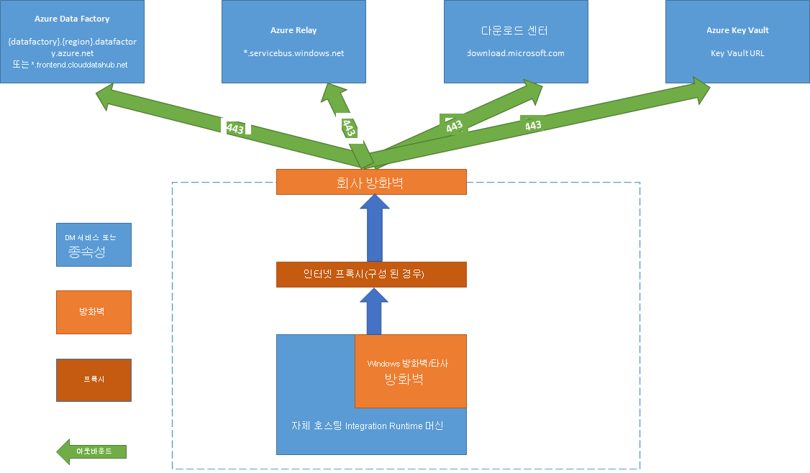

# <a name="create-and-configure-a-self-hosted-integration-runtime"></a>자체 호스팅 통합 런타임 만들기 및 구성
IR(통합 런타임)은 서로 다른 네트워크 환경에서 데이터 통합 기능을 제공하기 위해 Azure Data Factory에서 사용하는 계산 인프라입니다. IR에 대한 세부 정보는 [통합 런타임 개요](concepts-integration-runtime.md)를 참조하세요.

자체 호스팅 통합 런타임은 클라우드 데이터 스토리지와 프라이빗 네트워크의 데이터 스토리지 간에 복사 작업을 실행하고, 온-프레미스 네트워크 또는 Azure Virtual Network에서 계산 리소스에 대해 변환 작업을 디스패치할 수 있습니다. 자체 호스팅 통합 런타임을 설치하려면 온-프레미스 머신이나 프라이빗 네트워크 내부의 VM(가상 머신)이 필요합니다.  

이 문서에서는 자체 호스팅 IR을 만들고 구성하는 방법을 설명합니다.

[!INCLUDE [updated-for-az](../../includes/updated-for-az.md)]

## <a name="high-level-steps-to-install-a-self-hosted-ir"></a>자체 호스팅 IR을 설치하는 대략적인 단계
1. 자체 호스팅 통합 런타임을 만듭니다. 이 작업에는 Azure Data Factory UI를 사용할 수 있습니다. 다음은 PowerShell 예제입니다.

    ```powershell
    Set-AzDataFactoryV2IntegrationRuntime -ResourceGroupName $resourceGroupName -DataFactoryName $dataFactoryName -Name $selfHostedIntegrationRuntimeName -Type SelfHosted -Description "selfhosted IR description"
    ```
  
2. 로컬 컴퓨터에서 자체 호스팅 통합 런타임을 [다운로드](https://www.microsoft.com/download/details.aspx?id=39717)하여 설치합니다.

3. 인증 키를 검색한 다음 해당 키를 사용하여 자체 호스팅 통합 런타임을 등록합니다. 다음은 PowerShell 예제입니다.

    ```powershell

    Get-AzDataFactoryV2IntegrationRuntimeKey -ResourceGroupName $resourceGroupName -DataFactoryName $dataFactoryName -Name $selfHostedIntegrationRuntimeName  

    ```

## <a name="setting-up-a-self-hosted-ir-on-an-azure-vm-by-using-an-azure-resource-manager-template-automation"></a>Azure Resource Manager 템플릿(자동화)을 사용하여 Azure VM에 자체 호스팅 IR 설정
[이 Azure Resource Manager 템플릿](https://github.com/Azure/azure-quickstart-templates/tree/master/101-vms-with-selfhost-integration-runtime)을 사용하여 Azure 가상 머신에서 자체 호스팅 IR 설정을 자동화할 수 있습니다. 이 템플릿을 사용하면 노드 수를 2개 이상으로 설정하는 한 Azure 가상 네트워크 내에서 고가용성 및 확장성 기능이 포함된 완벽하게 작동하는 자체 호스팅 IR을 쉽게 사용할 수 있습니다.

## <a name="command-flow-and-data-flow"></a>명령 흐름 및 데이터 흐름
온-프레미스와 클라우드 간에 데이터를 복사할 때 이 작업은 자체 호스팅 통합 런타임을 사용하여 온-프레미스 데이터 소스와 클라우드 간에 데이터를 전송합니다.

다음은 자체 호스팅 IR을 통한 복사 단계를 요약하는 대략적인 데이터 흐름입니다.


1. 데이터 개발자가 PowerShell cmdlet을 사용하여 Azure Data Factory 내에서 자체 호스팅 통합 런타임을 만듭니다. 현재 Azure Portal은 이 기능을 지원하지 않습니다.
2. 데이터 개발자가 데이터 스토리지에 연결하는 데 사용할 자체 호스팅 통합 런타임 인스턴스를 지정하여 온-프레미스 데이터 스토리지에 대한 연결된 서비스를 만듭니다.
3. 자체 호스팅 통합 런타임 노드가 Windows DPAPI(데이터 보호 애플리케이션 프로그래밍 인터페이스)를 사용하여 자격 증명을 암호화하고 로컬에 저장합니다. 고가용성을 위해 여러 노드가 설정된 경우 자격 증명이 다른 노드 간에 동기화됩니다. 각 노드는 DPAPI를 사용하여 자격 증명을 암호화하고 로컬에 저장합니다. 자격 증명 동기화는 데이터 개발자에게는 표시되지 않으며, 자체 호스팅 IR에서 처리됩니다.    
4. 예약 및 관리를 통해 작업에 대 한 자체 호스팅된 integration runtime을 사용 하 여 통신 하는 Data Factory 서비스는 *컨트롤 채널* 공유를 사용 하는 [Azure Service Bus Relay](https://docs.microsoft.com/azure/service-bus-relay/relay-what-is-it#wcf-relay)합니다. 작업을 실행해야 할 때 데이터 팩터리가 자격 증명 정보와 함께 요청을 큐에 지정합니다(자격 증명이 아직 자체 호스팅 통합 런타임에 저장되지 않은 경우). 큐 폴링 후 자체 호스팅 통합 런타임에서 작업을 시작합니다.
5. 자체 호스팅 통합 런타임이 데이터 파이프라인에서 복사 작업이 구성된 방법에 따라 온-프레미스 스토리지와 클라우드 스토리지 간에 데이터를 복사합니다. 이 단계에서 자체 호스팅 통합 런타임은 보안(HTTPS) 채널을 통해 Azure Blob Storage 등의 클라우드 기반 스토리지 서비스와 직접 통신합니다.

## <a name="considerations-for-using-a-self-hosted-ir"></a>자체 호스팅 IR 사용을 위한 고려 사항

- 단일 자체 호스팅 통합 런타임을 여러 온-프레미스 데이터 원본에 사용할 수 있습니다. 각 자체 호스팅 통합 런타임은 같은 Azure Active Directory 테넌트 내의 다른 데이터 팩터리와만 공유할 수 있습니다. 자세한 내용은 [자체 호스팅 통합 런타임 공유](#sharing-the-self-hosted-integration-runtime-with-multiple-data-factories)를 참조하세요.
- 각 컴퓨터에는 자체 호스팅 통합 런타임 인스턴스를 하나씩만 설치할 수 있습니다. 두 데이터 팩터리에 하거나 온-프레미스 데이터 원본에 액세스 해야 하는 사용 해야 하는 경우는 [자체 호스팅 IR 공유 기능](#sharing-the-self-hosted-integration-runtime-with-multiple-data-factories) 자체 호스팅된 통합 런타임을 공유 또는 두 자체 호스팅된 통합 런타임 설치 각 데이터 팩터리가 대 한 온-프레미스 컴퓨터입니다.  
- 자체 호스팅 통합 런타임이 데이터 원본과 같은 컴퓨터에 있을 필요는 없습니다. 그러나 자체 호스팅 통합 런타임이 데이터 원본에 가까울수록 데이터 원본에 연결하는 시간이 줄어듭니다. 온-프레미스 데이터 원본을 호스트하는 컴퓨터와는 다른 컴퓨터에 자체 호스팅 통합 런타임을 설치하는 것이 좋습니다. 자체 호스팅 통합 런타임과 데이터 원본이 서로 다른 컴퓨터에 있으면 자체 호스팅 통합 런타임과 데이터 원본 간에 리소스 경합이 발생하지 않습니다.
- 서로 다른 컴퓨터의 여러 자체 호스팅 통합 런타임이 동일한 온-프레미스 데이터 원본에 연결할 수 있습니다. 두 자체 호스팅 통합 런타임이 두 데이터 팩터리를 처리하는데 두 데이터 팩터리에 동일한 온-프레미스 데이터 원본에 등록되어 있는 경우를 예로 들 수 있습니다.
- 컴퓨터에 Power BI 시나리오를 처리할 게이트웨이가 이미 설치된 경우 별도의 Azure Data Factory용 자체 호스팅 통합 런타임을 다른 컴퓨터에 설치합니다.
- 자체 호스팅 통합 런타임은 Azure Virtual Network 내에서 데이터 통합을 지원하는 데 사용되어야 합니다.
- Azure ExpressRoute를 사용하더라도 데이터 원본은 방화벽으로 보호되는 온-프레미스 데이터 원본으로 취급해야 합니다. 자체 호스팅 통합 런타임을 사용하여 서비스와 데이터 원본 간의 연결을 설정합니다.
- 클라우드의 데이터 스토리지가 Azure IaaS 가상 머신에 있더라도 자체 호스팅 통합 런타임을 사용해야 합니다.
- FIPS 규격 암호화가 설정된 Windows 서버에 설치된 자체 호스팅 통합 런타임에서는 작업이 실패할 수 있습니다. 이 문제를 해결하려면 서버에서 FIPS 규격 암호화를 사용하지 않도록 설정합니다. FIPS 호환 암호화를 사용하지 않도록 설정하려면 다음 레지스트리 값을 1(사용)에서 0(사용 안 함)으로 변경합니다. `HKLM\System\CurrentControlSet\Control\Lsa\FIPSAlgorithmPolicy\Enabled`

## <a name="prerequisites"></a>필수 조건

- 지원되는 운영 체제 버전은 Windows 7 서비스 팩 1, Windows 8.1, Windows 10, Windows Server 2008 R2 SP1, Windows Server 2012, Windows Server 2012 R2, Windows Server 2016입니다. 도메인 컨트롤러에는 자체 호스팅 통합 런타임을 설치할 수 없습니다.
- .NET Framework 4.6.1 이상이 필요합니다. Windows 7 컴퓨터에 자체 호스팅 통합 런타임을 설치하는 경우 .NET Framework 4.6.1 이상을 설치합니다. 자세한 내용은 [.NET Framework 시스템 요구 사항](/dotnet/framework/get-started/system-requirements)을 참조하세요.
- 자체 호스팅 통합 런타임 컴퓨터의 권장 구성은 최소 2GHz, 4개 코어, 8GB RAM 및 80GB 디스크입니다.
- 호스트 컴퓨터가 최대 절전 모드인 경우 자체 호스팅 통합 런타임이 데이터 요청에 응답하지 않습니다. 따라서 자체 호스팅 통합 런타임을 설치하기 전에 컴퓨터에서 전원 관리 옵션을 적절하게 구성하세요. 컴퓨터가 최대 절전 모드로 구성된 경우 자체 호스팅 통합 런타임 설치 시에 메시지가 표시됩니다.
- 자체 호스팅 통합 런타임을 성공적으로 설치 및 구성하려면 컴퓨터의 관리자여야 합니다.
- 복사 작업은 특정 빈도로 실행됩니다. 컴퓨터의 리소스(CPU, 메모리) 사용량은 사용량이 최대인 시간 및 유효 시간과 동일한 패턴을 따릅니다. 리소스 사용률은 이동하는 데이터 양에 따라 달라집니다. 여러 복사 작업이 진행 중인 경우 사용량이 많은 시간 동안 리소스 사용량이 증가하는 것을 볼 수 있습니다.

## <a name="installation-best-practices"></a>설치 모범 사례
자체 호스팅 통합 런타임은 [Microsoft 다운로드 센터](https://www.microsoft.com/download/details.aspx?id=39717)에서 MSI 설치 패키지를 다운로드하여 설치할 수 있습니다. 단계별 지침은 [온-프레미스 및 클라우드 간 데이터 이동](tutorial-hybrid-copy-powershell.md) 문서를 참조하세요.

- 호스트 컴퓨터가 최대 절전 모드로 설정되지 않도록 해당 컴퓨터에서 자체 호스팅 통합 런타임에 대한 전원 관리 옵션을 구성합니다. 호스트 컴퓨터가 최대 절전 모드로 설정되면 자체 호스팅 통합 런타임도 오프라인 상태가 됩니다.
- 자체 호스팅된 통합 런타임과 연결된 자격 증명은 정기적으로 백업합니다.

## <a name="install-and-register-self-hosted-ir-from-the-download-center"></a>다운로드 센터에서 자체 호스팅 IR 설치 및 등록

1. [Microsoft 통합 런타임 다운로드 페이지](https://www.microsoft.com/download/details.aspx?id=39717)로 이동합니다.
2. **다운로드**를 선택하고, 64비트 버전(32비트는 지원되지 않음)을 선택한 후 **다음**을 선택합니다.
3. MSI 파일을 직접 실행하거나 하드 디스크에 저장한 후에 실행합니다.
4. **시작** 페이지에서 언어를 선택하고 **다음**을 선택합니다.
5. Microsoft 소프트웨어 사용 조건에 동의하고 **다음**을 선택합니다.
6. 자체 호스팅 통합 런타임을 설치할 **폴더**를 선택하고 **다음**을 선택합니다.
7. **설치 준비 완료** 페이지에서 **설치**를 선택합니다.
8. **마침**을 클릭하고 설치를 완료합니다.
9. Azure PowerShell을 사용하여 인증 키를 가져옵니다. 인증 키 검색을 위한 PowerShell 예제는 다음과 같습니다.

    ```powershell
    Get-AzDataFactoryV2IntegrationRuntimeKey -ResourceGroupName $resourceGroupName -DataFactoryName $dataFactoryName -Name $selfHostedIntegrationRuntime
    ```
11. 컴퓨터에서 실행되는 Microsoft 통합 런타임 구성 관리자의 **통합 런타임(자체 호스팅) 등록** 페이지에서 다음 단계를 수행합니다.

    a. 텍스트 영역에 인증 키를 붙여넣습니다.

    b. 필요에 따라 **인증 키 표시**를 선택하여 키 텍스트를 확인합니다.

    다. **등록**을 선택합니다.


## <a name="high-availability-and-scalability"></a>고가용성 및 확장성
자체 호스팅된 통합 런타임을 여러 온-프레미스 컴퓨터나 Azure에서 가상 컴퓨터를 사용 하 여 연결할 수 있습니다. 이러한 컴퓨터를 노드라고 합니다. 최대 4개의 노드를 자체 호스팅 통합 런타임에 연결할 수 있습니다. 논리 게이트웨이에 여러 노드(게이트웨이가 설치된 온-프레미스 컴퓨터)를 사용하는 경우의 이점은 다음과 같습니다.
* 최대 4개의 노드를 연결하여 장애 시에도 작업을 계속할 수 있으므로 클라우드 데이터와 Azure Data Factory 통합 또는 빅 데이터 솔루션에서 더 이상 단일 장애 지점이 발생하지 않습니다. 따라서 자체 호스팅 통합 런타임의 가용성이 높아집니다.
* 온-프레미스 및 클라우드 데이터 저장소 간의 데이터 이동 성능 및 처리량을 향상시킵니다. 자세한 내용은 [성능 비교](copy-activity-performance.md)를 참조하세요.

[다운로드 센터](https://www.microsoft.com/download/details.aspx?id=39717)에서 자체 호스팅 통합 런타임 소프트웨어를 설치해 여러 노드를 연결할 수 있습니다. 다음, 등록에서 얻은 인증 키 중 하나를 사용 하 여는 **새로 만들기-AzDataFactoryV2IntegrationRuntimeKey** 에 설명 된 대로 cmdlet는 [자습서](tutorial-hybrid-copy-powershell.md)합니다.

> [!NOTE]
> 각 노드 연결을 위해 자체 호스팅 통합 런타임을 새로 만들 필요는 없습니다. 자체 호스팅 통합 런타임을 다른 컴퓨터에서 설치하고 동일한 인증 키를 사용하여 등록할 수 있습니다. 

> [!NOTE]
> 고가용성과 확장성 보장을 위해 다른 노드를 추가하기 전에 첫 번째 노드에서 **Microsoft 통합 런타임 구성 관리자** > **설정** > **인트라넷 원격 액세스**로 이동하여 **인트라넷 원격 액세스** 옵션이 사용하도록 설정되어 있는지 확인합니다. 

### <a name="scale-considerations"></a>크기 조정 고려 사항

#### <a name="scale-out"></a>확장

자체 호스팅 IR에서 사용 가능한 메모리가 부족하고 CPU 사용량이 많을 경우 새 노드를 추가하면 부하의 규모를 여러 컴퓨터로 확장할 수 있습니다. 시간이 초과되거나 자체 호스팅 IR 노드가 오프라인 상태여서 활동이 실패하는 경우 게이트웨이에 노드를 추가하면 활동을 수행할 수 있습니다.

#### <a name="scale-up"></a>강화

사용 가능한 메모리와 CPU가 적절하게 활용되지 않는데 동시 작업 실행 수가 한도에 도달하는 경우에는 노드에서 실행할 수 있는 동시 작업 수를 늘려 기능을 강화해야 합니다. 또한 자체 호스팅 IR 오버로드로 인해 활동 시간이 초과되는 경우에도 기능을 강화할 수 있습니다. 다음 이미지와 같이 노드의 최대 용량을 늘릴 수 있습니다.  


### <a name="tlsssl-certificate-requirements"></a>TLS/SSL 인증서 요구 사항

Integration Runtime 노드 간의 통신 보안에 사용되는 TLS/SSL 인증서에 대한 요구 사항은 다음과 같습니다.

- 인증서는 공개적으로 신뢰할 수 있는 X509 v3 인증서여야 합니다. 공용(파트너) CA(인증 기관)에서 발급한 인증서를 사용하는 것이 좋습니다.
- 각 통합 런타임 노드는 이 인증서를 신뢰해야 합니다.
- SAN(주체 대체 이름) 인증서는 사용하지 않는 것이 좋습니다. 현재 적용되는 제한 때문에 마지막 SAN 항목만 사용되고 다른 항목은 무시되기 때문입니다. 해당 SAN이 **node1.domain.contoso.com** 및 **node2.domain.contoso.com**인 SAN 인증서는 FQDN이 **node2.domain.contoso.com**인 컴퓨터에서만 사용할 수 있습니다.
- Windows Server 2012 R2에서 지원하는 SSL 인증서의 키 크기는 모두 지원됩니다.
- CNG 키를 사용하는 인증서는 지원되지 않습니다.  

> [!NOTE]
> 이 인증서는 암호화에 사용 되는 자체 호스팅 IR 노드의 포트에 사용 됩니다 **노드 간 통신** (에 대 한 연결 된 서비스를 포함 하는 동기화 상태 노드에서 동기화 자격 증명) 및 while **PowerShell을 사용 하 여 연결 된 서비스에 대 한 cmdlet credential 설정을** 에서 로컬 네트워크 내에서. 프라이빗 네트워크 환경이 안전하지 않거나 프라이빗 네트워크 내의 노드 간 통신을 보호하려는 경우 이 인증서를 사용하는 것이 좋습니다. 자체 호스팅된 IR에서 다른 데이터 저장소로 전송되는 데이터 이동은이 인증서의 설정 여부와 관계 없이 항상 암호화된 채널을 사용하여 이루어집니다. 

## <a name="sharing-the-self-hosted-integration-runtime-with-multiple-data-factories"></a>여러 데이터 팩터리와 자체 호스팅 통합 런타임 공유

데이터 팩터리에 이미 설치한 기존의 자체 호스팅 통합 런타임 인프라를 재사용할 수 있습니다. 이렇게 하면 기존 자체 호스팅 IR(공유됨)을 참조하여 다른 데이터 팩터리에서 *연결된 자체 호스팅 통합 런타임*을 만들 수 있습니다.

PowerShell을 사용하여 자체 호스팅 통합 런타임을 공유하려면 [PowerShell을 사용하여 Azure Data Factory에서 자체 호스팅 통합 런타임 공유 만들기](create-shared-self-hosted-integration-runtime-powershell.md)를 참조하세요.

이 기능의 소개 및 데모에 대한 12분짜리 다음 비디오를 시청하세요.

> [!VIDEO https://channel9.msdn.com/Shows/Azure-Friday/Hybrid-data-movement-across-multiple-Azure-Data-Factories/player]

### <a name="terminology"></a>용어

- **공유된 IR**: 물리적 인프라에서 실행되는 원래 자체 호스팅 IR입니다.  
- **연결된 IR**: 다른 공유된 IR을 참조하는 IR입니다. 논리적 IR이며, 다른 자체 호스팅 IR(공유됨)의 인프라를 사용합니다.

### <a name="high-level-steps-for-creating-a-linked-self-hosted-ir"></a>연결된 자체 호스팅 IR을 만드는 대략적인 단계

1. 공유할 자체 호스팅 IR에서 연결된 IR을 만들려면 데이터 팩터리에 대한 권한을 부여합니다. 

   

   

2. 공유할 자체 호스팅 IR의 리소스 ID를 적어 둡니다.

   

3. 권한이 부여된 데이터 팩터리에서 연결된 자체 호스팅 IR을 새로 만들고 리소스 ID를 입력합니다.

   

   

### <a name="monitoring"></a>모니터링 

- **공유된 IR**

  

  

- **연결된 IR**

  

  

### <a name="known-limitations-of-self-hosted-ir-sharing"></a>자체 호스팅 IR 공유에 대해 알려진 제한 사항

* 연결된 IR을 만드는 데이터 팩터리에는 [MSI](https://docs.microsoft.com/azure/active-directory/managed-service-identity/overview)가 있어야 합니다. 기본적으로 Azure Portal 또는 PowerShell cmdlet에서 만든 데이터 팩터리에서는 MSI가 암시적으로 생성됩니다. 그러나 Azure Resource Manager 템플릿 또는 SDK를 통해 데이터 팩터리를 만들 때는 Azure Resource Manager가 MSI를 포함하는 데이터 팩터리를 만들도록 **Identity** 속성을 명시적으로 설정해야 합니다. 

* 이 기능을 지원하는 Azure Data Factory .NET SDK는 버전 1.1.0 이상입니다.

* 권한을 부여하려면 사용자에게 소유자 역할 또는 공유된 IR이 있는 데이터 팩터리의 상속된 소유자 역할이 있어야 합니다.

* 공유 기능은 동일한 Azure Active Directory 테넌트 내의 데이터 팩터리에서만 작동합니다.

* Active Directory [게스트 사용자](https://docs.microsoft.com/azure/active-directory/governance/manage-guest-access-with-access-reviews)의 경우에는 UI의 검색 기능(검색 키워드를 사용하여 모든 데이터 팩터리 나열)이 [작동하지 않습니다](https://msdn.microsoft.com/library/azure/ad/graph/howto/azure-ad-graph-api-permission-scopes#SearchLimits). 하지만 데이터 팩터리의 소유자인 게스트 사용자는 검색 기능을 사용하지 않고도 IR을 공유할 수 있습니다. 이렇게 하려면 IR을 공유해야 하는 데이터 팩터리의 MSI를 **권한 할당** 텍스트 상자에 직접 입력한 다음 Azure Data Factory UI에서 **추가**를 선택합니다. 

  > [!NOTE]
  > 이 기능은 Azure Data Factory V2에서만 사용할 수 있습니다. 

## <a name="notification-area-icons-and-notifications"></a>알림 영역 아이콘 및 알림

알림 영역의 아이콘이나 메시지 위로 커서를 이동하면 자체 호스팅 통합 런타임 상태에 대한 세부 정보를 확인할 수 있습니다.


## <a name="ports-and-firewall"></a>포트 및 방화벽
두 가지 방화벽을 고려해야 합니다. 그중 하나는 조직의 중앙 라우터에서 실행되는 *회사 방화벽*이고, 다른 하나는 자체 호스팅 통합 런타임이 설치된 로컬 컴퓨터에 디먼으로 구성된 *Windows 방화벽*입니다.



*회사 방화벽* 수준에서는 다음 도메인 및 아웃바운드 포트를 구성해야 합니다.

도메인 이름 | 포트 | 설명
------------ | ----- | ------------
\*.servicebus.windows.net | 443 | 백 엔드 데이터 이동 서비스와의 통신에 사용됨
*.core.windows.net | 443 | Azure Blob 스토리지(구성된 경우)를 통한 준비된 복사에 사용됨
*.frontend.clouddatahub.net | 443 | 백 엔드 데이터 이동 서비스와의 통신에 사용됨
download.microsoft.com | 443 | 업데이트 다운로드에 사용됨

*Windows 방화벽* 수준(컴퓨터 수준)에서 이러한 아웃바운드 포트가 대개 사용하도록 설정됩니다. 해당 포트가 사용하도록 설정되어 있지 않으면 자체 호스팅 통합 런타임 컴퓨터에서 도메인 및 포트를 적절하게 구성할 수 있습니다.

> [!NOTE]
> 원본/싱크에 따라 회사 방화벽 또는 Windows 방화벽에서 추가 도메인 및 아웃바운드 포트를 허용 목록에 추가해야 할 수 있습니다.
>
> Azure SQL Database 및 Azure Data Lake와 같은 일부 클라우드 데이터베이스의 경우에는 해당 방화벽 구성에서 자체 호스팅 통합 런타임의 IP 주소를 허용 목록에 포함해야 할 수 있습니다.

### <a name="copy-data-from-a-source-to-a-sink"></a>원본에서 싱크로 데이터 복사
방화벽 규칙이 회사 방화벽, 자체 호스팅 통합 런타임 컴퓨터의 Windows 방화벽 및 데이터 스토리지 자체에 올바르게 설정되어 있는지 확인합니다. 이러한 규칙을 사용하면 자체 호스팅 통합 런타임이 원본과 싱크에 모두 정상적으로 연결할 수 있습니다. 복사 작업과 관련된 각 데이터 저장소에 대해 규칙을 사용하도록 설정합니다.

예를 들어 온-프레미스 데이터 저장소에서 Azure SQL Database 싱크 또는 Azure SQL Data Warehouse 싱크로 복사하려면 다음 단계를 수행합니다.

1. Windows 방화벽 및 회사 방화벽 둘 다에 대해 포트 1433에서 아웃바운드 TCP 통신을 허용합니다.
2. Azure SQL 데이터베이스의 방화벽 설정을 구성하여 허용된 IP 주소 목록에 자체 호스팅 통합 런타임 머신의 IP 주소를 추가합니다.

> [!NOTE]
> 방화벽이 아웃바운드 포트 1433을 허용하지 않으면 자체 호스팅 통합 런타임은 Azure SQL 데이터베이스에 직접 액세스할 수 없습니다. 이 경우 Azure SQL Database 및 Azure SQL Data Warehouse로의 [준비된 복사](copy-activity-performance.md)를 사용할 수 있습니다. 이 시나리오에서는 데이터 이동에 HTTPS(포트 443)만 필요합니다.


## <a name="proxy-server-considerations"></a>프록시 서버 고려 사항
회사 네트워크 환경에서 프록시 서버를 사용하여 인터넷에 액세스하는 경우 자체 호스팅 통합 런타임이 적절한 프록시 설정을 사용하도록 구성합니다. 초기 등록 단계에서 프록시를 설정할 수 있습니다.


프록시 서버를 사용 하 여 클라우드 서비스에 연결 하려면 원본 자체 호스팅된 integration runtime 구성 되 면 / 대상 (HTTP를 사용 하 여 / HTTPS 프로토콜). 이 선택 **변경 링크** 초기 설정 중입니다. 그러면 프록시 설정 대화 상자가 나타납니다.


이 대화 상자에는 세 가지 구성 옵션이 있습니다.

- **프록시 사용 안 함**: 자체 호스팅 통합 런타임이 클라우드 서비스에 연결하는 데 프록시를 명시적으로 사용하지 않습니다.
- **시스템 프록시 사용**: 자체 호스팅 통합 런타임이 diahost.exe.config 및 diawp.exe.config에 구성되어 있는 프록시 설정을 사용합니다. diahost.exe.config 및 diawp.exe.config에 프록시가 구성되어 있지 않으면 자체 호스팅 통합 런타임은 프록시를 거치지 않고 클라우드 서비스에 직접 연결합니다.
- **사용자 지정 프록시 사용**: diahost.exe.config 및 diawp.exe.config의 구성을 사용하는 대신 자체 호스팅 통합 런타임에 사용할 HTTP 프록시 설정을 구성합니다. 이 경우 **주소** 및 **포트**를 지정해야 합니다. **사용자 이름** 및 **암호**는 프록시 인증 설정에 따라 입력할 수 있습니다. 모든 설정은 자체 호스팅 통합 런타임d에서 Windows DPAPI를 사용하여 암호화되며 컴퓨터에 로컬로 저장됩니다.

업데이트된 프록시 설정을 저장하고 나면 통합 런타임 호스트 서비스가 자동으로 다시 시작됩니다.

자체 호스팅 통합 런타임을 올바르게 등록한 후 프록시 설정을 확인하거나 업데이트하려면 통합 런타임 구성 관리자를 사용합니다.

1. **Microsoft 통합 런타임 구성 관리자**를 엽니다.
2. **설정** 탭으로 전환합니다.
3. **HTTP 프록시** 섹션에서 **변경** 링크를 선택하여 **HTTP 프록시 설정** 대화 상자를 엽니다.
4. **다음**을 선택합니다. 그러면 프록시 설정을 저장하고 통합 런타임 호스트 서비스를 다시 시작하기 위한 권한이 필요하다는 경고가 표시됩니다.

구성 관리자 도구를 사용하여 HTTP 프록시를 확인하고 업데이트할 수 있습니다.


> [!NOTE]
> NTLM 인증을 사용하여 프록시 서버를 설치하면 통합 런타임 호스트 서비스가 도메인 계정에서 실행됩니다. 나중에 도메인 계정의 암호를 변경하는 경우에는 서비스의 구성 설정을 업데이트하여 서비스를 다시 시작해야 합니다. 이 요구 사항을 감안하여, 암호를 자주 업데이트하지 않아도 되는 전용 도메인 계정을 사용해 프록시 서버에 액세스하는 것이 좋습니다.

### <a name="configure-proxy-server-settings"></a>프록시 서버 설정 구성

HTTP 프록시에 대해 **시스템 프록시 사용** 설정을 선택하는 경우 자체 호스팅 통합 런타임은 diahost.exe.config 및 diawp.exe.config의 프록시 설정을 사용합니다. diahost.exe.config 및 diawp.exe.config에 프록시가 지정되어 있지 않으면 자체 호스팅 통합 런타임은 프록시를 거치지 않고 클라우드 서비스에 직접 연결합니다. 다음 절차에서는 diahost.exe.config 파일을 업데이트하는 지침을 제공합니다.

1. 파일 탐색기에서 원본 파일을 백업할 C:\Program Files\Microsoft Integration Runtime\3.0\Shared\diahost.exe.config의 안전한 복사본을 만듭니다.
2. 관리자 권한으로 Notepad.exe를 열고 텍스트 파일 C:\Program Files\Microsoft Integration Runtime\3.0\Shared\diahost.exe.config를 엽니다. 다음 코드와 같이 system.net에 대한 기본 태그를 찾습니다.

    ```xml
    <system.net>
        <defaultProxy useDefaultCredentials="true" />
    </system.net>
    ```
    그러면 다음 예제와 같이 프록시 서버 세부 정보를 추가할 수 있습니다.

    ```xml
    <system.net>
        <defaultProxy enabled="true">
              <proxy bypassonlocal="true" proxyaddress="http://proxy.domain.org:8888/" />
        </defaultProxy>
    </system.net>
    ```

    프록시 태그 내에 `scriptLocation`과 같은 필수 설정을 지정하는 추가 속성을 사용할 수 있습니다. 구문은 [proxy 요소(네트워크 설정)](https://msdn.microsoft.com/library/sa91de1e.aspx)를 참조하세요.

    ```xml
    <proxy autoDetect="true|false|unspecified" bypassonlocal="true|false|unspecified" proxyaddress="uriString" scriptLocation="uriString" usesystemdefault="true|false|unspecified "/>
    ```
3. 구성 파일을 원래 위치에 저장한 다음 자체 호스팅 통합 런타임 호스트 서비스를 다시 시작하면 변경 내용이 적용됩니다. 

   서비스를 다시 시작하려면 제어판에서 서비스 애플릿을 사용합니다. 또는 통합 런타임 구성 관리자에서 **서비스 중지** 단추를 선택한 후 **서비스 시작**을 선택합니다. 
   
   서비스가 시작되지 않으면 잘못된 XML 태그 구문이 편집된 애플리케이션 구성 파일에 추가되었을 가능성이 높습니다.

> [!IMPORTANT]
> diahost.exe.config 및 diawp.exe.config를 둘 다 업데이트해야 합니다.

Microsoft Azure가 회사의 허용 목록에 있는지도 확인해야 합니다. [Microsoft 다운로드 센터](https://www.microsoft.com/download/details.aspx?id=41653)에서 유효한 Microsoft Azure IP 주소의 목록을 다운로드할 수 있습니다.

### <a name="possible-symptoms-for-firewall-and-proxy-server-related-issues"></a>방화벽 및 프록시 서버 관련 문제 발생 시 나타날 수 있는 증상
다음과 비슷한 오류가 발생할 경우 방화벽 또는 프록시 서버가 잘못 구성된 것일 수 있습니다. 그러면 자체 호스팅 통합 런타임이 데이터 팩터리에 연결되어 인증을 할 수 없게 됩니다. 이전 섹션을 참조하여 방화벽 및 프록시 서버가 올바르게 구성되었는지 확인합니다.

* 자체 호스팅 통합 런타임을 등록할 때 다음과 같은 오류 메시지가 표시됩니다. "이 Integration Runtime 노드를 등록하지 못했습니다. 인증 키가 유효하고 통합 런타임 호스트 서비스가 이 컴퓨터에서 실행 중인지 확인하십시오.”
* 통합 런타임 구성 관리자를 열 때 상태가 **연결 끊김** 또는 **연결 중**으로 표시됩니다. Windows 이벤트 로그를 확인할 때 **이벤트 뷰어** > **애플리케이션 및 서비스 로그** > **Microsoft 통합 런타임**에 다음 오류와 같은 오류 메시지가 표시됩니다.

    ```
    Unable to connect to the remote server
    A component of Integration Runtime has become unresponsive and restarts automatically. Component name: Integration Runtime (Self-hosted).
    ```

### <a name="enabling-remote-access-from-an-intranet"></a>인트라넷에서 원격 액세스를 사용하도록 설정  
PowerShell을 사용 하 여 자체 호스팅된 통합 런타임이 설치 된 위치 이외의 다른 컴퓨터 (네트워크)에서 자격 증명을 암호화 하는 경우 사용할 수 있습니다 합니다 **인트라넷에서 원격 액세스** 옵션입니다. PowerShell을 실행 하는 동일한 컴퓨터에 자격 증명을 암호화 자체 호스팅된 통합 런타임이 설치 되어 있는 경우 사용할 수 없습니다 **인트라넷에서 원격 액세스**합니다.

고가용성과 확장성을 보장하기 위해 다른 노드를 추가하기 전에 **인트라넷에서 원격 액세스**를 사용하도록 설정해야 합니다.  

자체 호스팅 통합 런타임 설치(버전 3.3.xxxx.x 이상) 중에는 기본적으로 **인트라넷에서 원격 액세스**가 자체 호스팅 통합 런타임 컴퓨터에서 사용하지 않도록 설정됩니다.

타사 방화벽을 사용 중인 경우 포트 8060 또는 사용자가 구성한 포트를 수동으로 열 수 있습니다. 자체 호스팅 통합 런타임을 설치하는 동안 방화벽 문제가 발생하는 경우 다음 명령을 사용하여 방화벽을 구성하지 않고 자체 호스팅 통합 런타임을 설치할 수 있습니다.

```
msiexec /q /i IntegrationRuntime.msi NOFIREWALL=1
``` 

자체 호스팅 통합 런타임 컴퓨터에서 포트 8060을 열지 않는 경우 자격 증명 설정 애플리케이션을 사용하는 방식 이외의 메커니즘을 사용하여 데이터 스토리지 자격 증명을 구성합니다. 예를 들어 사용할 수 있습니다 합니다 **새로 만들기-AzDataFactoryV2LinkedServiceEncryptCredential** PowerShell cmdlet.


## <a name="next-steps"></a>다음 단계
단계별 지침은 다음 자습서를 참조하세요. [자습서: 클라우드에 온-프레미스 데이터 복사](tutorial-hybrid-copy-powershell.md)
