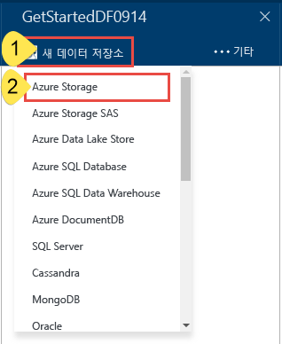
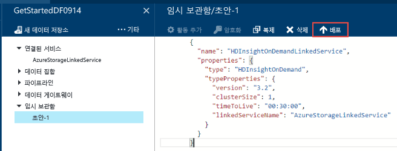

<properties
	pageTitle="첫 번째 데이터 팩터리(Azure 포털) 빌드 | Microsoft Azure"
	description="이 자습서에서는 Azure 포털의 데이터 팩터리 편집기를 사용하여 샘플 Azure Data Factory 파이프라인을 만듭니다."
	services="data-factory"
	documentationCenter=""
	authors="spelluru"
	manager="jhubbard"
	editor="monicar"/>

<tags
	ms.service="data-factory"
	ms.workload="data-services"
	ms.tgt_pltfrm="na"
	ms.devlang="na"
	ms.topic="hero-article" 
	ms.date="09/14/2016"
	ms.author="spelluru"/>

# 자습서: Azure Portal을 사용하여 첫 번째 Azure Data Factory 빌드
> [AZURE.SELECTOR]
- [개요 및 필수 구성 요소](data-factory-build-your-first-pipeline.md)
- [Azure 포털](data-factory-build-your-first-pipeline-using-editor.md)
- [Visual Studio](data-factory-build-your-first-pipeline-using-vs.md)
- [PowerShell](data-factory-build-your-first-pipeline-using-powershell.md)
- [Resource Manager 템플릿](data-factory-build-your-first-pipeline-using-arm.md)
- [REST API](data-factory-build-your-first-pipeline-using-rest-api.md)

이 문서에서는 [Azure 포털](https://portal.azure.com/)을 사용하여 첫 번째 Azure Data Factory를 만드는 방법을 알아봅니다.

## 필수 조건		
1. [자습서 개요](data-factory-build-your-first-pipeline.md) 문서를 살펴보고 **필수 구성 요소** 단계를 완료합니다.
2. 이 문서는 Azure Data Factory 서비스에 대한 개념적 개요를 제공하지 않습니다. 서비스의 자세한 개요는 [Azure Data Factory 소개](data-factory-introduction.md) 문서를 읽어보는 것이 좋습니다.

## 데이터 팩터리 만들기
데이터 팩터리에는 하나 이상의 파이프라인이 포함될 수 있습니다. 파이프라인에는 하나 이상의 작업이 있을 수 있습니다. 예를 들어 원본에서 대상 데이터 저장소에 데이터를 복사하는 복사 작업 및 입력 데이터를 제품 출력 데이터로 변환하는 Hive 스크립트를 실행하는 HDInsight Hive 작업입니다. 이 단계에서는 데이터 팩터리 만들기를 시작하겠습니다.

1.	[Azure 포털](https://portal.azure.com/)에 로그인합니다.
2.	왼쪽 메뉴에서 **새로 만들기**를 클릭하고 **데이터 + 분석**을 클릭하고 **데이터 팩터리**를 클릭합니다.
		
	

2.	**새 데이터 팩터리** 블레이드에서 이름으로 **GetStartedDF**를 입력합니다.

	

	> [AZURE.IMPORTANT] 
	Azure Data Factory의 이름은 **전역적으로 고유**해야 합니다. **데이터 팩터리 이름 "GetStartedDF"를 사용할 수 없습니다**라는 오류를 수신하는 경우. 데이터 팩터리(예: yournameGetStartedDF)의 이름을 변경하고 다시 만듭니다. 데이터 팩터리 아티팩트에 대한 명명 규칙은 [데이터 팩터리 - 명명 규칙](data-factory-naming-rules.md) 항목을 참조하세요.
	> 
	> 데이터 팩터리의 이름은 나중에 **DNS** 이름으로 표시되므로 공개적으로 등록될 수도 있습니다.

3.	데이터 팩터리를 만들려는 위치의 **Azure 구독**을 선택합니다.
4.	기존 **리소스 그룹**을 선택하거나 리소스 그룹을 만듭니다. 이 자습서에서 **ADFGetStartedRG**라는 이름의 리소스 그룹을 만듭니다.
5.	**새 데이터 팩터리** 블레이드에서 **만들기**를 클릭합니다.

	> [AZURE.IMPORTANT] 데이터 팩터리 인스턴스를 만들려면 구독/리소스 그룹 수준에서 [데이터 팩터리 참여자](../active-directory/role-based-access-built-in-roles.md/#data-factory-contributor) 역할의 구성원이어야 합니다.
6.	다음과 같이 Azure 포털의 **시작 보드**에 생성되는 데이터 팩터리가 표시됩니다.

	
7. 축하합니다. 첫 번째 데이터 팩터리 만들기가 완료되었습니다. 데이터 팩터리 만들기를 완료한 후에는 데이터 팩터리 페이지가 표시되며 여기에 데이터 팩터리의 내용이 표시됩니다.

	

데이터 팩터리에서 파이프라인을 만들기 전에 먼저 몇 가지 데이터 팩터리 엔터티를 만들어야 합니다. 먼저 데이터 저장소에 데이터 저장소/계산을 연결하는 연결된 서비스를 만들고 연결된 데이터 저장소에서 데이터를 나타내는 입력 및 출력 데이터 집합을 정의한 다음 이러한 데이터 집합을 사용하는 작업을 통해 파이프라인을 만듭니다.

## 연결된 서비스 만들기
이 단계에서는 Azure Storage 계정 및 주문형 Azure HDInsight 클러스터를 데이터 팩터리에 연결합니다. Azure Storage 계정은 이 샘플의 파이프라인에 대한 입력 및 출력 데이터를 가집니다. HDInsight 연결된 서비스는 이 샘플에서 파이프라인의 활동에 지정된 Hive 스크립트를 실행하는 데 사용됩니다. 시나리오에 사용되는 [데이터 저장소](data-factory-data-movement-activities.md)/[계산 서비스](data-factory-compute-linked-services.md)를 식별하고 연결된 서비스를 만들어 해당 서비스를 데이터 팩터리에 연결합니다.

### Azure 저장소 연결된 서비스 만들기
이 단계에서는 Azure Storage 계정을 데이터 팩터리에 연결합니다. 이 자습서에서는 동일한 Azure Storage 계정을 사용하여 입력/출력 데이터 및 HQL 스크립트 파일을 저장합니다.

1.	**GetStartedDF**에 대한 **데이터 팩터리** 블레이드에서 **작성 및 배포**를 클릭합니다. 데이터 팩터리 편집기가 표시되어야 합니다.
	 
	
2.	**새 데이터 저장소**를 클릭하고 **Azure Storage**를 선택합니다.

	

3.	편집기에 Azure 저장소 연결된 서비스를 만들기 위한 JSON 스크립트가 표시됩니다.
	
	
	 
4. **계정 이름**을 Azure 저장소 계정 이름으로 변경하고 **계정 키**를 Azure 저장소 계정의 선택키로 변경합니다. 저장소 액세스 키를 확보하는 방법을 알아보려면 [저장소 액세스 키 보기, 복사 및 다시 생성](../storage/storage-create-storage-account.md#view-copy-and-regenerate-storage-access-keys)을 참조하세요.
5. 명령 모음에서 **배포**를 클릭하여 연결된 서비스를 배포합니다.

	

   연결된 서비스를 성공적으로 배포한 후에 **Draft-1** 창은 사라지고 왼쪽의 트리 보기에 **AzureStorageLinkedService**가 표시됩니다. 

 
### Azure HDInsight 연결된 서비스 만들기
이 단계에서는 데이터 팩터리에 주문형 HDInsight 클러스터를 연결합니다. HDInsight 클러스터는 런타임 시 자동으로 만들어지며 처리가 완료되고 지정된 시간 동안 유휴 상태를 유지한 후에 삭제됩니다.

1. **데이터 팩터리 편집기**에서 **... 추가**를 클릭하고 **새 계산**을 클릭하고 **주문형 HDInsight 클러스터**를 선택합니다.

	
2. 다음 코드 조각을 복사하여 **Draft-1** 창에 붙여넣습니다. JSON 코드 조각은 주문형 HDInsight 클러스터를 만드는데 사용될 속성을 설명합니다.

		{
		  "name": "HDInsightOnDemandLinkedService",
		  "properties": {
		    "type": "HDInsightOnDemand",
		    "typeProperties": {
		      "version": "3.2",
		      "clusterSize": 1,
		      "timeToLive": "00:30:00",
		      "linkedServiceName": "AzureStorageLinkedService"
		    }
		  }
		}
	
	다음 테이블은 코드 조각에 사용된 JSON 속성에 대한 설명을 제공합니다.
	
	| 속성 | 설명 |
	| :------- | :---------- |
	| 버전 | 생성되는 HDInsight 버전을 3.2로 지정합니다. | 
	| ClusterSize | HDInsight 클러스터의 크기를 지정합니다. | 
	| TimeToLive | HDInsight 클러스터가 삭제되기 전 유휴 시간을 지정합니다. |
	| linkedServiceName | HDInsight에 의해 생성되는 로그를 저장하는데 사용될 저장소 계정을 지정합니다. |

	다음 사항에 유의하세요.
	
	- 데이터 팩터리는 JSON으로 사용자에게 **Windows 기반** HDInsight 클러스터를 만들어 줍니다. **Linux 기반** HDInsight 클러스터를 만들도록 지정할 수도 있습니다. 자세한 내용은 [주문형 HDInsight 연결된 서비스](data-factory-compute-linked-services.md#azure-hdinsight-on-demand-linked-service)를 참조하세요.
	- 주문형 HDInsight 클러스터를 사용하는 대신 **고유의 HDInsight 클러스터**를 사용할 수 있습니다. 자세한 내용은 [HDInsight 연결된 서비스](data-factory-compute-linked-services.md#azure-hdinsight-linked-service)를 참조하세요.
	- HDInsight 클러스터는 JSON(**linkedServiceName**)에서 지정한 Blob 저장소에 **기본 컨테이너**를 만듭니다. HDInsight는 클러스터가 삭제될 때 이 컨테이너를 삭제하지 않습니다. 이 동작은 의도된 것입니다. 주문형 HDInsight 연결된 서비스에서는 기존 라이브 클러스터(**timeToLive**)가 없는 한 슬라이스를 처리할 때마다 HDInsight 클러스터가 만들어집니다. 클러스터는 처리가 완료되면 자동으로 삭제됩니다.
	
		많은 조각이 처리될수록 Azure Blob 저장소에 컨테이너가 많아집니다. 작업의 문제 해결을 위해 이 항목들이 필요하지 않다면 저장소 비용을 줄이기 위해 삭제할 수 있습니다. 이 컨테이너의 이름은 "adf**yourdatafactoryname**-**linkedservicename**-datetimestamp" 패턴을 따릅니다. [Microsoft 저장소 탐색기](http://storageexplorer.com/) 같은 도구를 사용하여 Azure Blob 저장소에서 컨테이너를 삭제합니다.

	자세한 내용은 [주문형 HDInsight 연결된 서비스](data-factory-compute-linked-services.md#azure-hdinsight-on-demand-linked-service)를 참조하세요.
3. 명령 모음에서 **배포**를 클릭하여 연결된 서비스를 배포합니다.

	

4. 왼쪽의 트리 뷰에서 **AzureStorageLinkedService** 및 **HDInsightOnDemandLinkedService**가 모두 표시되는지 확인합니다.

	

## 데이터 집합 만들기
이 단계에서는 Hive 처리에 대한 입력 및 출력 데이터를 나타내는 데이터 집합을 만듭니다. 이러한 데이터 집합은 이 자습서의 앞부분에서 만든 **AzureStorageLinkedService**를 참조합니다. 연결된 서비스는 Azure 저장소 계정을 가리키고 데이터 집합은 입력 및 출력 데이터를 가진 저장소의 컨테이너, 폴더, 파일 이름을 지정합니다.

### 입력 데이터 집합 만들기

1. **데이터 팩터리 편집기**의 명령 모음에서 **... 추가**를 클릭하고 **새 데이터 집합**을 클릭하고 **Azure Blob Storage**를 선택합니다.

	
2. 다음 코드 조각을 복사하여 Draft-1 창에 붙여넣습니다. JSON 조각에서 파이프라인의 활동에 대한 입력 데이터를 나타내는 **AzureBlobInput**라는 데이터 집합을 만듭니다. 또한 결과가 **adfgetstarted**라는 Blob 컨테이너 및 **inputdata**라는 폴더에 저장되도록 지정합니다.
		
		{
			"name": "AzureBlobInput",
		    "properties": {
		        "type": "AzureBlob",
		        "linkedServiceName": "AzureStorageLinkedService",
		        "typeProperties": {
		            "fileName": "input.log",
		            "folderPath": "adfgetstarted/inputdata",
		            "format": {
		                "type": "TextFormat",
		                "columnDelimiter": ","
		            }
		        },
		        "availability": {
		            "frequency": "Month",
		            "interval": 1
		        },
		        "external": true,
		        "policy": {}
		    }
		} 

	다음 테이블은 코드 조각에 사용된 JSON 속성에 대한 설명을 제공합니다.

	| 속성 | 설명 |
	| :------- | :---------- |
	| type | Azure blob 저장소에 데이터가 있기 때문에 형식 속성은 AzureBlob로 설정됩니다. |  
	| linkedServiceName | 이전에 만든 AzureStorageLinkedService를 참조합니다. |
	| fileName | 이 속성은 선택 사항입니다. 이 속성을 생략하면 folderPath의 모든 파일을 선택합니다. 이 경우에 input.log만 처리됩니다. |
	| type | 로그 파일이 텍스트 형식이므로 TextFormat을 사용합니다. | 
	| columnDelimiter | 로그 파일의 열은 ,(쉼표)로 구분됩니다. |
	| frequency/interval | 월 및 간격을 설정한 빈도가 1인 경우 입력 조각은 매월 제공됩니다. | 
	| external | 입력 데이터가 데이터 팩터리 서비스에서 생성되지 않는 경우 이 속성은 true로 설정됩니다. | 
	  	
3. 명령 모음에서 **배포**를 클릭하여 새로 만든 데이터 집합을 배포합니다. 왼쪽의 트리 보기에서 데이터 집합을 표시합니다.

### 출력 데이터 집합 만들기
Azure Blob 저장소에 저장된 출력 데이터를 나타내는 출력 데이터 집합을 만듭니다.

1. **데이터 팩터리 편집기**의 명령 모음에서 **... 추가**를 클릭하고 **새 데이터 집합**을 클릭하고 **Azure Blob Storage**를 선택합니다.
2. 다음 코드 조각을 복사하여 Draft-1 창에 붙여넣습니다. JSON 코드 조각에서 **AzureBlobOutput**이라는 데이터 집합을 만들고 Hive 스크립트에 의해 생성될 데이터의 구조를 지정합니다. 또한 결과가 **adfgetstarted**라는 Blob 컨테이너와 **partitioneddata**라는 폴더에 저장되도록 지정합니다. **가용성** 섹션은 출력 데이터 집합이 월 단위로 생성되도록 지정합니다.
	
		{
		  "name": "AzureBlobOutput",
		  "properties": {
		    "type": "AzureBlob",
		    "linkedServiceName": "AzureStorageLinkedService",
		    "typeProperties": {
		      "folderPath": "adfgetstarted/partitioneddata",
		      "format": {
		        "type": "TextFormat",
		        "columnDelimiter": ","
		      }
		    },
		    "availability": {
		      "frequency": "Month",
		      "interval": 1
		    }
		  }
		}

	이러한 속성에 대한 설명은 **입력 데이터 집합 만들기** 섹션을 참조하세요. 데이터 팩터리 서비스에서 데이터 집합이 생성되므로 출력 데이터 집합에 외부 속성을 설정하지 않습니다.
3. 명령 모음에서 **배포**를 클릭하여 새로 만든 데이터 집합을 배포합니다.
4. 데이터 집합이 성공적으로 만들어졌는지 확인합니다.

	

## 파이프라인 만들기
이 단계에서는 **HDInsightHive** 작업을 사용하여 첫 번째 파이프라인을 만듭니다. 입력 조각이 매월(빈도: 월, 간격: 1)이고 출력 조각이 매월 생성되며 작업에 대한 스케줄러 속성도 매월로 설정됩니다. 출력 데이터 집합 및 작업 스케줄러에 대한 설정이 일치해야 합니다. 현재 출력 데이터 집합이 일정을 결정하므로 작업이 출력을 생성하지 않는 경우 출력 데이터 집합을 만들어야 합니다. 활동이 입력을 가져오지 않으면 입력 데이터 집합 만들기를 건너뛸 수 있습니다. 다음 JSON에서 사용되는 속성은 이 섹션의 끝에 설명되어 있습니다.

1. **데이터 팩터리 편집기**에서 **줄임표(…) 추가 명령**을 클릭하고 **새 파이프라인**을 클릭합니다.
	
	
2. 다음 코드 조각을 복사하여 Draft-1 창에 붙여넣습니다.

	> [AZURE.IMPORTANT] **storageaccountname**을 JSON의 저장소 계정 이름으로 변경합니다.
		
		{
		    "name": "MyFirstPipeline",
		    "properties": {
		        "description": "My first Azure Data Factory pipeline",
		        "activities": [
		            {
		                "type": "HDInsightHive",
		                "typeProperties": {
		                    "scriptPath": "adfgetstarted/script/partitionweblogs.hql",
		                    "scriptLinkedService": "AzureStorageLinkedService",
		                    "defines": {
		                        "inputtable": "wasb://adfgetstarted@<storageaccountname>.blob.core.windows.net/inputdata",
		                        "partitionedtable": "wasb://adfgetstarted@<storageaccountname>.blob.core.windows.net/partitioneddata"
		                    }
		                },
		                "inputs": [
		                    {
		                        "name": "AzureBlobInput"
		                    }
		                ],
		                "outputs": [
		                    {
		                        "name": "AzureBlobOutput"
		                    }
		                ],
		                "policy": {
		                    "concurrency": 1,
		                    "retry": 3
		                },
		                "scheduler": {
		                    "frequency": "Month",
		                    "interval": 1
		                },
		                "name": "RunSampleHiveActivity",
		                "linkedServiceName": "HDInsightOnDemandLinkedService"
		            }
		        ],
		        "start": "2016-04-01T00:00:00Z",
		        "end": "2016-04-02T00:00:00Z",
		        "isPaused": false
		    }
		}
 
	JSON 코드 조각에서 Hive를 사용하여 HDInsight 클러스터에서 데이터를 처리하는 단일 작업으로 구성되는 파이프라인을 만듭니다.
	
	Hive 스크립트 파일 **partitionweblogs.hql**은 Azure Storage 계정(**AzureStorageLinkedService**라고 하는 scriptLinkedService에 의해 지정됨)과 **adfgetstarted** 컨테이너에 있는 **스크립트** 폴더에 저장됩니다.

	**defines** 섹션은 Hive 스크립트에 Hive 구성 값(예: ${hiveconf:inputtable}, ${hiveconf:partitionedtable})으로 전달되는 런타임 설정을 지정하는 데 사용됩니다.

	파이프라인의 **start** 및 **end** 속성은 파이프라인의 활성 기간을 지정합니다.

	작업 JSON에서 Hive 스크립트가 **linkedServiceName** – **HDInsightOnDemandLinkedService**에서 지정된 계산에서 실행되도록 지정합니다.

	> [AZURE.NOTE] 예에서 사용된 JSON 속성에 대한 자세한 내용은 [파이프라인의 분석](data-factory-create-pipelines.md#anatomy-of-a-pipeline)을 참조하세요.

3. 다음을 확인합니다.
	1. **input.log** 파일은 Azure Blob 저장소에서 **adfgetstarted** 컨테이너의 **inputdata** 폴더에 있습니다.
	2. **partitionweblogs.hql** 파일은 Azure Blob 저장소에서 **adfgetstarted** 컨테이너의 **스크립트** 폴더에 있습니다. 파일이 표시되지 않는 경우 [자습서 개요](data-factory-build-your-first-pipeline.md)에서 필수 단계를 완료합니다.
	3. **storageaccountname**을 파이프라인 JSON의 저장소 계정 이름으로 변경했는지 확인합니다.
2. 명령 모음에서 **배포**를 클릭하여 파이프라인을 배포합니다. **시작** 및 **끝** 시간이 과거에 설정되고 **isPaused**가 false로 설정되었기 때문에 파이프라인(파이프라인의 활동)은 실행을 배포한 후에 즉시 실행됩니다.
4. 트리 뷰에 파이프라인이 표시되는지 확인합니다.

	
5. 축하합니다. 첫 번째 파이프라인 만들기가 완료되었습니다.

## 파이프라인 모니터링

### 다이어그램 보기를 사용하여 파이프라인 모니터링

6. **X**를 클릭하여 데이터 팩터리 편집기 블레이드를 닫고 데이터 팩터리 블레이드로 돌아가서 **다이어그램**을 클릭합니다.
  
	
7. 다이어그램 보기에 파이프라인의 개요와 이 자습서에 사용된 데이터 집합이 표시됩니다.
	
	
8. 파이프라인의 모든 작업을 보려면 다이어그램에서 파이프라인을 마우스 오른쪽 단추로 클릭하고 파이프라인 열기를 클릭합니다.

	
9. 파이프라인에서 HDInsightHive 활동이 표시되는지 확인합니다.
  
	

	이전 보기를 탐색하려면 맨 위에서 breadcrumb 메뉴의 **데이터 팩터리**를 클릭합니다.
10. **다이어그램 보기**에서 **AzureBlobInput** 데이터 집합을 두 번 클릭합니다. 조각이 **준비** 상태인지 확인합니다. 조각이 준비 상태로 표시되려면 몇 분이 걸릴 수 있습니다. 잠시 대기한 후에 표시되지 않는 경우 오른쪽 컨테이너(adfgetstarted) 및 폴더(inputdata)에 배치된 입력 파일(input.log)이 있는지 확인합니다.

	
11. **X**를 닫아서 **AzureBlobInput** 블레이드를 닫습니다.
12. **다이어그램 보기**에서 **AzureBlobOutput** 데이터 집합을 두 번 클릭합니다. 현재 처리 중인 조각이 표시됩니다.

	
9. 처리가 완료되면 **준비** 상태인 조각이 표시됩니다.
	>[AZURE.IMPORTANT] 주문형 HDInsight 클러스터 만들기는 일반적으로 시간이 소요됩니다.(대략 20분) 따라서 파이프라인이 조각을 처리하는 데 **약 30분**이 걸릴 수 있습니다.

	
	
10. 조각이 **준비** 상태에 있으면 출력 데이터에 대한 blob 저장소의 **adfgetstarted** 컨테이너에 있는 **partitioneddata** 폴더를 확인합니다.
 
	
11. 자세한 내용을 보려면 **데이터 조각** 블레이드에서 조각을 클릭합니다.

	
12. **작업 실행 목록**에서 작업 실행을 클릭하여 **작업 실행 세부 정보** 창에서 작업 실행에 대한 세부 정보를 봅니다(이 시나리오에서 Hive 작업).

	
	
	로그 파일에서 실행되는 Hive 쿼리 및 상태 정보를 볼 수 있습니다. 이러한 로그는 문제를 해결하는 데 유용합니다. 자세한 내용은 [Azure 포털 블레이드를 사용하여 파이프라인 모니터링 및 관리](data-factory-monitor-manage-pipelines.md)를 참조하세요.

> [AZURE.IMPORTANT] 조각이 성공적으로 처리될 때 입력된 파일이 삭제됩니다. 따라서 조각을 다시 실행하거나 자습서를 다시 수행하려는 경우 adfgetstarted 컨테이너의 inputdata 폴더에 입력 파일(input.log)을 업로드합니다.

### 앱 모니터링 및 관리를 사용하여 파이프라인 모니터링
응용 프로그램 모니터링 및 관리를 사용하여 파이프라인을 모니터링할 수도 있습니다. 이 응용 프로그램을 사용하는 방법에 대한 자세한 내용은 [앱 모니터링 및 관리를 사용하여 Azure Data Factory 파이프라인 모니터링 및 관리](data-factory-monitor-manage-app.md)를 참조하세요.

1. 데이터 팩터리의 홈페이지에서 **모니터링 및 관리** 타일을 클릭합니다.

	
2. **응용 프로그램 모니터링 및 관리**가 표시되어야 합니다. **시작 시간** 및 **종료 시간**을 파이프라인 시작 시간(2016-04-01 오전 12시) 및 종료 시간(2016-04-02 오전 12시)에 맞게 변경하고 **적용**을 클릭합니다.

	
3. 자세한 내용을 보려면 **작업 창** 목록에서 작업 창을 선택합니다. 

## 요약 
이 자습서에서는 HDInsight hadoop 클러스터에서 Hive 스크립트를 실행하여 데이터를 처리하는 데 Azure 데이터 팩터리를 만들었습니다. Azure 포털에서 다음 단계를 수행하기 위해 데이터 팩터리 편집기를 사용했습니다.

1.	Azure **데이터 팩터리**를 만들었습니다.
2.	두 개의 **연결된 서비스**를 만들었습니다.
	1.	데이터 팩터리에 대한 입력/출력 파일을 보유하는 Azure Blob 저장소를 연결하는 **Azure 저장소** 연결된 서비스입니다.
	2.	주문형 HDInsight Hadoop 클러스터를 데이터 팩터리에 연결하는 **Azure HDInsight** 주문형 연결된 서비스입니다. Azure 데이터 팩터리는 입력 데이터를 처리하고 출력 데이터를 생성하기 위해 적시에 HDInsight Hadoop 클러스터를 만듭니다.
3.	파이프라인에서 HDInsight Hive 작업에 대한 입력 및 출력 데이터를 설명하는 두 개의 **데이터 집합**을 만들었습니다.
4.	**HDInsight Hive** 작업으로 **파이프라인**을 만들었습니다.

## 다음 단계
이 문서에서 파이프라인과 주문형 HDInsight 클러스터에서 Hive 스크립트를 실행하는 변환 작업(HDInsight 작업)을 만들었습니다. 복사 작업을 사용하여 Azure Blob에서 Azure SQL로 데이터를 복사하는 방법은 [자습서: Azure Blob에서 Azure SQL로 데이터 복사](data-factory-copy-data-from-azure-blob-storage-to-sql-database.md)를 참조하세요.

## 참고 항목
| 항목 | 설명 |
| :---- | :---- |
| [데이터 변환 활동](data-factory-data-transformation-activities.md) | 이 문서에서는 Azure Data Factory에서 지원되는 데이터 변환 활동(예: 이 자습서에 사용된 HDInsight Hive 변환)의 목록을 제공합니다. | 
| [예약 및 실행](data-factory-scheduling-and-execution.md) | 이 문서에서는 Azure Data Factory 응용 프로그램 모델의 예약 및 실행에 대한 내용을 설명합니다. |
| [파이프라인](data-factory-create-pipelines.md) | 이 문서는 Azure Data Factory의 파이프라인 및 시나리오 또는 비즈니스를 위한 활동과 종단 간 데이터 기반 워크플로 활용하는 방법을 이해하는 데 도움이 됩니다. |
| [데이터 집합](data-factory-create-datasets.md) | 이 문서는 Azure Data Factory의 데이터 집합을 이해하는 데 도움이 됩니다.
| [모니터링 앱을 사용하여 파이프라인 모니터링 및 관리](data-factory-monitor-manage-app.md) | 이 문서는 모니터링 및 관리 앱을 사용하여 파이프라인을 모니터링하고 관리하고 디버그하는 방법을 설명합니다. 

  

<!---HONumber=AcomDC_0921_2016-->