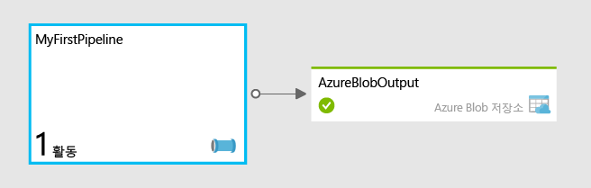

<properties
	pageTitle="Azure Data Factory를 사용하여 첫 번째 파이프라인 빌드"
	description="이 자습서에서는 Azure HDInsight를 사용하여 데이터를 변환하는 샘플 데이터 파이프라인을 만드는 방법을 보여 줍니다."
	services="data-factory"
	documentationCenter=""
	authors="spelluru"
	manager="jhubbard"
	editor="monicar"/>

<tags
	ms.service="data-factory"
	ms.workload="data-services"
	ms.tgt_pltfrm="na"
	ms.devlang="na"
	ms.topic="get-started-article" 
	ms.date="10/06/2015"
	ms.author="spelluru"/>

# Azure Data Factory를 사용하여 첫 번째 파이프라인 빌드
> [AZURE.SELECTOR]
- [Tutorial Overview](data-factory-build-your-first-pipeline.md)
- [Using Data Factory Editor](data-factory-build-your-first-pipeline-using-editor.md)
- [Using PowerShell](data-factory-build-your-first-pipeline-using-powershell.md)
- [Using Visual Studio](data-factory-build-your-first-pipeline-using-vs.md)

이 문서는 첫 번째 파이프라인 빌드를 시작하고 Azure Data Factory에 배포하는 데 도움이 됩니다.

> [AZURE.NOTE]이 문서는 Azure Data Factory 서비스에 대한 개념적 개요를 제공하지 않습니다. 서비스에 대한 자세한 개요는 [Azure Data Factory 소개](data-factory-introduction.md) 문서를 참조하세요.

## 자습서 개요
이 자습서는 첫 번째 파이프라인을 작동시키기 위해 필요한 단계를 안내합니다. 파이프라인을 만들고 필요한 모든 리소스를 처음부터 지정합니다.

데이터 팩터리를 처음부터 만들지 않고도 데이터 팩터리의 다양한 기능을 신속하게 알아보려면 Azure Preview 포털에 제공되는 샘플을 사용합니다. Azure Preview 포털을 사용하여 사용 사례 기반 샘플을 배포하는 방법은 [Azure Data Factory Update: Simplified sample deployment(Azure Data Factory 업데이트: 간소화된 샘플 배포)](http://azure.microsoft.com/blog/2015/04/24/azure-data-factory-update-simplified-sample-deployment/)(영문)을 참조하세요.

## 필수 구성 요소
이 자습서를 시작하기 전에 다음과 같은 필수 구성 요소가 반드시 필요합니다.

1.	**Azure 구독** - Azure 구독이 없는 경우 몇 분 만에 무료 평가판 계정을 만들 수 있습니다. 무료 평가판 계정을 확보하는 방법은 [무료 평가판](http://azure.microsoft.com/pricing/free-trial/) 문서를 참조하세요.

2.	**Azure 저장소** – 이 자습서에서는 데이터 저장을 위해 Azure 저장소 계정을 사용합니다. Azure 저장소 계정이 없는 경우 [저장소 계정 만들기](../storage-create-storage-account/#create-a-storage-account) 문서를 참조하세요. 저장소 계정을 만든 후에는 저장소 액세스에 사용되는 계정 키를 확보해야 합니다. [저장소 액세스 키 보기, 복사 및 다시 생성](../storage-create-storage-account/#view-copy-and-regenerate-storage-access-keys)을 참조하세요.

## 이 자습서에서 다루는 내용	
Azure Data Factory를 사용하면 데이터 이동 및 데이터 처리 작업을 데이터 기반 워크플로로 작성할 수 있습니다. HDInsight를 사용하여 월별 웹 로그를 변환 및 분석하는 첫 번째 파이프라인을 빌드하는 방법을 알아봅니다.

이 자습서에서는 다음 단계를 수행합니다.

1.	데이터 팩터리를 만듭니다.
2.	다음과 같은 연결된 서비스 만들기
	1.	**Azure 저장소 계정** – Azure 저장소 계정은 주문형 HDInsight 클러스터에 사용되는 파일을 저장하는데 사용됩니다.
	2.	**주문형 HDInsight 클러스터** – HDInsight 클러스터는 데이터를 변환하고 분석하기 위해 요청 시 시작됩니다.
3.	출력 데이터 집합 만들기 
4.	Hive 스크립트를 실행하는 파이프라인을 만들고 결과를 출력 데이터 집합에 저장합니다. Hive 스크립트는 우선 Azure Blob 저장소에 저장된 원시 웹 로그 데이터를 참조하는 외부 테이블을 만듭니다. Hive 스크립트의 다음 단계는 원시 데이터를 연도별, 월별로 분할하는 것입니다.

**MyFirstPipeline**이라는 첫 번째 파이프라인은 Hive 작업을 사용하여 HDInsight 클러스터의 일부로 배포되고 **/HdiSamples/WebsiteLogSampleData/SampleLog/**에 저장되는 웹 로그를 변환 및 분석합니다.

Hive 스크립트 실행 후에는 결과가 Azure Blob 저장소 컨테이너 **data/partitioneddata**에 저장됩니다.

**AzureBlobOutput** 데이터 집합에 정의된 가용성은 Hive 작업의 실행 빈도를 결정합니다. 이 자습서에서는 매월로 설정됩니다.

## 자습서에 대한 Azure 저장소 준비
자습서를 시작하기 전에 자습서에 필요한 파일을 Azure 저장소에 준비해야 합니다.

1. 메모장을 시작하고 다음 텍스트를 붙여 넣은 다음 사용자 하드 드라이브의 C:\\adfgettingstarted 폴더 에 **partitionweblogs.hql**로 저장합니다. 이 Hive 스크립트는 **WebLogsRaw** 및 **WebLogsPartitioned**라는 두 개의 외부 테이블을 만듭니다.

		set hive.exec.dynamic.partition.mode=nonstrict;
		
		DROP TABLE IF EXISTS WebLogsRaw; 
		CREATE TABLE WebLogsRaw (
		  date  date,
		  time  string,
		  ssitename string,
		  csmethod  string,
		  csuristem  string,
		  csuriquery string,
		  sport int,
		  susername string,
		  cipcsUserAgent string,
		  csCookie string,
		  csReferer string,
		  cshost  string,
		  scstatus  int,
		  scsubstatus  int,
		  scwin32status  int,
		  scbytes int,
		  csbytes int,
		  timetaken int
		)
		ROW FORMAT DELIMITED FIELDS TERMINATED BY ' '
		LINES TERMINATED BY '\n' 
		tblproperties ("skip.header.line.count"="2");
		
		LOAD DATA INPATH '/HdiSamples/WebsiteLogSampleData/SampleLog/909f2b.log' OVERWRITE INTO TABLE WebLogsRaw;
		
		DROP TABLE IF EXISTS WebLogsPartitioned ; 
		create external table WebLogsPartitioned (  
		  date  date,
		  time  string,
		  ssitename string,
		  csmethod  string,
		  csuristem  string,
		  csuriquery string,
		  sport int,
		  susername string,
		  cipcsUserAgent string,
		  csCookie string,
		  csReferer string,
		  cshost  string,
		  scstatus  int,
		  scsubstatus  int,
		  scwin32status  int,
		  scbytes int,
		  csbytes int,
		  timetaken int
		)
		partitioned by ( year int, month int)
		ROW FORMAT DELIMITED FIELDS TERMINATED BY ',' 
		STORED AS TEXTFILE 
		LOCATION '${hiveconf:partitionedtable}';
		
		INSERT INTO TABLE WebLogsPartitioned  PARTITION( year , month) 
		SELECT
		  date,
		  time,
		  ssitename,
		  csmethod,
		  csuristem,
		  csuriquery,
		  sport,
		  susername,
		  cipcsUserAgent,
		  csCookie,
		  csReferer,
		  cshost,
		  scstatus,
		  scsubstatus,
		  scwin32status,
		  scbytes,
		  csbytes,
		  timetaken,
		  year(date),
		  month(date)
		FROM WebLogsRaw
	
 
2. 자습서에 대한 Azure 저장소를 준비하려면:
	1. [최신 버전의 **AzCopy**](http://aka.ms/downloadazcopy) 또는 [최신 미리 보기 버전](http://aka.ms/downloadazcopypr)을 다운로드합니다. 유틸리티 사용 지침은 [AzCopy 사용 방법](../storage/storage-use-azcopy.md)을 참조하세요.
	2. AzCopy 설치 후에는 명령 프롬프트에서 다음 명령을 실행하여 시스템 경로에 AzCopy를 추가할 수 있습니다. 
	
			set path=%path%;C:\Program Files (x86)\Microsoft SDKs\Azure\AzCopy			 

	3. c:\\adfgettingstarted 폴더로 이동하고 다음 명령을 실행하여 Hive .HQL 파일을 저장소 계정에 업로드합니다. **StorageAccountName**을 해당 저장소 계정의 이름으로 바꾸고 **Storage Key**를 저장소 계정 키로 바꿉니다.

			AzCopy /Source:. /Dest:https://<StorageAccountName>.blob.core.windows.net/script /DestKey:<Storage Key>

		> [AZURE.NOTE]위의 명령은 Azure Blob 저장소에 이름이 **script**인 컨테이너를 만들고로컬 드라이브의 **partitionweblogs.hql** 파일을 BLOB 컨테이너에 복사합니다.
	>
	5. 파일 업로드가 완료되면 AzCopy에서 다음과 같은 출력이 표시됩니다.
	
			Finished 1 of total 1 file(s).
			[2015/06/15 15:47:13] Transfer summary:
			-----------------
			Total files transferred: 1
			Transfer successfully:   1
			Transfer skipped:        0
			Transfer failed:         0
			Elapsed time:            00.00:00:01

다음을 수행합니다.

- 맨 위의 [데이터 팩터리 편집기 사용](data-factory-build-your-first-pipeline-using-editor.md) 링크를 클릭하여 Azure 포털의 일부인 데이터 팩터리 편집기를 통해 자습서를 수행합니다.
- 맨 위의 [PowerShell 사용](data-factory-build-your-first-pipeline-using-powershell.md) 링크를 클릭하여 Azure PowerShell을 통해 자습서를 수행합니다.
- 맨 위의 [Visual Studio 사용](data-factory-build-your-first-pipeline-using-vs.md) 링크를 클릭하여 Visual Studio를 사용해서 자습서를 수행합니다. 

## 피드백 보내기
이 문서에 대한 의견을 보내주시면 감사하겠습니다. 몇 분 정도 시간을 할애해서 [메일](mailto:adfdocfeedback@microsoft.com?subject=data-factory-build-your-first-pipeline.md)을 통해 의견을 보내주세요.

<!---HONumber=Oct15_HO2-->