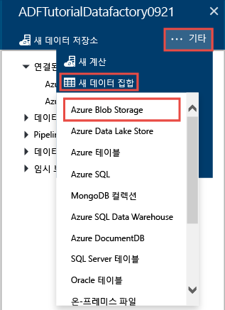
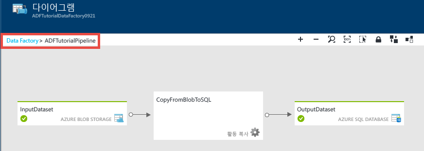
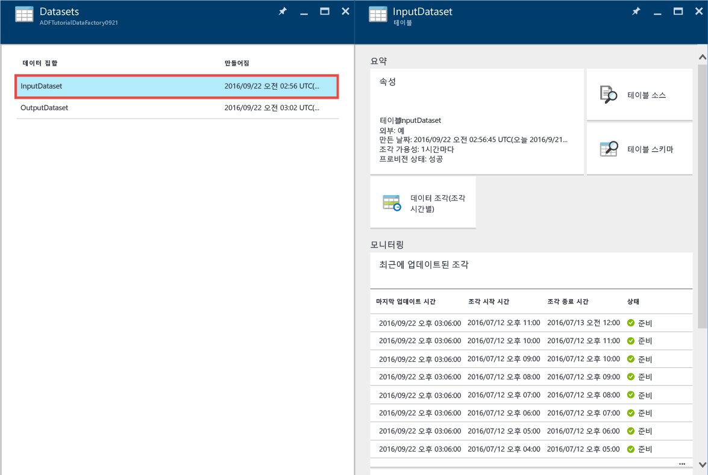
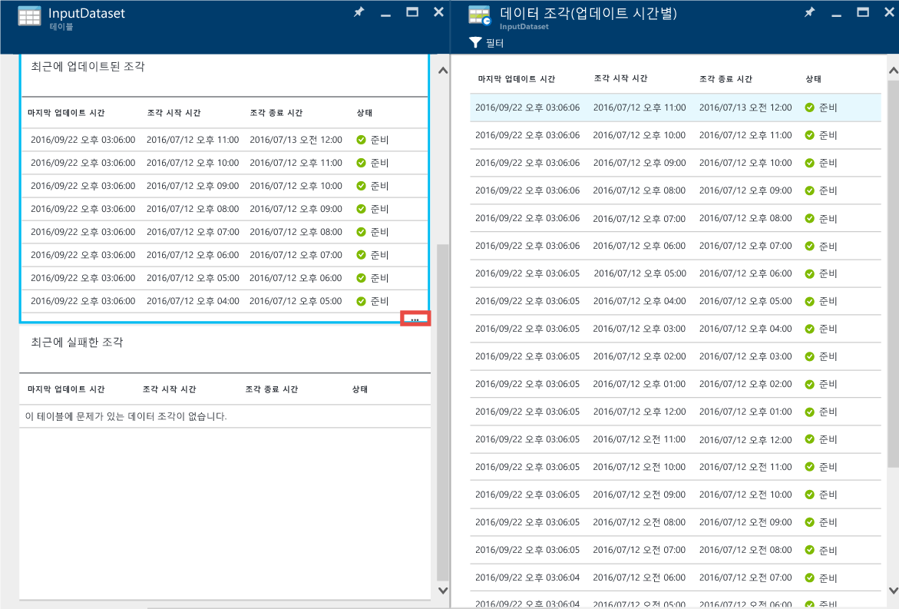
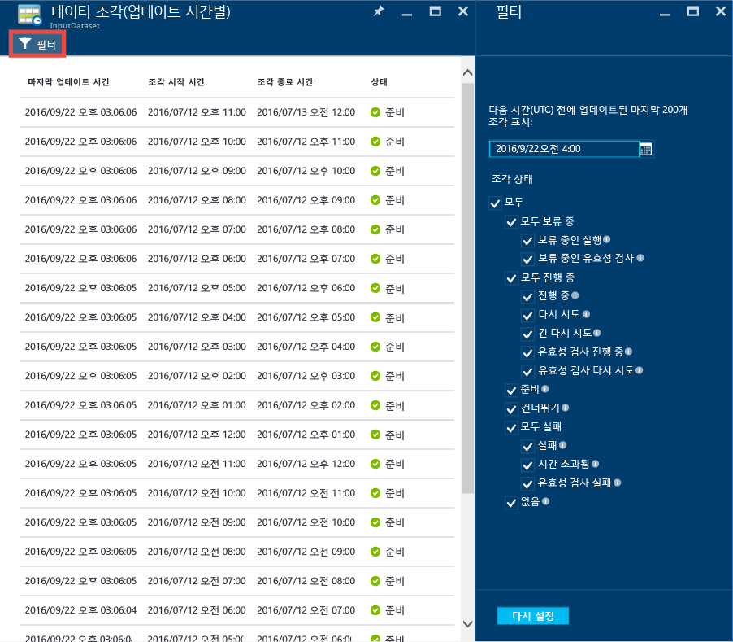
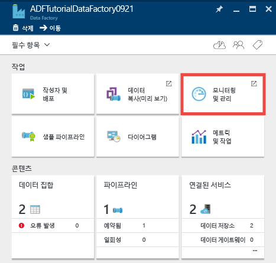
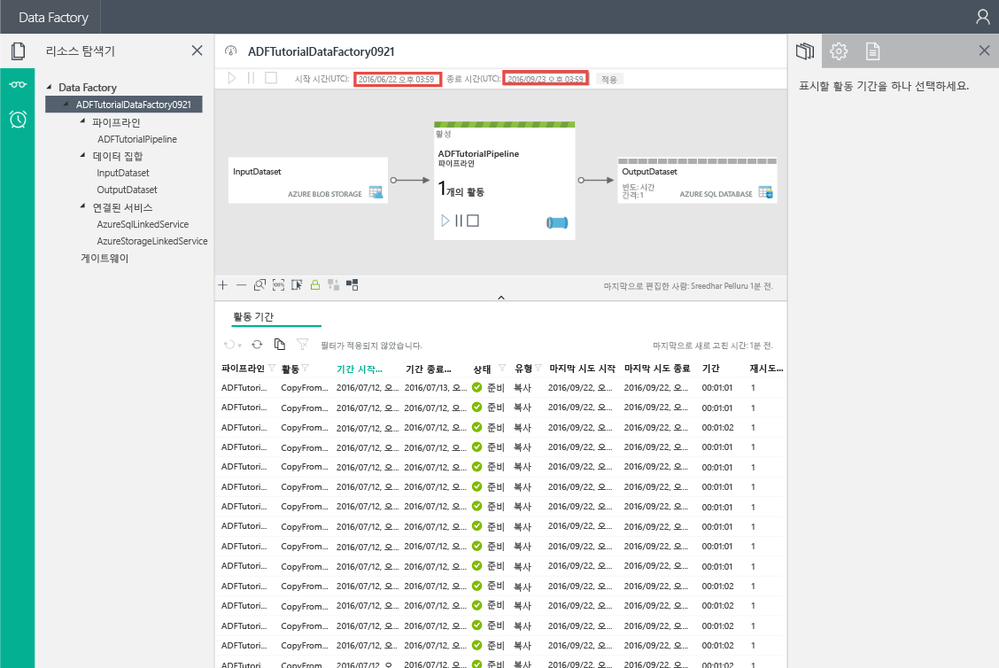
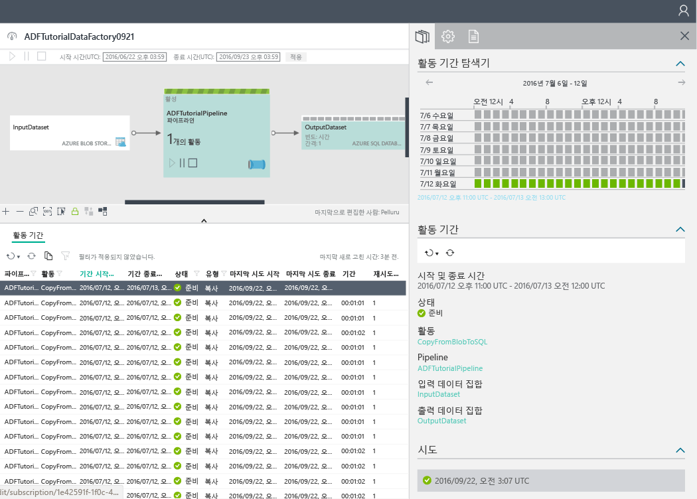

<properties 
	pageTitle="자습서: Azure Portal을 사용하여 복사 작업이 있는 파이프라인 만들기 | Microsoft Azure" 
	description="이 자습서에서는 Azure 포털의 데이터 팩터리 편집기를 사용하여 복사 작업이 있는 Azure Data Factory 파이프라인을 만듭니다." 
	services="data-factory" 
	documentationCenter="" 
	authors="spelluru" 
	manager="jhubbard" 
	editor="monicar"/>

<tags 
	ms.service="data-factory" 
	ms.workload="data-services" 
	ms.tgt_pltfrm="na" 
	ms.devlang="na" 
	ms.topic="get-started-article" 
	ms.date="09/16/2016" 
	ms.author="spelluru"/>

# 자습서: Azure Portal을 사용하여 복사 작업이 있는 파이프라인 만들기
> [AZURE.SELECTOR]
- [개요 및 필수 구성 요소](data-factory-copy-data-from-azure-blob-storage-to-sql-database.md)
- [Azure 포털](data-factory-copy-activity-tutorial-using-azure-portal.md)
- [Visual Studio](data-factory-copy-activity-tutorial-using-visual-studio.md)
- [PowerShell](data-factory-copy-activity-tutorial-using-powershell.md)
- [REST API](data-factory-copy-activity-tutorial-using-rest-api.md)
- [.NET API](data-factory-copy-activity-tutorial-using-dotnet-api.md)
- [복사 마법사](data-factory-copy-data-wizard-tutorial.md)

이 자습서에서는 Azure Portal를 사용하여 Azure Data Factory를 만들고 모니터링하는 방법을 보여 줍니다. 데이터 팩터리의 파이프라인은 복사 작업을 사용하여 Azure Blob 저장소에서 Azure SQL 데이터베이스로 데이터를 복사합니다.

이 자습서의 일부로 수행하는 단계는 다음과 같습니다.

단계 | 설명
-----| -----------
[Azure 데이터 팩터리 만들기](#create-data-factory) | 이 단계에서는 **ADFTutorialDataFactory**라는 Azure Data Factory를 만듭니다.  
[연결된 서비스 만들기](#create-linked-services) | 이 단계에서는 **AzureStorageLinkedService** 및 **AzureSqlLinkedService** 등 두 개의 연결된 서비스를 만듭니다.   AzureStorageLinkedService는 Azure Storage를 연결하고, AzureSqlLinkedService는 Azure SQL Database를 ADFTutorialDataFactory에 연결합니다. 파이프라인에 대한 입력 데이터는 Azure Blob 저장소의 Blob 컨테이너에 있고, 출력 데이터는 Azure SQL 데이터베이스의 테이블에 저장됩니다. 따라서 이러한 두 데이터 저장소를 연결된 서비스로 데이터 팩터리에 추가합니다.      
[입력 및 출력 데이터 집합을 만듭니다.](#create-datasets) | 이전 단계에서는 입출력 데이터가 포함된 데이터 저장소를 참조하는 연결된 서비스를 만들었습니다. 이 단계에서는 데이터 저장소에 저장된 입출력 데이터를 나타내는 2개의 데이터 집합인 **InputDataset** 및 **OutputDataset**을 정의합니다.   InputDataset에 대해 원본 데이터가 있는 Blob을 포함하는 Blob 컨테이너를 지정하고, OutputDataset에 대해 출력 데이터를 저장할 SQL 테이블을 지정합니다. 구조, 가용성 및 정책과 같은 기타 속성도 지정합니다. 
[파이프라인을 만듭니다.](#create-pipeline) | 이 단계에서는 ADFTutorialDataFactory에 **ADFTutorialPipeline**이라는 파이프라인을 만듭니다.   이 파이프라인에 Azure Blob에서 출력 Azure SQL 테이블로 입력 데이터를 복사하는 **복사 작업**을 추가합니다. 복사 작업은 Azure Data Factory에서 데이터 이동을 수행합니다. 다양한 데이터 저장소 간에 데이터를 안전하고 안정적이며 확장성 있는 방법으로 복사할 수 있는 전역적으로 사용 가능한 서비스를 통해 이루어집니다. 복사 작업에 대한 자세한 내용은 [데이터 이동 작업](data-factory-data-movement-activities.md) 문서를 참조하세요. 
[파이프라인 모니터링](#monitor-pipeline) | 이 단계에서는 Azure 포털을 사용하여 입력 및 출력 테이블의 조각을 모니터링합니다.

## 필수 조건 
이 자습서를 수행하기 전에 [자습서 개요](data-factory-copy-data-from-azure-blob-storage-to-sql-database.md) 문서에 나열된 필수 구성 요소를 완료합니다.

## 데이터 팩터리 만들기
이 단계에서는 Azure 포털을 사용하여 **ADFTutorialDataFactory**라는 Azure Data Factory를 만듭니다.

1.	[Azure Portal](https://portal.azure.com/)에 로그인한 후에 **새로 만들기**를 클릭하고 **인텔리전스 + 분석**을 선택하고 **Data Factory**를 클릭합니다.

	

6. **새 데이터 팩터리** 블레이드에서 다음을 수행합니다.
	1. **ADFTutorialDataFactory**를 **이름**으로 입력합니다.
	
  		

		Azure Data Factory의 이름은 **전역적으로 고유**해야 합니다. 다음 오류가 표시되는 경우 데이터 팩터리 이름을 변경하고(예: yournameADFTutorialDataFactory) 다시 만듭니다. 데이터 팩터리 아티팩트에 대한 명명 규칙은 [데이터 팩터리 - 명명 규칙](data-factory-naming-rules.md) 항목을 참조하세요.
	
			Data factory name “ADFTutorialDataFactory” is not available  
	 
		
	2. Azure **구독**을 선택합니다.
	3. 리소스 그룹에 대해 다음 단계 중 하나를 수행합니다.
		1. **기존 항목 사용**을 선택하고 드롭다운 목록에서 기존 리소스 그룹을 선택합니다.
		2. **새로 만들기**를 선택하고 리소스 그룹의 이름을 입력합니다.
	
			이 자습서의 일부 단계에서는 리소스 그룹에 **ADFTutorialResourceGroup**이라는 이름을 사용한다고 가정합니다. 리소스 그룹에 대한 자세한 내용은 [리소스 그룹을 사용하여 Azure 리소스 관리](../resource-group-overview.md)를 참조하세요.
	4. 데이터 팩터리의 **위치**를 선택합니다. Data Factory 서비스에서 지원하는 지역만 드롭다운 목록에 표시됩니다.
	5. **시작 보드에 고정**을 선택합니다.
	6. **만들기**를 클릭합니다.

		> [AZURE.IMPORTANT] 데이터 팩터리 인스턴스를 만들려면 구독/리소스 그룹 수준에서 [데이터 팩터리 참여자](../active-directory/role-based-access-built-in-roles.md/#data-factory-contributor) 역할의 구성원이어야 합니다.
		>  
		>  데이터 팩터리의 이름은 나중에 DNS 이름으로 표시되므로 공개적으로 등록될 수도 있습니다.
9.  상태/알림 메시지를 보려면 도구 모음에서 종 아이콘을 클릭합니다.

	
10. 만들기가 완료되면 이미지와 같이 **Data Factory** 블레이드가 표시됩니다.

    

## 연결된 서비스 만들기
연결된 서비스는 데이터 저장소 또는 계산 서비스를 Azure Data Factory에 연결합니다. 복사 작업에서 지원하는 모든 원본 및 싱크는 [지원되는 데이터 저장소](data-factory-data-movement-activities.md##supported-data-stores-and-formats)를 참조하세요. 데이터 팩터리에서 지원하는 계산 서비스 목록은 [연결된 계산 서비스](data-factory-compute-linked-services.md)를 참조하세요. 이 자습서에서는 계산 서비스를 사용하지 않습니다.

이 단계에서는 **AzureStorageLinkedService** 및 **AzureSqlLinkedService** 등 두 개의 연결된 서비스를 만듭니다. AzureStorageLinkedService 연결된 서비스는 Azure Storage 계정을 연결하고, AzureSqlLinkedService는 Azure SQL 데이터베이스를 **ADFTutorialDataFactory**에 연결합니다. 이 자습서 뒷부분에서는 AzureStorageLinkedService의 Blob 컨테이너에서 AzureSqlLinkedService의 SQL 테이블로 데이터를 복사하는 파이프라인을 만듭니다.

### Azure 저장소 계정에 대한 연결된 서비스 만들기
1.	**Data Factory** 블레이드에서 **작성자 및 배포** 타일을 클릭하여 데이터 팩터리에 대한 **편집기**를 시작합니다.

	
5. **편집기**의 도구 모음에서 **새 데이터 저장소** 단추를 클릭하고 드롭다운 메뉴에서 **Azure Storage**를 선택합니다. 오른쪽 창에 Azure 저장소 연결된 서비스를 만들기 위한 JSON 템플릿이 표시됩니다.

	
6. `<accountname>` 및 `<accountkey>`를 Azure Storage 계정의 계정 이름 및 계정 키 값으로 바꿉니다.

	
6. 도구 모음에서 **배포**를 클릭합니다. 이제 트리 보기에서 배포된 **AzureStorageLinkedService**가 표시됩니다.

	

> [AZURE.NOTE]
JSON 속성에 대한 자세한 내용은 [Azure Blob 간의 데이터 이동](data-factory-azure-blob-connector.md#azure-storage-linked-service)을 참조하세요.

### Azure SQL 데이터베이스에 대한 연결된 서비스 만들기
1. **Data Factory 편집기**의 도구 모음에서 **새 데이터 저장소** 단추를 클릭하고 드롭다운 메뉴에서 **Azure SQL Database**를 선택합니다. 오른쪽 창에 Azure SQL 연결된 서비스를 만들기 위한 JSON 템플릿이 표시됩니다.
2. `<servername>`, `<databasename>`, `<username>@<servername>` 및 `<password>`를 Azure SQL Server의 이름, 사용자 계정 및 암호로 바꿉니다.
3. 도구 모음에서 **배포**를 클릭하여 **AzureSqlLinkedService**를 만들고 배포합니다.
4. 트리 보기에서 **AzureSqlLinkedService**가 표시되는지 확인합니다.

> [AZURE.NOTE]
JSON 속성에 대한 자세한 내용은 [Azure SQL Database 간의 데이터 이동](data-factory-azure-sql-connector.md#azure-sql-linked-service-properties)을 참조하세요.

## 데이터 집합 만들기
이전 단계에서는 연결된 서비스 **AzureStorageLinkedService** 및 **AzureSqlLinkedService**를 만들어 Azure Storage 계정과 Azure SQL 데이터베이스를 데이터 팩터리 **ADFTutorialDataFactory**에 연결했습니다. 이 단계에서는 각각 AzureStorageLinkedService 및 AzureSqlLinkedService로 참조되는 데이터 저장소에 저장된 입출력 데이터를 나타내는 **InputDataset** 및 **OutputDataset** 등 2개의 데이터 집합을 정의합니다. InputDataset에 대해 원본 데이터가 있는 Blob을 포함하는 Blob 컨테이너를 지정하고, OutputDataset에 대해 출력 데이터를 저장할 SQL 테이블을 지정합니다.

### 입력 데이터 집합 만들기 
이 단계에서는 **AzureStorageLinkedService**와 연결된 서비스가 나타내는 Azure Storage의 Blob 컨테이너를 가리키는 **InputDataset**이라는 데이터 집합을 만듭니다.

1. Data Factor의 **편집기**에서 **... 추가**를 클릭하고 **새 데이터 집합**을 클릭하고 드롭 다운 메뉴에서 **Azure Blob Storage**를 클릭합니다.

	
2. 오른쪽 창의 JSON을 다음 JSON 조각으로 바꿉니다.

		{
		  "name": "InputDataset",
		  "properties": {
		    "structure": [
		      {
		        "name": "FirstName",
		        "type": "String"
		      },
		      {
		        "name": "LastName",
		        "type": "String"
		      }
		    ],
		    "type": "AzureBlob",
		    "linkedServiceName": "AzureStorageLinkedService",
		    "typeProperties": {
		      "folderPath": "adftutorial/",
			  "fileName": "emp.txt",
		      "format": {
		        "type": "TextFormat",
		        "columnDelimiter": ","
		      }
		    },
		    "external": true,
		    "availability": {
		      "frequency": "Hour",
		      "interval": 1
		    }
		  }
		}
		
     다음 사항에 유의하세요.
	
	- 데이터 집합 **형식**을 **AzureBlob**로 설정합니다.
	- **linkedServiceName**을 **AzureStorageLinkedService**로 설정합니다. 이 연결된 서비스는 2단계에서 만들었습니다.
	- **folderPath**를 **adftutorial** 컨테이너로 설정합니다. 또한 **fileName** 속성을 사용하여 폴더 내의 Blob 이름을 지정할 수도 있습니다. Blob 이름을 지정하지 않으므로 컨테이너에 있는 모든 Blob의 데이터가 입력 데이터로 간주됩니다.
	- format **type**을 **TextFormat**으로 설정합니다.
	- 텍스트 파일에는 **FirstName**과 **LastName**의 두 필드가 쉼표(**columnDelimiter**)로 구분되어 있습니다.
	- **가용성**은 **매시간**으로 설정됩니다(**빈도**는 **시간**으로, **간격**은 **1**로 설정됨). 따라서 데이터 팩터리는 지정한 Blob 컨테이너(**adftutorial**)의 루트 폴더에서 한 시간마다 입력 데이터를 찾습니다.
	
	**입력** 데이터 집합의 **fileName**을 지정하지 않는 경우 입력 폴더(**folderPath**)의 모든 파일/Blob은 입력으로 간주됩니다. JSON에서 fileName을 지정하는 경우에는 지정한 파일/Blob만 입력으로 간주됩니다.
 
	**출력 테이블**의 **fileName**을 지정하지 않는 경우, **folderPath**에 생성되는 파일의 이름은 다음과 같은 형식으로 지정됩니다. Data.&lt;Guid&gt;.txt(예: Data.0a405f8a-93ff-4c6f-b3be-f69616f1df7a.txt).

	**SliceStart** 시간을 기반으로 **folderPath** 및 **fileName**을 설정하려면, **partitionedBy** 속성을 사용합니다. 다음 예제에서 folderPath는 SliceStart(처리 중인 조각의 시작 시간)의 연도, 월 및 일을 사용하고 fileName은 SliceStart의 시간을 사용합니다. 예를 들어 조각이 2016-09-20T08:00:00에 생성되는 경우 folderName은 wikidatagateway/wikisampledataout/2016/09/20으로 설정되고 fileName은 08.csv로 설정됩니다.

			"folderPath": "wikidatagateway/wikisampledataout/{Year}/{Month}/{Day}",
	        "fileName": "{Hour}.csv",
	        "partitionedBy": 
	        [
	        	{ "name": "Year", "value": { "type": "DateTime", "date": "SliceStart", "format": "yyyy" } },
	            { "name": "Month", "value": { "type": "DateTime", "date": "SliceStart", "format": "MM" } }, 
	            { "name": "Day", "value": { "type": "DateTime", "date": "SliceStart", "format": "dd" } }, 
	            { "name": "Hour", "value": { "type": "DateTime", "date": "SliceStart", "format": "hh" } } 
	        ],
2. 도구 모음에서 **배포**를 클릭하여 **InputDataset** 데이터 집합을 만들고 배포합니다. 트리 뷰에 **InputDataset**이 표시되는지 확인합니다.

> [AZURE.NOTE]
JSON 속성에 대한 자세한 내용은 [Azure Blob 간의 데이터 이동](data-factory-azure-blob-connector.md#azure-blob-dataset-type-properties)을 참조하세요.

### 출력 데이터 집합 만들기
이 단계의 일부에서는 **OutputDataset**라는 출력 데이터 집합을 만듭니다. 이 데이터 집합은 **AzureSqlLinkedService**가 나타내는 Azure SQL Database에서 SQL 테이블을 가리킵니다.

1. Data Factor의 **편집기**에서 **... 추가**를 클릭하고 **새 데이터 집합**을 클릭하고 드롭 다운 메뉴에서 **Azure SQL**을 클릭합니다.
2. 오른쪽 창의 JSON을 다음 JSON 조각으로 바꿉니다.

		{
		  "name": "OutputDataset",
		  "properties": {
		    "structure": [
		      {
		        "name": "FirstName",
		        "type": "String"
		      },
		      {
		        "name": "LastName",
		        "type": "String"
		      }
		    ],
		    "type": "AzureSqlTable",
		    "linkedServiceName": "AzureSqlLinkedService",
		    "typeProperties": {
		      "tableName": "emp"
		    },
		    "availability": {
		      "frequency": "Hour",
		      "interval": 1
		    }
		  }
		}
		
     다음 사항에 유의하세요.
	
	- dataset **type**을 **AzureSQLTable**로 설정합니다.
	- **linkedServiceName**을 **AzureSqlLinkedService**(2단계에서 만든 연결된 서비스)로 설정합니다.
	- **tablename**을 **emp**로 설정합니다.
	- 데이터베이스의 emp 테이블에 **ID**, **FirstName** 및 **LastName**이라는 세 개의 열이 있습니다. ID는 ID 열이므로 여기서 **FirstName** 및 **LastName**만 지정해야 합니다.
	- **availability**는 **hourly**(**frequency**는 **hour**로, **interval**은 **1**로 설정)로 설정됩니다. 데이터 팩터리 서비스는 Azure SQL 데이터베이스의 **emp** 테이블에 출력 데이터 조각을 1시간마다 생성합니다.

3. 도구 모음에서 **배포**를 클릭하여 **OutputDataset** 데이터 집합을 만들고 배포합니다. 트리 뷰에 **OutputDataset**이 표시되는지 확인합니다.

> [AZURE.NOTE]
JSON 속성에 대한 자세한 내용은 [Azure SQL Database 간의 데이터 이동](data-factory-azure-sql-connector.md#azure-sql-linked-service-properties)을 참조하세요.

## 파이프라인 만들기
이 단계에서는 **InputDataset**을 입력으로 사용하고 **OutputDataset**을 출력으로 사용하는 **복사 작업**을 포함하는 파이프라인을 만듭니다.

1. Data Factor의 **편집기**에서 **... 추가**를 클릭하고 **새 파이프라인**을 클릭합니다. 또는 트리 뷰에서 **파이프라인**을 마우스 오른쪽 단추로 클릭하고 **새 파이프라인**을 클릭할 수 있습니다.
2. 오른쪽 창의 JSON을 다음 JSON 조각으로 바꿉니다.
		
		{
		  "name": "ADFTutorialPipeline",
		  "properties": {
		    "description": "Copy data from a blob to Azure SQL table",
		    "activities": [
		      {
		        "name": "CopyFromBlobToSQL",
		        "type": "Copy",
		        "inputs": [
		          {
		            "name": "InputDataset"
		          }
		        ],
		        "outputs": [
		          {
		            "name": "OutputDataset"
		          }
		        ],
		        "typeProperties": {
		          "source": {
		            "type": "BlobSource"
		          },
		          "sink": {
		            "type": "SqlSink",
		            "writeBatchSize": 10000,
		            "writeBatchTimeout": "60:00:00"
		          }
		        },
		        "Policy": {
		          "concurrency": 1,
		          "executionPriorityOrder": "NewestFirst",
		          "retry": 0,
		          "timeout": "01:00:00"
		        }
		      }
		    ],
		    "start": "2016-07-12T00:00:00Z",
		    "end": "2016-07-13T00:00:00Z"
		  }
		} 

	다음 사항에 유의하세요.

	- activities 섹션에는 **type**이 **Copy**로 설정된 작업만 있습니다.
	- 작업에 대한 입력을 **InputDataset**으로 설정하고 작업에 대한 출력을 **OutputDataset**으로 설정합니다.
	- **typeProperties** 섹션에서 **BlobSource**를 원본 유형으로 지정하고 **SqlSink**를 싱크 유형으로 지정합니다.

	**start** 속성 값을 현재 날짜로 바꾸고 **end** 값을 다음 날짜로 바꿉니다. 날짜 부분만 지정하고 날짜/시간의 시간 부분은 건너뛸 수 있습니다. 예를 들어, "2016-02-03"은 "2016-02-03T00:00:00Z"과 동일합니다.
	
	start 및 end 날짜/시간은 둘 다 [ISO 형식](http://en.wikipedia.org/wiki/ISO_8601)(영문)이어야 합니다. 예를 들어 2016-10-14T16:32:41Z입니다. **종료** 시간은 선택 사항이지만 이 자습서에서는 사용합니다.
	
	**end** 속성 값을 지정하지 않는 경우 "**start + 48시간**"으로 계산됩니다. 파이프라인을 무기한 실행하려면 **end** 속성 값으로 **9999-09-09**를 지정합니다.
	
	앞의 예에서는 각 데이터 조각이 1시간마다 생성되므로 24개 데이터 조각이 있게 됩니다.
	
4. 도구 모음에서 **배포**를 클릭하여 **ADFTutorialPipeline**을 만들고 배포합니다. 트리 뷰에 파이프라인이 표시되는지 확인합니다.
5. 이제 **X**를 클릭하여 **편집기** 블레이드를 닫습니다. **X**를 다시 클릭하여 **ADFTutorialDataFactory**에 대한 **Data Factory** 홈페이지를 봅니다.

**축하합니다.** Azure Data Factory, 연결된 서비스, 테이블 및 파이프라인을 성공적으로 만들고 파이프라인을 예약했습니다.
 
### 다이어그램 뷰에서 데이터 팩터리 보기 
1. **Data Factory** 블레이드에서 **다이어그램**을 클릭합니다.

	
2. 다음 이미지와 유사한 다이어그램이 표시됩니다.

	

	확대, 축소, 100% 확대, 크기에 맞게, 자동으로 파이프라인 및 테이블 위치 지정, 계보 정보 표시(선택한 항목의 업스트림 및 다운스트림 항목 강조 표시)를 수행할 수 있습니다. 개체(입출력 테이블 또는 파이프라인)를 두 번 클릭하면 해당 속성을 볼 수 있습니다.
3. 다이어그램 뷰에서 **ADFTutorialPipeline**을 마우스 오른쪽 단추로 클릭하고 **파이프라인 열기**를 클릭합니다.

	
4. 작업에 대한 입력 및 출력 데이터 집합과 함께 파이프라인의 작업이 표시됩니다. 이 자습서에는 파이프라인(복사 작업)에 InputDataset을 입력 데이터 집합으로, OutputDataset을 출력 데이터 집합으로 사용하는 작업 하나밖에 없습니다.

	
5. 왼쪽 위의 이동 경로에서 **데이터 팩터리**를 클릭하여 다이어그램 뷰로 돌아갑니다. 다이어그램 뷰에 모든 파이프라인이 표시됩니다. 이 예제에서는 하나의 파이프라인만 만들었습니다.
 

## 파이프라인 모니터링
이 단계에서는 Azure 포털을 사용하여 Azure Data Factory에서 어떤 일이 일어나는지 모니터링합니다.

### 다이어그램 보기를 사용하여 파이프라인 모니터링

1. 데이터 팩터리의 Data Factory 홈 페이지를 보려면 **X**를 클릭하여 **다이어그램** 보기를 닫습니다. 웹 브라우저를 닫은 경우 다음 단계를 수행합니다.
	2. [Azure Portal](https://portal.azure.com/)로 이동합니다.
	2. **시작 보드**에서 **ADFTutorialDataFactory**를 두 번 클릭하거나 왼쪽 메뉴에서 **Data factories**를 클릭하고 ADFTutorialDataFactory를 검색합니다.
3. 이 블레이드에서 만든 테이블과 파이프라인의 개수와 이름이 표시됩니다.

	
4. 이제 **데이터 집합** 타일을 클릭합니다.
5. **데이터 집합** 블레이드에서 **InputDataset**을 클릭합니다. 이 데이터 집합은 **ADFTutorialPipeline**에 대한 입력 데이터 집합입니다.

	
5. **...(줄임표)**를 클릭하여 데이터 조각을 모두 표시합니다.

	

	**emp.txt** 파일이 항상 Blob 컨테이너 **adftutorial\\input**에 있으므로 현재 시간까지의 데이터 조각이 **준비** 상태입니다. 맨 아래의 **Recently failed slices(최근에 실패한 조각)** 섹션에 표시되는 조각이 없는지 확인합니다.

	**Recently updated slices(최근에 업데이트된 조각)** 및 **Recently failed slices(최근에 실패한 조각)** 목록은 둘 다 **마지막 업데이트 시간**을 기준으로 정렬됩니다.
    
	도구 모음의 **필터**를 클릭하여 조각을 필터링합니다.
	
	
6. **데이터 집합** 블레이드가 표시될 때까지 블레이드를 닫습니다. **OutputDataset**을 클릭합니다. 이 데이터 집합은 **ADFTutorialPipeline**에 대한 출력 데이터 집합입니다.

	
6. 다음 이미지에서 보여주는 대로 **OutputDataset** 블레이드가 표시됩니다.

	
7. 현재 시간까지의 데이터 조각이 이미 생성되어 **Ready** 상태입니다. 맨 아래의 **Problem slices(문제 조각)** 섹션에 표시되는 조각이 없습니다.
8. **…(줄임표)**를 클릭하여 조각을 모두 표시합니다.

	
9. 목록에서 아무 데이터 조각이나 클릭하면 **데이터 조각** 블레이드가 표시됩니다.

	
  
	조각이 **Ready** 상태가 아닌 경우 **Upstream slices that are not ready(준비되지 않은 업스트림 조각)** 목록에서 Ready 상태가 아니고 현재 조각의 실행을 차단하는 업스트림 조각을 확인할 수 있습니다.
11. **데이터 조각** 블레이드의 맨 아래 목록에 모든 작업 실행이 표시됩니다. **작업 실행**을 클릭하여 **작업 실행 세부 정보** 블레이드를 표시합니다.

	
12. **X**를 클릭하여 모든 블레이드를 닫아 **ADFTutorialDataFactory**의 홈 블레이드로 돌아옵니다.
14. (선택 사항) **ADFTutorialDataFactory**의 홈 페이지에서 **파이프라인**을 클릭하고 **파이프라인** 블레이드에서 **ADFTutorialPipeline**을 클릭한 다음 입력 테이블(**Consumed**) 또는 출력 테이블(**Produced**)을 드릴스루합니다.
15. **SQL Server Management Studio**를 시작하고 Azure SQL 데이터베이스에 연결한 다음 데이터베이스의 **emp** 테이블에 행이 삽입되었는지 확인합니다.

	

### 앱 모니터링 및 관리를 사용하여 파이프라인 모니터링
응용 프로그램 모니터링 및 관리를 사용하여 파이프라인을 모니터링할 수도 있습니다. 이 응용 프로그램을 사용하는 방법에 대한 자세한 내용은 [앱 모니터링 및 관리를 사용하여 Azure Data Factory 파이프라인 모니터링 및 관리](data-factory-monitor-manage-app.md)를 참조하세요.

1. 데이터 팩터리의 홈페이지에서 **모니터링 및 관리** 타일을 클릭합니다.

	
2. **응용 프로그램 모니터링 및 관리**가 표시되어야 합니다. **시작 시간** 및 **종료 시간**을 변경하여 파이프라인의 시작 시간(2016-07-12) 및 종료 시간(2016-07-13)을 포함하고 **적용**을 클릭합니다.

	
3. 자세한 내용을 보려면 **작업 창** 목록에서 작업 창을 선택합니다. 

## 요약 
이 자습서에서는 Azure Blob에서 Azure SQL 데이터베이스로 데이터를 복사하는 Azure Data Factory를 만들었습니다. Azure 포털을 사용하여 데이터 팩터리, 연결된 서비스, 데이터 집합 및 파이프라인을 만들었습니다. 이 자습서에서 수행한 단계를 요약하면 다음과 같습니다.

1.	Azure **Data Factory**를 만들었습니다.
2.	**연결된 서비스**를 만들었습니다.
	1. 입력 데이터를 보유하는 Azure Storage 계정을 연결하는 **Azure Storage** 연결된 서비스입니다.
	2. 출력 데이터를 보유하는 Azure SQL 데이터베이스를 연결하는 **Azure SQL** 연결된 서비스입니다.
3.	파이프라인의 입력 데이터와 출력 데이터를 설명하는 **데이터 집합**을 만들었습니다.
4.	원본으로 **BlobSource**와 **복사 작업**을 사용하고 싱크로 **SqlSink**를 사용하여 **파이프라인**을 만들었습니다.

## 참고 항목
| 항목 | 설명 |
| :---- | :---- |
| [데이터 이동 활동](data-factory-data-movement-activities.md) | 이 문서에서는 이 자습서에서 사용한 복사 작업에 대한 자세한 정보를 제공합니다. |
| [예약 및 실행](data-factory-scheduling-and-execution.md) | 이 문서에서는 Azure Data Factory 응용 프로그램 모델의 예약 및 실행에 대한 내용을 설명합니다. |
| [파이프라인](data-factory-create-pipelines.md) | 이 문서는 Azure Data Factory에서 파이프라인 및 작업을 이해하는 데 도움이 됩니다. |
| [데이터 집합](data-factory-create-datasets.md) | 이 문서는 Azure Data Factory의 데이터 집합을 이해하는 데 도움이 됩니다.
| [모니터링 앱을 사용하여 파이프라인 모니터링 및 관리](data-factory-monitor-manage-app.md) | 이 문서는 모니터링 및 관리 앱을 사용하여 파이프라인을 모니터링하고 관리하고 디버그하는 방법을 설명합니다. 

<!---HONumber=AcomDC_0928_2016-->