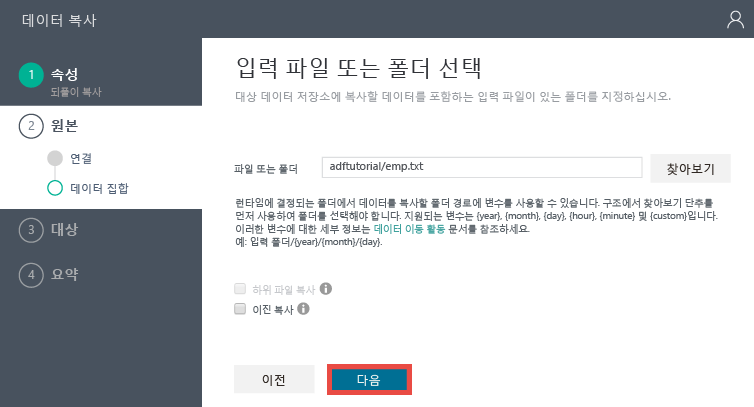
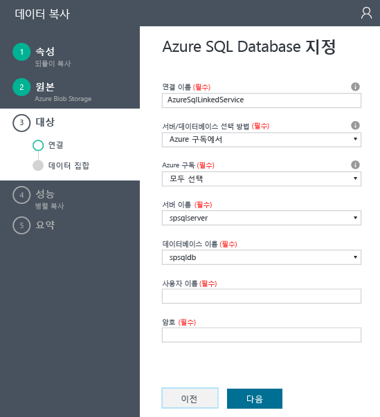
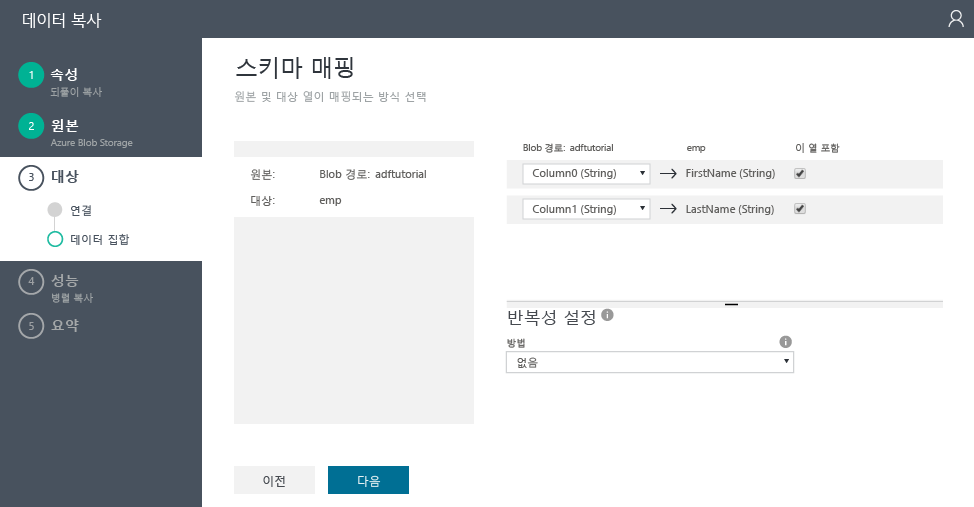
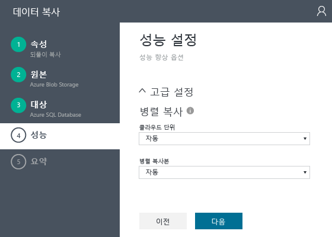
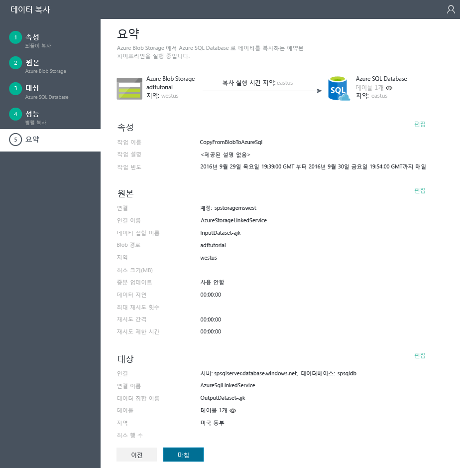

# 자습서: 데이터 팩터리 복사 마법사를 사용하여 복사 작업이 있는 파이프라인 만들기
> [!div class="op_single_selector"]
> * [개요 및 필수 구성 요소](data-factory-copy-data-from-azure-blob-storage-to-sql-database.md)
> * [복사 마법사](data-factory-copy-data-wizard-tutorial.md)
> * [Azure 포털](data-factory-copy-activity-tutorial-using-azure-portal.md)
> * [Visual Studio](data-factory-copy-activity-tutorial-using-visual-studio.md)
> * [PowerShell](data-factory-copy-activity-tutorial-using-powershell.md)
> * [Azure Resource Manager 템플릿](data-factory-copy-activity-tutorial-using-azure-resource-manager-template.md)
> * [REST API](data-factory-copy-activity-tutorial-using-rest-api.md)
> * [.NET API](data-factory-copy-activity-tutorial-using-dotnet-api.md)

Azure Data Factory **복사 마법사**를 사용하면 데이터 수집/이동 시나리오를 구현하는 파이프라인을 신속하고 간편하게 만들 수 있습니다. 따라서 데이터 이동 시나리오에 대한 샘플 파이프라인을 만드는 첫 번째 단계로 마법사를 사용하는 것이 좋습니다. 이 자습서는 Azure Data Factory를 만들고, 복사 마법사를 실행하고, 데이터 수집/이동 시나리오에 대한 세부 정보를 제공하는 일련의 단계를 수행하는 방법을 보여줍니다. 마법사의 단계를 마치면, Azure Blob Storage에서 Azure SQL Database로 데이터를 복사하는 복사 작업이 있는 파이프라인이 마법사에서 자동으로 생성됩니다. 복사 작업에 대한 자세한 내용은 [데이터 이동 작업](data-factory-data-movement-activities.md) 문서를 참조하세요. 

## 필수 조건
- [자습서 개요 및 필수 구성 요소](data-factory-copy-data-from-azure-blob-storage-to-sql-database.md) 를 살펴보고 자습서 개요를 가져와서 **필수 구성 요소** 를 완료합니다.

## 데이터 팩터리 만들기
이 단계에서는 Azure 포털을 사용하여 **ADFTutorialDataFactory**라는 Azure Data Factory를 만듭니다.

1. [Azure Portal](https://portal.azure.com)에 로그인한 후에 왼쪽 위 모서리에서 **+ 새로 만들기**를 클릭하고 **인텔리전스 + 분석**을 클릭하고 **Data Factory**를 클릭합니다. 
   
   
2. **새 데이터 팩터리** 블레이드에서 다음을 수행합니다.
   
   1. **ADFTutorialDataFactory**를 **이름**으로 입력합니다.
       Azure Data Factory 이름은 전역적으로 고유해야 합니다. **데이터 팩터리 이름 “ADFTutorialDataFactory”를 사용할 수 없습니다.**오류가 표시되는 경우 데이터 팩터리 이름을 변경하고(예: yournameADFTutorialDataFactory) 다시 만듭니다. 데이터 팩터리 아티팩트에 대한 명명 규칙은 [데이터 팩터리 - 명명 규칙](data-factory-naming-rules.md) 항목을 참조하세요.  
      
       
      
      > [!NOTE]
      > 데이터 팩터리의 이름은 나중에 DNS 이름으로 표시되므로 공개적으로 등록될 수도 있습니다.
      > 
      > 
   2. Azure **구독**을 선택합니다.
   3. 리소스 그룹에 대해 다음 단계 중 하나를 수행합니다. 
      
      - **기존 항목 사용**을 선택하고 기존 리소스 그룹을 선택합니다.
      - **새로 만들기**를 선택하고 리소스 그룹의 이름을 입력합니다.
         
          이 자습서의 일부 단계에서는 리소스 그룹에 **ADFTutorialResourceGroup** 이라는 이름을 사용한다고 가정합니다. 리소스 그룹에 대한 자세한 내용은 [리소스 그룹을 사용하여 Azure 리소스 관리](../azure-resource-manager/resource-group-overview.md)를 참조하세요.
   4. Data Factory의 **위치**를 선택합니다.
   5. 블레이드 하단에서 **대시보드에 고정** 확인란을 선택합니다.  
   6. **만들기**를 클릭합니다.
      
                   
3. 만들기가 완료되면 다음 이미지와 같이 **Data Factory** 블레이드가 표시됩니다.
   
   

## 복사 마법사 시작
1. 데이터 팩터리 홈 페이지에서 **데이터 복사** 타일을 클릭하여 **복사 마법사**를 시작합니다. 
   
   > [!NOTE]
   > 웹 브라우저가 "권한 부여..." 상태로 중지된 것을 확인하면 **타사 쿠키 및 사이트 데이터 차단** 설정을 사용 안 함/선택 취소하고 (또는) 계속 사용하지 않습니다. 그리고 **login.microsoftonline.com**에 대한 예외를 만든 다음 마법사를 다시 시작해봅니다.
   > 
   > 
2. **속성** 페이지에서 다음을 수행합니다.
   
   1. **태스크 이름**에 **CopyFromBlobToAzureSql**을 입력합니다.
   2. **설명** 을 입력합니다(선택 사항).
   3. 종료 날짜가 오늘로 설정되고 시작 날짜가 현재 날짜 5일전으로 설정되도록 **시작 날짜 시간** 및 **종료 날짜 시간**을 변경합니다.  
   4. **다음**을 클릭합니다.  
      
       
3. **원본 데이터 저장소** 페이지에서 **Azure Blob Storage** 타일을 클릭합니다. 이 페이지를 사용하여 복사 작업에 사용할 원본 데이터 저장소를 지정합니다. 기존 데이터 저장소 연결된 서비스를 사용하거나 새 데이터 저장소를 지정할 수 있습니다. 기존의 연결된 서비스를 사용하려면 **기존의 연결된 서비스에서** 를 클릭하고 올바로 연결된 서비스를 선택합니다. 
   
    
4. **Azure Blob 저장소 계정 지정** 페이지에서 다음을 수행합니다.
   
   1. **연결된 서비스 이름**에 **AzureStorageLinkedService**를 입력합니다.
   2. **계정 선택 방법**에 **Azure 구독에서** 옵션이 선택되었는지 확인합니다.
   3. Azure **구독**을 선택합니다.  
   4. 선택한 구독에서 사용할 수 있는 Azure Storage 계정 목록에서 **Azure Storage 계정**을 선택합니다. **계정 선택 방법**으로 **수동으로 입력** 옵션을 선택하여 저장소 계정 설정을 수동으로 입력할 수도 있습니다. 그리고 **다음**을 클릭합니다. 
      
      
5. **입력 파일 또는 폴더 선택** 페이지에서 다음을 수행합니다.
   
   1. **adftutorial** 폴더로 이동합니다.
   2. **emp.txt**를 선택하고 **선택**을 클릭합니다.
   3. **다음**을 클릭합니다. 
      
      
6. **입력 파일 또는 폴더 선택** 페이지에서 **다음**을 클릭합니다. **이진 복사**를 선택하지 않습니다. 
   
     
7. **파일 형식 설정** 페이지에 파일을 구문 분석하여 마법사에 의해 자동으로 감지되는 구분 기호와 스키마가 표시됩니다. 복사 마법사의 자동 감지를 중지하거나 재정하기 위해 구분 기호를 수동으로 입력할 수도 있습니다. 구분 기호를 검토하고 데이터를 미리 본 후에 **다음**을 클릭합니다. 
   
      
8. 대상 데이터 저장소 페이지에서 **Azure SQL Database**를 선택하고 **다음**을 클릭합니다.
   
    
9. **Azure SQL 데이터베이스 지정** 페이지에서 다음을 수행합니다.
   
   1. **연결 이름** 필드에 **AzureSqlLinkedService**를 입력합니다.
   2. **서버/데이터베이스 선택 방법**에 **Azure 구독에서** 옵션이 선택되었는지 확인합니다.
   3. Azure **구독**을 선택합니다.  
   4. **서버 이름** 및 **데이터베이스**를 선택합니다.
   5. **사용자 이름** 및 **암호**를 입력합니다.
   6. **다음**을 클릭합니다.  
      
      
10. **테이블 매핑** 페이지에 있는 드롭다운 목록의 **대상** 필드에서 **emp**를 선택하고 **아래쪽 화살표**를 클릭하여(선택 사항) 스키마를 확인하고 데이터를 미리 봅니다.
    
      
11. **스키마 매핑** 페이지에서 **다음**을 클릭합니다.
    
    
12. **성능 설정** 페이지에서 **다음**을 클릭합니다. 
    
    
13. **요약** 페이지에서 정보를 검토하고 **마침**을 클릭합니다. 마법사는 데이터 팩터리(복사 마법사를 실행한 위치)에 두 개의 연결된 서비스, 두 개의 데이터 집합(입력 및 출력), 하나의 파이프라인을 만듭니다. 
    
    

## 응용 프로그램 모니터링 및 관리 시작
1. **배포** 페이지에서 `Click here to monitor copy pipeline` 링크를 클릭합니다.
   
     
2. [모니터링 앱을 사용하여 파이프라인 모니터링 및 관리](data-factory-monitor-manage-app.md) 의 지침을 사용하여 방금 만든 파이프라인을 모니터링하는 방법에 대해 자세히 알아봅니다. **활동 창** 목록에서 **새로 고침** 아이콘을 클릭하면 조각이 표시됩니다. 
   
    
   
   
   최신 상태를 보려면 하단의 **활동 창**에서 **새로 고침** 단추를 클릭합니다. 새로 고침은 자동으로 실행되지 않습니다. 

> [!NOTE]
> 이 자습서에서 데이터 파이프라인은 원본 데이터 저장소의 데이터를 대상 데이터 저장소로 복사합니다. 출력 데이터를 생성하기 위해 입력 데이터를 변환하지 않습니다. Azure Data Factory를 사용하여 데이터를 변환하는 방법에 대한 자습서는 [자습서: Hadoop 클러스터를 사용하여 데이터를 변환하도록 첫 번째 파이프라인 빌드](data-factory-build-your-first-pipeline.md)를 참조하세요.
> 
> 한 활동의 출력 데이터 집합을 다른 활동의 입력 데이터 집합으로 설정하여 두 활동을 연결하면 해당 활동을 차례로 실행할 수 있습니다. 자세한 정보는 [데이터 팩터리의 예약 및 실행](data-factory-scheduling-and-execution.md)을 참조하세요.

## 참고 항목
| 항목 | 설명 |
|:--- |:--- |
| [파이프라인](data-factory-create-pipelines.md) |이 문서는 Azure Data Factory의 파이프라인 및 시나리오 또는 비즈니스를 위한 활동과 종단 간 데이터 기반 워크플로 활용하는 방법을 이해하는 데 도움이 됩니다. |
| [데이터 집합](data-factory-create-datasets.md) |이 문서는 Azure Data Factory의 데이터 집합을 이해하는 데 도움이 됩니다. |
| [예약 및 실행](data-factory-scheduling-and-execution.md) |이 문서에서는 Azure Data Factory 응용 프로그램 모델의 예약 및 실행에 대한 내용을 설명합니다. |

