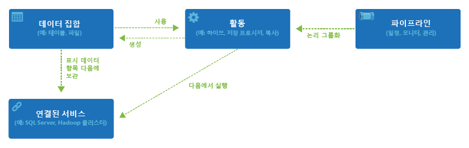

<properties 
	pageTitle="Azure 데이터 팩터리 소개" 
	description="Azure 데이터 팩터리 서비스를 통해 데이터 처리, 데이터 저장 및 데이터 이동 서비스를 구성하여 신뢰할 수 있는 정보를 생성하는 파이프라인을 만드는 방법을 알아봅니다." 
	services="data-factory" 
	documentationCenter="" 
	authors="spelluru" 
	manager="jhubbard" 
	editor="monicar"/>

<tags 
	ms.service="data-factory" 
	ms.workload="data-services" 
	ms.tgt_pltfrm="na" 
	ms.devlang="na" 
	ms.topic="get-started-article" 
	ms.date="08/05/2015" 
	ms.author="spelluru"/>

# Azure 데이터 팩터리 서비스 소개

## 개요
데이터 팩터리는 데이터의 이동과 변환을 조율하고 자동화하는 클라우드 기반의 데이터 통합 서비스입니다. 원자재를 가져다가 완제품으로 만들기 위해 장비를 실행하는 제조 공장처럼 데이터 팩터리는 원시 데이터를 수집하여 바로 사용할 수 있는 정보로 변환하는 기존 서비스를 오케스트레이션합니다.

데이터 팩터리는 온-프레미스 및 클라우드 데이터 원본 및 SaaS 모두에서 작업하면서 데이터를 수집, 준비, 변환, 분석 및 게시합니다. 데이터 팩터리는 서비스를 관리되는 데이터 흐름 파이프라인으로 작성하여 데이터를 변환하는 데 사용됩니다. 이때 빅 데이터 컴퓨팅을 위해서는 [Azure HDInsight(Hadoop)](http://azure.microsoft.com/documentation/services/hdinsight/), [Azure Batch](http://azure.microsoft.com/documentation/services/batch/)와 같은 서비스가 사용되고, 분석 솔루션을 운영하기 위해서는 [Azure 기계 학습](http://azure.microsoft.com/documentation/services/machine-learning/)이 사용됩니다. 테이블 형식의 모니터링 뷰를 능가하는 데이터 팩터리의 풍성한 시각화를 사용하여 데이터 파이프라인 간의 종속성과 계보를 신속하게 나타냅니다. 단일의 통합된 보기에서 모든 데이터 흐름 파이프라인을 모니터링하여 쉽게 문제를 파악하고 모니터링 경고를 설정합니다.

**그림 1.** 다양한 온-프레미스 데이터 원본으로부터 데이터를 수집하고 받아들여서 준비하고 다양한 변환으로 데이터를 구성하고 분석한 후 소비를 위해 바로 사용할 수 있는 데이터를 게시합니다.

깊을 통찰력을 끌어내도록 다양한 형태와 크기의 데이터를 신뢰할만한 일정으로 수집하고 변환하고 게시하기 위해 필요할 때마다 데이터 팩터리를 사용할 수 있습니다. 데이터 팩터리는 분석 파이프라인이 필요한 다양한 산업의 여러 시나리오에서 가용성이 높은 데이터 흐름 파이프라인을 만드는 데 사용됩니다. 온라인 소매 업체는 데이터 팩터리를 사용하여 고객의 탐색 활동을 기반으로 맞춤형 [제품 권장 목록](data-factory-product-reco-usecase.md)을 만듭니다. 게임 제작사는 [자사 마케팅](data-factory-customer-profiling-usecase.md) 캠페인의 효율을 파악하는 데 데이터 팩터리를 사용합니다. [고객 사례 연구](data-factory-customer-case-studies.md)를 검토하여 고객이 데이터 팩터리를 사용하는 방법과 이유를 직접 들어보십시오.

## 주요 개념

Azure 데이터 팩터리에는 입력 및 출력 데이터, 처리 이벤트, 필요한 데이터 흐름을 실행하는데 필요한 일정과 리소스를 정의하기 위해 함께 작용하는 몇 가지 주요 엔터티가 있습니다.

 **그림 2.** 데이터 집합, 활동, 파이프라인 및 연결된 서비스 간의 관계

### 활동
활동은 데이터에 수행할 작업을 정의합니다. 각 활동은 0개 이상의 [데이터 집합](data-factory-create-datasets.md)을 입력으로 받아 하나 이상의 데이터 집합을 출력합니다. 활동은 Azure 데이터 팩터리의 오케스트레이션 단위입니다. 예를 들어 하나의 데이터 집합에서 다른 데이터 집합으로의 데이터 복사를 오케스트레이션하기 위해 [복사 활동](data-factory-data-movement-activities.md)을 사용할 수 있습니다. 마찬가지로 데이터를 변환하거나 분석하기 위해서 Azure HDInsight 클러스터에서 Hive 쿼리를 실행하는 [Hive 활동](data-factory-data-transformation-activities.md)을 사용할 수 있습니다. Azure 데이터 팩터리는 다양한 데이터 변환, 분석 및 데이터 이동 활동을 제공합니다.

### 파이프라인
[파이프라인](data-factory-create-pipelines.md)은 활동의 논리적 그룹화입니다. 파이프라인은 여러 활동을 함께 작업을 수행하는 하나의 단위로 그룹화하기 위해 사용됩니다. 예를 들어 몇 개의 변환 활동 시퀀스에서 로그 파일 데이터를 정리해야 하는 경우가 있습니다. 이 시퀀스에는 복잡한 일정과 종속성이 있어서 오케스트레이션과 자동화가 필요할 수 있습니다. 이런 모든 활동이 “CleanLogFiles”라는 단일의 파이프라인으로 그룹화될 수 있습니다. “CleanLogFiles”는 각각의 개별적인 활동을 독립적으로 관리하는 대신 하나의 단위로 배포하고, 예약하고, 삭제할 수 있습니다.

### 데이터 집합
[데이터 집합](data-factory-create-datasets.md)은 활동의 입력 또는 출력으로 사용하려는 데이터에 대해 명명된 참조/포인터입니다. 데이터 집합은 테이블, 파일, 폴더, 문서를 비롯한 다양한 데이터 저장소 내의 데이터 구조를 식별합니다.

### 연결된 서비스
연결된 서비스는 데이터 팩터리가 외부 리소스에 연결하기 위해 필요한 정보를 정의합니다. 연결된 서비스는 데이터 팩터리 내에서 두 가지 용도로 사용됩니다.

- 온-프레미스 SQL Server, Oracle DB, 파일 공유 또는 Azure Blob 저장소 계정을 포함하(지만 여기에 국한되지 않)는 데이터 저장소를 나타내기 위해 사용됩니다. 위의 설명대로 데이터 집합은 연결된 서비스를 통해 데이터 팩터리에 연결된 데이터 저장소 내의 구조를 나타냅니다.
- 활동의 실행을 호스팅할 수 있는 계산 리소스를 나타내기 위해 사용됩니다. 예를 들어, “HDInsightHive Activity”는 HDInsight Hadoop 클러스터에서 실행됩니다.

데이터 집합, 활동, 파이프라인, 연결된 서비스라는 네 가지의 단순한 개념만으로 시작할 준비가 되었습니다. 처음부터 시작하여 [첫 번째 파이프라인을 빌드](data-factory-build-your-first-pipeline.md)하거나 [데이터 팩터리 샘플](data-factory-samples.md)에 있는 지침에 따라 즉시 사용 가능한 샘플을 배포할 수 있습니다.

<!---HONumber=August15_HO6-->