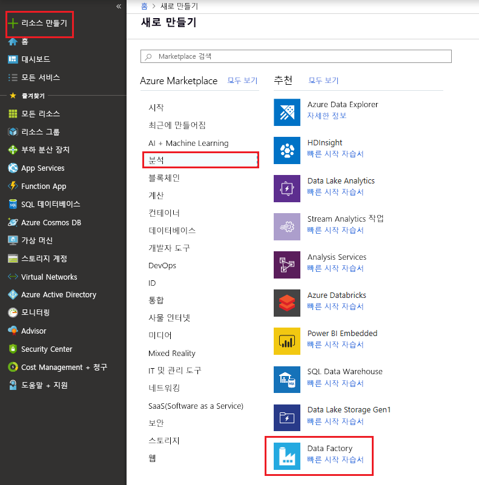

# Azure Data Factory를 사용하여 Azure Data Lake Storage Gen1에서 Gen2로 데이터 복사

Azure Data Lake Storage Gen2는 [Azure Blob Storage](../storage/blobs/storage-blobs-introduction.md)를 기반으로 하는 빅 데이터 분석 전용의 기능 세트입니다. 이를 사용하면 파일 시스템 및 개체 저장소 패러다임을 모두 사용하여 데이터를 조작할 수 있습니다.

현재 Azure Data Lake Storage Gen1을 사용 중인 경우 Azure Data Factory를 사용하여 Data Lake Storage Gen1에서 Gen2로 데이터를 복사하여 Gen2의 새로운 기능을 평가할 수 있습니다.

Azure Data Factory는 완전히 관리되는 클라우드 기반 데이터 통합 서비스입니다. 분석 솔루션을 빌드할 때 서비스를 사용하여 풍부한 온-프레미스 및 크라우드 기반 데이터 저장소의 데이터로 레이크를 채우고 시간을 절약할 수 있습니다. 지원되는 커넥터의 자세한 목록은 [지원되는 데이터 저장소](copy-activity-overview.md#supported-data-stores-and-formats) 표를 참조하세요.

Azure Data Factory는 스케일 아웃, 관리되는 데이터 이동 솔루션을 제공합니다. ADF의 스케일 아웃 아키텍처로 인해 높은 처리량으로 데이터를 수집할 수 있습니다. 자세한 내용은 [복사 작업 성능](copy-activity-performance.md)을 참조하세요.

이 문서에서는 Data Factory 데이터 복사 도구를 사용하여 _Azure Data Lake Storage Gen1_에서 _Azure Data Lake Storage Gen2_로 데이터를 복사하는 방법을 보여줍니다. 다른 데이터 저장소 유형에서 데이터를 복사할 때도 이와 유사한 단계를 따를 수 있습니다.

## 필수 조건

* Azure 구독: Azure 구독이 아직 없는 경우 시작하기 전에 [체험 계정](https://azure.microsoft.com/free/)을 만듭니다.
* 데이터가 있는 Azure Data Lake Storage Gen1 계정
* Data Lake Storage Gen2가 사용하도록 설정된 Azure Storage 계정: 저장소 계정에 없다면 [계정을 만들](https://ms.portal.azure.com/#create/Microsoft.StorageAccount-ARM)합니다.

## 데이터 팩터리를 만듭니다.

1. 왼쪽 메뉴에서 **리소스 만들기** > **데이터 + 분석** > **Data Factory**를 차례로 선택합니다.
   
   

2. **새 데이터 팩터리** 페이지에서 다음 그림에 표시된 필드의 값을 제공합니다. 
      
   
 
    * **이름**: Azure Data Factory의 전역적으로 고유 이름을 입력합니다. "데이터 팩터리 이름 \"LoadADLSDemo\"를 사용할 수 없습니다" 오류가 발생하면 데이터 팩터리의 다른 이름을 입력합니다. 예를 들어 _**yourname**_**ADFTutorialDataFactory**라는 이름을 사용할 수 있습니다. 데이터 팩터리를 다시 만들어 봅니다. 데이터 팩터리 아티팩트에 대한 명명 규칙은 [데이터 팩터리 명명 규칙](naming-rules.md)을 참조하세요.
    * **구독**: 데이터 팩터리를 만들 Azure 구독을 선택합니다. 
    * **리소스 그룹**: 드롭다운 목록에서 기존 리소스 그룹을 선택하거나 **새로 만들기** 옵션을 선택하고 리소스 그룹의 이름을 입력합니다. 리소스 그룹에 대한 자세한 내용은 [리소스 그룹을 사용하여 Azure 리소스 관리](../azure-resource-manager/resource-group-overview.md)를 참조하세요.  
    * **버전**: **V2**를 선택합니다.
    * **위치**: 데이터 팩터리의 위치를 선택합니다. 지원되는 위치만 드롭다운 목록에 표시됩니다. 데이터 팩터리에서 사용되는 데이터 저장소가 다른 위치 및 지역에 있어도 됩니다. 

3. **만들기**를 선택합니다.
4. 만들기가 완료되면 데이터 팩터리로 이동합니다. 다음 그림과 같이 **데이터 팩터리** 홈페이지가 표시됩니다. 
   
   

   **작성 및 모니터링** 타일을 선택하여 별도의 탭에서 데이터 통합 애플리케이션을 시작합니다.

## Azure Data Lake Storage Gen2에 데이터 로드

1. **시작** 페이지에서 **데이터 복사** 타일을 선택하여 데이터 복사 도구를 시작합니다. 

   
2. **속성** 페이지에서 **작업 이름** 필드를 **CopyFromADLSGen1ToGen2**로 지정하고 **다음**을 선택합니다.

    
3. **원본 데이터 저장소** 페이지에서 **+ 새 연결 만들기**를 클릭합니다.

    
    
    커넥터 갤러리에서 **Azure Data Lake Storage Gen1**을 선택하고, **계속**을 선택합니다.
    
    
    
4. **Azure Data Lake Storage Gen1 연결 지정** 페이지에서 다음 단계를 수행합니다.
   1. 계정 이름으로 Data Lake Storage Gen1을 선택하고 **Tenant**를 지정하거나 유효한지 검사합니다.
   2. **연결 테스트**를 클릭하여 설정의 유효성을 검사한 다음, **마침**을 선택합니다.
   3. 새 연결이 생성되었다고 표시됩니다. **다음**을 선택합니다.
   
   > [!IMPORTANT]
   > 이 연습에서는 Azure 리소스용 관리 ID를 사용하여 Data Lake Storage Gen1을 인증합니다. [다음 지침](connector-azure-data-lake-store.md#managed-identity)에 따라 Azure Data Lake Storage Gen1에서 MSI에 적절한 권한을 부여합니다.
   
   
      
5. **입력 파일 또는 폴더 선택** 페이지에서, 복사하려는 폴더 및 파일로 이동합니다. 폴더/파일을 선택하고 **선택**을 선택합니다.

    

6. **재귀적으로 파일 복사** 및 **이진 복사** 옵션을 선택하여 복사 동작을 지정합니다. **다음**을 선택합니다.

    
    
7. **대상 데이터 스토리지** 페이지에서 **+ 새 연결 만들기**를 클릭한 다음, **Azure Data Lake Storage Gen2**를 선택하고 **계속**을 선택합니다.

    

8. **Azure Data Lake Storage Gen2 연결 지정** 페이지에서 다음 단계를 수행합니다.

   1. "스토리지 계정 이름" 드롭다운 목록에서 Data Lake Storage Gen2 계정을 선택합니다.
   2. **마침**을 선택하여 연결을 만듭니다. 그런 후 **다음**을 선택합니다.
   
   

9. 에 **출력 파일 또는 폴더 선택** 페이지에서 입력 **copyfromadlsgen1** 출력 폴더 이름 및 선택 **다음**합니다. ADF 만들어집니다 해당 ADLS Gen2 파일 시스템 및 하위 폴더를 복사 하는 동안 존재 하지 않는 경우.

    

10. **설정** 페이지에서 **다음**을 선택하여 기본 설정을 사용합니다.

11. **요약** 페이지에서 설정을 검토하고, **다음**을 선택합니다.

    
12. **배포 페이지**에서 **모니터**를 선택하여 파이프라인을 모니터링합니다.

    
13. 왼쪽의 **모니터** 탭이 자동으로 선택됩니다. **작업** 열에는 활동 실행 세부 정보를 보고 파이프라인을 다시 실행하기 위한 링크가 있습니다.

    

14. 파이프라인 실행과 연결된 활동 실행을 보려면 **작업** 열에서 **활동 실행 보기** 링크를 선택합니다. 파이프라인에는 하나의 작업(복사 작업)만 있으므로 하나의 항목만 표시됩니다. 파이프라인 실행 보기로 전환하려면 위쪽의 **파이프라인** 링크를 선택합니다. **새로 고침**을 선택하여 목록을 새로 고칩니다. 

    

15. 각 복사 작업의 실행 세부 정보를 모니터링하려면 작업 모니터링 보기의 **작업** 아래에서 **세부 정보** 링크(안경 이미지)를 선택합니다. 원본에서 싱크로 복사되는 데이터 볼륨, 데이터 처리량, 해당 기간의 실행 단계, 사용되는 구성 등의 세부 정보를 모니터링할 수 있습니다.

    

16. 데이터가 Data Lake Storage Gen2 계정에 복사되었는지 확인합니다.

## 모범 사례

파일 기반 데이터 저장소에서 대규모 데이터 볼륨을 복사할 때 다음이 제안됩니다.

- 파일을 각각 10TB~30TB 파일 집합으로 분할합니다.
- 원본 또는 싱크 데이터 저장소에서 제한을 방지하기 위해 동시 복사 실행을 너무 많이 트리거하지 않습니다. 하나의 복사 실행을 시작하고 처리량을 모니터링한 다음, 점차적으로 필요한만큼 추가할 수 있습니다.

## 다음 단계

* [복사 작업 개요](copy-activity-overview.md)
* [Azure Data Lake Storage Gen2 커넥터](connector-azure-data-lake-storage.md)
