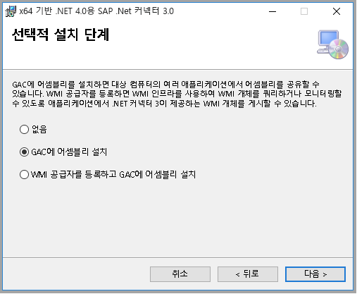

# <a name="copy-data-from-sap-business-warehouse-by-using-azure-data-factory"></a>Azure Data Factory를 사용 하 여 SAP Business Warehouse에서 데이터 복사

이 문서에서는 Azure Data Lake 저장소 Gen2에서 SAP Business Warehouse (BW) 오픈 허브를 통해 데이터를 복사 하려면 Azure Data Factory를 사용 하는 방법을 보여 줍니다. 비슷한 프로세스를 사용 하 여 다른 데이터를 복사할 [지원 되는 싱크 데이터 저장소](copy-activity-overview.md#supported-data-stores-and-formats)합니다.

> [!TIP]
> SAP BW, SAP BW Open Hub 통합 등 델타 추출 흐름에서에서 데이터를 복사 하는 방법에 대 한 일반 정보를 참조 하세요. [Azure Data Factory를 사용 하 여 오픈 허브를 통해 SAP Business Warehouse에서 데이터를 복사](connector-sap-business-warehouse-open-hub.md)합니다.

## <a name="prerequisites"></a>필수 조건

- **Azure Data Factory**: 없다면 하나를 수행 하는 단계 [데이터 팩터리 만들기](quickstart-create-data-factory-portal.md#create-a-data-factory)합니다.

- **SAP BW Open Hub 대상 (OHD) 대상 형식 "데이터베이스 테이블"을 사용 하 여**: OHD 만들거나 Data Factory 통합에 대 한 프로그램 OHD 올바르게 구성 되어 있는지 확인 하려면을 참조 합니다 [SAP BW Open Hub Destination 구성](#sap-bw-open-hub-destination-configurations) 이 문서의 섹션입니다.

- **SAP BW 사용자는 다음 권한이 필요**:

  - 원격 함수 호출 (RFC)에 대 한 권한 부여 및 SAP BW 합니다.
  - "실행" 작업 권한을 합니다 **S_SDSAUTH** 권한 부여 개체입니다.

- **A [자체 호스팅 통합 런타임 (IR)](concepts-integration-runtime.md#self-hosted-integration-runtime) SAP.NET connector 3.0 사용 하 여**입니다. 이러한 설정 단계를 수행 합니다.

  1. 설치 하 고 자체 호스팅된 통합 런타임을 3.13 이상 버전을 등록 합니다. (이 프로세스는이 문서의 뒷부분에 설명 되어 있습니다.)

  2. 다운로드 합니다 [Microsoft.NET 3.0 용 64 비트 SAP 커넥터](https://support.sap.com/en/product/connectors/msnet.html) SAP의 웹 사이트에서 자체 호스팅된 IR 동일한 컴퓨터에 설치 설치 하는 동안 선택 했는지 확인 **GAC에 어셈블리 설치** 에 **선택적인 설정 단계** 다음 이미지와 같이 대화 상자에서:

     

## <a name="do-a-full-copy-from-sap-bw-open-hub"></a>SAP BW Open Hub에서 전체 복사를 수행

Azure portal에서 데이터 팩터리로 이동 합니다. 선택 **작성자 및 모니터** 를 별도 탭에서 Data Factory UI를 엽니다.

1. 에 **시작 해 보겠습니다** 페이지에서 **데이터 복사** 데이터 복사 도구를 엽니다.

2. 에 **속성** 페이지에서 지정을 **작업 이름**를 선택한 후 **다음**합니다.

3. 에 **원본 데이터 저장소** 페이지에서 **+ 새 연결 만들기**합니다. 선택 **SAP BW Open Hub** 커넥터 갤러리를 선택 합니다 **계속**합니다. 커넥터를 필터링 하려면 입력할 수 있습니다 **SAP** 검색 상자에 있습니다.

4. 에 **SAP BW Open Hub 지정 연결** 페이지에서 새 연결을 만들려면 다음이 단계를 수행 합니다.

   

   1. **통합 런타임을 통해 연결** 목록에서 기존 자체 호스팅된 IR.를 선택 합니다. 또는 하나 아직 없는 경우 새로 만들려면 선택 합니다.

      새 자체 호스팅된 IR을 만들려면 **+ 새로 만들기**를 선택한 후 **자체 호스팅**합니다. 입력을 **이름을**를 선택한 후 **다음**합니다. 선택 **빠른 설치** 현재 컴퓨터에 설치를 수행 하는 **수동 설치** 제공 하는 단계입니다.

      설명 했 듯이 [필수 구성 요소](#prerequisites), 자체 호스팅된 IR 실행 되 고 있는 동일한 컴퓨터에 설치 되는 3.0 Microsoft.NET 용 SAP Connector 있는지 확인 합니다.

   2. SAP BW 입력 **서버 이름**를 **시스템 번호**합니다 **클라이언트 ID** **언어** (이외의 경우 **EN**) 하십시오 **사용자 이름**, 및 **암호**합니다.

   3. 선택 **연결 테스트** 의 설정을 확인 하 여 선택한 **마침**합니다.

   4. 새 연결을 만듭니다. **다음**을 선택합니다.

5. 에 **오픈 허브 대상을 선택** 페이지, SAP BW에 사용할 수 있는 오픈 허브 대상을 검색 합니다. 선택에서 데이터를 복사 하 여 선택한 OHD **다음**합니다.

   

6. 필요한 경우 필터를 지정 합니다. 프로그램 OHD 데이터만 포함을 단일 요청 ID 사용 하 여 단일 데이터 전송 프로세스 (DTP) 실행에서 든에 DTP 완료 되 고 일반 데이터를 복사 하려는 경우는 **마지막 요청 제외** 확인란 합니다.

   이러한 설정에 대 한 자세한 정보는 [SAP BW Open Hub Destination 구성](#sap-bw-open-hub-destination-configurations) 이 문서의 섹션입니다. 선택 **유효성 검사** 반환할 데이터를 다시 확인 합니다. 그런 후 **다음**을 선택합니다.

   

7. 에 **대상 데이터 저장소** 페이지에서 **+ 새 연결 만들기** > **Azure Data Lake 저장소 Gen2**  >   **계속**합니다.

8. 에 **Azure Data Lake Storage 지정 연결** 페이지에서 연결을 만들려면 다음이 단계를 수행 합니다.

   

   1. Data Lake Storage Gen2 지원 계정을 선택 합니다 **이름을** 드롭 다운 목록.
   2. **마침**을 선택하여 연결을 만듭니다. 그런 후 **다음**을 선택합니다.

9. 에 **출력 파일 또는 폴더 선택** 페이지에서 입력 **copyfromopenhub** 출력 폴더 이름으로 합니다. 그런 후 **다음**을 선택합니다.

   

10. 에 **파일 형식 설정이** 페이지에서 **다음** 기본 설정을 사용 하도록 합니다.

    

11. 에 **설정을** 페이지에서 **성능 설정을**합니다. 에 대 한 값을 입력 **복사 병렬 처리 수준을** 같은 SAP BW에서 동시에 로드 하는 5입니다. 그런 후 **다음**을 선택합니다.

    

12. 에 **요약** 페이지에서 설정을 검토 합니다. 그런 후 **다음**을 선택합니다.

13. 에 **배포** 페이지에서 **모니터** 파이프라인을 모니터링 하려면.

    

14. 다음에 유의 합니다 **모니터** 탭 페이지의 왼쪽에 자동으로 선택 됩니다. 합니다 **작업** 열 작업 실행 세부 정보를 보고 파이프라인을 다시 링크를 포함 합니다.

    

15. 파이프라인 실행과 연결 된 활동 실행을 보려면 **활동 실행 보기** 에 **작업** 열입니다. 파이프라인에는 하나의 작업(복사 작업)만 있으므로 하나의 항목만 표시됩니다. 파이프라인 실행 보기로 다시 전환 합니다 **파이프라인** 맨 위에 있는 링크입니다. **새로 고침**을 선택하여 목록을 새로 고칩니다.

    

16. 각 복사 작업 실행 세부 정보를 모니터링 하려면 선택 합니다 **세부 정보** 안경 아이콘 아래 링크를 **작업** 활동 모니터링 보기에 있습니다. 사용 가능한 세부 정보 기간, 실행 단계 및 싱크, 데이터 처리량을 원본에서 복사할 데이터 볼륨 및 사용 되는 구성을 포함 합니다.

    

17. 보려는 합니다 **최대 요청 ID**돌아가서 활동 모니터링 보기 및 선택 **출력** 아래에 있는 **작업**합니다.

    

    

## <a name="do-an-incremental-copy-from-sap-bw-open-hub"></a>SAP BW 오픈 허브에서를 증분 복사를 수행 합니다.

> [!TIP]
> 참조 [SAP BW 오픈 허브 커넥터 델타 추출 흐름](connector-sap-business-warehouse-open-hub.md#delta-extraction-flow) 를 Data Factory에서 SAP BW 오픈 허브 커넥터 SAP BW에서 증분 데이터를 복사 하는 방법에 대해 알아봅니다. 이 문서에서는 기본 커넥터 구성을 이해 하면을 수 있습니다.

이제 SAP BW 오픈 허브에서 증분 복사를 구성 하려면 계속 해 보겠습니다.

증분 복사의 기반이 되는 "상위 워터 마크" 메커니즘을 사용 합니다 **요청 ID**합니다. 해당 ID는 DTP 하 여 SAP BW Open Hub Destination에서 자동으로 생성 됩니다. 다음 다이어그램은이 워크플로 보여줍니다.


데이터 팩터리에서 **시작 해 보겠습니다** 페이지에서 **템플릿에서 파이프라인 만들기** 기본 제공 템플릿을 사용 하 여 합니다.

1. 검색할 **SAP BW** 를 찾아서 선택 합니다 **증분 복사할 SAP BW에서 Azure Data Lake 저장소 Gen2** 템플릿. 이 템플릿은 Azure Data Lake 저장소 Gen2로 데이터를 복사합니다. 다른 싱크 형식으로 복사할 유사한 워크플로 사용할 수 있습니다.

2. 서식 파일의 기본 페이지에서 또는 다음 세 가지 연결을 만들려면 선택한 후 **이 템플릿을 사용 하 여** 창의 오른쪽 아래 모퉁이에서.

   - **Azure Blob storage**: 이 연습에서는 상위 워터 마크를 저장할 Azure Blob storage 사용은 *max 요청 ID를 복사*합니다.
   - **SAP BW Open Hub**: 이 데이터를 복사해 올 소스입니다. 자세한 구성에 대 한 이전 복사본 전체 연습을 참조 하세요.
   - **Azure Data Lake Storage Gen2**: 이 데이터를 복사할 싱크입니다. 자세한 구성에 대 한 이전 복사본 전체 연습을 참조 하세요.

   

3. 이 템플릿은 다음 세 가지 작업이 있는 파이프라인을 생성 하 고 성공에 연결 될 수 있습니다. *조회*하십시오 *데이터를 복사*, 및 *웹*합니다.

   파이프라인으로 이동 **매개 변수** 탭 합니다. 제공 해야 하는 모든 구성이 표시 됩니다.

   

   - **SAPOpenHubDestinationName**: 데이터를 복사 하려면 오픈 허브 테이블 이름을 지정 합니다.

   - **ADLSGen2SinkPath**: 데이터를 복사할 대상 Azure Data Lake 저장소 Gen2 경로 지정 합니다. 경로가 존재 하지 않으면 Data Factory 복사 작업 실행 하는 동안 패스를 만듭니다.

   - **HighWatermarkBlobPath**: 와 같은 상위 워터 마크 값을 저장할 경로를 지정 `container/path`합니다.

   - **HighWatermarkBlobName**: 와 같은 상위 워터 마크 값을 저장할 blob 이름을 지정 `requestIdCache.txt`합니다. Blob storage로 이동 HighWatermarkBlobPath + HighWatermarkBlobName의 해당 경로 같은 *container/path/requestIdCache.txt*합니다. 콘텐츠 0 사용 하 여 blob을 만듭니다.

      

   - **LogicAppURL**: 이 템플릿에서 사용 하 여 WebActivity Blob 저장소에서 높은 워터 마크 값을 설정 하려면 Azure Logic Apps를 호출 합니다. 또는 Azure SQL Database를 사용 하 여 저장 합니다. 값을 업데이트 하는 저장된 프로시저 작업을 사용 합니다.

      다음 이미지와 같이 논리 앱을 먼저 만들어야 합니다. 그런 다음에 붙여 합니다 **HTTP POST URL**합니다.

      

      1. Azure Portal로 이동합니다. 새 선택 **Logic Apps** 서비스입니다. 선택 **+ 빈 Logic App** 이동할 **Logic Apps 디자이너**합니다.

      2. 트리거를 만듭니다 **때 HTTP 요청을 받으면**합니다. HTTP 요청 본문을 다음과 같이 지정 합니다.

         ```json
         {
            "properties": {
               "sapOpenHubMaxRequestId": {
                  "type": "string"
               },
               "type": "object"
            }
         }
         ```

      3. 추가 된 **blob 만들기** 작업 합니다. 에 대 한 **폴더 경로** 하 고 **Blob 이름**, 이전에 구성한 것과 동일한 값을 사용 하 여 **HighWatermarkBlobPath** 및 **HighWatermarkBlobName**.

      4. **저장**을 선택합니다. 그런 다음 값을 복사 **HTTP POST URL** Data Factory 파이프라인에서 사용 하도록 합니다.

4. Data Factory 파이프라인 매개 변수를 제공한 후 선택 **디버그** > **마침** 구성 유효성 검사 실행을 호출 합니다. 또는 선택 **모두 게시** 를 변경 내용을 게시 하 여 선택한 **트리거** 실행을 합니다.

## <a name="sap-bw-open-hub-destination-configurations"></a>SAP BW Open Hub Destination 구성

이 섹션에서는 Data Factory에서 SAP BW 오픈 허브 커넥터를 사용 하 여 데이터를 복사 하는 SAP BW의 구성을 소개 합니다.

### <a name="configure-delta-extraction-in-sap-bw"></a>SAP BW에서 델타 압축 풀기 구성

기록 복사본 및 증분 복사 또는 증분 복사를 해야 하는 경우 SAP BW에서 델타 추출을 구성 합니다.

1. 오픈 허브 대상을 만듭니다. OHD 필요한 변환 및 데이터 전송 프로세스를 자동으로 만드는 SAP 트랜잭션 RSA1에서 만들 수 있습니다. 다음 설정을 사용합니다.

   - **ObjectType**: 모든 개체 형식을 사용할 수 있습니다. 여기에서 사용 하 여 **InfoCube** 예입니다.
   - **대상 유형**: 선택 **테이블을 데이터베이스**합니다.
   - **테이블의 키**: 선택 **기술 키**합니다.
   - **추출**: 선택 **테이블에 레코드를 삽입 하 고 데이터 유지**합니다.

   

   

   DTP를에 대 한 SAP 작업 프로세스를 실행 하는 병렬 개수를 늘릴 수 있습니다.

   

2. 프로세스 체인에 DTP를 예약 합니다.

   큐브에 대 한 델타 DTP 필요한 행을 압축 하지 않은 경우에 작동 합니다. BW 큐브 압축 되지 실행 되 고 있는지를 DTP 오픈 허브 테이블에 있는지 확인 합니다. 이 작업을 수행 하는 가장 쉬운 방법은 기존 프로세스 체인에는 DTP를 통합 하는 경우 다음 예제에서는 (OHD)에 DTP 간의 프로세스 체인에 삽입 됩니다 합니다 *조정* (집계 롤업) 및 *축소* (큐브 압축) 단계입니다.

   

### <a name="configure-full-extraction-in-sap-bw"></a>SAP BW에서 전체 추출 구성

델타 추출 하는 것 외에도 동일한 SAP BW InfoProvider의 전체 추출을 수도 있습니다. 전체 복사를 수행 하려는 경우에 일반적으로 적용 되지만 증분 되지 않은 또는 하려는 [델타 추출 다시 동기화](#resync-delta-extraction)합니다.

동일한 OHD 둘 이상의 DTP를 가질 수 없습니다. 따라서 델타 추출 하기 전에 추가 OHD를 만들어야 합니다.


전체 부하 OHD 델타 압축 풀기에 대 한 보다 다양 한 옵션을 선택 합니다.

- OHD: 설정 된 **추출** 옵션을 **데이터 삭제 및 삽입 레코드**합니다. 그렇지 않으면 BW 프로세스 체인에 DTP를 반복 하는 경우 여러 번 데이터 추출 됩니다.

- DTP에: 설정할 **추출 모드** 하 **전체**합니다. 자동으로 만든된 DTP를 변경 해야 합니다 **델타** 하 **전체** 즉시는 OHD 만들어진 후이 이미지와 같이:

   

- 데이터 팩터리의 BW 오픈 허브 커넥터: 해제할 **제외 마지막 요청**합니다. 그렇지 않으면 아무 것도 추출 됩니다.

일반적으로 전체 DTP를 수동으로 실행할 수 있습니다. 또는 전체 DTP 프로세스 체인을 만들 수 있습니다. 것이 일반적으로 기존 프로세스 체인와 독립적인 별도 체인입니다. 두 경우 모두 *Data Factory 복사를 사용 하 여 추출을 시작 하기 전에 DTP이 완료 되었음을 확인*합니다. 그렇지 않으면 일부 데이터만 복사 됩니다.

### <a name="run-delta-extraction-the-first-time"></a>델타 추출 처음으로 실행

첫 번째 델타 추출은 기술적으로 *추출 전체*합니다. 기본적으로 SAP BW 오픈 허브 커넥터 마지막 요청 데이터를 복사 하는 경우를 제외 합니다. 첫 번째 델타 압축 풀기에 대 한 데이터가 추출 되 Data Factory 복사 활동에서 후속 DTP는 별도 요청 ID 사용 하 여 테이블의 델타 데이터를 생성 될 때까지 이 시나리오를 방지 하려면 두 가지 있습니다.

- 기능을 해제 합니다 **제외 마지막 요청** 첫 번째 델타 압축 풀기에 대 한 옵션입니다. 델타 추출 처음으로 시작 하기 전에 첫 번째 델타 DTP이 완료 되었음을 확인 합니다.
-  다음 섹션에 설명 된 대로 델타 추출, 다시 동기화에 대 한 절차를 따르십시오.

### <a name="resync-delta-extraction"></a>델타 추출 다시 동기화

다음 시나리오에서 SAP BW 큐브 데이터를 변경 하지만 DTP 델타로 간주 되지 않습니다.

- SAP BW 선택적 행을 삭제 (필터 조건을 사용 하 여)
- (잘못 된 요청)의 SAP BW 요청 삭제

SAP Open Hub Destination (2015부터 모든 SAP BW 지원 패키지)의 데이터 마트 제어 된 데이터 대상이 아닙니다. 따라서는 OHD에서 데이터를 변경 하지 않고 큐브에서 데이터를 삭제할 수 있습니다. 그런 다음 Data Factory를 사용 하 여 큐브의 데이터를 다시 동기화 해야 합니다.

1. (전체 DTP를 사용 하 여 SAP의)에서 Data Factory의 전체 추출을 실행 합니다.
2. DTP 델타에 대 한 오픈 허브 테이블의 모든 행을 삭제 합니다.
3. DTP 델타의 상태를 설정 하려면 **인출**합니다.

그런 다음 모든 후속 델타 Dtp 및 Data Factory 델타 추출 예상 대로 작동 합니다.

DTP 델타의 상태를 설정 하 하 **인출**, 델타 DTP를 수동으로 실행 하려면 다음 옵션을 사용할 수 있습니다.

    *No Data Transfer; Delta Status in Source: Fetched*

## <a name="next-steps"></a>다음 단계

SAP BW Open Hub 커넥터 지원에 알아봅니다.

> [!div class="nextstepaction"]
>[SAP Business Warehouse 오픈 허브 커넥터](connector-sap-business-warehouse-open-hub.md)
