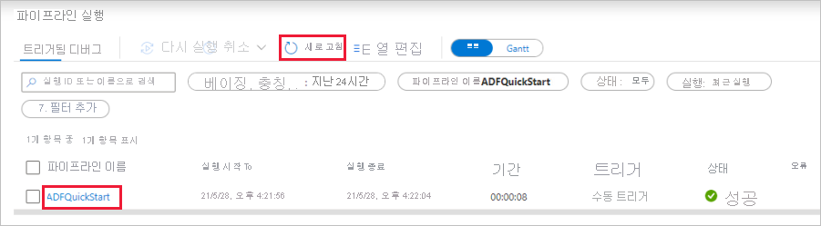
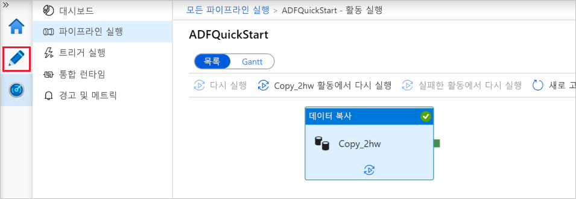

# 빠른 시작: 데이터 복사 도구를 사용하여 데이터 복사

> [!div class="op_single_selector" title1="사용 중인 Data Factory 서비스 버전을 선택합니다."]
> * [버전 1](v1/data-factory-copy-data-from-azure-blob-storage-to-sql-database.md)
> * [현재 버전](quickstart-create-data-factory-copy-data-tool.md)

[!INCLUDE[appliesto-adf-xxx-md](includes/appliesto-adf-xxx-md.md)]

이 빠른 시작에서는 Azure Portal을 사용하여 데이터 팩터리를 만듭니다. 그런 다음 데이터 복사 도구를 사용하여 Azure Blob Storage의 한 폴더에서 다른 폴더로 데이터를 복사하는 파이프라인을 만듭니다. 

> [!NOTE]
> Azure Data Factory를 처음 사용하는 경우 이 빠른 시작을 수행하기 전에 [Azure Data Factory 소개](data-factory-introduction.md)를 참조하세요. 

[!INCLUDE [data-factory-quickstart-prerequisites](../../includes/data-factory-quickstart-prerequisites.md)] 

## 데이터 팩터리 만들기

1. **Microsoft Edge** 또는 **Google Chrome** 웹 브라우저를 시작합니다. 현재 Data Factory UI는 Microsoft Edge 및 Google Chrome 웹 브라우저에서만 지원됩니다.
1. [Azure 포털](https://portal.azure.com)로 이동합니다. 
1. Azure Portal 메뉴에서 **리소스 만들기** > **분석** > **Data Factory**를 차례로 선택합니다.

    

1. **새 데이터 팩터리** 페이지에서 **이름**에 대해 **ADFTutorialDataFactory**를 입력합니다. 
 
   Azure Data Factory의 이름은 *전역적으로 고유*해야 합니다. 다음 오류가 표시되는 경우 데이터 팩터리 이름을 변경하고(예: **&lt;yourname&gt;ADFTutorialDataFactory**) 다시 만듭니다. 데이터 팩터리 아티팩트에 대한 명명 규칙은 [데이터 팩터리 - 명명 규칙](naming-rules.md) 문서를 참조하세요.
  
   
1. **구독**에 대해 데이터 팩터리를 만들려는 위치에 Azure 구독을 선택합니다. 
1. **리소스 그룹**에 대해 다음 단계 중 하나를 사용합니다.
     
   - **기존 항목 사용**을 선택하고 목록에서 기존 리소스 그룹을 선택합니다. 
   - **새로 만들기**를 선택하고 리소스 그룹의 이름을 입력합니다.   
         
   리소스 그룹에 대한 자세한 내용은 [리소스 그룹을 사용하여 Azure 리소스 관리](../azure-resource-manager/management/overview.md)를 참조하세요.  
1. **버전**에서 **V2**를 선택합니다.
1. **위치**에 데이터 팩터리의 위치를 선택합니다.

   이 목록은 데이터 팩터리가 지원하는 위치 및 Azure Data Factory 메타데이터가 저장될 위치만 표시합니다. Data Factory에서 사용하는 연결된 데이터 저장소(Azure Storage 및 Azure SQL Database 등) 및 컴퓨팅(Azure HDInsight 등)은 다른 하위 지역에서 실행할 수 있습니다.

1. **만들기**를 선택합니다.

1. 만들기가 완료되면 **데이터 팩터리** 페이지가 표시됩니다. **작성 및 모니터링** 타일을 선택하여 별도의 탭에서 Azure Data Factory UI(사용자 인터페이스) 애플리케이션을 시작합니다.
   
   

## 데이터 복사 도구 시작

1. **시작하기** 페이지에서 **데이터 복사** 타일을 선택하여 데이터 복사 도구를 시작합니다. 

   

1. 데이터 복사 도구의 **속성** 페이지에서 파이프라인의 이름 및 해당 설명을 지정한 후 **다음**을 선택합니다. 

   
1. **원본 데이터 저장소** 페이지에서 다음 단계를 완료합니다.

    a. **+ 새 연결 만들기**를 클릭하여 연결을 추가합니다.

    b. 원본 연결에 만들려는 연결된 서비스 유형을 선택합니다. 이 자습서에서는 **Azure Blob Storage**를 사용합니다. 갤러리에서 선택한 다음, **계속**을 선택합니다.
    
    

    다. **새로 연결된 서비스(Azure Blob Storage)** 페이지에서 연결된 서비스의 이름을 지정합니다. **스토리지 계정 이름** 목록에서 스토리지 계정을 선택하고 연결을 테스트한 다음, **만들기**를 선택합니다. 

    

    d. 새로 만든 연결된 서비스를 원본으로 선택한 다음, **다음**을 클릭합니다.

1. **입력 파일 또는 폴더 선택** 페이지에서 다음 단계를 완료합니다.

   a. **찾아보기**를 클릭하여 **adftutorial/input** 폴더로 이동하고, **emp.txt** 파일을 선택한 다음, **선택**을 클릭합니다. 

   d. 파일을 있는 그대로 복사하려면 **이진 복사** 확인란을 선택한 다음, **다음**을 선택합니다. 

   

1. **대상 데이터 저장소** 페이지에서 방금 만든 **Azure Blob Storage** 연결된 서비스를 선택한 다음, **다음**을 선택합니다. 

1. **출력 파일 또는 폴더 선택** 페이지에서 폴더 경로로 **adftutorial/output**을 입력한 다음, **다음**을 선택합니다. 

    

1. **설정** 페이지에서 **다음**을 선택하여 기본 구성을 사용합니다. 

1. **요약** 페이지에서 모든 설정을 검토하고 **다음**을 선택합니다. 

1. **배포 완료** 페이지에서 **모니터**를 선택하여 만든 파이프라인을 모니터링합니다. 

    

1. 애플리케이션이 **모니터** 탭으로 전환됩니다. 이 탭에서 파이프라인의 상태가 표시됩니다. **새로 고침**을 선택하여 목록을 새로 고칩니다. **파이프라인 이름** 아래 링크를 클릭하여 활동 실행 세부 정보를 보거나 파이프라인을 다시 실행합니다. 
   
    

1. 복사 작업에 대한 자세한 내용은 활동 실행 페이지의 **작업 이름** 열에서 **세부 정보** 링크(안경 아이콘)를 선택합니다. 속성에 대한 자세한 내용은 [복사 활동 개요](copy-activity-overview.md)를 참조하세요. 

1. 파이프라인 실행 보기로 돌아가려면 이동 경로 탐색 메뉴의 **모든 파이프라인 실행** 링크를 선택합니다. 보기를 새로 고치려면 **새로 고침**을 선택합니다. 

1. **emp.txt** 파일이 **adftutorial** 컨테이너의 **output** 폴더에 만들어졌는지 확인합니다. 출력 폴더가 없는 경우 Data Factory 서비스에서 자동으로 생성됩니다. 

1. 연결된 서비스, 데이터 세트 및 파이프라인을 편집할 수 있도록 왼쪽 창의 **모니터** 탭 위에서 **작성자** 탭으로 전환합니다. 데이터 팩터리 UI에서 이러한 항목을 편집하는 방법을 알아보려면 [Azure Portal을 사용하여 데이터 팩터리 만들기](quickstart-create-data-factory-portal.md)를 참조하세요.

    

## 다음 단계
이 샘플의 파이프라인은 Azure Blob Storage의 한 위치에서 다른 위치로 데이터를 복사합니다. 더 많은 시나리오에서의 데이터 팩터리 사용에 대해 알아보려면 [자습서](tutorial-copy-data-portal.md)를 따릅니다. 
