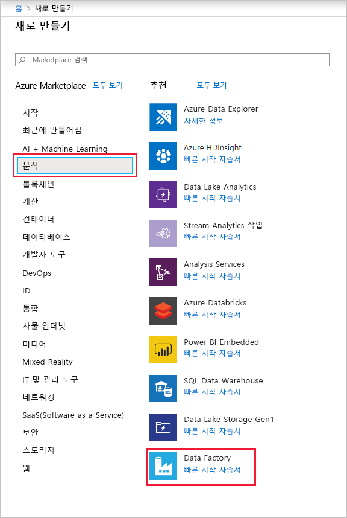
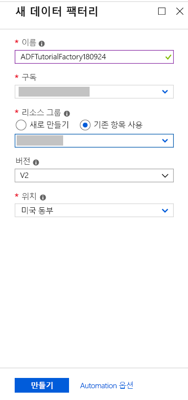
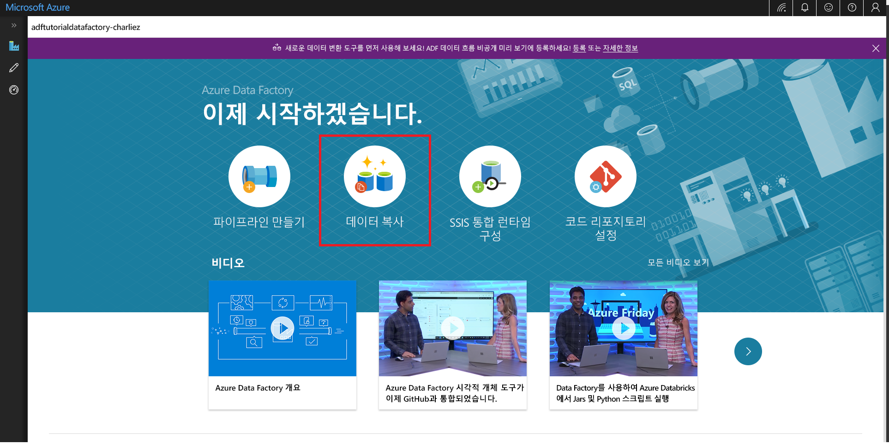
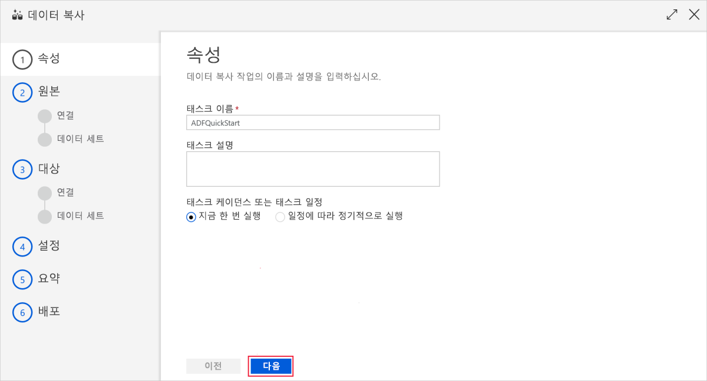
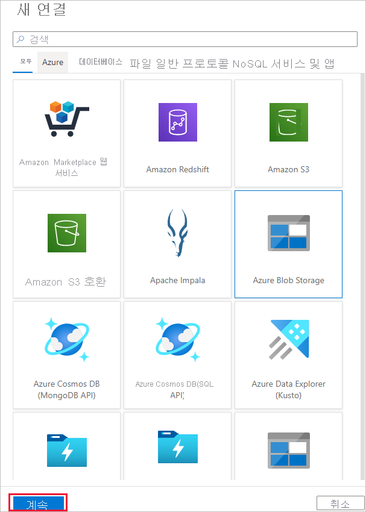
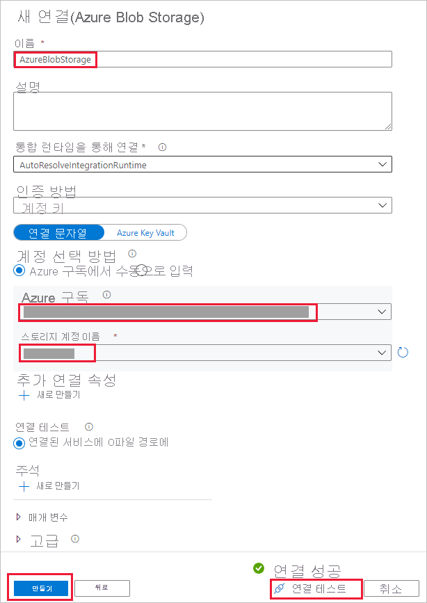
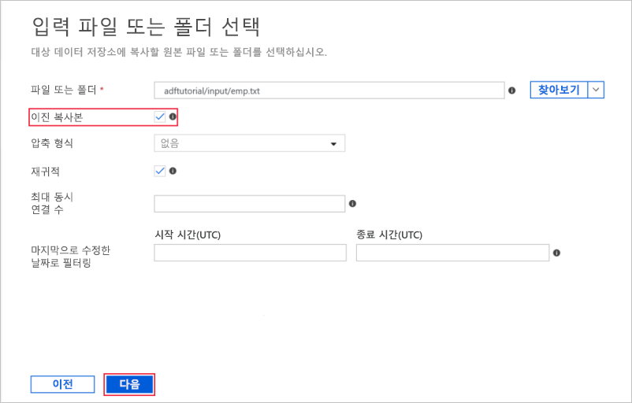
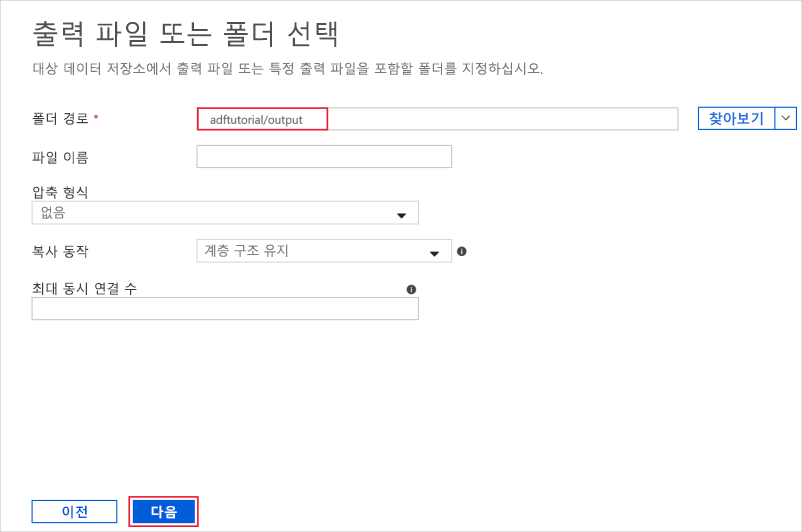
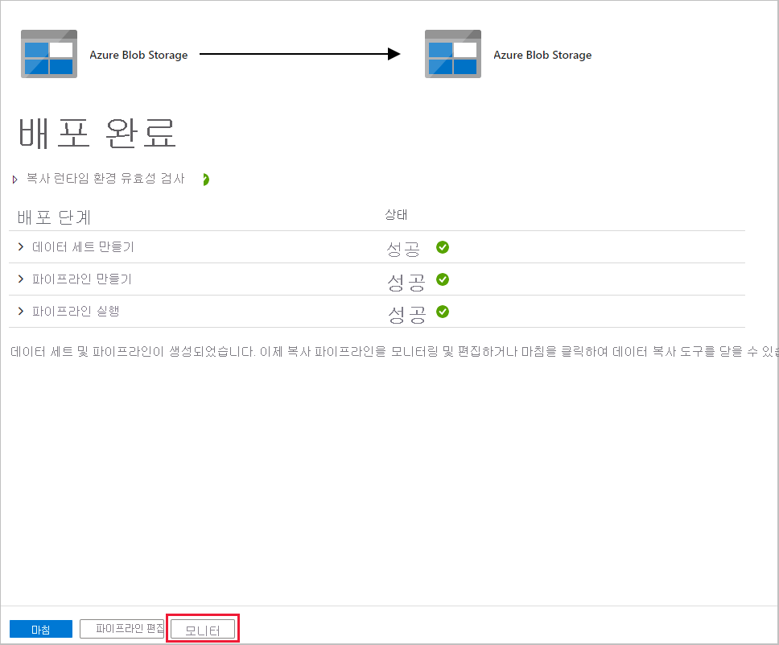

# 데이터 복사 도구를 사용하여 데이터 복사 
> [!div class="op_single_selector" title1="Select the version of Data Factory service that you are using:"]
> * [버전 1](v1/data-factory-copy-data-from-azure-blob-storage-to-sql-database.md)
> * [현재 버전](quickstart-create-data-factory-copy-data-tool.md)

이 빠른 시작에서는 Azure Portal을 사용하여 데이터 팩터리를 만듭니다. 그런 다음 데이터 복사 도구를 사용하여 Azure Blob 저장소의 한 폴더에서 다른 폴더로 데이터를 복사하는 파이프라인을 만듭니다. 

> [!NOTE]
> Azure Data Factory를 처음 사용하는 경우 이 빠른 시작을 수행하기 전에 [Azure Data Factory 소개](data-factory-introduction.md)를 참조하세요. 

[!INCLUDE [data-factory-quickstart-prerequisites](../../includes/data-factory-quickstart-prerequisites.md)] 

## 데이터 팩터리를 만듭니다.

1. 왼쪽 메뉴에서 **새로 만들기**를 선택하고 **데이터 + 분석**을 선택한 다음 **데이터 팩터리**를 선택합니다. 
   
   
1. **새 데이터 팩터리** 페이지에서 **이름**에 대해 **ADFTutorialDataFactory**를 입력합니다. 
      
   
 
   Azure Data Factory의 이름은 *전역적으로 고유*해야 합니다. 다음 오류가 표시되는 경우 데이터 팩터리 이름을 변경하고(예: **&lt;yourname&gt;ADFTutorialDataFactory**) 다시 만듭니다. 데이터 팩터리 아티팩트에 대한 명명 규칙은 [데이터 팩터리 - 명명 규칙](naming-rules.md) 문서를 참조하세요.
  
   
1. **구독**에 대해 데이터 팩터리를 만들려는 위치에 Azure 구독을 선택합니다. 
1. **리소스 그룹**에 대해 다음 단계 중 하나를 사용합니다.
     
   - **기존 항목 사용**을 선택하고 목록에서 기존 리소스 그룹을 선택합니다. 
   - **새로 만들기**를 선택하고 리소스 그룹의 이름을 입력합니다.   
         
   리소스 그룹에 대한 자세한 내용은 [리소스 그룹을 사용하여 Azure 리소스 관리](../azure-resource-manager/resource-group-overview.md)를 참조하세요.  
1. **버전**에서 **V2**를 선택합니다.
1. **위치**에 데이터 팩터리의 위치를 선택합니다. 

   목록은 지원되는 위치만 표시합니다. 데이터 팩터리에서 사용하는 데이터 저장소(Azure Storage, Azure SQL Database 등) 및 계산(Azure HDInsight 등)은 다른 위치/지역에 있을 수 있습니다.

1. **대시보드에 고정**을 선택합니다.     
1. **만들기**를 선택합니다.
1. 대시보드에서 **데이터 팩터리 배포 중** 상태의 다음과 같은 타일이 표시됩니다. 

    
1. 만들기가 완료되면 **데이터 팩터리** 페이지가 표시됩니다. **작성 및 모니터링** 타일을 선택하여 별도의 탭에서 Azure Data Factory UI(사용자 인터페이스) 응용 프로그램을 시작합니다.
   
   

## 데이터 복사 도구 시작

1. **시작하기** 페이지에서 **데이터 복사** 타일을 선택하여 데이터 복사 도구를 시작합니다. 

   

1. 데이터 복사 도구의 **속성** 페이지에서 파이프라인의 이름 및 해당 설명을 지정한 후 **다음**을 선택합니다. 

   
1. **원본 데이터 저장소** 페이지에서 다음 단계를 완료합니다.

    a. **+ 새 연결 만들기**를 클릭하여 연결을 추가합니다.

    

    b. 갤러리에서 **Azure Blob Storage**를 선택한 후 **다음**을 선택합니다.

    

    다. **Azure Blob Storage 계정 지정** 페이지의 **저장소 계정 이름** 목록에서 저장소 계정을 선택한 다음, **마침**을 선택합니다. 

   

   d. 새로 만든 연결된 서비스를 원본으로 선택하고 **다음**을 클릭합니다.

   

1. **입력 파일 또는 폴더 선택** 페이지에서 다음 단계를 완료합니다.

   a. **찾아보기**를 클릭하여 **adftutorial/input** 폴더로 이동하고, **emp.txt** 파일을 선택하고, **선택**을 클릭합니다. 

   

   d. 파일을 있는 그대로 복사하도록 **이진 복사** 옵션을 선택한 후 **다음**을 선택합니다. 

   

1. **대상 데이터 저장소 페이지**에서, 방금 만든 **Azure Blob Storage** 연결된 서비스를 선택하고 **다음**을 선택합니다. 

   

1. **출력 파일 또는 폴더 선택** 페이지에서 폴더 경로의 **adftutorial/output**을 입력하고 **다음**을 선택합니다. 

    

1. **설정** 페이지에서 **다음**을 선택하여 기본 구성을 사용합니다. 

1. **요약** 페이지에서 모든 설정을 검토하고 **다음**을 선택합니다. 

    

1. **배포 완료** 페이지에서 **모니터**를 선택하여 만든 파이프라인을 모니터링합니다. 

    

1. 응용 프로그램이 **모니터** 탭으로 전환됩니다. 이 탭에서 파이프라인의 상태가 표시됩니다. **새로 고침**을 선택하여 목록을 새로 고칩니다. 
    
    

1. **작업** 열에서 **활동 실행 보기** 링크를 선택합니다. 파이프라인에는 **복사** 유형의 활동 하나만 있습니다. 

    
    
1. 복사 활동에 대한 세부 정보를 보려면 **작업** 열에서 **세부 정보**(안경 이미지) 링크를 선택합니다. 속성에 대한 자세한 내용은 [복사 활동 개요](copy-activity-overview.md)를 참조하세요.

    

1. **emp.txt** 파일이 **adftutorial** 컨테이너의 **output** 폴더에 만들어졌는지 확인합니다. 출력 폴더가 없으면 Data Factory 서비스에서 자동으로 만듭니다. 

1. 연결된 서비스, 데이터 집합 및 파이프라인을 편집할 수 있도록 왼쪽 창의 **모니터** 탭 위에서 **작성자** 탭으로 전환합니다. 데이터 팩터리 UI에서 이러한 항목을 편집하는 방법을 알아보려면 [Azure Portal을 사용하여 데이터 팩터리 만들기](quickstart-create-data-factory-portal.md)를 참조하세요.

## 다음 단계
이 샘플의 파이프라인은 Azure Blob 저장소의 한 위치에서 다른 위치로 데이터를 복사합니다. 더 많은 시나리오에서의 데이터 팩터리 사용에 대해 알아보려면 [자습서](tutorial-copy-data-portal.md)를 따릅니다. 