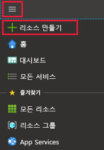
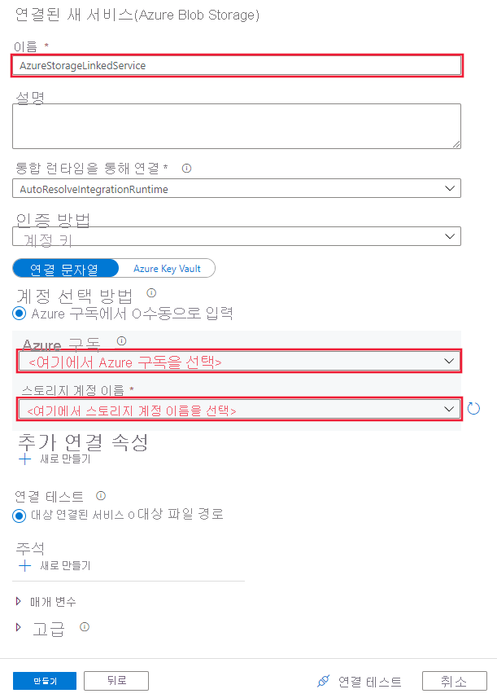
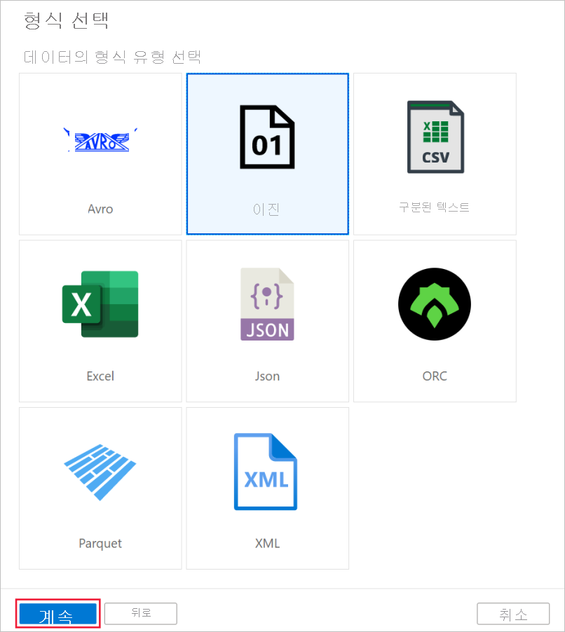
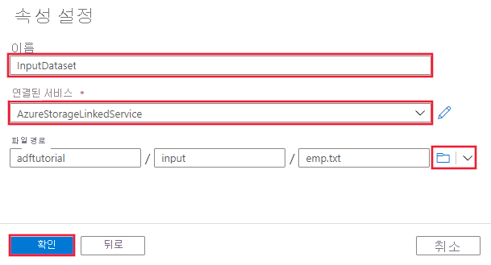
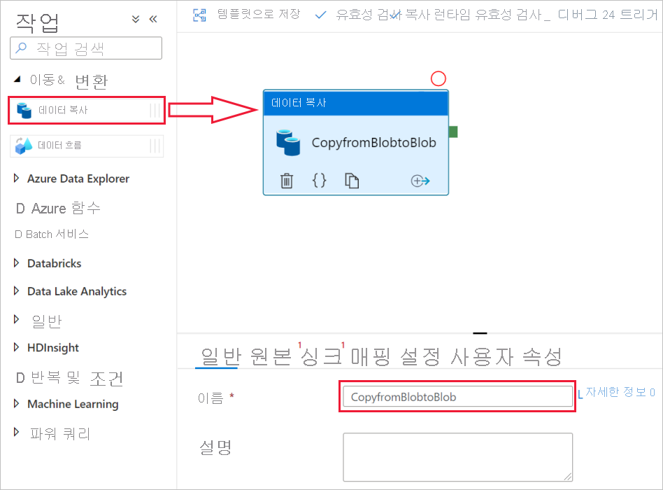
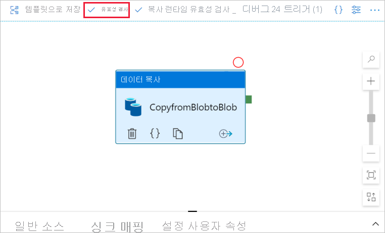
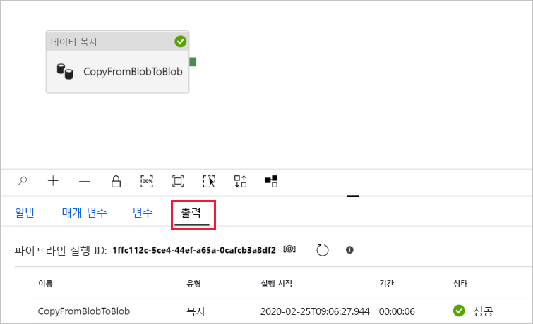
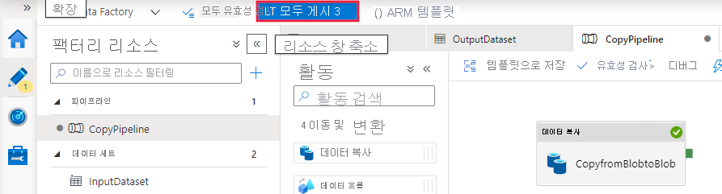

# 빠른 시작: Azure Data Factory UI를 사용하여 데이터 팩터리 만들기

> [!div class="op_single_selector" title1="사용 중인 Data Factory 서비스 버전을 선택합니다."]
> * [버전 1](v1/data-factory-copy-data-from-azure-blob-storage-to-sql-database.md)
> * [현재 버전](quickstart-create-data-factory-portal.md)

[!INCLUDE[appliesto-adf-xxx-md](includes/appliesto-adf-xxx-md.md)]

이 빠른 시작에서는 Azure Data Factory UI를 사용하여 데이터 팩터리를 만들고 모니터링하는 방법에 대해 설명합니다. 이 데이터 팩터리에서 만든 파이프라인은 Azure Blob Storage의 한 폴더에서 다른 폴더로 데이터를 *복사합니다*. Azure Data Factory를 사용하여 데이터를 *변환*하려면 [매핑 데이터 흐름](concepts-data-flow-overview.md) 및 [랭글링 데이터 흐름(미리 보기)](wrangling-data-flow-overview.md)을 참조하세요.

> [!NOTE]
> Azure Data Factory를 처음 사용하는 경우 이 빠른 시작을 수행하기 전에 [Azure Data Factory 소개](introduction.md)를 참조하세요. 

[!INCLUDE [data-factory-quickstart-prerequisites](../../includes/data-factory-quickstart-prerequisites.md)] 

### 비디오 
이 비디오를 시청하면 Data Factory UI를 이해하는 데 도움이 됩니다. 
>[!VIDEO https://channel9.msdn.com/Shows/Azure-Friday/Visually-build-pipelines-for-Azure-Data-Factory-v2/Player]

## 데이터 팩터리 만들기

1. **Microsoft Edge** 또는 **Google Chrome** 웹 브라우저를 시작합니다. 현재 Data Factory UI는 Microsoft Edge 및 Google Chrome 웹 브라우저에서만 지원됩니다.
1. [Azure 포털](https://portal.azure.com)로 이동합니다. 
1. Azure Portal 메뉴에서 **리소스 만들기**를 선택합니다.
   
   
1. **Analytics**를 선택한 다음, **Data Factory**를 선택합니다. 
   
   
1. **새 데이터 팩터리** 페이지에서 **이름**에 대해 **ADFTutorialDataFactory**를 입력합니다. 
 
   Azure Data Factory의 이름은 *전역적으로 고유*해야 합니다. 다음 오류가 표시되는 경우 데이터 팩터리 이름을 변경하고(예: **&lt;yourname&gt;ADFTutorialDataFactory**) 다시 만듭니다. 데이터 팩터리 아티팩트에 대한 명명 규칙은 [데이터 팩터리 - 명명 규칙](naming-rules.md) 문서를 참조하세요.
  
   
1. **구독**에 대해 데이터 팩터리를 만들려는 위치에 Azure 구독을 선택합니다. 
1. **리소스 그룹**에 대해 다음 단계 중 하나를 사용합니다.
     
   - **기존 항목 사용**을 선택하고 목록에서 기존 리소스 그룹을 선택합니다. 
   - **새로 만들기**를 선택하고 리소스 그룹의 이름을 입력합니다.   
         
   리소스 그룹에 대한 자세한 내용은 [리소스 그룹을 사용하여 Azure 리소스 관리](../azure-resource-manager/management/overview.md)를 참조하세요.  
1. **버전**에서 **V2**를 선택합니다.
1. **위치**에 데이터 팩터리의 위치를 선택합니다.

   이 목록은 데이터 팩터리가 지원하는 위치 및 Azure Data Factory 메타데이터가 저장될 위치만 표시합니다. Data Factory에서 사용하는 연결된 데이터 저장소(Azure Storage 및 Azure SQL Database 등) 및 컴퓨팅(Azure HDInsight 등)은 다른 하위 지역에서 실행할 수 있습니다.

1. **만들기**를 선택합니다. 만들기가 완료되면 **리소스로 이동**을 선택하여 **Data Factory** 페이지로 이동합니다. 

1. **작성 및 모니터링** 타일을 선택하여 별도의 탭에서 Azure Data Factory UI(사용자 인터페이스) 애플리케이션을 시작합니다.
   
   
   
   > [!NOTE]
   > 웹 브라우저가 "권한 부여"에서 중단되는 것이 확인되면 **타사 쿠키 및 사이트 데이터 차단** 확인란의 선택을 취소합니다. 또는 이를 선택된 상태로 두고 **login.microsoftonline.com**에 대한 예외를 만든 다음, 앱을 다시 엽니다.
   
1. **시작하기** 페이지에서 왼쪽 패널의 **작성자** 탭으로 전환합니다. 

    

## 연결된 서비스 만들기
이 절차에서는 Azure Storage 계정을 데이터 팩터리에 연결하기 위한 연결된 서비스를 만듭니다. 연결된 서비스에는 Data Factory 서비스가 런타임에 연결하는 데 사용하는 연결 정보가 있습니다.

1. **연결**을 선택한 다음, 도구 모음에서 **새로 만들기** 단추를 선택합니다(**연결** 단추는 **팩터리 리소스** 아래의 왼쪽 열 하단에 있음). 

1. **새 연결된 서비스** 페이지에서 **Azure Blob Storage**를 선택한 다음 **계속**을 선택합니다. 

1. 새로 연결된 서비스(Azure Blob Storage) 페이지에서 다음 단계를 수행합니다. 

   a. **이름**에 대해 **AzureStorageLinkedService**를 입력합니다.

   b. **스토리지 계정 이름**에 대해 Azure Storage 계정의 이름을 선택합니다.

   다. **연결 테스트**를 선택하여 데이터 팩터리 서비스에서 스토리지 계정에 연결할 수 있는지 확인합니다. 

   d. **만들기**를 선택하여 연결된 서비스를 저장합니다. 

      

## 데이터 세트 만들기
이 프로시저에서는 두 개의 데이터 세트를 만듭니다. **InputDataset** 및 **OutputDataset** 이러한 데이터 세트는 **AzureBlob** 유형입니다. 이 데이터 집합은 이전 섹션에서 만든 Azure Storage 연결된 서비스를 참조합니다. 

입력 데이터 세트는 입력 폴더의 원본 데이터를 나타냅니다. 입력 데이터 세트 정의에서 원본 데이터가 포함된 Blob 컨테이너(**adftutorial**), 폴더(**input**) 및 파일(**emp.txt**)을 지정합니다. 

출력 데이터 세트는 대상에 복사되는 데이터를 나타냅니다. 출력 데이터 세트 정의에서 Blob 컨테이너(**adftutorial**), 폴더(**output**) 및 데이터가 복사될 파일을 지정합니다. 파이프라인의 각 실행에는 연결된 고유 ID가 있습니다. 시스템 변수 **RunId**를 사용하여 이 ID에 액세스할 수 있습니다. 출력 파일의 이름은 파이프라인의 실행 ID에 따라 동적으로 평가됩니다.   

연결된 서비스 설정에서 원본 데이터가 포함된 Azure Storage 계정을 지정했습니다. 원본 데이터 세트 설정에서 원본 데이터가 있는 정확한 위치(Blob 컨테이너, 폴더 및 파일)를 지정합니다. 싱크 데이터 세트 설정에서 데이터가 복사될 위치(Blob 컨테이너, 폴더 및 파일)를 지정합니다. 
 
1. **+** (더하기) 단추를 선택한 다음, **데이터 세트**를 선택합니다.

   
1. **새 데이터 세트** 페이지에서 **Azure Blob Storage**를 선택한 다음, **계속**을 선택합니다. 

1. **형식 선택** 페이지에서 데이터의 형식 유형을 선택한 다음, **계속**을 선택합니다. 이 경우 콘텐츠를 구문 분석하지 않고 파일을 있는 그대로 복사할 때 **Binary**를 선택합니다.

   
   
1. **속성 설정** 페이지에서 다음 단계를 완료합니다.

    a. **이름** 아래에서 **InputDataset**을 입력합니다. 

    b. **연결된 서비스**에 대해 **AzureStorageLinkedService**를 선택합니다.

    다. **파일 경로**에 대해 **찾아보기** 단추를 선택합니다.

    d. **파일 또는 폴더 선택** 창에서 **adftutorial** 컨테이너의 **input** 폴더로 이동하여 **emp.txt** 파일을 선택한 다음, **확인**을 선택합니다.
    
    e. **확인**을 선택합니다.   

    
1. 단계를 반복하여 출력 데이터 세트를 만듭니다.  

    a. **+** (더하기) 단추를 선택한 다음, **데이터 세트**를 선택합니다.

    b. **새 데이터 세트** 페이지에서 **Azure Blob Storage**를 선택한 다음, **계속**을 선택합니다.

    다. **형식 선택** 페이지에서 데이터의 형식 유형을 선택한 다음, **계속**을 선택합니다.

    d. **속성 설정** 페이지에서 이름에 사용할 **OutputDataset**을 지정합니다. 연결된 서비스에 대해 **AzureStorageLinkedService**를 선택합니다.

    e. **파일 경로**에 **adftutorial/output**을 입력합니다. **출력** 폴더가 존재하지 않는 경우 런타임 시 복사 작업으로 생성됩니다.

    f. **확인**을 선택합니다.   

    

## 파이프라인 만들기 
이 절차에서는 입력 및 출력 데이터 세트를 사용하는 복사 활동이 있는 파이프라인을 만들고 유효성을 검사합니다. 복사 작업은 입력 데이터 세트 설정에 지정된 파일의 데이터를 출력 데이터 세트 설정에 지정된 파일로 복사합니다. 입력 데이터 세트에서 폴더(파일 이름 제외)만 지정하면 복사 활동에서 원본 폴더의 모든 파일을 대상에 복사합니다. 

1. **+** (더하기) 단추를 선택한 다음 **파이프라인**을 선택합니다. 

1. **속성** 아래의 일반 패널에서 **이름**에 **CopyPipeline**을 지정합니다. 그런 다음, 오른쪽 위 모서리에 있는 속성 아이콘을 클릭하여 패널을 축소합니다.

1. **활동** 도구 상자에서 **이동 및 변환**을 펼칩니다. **데이터 복사** 활동을 **활동** 도구 상자에서 파이프라인 디자이너 화면으로 끌어서 놓습니다. 또한 **활동** 도구 상자에서 활동을 검색할 수도 있습니다. **이름**에 대해 **CopyFromBlobToBlob**을 지정합니다.
   

1. 복사 활동 설정의 **원본** 탭으로 전환하고, **원본 데이터 세트**에 대해 **InputDataset**를 선택합니다.

1. 복사 활동 설정의 **싱크** 탭으로 전환하고, **싱크 데이터 세트**에 대해 **OutputDataset**를 선택합니다.

1. 캔버스 위에 있는 파이프라인 도구 모음에서 **유효성 검사**를 클릭하여 파이프라인 설정의 유효성을 검사합니다. 파이프라인에 대한 유효성이 성공적으로 검사되었는지 확인합니다. 유효성 검사 출력을 닫으려면 **>>** (오른쪽 화살표) 단추를 선택합니다. 
   

## 파이프라인 디버깅
이 단계에서는 Data Factory에 파이프라인을 배포하기 전에 파이프라인을 디버그합니다. 

1. 캔버스 위의 파이프라인 도구 모음에서 **디버그**를 클릭하여 테스트 실행을 트리거합니다. 
    
1. 맨 아래에 있는 파이프라인 설정의 **출력** 탭에서 파이프라인 실행 상태가 표시되는지 확인합니다. 
 
    

1. **adftutorial** 컨테이너의 **outputfolder** 폴더에 있는 출력 파일이 표시되는지 확인합니다. 출력 폴더가 없는 경우 Data Factory 서비스에서 자동으로 생성됩니다. 

## 수동으로 파이프라인 트리거
이 절차에서는 엔터티(연결된 서비스, 데이터 세트, 파이프라인)를 Azure Data Factory에 배포합니다. 그런 다음 파이프라인 실행을 수동으로 트리거합니다. 

1. 파이프라인을 트리거하기 전에 엔터티를 데이터 팩터리에 게시해야 합니다. 게시하려면 맨 위에서 **모두 게시**를 선택합니다. 
    

1. 파이프라인을 수동으로 트리거하려면 파이프라인 도구 모음에서 **트리거 추가**를 선택한 다음, **지금 트리거**를 선택합니다. **파이프라인 실행** 페이지에서 **마침**을 선택합니다.

## 파이프라인 모니터링

1. 왼쪽의 **모니터** 탭으로 전환합니다. **새로 고침** 단추를 사용하여 목록을 새로 고칩니다.

   
1. **CopyPipeline** 링크를 선택하면 이 페이지에서 복사 작업 실행의 상태가 표시됩니다. 

1. 복사 작업에 대한 세부 정보를 보려면 **세부 정보**(안경 이미지) 링크를 선택합니다. 속성에 대한 자세한 내용은 [복사 활동 개요](copy-activity-overview.md)를 참조하세요. 

   
1. **output** 폴더에 있는 새 파일이 표시되는지 확인합니다. 
1. **모든 파이프라인 실행** 링크를 선택하여 **활동 실행** 보기에서 **파이프라인 실행** 보기로 다시 전환할 수 있습니다. 

## 일정에 따라 파이프라인 트리거
이 절차는 이 자습서에서 선택 사항입니다. *스케줄러 트리거*를 만들어 파이프라인이 주기적으로(매시간, 매일 등) 실행되도록 예약할 수 있습니다. 이 절차에서는 지정한 종료 날짜 및 시간까지 매분마다 실행하는 트리거를 만듭니다. 

1. **작성자** 탭으로 전환합니다. 

1. 파이프라인으로 이동하여 파이프라인 도구 모음에서 **트리거 추가**를 선택한 다음, **새로 만들기/편집**을 선택합니다. 

1. **트리거 추가** 페이지에서 **트리거 선택**을 선택한 다음 **새로 만들기**를 선택합니다. 

1. **새 트리거** 페이지의 **종료** 아래에서 **날짜**를 선택하고, 종료 시간을 현재 시간 이후 몇 분으로 지정한 다음, **확인**을 선택합니다. 

   비용은 각 파이프라인 실행과 관련되어 있으므로 종료 시간은 시작 시간과는 별도로 분 단위로만 지정합니다. 같은 날인지 확인합니다. 그러나 게시 시간과 종료 시간 사이에 파이프라인이 실행되는 데 충분한 시간이 있는지 확인합니다. 트리거는 UI에 트리거를 저장할 때가 아니라 Data Factory에 솔루션을 게시한 후에만 적용됩니다. 

1. **새 트리거** 페이지에서 **활성화됨** 확인란을 선택한 다음, **확인**을 선택합니다. 

   
1. 경고 메시지를 검토하고 **확인**을 선택합니다.

1. **모두 게시**를 선택하여 변경 내용을 Data Factory에 게시합니다. 

1. 왼쪽의 **모니터** 탭으로 전환합니다. **새로 고침**을 선택하여 목록을 새로 고칩니다. 파이프라인이 게시 시간에서 종료 시간까지 매분 한 번씩 실행되는 것을 볼 수 있습니다. 

   **트리거 기준** 열의 값을 확인합니다. 수동 트리거 실행은 이전 단계(**지금 트리거**)에서 수행되었습니다. 

1. **트리거 실행** 보기로 전환합니다. 

1. 지정된 종료 날짜 및 시간까지의 모든 파이프라인 실행에 대한 출력 파일이 **output** 폴더에 만들어졌는지 확인합니다. 

## 다음 단계
이 샘플의 파이프라인은 Azure Blob Storage의 한 위치에서 다른 위치로 데이터를 복사합니다. 더 많은 시나리오에서의 데이터 팩터리 사용에 대해 알아보려면 [자습서](tutorial-copy-data-portal.md)를 따릅니다. 
