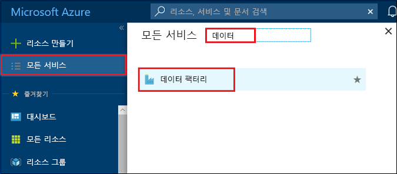
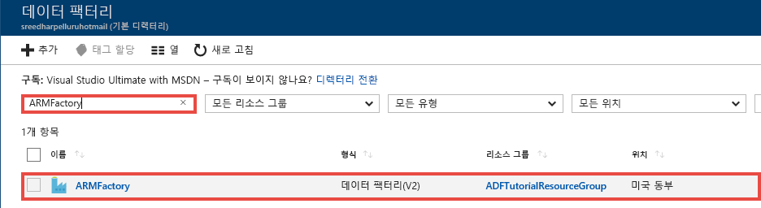
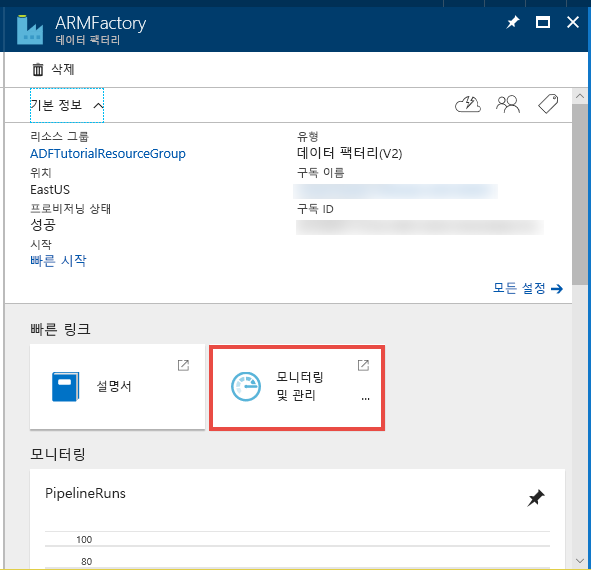
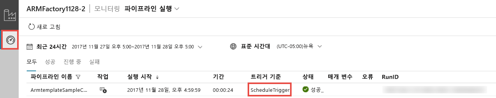
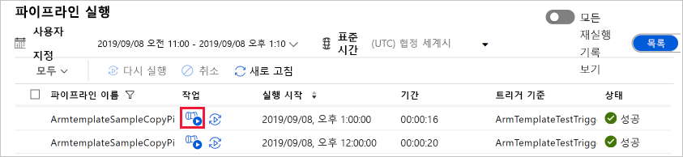
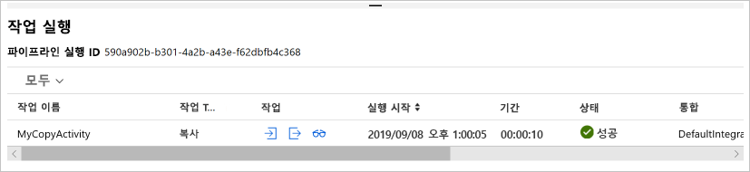

# <a name="tutorial-create-an-azure-data-factory-using-azure-resource-manager-template"></a>자습서: Azure Resource Manager 템플릿을 사용하여 Azure Data Factory 만들기
> [!div class="op_single_selector" title1="Select the version of Data Factory service you are using:"]
> * [버전 1](v1/data-factory-build-your-first-pipeline-using-arm.md)
> * [현재 버전](quickstart-create-data-factory-resource-manager-template.md) 

이 빠른 시작에서는 Azure Resource Manager 템플릿을 사용하여 Azure 데이터 팩터리를 만드는 방법을 보여 줍니다. 이 데이터 팩터리에서 만든 파이프라인은 Azure Blob Storage의 한 폴더에서 다른 폴더로 데이터를 **복사합니다**. Azure Data Factory를 사용하여 데이터를 **변환**하는 방법에 대한 자습서는 [자습서: Spark를 사용하여 데이터 변환](transform-data-using-spark.md)을 참조하세요. 

> [!NOTE]
> 이 문서는 Data Factory 서비스의 자세한 소개를 제공하지 않습니다. Azure Data Factory 서비스 소개는 [Azure Data Factory 소개](introduction.md)를 참조하세요.

[!INCLUDE [data-factory-quickstart-prerequisites](../../includes/data-factory-quickstart-prerequisites.md)] 

### <a name="azure-powershell"></a>Azure PowerShell
[Azure PowerShell을 설치 및 구성하는 방법](/powershell/azure/install-azurerm-ps)의 지침에 따라 최신 Azure PowerShell 모듈을 설치합니다.

## <a name="resource-manager-templates"></a>리소스 관리자 템플릿
Azure Resource Manager 템플릿에 대한 일반적인 내용은 [Azure Resource Manager 템플릿 작성](../azure-resource-manager/resource-group-authoring-templates.md)을 참조하세요. 

다음 섹션에서는 신속하게 자습서를 살펴보고 템플릿을 테스트할 수 있도록 데이터 팩터리 엔터티를 정의하기 위한 완전한 Resource Manager 템플릿을 제공합니다. 각 데이터 팩터리 엔터티를 정의하는 방법을 알아보려면 [템플릿의 데이터 팩터리 엔터티](#data-factory-entities-in-the-template) 섹션을 참조하세요.

템플릿에서 Data Factory 리소스의 JSON 구문 및 속성에 대해 알아보려면 [Microsoft.DataFactory 리소스 종류](/azure/templates/microsoft.datafactory/allversions)를 참조하세요.

## <a name="data-factory-json"></a>Data Factory JSON 
**C:\ADFTutorial** 폴더에 다음과 같은 내용으로 **ADFTutorialARM.json**이라는 JSON 파일을 만듭니다.

```json
{
    "contentVersion": "1.0.0.0",
    "$schema": "http://schema.management.azure.com/schemas/2015-01-01/deploymentTemplate.json#",
    "parameters": {
        "dataFactoryName": {
            "type": "string",
            "metadata": {
                "description": "Name of the data factory. Must be globally unique."
            }
        },
        "dataFactoryLocation": {
            "type": "string",
            "allowedValues": [
                "East US",
                "East US 2",
                "West Europe"
            ],
            "defaultValue": "East US",
            "metadata": {
                "description": "Location of the data factory. Currently, only East US, East US 2, and West Europe are supported. "
            }
        },
        "storageAccountName": {
            "type": "string",
            "metadata": {
                "description": "Name of the Azure storage account that contains the input/output data."
            }
        },
        "storageAccountKey": {
            "type": "securestring",
            "metadata": {
                "description": "Key for the Azure storage account."
            }
        },
        "blobContainer": {
            "type": "string",
            "metadata": {
                "description": "Name of the blob container in the Azure Storage account."
            }
        },
        "inputBlobFolder": {
            "type": "string",
            "metadata": {
                "description": "The folder in the blob container that has the input file."
            }
        },
        "inputBlobName": {
            "type": "string",
            "metadata": {
                "description": "Name of the input file/blob."
            }
        },
        "outputBlobFolder": {
            "type": "string",
            "metadata": {
                "description": "The folder in the blob container that will hold the transformed data."
            }
        },
        "outputBlobName": {
            "type": "string",
            "metadata": {
                "description": "Name of the output file/blob."
            }
        },
        "triggerStartTime": {
            "type": "string",
            "metadata": {
                "description": "Start time for the trigger."
            }
        },
        "triggerEndTime": {
            "type": "string",
            "metadata": {
                "description": "End time for the trigger."
            }
        }
    },
    "variables": {
        "azureStorageLinkedServiceName": "ArmtemplateStorageLinkedService",
        "inputDatasetName": "ArmtemplateTestDatasetIn",
        "outputDatasetName": "ArmtemplateTestDatasetOut",
        "pipelineName": "ArmtemplateSampleCopyPipeline",
        "triggerName": "ArmTemplateTestTrigger"
    },
    "resources": [{
        "name": "[parameters('dataFactoryName')]",
        "apiVersion": "2017-09-01-preview",
        "type": "Microsoft.DataFactory/factories",
        "location": "[parameters('dataFactoryLocation')]",
        "identity": {
            "type": "SystemAssigned"
        },
        "resources": [{
                "type": "linkedservices",
                "name": "[variables('azureStorageLinkedServiceName')]",
                "dependsOn": [
                    "[parameters('dataFactoryName')]"
                ],
                "apiVersion": "2017-09-01-preview",
                "properties": {
                    "type": "AzureStorage",
                    "description": "Azure Storage linked service",
                    "typeProperties": {
                        "connectionString": {
                            "value": "[concat('DefaultEndpointsProtocol=https;AccountName=',parameters('storageAccountName'),';AccountKey=',parameters('storageAccountKey'))]",
                            "type": "SecureString"
                        }
                    }
                }
            },
            {
                "type": "datasets",
                "name": "[variables('inputDatasetName')]",
                "dependsOn": [
                    "[parameters('dataFactoryName')]",
                    "[variables('azureStorageLinkedServiceName')]"
                ],
                "apiVersion": "2017-09-01-preview",
                "properties": {
                    "type": "AzureBlob",
                    "typeProperties": {
                        "folderPath": "[concat(parameters('blobContainer'), '/', parameters('inputBlobFolder'), '/')]",
                        "fileName": "[parameters('inputBlobName')]"
                    },
                    "linkedServiceName": {
                        "referenceName": "[variables('azureStorageLinkedServiceName')]",
                        "type": "LinkedServiceReference"
                    }
                }
            },
            {
                "type": "datasets",
                "name": "[variables('outputDatasetName')]",
                "dependsOn": [
                    "[parameters('dataFactoryName')]",
                    "[variables('azureStorageLinkedServiceName')]"
                ],
                "apiVersion": "2017-09-01-preview",
                "properties": {
                    "type": "AzureBlob",
                    "typeProperties": {
                        "folderPath": "[concat(parameters('blobContainer'), '/', parameters('outputBlobFolder'), '/')]",
                        "fileName": "[parameters('outputBlobName')]"
                    },
                    "linkedServiceName": {
                        "referenceName": "[variables('azureStorageLinkedServiceName')]",
                        "type": "LinkedServiceReference"
                    }
                }
            },
            {
                "type": "pipelines",
                "name": "[variables('pipelineName')]",
                "dependsOn": [
                    "[parameters('dataFactoryName')]",
                    "[variables('azureStorageLinkedServiceName')]",
                    "[variables('inputDatasetName')]",
                    "[variables('outputDatasetName')]"
                ],
                "apiVersion": "2017-09-01-preview",
                "properties": {
                    "activities": [{
                        "type": "Copy",
                        "typeProperties": {
                            "source": {
                                "type": "BlobSource"
                            },
                            "sink": {
                                "type": "BlobSink"
                            }
                        },
                        "name": "MyCopyActivity",
                        "inputs": [{
                            "referenceName": "[variables('inputDatasetName')]",
                            "type": "DatasetReference"
                        }],
                        "outputs": [{
                            "referenceName": "[variables('outputDatasetName')]",
                            "type": "DatasetReference"
                        }]
                    }]
                }
            },
            {
                "type": "triggers",
                "name": "[variables('triggerName')]",
                "dependsOn": [
                    "[parameters('dataFactoryName')]",
                    "[variables('azureStorageLinkedServiceName')]",
                    "[variables('inputDatasetName')]",
                    "[variables('outputDatasetName')]",
                    "[variables('pipelineName')]"
                ],
                "apiVersion": "2017-09-01-preview",
                "properties": {
                    "type": "ScheduleTrigger",
                    "typeProperties": {
                        "recurrence": {
                            "frequency": "Hour",
                            "interval": 1,
                            "startTime": "[parameters('triggerStartTime')]",
                            "endTime": "[parameters('triggerEndTime')]",
                            "timeZone": "UTC"
                        }
                    },
                    "pipelines": [{
                        "pipelineReference": {
                            "type": "PipelineReference",
                            "referenceName": "ArmtemplateSampleCopyPipeline"
                        },
                        "parameters": {}
                    }]
                }
            }
        ]
    }]
}
```

## <a name="parameters-json"></a>매개 변수 JSON
Azure Resource Manager 템플릿에 대한 매개 변수를 포함하는 **ADFTutorialARM-Parameters.json**이라는 JSON 파일을 만듭니다.  

> [!IMPORTANT]
> - 이 매개 변수 파일의 **storageAccountName** 및 **storageAccountKey** 매개 변수에 대한 Azure Storage 계정 이름과 키를 지정합니다. adftutorial 컨테이너를 만들고 이 Azure BLOB 저장소의 입력에 샘플 파일(emp.txt)을 업로드했습니다. 
> - **dataFactoryName** 매개 변수에 대한 데이터 팩터리의 전역적으로 고유한 이름을 지정합니다. 예:  ARMTutorialFactoryJohnDoe11282017. 
> - **triggerStartTime**에는 현재 요일을 `2017-11-28T00:00:00` 형식으로 지정합니다.
> - **triggerEndTime**에는 다음 요일을 `2017-11-29T00:00:00` 형식으로 지정합니다. 또한 현재 UTC 시간을 확인하고 종료 시간으로 그 다음 한두 시간을 지정할 수 있습니다. 예를 들어 UTC 시간이 오전 1시 32분이면 종료 시간으로 `2017-11-29:03:00:00`를 지정합니다. 이 예에서는 트리거가 파이프라인을 두 번 실행합니다(오전 2시와 오전 3시).

```json
{
  "$schema": "https://schema.management.azure.com/schemas/2015-01-01/deploymentParameters.json#",
  "contentVersion": "1.0.0.0",
  "parameters": {
    "dataFactoryName": {
      "value": "<datafactoryname>"
    },    
    "dataFactoryLocation": {
      "value": "East US"
    },
    "storageAccountName": {
      "value": "<yourstroageaccountname>"
    },
    "storageAccountKey": {
      "value": "<yourstorageaccountkey>"
    },
    "blobContainer": {
      "value": "adftutorial"
    },
    "inputBlobFolder": {
      "value": "input"
    },
    "inputBlobName": {
      "value": "emp.txt"
    },
    "outputBlobFolder": {
      "value": "output"
    },
    "outputBlobName": {
      "value": "emp.txt"
    },
    "triggerStartTime": {
        "value": "2017-11-28T00:00:00. Set to today"
    },
    "triggerEndTime": {
        "value": "2017-11-29T00:00:00. Set to tomorrow"
    }
  }
}
```

> [!IMPORTANT]
> 개발, 테스트 및 프로덕션 환경에 별도의 매개 변수 JSON 파일을 두고 동일한 데이터 팩터리 JSON 템플릿을 사용할 수 있습니다. Power Shell 스크립트를 사용하여 이러한 환경에서 데이터 팩터리 엔터티 배포를 자동화할 수 있습니다. 

## <a name="deploy-data-factory-entities"></a>Data Factory 엔터티 배포 
Data Factory 엔터티를 배포하려면 이 빠른 시작의 앞부분에서 만든 Resource Manager 템플릿을 사용하여 PowerShell에서 다음 명령을 실행합니다. 

```PowerShell
New-AzureRmResourceGroupDeployment -Name MyARMDeployment -ResourceGroupName ADFTutorialResourceGroup -TemplateFile C:\ADFTutorial\ADFTutorialARM.json -TemplateParameterFile C:\ADFTutorial\ADFTutorialARM-Parameters.json
```

다음 샘플과 비슷한 출력이 표시됩니다. 

```
DeploymentName          : MyARMDeployment
ResourceGroupName       : ADFTutorialResourceGroup
ProvisioningState       : Succeeded
Timestamp               : 11/29/2017 3:11:13 AM
Mode                    : Incremental
TemplateLink            :
Parameters              :
                          Name                 Type            Value
                          ===============      ============    ==========
                          dataFactoryName      String          <data factory name>
                          dataFactoryLocation  String          East US
                          storageAccountName   String          <storage account name>
                          storageAccountKey    SecureString
                          blobContainer        String          adftutorial
                          inputBlobFolder      String          input
                          inputBlobName        String          emp.txt
                          outputBlobFolder     String          output
                          outputBlobName       String          emp.txt
                          triggerStartTime     String          11/29/2017 12:00:00 AM
                          triggerEndTime       String          11/29/2017 4:00:00 AM

Outputs                 :
DeploymentDebugLogLevel :
```

## <a name="start-the-trigger"></a>트리거 시작

템플릿은 다음 Data Factory 엔터티를 배포합니다. 

- Azure Storage 연결된 서비스
- Azure Blob 데이터 세트(입력 및 출력)
- 복사 작업이 포함된 파이프라인
- 파이프라인을 트리거하는 트리거

배포된 트리거는 중지된 상태입니다. 트리거를 시작하는 방법 중 하나는 **Start-AzureRmDataFactoryV2Trigger** PowerShell cmdlet을 사용하는 것입니다. 다음 절차에서는 자세한 단계를 설명합니다. 

1. PowerShell 창에서 리소스 그룹의 이름을 저장할 변수를 만듭니다. 다음 명령을 PowerShell 창에 복사하고 ENTER 키를 누릅니다. New-AzureRmResourceGroupDeployment 명령에 다른 리소스 그룹 이름을 지정한 경우 여기서 값을 업데이트합니다. 

    ```powershell
    $resourceGroupName = "ADFTutorialResourceGroup"
    ``` 
1. 데이터 팩터리의 이름을 저장할 변수를 만듭니다. ADFTutorialARM Parameters.json 파일에 지정한 것과 동일한 이름을 지정합니다.   

    ```powershell
    $dataFactoryName = "<yourdatafactoryname>"
    ```
3. 트리거의 이름에 대한 변수를 설정합니다. 트리거 이름은 Resource Manager 템플릿 파일(ADFTutorialARM.json)에서 하드 코딩됩니다.

    ```powershell
    $triggerName = "ArmTemplateTestTrigger"
    ```
4. 데이터 팩터리 및 트리거 이름을 지정한 후 다음 PowerShell 명령을 실행하여 **트리거 상태**를 가져옵니다.

    ```powershell
    Get-AzureRmDataFactoryV2Trigger -ResourceGroupName $resourceGroupName -DataFactoryName $dataFactoryName -Name $triggerName
    ```

    샘플 출력은 다음과 같습니다. 

    ```json
    TriggerName       : ArmTemplateTestTrigger
    ResourceGroupName : ADFTutorialResourceGroup
    DataFactoryName   : ARMFactory1128
    Properties        : Microsoft.Azure.Management.DataFactory.Models.ScheduleTrigger
    RuntimeState      : Stopped
    ```
    
    트리거의 런타임 상태가 **Stopped**입니다. 
5. **트리거를 시작합니다**. 트리거는 템플릿에 정의된 파이프라인을 정각에 실행합니다. 즉, 이 명령을 오후 2시 25분에 실행하면 트리거는 오후 3시에 처음으로 파이프라인을 실행합니다. 그 후 트리거에 지정된 종료 시간까지 1시간마다 파이프라인을 실행합니다. 

    ```powershell
    Start-AzureRmDataFactoryV2Trigger -ResourceGroupName $resourceGroupName -DataFactoryName $dataFactoryName -TriggerName $triggerName
    ```
    
    샘플 출력은 다음과 같습니다. 
    
    ```
    Confirm
    Are you sure you want to start trigger 'ArmTemplateTestTrigger' in data factory 'ARMFactory1128'?
    [Y] Yes  [N] No  [S] Suspend  [?] Help (default is "Y"): y
    True
    ```
6. Get-AzureRmDataFactoryV2Trigger 명령을 다시 실행하여 트리거가 시작되었는지 확인합니다.  

    ```powershell
    Get-AzureRmDataFactoryV2Trigger -ResourceGroupName $resourceGroupName -DataFactoryName $dataFactoryName -TriggerName $triggerName
    ```
    
    샘플 출력은 다음과 같습니다.
    
    ```
    TriggerName       : ArmTemplateTestTrigger
    ResourceGroupName : ADFTutorialResourceGroup
    DataFactoryName   : ARMFactory1128
    Properties        : Microsoft.Azure.Management.DataFactory.Models.ScheduleTrigger
    RuntimeState      : Started
    ```

## <a name="monitor-the-pipeline"></a>파이프라인 모니터링
1. [Azure Portal](https://portal.azure.com/)에 로그인한 후 **모든 서비스**를 클릭하고, **데이터 팩**과 같은 키워드를 사용하여 검색하고, **데이터 팩터리**를 선택합니다.

    
2. **데이터 팩터리** 페이지에서 이전에 만든 데이터 팩터리를 클릭합니다. 필요한 경우 해당 데이터 팩터리의 이름으로 목록을 필터링합니다.  

    
3. 데이터 팩터리 페이지에서 **모니터링 및 관리** 타일을 클릭합니다. 

    
4. 웹 브라우저에서 **데이터 통합 애플리케이션**을 별도의 탭에 열어야 합니다. 모니터 탭이 활성 상태가 아니면 **모니터링 탭**으로 전환합니다. **스케줄러 트리거**에 의해 파이프라인 실행이 트리거되었습니다. 

        

    > [!IMPORTANT]
    > 파이프라인이 정각(예: 오전 4시, 오전 5시, 오전 6시 등)에만 실행되는 것을 볼 수 있습니다. 그 다음 정각이 되면 도구 모음에서 **새로 고침**을 클릭하여 목록을 새로 고칩니다. 
5. **작업** 열의 링크를 클릭합니다. 

    
6. 파이프라인 실행과 연결된 작업 실행이 표시됩니다. 이 빠른 시작의 파이프라인에는 복사 유형의 작업 하나밖에 없습니다. 따라서 이 작업에 대한 실행이 표시됩니다. 

    
1. **출력** 열 아래의 링크를 클릭합니다. **출력** 창에 복사 작업의 출력이 표시됩니다. 최대화 단추를 클릭하면 전체 출력이 표시됩니다. 최대화된 출력 창을 닫을 수 있습니다. 

    
7. 트리거 성공/실패를 확인했으면 트리거를 중지합니다. 트리거는 1시간에 한 번씩 파이프라인을 실행합니다. 파이프라인은 출력 폴더의 동일한 파일을 각 실행의 출력 폴더로 복사합니다. 트리거를 중지하려면 PowerShell 창에서 다음 명령을 실행합니다. 
    
    ```powershell
    Stop-AzureRmDataFactoryV2Trigger -ResourceGroupName $resourceGroupName -DataFactoryName $dataFactoryName -Name $triggerName
    ```

[!INCLUDE [data-factory-quickstart-verify-output-cleanup.md](../../includes/data-factory-quickstart-verify-output-cleanup.md)] 

## <a name="data-factory-entities-in-the-template"></a> 엔터티에 대한 JSON 정의
다음 데이터 팩터리 엔터티는 JSON 템플릿에 정의됩니다. 

- [Azure Storage 연결된 서비스](#azure-storage-linked-service)
- [Azure Blob 입력 데이터 세트](#azure-blob-input-dataset)
- [Azure Blob 출력 데이터 세트](#azure-blob-output-dataset)
- [복사 작업을 포함하는 데이터 파이프라인](#data-pipeline)
- [트리거](#trigger)

#### <a name="azure-storage-linked-service"></a>Azure Storage 연결된 서비스
AzureStorageLinkedService는 Azure 스토리지 계정을 데이터 팩터리에 연결합니다. 필수 구성 요소의 일부로 컨테이너를 만들고 이 저장소 계정에 데이터를 업로드했습니다. 이 섹션의 Azure 저장소 계정 이름 및 키를 지정합니다. Azure Storage 연결된 서비스를 정의하는 데 사용되는 JSON 속성에 대한 자세한 내용은 [Azure Storage 연결된 서비스](connector-azure-blob-storage.md#linked-service-properties)를 참조하세요. 

```json
{
    "type": "linkedservices",
    "name": "[variables('azureStorageLinkedServiceName')]",
    "dependsOn": [
        "[parameters('dataFactoryName')]"
    ],
    "apiVersion": "2017-09-01-preview",
    "properties": {
        "type": "AzureStorage",
        "description": "Azure Storage linked service",
        "typeProperties": {
            "connectionString": {
                "value": "[concat('DefaultEndpointsProtocol=https;AccountName=',parameters('storageAccountName'),';AccountKey=',parameters('storageAccountKey'))]",
                "type": "SecureString"
            }
        }
    }
}
```

connectionString은 storageAccountName 및 storageAccountKey 매개 변수를 사용합니다. 이러한 매개 변수의 값은 구성 파일을 사용하여 전달됩니다. 정의 또한 템플릿에 정의된 azureStroageLinkedService 및 dataFactoryName 변수를 사용합니다. 

#### <a name="azure-blob-input-dataset"></a>Azure Blob 입력 데이터 세트
Azure 저장소 연결된 서비스는 런타임에 Data Factory 서비스에서 Azure 저장소 계정에 연결하는 데 사용하는 연결 문자열을 지정합니다. Azure Blob 데이터 세트 정의에서 입력 데이터를 포함하는 Blob 컨테이너, 폴더 및 파일의 이름을 지정합니다. Azure Blob 데이터 세트를 정의하는 데 사용되는 JSON 속성에 대한 자세한 내용은 [Azure Blob 데이터 세트 속성](connector-azure-blob-storage.md#dataset-properties)을 참조하세요. 

```json
{
    "type": "datasets",
    "name": "[variables('inputDatasetName')]",
    "dependsOn": [
    "[parameters('dataFactoryName')]",
    "[variables('azureStorageLinkedServiceName')]"
    ],
    "apiVersion": "2017-09-01-preview",
    "properties": {
    "type": "AzureBlob",
    "typeProperties": {
        "folderPath": "[concat(parameters('blobContainer'), '/', parameters('inputBlobFolder'), '/')]",
        "fileName": "[parameters('inputBlobName')]"
    },
    "linkedServiceName": {
        "referenceName": "[variables('azureStorageLinkedServiceName')]",
        "type": "LinkedServiceReference"
    }
    }
},

```

#### <a name="azure-blob-output-dataset"></a>Azure Blob 출력 데이터 세트
입력 폴더에서 복사한 데이터를 저장하는 Azure Blob Storage의 폴더 이름을 지정합니다. Azure Blob 데이터 세트를 정의하는 데 사용되는 JSON 속성에 대한 자세한 내용은 [Azure Blob 데이터 세트 속성](connector-azure-blob-storage.md#dataset-properties)을 참조하세요. 

```json
{
    "type": "datasets",
    "name": "[variables('outputDatasetName')]",
    "dependsOn": [
    "[parameters('dataFactoryName')]",
    "[variables('azureStorageLinkedServiceName')]"
    ],
    "apiVersion": "2017-09-01-preview",
    "properties": {
    "type": "AzureBlob",
    "typeProperties": {
        "folderPath": "[concat(parameters('blobContainer'), '/', parameters('outputBlobFolder'), '/')]",
        "fileName": "[parameters('outputBlobName')]"
    },
    "linkedServiceName": {
        "referenceName": "[variables('azureStorageLinkedServiceName')]",
        "type": "LinkedServiceReference"
    }
    }
}
```

#### <a name="data-pipeline"></a>데이터 파이프라인
한 Azure BLOB 데이터 세트에서 다른 Azure BLOB 데이터 세트로 데이터를 복사하는 파이프라인을 정의합니다. 이 예에서 파이프라인을 정의하는 데 사용된 JSON 요소에 대한 자세한 설명은 [파이프라인 JSON](concepts-pipelines-activities.md#pipeline-json)을 참조하세요. 

```json
{
    "type": "pipelines",
    "name": "[variables('pipelineName')]",
    "dependsOn": [
    "[parameters('dataFactoryName')]",
    "[variables('azureStorageLinkedServiceName')]",
    "[variables('inputDatasetName')]",
    "[variables('outputDatasetName')]"
    ],
    "apiVersion": "2017-09-01-preview",
    "properties": {
    "activities": [
        {
        "type": "Copy",
        "typeProperties": {
            "source": {
            "type": "BlobSource"
            },
            "sink": {
            "type": "BlobSink"
            }
        },
        "name": "MyCopyActivity",
        "inputs": [
            {
            "referenceName": "[variables('inputDatasetName')]",
            "type": "DatasetReference"
            }
        ],
        "outputs": [
            {
            "referenceName": "[variables('outputDatasetName')]",
            "type": "DatasetReference"
            }
        ]
        }
    ]
    }
}
```

#### <a name="trigger"></a>트리거
파이프라인을 한 시간에 한 번 실행하는 트리거를 정의합니다. 배포된 트리거는 중지된 상태입니다. **Start-AzureRmDataFactoryV2Trigger** cmdlet을 사용하여 트리거를 시작합니다. 트리거에 대한 자세한 내용은 [파이프라인 실행 및 트리거](concepts-pipeline-execution-triggers.md#triggers) 문서를 참조하세요. 

```json
{
    "type": "triggers",
    "name": "[variables('triggerName')]",
    "dependsOn": [
        "[parameters('dataFactoryName')]",
        "[variables('azureStorageLinkedServiceName')]",
        "[variables('inputDatasetName')]",
        "[variables('outputDatasetName')]",
        "[variables('pipelineName')]"
    ],
    "apiVersion": "2017-09-01-preview",
    "properties": {
        "type": "ScheduleTrigger",
        "typeProperties": {
            "recurrence": {
                "frequency": "Hour",
                "interval": 1,
                "startTime": "2017-11-28T00:00:00",
                "endTime": "2017-11-29T00:00:00",
                "timeZone": "UTC"               
            }
        },
        "pipelines": [{
            "pipelineReference": {
                "type": "PipelineReference",
                "referenceName": "ArmtemplateSampleCopyPipeline"
            },
            "parameters": {}
        }]
    }
}
```

## <a name="reuse-the-template"></a>템플릿 재사용
이 자습서에서는 데이터 팩터리 엔터티를 정의하는 템플릿과 매개 변수 값을 전달하는 템플릿을 만들었습니다. 같은 템플릿을 사용하여 데이터 팩터리 엔터티를 다른 환경에 배포하는 데 사용하려면 각 환경에 대한 매개 변수 파일을 만들고 해당 환경에 배포할 때 사용합니다.     

예제:  

```PowerShell
New-AzureRmResourceGroupDeployment -Name MyARMDeployment -ResourceGroupName ADFTutorialResourceGroup -TemplateFile ADFTutorialARM.json -TemplateParameterFile ADFTutorialARM-Parameters-Dev.json

New-AzureRmResourceGroupDeployment -Name MyARMDeployment -ResourceGroupName ADFTutorialResourceGroup -TemplateFile ADFTutorialARM.json -TemplateParameterFile ADFTutorialARM-Parameters-Test.json

New-AzureRmResourceGroupDeployment -Name MyARMDeployment -ResourceGroupName ADFTutorialResourceGroup -TemplateFile ADFTutorialARM.json -TemplateParameterFile ADFTutorialARM-Parameters-Production.json
```
첫 번째 명령은 개발 환경에 대한 매개 변수 파일, 두 번째 명령은 테스트 환경에 대한 매개 변수 파일, 세 번째 명령은 프로덕션 환경에 대한 매개 변수 파일을 사용합니다.  

또한 이 템플릿을 재사용하여 반복 작업을 수행할 수 있습니다. 예를 들어 동일한 논리를 구현하지만 각 데이터 팩터리가 서로 다른 Azure 저장소 계정을 사용하는 파이프라인이 하나 이상 있는 데이터 팩터리를 여러 개 만듭니다. 이 경우 매개 변수가 서로 다른 동일한 환경(개발, 테스트 또는 프로덕션)에서 동일한 템플릿을 사용합니다. 


## <a name="next-steps"></a>다음 단계
이 샘플의 파이프라인은 Azure Blob 저장소의 한 위치에서 다른 위치로 데이터를 복사합니다. [자습서](tutorial-copy-data-dot-net.md)를 통해 더 많은 시나리오에서의 데이터 팩터리 사용에 관해 알아보세요. 
