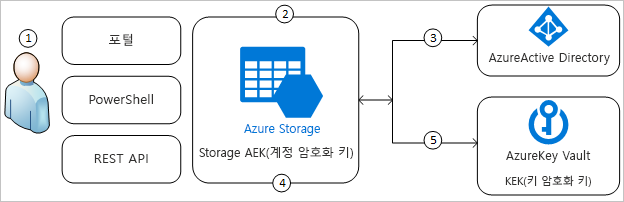
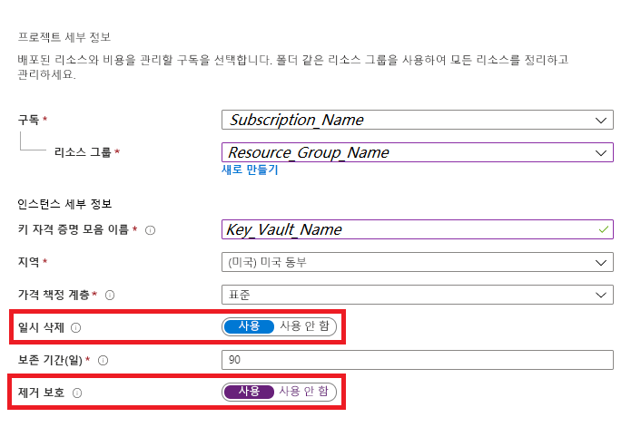
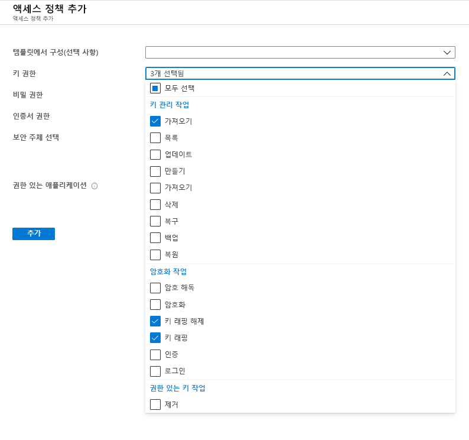
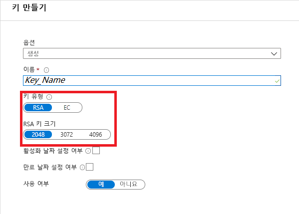
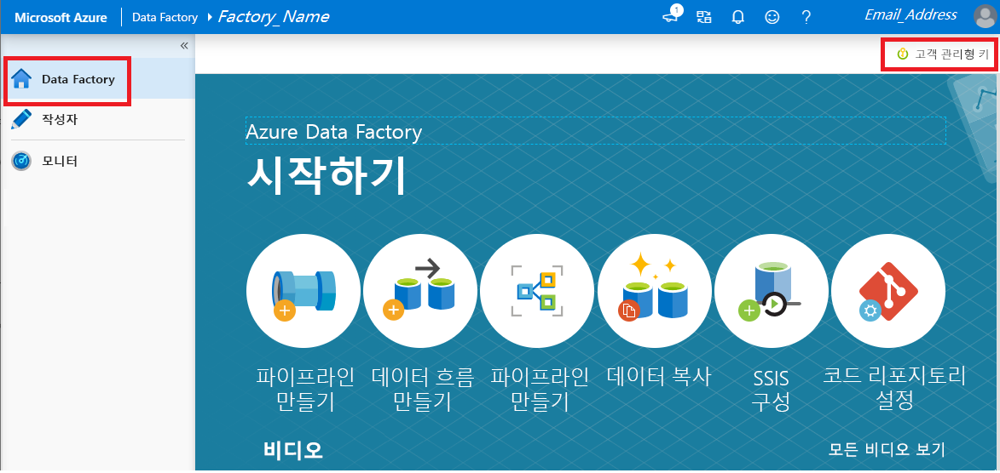

# 고객 관리형 키를 사용하여 Azure Data Factory 암호화

[!INCLUDE[appliesto-adf-xxx-md](includes/appliesto-adf-xxx-md.md)]

Azure Data Factory는 엔터티 정의, 실행 중에 캐시된 데이터, 데이터 미리 보기용으로 캐시된 데이터를 비롯한 저장 데이터를 암호화합니다. 기본적으로 데이터는 데이터 팩터리에 고유하게 할당된 임의 생성 Microsoft 관리형 키를 사용하여 암호화됩니다. 이제 Azure Data Factory에서 고객 관리형 키 기능을 사용하여 BYOK(Bring Your Own Key)를 사용하도록 설정하면 보안을 더욱 강화할 수 있습니다. 고객 관리형 키를 지정하면 Data Factory는 팩터리 시스템 키와 CMK를 __모두__ 사용하여 고객 데이터를 암호화합니다. 둘 중 하나라도 없으면 데이터 및 팩터리에 대한 액세스가 거부됩니다.

Azure Key Vault는 고객 관리형 키를 저장하는 데 필요합니다. 사용자 고유의 키를 만들어 키 자격 증명 모음에 저장할 수도 있고, Azure Key Vault API를 사용하여 키를 생성할 수도 있습니다. 키 자격 증명 모음과 Data Factory가 동일한 Azure AD(Azure Active Directory) 테넌트 및 동일한 지역에 있어야 하지만, 서로 다른 구독에 있는 것은 괜찮습니다. Azure Key Vault에 대한 자세한 내용은 [Azure Key Vault란?](../key-vault/general/overview.md)

> [!NOTE]
> 고객 관리형 키는 빈 데이터 팩터리에서만 구성할 수 있습니다. 데이터 팩터리는 연결된 서비스, 파이프라인, 데이터 흐름 같은 리소스를 포함할 수 없습니다. 팩터리를 만든 직후 고객 관리형 키를 사용하도록 설정하는 것이 좋습니다.

## 고객 관리형 키 정보

다음 다이어그램은 Data Factory가 고객 관리형 키를 사용하여 요청하기 위해 Azure Active Directory 및 Azure Key Vault를 사용하는 방법을 보여줍니다.

  

다음은 다이어그램의 번호가 매겨진 단계에 대해 설명하는 목록입니다.

1. Azure Key Vault 관리자는 Data Factory와 연결된 관리 ID에 암호화 키에 대한 권한 부여
1. Data Factory 관리자는 팩터리에서 고객 관리형 키 기능을 사용하도록 설정
1. Data Factory는 팩터리와 연결된 관리 ID를 사용하여 Azure Active Directory를 통해 Azure Key Vault에 대한 액세스를 인증
1. Data Factory는 팩터리 암호화 키를 Azure Key Vault의 고객 키로 래핑
1. 읽기/쓰기 작업의 경우 Data Factory는 계정 암호화 키를 래핑 해제하라는 요청을 Azure Key Vault에 보내서 암호화 및 암호 해독 작업을 수행

## 필수 조건 - Azure Key Vault를 구성하고 키 생성

### Azure Key Vault에서 일시 삭제 및 삭제 안 함을 사용하도록 설정

Data Factory에서 고객 관리형 키를 사용하려면 Key Vault에서 __일시 삭제__ 및 __삭제 안 함__ 속성을 설정해야 합니다. 두 속성은 새로운 또는 기존 키 자격 증명 모음에서 PowerShell 또는 Azure CLI를 사용하여 설정할 수 있습니다. 기존 키 자격 증명 모음에서 이러한 속성을 사용하려면 다음 문서 중 하나에서 _일시 삭제를 사용하도록 설정_ 및 _제거 보호 활성화_ 섹션을 참조하세요.

- [PowerShell에서 일시 삭제를 사용하는 방법](../key-vault/general/soft-delete-powershell.md)
- [CLI에서 일시 삭제를 사용하는 방법](../key-vault/general/soft-delete-cli.md)

Azure Portal을 통해 새 Azure Key Vault를 만드는 경우 다음과 같이 __일시 삭제__ 및 __삭제 안 함__을 사용하도록 설정할 수 있습니다.

  

### Data Factory에 Azure Key Vault에 대한 액세스 권한 부여

Azure Key Vault와 Azure Data Factory가 동일한 Azure AD(Azure Active Directory) 테넌트에 있어야 하고 또 _동일한 지역_에 있어야 합니다. Azure Key Vault 액세스 제어에서 데이터 팩터리의 MSI(관리되는 서비스 ID)에 _가져오기_, _키 래핑 해제_ 및 _키 래핑_ 권한을 부여합니다. 이러한 권한은 Data Factory에서 고객 관리형 키를 사용하도록 설정하는 데 필요합니다.

  

### 고객 관리형 키 생성 또는 Azure Key Vault에 업로드

사용자 고유의 키를 만들어 키 자격 증명 모음에 저장할 수도 있고, Azure Key Vault API를 사용하여 키를 생성할 수도 있습니다. Data Factory 암호화는 2048비트 RSA 키만 지원합니다. 자세한 내용은 [키, 암호 및 인증서 정보](../key-vault/general/about-keys-secrets-certificates.md)를 참조하세요.

  

## 고객 관리형 키 사용

1. Data Factory가 비어 있는지 확인합니다. 데이터 팩터리는 연결된 서비스, 파이프라인, 데이터 흐름 같은 리소스를 포함할 수 없습니다. 현재는 비어 있지 않은 팩터리에 고객 관리형 키를 배포하면 오류가 발생합니다.

1. Azure Portal에서 키 URI을 찾으려면 Azure Key Vault로 이동하여 키 설정을 선택합니다. 원하는 키를 선택한 다음, 키를 클릭하여 버전을 확인합니다. 설정을 보려면 키 버전을 선택합니다.

1. URI를 제공하는 키 식별자 필드의 값을 복사합니다.

    

1. Azure Data Factory 포털을 시작하고, 왼쪽의 탐색 모음을 사용하여 Data Factory 홈페이지로 이동합니다.

1. __고객 관리형 키__ 아이콘을 클릭합니다.

    

1. 앞에서 복사한 고객 관리형 키의 URI를 입력합니다.

1. __저장__을 클릭하면 Data Factory에 고객 관리형 키 암호화가 사용됩니다.

## 키 버전 업데이트

새 버전의 키를 만들 때 새 버전을 사용하도록 데이터 팩터리를 업데이트해야 합니다. 다음을 포함하여 _고객 관리형 키 사용_ 섹션에 설명된 단계와 비슷한 단계를 수행합니다.

1. Azure Key Vault 포털을 통해 새 키 버전의 URI를 찾습니다.

1. __고객 관리형 키__ 설정으로 이동합니다.

1. 새 키의 URI를 붙여넣습니다.

1. __저장__을 클릭하면 이제부터 Data Factory는 새 키 버전을 암호화에 사용합니다.

## 다른 키 사용

Data Factory 암호화에 사용되는 키를 변경하려면 Data Factory에서 수동으로 설정을 업데이트해야 합니다. 다음을 포함하여 _고객 관리형 키 사용_ 섹션에 설명된 단계와 비슷한 단계를 수행합니다.

1. Azure Key Vault 포털을 통해 새 키의 URI를 찾습니다.

1. __고객 관리형 키__ 설정으로 이동합니다.

1. 새 키의 URI를 붙여넣습니다.

1. __저장__을 클릭하면 이제부터 Data Factory는 새 키를 암호화에 사용합니다.

## 고객 관리형 키 사용 안 함

고객 관리형 키 기능을 사용하도록 설정한 후에는 추가 보안 단계를 제거할 수 없도록 설계되었습니다. 항상 고객이 제공한 키로 팩터리와 데이터를 암호화해야 합니다.

## 다음 단계

[자습서](tutorial-copy-data-dot-net.md)를 통해 더 많은 시나리오에서의 데이터 팩터리 사용에 관해 알아보세요.
