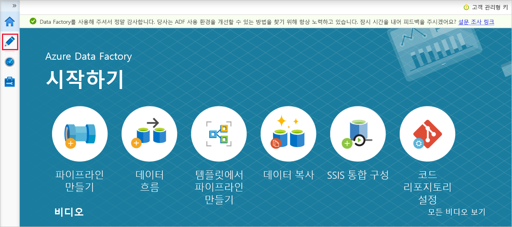
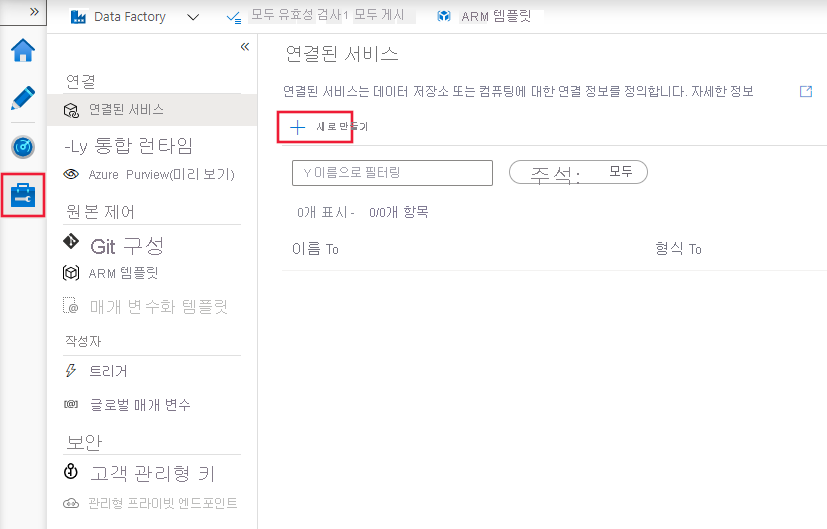

# <a name="copy-multiple-tables-in-bulk-by-using-azure-data-factory-in-the-azure-portal"></a>Azure Portal에서 Azure Data Factory를 사용하여 여러 테이블 대량 복사

[!INCLUDE[appliesto-adf-asa-md](includes/appliesto-adf-asa-md.md)]

이 자습서에서는 **Azure SQL Database에서 Azure Synapse Analytics(이전의 SQL DW)로 여러 테이블을 복사**하는 방법을 보여 줍니다. 다른 복사 시나리오에도 동일한 패턴을 적용할 수 있습니다. 예를 들어 테이블을 SQL Server/Oracle에서 Azure SQL Database/Azure Synapse Analytics(이전의 SQL DW)/Azure Blob으로 복사하고, 다른 경로를 Blob에서 Azure SQL Database 테이블로 복사합니다.

> [!NOTE]
> - Data Factory를 처음 사용하는 경우 [Azure Data Factory 소개](introduction.md)를 참조하세요.

이 자습서에서 수행하는 단계는 대략적으로 다음과 같습니다.

> [!div class="checklist"]
> * 데이터 팩터리를 만듭니다.
> * Azure SQL Database, Azure Synapse Analytics(이전의 SQL DW) 및 Azure Storage 연결된 서비스를 만듭니다.
> * Azure SQL Database 및 Azure Synapse Analytics(이전의 SQL DW) 데이터 세트를 만듭니다.
> * 복사할 테이블을 조회하는 파이프라인을 만들고 실제 복사 작업을 수행하는 다른 파이프라인을 만듭니다. 
> * 파이프라인 실행을 시작합니다.
> * 파이프라인 및 작업 실행을 모니터링합니다.

이 자습서에서는 Azure Portal을 사용합니다. 다른 도구/SDK를 사용하여 데이터 팩터리를 만드는 방법을 알아보려면 [빠른 시작](quickstart-create-data-factory-dot-net.md)을 참조하세요. 

## <a name="end-to-end-workflow"></a>엔드투엔드 워크플로
이 시나리오에서는 Azure Synapse Analytics(이전의 SQL DW)에 복사하려는 여러 테이블이 Azure SQL Database에 있습니다. 다음은 파이프라인에서 발생하는 워크플로 단계의 논리적 시퀀스입니다.


* 첫 번째 파이프라인은 싱크 데이터 저장소로 복사해야 하는 테이블의 목록을 찾습니다.  또는 싱크 데이터 저장소에 복사할 모든 테이블을 나열하는 메타데이터 테이블을 유지할 수 있습니다. 그런 다음 파이프라인에서 다른 파이프라인을 트리거하여 데이터베이스의 각 테이블을 반복하고 데이터 복사 작업을 수행합니다.
* 두 번째 파이프라인은 실제 복사를 수행하며, 테이블 목록을 매개 변수로 사용합니다. 최상의 성능을 위해 목록의 각 테이블에 대해 [Blob 스토리지 및 PolyBase를 통해 스테이징되는 복사](connector-azure-sql-data-warehouse.md#use-polybase-to-load-data-into-azure-synapse-analytics)를 사용하여 Azure SQL Database의 특정 테이블을 Azure Synapse Analytics(이전의 SQL DW)의 해당 테이블에 복사합니다. 이 예제에서 첫 번째 파이프라인은 테이블의 목록을 매개 변수의 값으로 전달합니다. 

Azure 구독이 아직 없는 경우 시작하기 전에 [체험 계정](https://azure.microsoft.com/free/)을 만듭니다.

## <a name="prerequisites"></a>필수 구성 요소
* **Azure Storage 계정**. Azure Storage 계정은 대량 복사 작업에서 스테이징 Blob 스토리지로 사용됩니다. 
* **Azure SQL Database**. 이 데이터베이스에는 원본 데이터가 포함되어 있습니다. 
* **Azure Synapse Analytics(이전의 SQL DW)** . 이 데이터 웨어하우스에는 SQL Database에서 복사된 데이터를 보관하고 있습니다. 

### <a name="prepare-sql-database-and-azure-synapse-analytics-formerly-sql-dw"></a>SQL Database 및 Azure Synapse Analytics(이전의 SQL DW) 준비

**원본 Azure SQL Database 준비**:

[Azure SQL Database에서 데이터베이스 만들기](../azure-sql/database/single-database-create-quickstart.md) 문서를 참조하여 Adventure Works LT 샘플 데이터를 사용하여 SQL Database에 데이터베이스를 만듭니다. 이 자습서에서는 이 샘플 데이터베이스의 모든 테이블을 Azure Synapse Analytics(이전의 SQL DW)로 복사합니다.

**싱크 Azure Synapse Analytics(이전의 SQL DW) 준비**:

1. Azure Synapse Analytics(이전의 SQL DW) 작업 영역이 없는 경우 [Azure Synapse Analytics 시작](..\synapse-analytics\get-started.md) 문서에서 만드는 단계를 참조하세요.

1. Azure Synapse Analytics(이전의 SQL DW)에서 해당 테이블 스키마를 만듭니다. Azure Data Factory를 사용하여 이후 단계에서 데이터를 마이그레이션/복사합니다.

## <a name="azure-services-to-access-sql-server"></a>SQL 서버에 액세스하는 Azure 서비스

SQL Database와 Azure Synapse Analytics(이전의 SQL DW)의 경우 모두 Azure 서비스에서 SQL 서버에 액세스할 수 있도록 허용합니다. 서버에 대해 **Azure 서비스 및 리소스가 이 서버에 액세스할 수 있도록 허용** 설정이 **켜기**로 지정되어 있는지 확인합니다. 이 설정을 사용하면 Data Factory 서비스에서 Azure SQL Database로부터 데이터를 읽고, Azure Synapse Analytics(이전의 SQL DW)에 데이터를 쓸 수 있습니다. 

이 설정을 확인하고 설정하려면 서버 > 보안 > 방화벽 및 가상 네트워크로 이동하여 **Azure 서비스 및 리소스가 이 서버에 액세스할 수 있도록 허용**을 **켜기**로 설정합니다.

## <a name="create-a-data-factory"></a>데이터 팩터리 만들기

1. **Microsoft Edge** 또는 **Google Chrome** 웹 브라우저를 시작합니다. 현재 Data Factory UI는 Microsoft Edge 및 Google Chrome 웹 브라우저에서만 지원됩니다.
1. [Azure 포털](https://portal.azure.com)로 이동합니다. 
1. Azure Portal 메뉴의 왼쪽에서 **리소스 만들기** > **분석** > **Data Factory**를 차례로 선택합니다. 
   
1. **새 데이터 팩터리** 페이지에서 **이름**에 대해 **ADFTutorialBulkCopyDF**를 입력합니다. 
 
   Azure Data Factory의 이름은 **전역적으로 고유**해야 합니다. 이름 필드에 대해 다음과 같은 오류가 표시되면 데이터 팩터리의 이름을 변경합니다(예: yournameADFTutorialBulkCopyDF). Data Factory 아티팩트에 대한 명명 규칙은 [Data Factory - 명명 규칙](naming-rules.md) 문서를 참조하세요.
  
    ```text
    Data factory name "ADFTutorialBulkCopyDF" is not available
    ```
1. 데이터 팩터리를 만들려는 위치에 Azure **구독**을 선택합니다. 
1. **리소스 그룹**에 대해 다음 단계 중 하나를 수행합니다.
     
   - **기존 항목 사용**을 선택하고 드롭다운 목록에서 기존 리소스 그룹을 선택합니다. 
   - **새로 만들기**를 선택하고 리소스 그룹의 이름을 입력합니다.   
         
     리소스 그룹에 대한 자세한 내용은 [리소스 그룹을 사용하여 Azure 리소스 관리](../azure-resource-manager/management/overview.md)를 참조하세요.  
1. **버전**에 대해 **V2**를 선택합니다.
1. 데이터 팩터리의 **위치** 를 선택합니다. 현재 Data Factory를 사용할 수 있는 Azure 지역 목록을 보려면 다음 페이지에서 관심 있는 지역을 선택한 다음, **Analytics**를 펼쳐서 **Data Factory**: [지역별 사용 가능한 제품](https://azure.microsoft.com/global-infrastructure/services/)을 찾습니다. 데이터 팩터리에서 사용되는 데이터 저장소(Azure Storage, Azure SQL Database 등) 및 계산(HDInsight 등)은 다른 지역에 있을 수 있습니다.
1. **만들기**를 클릭합니다.
1. 만들기가 완료되면 **리소스로 이동**을 선택하여 **Data Factory** 페이지로 이동합니다. 
   
1. **작성 및 모니터링** 타일을 클릭하여 별도의 탭에서 Data Factory UI 애플리케이션을 시작합니다.
1. **시작하기** 페이지에서 다음 이미지와 같이 왼쪽 패널의 **작성** 탭으로 전환합니다.

     

## <a name="create-linked-services"></a>연결된 서비스 만들기
연결된 서비스를 만들어 데이터 저장소와 계산을 데이터 팩터리에 연결합니다. 연결된 서비스에는 런타임에 Data Factory 서비스에서 데이터 저장소에 연결하는 데 사용하는 연결 정보가 있습니다. 

이 자습서에서는 Azure SQL Database, Azure Synapse Analytics(이전의 SQL DW) 및 Azure Blob Storage 데이터 저장소를 데이터 팩터리에 연결합니다. Azure SQL Database는 원본 데이터 저장소입니다. Azure Synapse Analytics(이전의 SQL DW)는 싱크/대상 데이터 저장소입니다. Azure Blob Storage는 PolyBase를 사용하여 데이터를 Azure Synapse Analytics(이전의 SQL DW)에 로드하기 전에 데이터를 스테이징하는 스토리지입니다. 

### <a name="create-the-source-azure-sql-database-linked-service"></a>원본 Azure SQL Database 연결된 서비스 만들기
이 단계에서는 Azure SQL Database의 데이터베이스를 데이터 팩터리에 연결하는 연결된 서비스를 만듭니다. 

1. 왼쪽 창에서 [관리 탭](https://docs.microsoft.com/azure/data-factory/author-management-hub)을 엽니다.

1. 연결된 서비스 페이지에서 **+새로 만들기**를 선택하여 새로 연결된 서비스를 만듭니다.

   
1. **새 연결된 서비스** 창에서 **Azure SQL Database**를 선택하고 **계속**을 클릭합니다. 
1. **새로 연결된 서비스(Azure SQL Database)** 창에서 다음 단계를 수행합니다. 

    a. **이름**에 대해 **AzureSqlDatabaseLinkedService**를 입력합니다.

    b. **서버 이름**에 대해 서버를 선택합니다.
    
    다. **데이터베이스 이름**에 대해 데이터베이스를 선택합니다. 
    
    d. 데이터베이스에 연결할 **사용자의 이름**을 입력합니다. 
    
    e. 사용자에 대한 **암호**를 입력합니다. 

    f. 지정된 정보를 사용하여 데이터베이스에 대한 연결을 테스트하려면 **연결 테스트**를 클릭합니다.
  
    g. **만들기**를 클릭하여 연결된 서비스를 저장합니다.


### <a name="create-the-sink-azure-synapse-analytics-formerly-sql-dw-linked-service"></a>싱크 Azure Synapse Analytics(이전의 SQL DW) 연결된 서비스 만들기

1. **연결** 탭의 도구 모음에서 **+ 새로 만들기**를 다시 클릭합니다. 
1. **새 연결된 서비스** 창에서 **Azure Synapse Analytics(이전의 SQL DW)** 를 선택하고, **계속**을 클릭합니다. 
1. **새 연결된 서비스(Azure Synapse Analytics(이전의 SQL DW))** 창에서 다음 단계를 수행합니다. 
   
    a. **이름**에 대해 **AzureSqlDWLinkedService**를 입력합니다.
     
    b. **서버 이름**에 대해 서버를 선택합니다.
     
    다. **데이터베이스 이름**에 대해 데이터베이스를 선택합니다. 
     
    d. 데이터베이스에 연결할 **사용자 이름**을 입력합니다. 
     
    e. 사용자에 대한 **암호**를 입력합니다. 
     
    f. 지정된 정보를 사용하여 데이터베이스에 대한 연결을 테스트하려면 **연결 테스트**를 클릭합니다.
     
    g. **만들기**를 클릭합니다.

### <a name="create-the-staging-azure-storage-linked-service"></a>스테이징 Azure Storage 연결된 서비스 만들기
이 자습서에서는 더 나은 복사 성능을 위해 Azure Blob Storage를 중간 스테이징 영역으로 사용하여 PolyBase를 사용할 수 있게 합니다.

1. **연결** 탭의 도구 모음에서 **+ 새로 만들기**를 다시 클릭합니다. 
1. **새 연결된 서비스** 창에서 **Azure Blob Storage**를 선택하고 **계속**을 클릭합니다. 
1. **새로 연결된 서비스(Azure Blob Storage)** 창에서 다음 단계를 수행합니다. 

    a. **이름**에 대해 **AzureStorageLinkedService**를 입력합니다.                                                 
    b. **스토리지 계정 이름**에 대해 **Azure Storage 계정**을 선택합니다.
    
    다. **만들기**를 클릭합니다.

## <a name="create-datasets"></a>데이터 세트 만들기
이 자습서에서는 데이터가 저장되는 위치를 지정하는 원본 및 싱크 데이터 세트를 만듭니다. 

**AzureSqlDatabaseDataset** 입력 데이터 세트는 **AzureSqlDatabaseLinkedService**를 참조합니다. 연결된 서비스에서 데이터베이스에 연결하기 위한 연결 문자열을 지정합니다. 데이터 세트는 원본 데이터가 포함된 데이터베이스와 테이블의 이름을 지정합니다. 

**AzureSqlDWDataset** 출력 데이터 세트는 **AzureSqlDWLinkedService**를 참조합니다. 연결된 서비스는 Azure Synapse Analytics(이전의 SQL DW)에 연결하기 위한 연결 문자열을 지정합니다. 데이터 세트는 데이터가 복사될 데이터베이스와 테이블을 지정합니다. 

이 자습서에서는 원본 및 대상 SQL 테이블이 데이터 세트 정의에 하드 코드되지 않습니다. 대신 ForEach 활동에서 런타임에 테이블의 이름을 복사 활동으로 전달합니다. 

### <a name="create-a-dataset-for-source-sql-database"></a>원본 SQL Database에 대한 데이터 세트 만들기

1. 왼쪽 창에서 **+(더하기)** 를 클릭한 다음, **데이터 세트**를 클릭합니다. 

    
1. **새 데이터 세트** 창에서 **Azure SQL Database**를 선택한 다음, **계속**을 클릭합니다. 
    
1. **속성 설정** 창의 **이름** 아래에 **AzureSqlDatabaseDataset**를 입력합니다. **연결된 서비스** 아래에서 **AzureSqlDatabaseLinkedService**를 선택합니다. 그런 후 **OK**를 클릭합니다.

1. **연결** 탭으로 전환하여 **테이블**로 아무 테이블을 선택합니다. 이 테이블은 더미 테이블입니다. 파이프라인을 만들 때 원본 데이터 세트에 대한 쿼리를 지정합니다. 이 쿼리는 데이터베이스에서 데이터를 추출하는 데 사용됩니다. 또는 **편집** 확인란을 클릭하고, 테이블 이름으로 **dbo.dummyName**을 입력할 수 있습니다. 
 

### <a name="create-a-dataset-for-sink-azure-synapse-analytics-formerly-sql-dw"></a>싱크 Azure Synapse Analytics(이전의 SQL DW)에 대한 데이터 세트 만들기

1. 왼쪽 창에서 **+(더하기)** , **데이터 세트**를 차례로 클릭합니다. 
1. **새 데이터 세트** 창에서 **Azure Synapse Analytics(이전의 SQL DW)** 를 선택한 다음, **계속**을 클릭합니다.
1. **속성 설정** 창의 **이름** 아래에 **AzureSqlDWDataset**를 입력합니다. **연결된 서비스** 아래에서 **AzureSqlDWLinkedService**를 선택합니다. 그런 후 **OK**를 클릭합니다.
1. **매개 변수** 탭으로 전환하고, **+ 새로 만들기**를 클릭하고, 매개 변수 이름에 **DWTableName**을 입력합니다. **+ 새로 만들기**를 다시 클릭하고 매개 변수 이름에 **DWSchema**를 입력합니다. 페이지에서 이 이름을 복사/붙여넣는 경우 *DWTableName*과 *DWSchema* 끝에 **후행 공백 문자**가 없는지 확인합니다. 
1. **연결** 탭으로 전환합니다. 

    1. **테이블**에 대한 **편집** 옵션을 선택합니다. 첫 번째 입력 상자를 선택하고, 아래의 **동적 콘텐츠 추가** 링크를 클릭합니다. **동적 콘텐츠 추가** 페이지의 **매개 변수** 아래에서 **DWSchema**를 클릭합니다. 위쪽 식 텍스트 상자에 `@dataset().DWSchema`가 자동으로 채워지면 **마침**을 클릭합니다.  
    
        

    1. 두 번째 입력 상자를 선택하고, 아래의 **동적 콘텐츠 추가** 링크를 클릭합니다. **동적 콘텐츠 추가** 페이지의 **매개 변수** 아래에서 **DWTAbleName**을 클릭합니다. 위쪽 식 텍스트 상자에 `@dataset().DWTableName`이 자동으로 채워지면 **마침**을 클릭합니다. 
    
    1. 데이터 세트의 **tableName** 속성은 **DWSchema**와 **DWTableName** 매개 변수에 대한 인수로 전달되는 값으로 설정됩니다. ForEach 활동은 테이블 목록을 반복하여 복사 활동에 값을 하나씩 전달합니다. 
    

## <a name="create-pipelines"></a>파이프라인 만들기
이 자습서에서는 두 개의 파이프라인을 만듭니다. **IterateAndCopySQLTables** 및 **GetTableListAndTriggerCopyData**. 

**GetTableListAndTriggerCopyData** 파이프라인은 다음 두 작업을 수행합니다.

* Azure SQL Database 시스템 테이블을 찾아 복사할 테이블의 목록을 가져옵니다.
* **IterateAndCopySQLTables** 파이프라인을 트리거하여 실제 데이터 복사를 수행합니다.

**IterateAndCopySQLTables** 파이프라인은 테이블 목록을 매개 변수로 사용합니다. 목록의 각 테이블에 대해 스테이징된 복사 및 PolyBase를 사용하여 데이터를 Azure SQL Database의 테이블에서 Azure Synapse Analytics(이전의 SQL DW)로 복사합니다.

### <a name="create-the-pipeline-iterateandcopysqltables"></a>IterateAndCopySQLTables 파이프라인 만들기

1. 왼쪽 창에서 **+(더하기)** , **파이프라인**을 차례로 클릭합니다.

    
 
1. **속성** 아래의 일반 패널에서 **이름**에 대해 **IterateAndCopySQLTables**를 지정합니다. 그런 다음, 오른쪽 위 모서리에 있는 속성 아이콘을 클릭하여 패널을 축소합니다.

1. **매개 변수** 탭으로 전환하고 다음 작업을 수행합니다. 

    a. **+새로 만들기**를 클릭합니다. 
    
    b. **이름** 매개 변수에 대해 **tableList**를 입력합니다.
    
    다. **형식**에 대해 **배열**을 선택합니다.

1. **활동** 도구 상자에서 **반복 및 조건**을 펼치고, **ForEach** 활동을 파이프라인 디자인 화면으로 끌어서 놓습니다. 또한 **활동** 도구 상자에서 활동을 검색할 수도 있습니다. 

    a. 아래쪽의 **일반** 탭에서 **이름**에 대해 **IterateSQLTables**를 입력합니다. 

    b. **설정** 탭으로 전환하고, **항목**에 대한 입력란을 선택한 다음, 아래에서 **동적 콘텐츠 추가** 링크를 클릭합니다. 

    다. **동적 콘텐츠 추가** 페이지에서 **시스템 변수** 및 **함수** 섹션을 축소하고, **매개 변수**에서 **tableList**를 클릭합니다. 그러면 위쪽 식 텍스트 상자가 자동으로 `@pipeline().parameter.tableList`로 채워집니다. **마침**을 클릭합니다. 

    
    
    d. **활동** 탭으로 전환하고, **연필 아이콘**을 클릭하여 자식 활동을 **ForEach** 활동에 추가합니다.
    

1. **활동** 도구 상자에서 **이동 및 전송**을 펼치고, **데이터 복사** 활동을 파이프라인 디자이너 화면으로 끌어서 놓습니다. 위쪽의 이동 경로 탐색 메뉴를 확인합니다. **IterateAndCopySQLTable**은 파이프라인 이름이고 **IterateSQLTables**는 ForEach 작업 이름입니다. 디자이너가 활동 범위에 있습니다. ForEach 편집기에서 파이프라인 편집기로 다시 전환하려면 이동 경로 탐색 메뉴에서 링크를 클릭합니다. 

    

1. **원본** 탭으로 전환하고 다음 단계를 수행합니다.

    1. **원본 데이터 세트**에 대해 **AzureSqlDatabaseDataset**를 선택합니다. 
    1. **쿼리 사용**에 대해 **쿼리** 옵션을 선택합니다. 
    1. **쿼리** 입력란을 선택하고, 아래에서 **동적 콘텐츠 추가**를 선택하고, **쿼리**에 대해 다음 식을 입력하고, **마침**을 선택합니다.

        ```sql
        SELECT * FROM [@{item().TABLE_SCHEMA}].[@{item().TABLE_NAME}]
        ``` 


1. **싱크** 탭으로 전환하고 다음 단계를 수행합니다. 

    1. **싱크 데이터 세트**에 대해 **AzureSqlDWDataset**를 선택합니다.
    1. DWTableName 매개 변수 값의 입력란을 선택하고, 아래에서 **동적 콘텐츠 추가**를 선택하고, `@item().TABLE_NAME` 식을 스크립트로 입력하고, **마침**을 선택합니다.
    1. DWSchema 매개 변수의 VALUE 입력란을 클릭하고, 아래에서 **동적 콘텐츠 추가**를 선택하고, `@item().TABLE_SCHEMA` 식을 스크립트로 입력하고, **마침**을 선택합니다.
    1. 복사 방법에 대해 **PolyBase**를 선택합니다. 
    1. **유형 기본 옵션 사용**의 선택을 취소합니다. 
    1. **사전 복사 스크립트** 입력란을 선택하고, 아래에서 **동적 콘텐츠 추가**를 선택하고, 다음 식을 스크립트로 입력하고, **마침**을 선택합니다. 

        ```sql
        TRUNCATE TABLE [@{item().TABLE_SCHEMA}].[@{item().TABLE_NAME}]
        ```

        
1. **설정** 탭으로 전환하고 다음 단계를 수행합니다. 

    1. **준비 프로세스 사용** 확인란을 선택합니다.
    1. **저장소 계정 연결된 서비스**에 대해 **AzureStorageLinkedService**를 선택합니다.

1. 파이프라인 설정에 대한 유효성을 검사하려면 위쪽 파이프라인 도구 모음에서 **유효성 검사**를 클릭합니다. 유효성 검사 오류가 없는지 확인합니다. **파이프라인 유효성 검사 보고서**를 닫으려면 **>>** 를 클릭합니다.

### <a name="create-the-pipeline-gettablelistandtriggercopydata"></a>GetTableListAndTriggerCopyData 파이프라인 만들기

이 파이프라인은 다음 두 가지 작업을 수행합니다.

* Azure SQL Database 시스템 테이블을 찾아 복사할 테이블의 목록을 가져옵니다.
* "IterateAndCopySQLTables" 파이프라인을 트리거하여 실제 데이터 복사를 수행합니다.

1. 왼쪽 창에서 **+(더하기)** , **파이프라인**을 차례로 클릭합니다.
1. 일반 패널의 **속성**에서 파이프라인 이름을 **GetTableListAndTriggerCopyData**로 변경합니다. 

1. **활동** 도구 상자에서 **일반**을 확장하고, **조회** 활동을 파이프라인 디자이너 화면으로 끌어서 놓고, 다음 단계를 수행합니다.

    1. **이름**에 대해 **LookupTableList**를 입력합니다. 
    1. **설명**에 **내 데이터베이스에서 테이블 목록 검색**을 입력합니다.

1. **설정** 탭으로 전환하고 다음 단계를 수행합니다.

    1. **원본 데이터 세트**에 대해 **AzureSqlDatabaseDataset**를 선택합니다. 
    1. **쿼리 사용**에 대해 **쿼리**를 선택합니다. 
    1. **쿼리**에 대해 다음 SQL 쿼리를 입력합니다.

        ```sql
        SELECT TABLE_SCHEMA, TABLE_NAME FROM information_schema.TABLES WHERE TABLE_TYPE = 'BASE TABLE' and TABLE_SCHEMA = 'SalesLT' and TABLE_NAME <> 'ProductModel'
        ```
    1. **First row only**(첫 번째 행만) 필드의 확인란 선택을 취소합니다.

        
1. **파이프라인 실행** 활동을 활동 도구 상자에서 파이프라인 디자이너 화면으로 끌어서 놓고, 이름을 **TriggerCopy**로 설정합니다.

1. 조회 활동에 붙어 있는 **녹색 상자**를 파이프라인 실행 활동의 왼쪽으로 끌어서 **조회** 활동을 **파이프라인 실행** 활동에 **연결**합니다.

    

1. **파이프라인 실행** 활동의 **설정** 탭으로 전환하고, 다음 단계를 수행합니다. 

    1. **호출된 파이프라인**에 대해 **IterateAndCopySQLTables**를 선택합니다. 
    1. **Wait on completion**(완료 대기) 확인란의 선택을 취소합니다.
    1. **매개 변수** 섹션에서 VALUE 아래 입력란을 클릭하고 아래에서 **동적 콘텐츠 추가**를 선택하고 테이블 이름 값으로 `@activity('LookupTableList').output.value`를 입력하고 **마침**을 선택합니다. 조회 활동의 결과 목록을 두 번째 파이프라인의 입력으로 설정합니다. 결과 목록에는 데이터를 대상에 복사해야 하는 테이블 목록이 포함됩니다. 

        

1. 파이프라인에 대한 유효성을 검사하려면 도구 모음에서 **유효성 검사**를 클릭합니다. 유효성 검사 오류가 없는지 확인합니다. **파이프라인 유효성 검사 보고서**를 닫으려면 **>>** 를 클릭합니다.

1. 엔터티(데이터 세트, 파이프라인 등)를 Data Factory 서비스에 게시하려면 창 위쪽에서 **모두 게시**를 클릭합니다. 게시가 성공적으로 완료될 때까지 기다립니다. 

## <a name="trigger-a-pipeline-run"></a>파이프라인 실행 트리거

1. **GetTableListAndTriggerCopyData** 파이프라인으로 이동하여 위쪽의 파이프라인 도구 모음에서 **트리거 추가**를 클릭한 다음, **지금 트리거**를 클릭합니다. 

1. **파이프라인 실행** 페이지에서 실행을 확인한 다음, **마침**을 선택합니다.

## <a name="monitor-the-pipeline-run"></a>파이프라인 실행을 모니터링합니다.

1. **모니터** 탭으로 전환합니다. 솔루션에서 두 파이프라인 모두에 대한 실행이 표시될 때까지 **새로 고침**을 클릭합니다. **성공** 상태가 표시될 때까지 목록 새로 고침을 계속합니다. 

1. **GetTableListAndTriggerCopyData** 파이프라인과 연결된 활동 실행을 보려면 파이프라인의 파이프라인 이름 링크를 클릭합니다. 이 파이프라인 실행에 대한 두 개의 활동 실행이 표시됩니다. 
    
1. **조회** 활동의 출력을 보려면 **활동 이름** 열 아래의 활동 옆에 있는 **출력** 링크를 클릭합니다. **출력** 창을 최대화하고 복원할 수 있습니다. 검토한 후에 **X**를 클릭하여 **출력** 창을 닫습니다.

    ```json
    {
        "count": 9,
        "value": [
            {
                "TABLE_SCHEMA": "SalesLT",
                "TABLE_NAME": "Customer"
            },
            {
                "TABLE_SCHEMA": "SalesLT",
                "TABLE_NAME": "ProductDescription"
            },
            {
                "TABLE_SCHEMA": "SalesLT",
                "TABLE_NAME": "Product"
            },
            {
                "TABLE_SCHEMA": "SalesLT",
                "TABLE_NAME": "ProductModelProductDescription"
            },
            {
                "TABLE_SCHEMA": "SalesLT",
                "TABLE_NAME": "ProductCategory"
            },
            {
                "TABLE_SCHEMA": "SalesLT",
                "TABLE_NAME": "Address"
            },
            {
                "TABLE_SCHEMA": "SalesLT",
                "TABLE_NAME": "CustomerAddress"
            },
            {
                "TABLE_SCHEMA": "SalesLT",
                "TABLE_NAME": "SalesOrderDetail"
            },
            {
                "TABLE_SCHEMA": "SalesLT",
                "TABLE_NAME": "SalesOrderHeader"
            }
        ],
        "effectiveIntegrationRuntime": "DefaultIntegrationRuntime (East US)",
        "effectiveIntegrationRuntimes": [
            {
                "name": "DefaultIntegrationRuntime",
                "type": "Managed",
                "location": "East US",
                "billedDuration": 0,
                "nodes": null
            }
        ]
    }
    ```    
1. **파이프라인 실행** 보기로 다시 전환하려면 이동 경로 메뉴의 위쪽에서 **모든 파이프라인 실행** 링크를 클릭합니다. 파이프라인의 활동 실행을 보려면 **IterateAndCopySQLTables** 링크(**파이프라인 이름** 열 아래)를 클릭합니다. **조회** 활동 출력의 테이블마다 하나의 **복사** 활동이 실행되는 것을 볼 수 있습니다. 

1. 이 자습서에서 사용한 대상 Azure Synapse Analytics(이전의 SQL DW)에 데이터가 복사되었는지 확인합니다. 

## <a name="next-steps"></a>다음 단계
이 자습서에서 다음 단계를 수행했습니다. 

> [!div class="checklist"]
> * 데이터 팩터리를 만듭니다.
> * Azure SQL Database, Azure Synapse Analytics(이전의 SQL DW) 및 Azure Storage 연결된 서비스를 만듭니다.
> * Azure SQL Database 및 Azure Synapse Analytics(이전의 SQL DW) 데이터 세트를 만듭니다.
> * 복사할 테이블을 조회하는 파이프라인을 만들고, 실제 복사 작업을 수행하는 다른 파이프라인을 만듭니다. 
> * 파이프라인 실행을 시작합니다.
> * 파이프라인 및 작업 실행을 모니터링합니다.

원본에서 대상으로 데이터를 증분 방식으로 복사하는 방법을 알아보려면 다음 자습서로 진행하세요.
> [!div class="nextstepaction"]
>[증분 방식으로 데이터 복사](tutorial-incremental-copy-portal.md)
