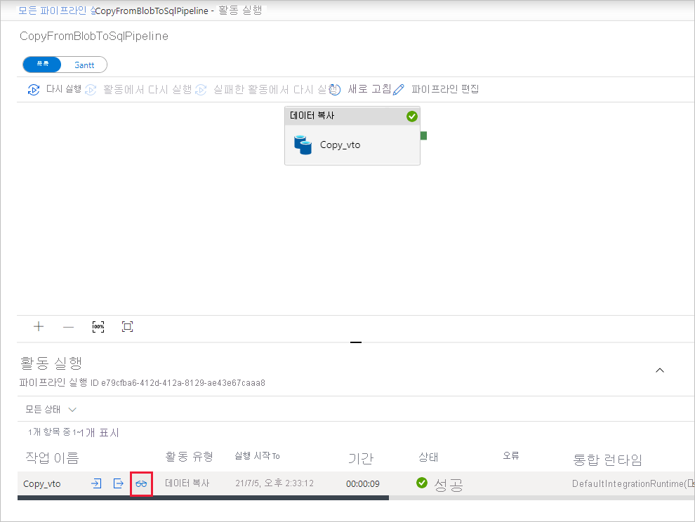

# <a name="copy-data-from-azure-blob-storage-to-a-sql-database-by-using-the-copy-data-tool"></a>데이터 복사 도구를 사용하여 Azure Blob 저장소에서 SQL 데이터베이스로 데이터 복사
> [!div class="op_single_selector" title1="Select the version of the Data Factory service that you're using:"]
> * [버전 1](v1/data-factory-copy-data-from-azure-blob-storage-to-sql-database.md)
> * [현재 버전](tutorial-copy-data-tool.md)

이 자습서에서는 Azure Portal을 사용하여 데이터 팩터리를 만듭니다. 그런 다음, 데이터 복사 도구를 사용하여 Azure Blob 저장소에서 SQL 데이터베이스로 데이터를 복사하는 파이프라인을 만듭니다. 

> [!NOTE]
> Azure Data Factory를 처음 사용하는 경우 [Azure Data Factory 소개](introduction.md)를 참조하세요.

이 자습서에서는 다음 단계를 수행합니다.

> [!div class="checklist"]
> * 데이터 팩터리를 만듭니다.
> * 데이터 복사 도구를 사용하여 파이프라인 만들기
> * 파이프라인 및 작업 실행을 모니터링합니다.

## <a name="prerequisites"></a>필수 조건

* **Azure 구독**: Azure 구독이 아직 없는 경우 시작하기 전에 [체험 계정](https://azure.microsoft.com/free/)을 만듭니다.
* **Azure 저장소 계정**: Blob 저장소를 _원본_ 데이터 저장소로 사용합니다. Azure 저장소 계정이 없는 경우 [저장소 계정 만들기](../storage/common/storage-quickstart-create-account.md)의 지침을 참조하세요.
* **Azure SQL 데이터베이스**: SQL 데이터베이스를 _싱크_ 데이터 저장소로 사용합니다. SQL 데이터베이스가 없는 경우 [SQL 데이터베이스 만들기](../sql-database/sql-database-get-started-portal.md)의 지침을 참조하세요.

### <a name="create-a-blob-and-a-sql-table"></a>Blob 및 SQL 테이블 만들기

다음 단계를 수행하여 자습서에서 사용할 Blob 저장소와 SQL 데이터베이스를 준비합니다.

#### <a name="create-a-source-blob"></a>원본 Blob 만들기

1. **메모장**을 시작합니다. 다음 텍스트를 복사하여 디스크에 **inputEmp.txt**라는 파일로 저장합니다.

    ```
    John|Doe
    Jane|Doe
    ```

1. **adfv2tutorial**이라는 컨테이너를 만들고, inputEmp.txt 파일을 이 컨테이너에 업로드합니다. [Azure Storage 탐색기](http://storageexplorer.com/)와 같은 다양한 도구를 사용하여 이러한 작업을 수행할 수 있습니다.

#### <a name="create-a-sink-sql-table"></a>싱크 SQL 테이블 만들기

1. 다음 SQL 스크립트를 사용하여 SQL 데이터베이스에 **dbo.emp**라는 테이블을 만듭니다.

    ```sql
    CREATE TABLE dbo.emp
    (
        ID int IDENTITY(1,1) NOT NULL,
        FirstName varchar(50),
        LastName varchar(50)
    )
    GO

    CREATE CLUSTERED INDEX IX_emp_ID ON dbo.emp (ID);
    ```

2. Azure 서비스에서 SQL Server에 액세스하도록 허용합니다. SQL Database를 실행하는 서버에 대해 **Azure 서비스에 대한 액세스 허용** 설정을 사용하도록 설정되어 있는지 확인합니다. 이 설정을 사용하면 Data Factory에서 데이터베이스 인스턴스에 데이터를 쓸 수 있습니다. 이 설정을 확인하고 켜려면 Azure SQL Server > **보안** > **방화벽 및 가상 네트워크**로 이동하고 **Azure 서비스에 대한 액세스 허용** 옵션을 **켜기**로 설정합니다.

## <a name="create-a-data-factory"></a>데이터 팩터리를 만듭니다.

1. 왼쪽 메뉴에서 **+ 새로 만들기** > **데이터 + 분석** > **Data Factory**를 차례로 선택합니다. 
   
   
1. **새 데이터 팩터리** 페이지의 **이름** 아래에서 **ADFTutorialDataFactory**를 입력합니다. 
      
     
 
   데이터 팩터리 이름은 _전역적으로 고유_해야 합니다. 다음과 같은 오류 메시지가 표시될 수 있습니다.
   
   

   이름 값에 대한 오류 메시지가 표시되면 데이터 팩터리에 대한 다른 이름을 입력합니다. 예를 들어 _**yourname**_**ADFTutorialDataFactory**를 사용합니다. Data Factory 아티팩트에 대한 명명 규칙은 [Data Factory 명명 규칙](naming-rules.md)을 참조하세요.
1. 새 데이터 팩터리를 만들 Azure **구독**을 선택합니다. 
1. **리소스 그룹**에 대해 다음 단계 중 하나를 사용합니다.
     
    a. **기존 항목 사용**을 선택하고 드롭다운 목록에서 기존 리소스 그룹을 선택합니다.

    b. **새로 만들기**를 선택하고 리소스 그룹의 이름을 입력합니다. 
         
    리소스 그룹에 대한 자세한 내용은 [리소스 그룹을 사용하여 Azure 리소스 관리](../azure-resource-manager/resource-group-overview.md)를 참조하세요.

1. **버전** 아래에서 버전에 대해 **V2**를 선택합니다.
1. **위치** 아래에서 데이터 팩터리에 대한 위치를 선택합니다. 지원되는 위치만 드롭다운 목록에 표시됩니다. 데이터 팩터리에서 사용되는 데이터 저장소(예: Azure Storage, SQL Database) 및 계산(예: Azure HDInsight)은 다른 위치와 지역에 있을 수 있습니다.
1. **대시보드에 고정**을 선택합니다. 
1. **만들기**를 선택합니다.
1. 대시보드의 **Data Factory 배포 중** 타일에서 프로세스 상태가 표시됩니다.

    
1. 만들기가 완료되면 **Data Factory** 홈페이지가 표시됩니다.
   
    
1. 별도의 탭에서 Azure Data Factory UI(사용자 인터페이스)를 시작하려면 **작성 및 모니터링** 타일을 선택합니다. 

## <a name="use-the-copy-data-tool-to-create-a-pipeline"></a>데이터 복사 도구를 사용하여 파이프라인 만들기

1. **시작** 페이지에서 **데이터 복사** 타일을 선택하여 데이터 복사 도구를 시작합니다. 

   
1. **속성** 페이지의 **작업 이름** 아래에서 **CopyFromBlobToSqlPipeline**을 입력합니다. 그런 후 **다음**을 선택합니다. Data Factory UI에서 지정한 작업 이름이 있는 파이프라인을 만듭니다. 

    
1. **원본 데이터 저장소** 페이지에서 다음 단계를 완료합니다.

    a. **+ 새 연결 만들기**를 클릭하여 연결을 추가합니다.

    

    b. 갤러리에서 **Azure Blob Storage**를 선택한 후 **다음**을 선택합니다.

    

    다. **새로 연결된 서비스** 페이지의 **저장소 계정 이름** 목록에서 저장소 계정을 선택한 다음, **마침**을 선택합니다.

    

    d. 새로 만든 연결된 서비스를 원본으로 선택하고 **다음**을 클릭합니다.

    

1. **입력 파일 또는 폴더 선택** 페이지에서 다음 단계를 완료합니다.
    
    a. **찾아보기**를 클릭하여 **adfv2tutorial/input** 폴더로 이동하고, **inputEmp.txt** 파일을 선택한 다음, **선택**을 클릭합니다.

    

    b. **다음**을 클릭하여 다음 단계로 이동합니다.

1. **파일 형식 설정** 페이지에서 도구를 통해 열 및 행 구분 기호를 자동으로 검색합니다. **다음**을 선택합니다. 또한 이 페이지에서 데이터를 미리 보고 입력 데이터의 스키마를 볼 수도 있습니다. 

    
1. **대상 데이터 저장소** 페이지에서 다음 단계를 완료합니다.

    a. **+ 새 연결 만들기**를 클릭하여 연결을 추가합니다.

    

    b. 갤러리에서 **Azure Blob Storage**를 선택한 후 **다음**을 선택합니다.

    

    다. **새로 연결된 서비스** 페이지의 드롭다운 목록에서 서버 이름 및 DB 이름을 선택하고, 사용자 이름과 암호를 지정한 다음, **마침**을 선택합니다.    

    

    d. 새로 만든 연결된 서비스를 싱크로 선택하고 **다음**을 클릭합니다.

    

1. **테이블 매핑** 페이지에서 **[dbo].[emp]** 테이블, **다음**을 차례로 선택합니다. 

    
1. **스키마 매핑** 페이지에서 입력 파일의 첫 번째 및 두 번째 열이 **emp** 테이블의 **FirstName** 및 **LastName** 열에 매핑됩니다. **다음**을 선택합니다.

    
1. **설정** 페이지에서 **다음**을 선택합니다. 
1. **요약** 페이지에서 설정을 검토하고 **다음**을 선택합니다.

    
1. **배포 페이지**에서 **모니터**를 선택하여 파이프라인(작업)을 모니터링합니다.

    
1. 왼쪽의 **모니터** 탭이 자동으로 선택됩니다. **작업** 열에는 활동 실행 세부 정보를 보고 파이프라인을 다시 실행하기 위한 링크가 있습니다. **새로 고침**을 선택하여 목록을 새로 고칩니다. 

    
1. 파이프라인 실행과 연결된 활동 실행을 보려면 **작업** 열에서 **활동 실행 보기** 링크를 선택합니다. 복사 활동에 대한 자세한 내용은 **작업** 열에서 **세부 정보** 링크(안경 아이콘)를 선택합니다. **파이프라인 실행** 보기로 돌아가려면 위쪽의 **파이프라인** 링크를 선택합니다. 보기를 새로 고치려면 **새로 고침**을 선택합니다. 

    

    

1. 데이터가 SQL 데이터베이스의 **emp** 테이블에 삽입되어 있는지 확인합니다.

    

1. 왼쪽의 **작성** 탭을 선택하여 편집기 모드로 전환합니다. 편집기를 사용하여 도구를 통해 만든 연결된 서비스, 데이터 집합 및 파이프라인을 업데이트할 수 있습니다. Data Factory UI에서 이러한 엔터티를 편집하는 방법에 대한 자세한 내용은 [이 자습서의 Azure Portal 버전](tutorial-copy-data-portal.md)을 참조하세요.

## <a name="next-steps"></a>다음 단계
이 샘플의 파이프라인이 Blob 저장소에서 SQL 데이터베이스로 데이터를 복사합니다. 다음 방법에 대해 알아보았습니다. 

> [!div class="checklist"]
> * 데이터 팩터리를 만듭니다.
> * 데이터 복사 도구를 사용하여 파이프라인 만들기
> * 파이프라인 및 작업 실행을 모니터링합니다.

온-프레미스에서 클라우드로 데이터를 복사하는 방법을 알아보려면 다음 자습서로 계속 진행하세요. 

> [!div class="nextstepaction"]
>[온-프레미스에서 클라우드로 데이터 복사](tutorial-hybrid-copy-data-tool.md)
