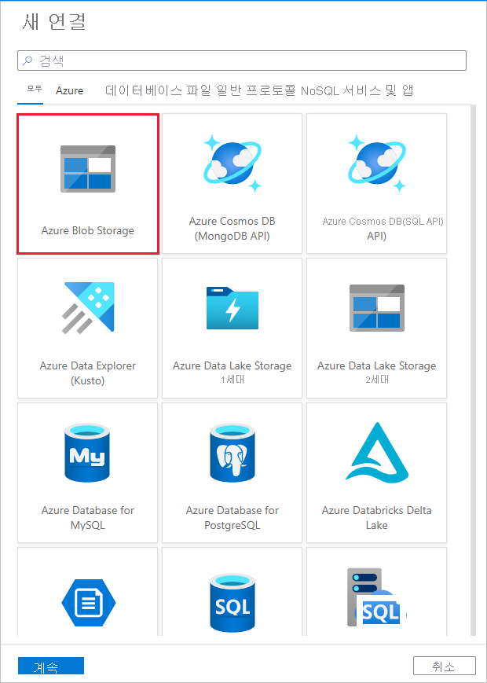

# <a name="copy-data-from-an-on-premises-sql-server-database-to-azure-blob-storage-by-using-the-copy-data-tool"></a>데이터 복사 도구를 사용하여 온-프레미스 SQL Server 데이터베이스에서 Azure Blob 저장소로 데이터 복사
> [!div class="op_single_selector" title1="Select the version of Data Factory service you are using:"]
> * [버전 1](v1/data-factory-copy-data-from-azure-blob-storage-to-sql-database.md)
> * [현재 버전](tutorial-hybrid-copy-data-tool.md)

이 자습서에서는 Azure Portal을 사용하여 데이터 팩터리를 만듭니다. 그런 다음, 데이터 복사 도구를 사용하여 온-프레미스 SQL Server 데이터베이스에서 Azure Blob 저장소로 데이터를 복사하는 파이프라인을 만듭니다.

> [!NOTE]
> - Azure Data Factory를 처음 사용하는 경우 [Data Factory 소개](introduction.md)를 참조하세요.

이 자습서에서는 다음 단계를 수행합니다.

> [!div class="checklist"]
> * 데이터 팩터리를 만듭니다.
> * 데이터 복사 도구를 사용하여 파이프라인 만들기
> * 파이프라인 및 작업 실행을 모니터링합니다.

## <a name="prerequisites"></a>필수 조건
### <a name="azure-subscription"></a>Azure 구독
시작하기 전에 Azure 구독이 아직 없는 경우 [체험 계정을 만듭니다](https://azure.microsoft.com/free/).

### <a name="azure-roles"></a>Azure 역할
Data Factory 인스턴스를 만들려면 Azure에 로그인하는 데 사용할 사용자 계정은 *참가자* 또는 *소유자* 역할로 할당되거나 Azure 구독의 *관리자*여야 합니다. 

구독에 대한 권한을 보려면 Azure Portal로 이동합니다. 오른쪽 위 모서리에서 사용자 이름을 선택한 다음, **권한**을 선택합니다. 여러 구독에 액세스할 수 있는 경우 적절한 구독을 선택합니다. 역할에 사용자를 추가하는 방법에 대한 샘플 지침을 보려면 [RBAC 및 Azure Portal을 사용하여 액세스 관리](../role-based-access-control/role-assignments-portal.md)를 참조하세요.

### <a name="sql-server-2014-2016-and-2017"></a>SQL Server 2014, 2016 및 2017
이 자습서에서는 온-프레미스 SQL Server 데이터베이스를 *원본* 데이터 저장소로 사용합니다. 이 자습서에서 만드는 데이터 팩터리의 파이프라인은 온-프레미스 SQL Server 데이터베이스(원본)에서 Blob 저장소(싱크)로 데이터를 복사합니다. 그런 다음, SQL Server 데이터베이스에 **emp**라는 테이블을 만들고, 동일한 두 개의 샘플 항목을 이 테이블에 삽입합니다. 

1. SQL Server Management Studio를 시작합니다. 아직 컴퓨터에 설치되지 않은 경우 [SQL Server Management Studio 다운로드](https://docs.microsoft.com/sql/ssms/download-sql-server-management-studio-ssms)로 이동합니다. 

1. 자격 증명을 사용하여 SQL server 인스턴스에 연결합니다. 

1. 샘플 데이터베이스 만들기 트리 뷰에서 **데이터베이스**를 마우스 오른쪽 단추로 클릭한 다음 **새 데이터베이스**를 선택합니다. 

1. **새 데이터베이스** 창에서 데이터베이스의 이름을 입력하고 **확인**을 선택합니다. 

1. **emp** 테이블을 만들고 일부 샘플 데이터를 이 테이블에 삽입하려면 데이터베이스에 대해 다음 쿼리 스크립트를 실행합니다. 트리 뷰에서 생성한 데이터베이스를 마우스 오른쪽 단추로 클릭하고 **새 쿼리**를 선택합니다.

    ```sql
    CREATE TABLE dbo.emp
    (
        ID int IDENTITY(1,1) NOT NULL,
        FirstName varchar(50),
        LastName varchar(50)
    )
    GO
    
    INSERT INTO emp (FirstName, LastName) VALUES ('John', 'Doe')
    INSERT INTO emp (FirstName, LastName) VALUES ('Jane', 'Doe')
    GO
    ```

### <a name="azure-storage-account"></a>Azure Storage 계정
이 자습서에서는 범용 Azure 저장소 계정(특히 Blob 저장소)을 대상/싱크 데이터 저장소로 사용합니다. 범용 저장소 계정이 없는 경우 새로 만들기 위한 지침은 [저장소 계정 만들기](../storage/common/storage-quickstart-create-account.md)를 참조하세요. 이 자습서에서 만드는 데이터 팩터리의 파이프라인은 온-프레미스 SQL Server 데이터베이스(원본)에서 이 Blob 저장소(싱크)로 데이터를 복사합니다. 

#### <a name="get-the-storage-account-name-and-account-key"></a>저장소 계정 이름 및 계정 키 가져오기
이 자습서에서는 저장소 계정의 이름과 키를 사용합니다. 저장소 계정의 이름과 키를 가져오려면 다음 단계를 수행합니다. 

1. Azure 사용자 이름과 암호를 사용하여 [Azure Portal](https://portal.azure.com)에 로그인합니다. 

1. 왼쪽 창에서 **더 많은 서비스**를 선택합니다. **저장소** 키워드를 사용하여 필터링한 다음, **저장소 계정**을 선택합니다.

    

1. 필요한 경우 저장소 계정 목록에서 저장소 계정을 필터링합니다. 그런 후 저장소 계정을 선택합니다. 

1. **저장소 계정** 창에서 **액세스 키**를 선택합니다.

    

1. **저장소 계정 이름** 및 **key1** 상자에서 값을 복사한 다음 메모장 또는 나중에 자습서에서 사용할 다른 편집기에 붙여넣습니다. 

#### <a name="create-the-adftutorial-container"></a>adftutorial 컨테이너 만들기 
이 섹션에서는 Blob 저장소에 **adftutorial**이라는 Blob 컨테이너를 만듭니다. 

1. **저장소 계정** 창에서 **개요**로 전환한 다음, **Blob**을 선택합니다. 

    

1. **Blob service** 창에서 **컨테이너**를 선택합니다. 

    

1. **새 컨테이너** 창의 **이름** 상자에 **adftutorial**을 입력한 후 **확인**을 선택합니다. 

    

1. 컨테이너 목록에서 **adftutorial**을 선택합니다.

    

1. **adftutorial**에 대한**컨테이너** 창을 열어 둡니다. 이 자습서의 끝부분에서 출력을 확인하는 데 사용합니다. 데이터 팩터리는 이 컨테이너에서 출력 폴더를 자동으로 만듭니다. 따라서 새로 만들 필요가 없습니다.

    


## <a name="create-a-data-factory"></a>데이터 팩터리를 만듭니다.

1. 왼쪽 메뉴에서 **새로 만들기** > **데이터 + 분석** > **Data Factory**를 차례로 선택합니다. 
  
   
1. **새 데이터 팩터리** 페이지의 **이름** 아래에서 **ADFTutorialDataFactory**를 입력합니다. 
   
     

   데이터 팩터리 이름은 *전역적으로 고유*해야 합니다. 이름 필드에 대해 다음과 같은 오류 메시지가 표시되면 데이터 팩터리의 이름을 변경합니다(예: yournameADFTutorialDataFactory). Data Factory 아티팩트에 대한 명명 규칙은 [Data Factory 명명 규칙](naming-rules.md)을 참조하세요.

   
1. 데이터 팩터리를 만들 Azure **구독**을 선택합니다. 
1. **리소스 그룹**에 대해 다음 단계 중 하나를 사용합니다.
  
      - **기존 항목 사용**을 선택하고 드롭다운 목록에서 기존 리소스 그룹을 선택합니다.

      - **새로 만들기**를 선택하고 리소스 그룹의 이름을 입력합니다. 
        
      리소스 그룹에 대한 자세한 내용은 [리소스 그룹을 사용하여 Azure 리소스 관리](../azure-resource-manager/resource-group-overview.md)를 참조하세요.
1. **버전** 에서 **V2**를 선택합니다.
1. **위치** 아래에서 데이터 팩터리에 대한 위치를 선택합니다. 지원되는 위치만 드롭다운 목록에 표시됩니다. 데이터 팩터리에서 사용되는 데이터 저장소(예: Azure Storage, SQL Database) 및 계산(예: Azure HDInsight)은 다른 위치와 지역에 있을 수 있습니다.
1. **대시보드에 고정**을 선택합니다. 
1. **만들기**를 선택합니다.
1. 대시보드에서 **데이터 팩터리 배포 중** 상태의 다음과 같은 타일이 표시됩니다.

    
1. 만들기가 완료되면 이미지와 같은 **Data Factory** 페이지가 표시됩니다.
  
    
1. **작성 및 모니터링**을 선택하여 별도의 탭에서 Data Factory 사용자 인터페이스를 시작합니다. 

## <a name="use-the-copy-data-tool-to-create-a-pipeline"></a>데이터 복사 도구를 사용하여 파이프라인 만들기

1. **시작** 페이지에서 **데이터 복사**를 선택하여 데이터 복사 도구를 시작합니다. 

   

1. 데이터 복사 도구의 **속성** 페이지에 있는 **작업 이름** 아래에서 **CopyFromOnPremSqlToAzureBlobPipeline**을 입력합니다. 그런 후 **다음**을 선택합니다. 데이터 복사 도구는 이 필드에 지정한 이름의 파이프라인을 만듭니다. 

   

1. **원본 데이터 저장소** 페이지에서 **새 연결 만들기**를 클릭합니다. 

   

1. **새로 연결된 서비스**에서 **SQL Server**를 검색한 다음, **다음**을 선택합니다. 

   

1. 새로 연결된 서비스(SQL Server) **이름****에서 **SqlServerLinkedService**를 입력합니다. **통합 런타임을 통해 연결**에서 **+새로 만들기**를 선택합니다. 자체 호스팅 통합 런타임을 만들고, 컴퓨터에 다운로드하고, Data Factory에 등록해야 합니다. 자체 호스팅 통합 런타임은 온-프레미스 환경과 클라우드 간에 데이터를 복사합니다.

   

1. **Integration Runtime 설정** 대화 상자에서 **개인 네트워크**를 선택합니다. 그런 후 **다음**을 선택합니다. 

   

1. **Integration Runtime 설정** 대화 상자의 **이름** 아래에서 **TutorialIntegrationRuntime**을 입력합니다. 그런 후 **다음**을 선택합니다. 

   

1. **이 컴퓨터에 대한 빠른 설치를 시작하려면 여기를 클릭하십시오**를 선택합니다. 이 작업은 통합 런타임을 컴퓨터에 설치하고 Data Factory에 등록합니다. 또는 수동 설치 옵션을 사용하여 설치 파일을 다운로드하고, 실행하고, 키를 사용하여 통합 런타임을 등록할 수 있습니다. 

    

1. 다운로드한 응용 프로그램을 실행합니다. 창에 빠른 설치의 상태가 표시됩니다. 

    

1. **Integration Runtime** 필드에 대해 **TutorialIntegrationRuntime**이 선택되어 있는지 확인합니다.

    

1. **온-프레미스 SQL Server 데이터베이스 지정**에서 다음 단계를 수행합니다. 

      a. **이름** 아래에서 **SqlServerLinkedService**를 입력합니다.

      b. **서버 이름** 아래에서 온-프레미스 SQL Server 인스턴스의 이름을 입력합니다.

      다. **데이터베이스 이름** 아래에서 온-프레미스 데이터베이스의 이름을 입력합니다.

      d. **인증 유형** 아래에서 적절한 인증을 선택합니다.

      e. **사용자 이름** 아래에서 온-프레미스 SQL Server에 대한 액세스 권한이 있는 사용자의 이름을 입력합니다.

      f. 사용자에 대한 **암호**를 입력합니다. **마침**을 선택합니다. 

1. **다음**을 선택합니다.

     

1. **복사할 데이터가 있는 테이블을 선택하거나 사용자 지정 쿼리를 사용하십시오** 페이지의 목록에서 **[dbo].[emp]** 테이블, **다음**을 차례로 선택합니다. 데이터베이스에 따라 다른 테이블을 선택할 수 있습니다.

     

1. **대상 데이터 저장소** 페이지에서 **새 연결 만들기**를 선택합니다.

     //image create-new-sink-connection.png

     

1. **새로 연결된 서비스**에서 **Azure Blob**를 검색하고 선택한 다음, **계속**합니다. 

     

1. **새로 연결된 서비스(Azure Blob Storage)** 대화 상자에서 다음 단계를 수행합니다. 

     a. **이름****아래에서 **AzureStorageLinkedService**를 입력합니다.

     b. **통합 런타임을 통해 연결**에서 **TutorialIntegrationRuntime**을 선택합니다.

     다. **저장소 계정 이름** 아래의 드롭다운 목록에서 저장소 계정을 선택합니다. 

     d. **다음**을 선택합니다.

     

1. **대상 데이터 저장소** 대화 상자에서 **다음**을 선택합니다. **연결 속성**에서 **Azure Storage 서비스**를 **Azure Blob Storage**로 선택합니다. **다음**을 선택합니다. 

     

1. **출력 파일 또는 폴더** 대화 상자의 **폴더 경로**에서 **adftutorial/fromonprem**을 입력합니다. 필수 구성 요소의 일부로 **adftutorial** 컨테이너를 만들었습니다. 출력 폴더가 없으면(이 경우에 **fromonprem**) Data Factory에서 자동으로 만듭니다. 또한 **찾아보기** 단추를 사용하여 Blob 저장소 및 해당 컨테이너/폴더를 탐색할 수도 있습니다. **파일 이름** 아래에 있는 값을 지정하지 않으면 기본적으로 원본의 이름을 사용합니다(이 경우에 **dbo.emp**).
           
     

1. **파일 형식 설정** 대화 상자에서 **다음**을 선택합니다. 

     

1. **설정** 대화 상자에서 **다음**을 선택합니다. 

     

1. **요약** 대화 상자에서 모든 설정 값을 검토하고 **다음**을 선택합니다. 

     

1. **배포** 페이지에서 **모니터**를 선택하여 만든 파이프라인 또는 작업을 모니터링합니다.

     

1. **모니터** 탭에서 만든 파이프라인의 상태를 볼 수 있습니다. **작업** 열의 링크를 사용하여 파이프라인 실행과 연결된 활동 실행을 보고 파이프라인을 다시 실행할 수 있습니다. 

     

1. **작업** 열에서 **활동 실행 보기** 링크를 선택하여 파이프라인 실행과 연결된 활동 실행을 확인합니다. 복사 활동에 대한 세부 정보를 보려면 **작업** 열에서 **세부 정보** 링크(안경 아이콘)를 선택합니다. **파이프라인 실행** 보기로 다시 전환하려면 위쪽의 **파이프라인**을 선택합니다.

     

1. **adftutorial** 컨테이너의 **fromonprem** 폴더에 있는 출력 파일이 표시되는지 확인합니다. 

     

1. 왼쪽의 **편집** 탭을 선택하여 편집기 모드로 전환합니다. 편집기를 사용하여 도구에서 만든 연결된 서비스, 데이터 세트 및 파이프라인을 업데이트할 수 있습니다. **코드**를 선택하여 편집기에서 열려 있는 엔터티와 연결된 JSON 코드를 살펴봅니다. Data Factory UI에서 이러한 엔터티를 편집하는 방법에 대한 자세한 내용은 [이 자습서의 Azure Portal 버전](tutorial-copy-data-portal.md)을 참조하세요.

     


## <a name="next-steps"></a>다음 단계
이 샘플의 파이프라인이 온-프레미스 SQL Server 데이터베이스에서 Blob 저장소로 데이터를 복사합니다. 다음 방법에 대해 알아보았습니다. 

> [!div class="checklist"]
> * 데이터 팩터리를 만듭니다.
> * 데이터 복사 도구를 사용하여 파이프라인 만들기
> * 파이프라인 및 작업 실행을 모니터링합니다.

Data Factory에서 지원되는 데이터 저장소의 목록은 [지원되는 데이터 저장소](copy-activity-overview.md#supported-data-stores-and-formats)를 참조하세요.

데이터를 원본에서 대상으로 대량으로 복사하는 방법을 알아보려면 다음 자습서로 계속 진행하세요.

> [!div class="nextstepaction"]
>[대량 데이터 복사](tutorial-bulk-copy-portal.md)
