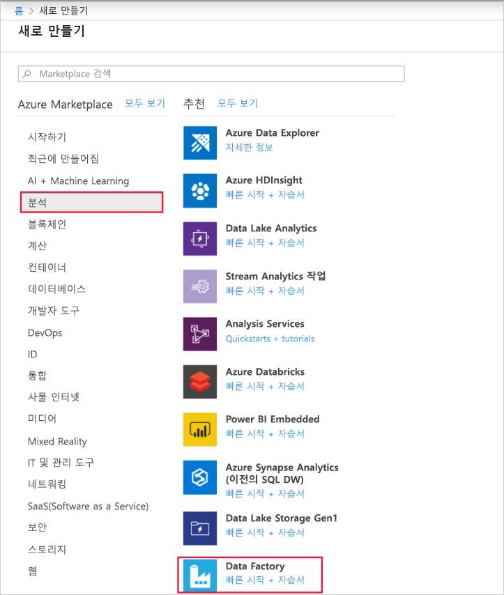
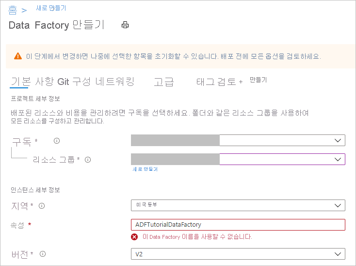
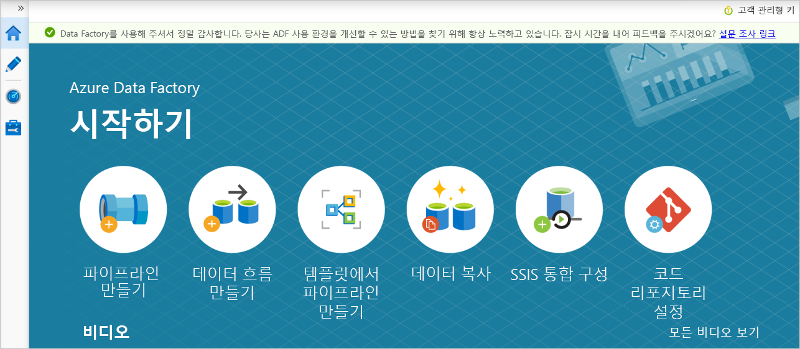

# <a name="copy-data-from-a-sql-server-database-to-azure-blob-storage"></a>SQL Server 데이터베이스에서 Azure Blob 스토리지로 데이터 복사

[!INCLUDE[appliesto-adf-xxx-md](includes/appliesto-adf-xxx-md.md)]

이 자습서에서는 Azure Data Factory UI(사용자 인터페이스)를 사용하여 SQL Server 데이터베이스에서 Azure Blob 스토리지로 데이터를 복사하는 데이터 팩터리 파이프라인을 만듭니다. 온-프레미스와 클라우드 데이터 저장소 간에 데이터를 이동하는, 자체 호스팅된 통합 런타임을 생성하고 사용합니다.

> [!NOTE]
> 이 문서에서는 Data Factory를 자세히 소개하지 않습니다. 자세한 내용은 [Data Factory 소개](introduction.md)를 참조하세요.

이 자습서에서는 다음 단계를 수행합니다.

> [!div class="checklist"]
> * 데이터 팩터리를 만듭니다.
> * 자체 호스팅 통합 런타임을 만듭니다.
> * SQL Server 및 Azure Storage 연결된 서비스를 만듭니다.
> * SQL Server 및 Azure Blob 데이터 세트를 만듭니다.
> * 데이터를 이동하는 복사 작업으로 파이프라인을 만듭니다.
> * 파이프라인 실행을 시작합니다.
> * 파이프라인 실행을 모니터링합니다.

## <a name="prerequisites"></a>필수 구성 요소
### <a name="azure-subscription"></a>Azure 구독
시작하기 전에 Azure 구독이 아직 없는 경우 [체험 계정을 만듭니다](https://azure.microsoft.com/free/).

### <a name="azure-roles"></a>Azure 역할
데이터 팩터리 인스턴스를 만들려면 Azure에 로그인하는 데 사용할 사용자 계정이 *참가자* 또는 *소유자* 역할에 할당되거나 Azure 구독의 *관리자* 여야 합니다.

구독에 대한 권한을 보려면 Azure Portal로 이동합니다. 오른쪽 위 모서리에서 사용자 이름을 선택한 다음, **권한** 을 선택합니다. 여러 구독에 액세스할 수 있는 경우 적절한 구독을 선택합니다. 역할에 사용자를 추가하는 방법에 대한 샘플 지침은 [Azure Portal을 사용하여 Azure 역할 할당 추가 또는 제거](../role-based-access-control/role-assignments-portal.md)를 참조하세요.

### <a name="sql-server-2014-2016-and-2017"></a>SQL Server 2014, 2016 및 2017
이 자습서에서는 SQL Server 데이터베이스를 *원본* 데이터 저장소로 사용합니다. 이 자습서에서 만드는 데이터 팩터리의 파이프라인은 SQL Server 데이터베이스(원본)에서 Blob 스토리지(싱크)로 데이터를 복사합니다. 그런 다음, SQL Server 데이터베이스에 **emp** 라는 테이블을 만들고, 동일한 두 개의 샘플 항목을 이 테이블에 삽입합니다.

1. SQL Server Management Studio를 시작합니다. 아직 컴퓨터에 설치되지 않은 경우 [SQL Server Management Studio 다운로드](/sql/ssms/download-sql-server-management-studio-ssms)로 이동합니다.

1. 자격 증명을 사용하여 SQL server 인스턴스에 연결합니다.

1. 샘플 데이터베이스 만들기 트리 뷰에서 **데이터베이스** 를 마우스 오른쪽 단추로 클릭한 다음 **새 데이터베이스** 를 선택합니다.
1. **새 데이터베이스** 창에서 데이터베이스의 이름을 입력하고 **확인** 을 선택합니다.

1. **emp** 테이블을 만들고 일부 샘플 데이터를 이 테이블에 삽입하려면 데이터베이스에 대해 다음 쿼리 스크립트를 실행합니다. 트리 뷰에서 생성한 데이터베이스를 마우스 오른쪽 단추로 클릭하고 **새 쿼리** 를 선택합니다.

   ```
    CREATE TABLE dbo.emp
    (
        ID int IDENTITY(1,1) NOT NULL,
        FirstName varchar(50),
        LastName varchar(50)
    )
    GO

    INSERT INTO emp (FirstName, LastName) VALUES ('John', 'Doe')
    INSERT INTO emp (FirstName, LastName) VALUES ('Jane', 'Doe')
    GO
   ```

### <a name="azure-storage-account"></a>Azure Storage 계정
이 자습서에서는 범용 Azure 스토리지 계정(특히 Blob Storage)을 대상/싱크 데이터 스토리지로 사용합니다. 범용 Azure Storage 계정이 없는 경우 [스토리지 계정 만들기](../storage/common/storage-account-create.md)를 참조하세요. 이 자습서에서 만드는 데이터 팩터리의 파이프라인은 SQL Server 데이터베이스(원본)에서 Blob 스토리지(싱크)로 데이터를 복사합니다. 

#### <a name="get-the-storage-account-name-and-account-key"></a>스토리지 계정 이름 및 계정 키 가져오기
이 자습서에서는 스토리지 계정의 이름과 키를 사용합니다. 스토리지 계정의 이름과 키를 가져오려면 다음 단계를 수행합니다.

1. Azure 사용자 이름과 암호를 사용하여 [Azure Portal](https://portal.azure.com)에 로그인합니다.

1. 왼쪽 창에서 **모든 서비스** 를 선택합니다. **스토리지** 키워드를 사용하여 필터링한 다음, **스토리지 계정** 을 선택합니다.

    

1. 필요한 경우 스토리지 계정 목록에서 스토리지 계정을 필터링합니다. 그런 후 스토리지 계정을 선택합니다.

1. **스토리지 계정** 창에서 **액세스 키** 를 선택합니다.

1. **스토리지 계정 이름** 및 **key1** 상자에서 값을 복사한 다음 메모장 또는 나중에 자습서에서 사용할 다른 편집기에 붙여넣습니다.

#### <a name="create-the-adftutorial-container"></a>adftutorial 컨테이너 만들기
이 섹션에서는 Blob Storage에 **adftutorial** 이라는 Blob 컨테이너를 만듭니다.

1. **스토리지 계정** 창에서 **개요** 로 이동한 다음, **컨테이너** 를 선택합니다.

    

1. **컨테이너** 창에서 **+ 컨테이너** 를 선택하여 새 항목을 만듭니다.

1. **새 컨테이너** 창의 **이름** 아래에서 **adftutorial** 을 입력합니다. 그런 다음 **만들기** 를 선택합니다.

1. 컨테이너 목록에서 방금 만든 **adftutorial** 을 선택합니다.

1. **adftutorial** 의 **컨테이너** 창을 열어 둡니다. 이 자습서의 끝부분에서 출력을 확인하는 데 사용합니다. 데이터 팩터리는 이 컨테이너에서 출력 폴더를 자동으로 만듭니다. 따라서 새로 만들 필요가 없습니다.

## <a name="create-a-data-factory"></a>데이터 팩터리 만들기
이 단계에서는 데이터 팩터리를 만들고, Data Factory UI를 시작하여 파이프라인을 데이터 팩터리에 만듭니다.

1. **Microsoft Edge** 또는 **Google Chrome** 웹 브라우저를 엽니다. 현재 Data Factory UI는 Microsoft Edge 및 Google Chrome 웹 브라우저에서만 지원됩니다.
1. 왼쪽 메뉴에서 **리소스 만들기** > **분석** > **Data Factory** 를 선택합니다.

   

1. **새 데이터 팩터리** 페이지의 **이름** 아래에서 **ADFTutorialDataFactory** 를 입력합니다.

   데이터 팩터리 이름은 *전역적으로 고유* 해야 합니다. 이름 필드에 대해 다음과 같은 오류 메시지가 표시되면 데이터 팩터리의 이름을 변경합니다(예: yournameADFTutorialDataFactory). Data Factory 아티팩트에 대한 명명 규칙은 [Data Factory 명명 규칙](naming-rules.md)을 참조하세요.

   

1. 데이터 팩터리를 만들 Azure **구독** 을 선택합니다.
1. **리소스 그룹** 에 대해 다음 단계 중 하나를 사용합니다.

   - **기존 항목 사용** 을 선택하고 드롭다운 목록에서 기존 리소스 그룹을 선택합니다.

   - **새로 만들기** 를 선택하고 리소스 그룹의 이름을 입력합니다.
        
     리소스 그룹에 대한 자세한 내용은 [리소스 그룹을 사용하여 Azure 리소스 관리](../azure-resource-manager/management/overview.md)를 참조하세요.
1. **버전** 에서 **V2** 를 선택합니다.
1. **위치** 아래에서 데이터 팩터리에 대한 위치를 선택합니다. 지원되는 위치만 드롭다운 목록에 표시됩니다. 데이터 팩터리에서 사용되는 데이터 저장소(예: Storage, SQL Database) 및 계산(예: Azure HDInsight)은 다른 지역에 있을 수 있습니다.
1. **만들기** 를 선택합니다.

1. 만들기가 완료되면 이미지와 같은 **Data Factory** 페이지가 표시됩니다.

    
1. **작성 및 모니터링** 타일을 선택하여 별도의 탭에서 Azure Data Factory UI를 실행합니다.


## <a name="create-a-pipeline"></a>파이프라인 만들기

1. **시작** 페이지에서 **파이프라인 만들기** 를 선택합니다. 파이프라인이 자동으로 만들어집니다. 파이프라인이 트리 뷰에 표시되고 편집기가 열립니다.

   

1. **속성** 아래의 일반 패널에서 **이름** 에 **SQLServerToBlobPipeline** 을 지정합니다. 그런 다음, 오른쪽 위 모서리에 있는 속성 아이콘을 클릭하여 패널을 축소합니다.

1. **활동** 도구 상자에서 **이동 및 변환** 을 펼칩니다. **복사** 활동을 파이프라인 디자인 화면으로 끌어서 놓습니다. 활동 이름을 **CopySqlServerToAzureBlobActivity** 로 설정합니다.

1. **속성** 창에서 **원본** 탭으로 이동하고 **+ 새로 만들기** 를 클릭합니다.

1. **새 데이터 세트** 대화 상자에서 **SQL Server** 를 검색합니다. **SQL Server** 를 선택한 다음, **계속** 을 선택합니다.
    

1. **속성 설정** 대화 상자의 **이름** 아래에 **SqlServerDataset** 를 입력합니다. **연결된 서비스** 에서 **+ 새로 만들기** 를 선택합니다. 이 단계에서는 원본 데이터 저장소(SQL Server 데이터베이스)에 대한 연결을 만듭니다.

1. **새로 연결된 서비스** 대화 상자에서 **이름** 을 **SqlServerLinkedService** 로 추가합니다. **통합 런타임을 통해 연결** 에서 **+새로 만들기** 를 선택합니다.  이 섹션에서는 자체 호스팅 Integration Runtime을 만들고 이를 Microsoft SQL Server 데이터베이스와 함께 온-프레미스 컴퓨터에 연결합니다. 자체 호스팅 통합 런타임은 컴퓨터의 SQL Server 데이터베이스에서 Blob Storage로 데이터를 복사하는 구성 요소입니다.

1. **Integration Runtime 설정** 대화 상자에서 **자체 호스팅** 을 선택한 다음, **계속** 을 선택합니다.

1. 이름 아래에 **TutorialIntegrationRuntime** 을 입력합니다. 그런 다음 **만들기** 를 선택합니다.

1. 설정에서 **이 컴퓨터에 대한 빠른 설치를 시작하려면 여기를 클릭하십시오** 를 선택합니다. 이 작업은 통합 런타임을 컴퓨터에 설치하고 Data Factory에 등록합니다. 또는 수동 설치 옵션을 사용하여 설치 파일을 다운로드하고, 실행하고, 키를 사용하여 통합 런타임을 등록할 수 있습니다.
    

1. **Integration Runtime(자체 호스팅) 빠른 설치** 창에서 프로세스가 완료되면 **닫기** 를 선택합니다.

    

1. **새로 연결된 서비스(SQL Server)** 대화 상자에서 **통합 런타임을 통해 연결** 에 **TutorialIntegrationRuntime** 이 선택되어 있는지 확인합니다. 그런 다음, 다음 단계를 수행합니다.

    a. **이름** 아래에서 **SqlServerLinkedService** 를 입력합니다.

    b. **서버 이름** 아래에서 온-프레미스 SQL Server 인스턴스의 이름을 입력합니다.

    다. **데이터베이스 이름** 아래에서 **emp** 테이블이 있는 데이터베이스의 이름을 지정합니다.

    d. **인증 유형** 아래에서 Data Factory가 SQL Server 데이터베이스에 연결하는 데 사용해야 하는 적절한 인증 유형을 선택합니다.

    e. **사용자 이름** 및 **암호** 아래에서 사용자 이름과 암호를 입력합니다. 백슬래시(\\)를 사용자 계정 또는 서버 이름에 사용해야 하는 경우 앞에 이스케이프 문자(\\)를 사용합니다. 예를 들어 *mydomain\\\\myuser* 를 사용합니다.

    f. **연결 테스트** 를 클릭합니다. 이 단계는 사용자가 만든 자체 호스팅 통합 런타임을 사용하여 Data Factory에서 SQL Server 데이터베이스에 연결할 수 있는지 확인합니다.

    g. 연결된 서비스를 저장하려면 **만들기** 를 선택합니다.
 
    

1. 연결된 서비스가 생성되면 SqlServerDataset에 대한 **속성 설정** 페이지로 다시 이동합니다. 다음과 같은 단계를 수행합니다.

    a. **연결된 서비스** 에서 **SqlServerLinkedService** 가 표시되는지 확인합니다.

    b. **테이블 이름** 에서 **[dbo].[emp]** 를 선택합니다.
    
    다. **확인** 을 선택합니다.

1. **SQLServerToBlobPipeline** 이 있는 탭으로 이동하거나 트리 뷰에서 **SQLServerToBlobPipeline** 을 선택합니다.

1. **속성** 창의 아래쪽에 있는 **싱크** 탭으로 이동하고 **+ 새로 만들기** 를 선택합니다.

1. **새 데이터 세트** 대화 상자에서 **Azure Blob Storage** 를 선택합니다. 그런 다음, **계속** 을 선택합니다.

1. **형식 선택** 대화 상자에서 데이터의 형식 유형을 선택합니다. 그런 다음, **계속** 을 선택합니다.

    

1. **속성 설정** 대화 상자에서 이름에 **AzureBlobDataset** 를 입력합니다. **연결된 서비스** 텍스트 상자 옆에 있는 **+ 새로 만들기** 를 선택합니다.

1. **새로 연결된 서비스(Azure Blob Storage)** 대화 상자에서 **AzureStorageLinkedService** 를 이름으로 입력하고, **스토리지 계정** 이름 목록에서 스토리지 계정을 선택합니다. 연결을 테스트한 다음, **만들기** 를 선택하여 연결된 서비스를 배포합니다.

1. 연결된 서비스가 생성되면 **속성 설정** 페이지로 다시 이동합니다. **확인** 을 선택합니다.

1. 싱크 데이터 세트를 엽니다. **연결** 탭에서 다음 단계를 수행합니다.

    a. **연결된 서비스** 에서 **AzureStorageLinkedService** 가 선택되어 있는지 확인합니다.

    b. **파일 경로** 에서 **컨테이너/디렉터리** 부분에 대해 **adftutorial/fromonprem** 을 입력합니다. 출력 폴더가 adftutorial 컨테이너에 없으면 Data Factory에서 출력 폴더를 자동으로 만듭니다.

    다. **파일** 부분의 경우 **동적 콘텐츠 추가** 를 선택합니다.
    

    d. `@CONCAT(pipeline().RunId, '.txt')`를 추가한 다음, **마침** 을 선택합니다. 그러면 PipelineRunID.txt로 파일 이름이 변경됩니다.

1. 파이프라인이 열려 있는 탭으로 이동하거나 트리 뷰에서 파이프라인을 선택합니다. **싱크 데이터 세트** 에서 **AzureBlobDataset** 가 선택되어 있는지 확인합니다.

1. 파이프라인 설정에 대한 유효성을 검사하려면 파이프라인에 대한 도구 모음에서 **유효성 검사** 를 선택합니다. **파이프 유효성 검사 출력** 을 닫으려면 **>>** 아이콘을 선택합니다.
    
    

1. 만든 엔터티를 Data Factory에 게시하려면 **모두 게시** 를 선택합니다.

1. **게시 완료** 팝업이 보일 때까지 기다립니다. 게시 상태를 확인하려면 창의 맨 위에 있는 **알림 표시** 링크를 선택합니다. 알림 창을 닫으려면 **닫기** 를 선택합니다.


## <a name="trigger-a-pipeline-run"></a>파이프라인 실행 트리거
파이프라인에 대한 도구 모음에서 **트리거 추가** 를 선택한 다음, **지금 트리거** 를 선택합니다.

## <a name="monitor-the-pipeline-run"></a>파이프라인 실행을 모니터링합니다.

1. **모니터** 탭으로 이동합니다. 이전 단계에서 수동으로 트리거한 파이프라인이 표시됩니다.

1. 파이프라인 실행과 관련된 활동 실행을 보려면 *파이프라인 이름* 에서 **SQLServerToBlobPipeline** 링크를 선택합니다. 
    

1. **활동 실행** 페이지에서 세부 정보(안경 이미지) 링크를 선택하면 복사 작업에 대한 세부 정보를 볼 수 있습니다. 파이프라인 실행 보기로 돌아가려면 위쪽의 **모든 파이프라인 실행** 을 선택합니다.

## <a name="verify-the-output"></a>출력 확인
파이프라인은 자동으로 `adftutorial` Blob 컨테이너에서 *fromonprem* 이라는 출력 폴더를 만듭니다. 출력 폴더에서 *[pipeline().RunId].txt* 파일이 표시되는지 확인합니다.


## <a name="next-steps"></a>다음 단계
이 샘플의 파이프라인이 Blob Storage의 위치 간에 데이터를 복사합니다. 구체적으로 다음 작업 방법을 알아보았습니다.

> [!div class="checklist"]
> * 데이터 팩터리를 만듭니다.
> * 자체 호스팅 통합 런타임을 만듭니다.
> * SQL Server 및 Storage 연결된 서비스를 만듭니다.
> * SQL Server 및 Blob Storage 데이터 세트을 만듭니다.
> * 데이터를 이동하는 복사 작업으로 파이프라인을 만듭니다.
> * 파이프라인 실행을 시작합니다.
> * 파이프라인 실행을 모니터링합니다.

Data Factory에서 지원되는 데이터 저장소의 목록은 [지원되는 데이터 저장소](copy-activity-overview.md#supported-data-stores-and-formats)를 참조하세요.

데이터를 원본에서 대상으로 대량으로 복사하는 방법을 알아보려면 다음 자습서로 계속 진행하세요.

> [!div class="nextstepaction"]
>[대량 데이터 복사](tutorial-bulk-copy-portal.md)