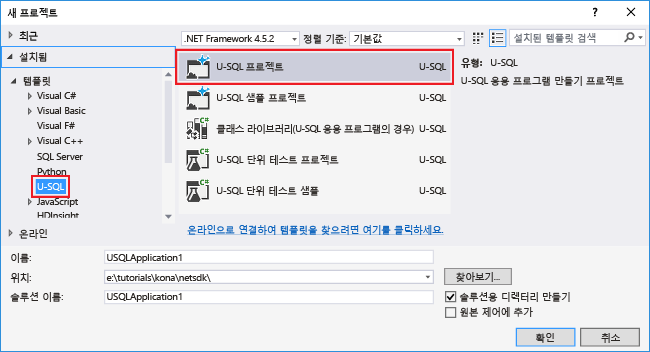

<properties
   pageTitle="Azure 데이터 레이크 분석을 사용하여 웹 사이트 로그 분석 | Azure"
   description="데이터 레이크 분석을 사용하여 웹 사이트 로그를 분석하는 방법에 대해 알아봅니다. "
   services="data-lake-analytics"
   documentationCenter=""
   authors="edmacauley"
   manager="jhubbard"
   editor="cgronlun"/>

<tags
   ms.service="data-lake-analytics"
   ms.devlang="na"
   ms.topic="article"
   ms.tgt_pltfrm="na"
   ms.workload="big-data"
   ms.date="05/16/2016"
   ms.author="edmaca"/>

# 자습서: Azure 데이터 레이크 분석을 사용하여 웹 사이트 로그 분석

데이터 레이크 분석을 사용하여 웹 사이트 로그를 분석하는 방법, 특히 웹 사이트를 방문하려고 할 때 참조 페이지에 오류가 발생한 경우에 대해 알아봅니다.

>[AZURE.NOTE] 응용 프로그램 작업을 참조하려면 [Azure 데이터 레이크 분석 대화형 자습서 사용](data-lake-analytics-use-interactive-tutorials.md)을 통해 시간을 절약합니다. 이 자습서는 동일한 시나리오와 동일한 코드를 기반으로 합니다. 이 자습서는 개발자들에게 데이터 레이크 분석 응용 프로그램을 끝까지 만들고 실행하는 환경을 제공하기 위해 만들었습니다.

## 필수 조건:

- **Visual Studio 2015, Visual Studio 2013 업데이트 4 또는 Visual Studio 2012와 Visual C++ 설치**.
- **.NET 버전 2.5 이상용 Microsoft Azure SDK**. [웹 플랫폼 설치 관리자](http://www.microsoft.com/web/downloads/platform.aspx)를 사용하여 설치합니다.
- **[Visual Studio용 데이터 레이크 도구](http://aka.ms/adltoolsvs)**

	Visual Studio용 데이터 레이크 도구를 설치하면 Visual Studio에서 **데이터 레이크** 메뉴를 볼 수 있습니다.

	

- **데이터 레이크 분석 및 Visual Studio용 데이터 레이크 도구에 대한 기본 지식**. 시작하려면 다음을 참조하십시오.

	- [Azure 포털을 사용하여 Azure 데이터 레이크 분석을 시작합니다](data-lake-analytics-get-started-portal.md).
	- [Visual Studio용 데이터 레이크 도구를 사용하여 U-SQL 스크립트 개발](data-lake-analytics-data-lake-tools-get-started.md).

- **데이터 레이크 분석 계정.** [Azure 데이터 레이크 분석 계정 만들기](data-lake-analytics-get-started-portal.md#create_adl_analytics_account)를 참조하세요.

	데이터 레이크 도구는 데이터 레이크 분석 계정 만들기를 지원하지 않습니다. 따라서 Azure 포털, Azure PowerShell, .NET SDK 또는 Azure CLI를 사용하여 해당 계정을 만들어야 합니다.
- **데이터 레이크 분석 계정에 샘플 데이터를 업로드합니다.** [기본 데이터 레이크 저장소 계정에 SearchLog.tsv를 업로드하기](data-lake-analytics-get-started-portal.md#update-data-to-the-default-adl-storage-account)를 참조하세요.

    데이터 레이크 분석 작업을 실행하려면 일부 데이터가 필요합니다. 데이터 레이크 도구가 데이터 업로드를 지원하지만 이 자습서를 더 쉽게 수행하기 위해 해당 포털을 사용하여 샘플 데이터를 업로드합니다.

## Azure에 연결

모든 U-SQL 스크립트를 빌드하거나 테스트하기 전에 먼저 Azure에 연결해야 합니다.

**데이터 레이크 분석에 연결하려면**

1. Visual Studio를 엽니다.
2. **데이터 레이크** 메뉴에서 **옵션 및 설정**을 클릭합니다.
4. **로그인** 또는 **사용자 변경**을 클릭하거나, 특정 사용자가 로그인한 경우 다음 지침을 따르십시오.
5. **확인**을 클릭하여 해당 옵션 및 설정 대화 상자를 닫습니다.

**데이터 레이크 분석 계정 찾아보기**

1. Visual Studio에서 **CTRL+ALT+S**를 눌러 **서버 탐색기**를 엽니다.
2. **서버 탐색기**에서 **Azure**를 확장한 후 **데이터 레이크 분석**을 확장합니다. 계정이 있을 경우 해당 데이터 레이크 분석 계정 목록이 표시됩니다. Studio에서 데이터 레이크 분석 계정을 만들 수 없습니다. 계정을 만들려면 [Azure 포털을 사용하여 Azure 데이터 레이크 분석 시작](data-lake-analytics-get-started-portal.md) 또는 [Azure PowerShell을 사용하여 Azure 데이터 레이크 분석 시작](data-lake-analytics-get-started-powershell.md)을 참조하세요.

## U-SQL 응용 프로그램 개발

U-SQL 응용 프로그램은 대부분 U-SQL 스크립트입니다. U-SQL에 대한 자세한 내용은 [U-SQL 시작](data-lake-analytics-u-sql-get-started.md)을 참조하십시오.

해당 응용 프로그램에 더하기 사용자 정의 연산자를 추가할 수 있습니다. 자세한 내용은 [데이터 레이크 분석 작업을 위한 U-SQL 사용자 정의 연산자 개발](data-lake-analytics-u-sql-develop-user-defined-operators.md)을 참조하십시오.

**데이터 레이크 분석 작업 만들기 및 제출하기**

1. **파일** 메뉴에서 **새로 만들기**를 클릭한 다음 **프로젝트**를 클릭합니다.
2. U-SQL 프로젝트 형식을 선택합니다.

	

3. **확인**을 클릭합니다. Visual studio는 Script.usql 파일로 솔루션을 만듭니다.
4. Script.usql 파일에 다음 스크립트를 입력합니다.

        // Create a database for easy reuse, so you don't need to read from a file every time.
        CREATE DATABASE IF NOT EXISTS SampleDBTutorials;

        // Create a Table valued function. TVF ensures that your jobs fetch data from the weblog file with the correct schema.
        DROP FUNCTION IF EXISTS SampleDBTutorials.dbo.WeblogsView;
        CREATE FUNCTION SampleDBTutorials.dbo.WeblogsView()
        RETURNS @result TABLE
        (
            s_date DateTime,
            s_time string,
            s_sitename string,
            cs_method string,
            cs_uristem string,
            cs_uriquery string,
            s_port int,
            cs_username string,
            c_ip string,
            cs_useragent string,
            cs_cookie string,
            cs_referer string,
            cs_host string,
            sc_status int,
            sc_substatus int,
            sc_win32status int,
            sc_bytes int,
            cs_bytes int,
            s_timetaken int
        )
        AS
        BEGIN

            @result = EXTRACT
                s_date DateTime,
                s_time string,
                s_sitename string,
                cs_method string,
                cs_uristem string,
                cs_uriquery string,
                s_port int,
                cs_username string,
                c_ip string,
                cs_useragent string,
                cs_cookie string,
                cs_referer string,
                cs_host string,
                sc_status int,
                sc_substatus int,
                sc_win32status int,
                sc_bytes int,
                cs_bytes int,
                s_timetaken int
            FROM @"/Samples/Data/WebLog.log"
            USING Extractors.Text(delimiter:' ');
		    RETURN;
		END;

        // Create a table for storing referrers and status
        DROP TABLE IF EXISTS SampleDBTutorials.dbo.ReferrersPerDay;
        @weblog = SampleDBTutorials.dbo.WeblogsView();
        CREATE TABLE SampleDBTutorials.dbo.ReferrersPerDay
        (
            INDEX idx1
            CLUSTERED(Year ASC)
            PARTITIONED BY HASH(Year)
        ) AS

        SELECT s_date.Year AS Year,
            s_date.Month AS Month,
            s_date.Day AS Day,
            cs_referer,
            sc_status,
            COUNT(DISTINCT c_ip) AS cnt
        FROM @weblog
        GROUP BY s_date,
                cs_referer,
                sc_status;

    U-SQL을 이해하려면 [데이터 레이크 분석 U-SQL 언어 시작](data-lake-analytics-u-sql-get-started.md)을 참조하세요.

5. 새 U SQL 스크립트를 프로젝트에 추가하고 다음을 입력합니다.

        // Query the referrers that ran into errors
        @content =
            SELECT *
            FROM SampleDBTutorials.dbo.ReferrersPerDay
            WHERE sc_status >=400 AND sc_status < 500;

        OUTPUT @content
        TO @"/Samples/Outputs/UnsuccessfulResponses.log"
        USING Outputters.Tsv();

6. 첫 번째 U-SQL 스크립트로 다시 전환하고 **제출** 단추 옆에 해당 분석 계정을 지정합니다.
7. **솔루션 탐색기**에서 **Script.usql**을 마우스 오른쪽 단추로 클릭하고 **스크립트 빌드**를 클릭합니다. 출력 창에서 결과를 확인합니다.
8. **솔루션 탐색기**에서 **Script.usql**을 마우스 오른쪽 단추로 클릭하고 **스크립트 제출**을 클릭합니다.
9. **분석 계정**이 실행하려는 작업에 있는지 확인하고 **제출**을 클릭합니다. 제출이 완료되면 Visual Studio용 데이터 레이크 도구 결과 창에서 제출 결과 및 작업 링크를 사용할 수 있습니다.
10. 작업이 성공적으로 완료될 때까지 기다립니다. 작업이 실패한 경우 대부분 원본 파일이 손실되었을 가능성이 큽니다. 이 자습서의 필수 조건 섹션을 참조하십시오. 추가적인 문제 해결 정보는 [Azure 데이터 레이크 분석 작업 모니터링 및 문제 해결](data-lake-analytics-monitor-and-troubleshoot-jobs-tutorial.md)을 참조하세요.

    해당 작업이 완료되면 다음 화면이 표시됩니다.

    

11. **Script1.usql**에 대해 7-10단계를 반복합니다.

>[AZURE.NOTE]동일한 스크립트에서 생성 또는 수정된 U-SQL 테이블을 읽거나 쓸 수 없습니다. 바로 이러한 이유로 이 예제에 두 스크립트를 사용합니다.

**작업 출력 보기**

1. **서버 탐색기**에서 **Azure**, **데이터 레이크 분석**, 사용자의 데이터 레이크 분석 계정, **저장소 계정**을 차례로 확장하고 기본 데이터 레이크 저장소 계정을 마우스 오른쪽 단추로 클릭한 다음 **탐색기**를 클릭합니다.
2.  **샘플**을 두 번 클릭하여 해당 폴더를 연 다음 **출력**을 두 번 클릭합니다.
3.  **UnsuccessfulResponsees.log**를 두 번 클릭합니다.
4.  출력 작업을 직접 탐색하기 위해 해당 작업의 그래프 뷰 내부에 있는 출력 파일을 두 번 클릭할 수도 있습니다.

## 참고 항목

다른 도구를 사용하여 데이터 레이크 분석을 시작하려면 다음을 참조하십시오.

- [Azure 포털을 사용하여 데이터 레이크 분석 시작](data-lake-analytics-get-started-portal.md)
- [Azure PowerShell을 사용하여 데이터 레이크 분석 시작](data-lake-analytics-get-started-powershell.md)
- [.NET SDK를 사용하여 데이터 레이크 분석 시작](data-lake-analytics-get-started-net-sdk.md)

더 많은 개발 항목을 보려면:

- [Visual Studio용 데이터 레이크 도구를 사용하여 U-SQL 스크립트 개발](data-lake-analytics-data-lake-tools-get-started.md)
- [Azure 데이터 레이크 분석 U-SQL 언어 시작](data-lake-analytics-u-sql-get-started.md)
- [데이터 레이크 분석 작업을 위한 U-SQL 사용자 정의 연산자 개발](data-lake-analytics-u-sql-develop-user-defined-operators.md)

<!---HONumber=AcomDC_0914_2016-->