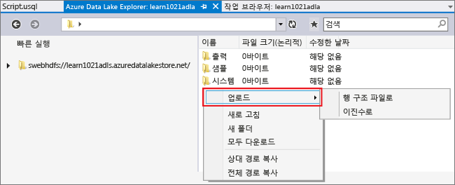
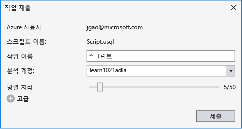

<properties 
   pageTitle="Visual Studio용 데이터 레이크 도구를 사용하여 U-SQL 스크립트 개발 | Azure" 
   description="Visual Studio용 데이터 레이크 도구를 설치하는 방법과 U-SQL 스크립트를 개발하고 테스트하는 방법을 알아봅니다." 
   services="data-lake-analytics" 
   documentationCenter="" 
   authors="mumian" 
   manager="paulettm" 
   editor="cgronlun"/>
 
<tags
   ms.service="data-lake-analytics"
   ms.devlang="na"
   ms.topic="article"
   ms.tgt_pltfrm="na"
   ms.workload="big-data" 
   ms.date="10/28/2015"
   ms.author="jgao"/>

# 자습서: Visual Studio용 데이터 레이크 도구를 사용하여 U-SQL 스크립트 개발

[AZURE.INCLUDE [get-started-selector](../../includes/data-lake-analytics-selector-get-started.md)]

Visual Studio용 데이터 레이크 도구를 설치하는 방법과 Visual Studio용 데이터 레이크 도구를 사용하여 U-SQL 스크립트를 작성하고 테스트하는 방법을 알아봅니다.

U-SQL은 데이터 레이크 등에서 데이터를 준비하고 변환하고 분석하기 위한 확장성이 탁월한 언어입니다. 자세한 내용은 [U-SQL 참조](http://go.microsoft.com/fwlink/p/?LinkId=691348)를 참조하세요.

**필수 구성 요소**

- **Visual Studio 2015, Visual Studio 2013 업데이트 4 또는 Visual C++가 설치된 Visual Studio 2012** 
- **.NET 버전 2.5 이상용 Microsoft Azure SDK**. [웹 플랫폼 설치 관리자](http://www.microsoft.com/web/downloads/platform.aspx)를 사용하여 설치합니다.
- **[Visual Studio용 데이터 레이크 도구](http://aka.ms/adltoolsvs)** 

    Visual Studio용 데이터 레이크 도구를 설치하면 Visual Studio에서 데이터 레이크 메뉴를 볼 수 있습니다.
    
    

- **[Azure Preview 포털을 사용하여 Azure 데이터 레이크 분석 시작](data-lake-analytics-get-started-portal.md)의 다음 두 섹션을 살펴봅니다.**

	- [Azure 데이터 레이크 분석 계정 만들기](data-lake-analytics-get-started-portal.md#create_adl_analytics_account).
	- [기본 데이터 레이크 저장소 계정에 SearchLog.tsv를 업로드하기](data-lake-analytics-get-started-portal.md#update-data-to-the-default-adl-storage-account).

	데이터 레이크 도구는 데이터 레이크 분석 계정 만들기를 지원하지 않습니다. 따라서 Azure Preview 포털, Azure PowerShell, .NET SDK 또는 Azure CLI를 사용하여 해당 계정을 만들어야 합니다. 데이터 레이크 분석 작업을 실행하려면 일부 데이터가 필요합니다. 데이터 레이크 도구가 데이터 업로드를 지원하지만 이 자습서를 더 쉽게 수행하기 위해 해당 포털을 사용하여 샘플 데이터를 업로드합니다.

## Azure에 연결

**데이터 레이크 분석에 연결하기**

1. Visual Studio를 엽니다.
2. **U-SQL** 메뉴에서 **옵션 및 설정**을 클릭합니다.
4. **로그인**을 클릭하거나, 다른 사람이 로그인한 경우에는 **사용자 변경**을 클릭하고 지침에 따라 로그인합니다.
5. **확인**을 클릭하여 옵션 및 설정 대화 상자를 닫습니다.

**데이터 레이크 분석 계정 찾아보기**

1. Visual Studio에서 **CTRL+ALT+S**를 눌러 **서버 탐색기**를 엽니다.
2. **서버 탐색기**에서 **Azure**를 확장한 후 **데이터 레이크 분석**을 확장합니다. 계정이 있을 경우 해당 데이터 레이크 분석 계정 목록이 표시됩니다. Visual Studio에서 데이터 레이크 분석 계정을 만들 수 없습니다. 계정을 만들려면 [Azure Preview 포털을 사용하여 Azure 데이터 레이크 분석 시작](data-lake-analytics-get-started-portal.md) 또는 [Azure PowerShell을 사용하여 Azure 데이터 레이크 분석 시작](knoa-get-started-powershell.md)을 참조하세요.

## 원본 데이터 파일 업로드

자습서 앞쪽의 **필수 구성 요소** 섹션에서 일부 데이터를 업로드했습니다.

사용자 고유의 데이터를 사용하려는 경우 데이터 레이크 도구에서 데이터를 업로드하는 절차는 다음과 같습니다.

**종속 Azure 데이터 레이크 계정에 파일 업로드하기**

1. **서버 탐색기**에서 **Azure**를 확장하고 **데이터 레이크 분석**, 데이터 레이크 분석 계정, **저장소 계정**을 차례로 확장합니다. 데이터 레이크 저장소 계정, 연결된 데이터 레이크 저장소 계정, 연결된 Azure 저장소 계정이 표시됩니다. 기본 데이터 레이크 계정의 레이블은 “기본 저장소 계정”입니다.
2. 기본 데이터 레이크 저장소 계정을 마우스 오른쪽 단추로 클릭한 후 **탐색기**를 클릭합니다. Visual Studio 탐색기용 데이터 레이크 도구 창이 열립니다. 왼쪽에 트리 보기가 오른쪽에 콘텐츠 보기가 표시됩니다.
3. 파일을 업로드할 폴더로 이동합니다. 
4. 빈 공간을 마우스 오른쪽 단추를 클릭한 후 **업로드**를 클릭합니다. 

	

**Azure Blob 저장소 계정에 파일 업로드하기**

1. **서버 탐색기**에서 **Azure**를 확장하고 **데이터 레이크 분석**, 데이터 레이크 분석 계정, **저장소 계정**을 차례로 확장합니다. 데이터 레이크 저장소 계정, 연결된 데이터 레이크 저장소 계정, 연결된 Azure 저장소 계정이 표시됩니다. 
2. Azure 저장소 계정을 확장합니다.
3. 파일을 업로드할 컨테이너를 마우스 오른쪽 단추로 클릭하고 **탐색기**를 클릭합니다.
4. 파일을 업로드할 폴더로 이동합니다. 
5. 빈 공간을 마우스 오른쪽 단추를 클릭한 후 **업로드**를 클릭합니다. 

## U-SQL 스크립트 개발 및 테스트 

데이터 레이크 분석 작업은 U-SQL 언어로 작성됩니다. U-SQL에 대한 자세한 내용은 [U-SQL 언어 시작](data-lake-analytics-u-sql-get-started.md) 및 [U-SQL 언어 참조](http://go.microsoft.com/fwlink/?LinkId=691348)를 참조하세요.

**데이터 레이크 분석 작업 만들기 및 제출하기**

1. **파일** 메뉴에서 **새로 만들기**를 클릭한 다음 **프로젝트**를 클릭합니다.
2. **U-SQL 프로젝트** 유형을 선택합니다.

	

3. **확인**을 클릭합니다. Visual Studio에서 **Script.usql** 파일로 솔루션을 만듭니다.
4. **Script.usql** 파일에 다음 스크립트를 입력합니다.

        @searchlog =
            EXTRACT UserId          int,
                    Start           DateTime,
                    Region          string,
                    Query           string,
                    Duration        int?,
                    Urls            string,
                    ClickedUrls     string
            FROM "/Samples/Data/SearchLog.tsv"
            USING Extractors.Tsv();
        
        OUTPUT @searchlog   
            TO "/Output/SearchLog-from-Data-Lake.csv"
        USING Outputters.Csv();

	이 U-SQL 스크립트는 **Extractors.Tsv()**를 사용하여 원본 데이터 파일을 읽은 다음 **Outputters.Csv()**를 사용하여 csv 파일을 만듭니다.
    
    원본 파일을 다른 위치에 복사하지 않는 한 두 경로를 수정하지 마세요. 출력 폴더가 없는 경우 데이터 레이크 분석에서 해당 폴더를 만듭니다.
	
	기본 데이터 레이크 계정에 저장된 파일의 상대 경로를 사용하는 것이 더 쉽습니다. 절대 경로를 사용할 수도 있습니다. 예를 들면 다음과 같습니다.
    
        adl://<Data LakeStorageAccountName>.azuredatalakestore.net:443/Samples/Data/SearchLog.tsv
        
    연결된 저장소 계정의 파일에 액세스하려면 절대 경로를 사용해야 합니다. 연결된 Azure 저장소 계정에 저장된 파일에 대한 구문은 다음과 같습니다.
    
        wasb://<BlobContainerName>@<StorageAccountName>.blob.core.windows.net/Samples/Data/SearchLog.tsv

    >[AZURE.NOTE]공용 Blob 또는 공용 컨테이너 액세스 권한이 있는 Azure Blob 컨테이너는 현재 지원되지 않습니다.

	다음 기능을 확인합니다.

	- **IntelliSense**
	 
		이름이 자동 완성되고 행 집합, 클래스, 데이터베이스, 스키마, 사용자 정의 개채(UDO)에 대해 구성원이 표시됩니다.
		 
		카탈로그 엔터티(데이터베이스, 스키마, 테이블, UDO 등)용 IntelliSense는 사용자의 계산 계정과 관련됩니다. 상단 도구 모음에서 현재 활성 계산 계정, 데이터베이스, 스키마를 확인하고 드롭다운 목록을 통해 전환할 수 있습니다.
 
	- **자동 형식**
	
		사용자는 편집->고급 아래에서 코드 구조를 기반으로 범위 스크립트의 들여쓰기를 변경할 수 있습니다.
  
		- 문서 서식(Ctrl+E, D) : 문서 전체의 서식을 지정합니다.   
		- 선택 영역 서식(Ctrl+K, Ctrl+F): 선택 영역의 서식을 지정합니다. 선택한 내용이 없으면 이 바로 가기는 커서가 위치한 줄의 서식을 지정합니다.  
		
		모든 서식 설정 규칙은 도구->옵션->텍스트 편집기->SIP->서식 아래에서 구성할 수 있습니다.  
	- **스마트 들여쓰기**
	 
		Visual Studio용 데이터 레이크 도구는 스크립트를 작성하는 동안 식을 자동으로 들여 쓸 수 있습니다. 이 기능은 기본적으로 사용하지 않도록 설정되어 있으며 사용자가 U-SQL->옵션 및 설정 ->스위치->스마트 들여쓰기 사용 확인란을 선택하여 사용하도록 설정해야 합니다.

	- **정의로 이동 및 모든 참조 찾기**
	
		행 집합/매개 변수/열/UDO 등의 이름을 마우스 오른쪽 단추로 클릭하고 정의로 이동(F12)을 클릭하면 해당하는 정의로 이동할 수 있습니다. 모든 참조 찾기(Shift+F12)를 클릭하면 모든 참조가 표시됩니다.

	- **Azure 경로 삽입**
		
		Azure 파일 경로를 기억해뒀다가 스크립트를 작성할 때 수동으로 입력하는 대신, Visual Studio용 데이터 레이크 도구는 편집기를 마우스 오른쪽 단추로 클릭하고 Azure 경로 삽입을 클릭하는 손쉬운 방법을 제공합니다. Azure Blob 브라우저 대화 상자에서 파일로 이동합니다. 확인 단추를 클릭하면 파일 경로가 코드에 삽입됩니다.

5. 데이터 레이크 분석 계정, 데이터베이스, 스키마 지정:

	

    자세한 내용은 [U-SQL 카탈로그 사용](data-lake-analytics-use-u-sql-catalog.md)을 참조하세요.

5. **솔루션 탐색기**에서 **Script.usql**을 마우스 오른쪽 단추로 클릭하고 **스크립트 빌드**를 클릭합니다. 출력 창에서 결과를 확인합니다.
6. **솔루션 탐색기**에서 **Script.usql**을 마우스 오른쪽 단추로 클릭하고 **스크립트 제출**을 클릭합니다. 선택적으로 Script.usql 창에서 **제출**을 클릭할 수도 있습니다. 이전 스크린샷을 참조하세요. 고급 옵션을 사용하여 제출하려면 제출 단추 옆의 아래쪽 화살표를 클릭합니다.
7. **작업 이름**을 지정하고 **분석 계정**을 확인한 후 **제출**을 클릭합니다. 제출이 완료되면 Visual Studio용 데이터 레이크 도구 결과 창에서 제출 결과 및 작업 링크를 사용할 수 있습니다.

	

8. 최신 작업 상태를 보고 화면을 새로 고치려면 새로 고침 버튼을 클릭합니다. 작업이 완료되면 **작업 그래프**, **메타데이터 작업**, **상태 내역**, **진단**이 표시됩니다.

	

	* 작업 요약. 현재 작업에 대한 요약 정보(예: 상태, 진행, 실행 시간, 런타임 이름, 제출자 등)를 표시합니다.   
	* 작업 세부 정보 제공된 작업에 대한 스크립트, 리소스, 꼭짓점 실행 보기를 비롯한 세부 정보입니다.
	* 작업 그래프 진행, 데이터 읽기, 데이터 쓰기, 실행 시간, 노드당 평균 실행 시간, 입력 처리량, 출력 처리량 같은 작업 정보를 시각화하도록 4개의 그래프가 제공됩니다.
	* 메타데이터 작업 모든 메타데이터 작업을 표시합니다.
	* 상태 내역 
	* 진단 Visual Studio용 데이터 레이크 도구는 작업 실행을 자동으로 진단합니다. 작업에 오류 또는 성능 문제가 있으면 경고가 표시됩니다. 자세한 내용은 작업 진단(링크 TBD) 부분을 참조하세요. 
	
**작업 상태 확인하기**

1. 서버 탐색기에서 **Azure**를 확장하고 **데이터 레이크 분석**, 데이터 레이크 분석 계정 이름을 차례로 확장합니다.
2. 작업을 나열하려면 **작업**을 두 번 클릭합니다.
2. 상태를 보려면 작업을 클릭합니다.

**작업 출력 보기**

1. **서버 탐색기**에서 **Azure**, **데이터 레이크 분석**, 사용자의 데이터 레이크 분석 계정, **저장소 계정**을 차례로 확장하고 기본 데이터 레이크 저장소 계정을 마우스 오른쪽 단추로 클릭한 다음 **탐색기**를 클릭합니다. 
2.  **output**을 두 번 클릭하여 폴더를 엽니다.
3.  **SearchLog-From-adltools.csv** 파일을 두 번 클릭합니다.

###작업 재생 

작업 재생을 사용하면 작업 실행 진행률을 지켜보면서 성능 이상 및 병목 현상을 시각적으로 감지할 수 있습니다. 이 기능은 작업 실행이 완료되기 전(예: 작업이 활발하게 실행되고 있는 동안)뿐만 아니라 실행이 완료된 후에도 사용될 수 있습니다. 작업 실행 중에 재생을 사용하면 사용자는 현재 시간까지 진행률을 재생할 수 있습니다.

**작업 실행 진행률 보기**

1. 오른쪽 위 모서리에서 **프로필 로드**를 클릭합니다. 이전 스크린샷을 봅니다.
2. 왼쪽 아래 모서리에서 재생 단추를 클릭하고 작업 실행 진행률을 검토합니다. 
3. 재생을 하는 동안 중지하려면 **일시 중지**를 클릭하거나 특정 위치로 진행률 표시줄을 직접 끌어서 놓습니다. 

###열 지도 

Visual Studio용 데이터 레이크 도구는 진행률, 데이터 I/O, 실행 시간, 각 단계의 I/O 처리량을 나타내도록 사용자가 선택할 수 있는 색 오버레이를 작업 보기에 제공합니다. 이를 통해 사용자는 잠재적인 문제와 작업 속성의 분포를 직접적이고 직관적으로 파악할 수 있습니다. 표시할 데이터 원본을 드롭다운 목록에서 선택할 수 있습니다.

##참고 항목

다른 도구를 사용하여 데이터 레이크 분석을 시작하려면 다음을 참조하십시오.

- [Azure Preview 포털을 사용하여 데이터 레이크 분석 시작](data-lake-analytics-get-started-portal.md)
- [Azure PowerShell을 사용하여 데이터 레이크 분석 시작](data-lake-analytics-get-started-powershell.md)
- [.NET SDK를 사용하여 데이터 레이크 분석 시작](data-lake-analytics-get-started-net-sdk.md)

더 많은 개발 항목을 보려면 다음을 참조하십시오.

- [데이터 레이크 분석을 사용하여 웹 로그 분석](data-lake-analytics-analyze-weblogs.md)
- [Visual Studio용 데이터 레이크 도구를 사용하여 U-SQL 스크립트 개발](data-lake-analytics-data-lake-tools-get-started.md)
- [Azure 데이터 레이크 분석 U-SQL 언어 시작](data-lake-analytics-u-sql-get-started.md)
- [데이터 레이크 분석 작업을 위한 U-SQL 사용자 정의 연산자 개발](data-lake-analytics-u-sql-user-defined-operators.md)

<!---HONumber=Nov15_HO1-->