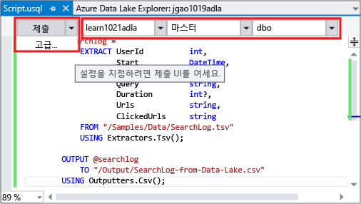
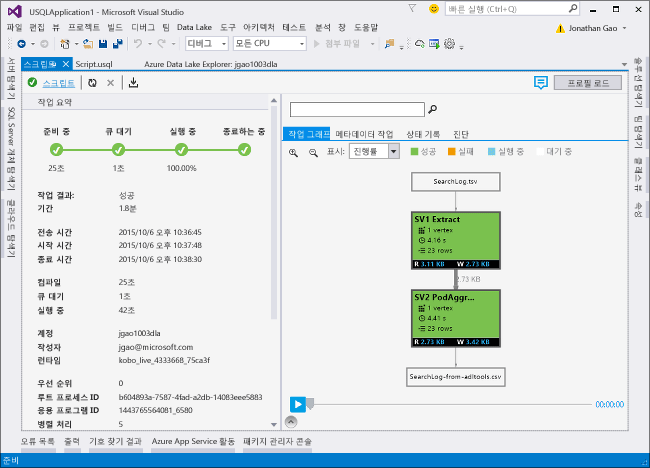

# <a name="develop-u-sql-scripts-by-using-data-lake-tools-for-visual-studio"></a>Data Lake Tools for Visual Studio를 사용하여 U-SQL 스크립트 개발
[!INCLUDE [get-started-selector](../../includes/data-lake-analytics-selector-get-started.md)]

Azure Data Lake 및 Stream Analytics Tools는 두 가지 Azure 서비스, Azure Data Lake Analytics 및 Azure Stream Analytics와 관련된 기능을 포함합니다. Azure Stream Analytics 시나리오에 대한 자세한 내용은 [Azure Stream Analytics Tools for Visual Studio](../stream-analytics/stream-analytics-tools-for-visual-studio-install.md)를 참조하세요.

이 문서에서는 Visual Studio를 사용하여 Azure Data Lake Analytics 계정을 만들고, [U-SQL](data-lake-analytics-u-sql-get-started.md)로 작업을 정의하고, 작업을 Data Lake Analytics 서비스에 제출하는 방법을 설명합니다. 데이터 레이크 분석에 대한 자세한 내용은 [Azure 데이터 레이크 분석 개요](data-lake-analytics-overview.md)를 참조하세요.

>[!IMPORTANT]
> Azure Data Lake Tools for Visual Studio 버전 2.3.3000.4 이상으로 업그레이드하는 것이 좋습니다. 이전 버전은 더 이상 다운로드할 수 없으며 이제 사용되지 않습니다. 
>
>**무엇을 해야 하나요?**
>
>1. 사용 중인 Azure Data Lake Tools for Visual Studio 버전이 2.3.3000.4 미만인지 확인합니다. 
>   
>   
> 
>2. 버전이 2.3.3000.4 미만이면 다운로드 센터를 방문하여 Azure Data Lake Tools for Visual Studio를 업데이트합니다. 
>    - [Visual Studio 2017의 경우](https://marketplace.visualstudio.com/items?itemName=ADLTools.AzureDataLakeandStreamAnalyticsTools)
>    - [Visual Studio 2013 및 2015의 경우](https://www.microsoft.com/en-us/download/details.aspx?id=49504)


## <a name="prerequisites"></a>필수 조건

* **Visual Studio**: Express를 제외한 모든 버전이 지원됩니다.
    * Visual Studio 2017
    * Visual Studio 2015
    * Visual Studio 2013
* **.NET용 Microsoft Azure SDK** 버전 2.7.1 이상.  [웹 플랫폼 설치 관리자](https://www.microsoft.com/web/downloads/platform.aspx)를 사용하여 설치합니다.
* **Data Lake Analytics** 계정. 계정을 만들려면 [Azure Portal을 사용하여 Azure Data Lake Analytics 시작](data-lake-analytics-get-started-portal.md)을 참조하세요.

## <a name="install-azure-data-lake-tools-for-visual-studio"></a>Azure Data Lake Tools for Visual Studio 설치

이 자습서를 실행하려면 Data Lake Tools for Visual Studio가 설치되어 있어야 합니다. [설치 지침](data-lake-analytics-data-lake-tools-install.md)을 따르세요.

## <a name="connect-to-an-azure-data-lake-analytics-account"></a>Azure Data Lake Analytics 계정에 연결

1. Visual Studio를 엽니다.

2. **보기** > **서버 탐색기**를 선택하여 서버 탐색기를 엽니다.

3. **Azure**를 마우스 오른쪽 단추로 클릭합니다. 그런 다음 **Microsoft Azure 구독에 연결**을 클릭하고 지침을 따릅니다.

4. 서버 탐색기에서 선택 **Azure** > **Data Lake Analytics**를 선택합니다. Data Lake Analytics 계정 목록이 표시됩니다.

## <a name="write-your-first-u-sql-script"></a>첫 번째 U-SQL 스크립트 작성

다음 텍스트는 간단한 U-SQL 스크립트입니다. 작은 데이터 세트를 정의하고 이 데이터 세트를 `/data.csv`라는 파일로 기본 Data Lake Store에 기록합니다.

```
USE DATABASE master;
USE SCHEMA dbo;
@a  = 
    SELECT * FROM 
        (VALUES
            ("Contoso", 1500.0),
            ("Woodgrove", 2700.0)
        ) AS 
              D( customer, amount );
OUTPUT @a
    TO "/data.csv"
    USING Outputters.Csv();
```

## <a name="submit-a-data-lake-analytics-job"></a>데이터 레이크 분석 작업 제출

1. **파일** > **새로 만들기** > **프로젝트**를 선택합니다.

2. **U-SQL 프로젝트** 형식을 선택하고 **확인**을 클릭합니다. Visual Studio는 **Script.usql** 파일로 솔루션을 만듭니다.

3. 이전 스크립트를 **Script.usql** 창에 붙여넣습니다.

4. **Script.usql** 창의 왼쪽 위 모서리에서 Data Lake Analytics 계정을 지정합니다.

    

5. **Script.usql** 창의 왼쪽 위 모서리에서 **제출**을 선택합니다.

6. 작업을 제출하면 **작업 보기** 탭이 열리고 작업 진행률이 표시됩니다. 최근 작업 상태를 보고 화면을 새로 고치려면 **새로 고침**을 클릭합니다.

    

   * **작업 요약**에 작업의 요약 정보가 표시됩니다.   
   * **작업 그래프**는 작업의 진행률을 시각화합니다.
   * **메타데이터 작업**에는 U-SQL 카탈로그에서 수행된 모든 작업이 표시됩니다.
   * **데이터**에는 모든 입력 및 출력이 표시됩니다.
   * **상태 기록**은 타임라인 및 상태 세부 정보를 보여줍니다.
   * **AU 분석**은 작업에 사용된 AU 수를 보여주고 다른 AU 할당 전략의 시뮬레이션을 살펴봅니다.
   * **진단**에서는 작업 실행 및 성능 최적화에 대한 고급 분석을 제공합니다.

## <a name="check-job-status"></a>작업 상태 확인

1. 서버 탐색기에서 선택 **Azure** > **Data Lake Analytics**를 선택합니다.

2. Data Lake Analytics 계정 이름을 확장합니다.

3. **작업**을 두 번 클릭합니다.

4. 이전에 제출한 작업을 선택합니다.

## <a name="see-the-job-output"></a>작업 출력 보기

1. 서버 탐색기에서 제출한 작업을 찾습니다.

2. **데이터** 탭을 클릭합니다.

3. **작업 출력** 탭에서 `"/data.csv"` 파일을 선택합니다.

## <a name="next-steps"></a>다음 단계

* [테스트 및 디버깅을 위해 고유한 워크스테이션에서 U-SQL 스크립트 실행](data-lake-analytics-data-lake-tools-local-run.md)
* [Azure Data Lake Tools for Visual Studio Code를 사용한 U-SQL 작업의 C# 코드 디버깅](data-lake-tools-for-vscode-local-run-and-debug.md)
* [Azure Data Lake Tools for Visual Studio Code 사용](data-lake-analytics-data-lake-tools-for-vscode.md)
