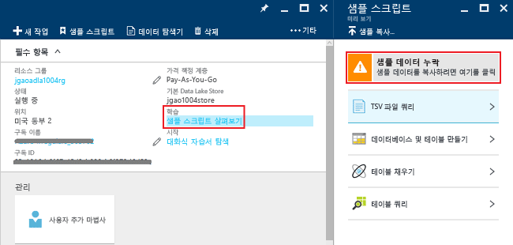

# 자습서: Azure Portal을 사용하여 Azure Data Lake Analytics 시작
[!INCLUDE [get-started-selector](../../includes/data-lake-analytics-selector-get-started.md)]

Azure Portal을 사용하여 Azure Data Lake Analytics 계정을 만들고, [U-SQL](data-lake-analytics-u-sql-get-started.md)로 작업을 정의하고, 작업을 Data Lake Analytics 서비스에 제출하는 방법에 대해 알아봅니다. 데이터 레이크 분석에 대한 자세한 내용은 [Azure 데이터 레이크 분석 개요](data-lake-analytics-overview.md)를 참조하세요.

이 자습서에서는 TSV(탭 분리 값) 파일을 읽고 CSV(쉼표로 구분된 값) 파일로 변환하는 작업을 개발합니다. 지원되는 다른 도구를 사용하여 같은 자습서를 진행하려면 이 섹션의 맨 위에 있는 탭을 클릭하세요. 첫 번째 작업이 완료되면 U-SQL로 더 복잡한 데이터 변환 작성을 시작할 수 있습니다.

## 필수 조건
이 자습서를 시작하기 전에 다음 항목이 있어야 합니다.

* **Azure 구독**. [Azure 무료 평가판](https://azure.microsoft.com/pricing/free-trial/)을 참조하세요.

## 데이터 레이크 분석 계정 만들기
모든 작업을 실행하기 전에 Data Lake Analytics 계정이 있어야 합니다.

각 Data Lake Analytics 계정에는 Azure Data Lake Store 계정 종속성이 있습니다.  이 계정을 기본 데이터 레이크 저장소 계정이라고 합니다.  데이터 레이크 분석 계정을 만들기 전이나 만들 때 데이터 레이크 저장소 계정을 만들 수 있습니다. 이 자습서에는 데이터 레이크 분석 계정과 함께 데이터 레이크 저장소 계정을 만듭니다.

**Data Lake Analytics 계정 만들기**

1. [Azure 포털](https://portal.azure.com)에 로그인합니다.
2. **새로 만들기** >  **인텔리전스 + 분석** > **Data Lake Analytics**를 클릭합니다.
3. 다음 값을 선택합니다.

    

   * **이름**: Data Lake Analytics 계정의 이름을 지정합니다(소문자와 숫자만 허용).
   * **구독**: 분석 계정에 사용할 Azure 구독을 선택합니다.
   * **리소스 그룹**. 기존 Azure 리소스 그룹을 선택하거나 리소스 그룹을 새로 만듭니다.
   * **위치** - 데이터 레이크 분석 계정에 대한 Azure 데이터 센터를 선택합니다.
   * **Data Lake Store**: 지침에 따라 새 Data Lake Store 계정을 만들거나 기존 계정을 선택합니다. 
4. 가격 책정 계층 선택  
5. **만들기**를 클릭합니다. "Azure Data Lake Analytics 배포"를 표시하여 새 타일이 나타나는 포털 홈 화면으로 돌아갑니다. 배포 프로세스는 Data Lake Analytics 계정을 만드는 데 몇 분 정도 걸립니다. 계정이 만들어지면 포털이 새 블레이드에 해당 계정을 엽니다.

데이터 레이크 분석 계정을 만든 후 데이터 레이크 저장소 계정 및 Azure 저장소 계정을 더 추가할 수 있습니다. 자세한 내용은 [데이터 레이크 분석 계정 데이터 소스 관리](data-lake-analytics-manage-use-portal.md)를 참조하세요.

## 원본 데이터 준비
이 자습서에서는 검색 로그를 처리합니다.  검색 로그는 데이터 레이크 저장소 또는 Azure Blob 저장소에 저장할 수 있습니다.

Azure Portal은 검색 로그 파일을 포함하는 기본 Data Lake Store 계정에 샘플 데이터 파일을 복사하는 사용자 인터페이스를 제공합니다.

**샘플 데이터 파일 복사**

1. [Azure Portal](https://portal.azure.com)에서 Data Lake Analytics 계정을 엽니다.  [Data Lake Analytics 계정 관리](data-lake-analytics-get-started-portal.md)를 참조하여 포털에서 계정을 만들고 엽니다.
2. **Essentials** 창을 확장하고 **샘플 스크립트 탐색**을 클릭합니다. **샘플 스크립트**라는 또 다른 블레이드가 열립니다.

    
3. **누락된 샘플 데이터**을 클릭하여 샘플 데이터 파일을 복사합니다. 작업이 완료되면 포털은 **성공적으로 업데이트된 데이터 샘플**를 표시합니다.
4. 데이터 레이크 분석 계정 블레이드의 위쪽에서 **데이터 탐색기** 를 클릭합니다.

    

    두 블레이드가 열립니다. 하나는 **데이터 탐색기**이고 다른 하나는 기본 데이터 레이크 저장소 계정입니다.
5. 기본 Data Lake Store 계정 블레이드에서 **샘플**을 클릭하여 폴더를 확장하고 **데이터**를 클릭하여 폴더를 확장합니다. 다음 파일과 폴더가 표시됩니다.

   * AmbulanceData/
   * AdsLog.tsv
   * SearchLog.tsv
   * version.txt
   * WebLog.log

     이 자습서의 경우 SearchLog.tsv 파일이 표시됩니다.

실제로는, 연결된 저장소 계정에 데이터를 작성하도록 응용 프로그램을 프로그래밍 하거나 데이터를 업로드합니다. 파일 업로드에 대한 내용은 [Data Lake Store에 데이터 업로드](data-lake-analytics-manage-use-portal.md) 또는 [Blob Storage에 데이터 업로드](data-lake-analytics-manage-use-portal.md)를 참조하세요.

## 데이터 레이크 분석 작업 만들기 및 제출하기
원본 데이터를 준비한 후에는 U-SQL 스크립트 개발을 시작할 수 있습니다.  

**작업을 제출하려면**

1. 포털의 데이터 레이크 분석 계정 블레이드에서 **새 작업**을 클릭합니다.

    

    블레이드가 보이지 않으면 [포털에서 데이터 레이크 분석 계정 열기](data-lake-analytics-manage-use-portal.md)를 참조하세요.
2. **작업 이름**을 입력하고 다음 U-SQL 스크립트를 입력합니다.

        @searchlog =
            EXTRACT UserId          int,
                    Start           DateTime,
                    Region          string,
                    Query           string,
                    Duration        int?,
                    Urls            string,
                    ClickedUrls     string
            FROM "/Samples/Data/SearchLog.tsv"
            USING Extractors.Tsv();

        OUTPUT @searchlog   
            TO "/Output/SearchLog-from-Data-Lake.csv"
        USING Outputters.Csv();

    

    이 U-SQL 스크립트는 **Extractors.Tsv()**를 사용하여 원본 데이터 파일을 읽은 다음 **Outputters.Csv()**를 사용하여 csv 파일을 만듭니다.

    원본 파일을 다른 위치에 복사하지 않는 한 두 경로를 수정하지 마세요.  출력 폴더가 없는 경우 Data Lake Analytics에서 해당 폴더를 만듭니다.  이런 경우에는 간단한 상대 경로가 사용됩니다.  

    기본 Data Lake 계정에 저장된 파일의 상대 경로를 사용하는 것이 더 쉽습니다. 절대 경로를 사용할 수도 있습니다.  예를 들면 다음과 같습니다.

        adl://<Data LakeStorageAccountName>.azuredatalakestore.net:443/Samples/Data/SearchLog.tsv

    U-SQL에 대한 자세한 내용은 [Azure Data Lake Analytics U-SQL 언어 시작](data-lake-analytics-u-sql-get-started.md) 및 [U-SQL 언어 참조](http://go.microsoft.com/fwlink/?LinkId=691348)를 참조하세요.

1. 위쪽에서 **작업 제출** 을 클릭합니다.   
2. 작업 상태가 **Succeeded**로 바뀔 때까지 기다립니다. 작업을 완료하는 데 1분 정도 걸릴 수 있습니다.
3. 작업이 실패한 경우 [Data Lake Analytics 작업 모니터링 및 문제 해결](data-lake-analytics-monitor-and-troubleshoot-jobs-tutorial.md)을 참조하세요.
4. 블레이드 하단에서 **출력** 탭을 클릭한 다음 `SearchLog-from-Data-Lake.csv`를 클릭합니다. 출력 파일에 대한 미리 보기, 다운로드, 이름 변경, 삭제가 가능합니다.

    

## 참고 항목

* U-SQL 응용 프로그램 개발을 시작하려면 [Visual Studio용 Data Lake 도구를 사용하여 U-SQL 스크립트 개발](data-lake-analytics-data-lake-tools-get-started.md)을 참조하세요.
* U-SQL을 알아보려면 [Azure Data Lake Analytics U-SQL 언어 시작](data-lake-analytics-u-sql-get-started.md)을 참조하세요.
* 관리 작업을 보려면 [Azure Portal을 사용하여 Azure Data Lake Analytics 관리](data-lake-analytics-manage-use-portal.md)를 참조하세요.

