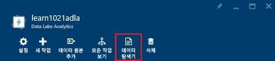
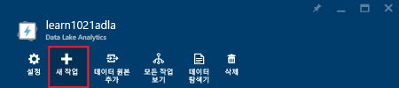
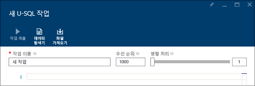
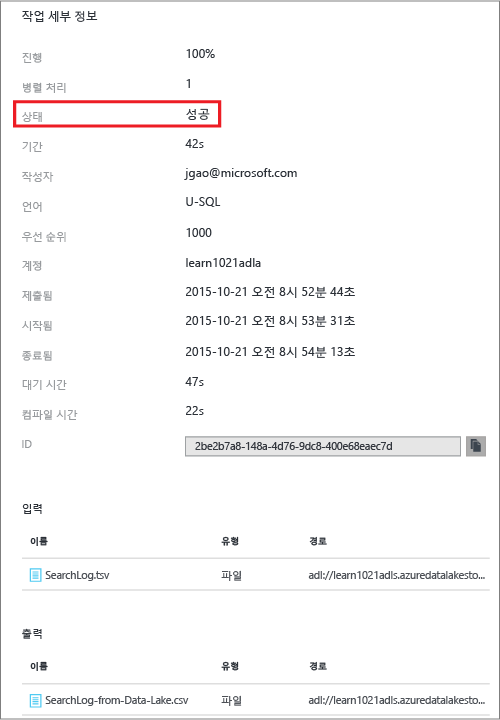
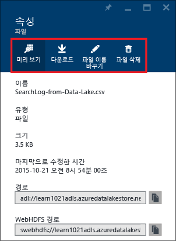

<properties 
   pageTitle="Azure 포털을 사용하여 Azure 데이터 레이크 분석 시작 | Azure" 
   description="Azure 포털을 사용하여 데이터 레이크 분석 계정을 만들고, U-SQL을 사용하여 데이터 레이크 분석 작업을 만들고, 작업을 제출하는 방법에 대해 알아봅니다. " 
   services="data-lake-analytics" 
   documentationCenter="" 
   authors="edmacauley" 
   manager="jhubbard" 
   editor="cgronlun"/>
 
<tags
   ms.service="data-lake-analytics"
   ms.devlang="na"
   ms.topic="hero-article"
   ms.tgt_pltfrm="na"
   ms.workload="big-data" 
   ms.date="05/16/2016"
   ms.author="edmaca"/>

# 자습서: Azure 포털을 사용하여 Azure 데이터 레이크 분석 시작

[AZURE.INCLUDE [get-started-selector](../../includes/data-lake-analytics-selector-get-started.md)]

Azure 포털을 사용하여 Azure 데이터 레이크 분석 계정을 만들고, [U-SQL](data-lake-analytics-u-sql-get-started.md)로 데이터 레이크 분석 작업을 정의하고, 작업을 데이터 레이크 분석 계정에 제출하는 방법에 대해 알아봅니다. 데이터 레이크 분석에 대한 자세한 내용은 [Azure 데이터 레이크 분석 개요](data-lake-analytics-overview.md)를 참조하세요.

이 자습서에서는 TSV(탭 분리 값) 파일을 읽고 CSV(쉼표로 구분된 값) 파일로 변환하는 작업을 개발합니다. 지원되는 다른 도구를 사용하여 같은 자습서를 진행하려면 이 섹션의 맨 위에 있는 탭을 클릭하세요. 첫 번째 작업이 완료되면 U-SQL로 더 복잡한 데이터 변환 작성을 시작할 수 있습니다.

##필수 조건

이 자습서를 시작하기 전에 다음이 있어야 합니다.

- **Azure 구독**. [Azure 무료 평가판](https://azure.microsoft.com/pricing/free-trial/)을 참조하세요.

##데이터 레이크 분석 계정 만들기

모든 작업을 실행하기 전에 Data Lake Analytics 계정이 있어야 합니다.

각 데이터 레이크 분석 계정에는 [Azure 데이터 레이크 저장소]() 계정 종속성이 있습니다. 이 계정을 기본 데이터 레이크 저장소 계정이라고 합니다. 데이터 레이크 분석 계정을 만들기 전이나 만들 때 데이터 레이크 저장소 계정을 만들 수 있습니다. 이 자습서에는 데이터 레이크 분석 계정과 함께 데이터 레이크 저장소 계정을 만듭니다.

**데이터 레이크 분석 계정을 만들려면**

1. 새로운 [Azure 클래식 포털](https://portal.azure.com)에 로그인합니다.
2. **새로 만들기**, **데이터 + 분석** 및 **데이터 레이크 분석**을 차례로 클릭합니다.
6. 다음 값을 입력하거나 선택합니다.

    

	- **이름**: Analytics 계정의 이름을 지정합니다.
	- **Data Lake Store**: 각 Data Lake Analytics 계정에는 종속 Data Lake Store 계정이 있습니다. 데이터 레이크 분석 계정 및 종속 데이터 레이크 저장소 계정은 동일한 Azure 데이터 센터에 있어야 합니다. 지침을 따라 새 데이터 레이크 저장소 계정을 만들거나 기존 계정을 선택합니다.
	- **구독**: 분석 계정에 사용할 Azure 구독을 선택합니다.
	- **리소스 그룹**. 기존 Azure 리소스 그룹을 선택하거나 리소스 그룹을 새로 만듭니다. Azure 리소스 관리자(ARM)를 사용하면 응용 프로그램에서 리소스를 그룹으로 사용할 수 있습니다. 자세한 내용은 [Azure Resource Manager 개요](resource-group-overview.md)를 참조하세요.
	- **위치**. 데이터 레이크 분석 계정에 대한 Azure 데이터 센터를 선택합니다.
7. **시작 보드에 고정**을 선택합니다. 이 자습서를 수행하는 데 필요합니다.
8. **만들기**를 클릭합니다. 포털 시작 보드로 이동됩니다. 새 타일이 "Azure 데이터 레이크 분석 배포" 레이블을 사용하여 시작 보드에 추가됩니다. 데이터 레이크 분석 계정을 만드는 데 몇 분 정도 걸립니다. 계정이 만들어지면 포털이 포털의 새 블레이드에 해당 계정을 엽니다.

	

데이터 레이크 분석 계정을 만든 후 데이터 레이크 저장소 계정 및 Azure 저장소 계정을 더 추가할 수 있습니다. 자세한 내용은 [데이터 레이크 분석 계정 데이터 소스 관리](data-lake-analytics-manage-use-portal.md#manage-account-data-sources)를 참조하세요.

##원본 데이터 준비

이 자습서에서는 몇 가지 검색 로그를 처리합니다. 검색 로그는 데이터 레이크 저장소 또는 Azure Blob 저장소에 저장할 수 있습니다.

Azure 포털은 검색 로그 파일을 포함하는 기본 데이터 레이크 저장소 계정에 샘플 데이터 파일을 복사하는 사용자 인터페이스를 제공합니다.

**샘플 데이터 파일 복사하기**

1. Azure 포털의 왼쪽 위 모서리에서 **Microsoft Azure**를 클릭합니다.
2. 데이터 레이크 분석 계정 이름을 가진 타일을 클릭합니다. 계정을 만들었을 때 여기에 고정되었습니다. 계정이 여기에 고정되어 있지 않은 경우 [포털에서 데이터 레이크 분석 계정 열기](data-lake-analytics-manage-use-portal.md#access-adla-account)를 참조하여 계정을 엽니다.
3. **Essentials** 창을 확장하고 **샘플 작업 탐색**을 클릭합니다. **샘플 작업**이라는 또 다른 블레이드가 열립니다.
4. **샘플 데이터 복사**를 클릭하고 **확인**을 클릭합니다.
5. 종 모양의 **알림** 아이콘을 클릭합니다. **샘플 데이터 업데이트 완료**라고 의미하는 로그가 표시됩니다. 알림 창 외부 아무 곳이나 클릭하여 창을 닫습니다.
7. 데이터 레이크 분석 계정 블레이드의 위쪽에서 **데이터 탐색기**를 클릭합니다.

	

    두 블레이드가 열립니다. 하나는 **데이터 탐색기**이고 다른 하나는 기본 데이터 레이크 저장소 계정입니다.
8. 기본 데이터 레이크 저장소 계정 블레이드에서 **샘플**을 클릭하여 폴더를 확장하고 **데이터**를 클릭하여 폴더를 확장합니다. 다음 파일과 폴더가 표시됩니다.

    - AmbulanceData/
    - AdsLog.tsv
    - SearchLog.tsv
    - version.txt
    - WebLog.log
    
    이 자습서의 경우 SearchLog.tsv 파일이 표시됩니다.

실제로는, 연결된 저장소 계정에 데이터를 작성하도록 응용 프로그램을 프로그래밍 하거나 데이터를 업로드합니다. 파일 업로드에 대한 내용은 [Data Lake Store에 데이터 업로드](data-lake-analytics-manage-use-portal.md#upload-data-to-adls) 또는 [Blob 저장소에 데이터 업로드](data-lake-analytics-manage-use-portal.md#upload-data-to-wasb)를 참조하세요.

##데이터 레이크 분석 작업 만들기 및 제출하기

원본 데이터를 준비한 후에는 U-SQL 스크립트 개발을 시작할 수 있습니다.

**작업을 제출하려면**

1. 포털의 데이터 레이크 분석 계정 블레이드에서 **새 작업**을 클릭합니다.

	

    블레이드가 보이지 않으면 [포털에서 데이터 레이크 분석 계정 열기](data-lake-analytics-manage-use-portal.md#access-adla-account)를 참조하세요.
4. **작업 이름**을 입력하고 다음 U-SQL 스크립트를 입력합니다.

	

        @searchlog =
            EXTRACT UserId          int,
                    Start           DateTime,
                    Region          string,
                    Query           string,
                    Duration        int?,
                    Urls            string,
                    ClickedUrls     string
            FROM "/Samples/Data/SearchLog.tsv"
            USING Extractors.Tsv();
        
        OUTPUT @searchlog   
            TO "/Output/SearchLog-from-Data-Lake.csv"
        USING Outputters.Csv();

	이 U-SQL 스크립트는 **Extractors.Tsv()**를 사용하여 원본 데이터 파일을 읽은 다음 **Outputters.Csv()**를 사용하여 csv 파일을 만듭니다.
    
    원본 파일을 다른 위치에 복사하지 않는 한 두 경로를 수정하지 마세요. 출력 폴더가 없는 경우 데이터 레이크 분석에서 해당 폴더를 만듭니다. 이런 경우에는 간단한 상대 경로가 사용됩니다.
	
	기본 Data Lake 계정에 저장된 파일의 상대 경로를 사용하는 것이 더 쉽습니다. 절대 경로를 사용할 수도 있습니다. 예를 들면 다음과 같습니다.
    
        adl://<Data LakeStorageAccountName>.azuredatalakestore.net:443/Samples/Data/SearchLog.tsv
      

    U-SQL에 대한 자세한 내용은 [Azure Data Lake Analytics U-SQL 언어 시작](data-lake-analytics-u-sql-get-started.md) 및 [U-SQL 언어 참조](http://go.microsoft.com/fwlink/?LinkId=691348)를 참조하세요.
     
5. 위쪽에서 **작업 제출**을 클릭합니다. 새 작업 세부 정보 창이 열립니다. 제목 표시줄에 작업 상태가 표시됩니다.
6. 작업 상태가 **Succeeded**로 바뀔 때까지 기다립니다. 작업이 완료되면 포털의 새 블레이드에 작업 세부 정보가 열립니다.

    

    이전 스크린샷을 통해 제출됨에서 종료됨까지 작업을 완료하는데 대략 1.5분이 소요된 것을 볼 수 있습니다.
    
    작업이 실패한 경우 [데이터 레이크 분석 작업 모니터링 및 문제 해결](data-lake-analytics-monitor-and-troubleshoot-jobs-tutorials.md)을 참조하세요.

7. **작업 세부 정보** 블레이드의 아래쪽에서 **SearchLog-from-Data-Lake.csv**에 포함된 작업 이름을 클릭합니다. 출력 파일에 대한 미리 보기, 다운로드, 이름 변경, 삭제가 가능합니다.

    
8. 출력 파일을 보려면 **미리 보기**를 클릭합니다.

    

##참고 항목

- 더 복잡한 쿼리를 보려면 [Azure Data Lake Analytics을 사용하여 웹 사이트 로그 분석](data-lake-analytics-analyze-weblogs.md)을 참조하세요.
- U-SQL 응용 프로그램 개발을 시작하려면 [Visual Studio용 Data Lake 도구를 사용하여 U-SQL 스크립트 개발](data-lake-analytics-data-lake-tools-get-started.md)을 참조하세요.
- U-SQL을 알아보려면 [Azure Data Lake Analytics U-SQL 언어 시작](data-lake-analytics-u-sql-get-started.md)을 참조하세요.
- 관리 작업을 보려면 [Azure 포털을 사용하여 Azure Data Lake Analytics 관리](data-lake-analytics-manage-use-portal.md)를 참조하세요.
- Data Lake Analytics에 대한 개요를 보려면 [Azure Data Lake Analytics 개요](data-lake-analytics-overview.md)를 참조하세요.
- 다른 도구를 사용하여 같은 자습서를 보려면 페이지 맨 위의 탭 선택기를 클릭합니다.
- 진단 정보를 기록하려면 [Azure Data Lake Analytics에 대한 진단 로그에 액세스](data-lake-analytics-diagnostic-logs.md)를 참조하세요.

<!-----HONumber=AcomDC_0921_2016-->