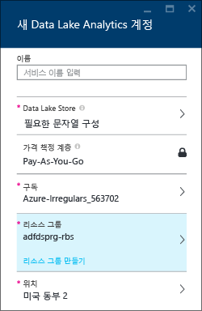
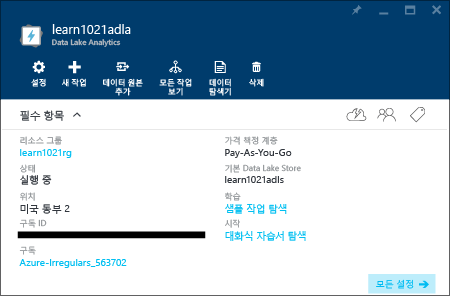
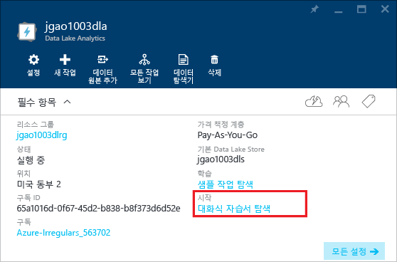

<properties 
   pageTitle="Azure 포털 대화형 자습서를 사용하여 데이터 레이크 분석 및 U-SQL 알아보기 | Azure" 
   description="데이터 레이크 분석 및 U-SQL 학습을 빠르게 시작합니다. " 
   services="data-lake-analytics" 
   documentationCenter="" 
   authors="edmacauley" 
   manager="jhubbard" 
   editor="cgronlun"/>
 
<tags
   ms.service="data-lake-analytics"
   ms.devlang="na"
   ms.topic="get-started-article"
   ms.tgt_pltfrm="na"
   ms.workload="big-data" 
   ms.date="05/16/2016"
   ms.author="edmaca"/>

# Azure 데이터 레이크 분석 대화형 자습서 사용

Azure 포털은 데이터 레이크 분석을 시작하기 위한 대화형 자습서를 제공합니다. 이 문서에서는 웹 사이트 로그 분석에 대한 자습서를 진행하는 방법을 보여 줍니다.

>[AZURE.NOTE] Visual Studio를 사용하여 같은 자습서를 진행하려는 경우 [데이터 레이크 분석을 사용하여 웹 사이트 로그 분석](data-lake-analytics-analyze-weblogs.md)을 참조하세요. 포털에 더 많은 대화형 자습서가 추가되어 있습니다.

다른 자습서를 보려면 다음을 참조하세요.

- [Azure 포털을 사용하여 데이터 레이크 분석 시작](data-lake-analytics-get-started-portal.md)
- [Azure PowerShell을 사용하여 데이터 레이크 분석 시작](data-lake-analytics-get-started-powershell.md)
- [.NET SDK를 사용하여 데이터 레이크 분석 시작](data-lake-analytics-get-started-net-sdk.md)
- [Visual Studio용 데이터 레이크 도구를 사용하여 U-SQL 스크립트 개발](data-lake-analytics-data-lake-tools-get-started.md)

**필수 구성 요소**

이 자습서를 시작하기 전에 다음이 있어야 합니다.

- **데이터 레이크 분석 계정**. [Azure 포털을 사용하여 Azure 데이터 레이크 분석 시작](data-lake-analytics-get-started-portal.md)을 참조하세요.

##데이터 레이크 분석 계정 만들기 

모든 작업을 실행하기 전에 Data Lake Analytics 계정이 있어야 합니다.

각 데이터 레이크 분석 계정에는 [Azure 데이터 레이크 저장소](../data-lake-store/data-lake-store-overview.md) 계정 종속성이 있습니다. 이 계정을 기본 데이터 레이크 저장소 계정이라고 합니다. 데이터 레이크 분석 계정을 만들기 전이나 만들 때 데이터 레이크 저장소 계정을 만들 수 있습니다. 이 자습서에는 분석 계정과 함께 데이터 레이크 저장소 계정을 만듭니다.

**데이터 레이크 분석 계정을 만들려면**

1. [Azure 포털](https://portal.azure.com/signin/index/?Microsoft_Azure_Kona=true&Microsoft_Azure_DataLake=true&hubsExtension_ItemHideKey=AzureDataLake_BigStorage%2cAzureKona_BigCompute)에 로그인합니다.
2. 왼쪽 위 모서리에서 **Microsoft Azure**를 클릭하여 시작 보드를 엽니다.
3. **마켓플레이스** 타일을 클릭합니다.
3. **모두** 블레이드의 검색 상자에 **Azure 데이터 레이크 분석**을 입력하고 **ENTER** 키를 누릅니다. 목록에 **Azure 데이터 레이크 분석**이 표시됩니다.
4. 목록에서 **Azure 데이터 레이크 분석**을 클릭합니다.
5. 블레이드 하단에서 **만들기**를 클릭합니다.
6. 다음 값을 입력하거나 선택합니다.

    

	- **이름**: Analytics 계정의 이름을 지정합니다.
	- **Data Lake Store**: 각 Data Lake Analytics 계정에는 종속 Data Lake Store 계정이 있습니다. 데이터 레이크 분석 계정 및 종속 데이터 레이크 저장소 계정은 동일한 Azure 데이터 센터에 있어야 합니다. 지침을 따라 새 데이터 레이크 저장소 계정을 만들거나 기존 계정을 선택합니다.
	- **구독**: 분석 계정에 사용할 Azure 구독을 선택합니다.
	- **리소스 그룹**. 기존 Azure 리소스 그룹을 선택하거나 리소스 그룹을 새로 만듭니다. 응용 프로그램은 일반적으로 웹앱, 데이터베이스, 데이터베이스 서버, 저장소 및 타사 서비스 등 많은 구성 요소로 구성됩니다. ARM(Azure 리소스 관리자)을 사용하면 Azure 리소스 그룹이라고 하는 그룹으로 응용 프로그램에서 리소스와 함께 사용할 수 있습니다. 응용 프로그램에 대한 모든 리소스의 배포, 업데이트, 모니터링 또는 삭제를 조정된 단일 작업으로 수행할 수 있습니다. 배포용 템플릿을 사용하고 이 템플릿을 테스트, 스테이징 및 프로덕션과 같은 여러 환경에서 사용할 수 있습니다. 전체 그룹에 대한 롤업 비용을 확인하여 조직에 요금 청구를 명확히 할 수 있습니다. 자세한 내용은 [Azure 리소스 관리자 개요](resource-group-overview.md)를 참조하세요.
	- **위치**. 데이터 레이크 분석 계정에 대한 Azure 데이터 센터를 선택합니다.
7. **시작 보드에 고정**을 선택합니다. 이 자습서를 수행하는 데 필요합니다.
8. **만들기**를 클릭합니다. 포털 시작 보드로 이동됩니다. 새 타일이 "Azure 데이터 레이크 분석 배포" 레이블을 사용하여 홈 페이지에 추가됩니다. 데이터 레이크 분석 계정을 만드는 데 몇 분 정도 걸립니다. 계정이 만들어지면 포털이 새 블레이드에 해당 계정을 엽니다.

	

##웹 사이트 로그 분석 대화형 자습서 실행

**웹 사이트 로그 분석 대화형 자습서를 열려면**

1. 포털의 왼쪽 메뉴에서 **Microsoft Azure**를 클릭하고 시작 보드를 엽니다.
2. 데이터 레이크 분석 계정에 연결된 타일을 클릭합니다.
3. **필수** 모음에서 **Explore interactive tutorials**(대화형 자습서 탐색)를 클릭합니다.

	

4. "Samples not set up, click ...”(샘플이 설정되지 않았습니다. ... 클릭하세요.)라는 주황색 경고가 표시되는 경우 **Copy Sample Data**(샘플 데이터 복사)를 클릭하여 샘플 데이터를 기본 데이터 레이크 저장소 계정에 복사합니다. 대화형 자습서에는 실행할 데이터가 필요합니다.
5. **Interactive Tutorials**(대화형 자습서) 블레이드에서 **Website Log Analytics**(웹 사이트 로그 분석)를 클릭합니다. 포털이 새 포털 블레이드에 자습서를 엽니다.
5. **1 소개**를 클릭하고 지침을 따릅니다.

##참고 항목

- [Microsoft Azure 데이터 레이크 분석 개요](data-lake-analytics-overview.md)
- [Azure 포털을 사용하여 데이터 레이크 분석 시작](data-lake-analytics-get-started-portal.md)
- [Azure PowerShell을 사용하여 데이터 레이크 분석 시작](data-lake-analytics-get-started-powershell.md)
- [Visual Studio용 데이터 레이크 도구를 사용하여 U-SQL 스크립트 개발](data-lake-analytics-data-lake-tools-get-started.md)
- [Azure 데이터 레이크 분석을 사용하여 웹 사이트 로그 분석](data-lake-analytics-analyze-weblogs.md)

<!-----HONumber=AcomDC_0914_2016-->