# Azure Data Lake Storage Gen1의 액세스 제어

Azure Data Lake Storage Gen1은 HDFS에서 파생된 액세스 제어 모델을 구현하고, HDFS는 POSIX 액세스 제어 모델에서 파생됩니다. 이 문서에서는 Data Lake Storage Gen1에 대한 액세스 제어 모델의 기본 사항을 요약합니다. HDFS 액세스 제어 모델에 대해 자세히 알아보려면 [HDFS 권한 가이드](https://hadoop.apache.org/docs/current/hadoop-project-dist/hadoop-hdfs/HdfsPermissionsGuide.html)(영문)를 참조하세요.

## 파일 및 폴더에 대한 액세스 제어 목록

**액세스 ACL** 및 **기본 ACL**이라는 두 가지 ACL(액세스 제어 목록)이 있습니다.

* **액세스 ACL** – 개체에 대한 액세스를 제어합니다. 파일과 폴더에는 모두 액세스 ACL이 있습니다.

* **기본 ACL** - 해당 폴더 아래에 만든 모든 자식 항목에 대한 액세스 ACL을 결정하는 폴더와 연결된 ACL의 "템플릿"입니다. 파일에는 기본 ACL이 없습니다.

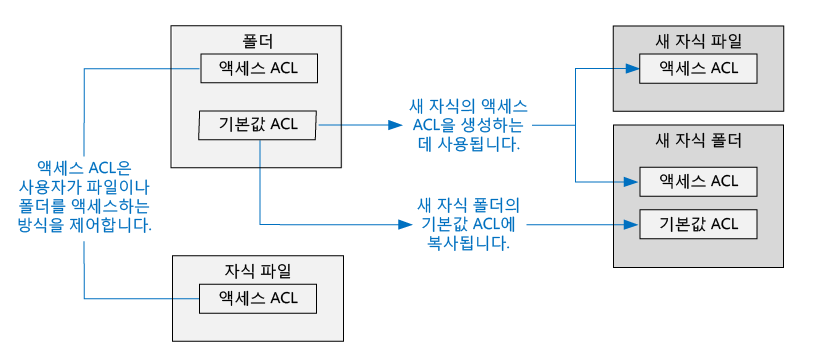

액세스 ACL 및 기본 ACL은 모두 구조가 동일합니다.

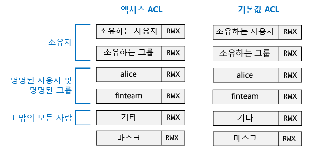

> [!NOTE]
> 부모 항목에서 기본 ACL을 변경하면 이미 존재하는 자식 항목의 액세스 ACL 또는 기본 ACL에 적용되지 않습니다.
>
>

## 사용자 및 ID

모든 파일 및 폴더에는 이러한 ID에 대한 고유한 사용 권한이 있습니다.

* 파일을 소유한 사용자
* 소유 그룹
* 명명된 사용자
* 명명된 그룹
* 기타 모든 사용자

사용자 및 그룹의 ID는 Azure AD(Azure Active Directory) ID입니다. 달리 설명하지 않는 한 Data Lake Storage Gen1의 컨텍스트에서 "사용자"는 Azure AD 사용자 또는 Azure AD 보안 그룹을 의미할 수 있습니다.

## 권한

파일 시스템 개체에 대한 권한은 **읽기**, **쓰기** 및 **실행**이며 아래 표에서 보여 주듯이 파일과 폴더에 사용할 수 있습니다.

|            |    파일     |   폴더 |
|------------|-------------|----------|
| **읽기(R)** | 파일의 내용을 읽을 수 있습니다. | 폴더의 내용을 나열하려면 **읽기** 및 **실행**이 필요합니다.|
| **쓰기(W)** | 쓰거나 파일에 추가할 수 있습니다. | 폴더에 자식 항목을 만들려면 **쓰기** 및 **실행**이 필요합니다. |
| **실행(X)** | Data Lake Storage Gen1의 컨텍스트에서 아무것도 의미하지 않습니다. | 폴더의 자식 항목을 트래버스하는 데 필요합니다. |

### 사용 권한에 대한 짧은 형식

**RWX**는 **읽기 + 쓰기 + 실행**을 나타내는 데 사용됩니다. **읽기=4**, **쓰기=2** 및 **실행=1**의 압축된 숫자 형식이 있으며, 그 합계는 권한을 나타냅니다. 다음은 몇 가지 예입니다.

| 숫자 형식 | 짧은 형식 |      의미     |
|--------------|------------|------------------------|
| 7            | RWX        | 읽기 + 쓰기 + 실행 |
| 5            | R-X        | 읽기 + 실행         |
| 4            | R--        | 읽기                   |
| 0            | ---        | 사용 권한 없음         |

### 사용 권한은 상속하지 않습니다.

Data Lake Storage Gen1에서 사용하는 POSIX 스타일 모델에서 항목에 대한 권한은 항목 자체에 저장됩니다. 즉, 항목에 대한 사용 권한은 부모 항목에서 상속될 수 없습니다.

## 사용 권한과 관련된 일반적인 시나리오

Data Lake Storage Gen1 계정에서 특정 작업을 수행하는 데 필요한 권한을 이해하는 데 도움이 되는 몇 가지 일반적인 시나리오는 다음과 같습니다.

### 파일을 읽는 데 필요한 사용 권한

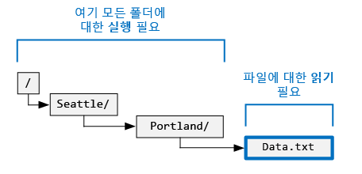

* 읽을 파일의 경우 호출자에 **읽기** 권한이 필요합니다.
* 파일을 포함하는 폴더 구조에 있는 모든 폴더의 경우 호출자에 **실행** 권한이 필요합니다.

### 파일에 추가하는 데 필요한 사용 권한

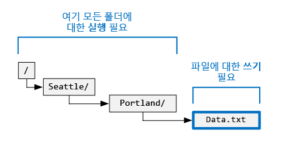

* 추가할 파일의 경우 호출자에 **쓰기** 권한이 필요합니다.
* 파일을 포함하는 모든 폴더의 경우 호출자에 **실행** 권한이 필요합니다.

### 파일을 삭제하는 데 필요한 사용 권한

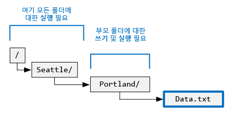

* 부모 폴더의 경우 호출자에 **쓰기 + 실행** 권한이 필요합니다.
* 파일의 경로에 있는 다른 모든 폴더의 경우 호출자에 **실행** 권한이 필요합니다.

> [!NOTE]
> 위의 두 조건이 참(true)이면 파일에 대한 쓰기 권한은 파일을 삭제하는 데 필요하지 않습니다.
>
>

### 폴더를 열거하는 데 필요한 사용 권한

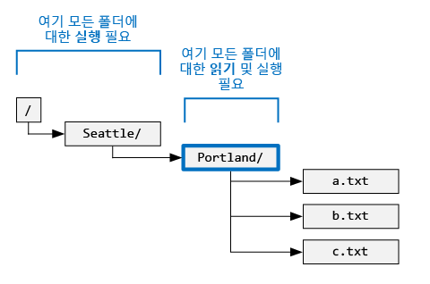

* 열거할 폴더의 경우 호출자에 **읽기 + 실행** 권한이 필요합니다.
* 모든 상위 폴더의 경우 호출자에 **실행** 권한이 필요합니다.

## Azure Portal에서 사용 권한 보기

Data Lake Storage Gen1 계정의 **데이터 탐색기** 블레이드에서 **액세스**를 클릭하여 데이터 탐색기에서 보고 있는 파일이나 폴더에 대한 ACL을 확인합니다. **액세스**를 클릭하여 **mydatastore** 계정 아래의 **catalog** 폴더에 대한 ACL을 확인합니다.

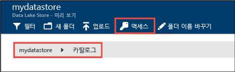

이 블레이드의 맨 위 섹션에 소유자 권한이 표시됩니다. (스크린샷에서 소유 사용자는 Bob입니다.) 그런 다음, 할당된 액세스 ACL이 표시됩니다. 

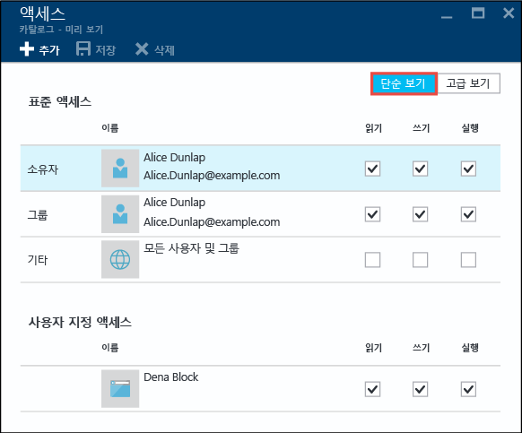

기본 ACL, 마스크 및 슈퍼 사용자의 설명이 표시된 자세한 고급 보기를 보려면 **고급 보기**를 클릭합니다.  이 블레이드는 또한 현재 폴더의 권한에 따라 자식 파일 및 폴더에 대한 액세스 및 기본 ACL을 재귀적으로 설정하는 방법을 제공합니다.

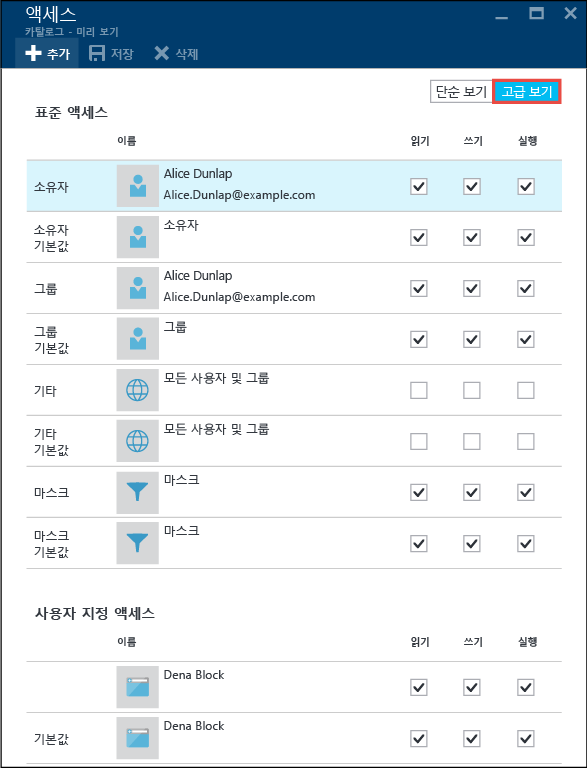

## 슈퍼 사용자

슈퍼 사용자는 Data Lake Store의 모든 사용자 중 가장 많은 권한을 가집니다. 슈퍼 사용자의 권한은 다음과 같습니다.

* **모든** 파일과 폴더에 대한 RWX 권한을 가집니다.
* 모든 파일이나 폴더에 대한 권한을 변경할 수 있습니다.
* 모든 파일이나 폴더의 소유 사용자 또는 소유 그룹을 변경할 수 있습니다.

Azure에서 Data Lake Storage Gen1 계정에는 다음을 포함하여 몇 가지 Azure 역할이 있습니다.

* 소유자
* 참가자
* 읽기 권한자

Data Lake Storage Gen1 계정에 대한 **소유자** 역할이 있는 사용자는 자동으로 해당 계정에 대한 슈퍼 사용자입니다. 자세한 내용은 [역할 기반 액세스 제어](../role-based-access-control/role-assignments-portal.md)를 참조하세요.
슈퍼 사용자 권한이 있는 사용자 지정 RBAC(역할 기반 액세스 제어) 역할을 만들려면 다음 권한이 있어야 합니다.
- Microsoft.DataLakeStore/accounts/Superuser/action
- Microsoft.Authorization/roleAssignments/write

## 소유 그룹

항목을 만든 사용자는 자동으로 항목의 소유 사용자가 됩니다. 소유 사용자는 다음을 수행할 수 있습니다.

* 소유한 파일의 권한을 변경합니다.
* 소유 사용자가 대상 그룹의 멤버이면 소유한 파일의 소유 그룹을 변경합니다.

> [!NOTE]
> 소유 사용자는 파일 또는 폴더의 소유 사용자를 *변경할 수 없습니다*. 슈퍼 사용자만이 파일이나 폴더의 소유 사용자를 변경할 수 있습니다.
>
>

## 소유 그룹

POSIX ACL에서 모든 사용자는 "주 그룹"과 연결됩니다. 예를 들어 "alice" 사용자는 "finance" 그룹에 속할 수 있습니다. 또한 Alice는 여러 그룹에 속할 수 있지만 항상 한 그룹을 주 그룹으로 지정합니다. POSIX에서 Alice가 파일을 만들 때는 해당 파일의 소유 그룹이 자신의 주 그룹(여기서는 "finance"임)으로 설정됩니다.

새 파일 시스템 항목을 만들면 Data Lake Storage Gen1은 소유 그룹에 값을 할당합니다.

* **사례 1** - "/" 루트 폴더입니다. 이 폴더는 Data Lake Storage Gen1 계정이 만들어질 때 생성됩니다. 이 경우 소유 그룹은 계정을 만든 사용자로 설정됩니다.
* **사례 2**(기타 모든 경우) - 새 항목을 만들 때 소유 그룹이 부모 폴더에서 복사됩니다.

그렇지 않으면 소유 그룹은 다른 사용자/그룹에 할당된 사용 권한과 유사하게 동작합니다.

소유 그룹은 다음에 의해 변경될 수 있습니다.
* 모든 슈퍼 사용자
* 소유 사용자가 대상 그룹의 구성원이기도 한 경우 소유 사용자입니다.

> [!NOTE]
> 소유 그룹은 파일 또는 폴더의 ACL을 *변경할 수 없습니다*.  소유 그룹은 루트 폴더의 경우 계정을 만든 사용자로 설정되지만 위의 **사례 1**, 단일 사용자 계정은 소유 그룹을 통한 권한 제공에 적합하지 않습니다.  해당하는 경우 올바른 사용자 그룹에 이 권한을 할당할 수 있습니다.

## 액세스 검사 알고리즘

다음 그림은 Data Lake Storage Gen1 계정에 대한 액세스 검사 알고리즘을 나타냅니다.

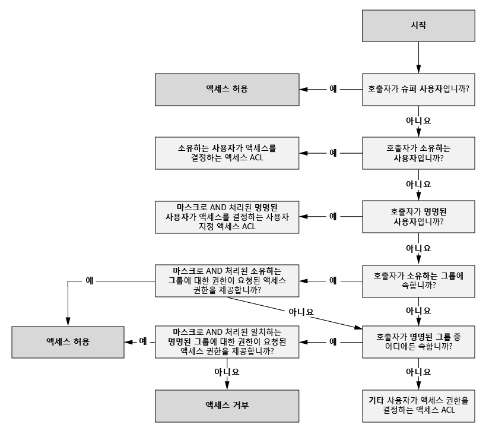

## 마스크 및 "유효 사용 권한"

**마스크**는 액세스 검사 알고리즘을 수행할 때 **명명된 사용자**, **소유 그룹** 및 **명명된 그룹**에 대한 액세스를 제한하는 데 사용되는 RWX 값입니다. 마스크에 대한 핵심 개념은 다음과 같습니다.

* 마스크는 "유효 권한"을 만듭니다. 즉 액세스 검사 시 권한을 수정합니다.
* 파일 소유자와 모든 슈퍼 사용자가 마스크를 직접 편집할 수 있습니다.
* 마스크는 권한을 제거하여 유효 권한을 만들 수 있지만, 유효 권한에 권한을 *추가할 수는 없습니다* .

몇 가지 예를 살펴보겠습니다. 다음 예에서 마스크는 **RWX**로 설정되어 있습니다. 즉 마스크에서 어떤 권한도 제거하지 않습니다. 명명된 사용자, 소유 그룹 및 명명된 그룹에 대한 유효 권한은 액세스 검사 중에 변경되지 않습니다.

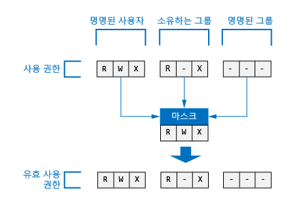

다음 예에서 마스크는 **R-X**로 설정됩니다. 이는 액세스 검사 시 **명명된 사용자**, **소유 그룹** 및 **명명된 그룹**에 대한 **쓰기 권한을 해제함**을 의미합니다.

참조를 위해 Azure Portal에서 파일이나 폴더에 대한 마스크를 표시하는 위치는 다음과 같습니다.

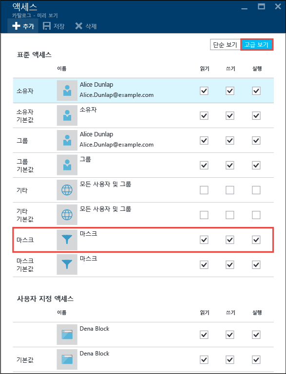

> [!NOTE]
> 새 Data Lake Storage Gen1 계정의 경우 루트 폴더(“/”)의 액세스 ACL에 대한 마스크는 기본적으로 RWX를 사용합니다.
>
>

## 새 파일 및 폴더에 대한 사용 권한

기존 폴더에서 새 파일이나 폴더를 만들 때 부모 폴더에 대한 기본 ACL은 다음 항목을 결정합니다.

- 자식 폴더의 기본 ACL 및 액세스 ACL
- 자식 파일의 액세스 ACL(파일에 기본 ACL이 없는 경우)

### 자식 파일이나 폴더의 액세스 ACL

자식 파일이나 폴더를 만들 때 부모의 기본 ACL이 자식 파일이나 폴더의 액세스 ACL로 복사됩니다. 또한 **다른** 사용자가 부모의 기본 ACL에서 RWX 권한을 가지고 있으면 자식 항목의 액세스 ACL에서 RWX 권한이 제거됩니다.

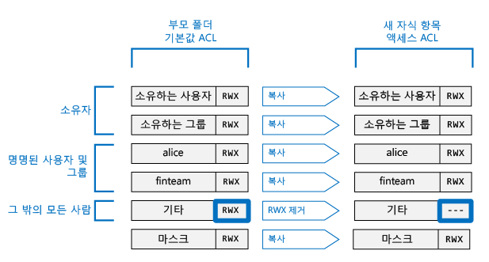

대부분의 시나리오에서 자식 항목의 액세스 ACL을 결정하는 방법에 대해 알아야 할 것은 모두 위의 내용과 같습니다. 하지만 POSIX 시스템에 잘 알고 있으며 이 변환이 수행되는 방법을 자세히 이해하려면 이 문서의 뒷부분에서 [새 파일 및 폴더에 대한 액세스 ACL을 만드는 Umask의 역할](#umasks-role-in-creating-the-access-acl-for-new-files-and-folders) 섹션을 참조하세요.

### 자식 폴더의 기본 ACL

부모 폴더 아래에 자식 폴더를 만들 때 부모 폴더의 기본 ACL이 있는 그대로 자식 폴더의 기본 ACL에 복사됩니다.

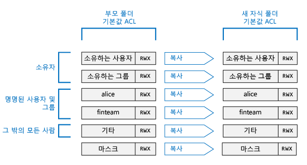

## Data Lake Storage Gen1에서 ACL을 이해하기 위한 고급 항목

Data Lake Storage Gen1 파일이나 폴더에 대한 ACL을 결정하는 방법을 이해하는 데 도움이 되는 몇 가지 고급 항목은 다음과 같습니다.

### 새 파일 및 폴더에 대한 액세스 ACL을 만드는 Umask의 역할

POSIX 호환 시스템에서 일반적인 개념은 umask가 새 자식 파일이나 폴더의 액세스 ACL에서 **소유 사용자**, **소유 그룹** 및 **기타**에 대한 권한을 변환하는 데 사용되는 부모 폴더의 9비트 값이라는 점입니다. umask의 비트는 자식 항목의 액세스 ACL에서 해제되는 비트를 식별합니다. 따라서 **소유 사용자**, **소유 그룹** 및 **기타**에 대한 권한이 전파되지 않도록 선택적으로 방지하는 데 사용됩니다.

HDFS 시스템에서 umask는 일반적으로 관리자가 제어하는 사이트 전체 구성 옵션입니다. Data Lake Storage Gen1은 변경할 수 없는 **계정 차원의 umask**를 사용합니다. 다음 표에서는 Data Lake Storage Gen1의 마스크 해제를 보여 줍니다.

| 사용자 그룹  | 설정 | 새 자식 항목의 액세스 ACL에 미치는 영향 |
|------------ |---------|---------------------------------------|
| 소유 사용자 | ---     | 영향 없음                             |
| 소유 그룹| ---     | 영향 없음                             |
| 다른       | RWX     | 읽기 + 쓰기 + 실행 제거         |

다음 그림에서는 이 umask가 작동하는 것을 보여 줍니다. 순수 영향은 **다른** 사용자에 대한 **읽기 + 쓰기 + 실행**을 삭제하는 것입니다. umask가 **소유 사용자** 및 **소유 그룹**에 대한 비트를 지정하지 않았기 때문에 이러한 권한은 변환되지 않습니다.

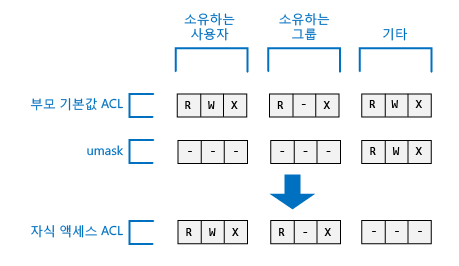

### 고정 비트

고정 비트는 POSIX 파일 시스템의 고급 기능입니다. Data Lake Storage Gen1의 컨텍스트에서 고정 비트가 필요할 가능성은 없습니다.

아래 표에서는 Data Lake Storage Gen1에서 고정 비트가 작동하는 방식을 보여줍니다.

| 사용자 그룹         | 파일    | 폴더 |
|--------------------|---------|-------------------------|
| 고정 비트 **끄기** | 영향 없음   | 영향을 주지 않습니다.           |
| 고정 비트 **켜기**  | 영향 없음   | 자식 항목의 **슈퍼 사용자** 및 **소유 사용자**를 제외하고 누구도 해당 자식 항목의 이름을 삭제하거나 바꾸지 않도록 방지합니다.               |

고정 비트는 Azure Portal에서 표시하지 않습니다.

## Data Lake Storage Gen1의 ACL에 대한 일반적인 질문

Data Lake Storage Gen1의 ACL에 대해 자주 제기되는 몇 가지 질문은 다음과 같습니다.

### ACL에 대한 지원을 사용하도록 설정해야 하나요?

아니요. ACL을 통한 액세스 제어는 Data Lake Storage Gen1 계정에 대해 항상 켜져 있습니다.

### 폴더 및 해당 내용을 재귀적으로 삭제하는 데 필요한 권한은 무엇인가요?

* 부모 폴더에는 **쓰기 + 실행** 권한이 있어야 합니다.
* 삭제할 폴더와 그 안의 모든 폴더에는 **읽기 + 쓰기 + 실행** 권한이 필요합니다.

> [!NOTE]
> 폴더의 파일을 삭제하는 데에는 쓰기 권한이 필요하지 않습니다. 또한 "/" 루트 폴더는 **절대로** 삭제할 수 없습니다.
>
>

### 파일이나 폴더의 소유자는 누구인가요?

파일 또는 폴더의 작성자는 소유자가 됩니다.

### 파일이나 폴더를 만들 때 소유 그룹으로 설정되는 그룹은 무엇인가요?

소유 그룹은 새 파일이나 폴더가 만들어지는 부모 폴더의 소유 그룹에서 복사됩니다.

### 파일의 소유 사용자이지만 필요한 RWX 사용 권한이 없습니다. 어떻게 해야 합니까?

소유 사용자는 파일의 권한을 변경하여 필요한 RWX 권한을 부여할 수 있습니다.

### Azure Portal에서 ACL을 확인할 때는 사용자 이름이 표시되지만 API를 통해 확인할 때는 GUID가 표시되는 이유는 무엇인가요?

ACL의 항목은 Azure AD의 사용자에 해당하는 GUID로 저장됩니다. API는 GUID를 있는 그대로 반환합니다. Azure Portal은 가능한 경우 GUID를 친숙한 이름으로 변환하여 ACL을 보다 쉽게 사용하려고 합니다.

### Azure Portal을 사용할 때 때때로 ACL에 GUID가 표시되는 이유는 무엇인가요?

사용자가 Azure AD에 더 이상 존재하지 않으면 GUID가 표시됩니다. 일반적으로 사용자가 퇴사하거나 Azure AD에서 해당 계정이 삭제될 때 이러한 현상이 발생합니다.

### Data Lake Storage Gen1이 ACL의 상속을 지원하나요?

아니요, 기본 ACL은 자식 파일과 부모 폴더에서 새로 만든 자식 파일 및 폴더에 대해 ACL을 설정하는 데 사용할 수 있습니다.  

### 마스크와 umask 간의 차이는 무엇인가요?

| 마스크 | umask|
|------|------|
| **마스크** 속성은 모든 파일 및 폴더에서 사용할 수 있습니다. | **umask**는 Data Lake Storage Gen1 계정의 속성입니다. 따라서 Data Lake Storage Gen1에는 단 하나의 umask만 있습니다.    |
| 파일의 소유 사용자 또는 소유 그룹이나 슈퍼 사용자는 파일 또는 폴더에 대한 마스크 속성을 변경할 수 있습니다. | 슈퍼 사용자를 포함한 모든 사용자는 umask 속성을 수정할 수 없습니다. 변경할 수 없는 상수 값입니다.|
| mask 속성은 런타임 시 액세스 검사 알고리즘에서 사용되어 사용자가 파일이나 폴더의 작업에서 수행할 수 있는 권한을 가지고 있는지 확인합니다. 마스크의 역할은 액세스 확인 시 "유효 사용 권한"을 만드는 것입니다. | umask는 액세스 검사 중에 전혀 사용되지 않습니다. umask는 폴더의 새 자식 항목에서 액세스 ACL을 결정하는 데 사용됩니다. |
| 마스크는 액세스 확인 시 명명된 사용자, 소유 그룹 및 명명된 그룹에 적용되는 3비트 RWX 값입니다.| umask는 새로운 자식의 소유 사용자, 소유 그룹 및 **기타**에 적용되는 9비트 값입니다.|

### POSIX 액세스 제어 모델에 대한 어디서 자세히 알아볼 수 있나요?

* [Linux의 POSIX Access Control 목록](https://www.linux.com/news/posix-acls-linux)(영문)

* [HDFS 권한 가이드](http://hadoop.apache.org/docs/current/hadoop-project-dist/hadoop-hdfs/HdfsPermissionsGuide.html)(영문)

* [POSIX FAQ](http://www.opengroup.org/austin/papers/posix_faq.html)

* [POSIX 1003.1 2008](http://standards.ieee.org/findstds/standard/1003.1-2008.html)

* [POSIX 1003.1 2013](http://pubs.opengroup.org/onlinepubs/9699919799.2013edition/)

* [POSIX 1003.1 2016](http://pubs.opengroup.org/onlinepubs/9699919799.2016edition/)

* [Ubuntu의 POSIX ACL](https://help.ubuntu.com/community/FilePermissionsACLs)

* [ACL: Linux의 액세스 제어 목록 사용](http://bencane.com/2012/05/27/acl-using-access-control-lists-on-linux/)(영문)

## 참고 항목

* [Azure Data Lake Storage Gen1 개요](data-lake-store-overview.md)
