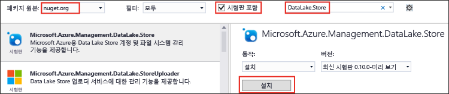

# .NET SDK를 사용하여 Azure 데이터 레이크 저장소 시작
> [!div class="op_single_selector"]
> * [포털](data-lake-store-get-started-portal.md)
> * [PowerShell](data-lake-store-get-started-powershell.md)
> * [.NET SDK](data-lake-store-get-started-net-sdk.md)
> * [Java SDK](data-lake-store-get-started-java-sdk.md)
> * [REST API](data-lake-store-get-started-rest-api.md)
> * [Azure CLI](data-lake-store-get-started-cli.md)
> * [Node.JS](data-lake-store-manage-use-nodejs.md)
> * [Python](data-lake-store-get-started-python.md)
>
> 

[Azure Data Lake Store .NET SDK](https://msdn.microsoft.com/library/mt581387.aspx)를 사용하여 폴더 만들기, 데이터 파일 업로드 및 다운로드 등의 기본 작업을 수행하는 방법에 대해 알아봅니다. Data Lake에 대한 자세한 내용은 [Azure Data Lake Store](data-lake-store-overview.md)를 참조하세요.

## 필수 조건
* **Visual Studio 2013, 2015 또는 2017**. 아래 지침에서는 Visual Studio 2015 업데이트 2를 사용합니다.

* **Azure 구독**. [Azure 무료 평가판](https://azure.microsoft.com/pricing/free-trial/)을 참조하세요.

* **Azure Data Lake Store 계정**. 계정을 만드는 방법에 대한 지침은 [Azure Data Lake Store 시작](data-lake-store-get-started-portal.md)을 참조하세요.

* **Azure Active Directory 응용 프로그램을 만듭니다**. Azure AD 응용 프로그램을 사용하여 Azure AD로 Data Lake Store 응용 프로그램을 인증합니다. Azure AD로 인증하는 여러 접근 방법에는 **최종 사용자 인증** 또는 **서비스 간 인증**이 있습니다. 인증 하는 방법에 대한 지침 및 자세한 내용은 [Azure Active Directory를 사용하여 Data Lake Store로 인증](data-lake-store-authenticate-using-active-directory.md)을 참조하세요.

## .NET 응용 프로그램 만들기
1. Visual Studio를 열고 콘솔 응용 프로그램을 만듭니다.
2. **파일** 메뉴에서 **새로 만들기**를 클릭한 다음 **프로젝트**를 클릭합니다.
3. **새 프로젝트**에서 다음 값을 입력하거나 선택합니다.
   
   | 속성 | 값 |
   | --- | --- |
   | Category |Templates/Visual C#/Windows |
   | Template |콘솔 응용 프로그램 |
   | 이름 |CreateADLApplication |
4. **확인** 을 클릭하여 프로젝트를 만듭니다.
5. Nuget 패키지를 프로젝트에 추가합니다.
   
   1. 솔루션 탐색기에서 프로젝트 이름을 마우스 오른쪽 단추로 클릭한 후 **NuGet 패키지 관리**를 클릭합니다.
   2. **Nuget 패키지 관리자** 탭에서 **패키지 원본**이 **nuget.org**로 설정되어 있고 **시험판 포함** 확인란이 선택되어 있는지 확인합니다.
   3. 다음 NuGet 패키지를 검색하고 설치합니다.
      
      * `Microsoft.Azure.Management.DataLake.Store` - 이 자습서는 v1.0.4를 사용합니다.
      * `Microsoft.Azure.Management.DataLake.StoreUploader` - 이 자습서는 v1.0.1-미리 보기를 사용합니다.
      * `Microsoft.Rest.ClientRuntime.Azure.Authentication` - 이 자습서는 v2.2.11을 사용합니다.
        
        
   4. **NuGet 패키지 관리자**를 닫습니다.
6. **Program.cs**를 열고 기존 코드를 삭제한 후 다음 문을 포함시켜서 네임스페이스에 대한 참조를 추가합니다.
   
        using System;
        using System.IO;
    System.Security.Cryptography.X509Certificates 사용; // 인증서로 만든 Azure AD 응용 프로그램을 사용하는 경우에만 필요      System.Threading 사용;
   
        using Microsoft.Azure.Management.DataLake.Store;
    Microsoft.Azure.Management.DataLake.Store.Models 사용;  Microsoft.Azure.Management.DataLake.StoreUploader 사용;  Microsoft.IdentityModel.Clients.ActiveDirectory 사용;  Microsoft.Rest.Azure.Authentication 사용;

7. 아래와 같이 변수를 선언하고 이미 존재하는 Data Lake Store 이름과 리소스 그룹 이름에 대한 값을 제공합니다. 또한, 여기에 제공하는 로컬 경로와 파일 이름이 컴퓨터에 존재해야 합니다. 네임스페이스 선언 후에 다음 코드 조각을 추가합니다.
   
        namespace SdkSample
        {
            class Program
            {
                private static DataLakeStoreAccountManagementClient _adlsClient;
                private static DataLakeStoreFileSystemManagementClient _adlsFileSystemClient;
   
                private static string _adlsAccountName;
                private static string _resourceGroupName;
                private static string _location;
                private static string _subId;

                private static void Main(string[] args)
                {
                    _adlsAccountName = "<DATA-LAKE-STORE-NAME>"; // TODO: Replace this value with the name of your existing Data Lake Store account.
                    _resourceGroupName = "<RESOURCE-GROUP-NAME>"; // TODO: Replace this value with the name of the resource group containing your Data Lake Store account.
                    _location = "East US 2";
                    _subId = "<SUBSCRIPTION-ID>";

                    string localFolderPath = @"C:\local_path\"; // TODO: Make sure this exists and can be overwritten.
                    string localFilePath = Path.Combine(localFolderPath, "file.txt"); // TODO: Make sure this exists and can be overwritten.
                    string remoteFolderPath = "/data_lake_path/";
                    string remoteFilePath = Path.Combine(remoteFolderPath, "file.txt");
                }
            }
        }

문서의 나머지 섹션에서는 제공되는 .NET 메서드를 사용하여 인증, 파일 업로드 등의 작업을 수행하는 방법을 볼 수 있습니다.

## 인증

### 최종 사용자 인증을 사용하는 경우(이 자습서에 권장됨)

이것을 Azure AD 네이티브 응용 프로그램에 사용하여 응용 프로그램을 **대화형으로** 인증합니다. 다시 말해 Azure 자격 증명을 입력하라는 메시지가 표시됩니다. 

사용 편의성을 위해 아래 코드 조각은 모든 Azure 구독에서 작동하는 클라이언트 ID 및 리디렉션 URI에 대한 기본값을 사용합니다. 이 자습서를 신속하게 완료하려면 이 방법을 사용하는 것이 좋습니다. 아래 코드 조각에서 테넌트 ID에 대한 값만 제공합니다. 해당 값은 [Active Directory 응용 프로그램 만들기](data-lake-store-end-user-authenticate-using-active-directory.md)에 제공된 지침을 사용하여 검색할 수 있습니다.

    // User login via interactive popup
    // Use the client ID of an existing AAD Web application.
    SynchronizationContext.SetSynchronizationContext(new SynchronizationContext());
    var tenant_id = "<AAD_tenant_id>"; // Replace this string with the user's Azure Active Directory tenant ID
    var nativeClientApp_clientId = "1950a258-227b-4e31-a9cf-717495945fc2";
    var activeDirectoryClientSettings = ActiveDirectoryClientSettings.UsePromptOnly(nativeClientApp_clientId, new Uri("urn:ietf:wg:oauth:2.0:oob"));
    var creds = UserTokenProvider.LoginWithPromptAsync(tenant_id, activeDirectoryClientSettings).Result;

위의 코드 조각에 대해 알아야 할 내용.

* 자습서를 신속하게 완료할 수 있도록, 이 코드 조각은 기본적으로 모든 Azure 구독에서 사용할 수 있는 Azure AD 도메인 및 클라이언트 ID를 사용합니다. 따라서 **이 코드 조각을 응용 프로그램에서 있는 그대로 사용**할 수 있습니다.
* 하지만, 자체적인 Azure AD 도메인과 응용 프로그램 클라이언트 ID를 사용하려면 Azure AD 네이티브 응용 프로그램을 만든 다음 그 응용 프로그램에 대한 Azure AD 테넌트 ID, 클라이언트 ID 및 리디렉션 URI를 사용해야 합니다. 지침은 [Data Lake Store를 사용하여 최종 사용자 인증을 위한 Active Directory 응용 프로그램 만들기](data-lake-store-end-user-authenticate-using-active-directory.md)를 참조하세요.

### 클라이언트 암호로 서비스 간 인증을 사용하는 경우
다음 코드 조각은 응용 프로그램/서비스 주체에 대한 클라이언트 비밀/키를 사용하여 **비대화형으로** 응용 프로그램을 인증하는 데 사용될 수 있습니다. 기존 Azure AD "Web App" 응용 프로그램과 함께 사용합니다. Azure AD 웹 응용 프로그램을 만드는 방법 및 아래 코드 조각에 필요한 클라이언트 비밀 및 클라이언트 ID를 검색하는 방법에 대한 지침은 [Data Lake Store를 사용하여 서비스간 인증을 위한 Active Directory 응용 프로그램 만들기](data-lake-store-authenticate-using-active-directory.md)를 참조하세요.

    // Service principal / appplication authentication with client secret / key
    // Use the client ID of an existing AAD "Web App" application.
    SynchronizationContext.SetSynchronizationContext(new SynchronizationContext());
    
    var domain = "<AAD-directory-domain>";
    var webApp_clientId = "<AAD-application-clientid>";
    var clientSecret = "<AAD-application-client-secret>";
    var clientCredential = new ClientCredential(webApp_clientId, clientSecret);
    var creds = await ApplicationTokenProvider.LoginSilentAsync(domain, clientCredential);

### 인증서로 서비스 간 인증을 사용하는 경우
세 번째 옵션으로 다음 코드 조각은 Azure Active Directory 응용 프로그램/서비스 주체에 대한 인증서를 사용하여 **비대화형으로** 응용 프로그램을 인증하는 데 사용될 수 있습니다. 이것은 [인증서에서 기존 Azure AD 응용 프로그램](../azure-resource-manager/resource-group-authenticate-service-principal.md#create-service-principal-with-certificate)과 함께 사용합니다.

    // Service principal / application authentication with certificate
    // Use the client ID and certificate of an existing AAD "Web App" application.
    SynchronizationContext.SetSynchronizationContext(new SynchronizationContext());
    
    var domain = "<AAD-directory-domain>";
    var webApp_clientId = "<AAD-application-clientid>";
    var clientCert = <AAD-application-client-certificate>
    var clientAssertionCertificate = new ClientAssertionCertificate(webApp_clientId, clientCert);
    var creds = await ApplicationTokenProvider.LoginSilentWithCertificateAsync(domain, clientAssertionCertificate);

## 클라이언트 개체 만들기
다음 코드 조각은 이는 서비스에 요청을 발급하는 데 사용되는 Data Lake Store 계정 및 파일 시스템 클라이언트 개체를 만듭니다.

    // Create client objects and set the subscription ID
    _adlsClient = new DataLakeStoreAccountManagementClient(creds) { SubscriptionId = _subId };
    _adlsFileSystemClient = new DataLakeStoreFileSystemManagementClient(creds);

## 구독 내 모든 Data Lake Store 계정 나열
다음 코드는 지정된 Azure 구독 내에서 모든 Data Lake Store 계정을 나열합니다.

    // List all ADLS accounts within the subscription
    public static async Task<List<DataLakeStoreAccount>> ListAdlStoreAccounts()
    {
        var response = await _adlsClient.Account.ListAsync();
        var accounts = new List<DataLakeStoreAccount>(response);

        while (response.NextPageLink != null)
        {
            response = _adlsClient.Account.ListNext(response.NextPageLink);
            accounts.AddRange(response);
        }

        return accounts;
    }

## 디렉터리 만들기
다음 코드 조각은 Data Lake Store 계정 내 디렉터리 생성에 사용할 수 있는 `CreateDirectory` 메서드를 보여 줍니다.

    // Create a directory
    public static async Task CreateDirectory(string path)
    {
        await _adlsFileSystemClient.FileSystem.MkdirsAsync(_adlsAccountName, path);
    }

## 파일 업로드
다음 코드 조각은 Data Lake Store 계정에 파일을 업로드하는 데 사용할 수 있는 `UploadFile` 메서드를 보여 줍니다.

    // Upload a file
    public static void UploadFile(string srcFilePath, string destFilePath, bool force = true)
    {
        var parameters = new UploadParameters(srcFilePath, destFilePath, _adlsAccountName, isOverwrite: force);
        var frontend = new DataLakeStoreFrontEndAdapter(_adlsAccountName, _adlsFileSystemClient);
        var uploader = new DataLakeStoreUploader(parameters, frontend);
        uploader.Execute();
    }

`DataLakeStoreUploader` 는 로컬 파일 경로와 Data Lake Store 파일 경로 간의 재귀 업로드 및 다운로드를 지원합니다.    

## 파일 또는 디렉터리 정보 가져오기
다음 코드 조각은 Data Lake Store에서 사용할 수 있는 파일이나 디렉터리에 대한 정보를 검색하는 데 사용할 수 있는 `GetItemInfo` 메서드를 보여 줍니다. 

    // Get file or directory info
    public static async Task<FileStatusProperties> GetItemInfo(string path)
    {
        return await _adlsFileSystemClient.FileSystem.GetFileStatusAsync(_adlsAccountName, path).FileStatus;
    }

## 파일 또는 디렉터리 나열
다음 코드 조각은 Data Lake Store 계정의 파일과 디렉터리를 나열하는 데 사용할 수 있는 `ListItem` 메서드를 보여 줍니다.

    // List files and directories
    public static List<FileStatusProperties> ListItems(string directoryPath)
    {
        return _adlsFileSystemClient.FileSystem.ListFileStatus(_adlsAccountName, directoryPath).FileStatuses.FileStatus.ToList();
    }

## 파일 연결
다음 코드 조각은 파일 연결에 사용하는 `ConcatenateFiles` 메서드를 보여 줍니다. 

    // Concatenate files
    public static Task ConcatenateFiles(string[] srcFilePaths, string destFilePath)
    {
        await _adlsFileSystemClient.FileSystem.ConcatAsync(_adlsAccountName, destFilePath, srcFilePaths);
    }

## 파일에 추가
다음 코드 조각은 Data Lake Store 계정에 이미 저장된 파일에 데이터를 추가하는 데 사용하는 `AppendToFile` 메서드를 보여 줍니다.

    // Append to file
    public static async Task AppendToFile(string path, string content)
    {
        using (var stream = new MemoryStream(Encoding.UTF8.GetBytes(content)))
        {
            await _adlsFileSystemClient.FileSystem.AppendAsync(_adlsAccountName, path, stream);
        }
    }

## 파일 다운로드
다음 코드 조각은 Data Lake Store 계정에서 파일을 다운로드하는 데 사용하는 `DownloadFile` 메서드를 보여 줍니다.

    // Download file
    public static async Task DownloadFile(string srcPath, string destPath)
    {
        using (var stream = await _adlsFileSystemClient.FileSystem.OpenAsync(_adlsAccountName, srcPath))
        using (var fileStream = new FileStream(destPath, FileMode.Create))
        {
            await stream.CopyToAsync(fileStream);
        }
    }

## 다음 단계
* [데이터 레이크 저장소의 데이터 보호](data-lake-store-secure-data.md)
* [Azure 데이터 레이크 분석에 데이터 레이크 저장소 사용](../data-lake-analytics/data-lake-analytics-get-started-portal.md)
* [데이터 레이크 저장소와 함께 Azure HDInsight 사용](data-lake-store-hdinsight-hadoop-use-portal.md)
* [Data Lake Store .NET SDK 참조](https://msdn.microsoft.com/library/mt581387.aspx)
* [Data Lake Store REST 참조](https://msdn.microsoft.com/library/mt693424.aspx)

