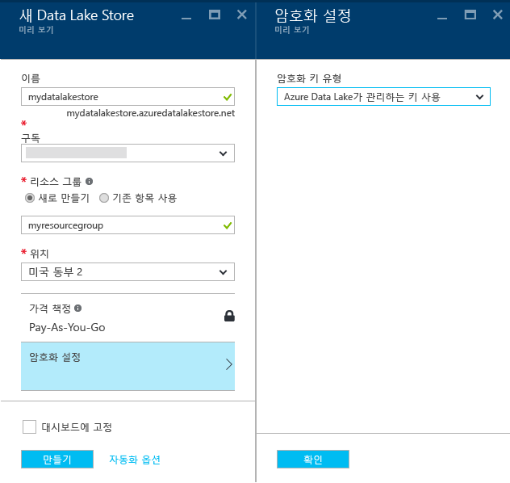

# Azure 포털을 사용하여 Azure 데이터 레이크 저장소 시작
> [!div class="op_single_selector"]
> * [포털](data-lake-store-get-started-portal.md)
> * [PowerShell](data-lake-store-get-started-powershell.md)
> * [.NET SDK](data-lake-store-get-started-net-sdk.md)
> * [Java SDK](data-lake-store-get-started-java-sdk.md)
> * [REST API](data-lake-store-get-started-rest-api.md)
> * [Azure CLI](data-lake-store-get-started-cli.md)
> * [Node.JS](data-lake-store-manage-use-nodejs.md)
> * [Python](data-lake-store-get-started-python.md)
>
> 

Azure 포털을 사용하여 Azure 데이터 레이크 저장소 계정을 만들고 폴더 만들기, 데이터 파일 업로드 및 다운로드, 계정 삭제 등의 기본 작업을 수행하는 방법을 알아봅니다. Data Lake Store에 대한 자세한 내용은 [Azure Data Lake Store 개요](data-lake-store-overview.md)를 참조하세요.

## 필수 조건
이 자습서를 시작하기 전에 다음이 있어야 합니다.

* **Azure 구독**. [Azure 무료 평가판](https://azure.microsoft.com/pricing/free-trial/)을 참조하세요.

## 비디오를 통해 보다 빠르게 사용 방법을 익힐 수 있습니다.
Data Lake 저장소를 시작하려면 다음 비디오를 시청하세요.

* [Data Lake 저장소 계정 만들기](https://mix.office.com/watch/1k1cycy4l4gen)
* [데이터 탐색기를 사용하여 Data Lake 저장소에서 데이터 관리](https://mix.office.com/watch/icletrxrh6pc)

## Azure 데이터 레이크 저장소 계정 만들기
1. 새로운 [Azure 포털](https://portal.azure.com)에 로그인합니다.
2. **새로 만들기**를 클릭하고 **데이터 + 저장소**를 클릭한 다음 **Azure Data Lake Store**를 클릭합니다. **Azure Data Lake Store** 블레이드에서 정보를 읽은 다음 블레이드의 왼쪽 아래 모서리에서 **만들기**를 클릭합니다.
3. **새 데이터 레이크 저장소** 블레이드에서 아래 화면 캡처에 표시된 대로 값을 제공합니다.
   
    
   
   * **이름**. Data Lake Store 계정의 고유한 이름을 입력합니다.
   * **구독**. 새 Data Lake Store 계정을 만들려는 구독을 선택합니다.
   * **리소스 그룹**. 기존 리소스 그룹을 선택하거나 **새로 만들기**를 선택하여 리소스 그룹을 만듭니다. 리소스 그룹은 응용 프로그램에 관련된 리소스를 보유하는 컨테이너입니다. 자세한 내용은 [Azure의 리소스 그룹](../azure-resource-manager/resource-group-overview.md#resource-groups)을 참조하세요.
   * **위치**: 데이터 레이크 저장소 계정을 만들려는 위치를 선택합니다.
   * **암호화 설정**. Data Lake Store 계정을 암호화할지 여부를 선택할 수 있습니다. 암호화하려는 경우 계정에서 데이터를 암호화하는 데 사용하는 마스터 암호화 키를 관리하는 방법을 지정할 수도 있습니다.
     
     * (선택 사항) 드롭다운에서 **암호화를 사용하지 않음**을 선택하여 암호화를 옵트아웃합니다.
     * (기본값) Azure Data Lake Store에서 암호화 키를 관리하려는 경우 **Azure Data Lake에서 관리하는 키 사용**을 선택합니다.
       
         
     * (선택 사항) Azure Key Vault에서 고유한 키를 사용하려는 경우 **Azure Key Vault에서 키 선택**을 선택합니다. 이 옵션을 사용하여 Key Vault 계정 및 키가 없는 경우 만들 수도 있습니다.
       
         
       
       **암호화 설정** 블레이드에서 **확인**을 클릭합니다.
       
       > [!NOTE]
       > Azure Key Vault에서 키를 사용하여 Data Lake Store 계정에 대한 암호화를 구성하는 경우 Azure Data Lake Store 계정에 대한 권한을 할당하여 Azure Key Vault에 액세스해야 합니다. 이 작업을 수행하는 방법에 대한 지침은 [Azure Key Vault에 사용 권한 할당](#assign-permissions-to-the-azure-key-vault)을 참조하세요.
       > 
       > 
4. **만들기**를 클릭합니다. 계정을 대시보드에 고정하도록 선택한 경우 대시보드로 다시 돌아가고 Data Lake Store 계정 프로비전의 진행률을 볼 수 있습니다. 데이터 레이크 저장소 계정이 프로비전되면 계정 블레이드가 표시됩니다.

## Azure Key Vault에 사용 권한 할당
Azure Key Vault에서 키를 사용하여 Data Lake Store 계정에 대한 암호화를 구성한 경우 Data Lake Store 계정과 Azure Key Vault 계정 사이에 액세스를 구성해야 합니다. 이렇게 하려면 다음 단계를 수행합니다.

1. Azure Key Vault에서 키를 사용한 경우 Data Lake Store 계정에 대한 블레이드에서 위쪽에 경고를 표시합니다. 경고를 클릭하여 **Key Vault 사용 권한 구성** 블레이드를 엽니다.
   
    
2. 블레이드는 액세스를 구성하는 두 가지 옵션을 보여 줍니다.
   
   * 첫 번째 옵션에서 **사용 권한 부여**를 클릭하여 액세스를 구성합니다. 첫 번째 옵션은 Data Lake Store 계정을 만든 사용자가 Azure Key Vault의 관리자인 경우에만 활성화됩니다.
   * 다른 옵션은 블레이드에 표시되는 PowerShell cmdlet을 실행하는 것입니다. Azure Key Vault의 소유자이거나 Azure Key Vault에 대한 사용 권한을 부여할 수 있어야 합니다. cmdlet을 실행한 후에 블레이드로 다시 돌아가서 **사용**을 클릭하여 액세스를 구성합니다.

## Azure 데이터 레이크 저장소 계정에서 폴더 만들기
데이터 레이크 저장소 계정에서 폴더를 만들어 데이터를 관리하고 저장할 수 있습니다.

1. 방금 만든 데이터 레이크 저장소 계정을 엽니다. 왼쪽 창에서 **찾아보기**, **Data Lake Store**를 차례로 클릭한 다음 Data Lake Store 블레이드에서 폴더를 만들려는 계정 이름을 클릭합니다. 시작 보드에 계정을 고정한 경우 해당 계정 타일을 클릭합니다.
2. 데이터 레이크 저장소 계정 블레이드에서 **데이터 탐색기**를 클릭합니다.
   
    
3. Data Lake Store 계정 블레이드에서 **새 폴더**를 클릭하고 새 폴더에 대한 이름을 입력한 다음 **확인**을 클릭합니다.
   
    
   
    새로 만든 폴더가 **데이터 탐색기** 블레이드에 나열됩니다. 모든 수준까지 중첩된 폴더를 만들 수 있습니다.
   
    

## Azure 데이터 레이크 저장소 계정에 데이터 업로드
루트 수준에서 Azure 데이터 레이크 저장소 계정에 직접 데이터를 업로드하거나 계정 내에서 만든 폴더에 업로드할 수 있습니다. 아래의 화면 캡처에서 단계에 따라 **데이터 탐색기** 블레이드에서 하위 폴더에 파일을 업로드합니다. 이 화면 캡처에서 파일은 이동 경로에 표시된 하위 폴더에 업로드됩니다(빨간색 상자에 표시).

업로드할 일부 샘플 데이터를 찾는 경우 **Azure 데이터 레이크 Git 리포지토리** 의 [Ambulance Data](https://github.com/MicrosoftBigData/usql/tree/master/Examples/Samples/Data/AmbulanceData)폴더에 있을 수 있습니다.

## 저장된 데이터에서 사용할 수 있는 속성 및 작업
새로 추가된 파일을 클릭하여 **속성** 블레이드를 엽니다. 파일과 연결된 속성 및 파일에서 수행할 수 있는 작업은 이 블레이드에서 사용할 수 있습니다. 아래 화면 캡처의 빨간색 상자에 강조 표시된 Azure 데이터 레이크 저장소 계정의 파일에 전체 경로를 복사할 수 있습니다.

* **미리 보기** 를 클릭하여 브라우저에서 직접 파일의 미리 보기를 봅니다. 미리 보기의 형식을 지정할 수도 있습니다. **미리 보기**를 클릭하고 **파일 미리 보기** 블레이드에서 **형식**을 클릭하고 **파일 미리 보기 형식** 블레이드에서 표시할 행 개수, 사용할 인코딩, 사용할 구분 기호 등과 같은 옵션을 지정합니다.
  
  
* **다운로드** 를 클릭하여 컴퓨터에 파일을 다운로드합니다.
* **파일 이름 바꾸기** 를 클릭하여 파일의 이름을 바꿉니다.
* **파일 삭제** 를 클릭하여 파일을 삭제합니다.

## 데이터 보호
Azure Active Directory 및 액세스 제어(ACL)를 사용하여 Azure 데이터 레이크 저장소 계정에 저장된 데이터를 보호할 수 있습니다. 작업 수행 방법에 대한 지침은 [Azure 데이터 레이크 저장소의 데이터 보안](data-lake-store-secure-data.md)을 참조하세요.

## Azure 데이터 레이크 저장소 계정 삭제
Azure 데이터 레이크 저장소 계정을 삭제하려면 데이터 레이크 저장소 블레이드에서 **삭제**를 클릭합니다. 작업을 확인하려면 삭제하려는 계정의 이름을 입력하라는 메시지가 표시됩니다. 계정의 이름을 입력한 다음 **삭제**를 클릭합니다.

## 다음 단계
* [데이터 레이크 저장소의 데이터 보호](data-lake-store-secure-data.md)
* [Azure 데이터 레이크 분석에 데이터 레이크 저장소 사용](../data-lake-analytics/data-lake-analytics-get-started-portal.md)
* [Azure HDInsight에 데이터 레이크 저장소 사용](data-lake-store-hdinsight-hadoop-use-portal.md)
* [Data Lake Store에 대한 진단 로그 액세스](data-lake-store-diagnostic-logs.md)

<!--HONumber=Jan17_HO4-->

