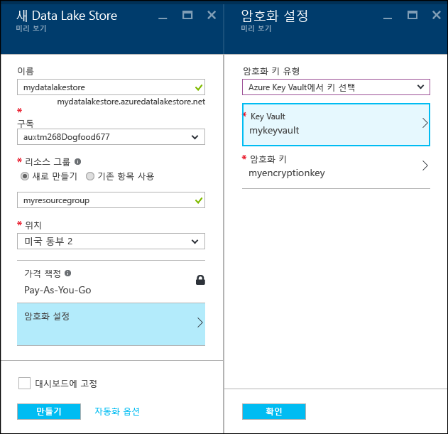

# Azure Portal을 사용하여 Azure Data Lake Storage Gen1 시작

> [!div class="op_single_selector"]
> * [포털](data-lake-store-get-started-portal.md)
> * [PowerShell](data-lake-store-get-started-powershell.md)
> * [Azure CLI 2.0](data-lake-store-get-started-cli-2.0.md)
>
> 

[!INCLUDE [data-lake-storage-gen1-rename-note.md](../../includes/data-lake-storage-gen1-rename-note.md)]

Azure Portal을 사용하여 Azure Data Lake Store 계정을 만들고 폴더 만들기, 데이터 파일 업로드 및 다운로드, 계정 삭제 등의 기본 작업을 수행하는 방법을 알아봅니다. 자세한 내용은 [Azure Data Lake Storage Gen1 개요](data-lake-store-overview.md)를 참조하세요.

## 필수 조건
이 자습서를 시작하기 전에 다음 항목이 있어야 합니다.

* **Azure 구독**. [Azure 평가판](https://azure.microsoft.com/pricing/free-trial/)을 참조하세요.

## Azure 데이터 레이크 저장소 계정 만들기

1. 새로운 [Azure Portal](https://portal.azure.com)에 로그인합니다.
2. **리소스 만들기 > 저장소 > Data Lake Store**를 클릭합니다.
3. **새 Data Lake Store** 블레이드에서 아래 스크린샷에 표시된 대로 값을 제공합니다.
   
    
   
   * **이름**. Data Lake Store 계정의 고유한 이름을 입력합니다.
   * **구독**. 새 Data Lake Store 계정을 만들려는 구독을 선택합니다.
   * **리소스 그룹**. 기존 리소스 그룹을 선택하거나 **새로 만들기**를 선택하여 리소스 그룹을 만듭니다. 리소스 그룹은 응용 프로그램에 관련된 리소스를 보유하는 컨테이너입니다. 자세한 내용은 [Azure의 리소스 그룹](../azure-resource-manager/resource-group-overview.md#resource-groups)을 참조하세요.
   * **위치**: Data Lake Store 계정을 만들려는 위치를 선택합니다.
   * **암호화 설정**. 세 개의 옵션이 있습니다.
     
     * **암호화를 활성화하지 않습니다**.
     * **Data Lake Store에서 관리되는 키를 사용합니다**.  Azure Data Lake Store에서 암호화 키를 관리하려는 경우
     * **고유한 Key Vault의 키를 사용합니다**. 기존 Azure Key Vault를 선택하거나 새 Key Vault를 선택할 수 있습니다. Azure Key Vault에서 키를 사용하려면 Azure Data Lake Store 계정이 Azure Key Vault에 액세스할 수 있는 권한을 할당해야 합니다. 자세한 내용은 [Azure Key Vault에 권한 할당](#assign-permissions-to-azure-key-vault)을 참조하세요.
       
        
       
        **암호화 설정** 블레이드에서 **확인**을 클릭합니다.

        자세한 내용은 [Azure Data Lake Store의 데이터 암호화](./data-lake-store-encryption.md)를 참조하세요.

4. **만들기**를 클릭합니다. 계정을 대시보드에 고정하도록 선택한 경우 대시보드로 다시 돌아가고 Data Lake Store 계정 프로비전의 진행률을 볼 수 있습니다. 데이터 레이크 저장소 계정이 프로비전되면 계정 블레이드가 표시됩니다.

## Azure Key Vault에 권한 할당
Azure Key Vault에서 키를 사용하여 Data Lake Store 계정에 대한 암호화를 구성한 경우 Data Lake Store 계정과 Azure Key Vault 계정 사이에 액세스를 구성해야 합니다. 이렇게 하려면 다음 단계를 수행합니다.

1. Azure Key Vault에서 키를 사용한 경우 Data Lake Store 계정에 대한 블레이드에서 위쪽에 경고를 표시합니다. 경고를 클릭하여 **암호화**를 엽니다.
   
    
2. 블레이드는 액세스를 구성하는 두 가지 옵션을 보여 줍니다.

    
   
   * 첫 번째 옵션에서 **사용 권한 부여**를 클릭하여 액세스를 구성합니다. 첫 번째 옵션은 Data Lake Store 계정을 만든 사용자가 Azure Key Vault의 관리자인 경우에만 활성화됩니다.
   * 다른 옵션은 블레이드에 표시되는 PowerShell cmdlet을 실행하는 것입니다. Azure Key Vault의 소유자이거나 Azure Key Vault에 대한 사용 권한을 부여할 수 있어야 합니다. cmdlet을 실행한 후에 블레이드로 다시 돌아가서 **사용**을 클릭하여 액세스를 구성합니다.

> [!NOTE]
> Azure Resource Manager 템플릿을 사용하여 Data Lake Store 계정을 만들 수도 있습니다. 이러한 템플릿은에서 [Azure QuickStart 템플릿](https://azure.microsoft.com/resources/templates/?term=data+lake+store)에서 액세스할 수 있습니다.
    - 데이터 암호화 미지원: [데이터 암호화 없이 Azure Data Lake Store를 배포합니다](https://azure.microsoft.com/resources/templates/101-data-lake-store-no-encryption/).
    - Data Lake Store를 사용하여 데이터 암호화 지원: [암호화로 Data Lake Store 계정을 배포합니다(Data Lake)](https://azure.microsoft.com/resources/templates/101-data-lake-store-encryption-adls/).
    - Azure Key Vault를 사용하여 데이터 암호화 지원: [암호화로 Data Lake Store 계정을 배포합니다(Key Vault)](https://azure.microsoft.com/resources/templates/101-data-lake-store-encryption-key-vault/).
> 
> 

## Azure 데이터 레이크 저장소 계정에서 폴더 만들기
데이터 레이크 저장소 계정에서 폴더를 만들어 데이터를 관리하고 저장할 수 있습니다.

1. 만든 Data Lake Store 계정을 엽니다. 왼쪽 창에서 **모든 리소스**를 클릭한 다음, 모든 리소스 블레이드에서 폴더를 만들려는 계정 이름을 클릭합니다. 시작 보드에 계정을 고정한 경우 해당 계정 타일을 클릭합니다.
2. Data Lake Store 계정 블레이드에서 **데이터 탐색기**를 클릭합니다.
   
    
3. 데이터 탐색기 블레이드에서 **새 폴더**를 클릭하고 새 폴더에 대한 이름을 입력한 다음 **확인**을 클릭합니다.
   
    
   
    새로 만든 폴더가 **데이터 탐색기** 블레이드에 나열되어 있습니다. 모든 수준까지 중첩된 폴더를 만들 수 있습니다.
   
    

## Azure 데이터 레이크 저장소 계정에 데이터 업로드
루트 수준에서 Azure 데이터 레이크 저장소 계정에 직접 데이터를 업로드하거나 계정 내에서 만든 폴더에 업로드할 수 있습니다. 

1. **데이터 탐색기** 블레이드에서 **업로드**를 클릭합니다. 
2. **파일 업로드** 블레이드에서 업로드하려는 파일로 이동한 다음, **선택한 파일 추가**를 클릭합니다. 또한 업로드할 파일을 두 개 이상 선택할 수 있습니다.

    

업로드할 일부 샘플 데이터를 찾는 경우 **Azure 데이터 레이크 Git 리포지토리** 의 [Ambulance Data](https://github.com/MicrosoftBigData/usql/tree/master/Examples/Samples/Data/AmbulanceData)폴더에 있을 수 있습니다.

## 저장된 데이터에서 사용할 수 있는 작업
파일에 대해 줄임표 아이콘을 클릭하고 팝업 메뉴에서 데이터에 대해 수행하려는 작업을 클릭합니다.

 

## 데이터 보호
Azure Active Directory 및 액세스 제어(ACL)를 사용하여 Azure 데이터 레이크 저장소 계정에 저장된 데이터를 보호할 수 있습니다. 작업 수행 방법에 대한 지침은 [Azure 데이터 레이크 저장소의 데이터 보안](data-lake-store-secure-data.md)을 참조하세요.

## Azure 데이터 레이크 저장소 계정 삭제
Azure 데이터 레이크 저장소 계정을 삭제하려면 데이터 레이크 저장소 블레이드에서 **삭제**를 클릭합니다. 작업을 확인하려면 삭제하려는 계정의 이름을 입력하라는 메시지가 표시됩니다. 계정의 이름을 입력한 다음 **삭제**를 클릭합니다.

## 다음 단계
* [빅 데이터 요구 사항에 Azure Data Lake Store 사용](data-lake-store-data-scenarios.md) 
* [데이터 레이크 저장소의 데이터 보호](data-lake-store-secure-data.md)
* [Azure 데이터 레이크 분석에 Data Lake Store 사용](../data-lake-analytics/data-lake-analytics-get-started-portal.md)
* [Azure HDInsight에 데이터 레이크 저장소 사용](data-lake-store-hdinsight-hadoop-use-portal.md)

