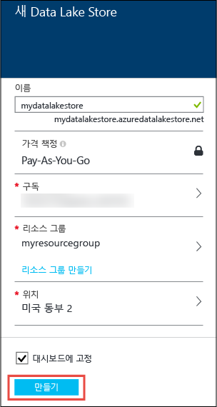
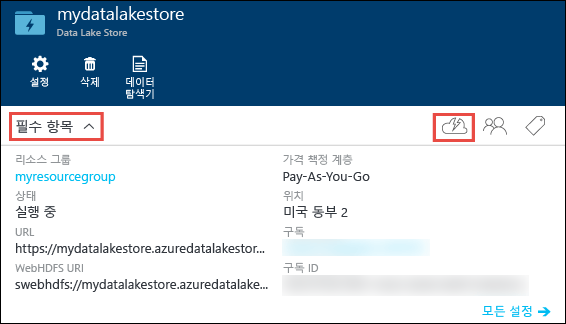
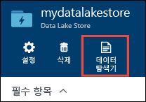
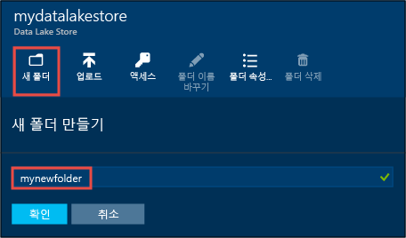
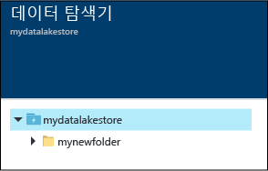
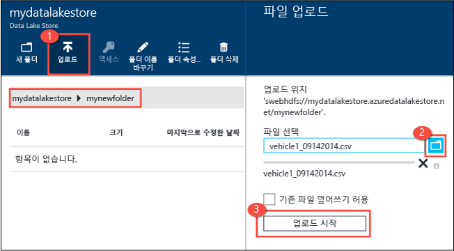
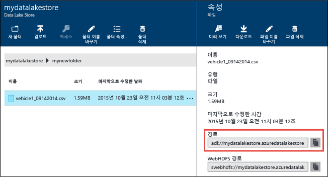
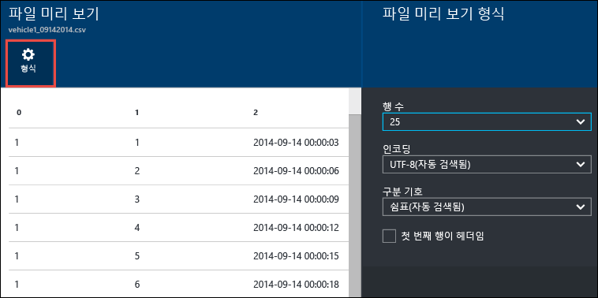
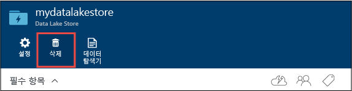

<properties 
   pageTitle="데이터 레이크 저장소 시작 | Azure" 
   description="포털을 사용하여 데이터 레이크 저장소 계정을 만들고 데이터 레이크 저장소의 기본 작업 수행" 
   services="data-lake-store" 
   documentationCenter="" 
   authors="nitinme" 
   manager="jhubbard" 
   editor="cgronlun"/>
 
<tags
   ms.service="data-lake-store"
   ms.devlang="na"
   ms.topic="hero-article"
   ms.tgt_pltfrm="na"
   ms.workload="big-data" 
   ms.date="09/13/2016"
   ms.author="nitinme"/>

# Azure 포털을 사용하여 Azure 데이터 레이크 저장소 시작

> [AZURE.SELECTOR]
- [포털](data-lake-store-get-started-portal.md)
- [PowerShell](data-lake-store-get-started-powershell.md)
- [.NET SDK](data-lake-store-get-started-net-sdk.md)
- [Java SDK](data-lake-store-get-started-java-sdk.md)
- [REST API](data-lake-store-get-started-rest-api.md)
- [Azure CLI](data-lake-store-get-started-cli.md)
- [Node.JS](data-lake-store-manage-use-nodejs.md)

Azure 포털을 사용하여 Azure 데이터 레이크 저장소 계정을 만들고 폴더 만들기, 데이터 파일 업로드 및 다운로드, 계정 삭제 등의 기본 작업을 수행하는 방법을 알아봅니다. 데이터 레이크 저장소에 대한 자세한 내용은 [Azure 데이터 레이크 저장소 개요](data-lake-store-overview.md)를 참조하세요.

## 필수 조건

이 자습서를 시작하기 전에 다음이 있어야 합니다.

- **Azure 구독**. [Azure 무료 평가판](https://azure.microsoft.com/pricing/free-trial/)을 참조하세요.

## 비디오로 빠르게 배우시겠습니까?

Data Lake 저장소를 시작하려면 다음 비디오를 시청하세요.

* [Data Lake 저장소 계정 만들기](https://mix.office.com/watch/1k1cycy4l4gen)
* [데이터 탐색기를 사용하여 Data Lake 저장소에서 데이터 관리](https://mix.office.com/watch/icletrxrh6pc)

## Azure 데이터 레이크 저장소 계정 만들기

1. 새로운 [Azure 포털](https://portal.azure.com)에 로그인합니다.

2. **새로 만들기**를 클릭하고 **데이터 + 저장소**를 클릭한 다음 **Azure 데이터 레이크 저장소**를 클릭합니다. **Azure 데이터 레이크 저장소** 블레이드에서 정보를 읽은 다음 블레이드의 왼쪽 아래 모서리에서 **만들기**를 클릭합니다.

3. **새 데이터 레이크 저장소** 블레이드에서 아래 화면 캡처에 표시된 대로 값을 제공합니다.

	

	- **구독**. 새 Data Lake Store 계정을 만들려는 구독을 선택합니다.
	- **리소스 그룹**. 기존 리소스 그룹을 선택하거나 **리소스 그룹 만들기**를 클릭하여 만듭니다. 리소스 그룹은 응용 프로그램에 관련된 리소스를 보유하는 컨테이너입니다. 자세한 내용은 [Azure의 리소스 그룹](resource-group-overview.md#resource-groups)을 참조하세요.
	- **위치**: 데이터 레이크 저장소 계정을 만들려는 위치를 선택합니다.

4. 데이터 레이크 저장소 계정을 시작 보드에서 액세스할 수 있도록 하려는 경우 **시작 보드에 고정**을 선택합니다.

5. **만들기**를 클릭합니다. 계정을 시작 보드에 고정하도록 선택한 경우 시작 보드로 다시 돌아가고 데이터 레이크 저장소 계정 프로비저닝의 진행률을 볼 수 있습니다. 데이터 레이크 저장소 계정이 프로비전되면 계정 블레이드가 표시됩니다.

6. **Essentials** 드롭다운을 확장하여 위치 등의 일부분인 리소스 그룹과 같은 데이터 레이크 저장소 계정에 대한 정보를 봅니다. **빠른 시작** 아이콘을 클릭하여 데이터 레이크 저장소와 관련된 다른 리소스에 대한 링크를 봅니다.

	

## Azure 데이터 레이크 저장소 계정에서 폴더 만들기

데이터 레이크 저장소 계정에서 폴더를 만들어 데이터를 관리하고 저장할 수 있습니다.

1. 방금 만든 데이터 레이크 저장소 계정을 엽니다. 왼쪽 창에서 **찾아보기**, **데이터 레이크 저장소**를 차례로 클릭한 다음 데이터 레이크 저장소 블레이드에서 폴더를 만들려는 계정 이름을 클릭합니다. 시작 보드에 계정을 고정한 경우 해당 계정 타일을 클릭합니다.

2. 데이터 레이크 저장소 계정 블레이드에서 **데이터 탐색기**를 클릭합니다.

	

3. 데이터 레이크 저장소 계정 블레이드에서 **새 폴더**를 클릭하고 새 폴더에 대한 이름을 입력한 다음 **확인**을 클릭합니다.
	
	
	
	새로 만든 폴더가 **데이터 탐색기** 블레이드에 나열됩니다. 모든 수준까지 중첩된 폴더를 만들 수 있습니다.

	

## Azure 데이터 레이크 저장소 계정에 데이터 업로드

루트 수준에서 Azure 데이터 레이크 저장소 계정에 직접 데이터를 업로드하거나 계정 내에서 만든 폴더에 업로드할 수 있습니다. 아래의 화면 캡처에서 단계에 따라 **데이터 탐색기** 블레이드에서 하위 폴더에 파일을 업로드합니다. 이 화면 캡처에서 파일은 이동 경로에 표시된 하위 폴더에 업로드됩니다(빨간색 상자에 표시).

업로드할 일부 샘플 데이터를 찾는 경우 [Azure 데이터 레이크 Git 리포지토리](https://github.com/MicrosoftBigData/usql/tree/master/Examples/Samples/Data/AmbulanceData)의 **Ambulance Data** 폴더에 있을 수 있습니다.

## 저장된 데이터에서 사용할 수 있는 속성 및 작업

새로 추가된 파일을 클릭하여 **속성** 블레이드를 엽니다. 파일과 연결된 속성 및 파일에서 수행할 수 있는 작업은 이 블레이드에서 사용할 수 있습니다. 아래 화면 캡처의 빨간색 상자에 강조 표시된 Azure 데이터 레이크 저장소 계정의 파일에 전체 경로를 복사할 수 있습니다.

* **미리 보기**를 클릭하여 브라우저에서 직접 파일의 미리 보기를 봅니다. 미리 보기의 형식을 지정할 수도 있습니다. **미리 보기**를 클릭하고 **파일 미리 보기** 블레이드에서 **형식**을 클릭하고 **파일 미리 보기 형식** 블레이드에서 표시할 행 개수, 사용할 인코딩, 사용할 구분 기호 등과 같은 옵션을 지정합니다.

  

* **다운로드**를 클릭하여 컴퓨터에 파일을 다운로드합니다.

* **파일 이름 바꾸기**를 클릭하여 파일의 이름을 바꿉니다.

* **파일 삭제**를 클릭하여 파일을 삭제합니다.

## 데이터 보호

Azure Active Directory 및 액세스 제어(ACL)를 사용하여 Azure 데이터 레이크 저장소 계정에 저장된 데이터를 보호할 수 있습니다. 작업 수행 방법에 대한 지침은 [Azure 데이터 레이크 저장소의 데이터 보안](data-lake-store-secure-data.md)을 참조하세요.

## Azure 데이터 레이크 저장소 계정 삭제

Azure 데이터 레이크 저장소 계정을 삭제하려면 데이터 레이크 저장소 블레이드에서 **삭제**를 클릭합니다. 작업을 확인하려면 삭제하려는 계정의 이름을 입력하라는 메시지가 표시됩니다. 계정의 이름을 입력한 다음 **삭제**를 클릭합니다.

## 다음 단계

- [데이터 레이크 저장소의 데이터 보호](data-lake-store-secure-data.md)
- [Azure 데이터 레이크 분석에 데이터 레이크 저장소 사용](../data-lake-analytics/data-lake-analytics-get-started-portal.md)
- [Azure HDInsight에 데이터 레이크 저장소 사용](data-lake-store-hdinsight-hadoop-use-portal.md)
- [Data Lake Store에 대한 진단 로그 액세스](data-lake-store-diagnostic-logs.md)

<!-----HONumber=AcomDC_0914_2016-->