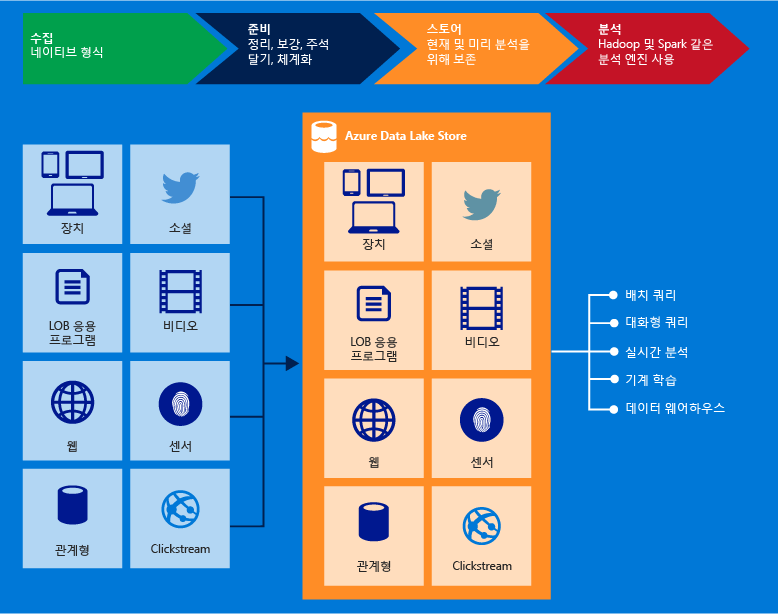

# Azure 데이터 레이크 저장소 Gen1 란?

[!INCLUDE [data-lake-storage-gen1-rename-note.md](../../includes/data-lake-storage-gen1-rename-note.md)]

Azure Data Lake Storage Gen1은 빅 데이터 분석 작업을 위한 엔터프라이즈 수준 하이퍼 스케일 리포지토리입니다. Azure 데이터 레이크를 사용하면 작동 및 예비 분석에 대해 한 곳에서 모든 크기, 형식 및 수집 속도의 데이터를 캡처할 수 있습니다.

Data Lake Storage Gen1은 WebHDFS 호환 REST API를 사용하여 Hadoop(HDInsight 클러스터에서 사용 가능)에서 액세스할 수 있습니다. 이 저장된 된 데이터에서 분석을 사용 하도록 설계 되었으며 데이터 분석 시나리오에 대 한 성능을 위해 조정 됩니다. 모든 엔터프라이즈급 기능을 포함 하는 데이터 레이크 저장소 Gen1: 보안, 관리 효율성, 확장성, 안정성 및 가용성입니다.

## 주요 기능

Data Lake Storage Gen1의 주요 기능 중 일부는 다음과 같습니다.

### Hadoop용으로 작성

데이터 레이크 저장소 Gen1는 분산 파일 시스템 HDFS (Hadoop)), 호환 되 고 Hadoop 에코 시스템과 함께 작동 하는 Apache Hadoop 파일 시스템을 합니다. WebHDFS API를 사용하는 기존 HDInsight 애플리케이션 또는 서비스는 Data Lake Storage Gen1과 쉽게 통합할 수 있습니다. Data Lake Storage Gen1은 또한 애플리케이션에 대한 WebHDFS 호환 REST 인터페이스를 노출합니다.

데이터 레이크 저장소 Gen1에 저장 된 데이터를 쉽게 분석할 수 있습니다 MapReduce 또는 Hive와 같은 Hadoop 분석 프레임 워크를 사용 하 여 합니다. Azure HDInsight 클러스터 프로 비전 하 고 Data Lake 저장소 Gen1에 저장 된 데이터에 직접 액세스 하도록 구성할 수 있습니다.

### 무제한 저장소, 페타바이트 파일

데이터 레이크 저장소 Gen1 무제한 저장소를 제공 하며 다양 한 분석을 위해 데이터를 저장할 수 있습니다. 이 계정 크기, 파일 크기 또는 데이터 레이크에 저장 될 수 있는 데이터 양에 어떠한 제한도 두지 않습니다. 개별 파일의 범위는 킬로바이트에서 페타바이트 크기의 까지입니다. 데이터는 여러 복사본을 만들어 영구적으로 저장 됩니다. Data lake에 데이터 저장 될 수 있습니다 하는 기간에 제한이 있습니다.

### 빅 데이터 분석에 대한 성능 조정

데이터 레이크 저장소 Gen1 쿼리 및 많은 양의 데이터를 분석을 위해 대규모 처리 능력이 필요한 대규모 분석 시스템을 실행 하기 위한 빌드됩니다. 데이터 레이크는 개별 저장소 서버의 수 이상으로 파일의 일부분을 배포합니다. 데이터 분석을 수행하기 위해 병렬로 파일을 읽을 때 읽기 처리량이 향상됩니다.

### 엔터프라이즈에 적합 합니다. 고가용성 및 보안

Data Lake Storage Gen1은 업계 표준 가용성과 안정성을 제공합니다. 데이터 자산은 모든 예기치 않은 오류로부터 보호하도록 중복 복사본을 만들어 영구적으로 저장됩니다.

또한 Data Lake Storage Gen1은 저장된 데이터에 대한 엔터프라이즈급 보안을 제공합니다. 자세한 내용은 [Azure Data Lake Storage Gen1의 데이터 보안](#DataLakeStoreSecurity)을 참조하세요.

### 모든 데이터

데이터 레이크 저장소 Gen1 사전 변환 없이 네이티브 형식으로 데이터를 저장할 수 있습니다. Data Lake Storage Gen1은 데이터가 로드되기 전에 정의되어야 하는 스키마가 필요하지 않으므로 개별 분석 프레임워크가 데이터를 해석하고 분석 시 스키마를 정의할 때까지 그대로 둡니다. 임의 크기 및 형식의 파일을 저장 하는 기능을 사용 하면 구조적, 반구조적 및 비구조적 데이터를 처리 하도록 데이터 레이크 저장소 Gen1에 대 한 수 있습니다.

데이터에 대한 Data Lake Storage Gen1 컨테이너는 기본적으로 폴더 및 파일입니다. 하면 Sdk, Azure portal 및 Azure Powershell을 사용 하 여 저장된 된 데이터에서 작동 합니다. 이러한 인터페이스를 사용 하 고 적절 한 컨테이너를 사용 하 여 저장소로 데이터를 배치 하면 모든 종류의 데이터를 저장할 수 있습니다. Data Lake Storage Gen1은 저장하는 데이터의 형식에 따라 데이터의 특수한 처리를 수행하지 않습니다.

## 데이터 보호

Data Lake 저장소 Gen1 사용 하 여 Azure Active Directory (Azure AD) 인증 및 액세스 제어 목록 (Acl) 액세스를 관리 하려면 데이터를 사용 합니다.

| 기능 | 설명 |
| --- | --- |
| Authentication |데이터 레이크 저장소 Gen1 데이터 레이크 저장소 Gen1에 저장 된 모든 데이터에 대 한 id 및 액세스 관리에 대 한 Azure AD와 통합 합니다. 통합으로 인해 모든 Azure AD에서 데이터 레이크 저장소 Gen1 혜택 multi-factor authentication, 조건부 액세스, 역할 기반 액세스 제어, 응용 프로그램 사용 모니터링, 보안 모니터링 및 경고와 같은 기능 등에입니다. Data Lake Storage Gen1은 REST 인터페이스에서 인증을 위한 OAuth 2.0 프로토콜을 지원합니다. 참조 [Data Lake 저장소 Gen1 인증](data-lakes-store-authentication-using-azure-active-directory.md)합니다.|
| 액세스 제어 |Data Lake Storage Gen1은 WebHDFS 프로토콜에 의해 노출되는 POSIX 스타일 권한을 지원하여 액세스 제어를 제공합니다. 루트 폴더, 하위 폴더 및 개별 파일에 Acl을 사용할 수 있습니다. 데이터 레이크 저장소 Gen1의 컨텍스트에서 Acl 작동 하는 방법에 대 한 자세한 내용은 참조 하세요. [Data Lake 저장소 Gen1의 액세스 제어](data-lake-store-access-control.md)입니다. |
| 암호화 |또한 데이터 레이크 저장소 Gen1 계정에 저장 된 데이터에 대 한 암호화를 제공 합니다. Data Lake Storage Gen1 계정을 만드는 동안 암호화 설정을 지정합니다. 암호화된 데이터 또는 암호화 없음을 선택할 수 있습니다. 자세한 내용은 [Data Lake Storage Gen1의 암호화](data-lake-store-encryption.md)를 참조하세요. 암호화 관련 구성을 제공 하는 방법에 지침은 [Data Lake 저장소 Gen1 시작 Azure portal을 사용 하 여](data-lake-store-get-started-portal.md)입니다. |

Data Lake Storage Gen1의 데이터 보안 방법에 대한 지침은 [Azure Data Lake Storage Gen1의 데이터 보안](data-lake-store-secure-data.md)을 참조하세요.

## 애플리케이션 호환성

Data Lake Storage Gen1은 Hadoop 에코시스템의 오픈 소스 구성 요소 대부분과 호환됩니다. 또한 다른 Azure 서비스와 잘 통합 됩니다. 오픈 소스 구성 요소를 사용 하 여 데이터 레이크 저장소 Gen1를 사용 하는 방법에 대 한 자세한 정보 및 기타 Azure 서비스에 알아보려면 다음 링크를 사용 합니다.

- Data Lake Storage Gen1과 상호 운용 가능한 오픈 소스 애플리케이션 목록은 [Azure Data Lake Storage Gen1과 호환되는 애플리케이션 및 서비스](data-lake-store-compatible-oss-other-applications.md)를 참조하세요.
- 참조 [다른 Azure 서비스와 통합](data-lake-store-integrate-with-other-services.md) 다른 Azure 서비스를 사용 하 여 데이터 레이크 저장소 Gen1를 사용 하 여 광범위 한 시나리오를 사용 하도록 설정 하는 방법을 알아야 합니다.
- [Data Lake Storage Gen1을 사용하는 시나리오](data-lake-store-data-scenarios.md)를 참조하여 데이터 수집, 데이터 처리, 데이터 다운로드 및 데이터 시각화와 같은 시나리오에서 Data Lake Storage Gen1을 사용하는 방법을 알아봅니다.

## 데이터 레이크 저장소 Gen1 파일 시스템

데이터 레이크 저장소 Gen1 시스템인 AzureDataLakeFilesystem 파일 시스템을 통해 액세스할 수 있습니다 (adl: / /) Hadoop 환경 (HDInsight 클러스터에서 사용 가능). 응용 프로그램 및 adl을 사용 하는 서비스: / / 현재 WebHDFS에서 사용할 수 있는 성능 최적화 추가로 활용할 수 있습니다. 결과적으로, 확인 하는 유연성을 데이터 레이크 저장소 Gen1 제공 사용 adl을 사용 하 여 권장 되는 옵션을 사용 하 여 최상의 성능을: / / 하거나 WebHDFS API를 직접 사용 하 여 기존 코드를 유지 관리 합니다. Azure HDInsight는 Data Lake Storage Gen1에서 최상의 성능을 제공하도록 AzureDataLakeFilesystem을 완벽하게 활용합니다.

`adl://<data_lake_storage_gen1_name>.azuredatalakestore.net`을 사용하여 Data Lake Storage Gen1의 데이터에 액세스할 수 있습니다. 데이터 레이크 저장소 Gen1에서 데이터에 액세스 하는 방법에 대 한 자세한 내용은 참조 하세요. [저장된 된 데이터의 속성을 보려면](data-lake-store-get-started-portal.md#properties)합니다.

## 다음 단계

- [데이터 레이크 저장소 Gen1 시작 Azure portal을 사용 하 여](data-lake-store-get-started-portal.md)
- [데이터 레이크 저장소 Gen1 시작.NET SDK를 사용 하 여](data-lake-store-get-started-net-sdk.md)
- [Data Lake Storage Gen1에서 Azure HDInsight 사용](data-lake-store-hdinsight-hadoop-use-portal.md)