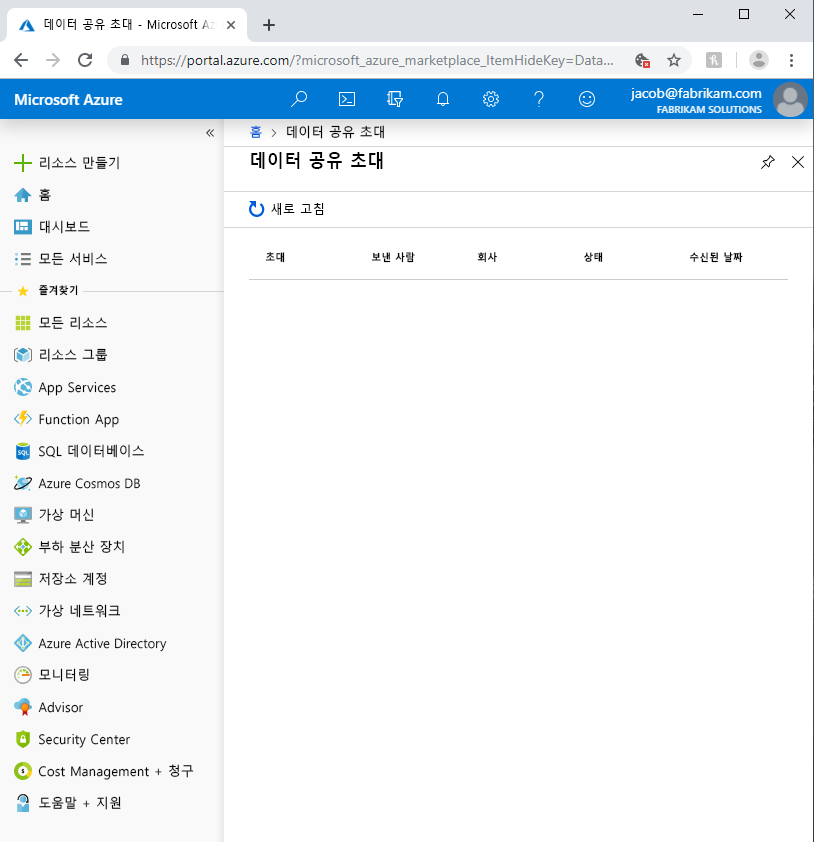
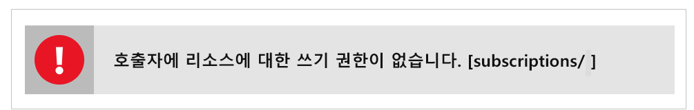

# Azure Data Share 미리 보기의 일반적인 문제 해결

이 문서에서는 Azure Data Share 미리 보기의 일반적인 문제를 해결하는 방법을 보여줍니다. 

## Azure Data Share 초대 

경우에 따라, 새로운 사용자가 전송된 이메일 초대에서 **초대 수락**을 클릭하면 빈 초대 목록이 표시될 수 있습니다. 

위의 오류는 서비스에 알려진 문제점이며 현재 처리 중입니다. 차선책으로 다음 단계를 따르십시오. 

1. Azure Portal에서 **구독**으로 이동합니다.
1. Azure Data Share에 사용 중인 구독을 선택합니다.
1. **리소스 공급자**를 클릭합니다.
1. Microsoft.DataShare를 검색합니다.
1. **등록**을 클릭합니다.

이 단계를 완료하려면 [Azure Contributor RBAC 역할](https://docs.microsoft.com/azure/role-based-access-control/built-in-roles#contributor)이 필요합니다. 

여전히 데이터 공유 초대를 볼 수 없는 경우 데이터 공급자에게 문의하여 메일 별칭이 *아닌* Azure 로그인 메일 주소로 초대를 보냈는지 확인합니다. 

> [!IMPORTANT]
> Azure Data Share 초대를 이미 수락했고 스토리지를 구성하기 전에 서비스를 종료한 경우, [데이터 세트 매핑 구성](how-to-configure-mapping.md) 방법 가이드에 자세히 설명된 지침에 따라 받은 데이터 공유 구성을 마치고 데이터 받기를 시작하는 방법을 알아보세요. 

## 새 Data Share를 만들거나 받을 때 오류 발생

"오류: 작업이 잘못된 상태 코드 'BadRequest'를 반환했습니다."

"오류: AuthorizationFailed"

"오류: 스토리지 계정에 대한 역할 할당"

새 데이터 공유를 만들거나 새 데이터 공유를 받을 때 위의 오류 메시지 중 하나 이상을 받는다면 스토리지 계정에 대한 권한이 부족하기 때문입니다. 필요한 권한은 *Microsoft.Authorization/role assignments/write*이며, 이 권한은 스토리지 소유자 역할에 있거나 사용자 지정 역할에 할당할 수 있습니다. 스토리지 계정을 만들었더라도 자동으로 스토리지 계정의 소유자가 되지는 않습니다. 다음 단계에 따라 자신에게 스토리지 계정의 소유자 권한을 부여할 수 있습니다. 또는, 자신을 추가할 수 있는 이 권한을 사용하여 사용자 지정 역할을 만들 수 있습니다.  

1. Azure Portal에서 스토리지 계정으로 이동합니다.
1. **액세스 제어(IAM)** 를 선택합니다.
1. **추가**를 클릭합니다.
1. 자신을 소유자로 추가합니다.

## 다음 단계

데이터 공유를 시작하는 방법을 알아보려면 [데이터 공유](share-your-data.md) 자습서로 계속 진행하세요.

