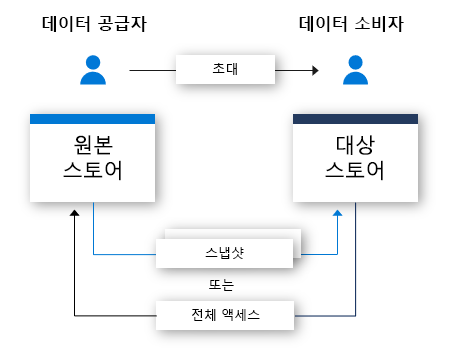

# Azure Data Share란?

오늘날의 세계에서 데이터는 많은 조직에서 고객 및 파트너와 간단하고 안전하게 공유해야 하는 핵심 전략 자산으로 간주됩니다. 현재 고객이 FTP, 이메일, API에서 이름에 이르기까지 몇 가지 항목을 통해 이러한 작업을 수행하는 여러 가지 방법이 있습니다. 조직은 데이터를 공유한 사람을 쉽게 추적할 수 없습니다. FTP를 통하거나 자체 API 인프라를 구축하여 데이터를 공유하면 프로비저닝 및 관리 비용이 많이 드는 경우가 많습니다. 이러한 공유 메서드를 대규모로 사용하는 것과 관련된 관리 오버헤드가 있습니다. 

대부분의 조직에서는 공유한 데이터에 대해 책임을 져야 합니다. 책임 외에도, 대부분의 조직에서는 모든 데이터 공유를 간단한 방법으로 제어, 관리 및 모니터링할 수 있기를 원합니다. 데이터가 기하급수적으로 증가할 것으로 예상되는 오늘날의 환경에서 조직에는 빅 데이터를 공유할 수 있는 간단한 방법이 필요합니다. 고객은 시기적절한 인사이트를 끌어낼 수 있도록 최신 데이터를 요구합니다.

Azure Data Share를 사용하면 조직에서 여러 고객 및 파트너와 간단하고 안전하게 데이터를 공유할 수 있습니다. 단 몇 번의 클릭만으로 새 데이터 공유 계정을 프로비저닝하고, 데이터 세트를 추가하며, 고객 및 파트너를 데이터 공유에 초대할 수 있습니다. 데이터 공급자는 항상 공유하는 데이터를 제어합니다. Azure Data Share를 사용하면 공유된 데이터, 시기 및 공유 주체를 간단하게 관리하고 모니터링할 수 있습니다. 

데이터 공급자는 데이터 공유에 대한 사용 약관을 지정하여 데이터를 처리하는 방법을 제어할 수 있습니다. 데이터 소비자는 데이터를 받기 전에 이러한 약관에 동의해야 합니다. 데이터 공급자는 데이터 소비자가 업데이트를 받는 빈도를 지정할 수 있습니다. 데이터 공급자는 언제든지 새 업데이트에 대한 액세스를 취소할 수 있습니다. 

Azure Data Share는 타사의 데이터를 쉽게 결합하여 분석 및 AI 시나리오를 강화함으로써 인사이트를 향상시키는 데 도움이 됩니다. Azure 분석 도구의 강력한 기능을 쉽게 사용하여 Azure Data Share를 통해 공유 데이터를 준비, 처리 및 분석합니다. 

데이터 공급자와 데이터 소비자 모두 Azure 구독이 있어야만 데이터를 공유하고 수신할 수 있습니다. Azure 구독이 아직 없는 경우 [체험 계정](https://azure.microsoft.com/free/)을 만듭니다.

## Azure Data Share 시나리오

Azure Data Share는 다양한 산업 분야에서 사용할 수 있습니다. 예를 들어 소매업체는 최근의 판매 시점 데이터를 공급업체와 공유할 수 있습니다. Azure Data Share를 사용하면 소매업체에서 모든 공급업체에 대한 판매 시점 데이터가 포함된 데이터 공유를 설정하고 시간별 또는 일별 단위로 판매 데이터를 공유할 수 있습니다. 

또한 Azure Data Share는 특정 산업에 대한 데이터 마켓플레이스를 구축하는 데도 사용할 수 있습니다. 예를 들어 인구 증가에 관한 익명의 데이터를 제3자와 정기적으로 공유하는 정부 또는 연구 기관입니다. 

Azure Data Share의 또 다른 사용 사례는 데이터 컨소시엄을 구축하는 것입니다. 예를 들어 다양한 여러 연구 기관들이 하나의 신뢰할 수 있는 기관과 데이터를 공유할 수 있습니다. 데이터는 Azure 분석 도구를 사용하여 분석, 집계 또는 처리된 다음, 이해 관계자와 공유됩니다. 

## 작동 방법

Azure Data Share는 현재 스냅샷 기반 공유와 내부 공유를 제공합니다. 

스냅샷 기반 공유에서는 데이터가 데이터 공급자의 Azure 구독에서 이동하여 데이터 소비자의 Azure 구독에 전달됩니다. 데이터 공급자는 데이터 공유를 프로비저닝하고 받는 사람을 해당 데이터 공유에 초대합니다. 데이터 소비자는 이메일을 통해 데이터 공유에 대한 초대를 받습니다. 데이터 소비자가 초대를 수락하면 공유한 데이터의 전체 스냅샷을 트리거할 수 있습니다. 이 데이터는 데이터 소비자 스토리지 계정에서 받습니다. 데이터 소비자는 항상 최신 버전의 데이터를 사용할 수 있도록 데이터 공유에 대한 정기적인 증분 업데이트를 받을 수 있습니다. 

데이터 공급자는 데이터 소비자에게 스냅샷 일정을 통해 공유되는 데이터에 대한 증분 업데이트를 제공할 수 있습니다. 스냅샷 일정은 시간별 또는 일별 단위로 제공됩니다. 데이터 소비자는 데이터 공유를 수락하고 구성하면 스냅샷 일정을 구독할 수 있습니다. 이는 공유 데이터가 정기적으로 업데이트되고 데이터 소비자가 최신 데이터를 필요로 하는 시나리오에서 유용합니다. 

데이터 소비자가 데이터 공유를 수락하면 데이터를 자신이 선택한 데이터 저장소로 받을 수 있습니다. 예를 들어 데이터 공급자가 Azure Blob Storage를 사용하여 데이터를 공유하는 경우 데이터 소비자는 이 데이터를 Azure Data Lake Store에서 받을 수 있습니다. 마찬가지로 데이터 공급자가 Azure SQL Data Warehouse에서 데이터를 공유하는 경우 데이터 소비자는 데이터를 Azure Data Lake Store, Azure SQL Database 및 Azure SQL Data Warehouse 중 어느 것으로 받을지 선택할 수 있습니다. SQL 기반 소스에서 공유하는 경우 데이터 소비자는 parquet과 csv 중 어느 형식으로 데이터를 받을지도 선택할 수 있습니다. 

내부 공유를 사용하는 경우 데이터 공급자는 데이터를 복사하지 않고 상주하는 데이터를 공유할 수 있습니다. 공유 관계가 초대 흐름을 통해 설정된 후에는 데이터 공급자의 원본 데이터 저장소와 데이터 소비자의 대상 데이터 저장소 간에 기호화된 링크가 만들어집니다. 데이터 소비자는 자체 데이터 저장소를 사용하여 실시간으로 데이터를 읽고 쿼리할 수 있습니다. 원본 데이터 저장소에 대한 변경 내용은 데이터 소비자에게 즉시 제공됩니다. 내부 공유는 현재 Azure Data Explorer의 미리 보기로 제공됩니다.

## 주요 기능

Azure Data Share를 사용하는 경우 데이터 공급자가 수행할 수 있는 작업은 다음과 같습니다.

* 조직 외부의 고객 및 파트너와 [지원되는 데이터 저장소](supported-data-stores.md) 목록의 데이터 공유

* 데이터를 공유한 사용자에 대한 추적

* 스냅샷 또는 내부 공유 선택

* 데이터 소비자가 데이터 업데이트를 받는 빈도

* 고객이 필요에 따라 최신 버전의 데이터를 가져오거나 정의한 간격으로 데이터에 대한 증분 변경 내용을 자동으로 받도록 허용

Azure Data Share를 사용하는 경우 데이터 소비자가 수행할 수 있는 작업은 다음과 같습니다. 

* 공유되는 데이터 형식에 대한 설명 보기

* 데이터에 대한 사용 약관 보기

* Azure Data Share 초대에 대한 수락 또는 거부

* [지원되는 데이터 저장소](supported-data-stores.md)로 공유되는 데이터 받기

* 조직에서 공유한 데이터 공유의 전체 또는 증분 스냅샷 트리거

* 데이터 공유를 구독하여 증분 스냅샷을 통해 데이터의 최신 복사본 받기

위에 나열된 주요 기능은 모두 Azure Portal 또는 REST API를 통해 지원됩니다. REST API를 통해 Azure Data Share를 사용하는 방법에 대한 자세한 내용은 참조 설명서를 확인하세요. 

## 지원되는 지역

Azure Data Share를 사용할 수 있는 Azure 지역 목록은 [지역별 사용 가능한 제품](https://azure.microsoft.com/global-infrastructure/services/?products=data-share) 페이지를 참조하고 Azure Data Share를 검색하세요. 

Azure Data Share는 데이터 자체를 저장하지 않습니다. 데이터는 공유되는 기본 데이터 저장소에 저장됩니다. 예를 들어 데이터 생산자가 데이터를 미국 서부에 있는 Azure Data Lake Store 계정에 저장하면 데이터가 여기에 저장됩니다. 스냅샷을 통해 데이터를 서유럽에 있는 Azure Storage 계정과 공유하는 경우 데이터는 서유럽에 있는 Azure Storage 계정으로 직접 전송됩니다.

Azure Data Share 서비스를 활용하기 위해 해당 지역에서 이 서비스를 사용할 필요가 없습니다. 예를 들어 Azure Data Share를 아직 사용할 수 없는 지역에 위치한 Azure Storage 계정에 데이터가 저장된 경우에도 이 서비스를 활용하여 데이터를 공유할 수 있습니다. 

## 다음 단계

데이터 공유를 시작하는 방법을 알아보려면 [데이터 공유](share-your-data.md) 자습서로 계속 진행하세요.
