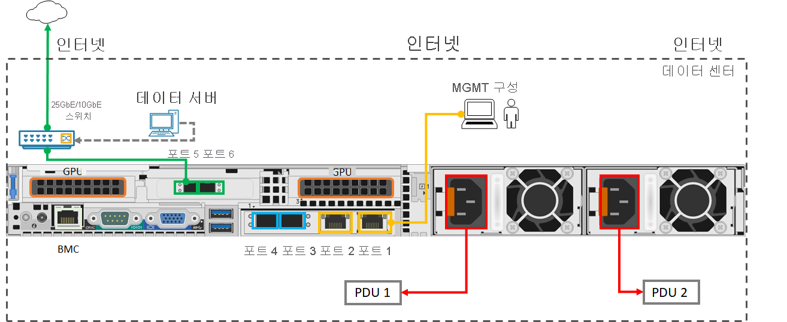

# 빠른 시작: GPU가 있는 Azure Stack Edge Pro 시작 

이 빠른 시작에서는 Azure Stack Edge Pro GPU 디바이스를 배포하는 데 필요한 필수 구성 요소 및 단계에 대해 자세히 설명합니다. 디바이스의 로컬 웹 UI와 Azure Portal에서 이 빠른 시작 단계를 수행합니다. 

전체 절차를 완료하는 데 약 1.5시간이 소요됩니다. 자세한 단계별 지침은 [자습서: Azure Stack Edge Pro GPU 배포 준비](azure-stack-edge-gpu-deploy-prep.md#deployment-configuration-checklist)로 참조하세요. 

## 사전 요구 사항

배포하기 전에 다음 필수 구성 요소가 준비되어 있는지 확인합니다.

1. Azure Stack Edge Pro GPU 디바이스는 [압축을 풀고](azure-stack-edge-gpu-deploy-install.md#unpack-the-device) [랙에 탑재](azure-stack-edge-gpu-deploy-install.md#rack-the-device)한 상태로 사이트에 제공됩니다. 
1. 디바이스가 [나열된 URL 패턴 및 포트](azure-stack-edge-gpu-system-requirements.md#networking-port-requirements)에 도달할 수 있도록 네트워크를 구성합니다. 
1. 구독에 대한 소유자 또는 기여자 액세스 권한이 있습니다.
1. Azure Portal에서 **홈 > 구독 > 사용자의 구독 > 리소스 공급자**로 차례로 이동합니다. `Microsoft.DataBoxEdge`를 검색하고 리소스 공급자를 등록합니다. 컴퓨팅 워크로드를 배포하는 IoT Hub 리소스를 만드는 경우 `Microsoft.Devices`를 등록하는 과정을 반복합니다.
1. Kubernetes 노드에 대해 둘 이상의 사용 가능한 고정 연속 IP가 있고, IoT Edge 서비스에 대해 하나 이상의 고정 IP가 있어야 합니다. 배포하는 각 모듈 또는 외부 서비스에 대해 하나의 추가 IP가 필요합니다.
1. 디바이스 구성에 필요한 모든 항목을 가져오려면 [배포 검사 목록](azure-stack-edge-gpu-deploy-checklist.md)을 참조하세요. 

## 배포 단계

1. **설치**: 크로스오버 케이블 또는 USB 이더넷 어댑터를 통해 포트 1을 클라이언트 컴퓨터에 연결합니다. 하나 이상의 1GbE 스위치와 SFP+ 동 케이블을 통해 하나 이상의 데이터용 다른 디바이스 포트(가급적 25GbE)(포트 3에서 포트 6까지)를 인터넷에 연결합니다. 제공된 전원 코드를 전원 공급 장치 및 별도의 배전 콘센트에 연결합니다. 전면 패널에서 전원 단추를 눌러 디바이스를 켭니다.  

    호환 네트워크 케이블 및 스위치를 얻으려면 [Cavium FastlinQ 41000 시리즈 상호 운용성 매트릭스](https://www.marvell.com/documents/xalflardzafh32cfvi0z/) 및 [Mellanox 이중 포트 25G ConnectX-4 채널 네트워크 어댑터 호환 제품](https://docs.mellanox.com/display/ConnectX4LxFirmwarev14271016/Firmware+Compatible+Products)을 참조하세요.

    디바이스를 배포하는 데 필요한 최소 케이블 구성은 다음과 같습니다.  

2. **연결**: 고정 IP 주소(**192.168.100.5**) 및 서브넷(**255.255.255.0**)을 사용하여 컴퓨터의 이더넷 어댑터에서 IPv4 설정을 구성합니다. 브라우저를 열고, https://192.168.100.10 에서 디바이스의 로컬 웹 UI에 연결합니다. 몇 분이 걸릴 수 있습니다. 보안 인증서 경고가 표시되면 웹 페이지를 계속 진행합니다.

3. **로그인**: 기본 암호(*Password1*)를 사용하여 디바이스에 로그인합니다. 디바이스 관리자 암호를 변경합니다. 암호는 8~16자여야 하며, 3자의 대문자, 소문자, 숫자 및 특수 문자를 포함해야 합니다.

4. **네트워크 구성**: 네트워크에 DHCP 서버가 있는 경우 연결된 데이터 포트에 대한 기본 DHCP 구성을 적용합니다. 그렇지 않은 경우 IP, DNS 서버 및 기본 게이트웨이를 제공합니다. 자세한 내용은 [네트워크 설정](azure-stack-edge-gpu-deploy-configure-network-compute-web-proxy.md#configure-network)을 참조하세요.

5. **컴퓨팅 네트워크 구성**: 디바이스에서 포트를 사용하도록 설정하여 가상 스위치를 만듭니다. 스위치를 만든 동일한 네트워크에 있는 Kubernetes 노드에 대해 두 개의 사용 가능한 연속 고정 IP를 입력합니다. 컴퓨팅 모듈에 액세스하는 IoT Edge Hub 서비스에 대해 하나 이상의 고정 IP를 제공하고, Kubernetes 클러스터 외부에서 액세스하려는 각 추가 서비스 또는 컨테이너에 대해 하나의 고정 IP를 제공합니다. 

    Kubernetes는 모든 컨테이너화된 워크로드를 배포하는 데 필요합니다. 자세한 내용은 [컴퓨팅 네트워크 설정](azure-stack-edge-gpu-deploy-configure-network-compute-web-proxy.md#enable-compute-network)을 참조하세요.

6. **웹 프록시 구성**: 사용자 환경에서 웹 프록시를 사용하는 경우 `http://<web-proxy-server-FQDN>:<port-id>`에서 웹 프록시 서버 IP를 입력합니다. 인증을 **없음**으로 설정합니다. 자세한 내용은 [웹 프록시 설정](azure-stack-edge-gpu-deploy-configure-network-compute-web-proxy.md#configure-web-proxy)을 참조하세요.

7. **디바이스 구성**: 디바이스 이름과 DNS 도메인을 입력하거나 기본값을 적용합니다. 

8. **업데이트 서버 구성**: 기본 Microsoft 업데이트 서버를 적용하거나 WSUS(Windows Server Update Services) 서버 및 이 서버의 경로를 지정합니다. 

9. **시간 설정 구성**: 기본 시간 설정을 적용하거나 표준 시간대, 기본 NTP 서버 및 보조 NTP 서버를 로컬 네트워크에서 또는 퍼블릭 서버로 설정합니다.

10. **인증서 구성**: 디바이스 이름 및/또는 DNS 도메인을 변경한 경우 디바이스를 활성화하기 위해 인증서를 생성하거나 추가해야 합니다. 

    - 비 프로덕션 워크로드를 테스트하려면 [인증서 생성 옵션](azure-stack-edge-gpu-deploy-configure-certificates.md#generate-device-certificates)을 사용합니다. 
    - 서명 체인을 포함하여 자체 인증서를 가져오는 경우 [인증서를 적절한 형식으로 추가](azure-stack-edge-gpu-deploy-configure-certificates.md#bring-your-own-certificates)합니다. 먼저 서명 체인을 업로드해야 합니다. [인증서 만들기](azure-stack-edge-j-series-create-certificates-tool.md) 및 [로컬 UI를 통해 인증서 업로드](azure-stack-edge-gpu-deploy-configure-certificates.md#bring-your-own-certificates)를 참조하세요.

11. **활성화**: 활성화 키를 가져오려면, 

    1. Azure Portal에서 **Azure Stack Edge 리소스 > 개요 > 디바이스 설정 > 활성화 > 키 생성**으로 차례로 이동합니다. 키를 복사합니다. 
    1. 로컬 웹 UI에서 **시작 > 활성화**로 차례로 이동하여 활성화 키를 제공합니다. 키가 적용되면 디바이스를 활성화하는 데 몇 분이 걸립니다. 향후 복구하는 데 필요한 디바이스 키를 안전하게 저장하라는 메시지가 표시되면 `<device-serial-number>`.json 파일을 다운로드합니다. 

12. **컴퓨팅 구성**: Azure Portal에서 **개요 > 디바이스**로 차례로 이동합니다. 디바이스가 **온라인**인지 확인합니다. 왼쪽 창에서 **Edge 컴퓨팅 > 시작 > Edge 컴퓨팅 구성 > 컴퓨팅**으로 차례로 이동합니다. 기존 또는 새 IoT Hub 서비스를 제공하고, 컴퓨팅이 구성될 때까지 약 20분 정도 기다립니다. 자세한 내용은 [자습서: Azure Stack Edge Pro GPU 디바이스에 컴퓨팅 구성](azure-stack-edge-gpu-deploy-configure-compute.md)을 참조하세요.

[IoT Edge](azure-stack-edge-gpu-deploy-sample-module-marketplace.md), [`kubectl`](azure-stack-edge-gpu-create-kubernetes-cluster.md) 또는 [Azure Arc 지원 Kubernetes](azure-stack-edge-gpu-deploy-arc-kubernetes-cluster.md)를 통해 컴퓨팅 워크로드를 디바이스에 배포할 준비가 되었습니다. 설치하는 동안 문제가 발생하면 [디바이스 문제](), [주문 문제](azure-stack-edge-gpu-troubleshoot.md), [인증서 문제](azure-stack-edge-j-series-certificate-troubleshooting.md), 또는 Kubernetes 문제 해결로 이동합니다. 

## 다음 단계

[Azure Stack Edge Pro GPU 설치](./azure-stack-edge-gpu-deploy-install.md)

