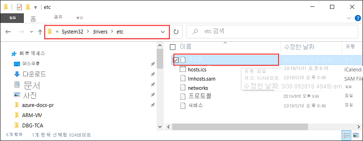
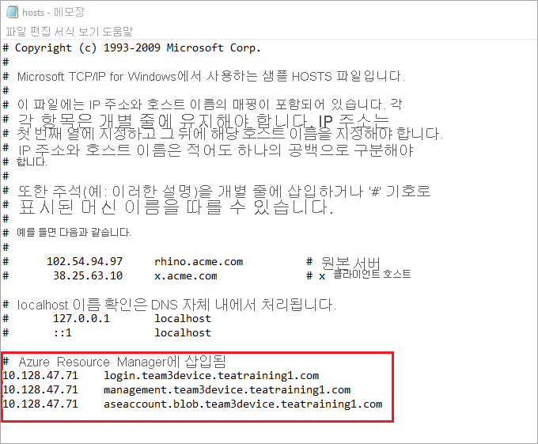

# <a name="deploy-vms-on-your-azure-stack-edge-pro-gpu-device-via-azure-powershell-script"></a>Azure PowerShell 스크립트를 통해 Azure Stack Edge Pro GPU 장치에 Vm 배포

<!--[!INCLUDE [applies-to-skus](../../includes/azure-stack-edge-applies-to-all-sku.md)]-->

이 자습서에서는 Azure PowerShell 스크립트를 사용 하 여 Azure Stack Edge Pro 장치에서 VM을 만들고 관리 하는 방법을 설명 합니다.

## <a name="prerequisites"></a>필수 구성 요소

이 스크립트를 사용 하 여 Azure Stack Edge Pro 장치에서 VM 만들기 및 관리를 시작 하기 전에 다음 단계에 나열 된 필수 구성 요소를 완료 했는지 확인 해야 합니다.

### <a name="for-azure-stack-edge-pro-device-via-the-local-web-ui"></a>로컬 웹 UI를 통해 Azure Stack Edge Pro 장치

1. [1단계: Azure Stack Edge Pro 디바이스 구성](azure-stack-edge-j-series-connect-resource-manager.md#step-1-configure-azure-stack-edge-pro-device)의 설명대로 Azure Stack Edge Pro 디바이스에서 네트워크 설정을 완료했습니다.

2. 컴퓨팅을 위한 네트워크 인터페이스를 사용하도록 설정했습니다. 이 네트워크 인터페이스 IP는 VM 배포를 위한 가상 스위치를 만드는 데 사용됩니다. 이 프로세스를 안내하는 단계는 다음과 같습니다.

    1. **계산 설정**으로 이동 합니다. 가상 스위치를 만드는 데 사용할 네트워크 인터페이스를 선택합니다.

        > [!IMPORTANT] 
        > 컴퓨팅용 포트는 하나만 구성할 수 있습니다.

    2. 네트워크 인터페이스에서 컴퓨팅을 사용하도록 설정합니다. 이 네트워크 인터페이스에 해당하는 가상 스위치를 Azure Stack Edge Pro가 만들고 관리합니다.

3. Azure Stack Edge Pro 장치 및 클라이언트의 신뢰할 수 있는 루트 저장소에 모든 인증서를 만들고 설치 했습니다. [2단계: 인증서 만들기 및 설치](azure-stack-edge-j-series-connect-resource-manager.md#step-2-create-and-install-certificates)에 설명된 절차를 따릅니다.

### <a name="for-your-windows-client"></a>Windows 클라이언트의 경우

1. 장치의 로컬 웹 UI에서 **네트워크** 페이지의 Azure 일관 된 서비스 VIP (가상 인터넷 프로토콜)를 정의 했습니다. 다음에이 VIP를 추가 해야 합니다.

    - 클라이언트의 호스트 파일 또는
    - DNS 서버 구성
    
    > [!IMPORTANT]
    > 엔드포인트 이름 확인을 위해 DNS 서버 구성을 수정하는 것이 좋습니다.

    1. **메모장**을 관리자(파일을 저장하려면 관리자 권한이 필요함) 권한으로 시작한 다음, `C:\Windows\System32\Drivers\etc`에 있는 **hosts** 파일을 엽니다.
    
        
    
    2. 다음 항목을 디바이스에 적합한 값으로 대체하고 **hosts** 파일에 추가합니다.
    
        ```
        <Azure consistent services VIP> login.<appliance name>.<DNS domain>
        <Azure consistent services VIP> management.<appliance name>.<DNS domain>
        <Azure consistent services VIP> <storage name>.blob.<appliance name>.<DNS domain>
        ```
        저장소 계정에 대해 스크립트에서 나중에 새 저장소 계정을 만드는 데 사용할 이름을 제공할 수 있습니다. 스크립트는 해당 저장소 계정이 기존 인지 확인 하지 않습니다.

    3. 다음 이미지를 참조하세요. **호스트** 파일을 저장합니다.

        

2. 이 절차에서 사용 되는 [PowerShell 스크립트를 다운로드](https://aka.ms/ase-vm-powershell) 합니다.

3. Windows 클라이언트에서 PowerShell 5.0 이상을 실행 하 고 있는지 확인 합니다.

4. `Azure.Storage Module version 4.5.0`가 시스템에 설치 되어 있는지 확인 합니다. [PowerShell 갤러리](https://www.powershellgallery.com/packages/Azure.Storage/4.5.0)에서이 모듈을 가져올 수 있습니다. 이 모듈을 설치 하려면 다음을 입력 합니다.

    `Install-Module -Name Azure.Storage -RequiredVersion 4.5.0`

    설치 된 모듈의 버전을 확인 하려면 다음을 입력 합니다.

    `Get-InstalledModule -name Azure.Storage`

    다른 버전 모듈을 제거 하려면 다음을 입력 합니다.

    `Uninstall-Module -Name Azure.Storage`

5. Windows 클라이언트에 [AzCopy 10을 다운로드](https://docs.microsoft.com/azure/storage/common/storage-use-azcopy-v10#download-azcopy) 합니다. 스크립트를 실행 하는 동안 매개 변수로 전달 하므로이 위치를 기록해 둡니다.

6. Windows 클라이언트에서 TLS 1.2 이상을 실행 하 고 있는지 확인 합니다.


## <a name="create-a-vm"></a>VM 만들기

1. PowerShell을 관리자 권한으로 실행합니다.
2. 클라이언트에서 스크립트를 다운로드 한 폴더로 이동 합니다.  
3. 다음 명령을 사용하여 스크립트를 실행합니다.
 
    `.\ArmPowershellClient.ps1 -VNetAddressSpace <AddressSpace> -NicPrivateIp <Private IP> -VHDPath <Path> -VHDFile <VHD File, with extension> -StorageAccountName <Name> -OS <Windows/Linux> -VMSize <Supported VM Size> -VMUserName <UserName to be used to login into VM> -VMPassword <Password for the VM login> --AzCopy10Path <Absolute Path>`

    Windows VM 및 Linux VM을 만들기 위해 스크립트를 실행 하는 경우의 예는 다음과 같습니다.

    **Windows VM의 경우:**

    `.\ArmPowershellClient.ps1 -VNetAddressSpace 5.5.0.0/16 -NicPrivateIp 5.5.168.73 -VHDPath \\intel01\d$\vm_vhds\AzureWindowsVMmode -VHDFile WindowsServer2016Datacenter.vhd -StorageAccountName teaaccount1 -OS Windows -VMSize Standard_D1_v2 -VMUserName Administrator -VMPassword Password1 -AzCopy10Path C:\azcopy10\azcopy.exe`

    **Linux VM의 경우:**

    `.\ArmPowershellClient.ps1 -VNetAddressSpace 5.5.0.0/16 -NicPrivateIp 5.5.168.83 -VHDPath \\intel01\d$\vm_vhds\AzurestackLinux -VHDFile ubuntu13.vhd -StorageAccountName sa2 -OS Linux -VMSize Standard_D1_v2 -VMUserName Administrator -VMPassword Password1 -AzCopy10Path C:\azcopy10\azcopy.exe`
    
4. 스크립트에서 만든 리소스를 정리 하려면 다음 명령을 사용 합니다.
    
    ```powershell
    Get-AzureRmVM | Remove-AzureRmVM -Force
    Get-AzureRmNetworkInterface | Remove-AzureRmNetworkInterface -Force
    Get-AzureRmResource | Remove-AzureRmResource -f
    Get-AzureRmResourceGroup | Remove-AzureRmResourceGroup -f
    ```


## <a name="next-steps"></a>다음 단계

[Azure PowerShell cmdlet을 사용 하 여 Vm 배포](azure-stack-edge-j-series-deploy-virtual-machine-powershell.md)
