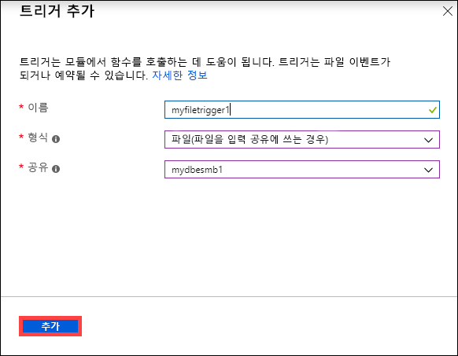
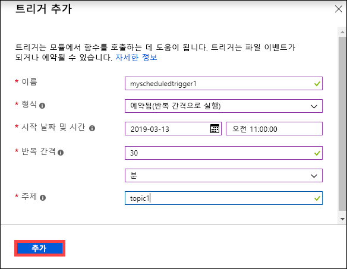
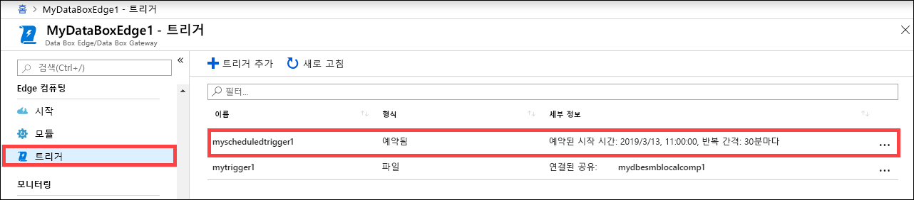
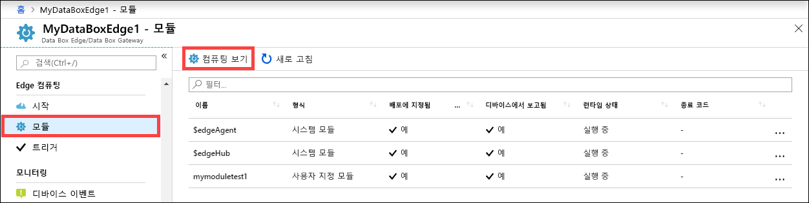
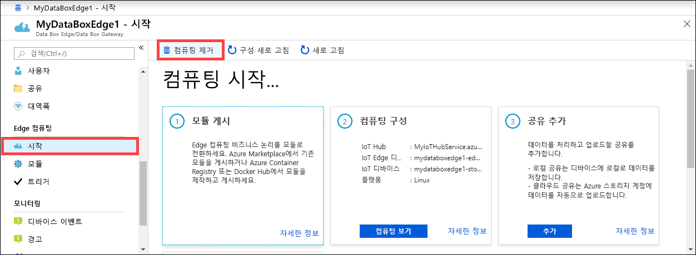
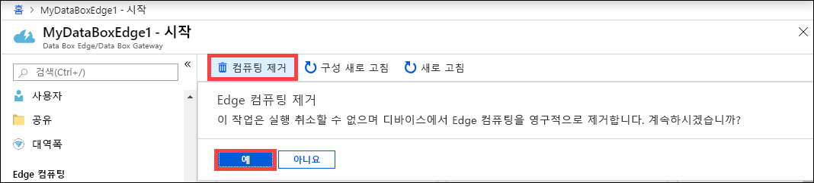
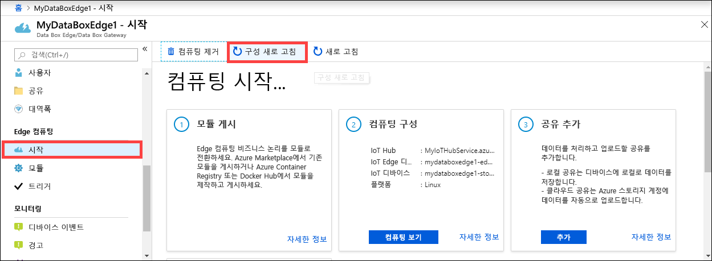
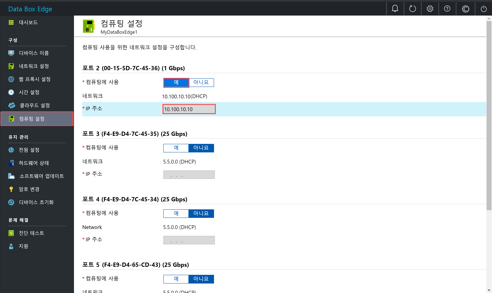

# Azure Data Box Edge에서 컴퓨팅 관리

이 문서에서는 Azure Data Box Edge에서 컴퓨팅을 관리하는 방법을 설명합니다. 로컬 웹 UI 또는 Azure Portal을 통해 컴퓨팅을 관리할 수 있습니다. Azure Portal에서 모듈, 트리거 및 컴퓨팅 구성을 관리하고 로컬 웹 UI를 사용하여 컴퓨팅 설정을 관리합니다.

> [!IMPORTANT]
> Data Box Edge는 미리 보기로 있습니다. 이 솔루션을 주문하고 배포하기 전에 [미리 보기에 대한 Azure 서비스 약관](https://azure.microsoft.com/support/legal/preview-supplemental-terms/)을 검토하세요.

이 문서에서는 다음 방법을 설명합니다.

> [!div class="checklist"]
> * 트리거 관리
> * 컴퓨팅 구성 관리

## 트리거 관리

이벤트는 작업을 수행하려는 클라우드 환경 또는 디바이스에서 발생하는 상황입니다. 예를 들어, 공유에서 파일이 만들어지는 것도 이벤트에 해당합니다. 트리거는 이벤트를 발생시킵니다. Data Box Edge의 경우 트리거는 파일 이벤트 또는 일정에 대한 응답일 수 있습니다.

- **파일**: 이러한 트리거는 파일 생성, 파일 수정과 같은 파일 이벤트에 대한 응답입니다.
- **예약됨**: 이러한 트리거는 시작 날짜, 시작 시간 및 반복 간격으로 정의할 수 있는 일정에 대한 응답입니다.

### 트리거 추가

트리거를 만들려면 Azure Portal에서 다음 단계를 수행합니다.

1. Azure Portal에서 Data Box Edge 리소스로 이동한 다음, **Edge 컴퓨팅 > 트리거**로 이동합니다. 명령 모음에서 **+ 트리거 추가**를 선택합니다.

    

2. **트리거 추가** 블레이드에서 트리거의 고유한 이름을 지정합니다.
    
    <!--Trigger names can only contain numbers, lowercase letters, and hyphens. The share name must be between 3 and 63 characters long and begin with a letter or a number. Each hyphen must be preceded and followed by a non-hyphen character.-->

3. 트리거의 **유형**을 선택합니다. 트리거가 파일 이벤트에 대한 응답일 경우 **파일**을 선택합니다. 트리거를 정의된 시간에 시작하고 지정된 반복 간격으로 실행하려는 경우 **예약됨**을 선택합니다. 선택한 항목에 따라 다른 옵션 세트가 표시됩니다.

    - **파일 트리거** - 드롭다운 목록에서 탑재된 공유를 선택합니다. 이 공유에서 파일 이벤트가 발생하면 트리거는 Azure 함수를 호출합니다.

        

    - **예약된 트리거** - 시작 날짜/시간, 반복 간격(시, 분 또는 초)을 지정합니다. 또한 토픽의 이름을 입력합니다. 토픽을 사용하면 트리거를 디바이스에 배포된 모듈로 유연하게 라우팅할 수 있습니다.

        경로 문자열의 예시는 `"route3": "FROM /* WHERE topic = 'topicname' INTO BrokeredEndpoint("modules/modulename/inputs/input1")"`입니다.

        

4. **추가**를 선택하여 트리거를 만듭니다. 알림은 트리거 생성이 진행 중임을 나타냅니다. 트리거를 만든 후 새 트리거를 반영하도록 블레이드가 업데이트됩니다.
 
    

### 트리거 삭제

트리거를 삭제하려면 Azure Portal에서 다음 단계를 수행합니다.

1. 트리거 목록에서 삭제하려는 트리거를 선택합니다.

    

2. 마우스 오른쪽 단추를 클릭한 다음, **삭제**를 선택합니다.

    

3. 확인하라는 메시지가 표시되면 **예**를 클릭합니다.

    

트리거 목록이 삭제를 반영하도록 업데이트됩니다.

## 컴퓨팅 구성 관리

Azure Portal에서 컴퓨팅 구성을 보거나, 기존 컴퓨팅 구성을 제거하거나, 컴퓨팅 구성을 새로 고쳐 Data Box Edge의 IoT 디바이스 및 IoT Edge 디바이스에 대한 액세스 키를 동기화합니다.

### 컴퓨팅 구성 보기

디바이스의 컴퓨팅 구성을 보려면 Azure Portal에서 다음 단계를 수행합니다.

1. Azure Portal에서 Data Box Edge 리소스로 이동한 다음, **Edge 컴퓨팅 > 모듈**로 이동합니다. 명령 모음에서 **컴퓨팅 보기**를 선택합니다.

    

2. 디바이스의 컴퓨팅 구성을 기록해 둡니다. 컴퓨팅 구성할 때 IoT Hub 리소스를 만들었을 것입니다. 해당 IoT Hub 리소스 아래에 IoT 디바이스 및 IoT Edge 디바이스가 구성되어 있습니다. IoT Edge 디바이스에서는 Linux 모듈만 실행이 지원됩니다.

    

### 컴퓨팅 구성 제거

디바이스의 기존 Edge 컴퓨팅 구성을 제거하려면 Azure Portal에서 다음 단계를 수행합니다.

1. Azure Portal에서 Data Box Edge 리소스로 이동한 다음, **Edge 컴퓨팅 > 시작**으로 이동합니다. 명령 모음에서 **컴퓨팅 제거**를 선택합니다.

    

2. 컴퓨팅 구성을 제거한 경우 컴퓨팅을 다시 사용해야 할 때 디바이스를 다시 구성해야 합니다. 확인하라는 메시지가 표시되면 **예**를 선택합니다.

    

### IoT 디바이스 및 IoT Edge 디바이스 액세스 키 동기화

Data Box Edge에서 컴퓨팅을 구성하면 IoT 디바이스 및 IoT Edge 디바이스가 생성됩니다. 이러한 디바이스에는 대칭 액세스 키가 자동으로 할당됩니다. 보안 모범 사례에 따라 이러한 키는 IoT Hub 서비스를 통해 정기적으로 순환됩니다.

이러한 키를 순환하려면 만든 IoT Hub 서비스로 이동한 후 IoT 디바이스 또는 IoT Edge 디바이스를 선택합니다. 각 디바이스에는 기본 액세스 키 및 보조 액세스 키가 있습니다. 기본 액세스 키를 보조 액세스 키에 지정하고 기본 액세스 키를 다시 생성합니다.

IoT 디바이스 및 IoT Edge 디바이스 키가 순환되면 Data Box Edge에서 구성을 새로 고쳐 최신 액세스 키를 가져와야 합니다. 동기화는 IoT 디바이스 및 IoT Edge 디바이스의 최신 키를 가져오는 데 도움이 됩니다. Data Box Edge는 기본 액세스 키만 사용합니다.

디바이스의 액세스 키를 동기화하려면 Azure Portal에서 다음 단계를 수행합니다.

1. Azure Portal에서 Data Box Edge 리소스로 이동한 다음, **Edge 컴퓨팅 > 시작**으로 이동합니다. 명령 모음에서 **구성 새로 고침**을 선택합니다.

    

2. 확인하라는 메시지가 표시되면 **예**를 선택합니다.

     

3. 동기화가 완료되면 대화 상자를 종료합니다.

## 컴퓨팅을 위한 네트워크 인터페이스 사용

Data Box Edge 디바이스에서 실행 중인 모듈에 액세스해야 할 수 있습니다. 외부적으로 모듈에 액세스하려면 디바이스의 네트워크 인터페이스에 IP 주소를 할당해야 합니다. 로컬 웹 UI에서 이러한 컴퓨팅 설정을 관리 할 수 있습니다.

로컬 웹 UI에서 다음 단계를 수행하여 컴퓨팅 설정을 구성합니다.

1. 로컬 웹 UI에서 **구성 > 컴퓨팅 설정**으로 이동합니다.  

2. 디바이스의 컴퓨팅 모듈에 연결하는 데 사용할 네트워크 인터페이스를 **사용하도록 설정**합니다. 

    - 고정 IP 주소를 사용하는 경우 네트워크 인터페이스의 IP 주소를 입력합니다.
    - DHCP를 사용하는 경우에는 IP 주소가 자동으로 할당됩니다.

3. **적용**을 선택하여 설정을 적용합니다.

    

## 다음 단계

- [Azure Portal을 통해 사용자를 관리](data-box-edge-manage-users.md)하는 방법을 알아봅니다.
