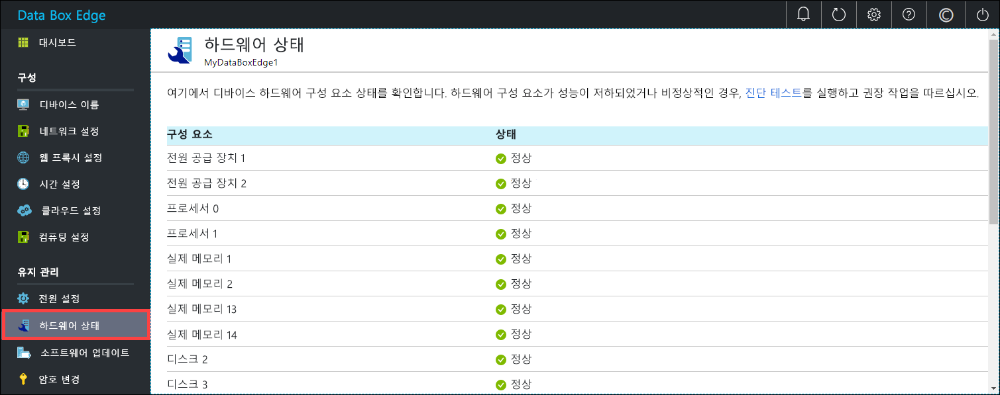

# Azure Data Box Edge 모니터링

이 문서에서는 Azure Data Box Edge를 모니터링하는 방법을 설명합니다. 디바이스를 모니터링하기 위해 Azure Portal 또는 로컬 웹 UI를 사용할 수 있습니다. Azure Portal을 사용하여 디바이스 이벤트를 보고 경고를 구성 및 관리하고 메트릭을 봅니다. 실제 디바이스에서 로컬 웹 UI를 사용하여 다양한 디바이스 구성 요소의 하드웨어 상태를 봅니다.

이 문서에서는 다음 방법을 설명합니다.

> [!div class="checklist"]
> * 디바이스 이벤트 및 해당 경고 보기
> * 디바이스 구성 요소의 하드웨어 상태 보기
> * 디바이스의 용량 및 트랜잭션 메트릭 보기
> * 경고 구성 및 관리

## 디바이스 이벤트 보기

[!INCLUDE [Supported OS for clients connected to device](../../includes/data-box-edge-gateway-view-device-events.md)]

## 하드웨어 상태 보기

디바이스 구성 요소의 하드웨어 상태를 보려면 로컬 웹 UI에서 다음 단계를 수행합니다.

1. 디바이스의 로컬 웹 UI에 연결합니다.
2. **유지 관리 > 하드웨어 상태**로 이동합니다. 다양한 디바이스 구성 요소의 상태를 볼 수 있습니다.

    

## 메트릭 보기

[!INCLUDE [Supported OS for clients connected to device](../../includes/data-box-edge-gateway-view-metrics.md)]

## 경고 관리

[!INCLUDE [Supported OS for clients connected to device](../../includes/data-box-edge-gateway-manage-alerts.md)]

## 다음 단계 

[대역폭을 관리](data-box-edge-manage-bandwidth-schedules.md)하는 방법에 대해 알아봅니다.