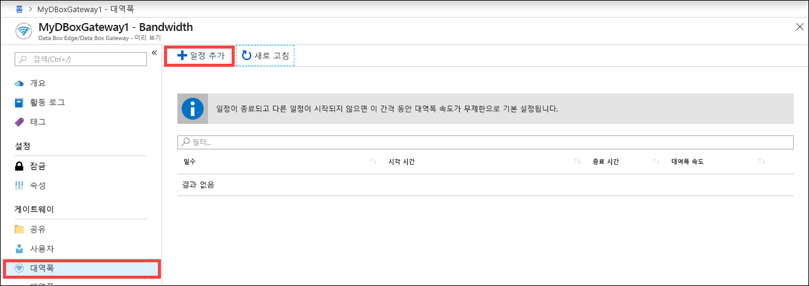
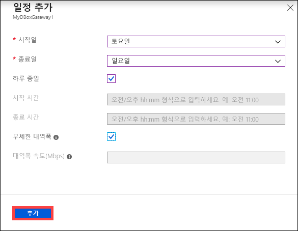
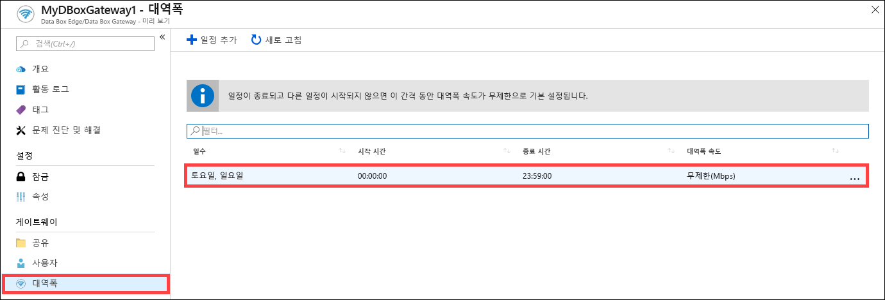
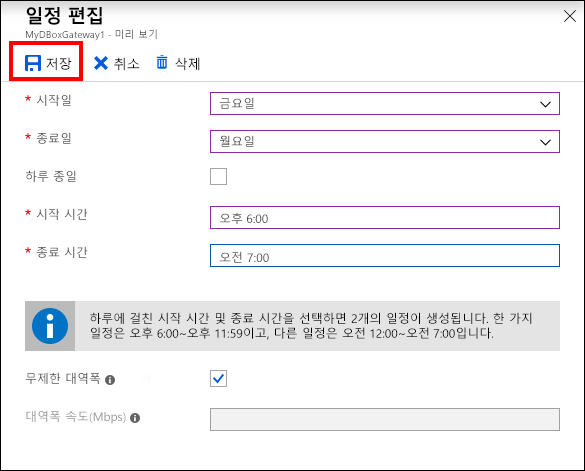
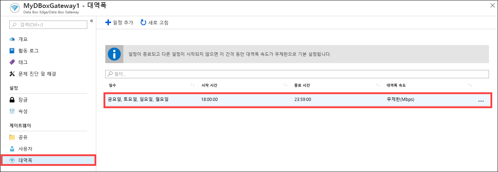
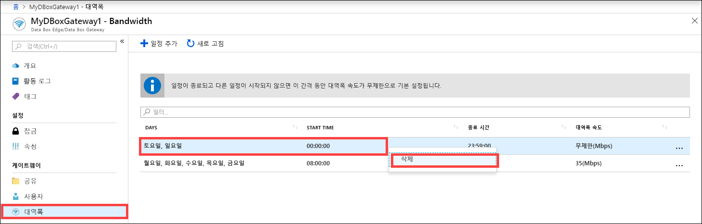

# Azure Portal을 사용하여 Azure Data Box Gateway에서 대역폭 일정 관리  

이 문서에서는 Azure Data Box Gateway에서 사용자를 관리하는 방법을 설명합니다. 대역폭 일정을 사용하면 여러 시간대의 일정에 대해 네트워크 대역폭 사용량을 구성할 수 있습니다. 이러한 일정은 디바이스에서 클라우드로 업로드 및 다운로드 작업에 적용할 수 있습니다. 

Azure Portal을 통해 Data Box Gateway에 대한 대역폭 일정을 추가, 수정 또는 삭제할 수 있습니다.

이 문서에서는 다음 방법을 설명합니다.

> [!div class="checklist"]
> * 일정 추가
> * 일정 수정
> * 일정 삭제 

## 일정 추가

사용자를 추가하려면 Azure Portal에서 다음 단계를 수행합니다.

1. Data Box Gateway 리소스에 대한 Azure Portal에서 **대역폭**으로 이동합니다.
2. 오른쪽 창에서 **+ 일정 추가**를 클릭합니다.

    

3. **일정 추가**에서: 

   1. 일정에 대한 **시작일**, **종료일**, **시작 시간** 및 **종료 시간**을 입력합니다. 
   2. 일정을 하루 종일 실행하는 경우에는 **하루 종일** 옵션을 선택하면 됩니다. 
   3. **대역폭 속도**는 클라우드와 관련된 작업(업로드 및 다운로드 모두)의 디바이스에 사용되는 초당 메가비트(Mbps)의 대역폭입니다. 이 필드에 대해 1에서 1,000 사이의 숫자를 제공합니다. 
   4. 업로드 및 다운로드 날짜를 제한하지 않으려면 **무제한 대역폭**을 선택합니다. 
   5. **추가**를 클릭합니다.

      

3. 지정한 매개 변수로 일정이 만들어집니다. 이 일정은 포털의 대역폭 일정 목록에 표시됩니다.

## 일정 편집

대역폭 일정을 편집하려면 다음 단계를 수행합니다. 

1. Azure Portal에서 Data Box Gateway 리소스로 이동한 다음, 대역폭으로 이동합니다. 
2. 대역폭 일정 목록에서 수정할 일정을 선택하고 클릭합니다.
    

3. 원하는 대로 변경하고 변경 내용을 저장합니다.

    

4. 일정이 수정된 후 일정 목록이 업데이트되어 수정된 일정이 반영됩니다.

    

## 일정 삭제

Data Box Gateway 디바이스와 연결된 대역폭 일정을 삭제하려면 다음 단계를 수행합니다.

1. Azure Portal에서 Data Box Gateway 리소스로 이동한 다음, **대역폭**으로 이동합니다.  

2. 대역폭 일정 목록에서 삭제할 일정을 선택합니다. 마우스 오른쪽 단추를 클릭하여 상황에 맞는 메뉴를 표시하고 **삭제**를 클릭합니다. 

   

3.  일정 삭제된 후에는 일정 목록이 업데이트 됩니다.

## 다음 단계

- [대역폭을 관리](data-box-gateway-manage-bandwidth-schedules.md)하는 방법에 대해 알아봅니다.
