# Azure Portal을 사용하여 Azure Data Box Gateway에서 공유 관리 

이 문서에서는 Azure Data Box Gateway에서 공유를 관리하는 방법을 설명합니다. 로컬 웹 UI 또는 Azure Portal을 통해 Azure Data Box Gateway를 관리할 수 있습니다. Azure Portal을 사용하여 공유와 연결된 저장소 계정의 저장소 키를 동기화하거나 공유를 추가, 삭제, 새로 고칠 수 있습니다.

## 공유에 대한 정보

Azure에 데이터를 전송하려면 Azure Data Box Gateway에 공유를 만들어야 합니다. Data Box Gateway 디바이스에 추가하는 공유는 클라우드 공유입니다. 이러한 공유의 데이터는 클라우드에 자동으로 업로드됩니다. 저장소 키 동기화 및 새로 고침과 같은 모든 클라우드 기능이 이러한 공유에 적용됩니다. 디바이스 데이터를 클라우드의 저장소 계정에 자동으로 밀어 넣으려는 경우에는 클라우드 공유를 사용합니다.

이 문서에서는 다음 방법을 설명합니다.

> [!div class="checklist"]
> * 공유 추가
> * 공유 삭제
> * 공유 새로 고침
> * 저장소 키 동기화

## 공유 추가

공유를 만들려면 Azure Portal에서 다음 단계를 수행합니다.

1. Azure Portal에서 Data Box Gateway 리소스로 이동한 다음, **개요**로 이동합니다. 명령 모음에서 **+ 공유 추가**를 클릭합니다.
2. **공유 추가**에서 공유 설정을 지정합니다. 공유에 대한 고유한 이름을 제공합니다.

    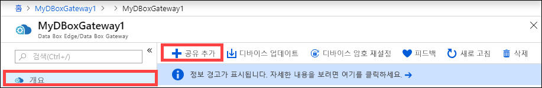

    공유 이름에는 숫자, 소문자 및 하이픈만 포함될 수 있습니다. 공유 이름은 3 -63자이며 문자 또는 숫자로 시작해야 합니다. 각 하이픈의 앞과 뒤에는 하이픈이 아닌 문자가 있어야 합니다.

3. 공유에 대한 **유형**을 선택합니다. 유형은 **SMB** 또는 **NFS**이며, SMB가 기본값입니다. SMB는 Windows 클라이언트에 대한 표준이며, NFS는 Linux 클라이언트에 사용됩니다. SMB 공유 또는 NFS 공유 중에서 어느 것을 선택하는지에 따라 제공되는 옵션이 약간 다릅니다.

4. 공유가 상주할 **저장소 계정**을 제공합니다. 컨테이너가 아직 없으면 저장소 계정에 공유 이름이 포함된 컨테이너가 만들어집니다. 컨테이너가 이미 있으면 기존 컨테이너가 사용됩니다.

5. **저장소 서비스**는 블록 Blob, 페이지 Blob 또는 파일 중에서 선택합니다. 선택하는 서비스 유형은 데이터를 Azure에 저장할 형식에 따라 달라집니다. 예를 들어, 이 인스턴스에서는 Azure에서 데이터가 Blob 블록으로 존재하기를 원하므로 **블록 Blob**을 선택합니다. **페이지 Blob**을 선택하는 경우 데이터가 512바이트로 정렬되었는지 확인해야 합니다. 예를 들어 VHDX는 항상 512바이트로 정렬됩니다.

6. 이 단계는 SMB 공유 또는 NFS 공유 중에서 어느 것을 만드는지에 따라 달라집니다.
    - **SMB 공유를 만드는 경우** - **모든 권한 로컬 사용자** 필드에서 **새로 만들기** 또는 **기존 항목 사용**을 선택합니다. 새 로컬 사용자를 만드는 경우 **사용자 이름**, **암호**를 입력한 다음, 암호를 확인합니다. 이렇게 하면 로컬 사용자에게 해당 권한이 할당됩니다. 여기에서 권한을 할당한 후에 파일 탐색기를 사용하여 해당 권한을 수정할 수 있습니다.

        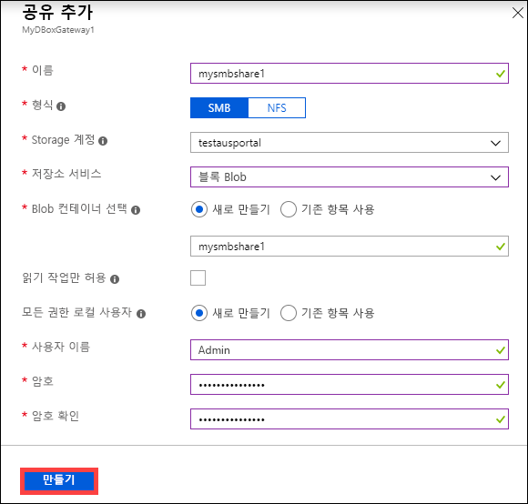

        이 공유 데이터에 대해 [읽기 작업만 허용]을 선택하면 읽기 전용 사용자만 지정할 수 있습니다.
    - **NFS 공유를 만드는 경우** - 공유에 액세스할 수 있도록 **허용된 클라이언트의 IP 주소**를 제공해야 합니다.

        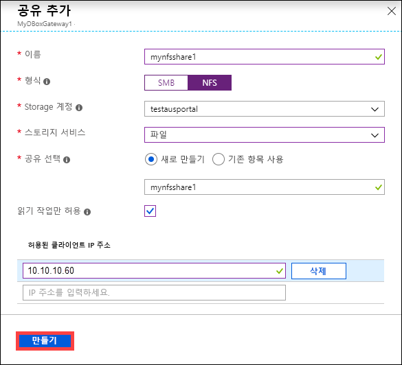

7. **만들기**를 클릭하여 공유를 만듭니다. 공유 만들기가 진행 중이라는 알림이 표시됩니다. 지정한 설정으로 공유가 만들어지면 **공유** 블레이드를 업데이트하여 새 공유가 반영됩니다.
 
## 공유 삭제

공유를 삭제하려면 Azure Portal에서 다음 단계를 수행합니다.

1. 공유 목록에서 삭제하려는 공유를 선택하고 클릭합니다.

    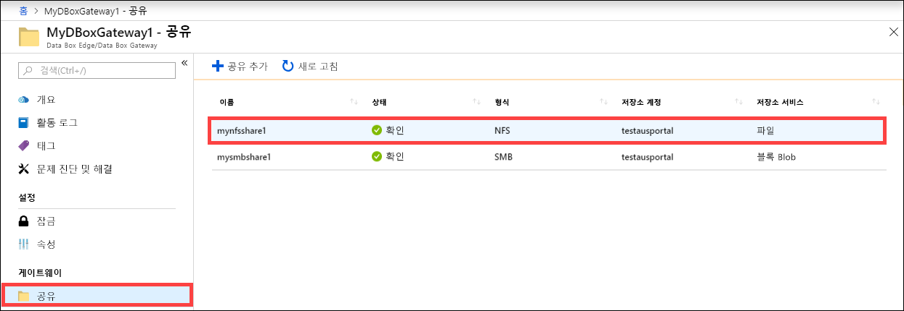

2. **삭제**를 클릭합니다. 

    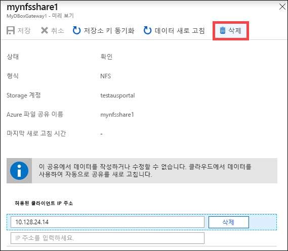

3. 확인하라는 메시지가 표시되면 **예**를 클릭합니다.

    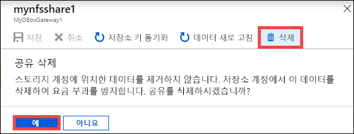

공유 목록이 업데이트되어 삭제가 반영됩니다.

## 공유 새로 고침

새로 고침 기능을 사용하면 온-프레미스 공유의 콘텐츠를 새로 고칠 수 있습니다. 공유를 새로 고치면 마지막 새로 고침 이후 클라우드에 추가된 Blob과 파일을 비롯한 모든 Azure 개체를 찾기 위해 검색이 시작됩니다. 이러한 추가 파일은 디바이스에서 온-프레미스 공유의 콘텐츠를 새로 고치는 데 사용됩니다. 

> [!NOTE]
> 사용 권한 및 ACL(액세스 제어 목록)은 새로 고침 작업에서 유지되지 않습니다. 

공유를 새로 고치려면 Azure Portal에서 다음 단계를 수행합니다.

1.  Azure Portal에서 **공유**로 이동합니다. 새로 고치려는 공유를 선택하고 클릭합니다.

    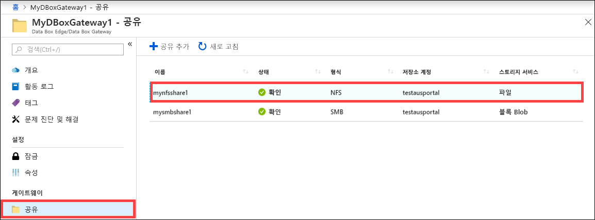

2.  **새로 고침**을 클릭합니다. 

    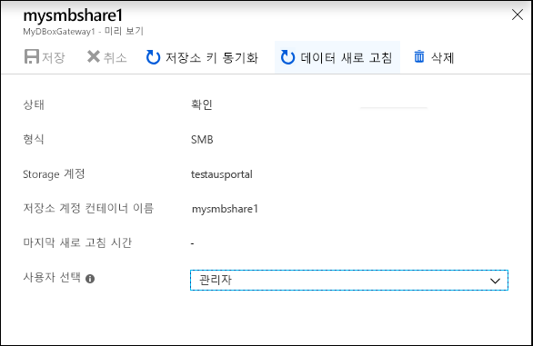
 
3.  확인하라는 메시지가 표시되면 **예**를 클릭합니다. 온-프레미스 공유의 콘텐츠를 새로 고치는 작업이 시작됩니다. 

    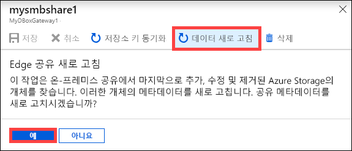
 
4.  새로 고침을 진행하는 동안은 상황에 맞는 메뉴에서 새로 고침 옵션이 회색으로 표시됩니다. 새로 고침 작업 상태를 표시하려면 작업 알림을 클릭합니다.

5.  새로 고침 작업의 소요 시간은 Azure 컨테이너의 파일 수는 물론 디바이스에 있는 파일에 따라 달라집니다. 새로 고침이 완료되면 공유 타임스탬프가 업데이트됩니다. 새로 고침에 부분적인 실패가 있더라도 작업이 성공한 것으로 간주되며 타임스탬프가 업데이트됩니다. 

    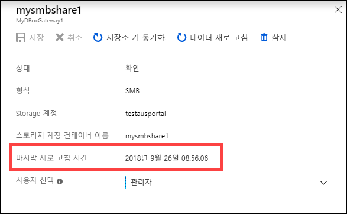
 
오류가 있으면 경고가 발생합니다. 경고에는 원인 및 문제 해결을 위한 권장 사항이 자세히 설명되어 있습니다. 또한 경고는 업데이트나 삭제에 실패한 파일을 비롯하여 오류에 대한 전체 요약이 포함된 파일로 연결됩니다.

>[!IMPORTANT]
> 현재 릴리스에서는 한 번에 둘 이상의 공유를 새로 고치지 마십시오.

## 저장소 키 동기화

저장소 계정 키가 순환된 경우 저장소 액세스 키를 동기화해야 합니다. 동기화를 수행하면 디바이스에 저장소 계정의 최신 키를 가져올 수 있습니다.

저장소 액세스 키를 동기화하려면 Azure Portal에서 다음 단계를 수행합니다.

1. 리소스에서 **개요**로 이동합니다. 
2. 공유 목록에서 동기화해야 하는 저장소 계정과 연결된 공유를 선택하여 클릭합니다. **저장소 키 동기화**를 클릭합니다. 

     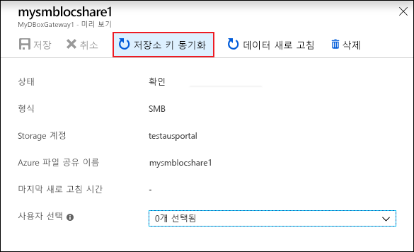

3. 페이지의 아래쪽에서 **예** 를 클릭합니다. 동기화가 완료되면 대화 상자를 종료합니다.

     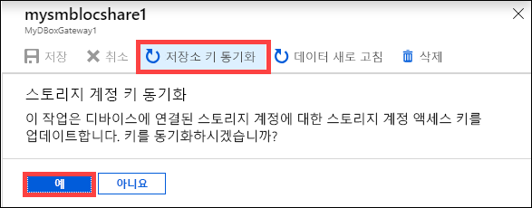

>[!NOTE]
> 이 작업은 지정된 저장소 계정에 대해 한 번만 수행하면 됩니다. 동일한 저장소 계정에 연결된 모든 공유에 대해 이 작업을 반복할 필요가 없습니다.

## 다음 단계

- [Azure Portal을 통해 사용자를 관리](data-box-gateway-manage-users.md)하는 방법을 알아봅니다.
