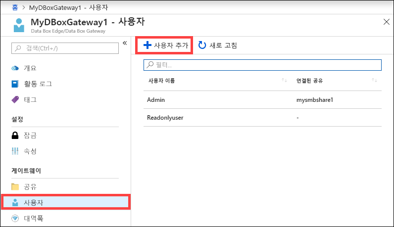
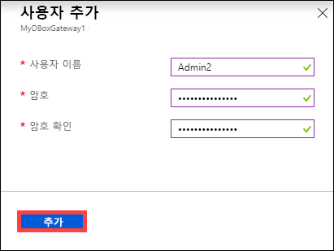
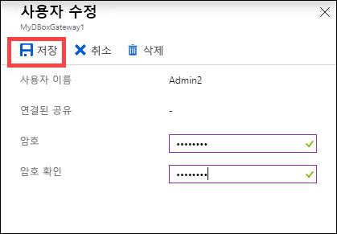
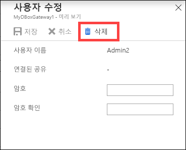
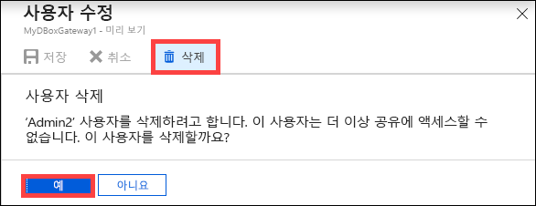
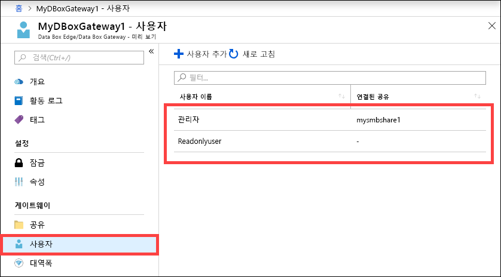

# Azure Portal을 사용하여 Azure Data Box Gateway에서 사용자 관리 

이 문서에서는 Azure Data Box Gateway에서 사용자를 관리하는 방법을 설명합니다. 로컬 웹 UI 또는 Azure Portal을 통해 Azure Data Box Gateway를 관리할 수 있습니다. Azure Portal을 사용하여 사용자를 추가, 수정 또는 삭제합니다.

> [!IMPORTANT]
> - Data Box Gateway는 미리 보기로 제공되고 있습니다. 이 솔루션을 주문하고 배포하기 전에 [미리 보기에 대한 Azure 서비스 약관](https://azure.microsoft.com/support/legal/preview-supplemental-terms/)을 검토하세요.

이 문서에서는 다음 방법을 설명합니다.

> [!div class="checklist"]
> * 사용자 추가
> * 사용자 수정
> * 사용자 삭제 

## 사용자에 대한 정보

사용자는 읽기 전용 또는 전체 권한 사용자가 될 수 있습니다. 이름이 나타내듯이 읽기 전용 사용자는 공유 데이터를 볼 수만 있습니다. 전체 권한 사용자는 공유 데이터를 읽고, 이 공유에 쓰고, 공유 데이터를 수정하거나 삭제할 수 있습니다. 

 - **전체 권한 사용자** - 전체 액세스 권한이 있는 로컬 사용자입니다. 
 - **읽기 전용 사용자** - 읽기 전용 액세스 권한이 있는 로컬 사용자입니다. 이러한 사용자는 읽기 전용 작업을 허용하는 공유와 연결됩니다.

사용자 권한은 공유를 생성하는 동안 사용자를 만들 때 처음 정의됩니다. 사용자와 관련된 권한이 정의된 후에는 파일 탐색기를 사용하여 수정할 수 있습니다. 

## 사용자 추가

사용자를 추가하려면 Azure Portal에서 다음 단계를 수행합니다.

1. Azure Portal에서 Data Box Gateway 리소스로 이동한 다음, **개요**로 이동합니다. 명령 모음에서 **+ 사용자 추가**를 클릭합니다.

    

2. 추가하려는 사용자에 대한 사용자 이름 및 암호를 지정합니다. 암호를 확인하고 **추가**를 클릭합니다.

    

    > [!IMPORTANT] 
    > 다음과 같은 사용자는 시스템에 예약되어 있으므로 사용하지 말아야 합니다. Administrator, EdgeUser, EdgeSupport, HcsSetupUser, WDAGUtilityAccount, CLIUSR, DefaultAccount, Guest.  

3. 사용자 만들기가 시작되고 완료되면 알림을 받습니다. 사용자가 만들어지면 명령 모음에서 **새로 고침**을 클릭하여 업데이트된 사용자 목록을 볼 수 있습니다.

## 사용자 수정

사용자가 만들어진 후에 사용자와 연결된 암호를 변경할 수 있습니다. 사용자 목록에서 선택하고 클릭합니다. 새 암호를 입력하고 확인합니다. 변경 내용을 저장합니다.
 

## 사용자 삭제

사용자를 삭제하려면 Azure Portal에서 다음 단계를 수행합니다.

1. 사용자 목록에서 사용자를 선택하고 클릭한 다음, **삭제**를 클릭합니다.  

   

2. 메시지가 표시되면 삭제를 확인합니다. 

   

사용자 목록이 업데이트되어 삭제된 사용자가 반영됩니다.

## 다음 단계

- [대역폭을 관리](data-box-gateway-manage-bandwidth-schedules.md)하는 방법에 대해 알아봅니다.
