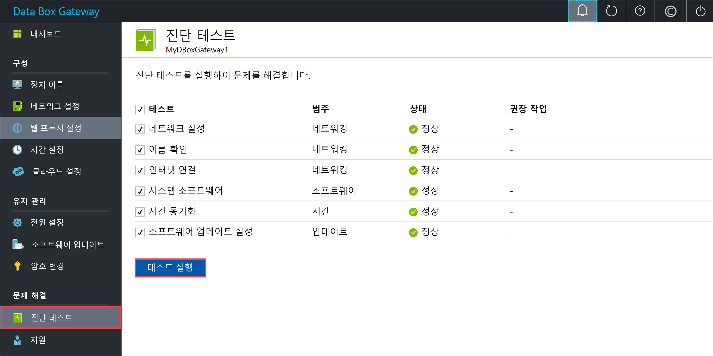
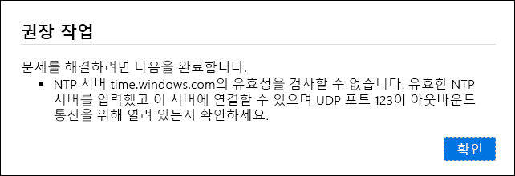
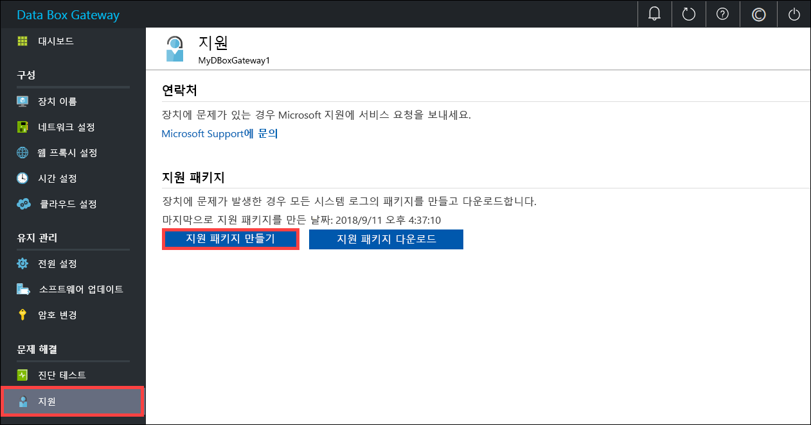
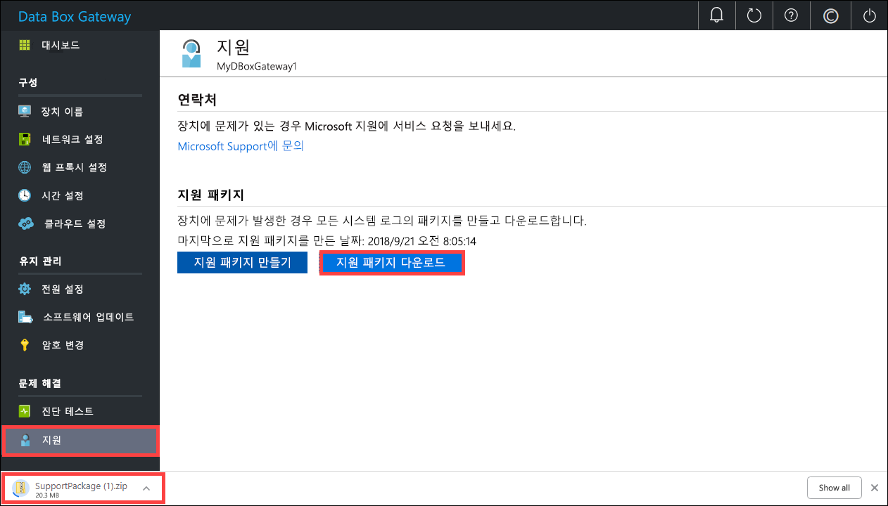
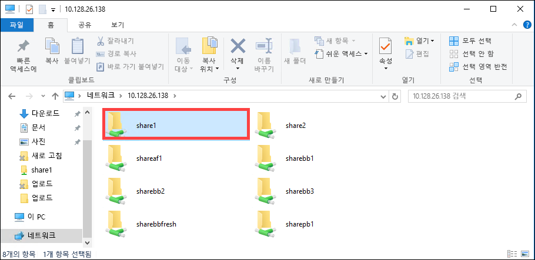

# <a name="troubleshoot-your-azure-data-box-gateway-issues"></a>Azure Data Box Gateway 문제 해결 

이 문서에서는 Azure Data Box Gateway에서 문제를 해결하는 방법을 설명합니다. 이 문서에서는 다음 방법을 설명합니다.

> [!div class="checklist"]
> * 진단 실행
> * 지원 패키지 수집
> * 로그를 사용하여 문제 해결


## <a name="run-diagnostics"></a>진단 실행

디바이스 오류를 진단하고 해결하기 위해 진단 테스트를 실행합니다. 진단 테스트를 실행하려면 디바이스의 로컬 웹 UI에서 다음 단계를 수행합니다.

1. 로컬 웹 UI에서 **문제 해결 > 진단 테스트**로 이동합니다. 실행할 테스트를 선택하고 **테스트 실행**을 클릭합니다. 그러면 네트워크, 디바이스, 웹 프록시, 시간 또는 클라우드 설정에서 문제가 될만한 내용을 진단하는 테스트가 시작됩니다. 디바이스에서 테스트가 실행 중이라는 알림이 표시됩니다.

    
 
2. 테스트가 완료된 후 결과가 표시됩니다. 테스트가 실패하면 권장 조치에 대한 URL이 표시됩니다. URL을 클릭하면 권장 조치를 볼 수 있습니다. 
 
    


## <a name="collect-support-package"></a>지원 패키지 수집

로크 패키지는 Microsoft 지원에서 디바이스 문제를 해결하는 데 도움을 줄 수 있는 모든 관련 로그로 구성됩니다. 로그 패키지는 로컬 웹 UI를 통해 생성할 수 있습니다.

지원 패키지를 수집하려면 다음 단계를 수행합니다. 

1. 로컬 웹 UI에서 **문제 해결 > 지원**으로 이동합니다. **지원 패키지 만들기**를 클릭합니다. 시스템이 지원 패키지를 수집하기 시작합니다. 패키지 수집에는 몇 분 정도 걸릴 수 있습니다.

    
 
2. 지원 패키지가 생성된 후에는 **지원 패키지 다운로드**를 클릭합니다. 압축된 패키지가 선택한 경로에 다운로드됩니다. 패키지 압축을 풀 수 있습니다.

    

## <a name="use-logs-to-troubleshoot"></a>로그를 사용하여 문제 해결

업로드 및 새로 고침 프로세스 중에 발생한 모든 오류는 해당 오류 파일에 포함됩니다.

1. 오류 파일을 보려면 공유로 이동하여 공유를 클릭하고 콘텐츠를 보십시오. 

      

2. _Microsoft Data Box Gateway 폴더_를 클릭합니다. 이 폴더에는 두 개의 하위 폴더가 있습니다.

   - 업로드 오류에 대한 로그 파일이 있는 Upload 폴더
   - 새로 고침 중 오류를 위한 Refresh 폴더

     다음은 새로 고침에 대한 샘플 로그 파일입니다.

     ```
     <root container="brownbag1" machine="VM15BS020663" timestamp="07/18/2018 00:11:10" />
     <file item="test.txt" local="False" remote="True" error="16001" />
     <summary runtime="00:00:00.0945320" errors="1" creates="2" deletes="0" insync="3" replaces="0" pending="9" />
     ``` 

3. 이 파일에 오류가 표시되면(샘플에 강조 표시됨), 오류 코드를 적어두십시오. 이 경우에는 16001입니다. 다음 오류 참조에서 이 오류 코드에 대한 설명을 찾아봅니다.

    |     오류 코드     |     예외 이름                                         |     오류 설명                                                                                                                                                                                                                     |
    |--------------------|------------------------------------------------------------|-------------------------------------------------------------------------------------------------------------------------------------------------------------------------------------------------------------------------------------------|
    |    100             |    ERROR_CONTAINER_OR_SHARE_NAME_LENGTH                    |    컨테이너 또는 공유 이름은 3자~63자여야 합니다.                                                                                                                                                                     |
    |    101             |    ERROR_CONTAINER_OR_SHARE_NAME_ALPHA_NUMERIC_DASH        |    컨테이너 또는 공유 이름은 문자, 숫자 또는 하이픈만으로 구성되어야 합니다.                                                                                                                                                       |
    |    102             |    ERROR_CONTAINER_OR_SHARE_NAME_IMPROPER_DASH             |    컨테이너 또는 공유 이름은 문자, 숫자 또는 하이픈만으로 구성되어야 합니다.                                                                                                                                                       |
    |    103             |    ERROR_BLOB_OR_FILE_NAME_CHARACTER_CONTROL               |    Blob 또는 파일 이름에 지원되지 않는 제어 문자가 포함되어 있습니다.                                                                                                                                                                       |
    |    104             |    ERROR_BLOB_OR_FILE_NAME_CHARACTER_ILLEGAL               |    Blob 또는 파일 이름에 잘못된 문자가 포함되어 있습니다.                                                                                                                                                                                   |
    |    105             |    ERROR_BLOB_OR_FILE_NAME_SEGMENT_COUNT                   |    Blob 또는 파일 이름에 세그먼트가 너무 많습니다. (각 세그먼트는 슬래시-/로 구분됩니다).                                                                                                                                              |
    |    106             |    ERROR_BLOB_OR_FILE_NAME_AGGREGATE_LENGTH                |    Blob 또는 파일 이름이 너무 깁니다.                                                                                                                                                                                                     |
    |    107             |    ERROR_BLOB_OR_FILE_NAME_COMPONENT_LENGTH                |    Blob 또는 파일의 세그먼트 중 하나가 너무 깁니다.                                                                                                                                                                            |
    |    108             |    ERROR_BLOB_OR_FILE_SIZE_LIMIT                           |    파일 크기가 업로드할 수 있는 최대 파일 크기를 초과합니다.                                                                                                                                                                              |
    |    109             |    ERROR_BLOB_OR_FILE_SIZE_ALIGNMENT                       |    Blob 또는 파일이 잘못 정렬되었습니다.                                                                                                                                                                                               |
    |    110             |    ERROR_NAME_NOT_VALID_UNICODE                            |    유니코드로 인코딩된 파일 이름 또는 Blob이 유효하지 않습니다.                                                                                                                                                                                  |
    |    111             |    ERROR_RESERVED_NAME_NOT_ALLOWED                         |    파일 또는 Blob의 이름 또는 접두사가 예약 된 이름이어서 지원되지 않습니다(예: COM1).                                                                                                                             |
    |    2000            |    ERROR_ETAG_MISMATCH                                     |    Etag 불일치가 클라우드의 블록 Blob과 디바이스의 블록 Blob 사이에 충돌이 있음을 나타냅니다. 이 충돌을 해결하려면 해당 파일 중 클라우드의 버전이나 디바이스의 버전 중 하나를 삭제하십시오.    |
    |    2001            |    ERROR_UNEXPECTED_FINALIZE_FAILURE                       |    파일을 업로드한 후 파일을 처리하는 동안 예기치 않은 문제가 발생했습니다.    이 오류가 표시되고 24시간 넘게 지속되면 고객 지원팀에 문의하십시오.                                                      |
    |    2002            |    ERROR_ALREADY_OPEN                                      |    파일이 다른 프로세스에 이미 열려 있기 때문에 핸들이 닫힐 때까지 업로드할 수 없습니다.                                                                                                                                       |
    |    2003            |    ERROR_UNABLE_TO_OPEN                                    |    업로드할 파일을 열 수 없습니다. 이 오류가 표시되면 Microsoft 지원에 문의하세요.                                                                                                                                                |
    |    2004            |    ERROR_UNABLE_TO_CONNECT                                 |    데이터를 업로드할 컨테이너에 연결할 수 없습니다.                                                                                                                                                                             |
    |    2005            |    ERROR_INVALID_CLOUD_CREDENTIALS                         |    계정 권한이 잘못되었거나 만료되어 컨테이너에 연결할 수 없습니다. 액세스 권한을 확인하십시오.                                                                                                               |
    |    2006            |    ERROR_CLOUD_ACCOUNT_DISABLED                            |    계정 또는 공유가 비활성화되어 있어 계정에 데이터를 업로드할 수 없습니다.                                                                                                                                                            |
    |    2007            |    ERROR_CLOUD_ACCOUNT_PERMISSIONS                         |    계정 권한이 잘못되었거나 만료되어 컨테이너에 연결할 수 없습니다. 액세스 권한을 확인하십시오.                                                                                                               |
    |    2008            |    ERROR_CLOUD_CONTAINER_SIZE_LIMIT_REACHED                |    컨테이너가 가득 차서 새 데이터를 추가할 수 없습니다. 유형에 따라 지원되는 컨테이너 크기는 Azure 사양을 확인하십시오. 예를 들어, Azure File에서 지원되는 최대 파일 크기는 5TB입니다.                                     |
    |    2009            |    ERROR_CLOUD_CONTAINER_MISSING                |     공유와 연결된 컨테이너가 존재하지 않아 데이터를 업로드할 수 없습니다.                                     |    
    |    2997            |    ERROR_ITEM_CANCELED                                     |    예기치 않은 오류가 발생했습니다. 자체적으로 해결되는 일시적인 오류입니다.                                                                           |
    |    2998            |    ERROR_UNMAPPED_FAILURE                                  |    예기치 않은 오류가 발생했습니다. 오류가 자체적으로 해결될 수 있지만 24시간 넘게 지속되는 경우에는 Microsoft 지원에 문의하세요.                                                                                                     |
    |    16000           |    RefreshException                                        |    이 파일을 가져올 수 없습니다.                                                                                                                                                                                                        |
    |    16001           |    RefreshAlreadyExistsException                           |    이 파일이 로컬 시스템에 이미 있기 때문에 가져올 수 없습니다.                                                                                                                                                         |
    |    16002           |    RefreshWorkNeededException                              |    이 파일이 완전히 업로드되지 않았기 때문에 새로 고칠 수 없습니다.                                                                                                                                                                          | 


## <a name="next-steps"></a>다음 단계

- [이 릴리스의 알려진 문제](data-box-gateway-release-notes.md)에 대해 알아봅니다.
