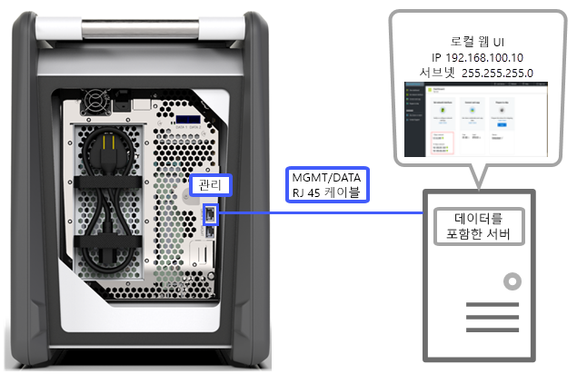
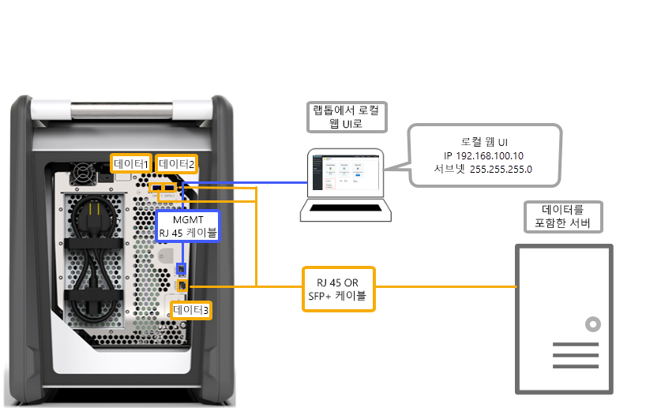
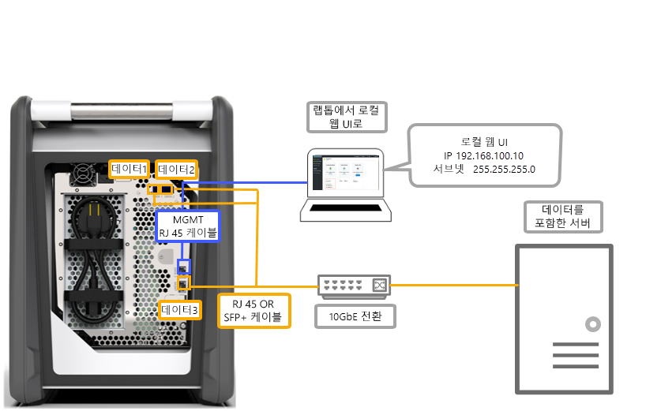
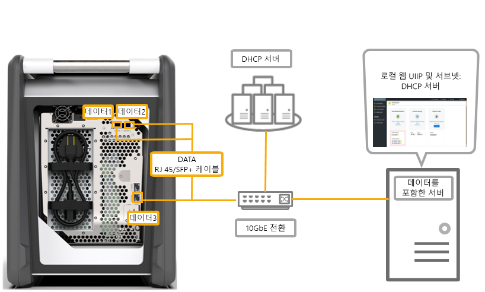

# Azure Data Box의 케이블 연결 옵션

이 문서에서는 데이터 전송을 위해 Azure Data Box를 케이블로 연결하는 다양한 방법을 설명합니다.

## MGMT 포트를 통해 전송

이 옵션은 Data Box에 절대적인 최소한의 구성입니다. MGMT 포트만 구성하면 관리 및 데이터 트래픽이 모두 지원됩니다.

시작하기 전에 다음을 확인합니다.

- MGMT용 RJ45 이더넷 케이블.
- [지원되는 OS](data-box-system-requirements.md#supported-operating-systems-for-clients)를 실행 중인 데이터 원본.

다음 단계를 수행하여 장치에 케이블을 연결합니다.

1. RJ45 케이블을 사용하여 데이터가 있는 서버에 MGMT 포트를 연결합니다.

    

2. 서버에서 다음을 설정합니다.

    - **IP 주소**를 192.168.100.5로 설정
    - **서브넷**을 255.255.255.0으로 설정

3. 192.168.100.10에서 장치의 로컬 웹 UI에 액세스합니다. Azure Portal에서 잠금 해제 암호를 사용하여 Data Box에 로그인하고 잠금을 해제합니다.

## 고정 IP를 사용하여 DATA 포트를 통해 전송

관리 트래픽용 MGMT 포트와 데이터용 데이터 포트 중 하나를 포함해 Data Box용 포트 두 개를 구성할 수 있습니다. 데이터 포트에는 DATA 1, DATA 2 또는 DATA 3이 해당될 수 있습니다.

데이터 포트를 하나만 구성하는 경우 DATA 1 또는 DATA 2 같은 10GbE 포트를 구성할 것을 강력히 권장합니다. 1GbE 포트를 사용하면 데이터 전송에 소요되는 시간이 대폭 늘어날 수 있습니다.

시작하기 전에 다음을 확인합니다.

- MGMT용 RJ45 이더넷 케이블.
- 연결하려는 각 10GbE 데이터 포트당 10GbE SFP+ Twinax 동 케이블 하나.
- [지원되는 OS](data-box-system-requirements.md#supported-operating-systems-for-clients)를 실행 중인 하나 이상의 데이터 원본.

### 옵션 1 - 서버를 통한 초기 설치

다음 단계를 수행하여 장치에 케이블을 연결합니다.

1. 서버의 RJ45 이더넷 케이블을 구성할 MGMT 포트에 바로 사용합니다.
2. DATA 3용 RJ45나 SFP+ 케이블을 통해 데이터 원본 역할을 하는 서버에 DATA 1 또는 DATA 2를 연결합니다. 성능 향상을 위해 10GbE DATA 1 또는 DATA 2 포트를 사용하는 것이 좋습니다.
3. 서버에서 다음을 설정합니다.

    - **IP 주소**를 192.168.100.5로 설정
    - **서브넷**을 255.255.255.0으로 설정

    

3. 192.168.100.10에서 장치의 로컬 웹 UI에 액세스합니다. Azure Portal에서 잠금 해제 암호를 사용하여 Data Box에 로그인하고 잠금을 해제합니다.
4. 구성한 데이터 포트에 고정 IP를 할당합니다.

### 옵션 2 - 별도의 컴퓨터를 통한 초기 설치

다음 단계를 수행하여 장치에 케이블을 연결합니다.

1. 서버의 RJ45 이더넷 케이블을 구성할 MGMT 포트에 바로 사용합니다.
2. DATA 3용 RJ45나 SFP+ 케이블을 통해 서버에 DATA 1 또는 DATA 2를 연결합니다. 성능 향상을 위해 10GbE DATA 1 또는 DATA 2 포트를 사용하는 것이 좋습니다. 데이터 포트는 10GbE 스위치를 통해 데이터가 있는 서버에 연결됩니다.
3. 장치에 연결하는 데 사용할 노트북의 이더넷 어댑터에 다음을 구성합니다.

    - **IP 주소**를 192.168.100.5로 설정
    - **서브넷**을 255.255.255.0으로 설정

    

3. 192.168.100.10에서 장치의 로컬 웹 UI에 액세스합니다. Azure Portal에서 잠금 해제 암호를 사용하여 Data Box에 로그인하고 잠금을 해제합니다.
4. DHCP 서버에서 할당한 IP 주소를 식별합니다.

## 스위치로 고정 IP를 사용하여 DATA 포트를 통해 전송 

1GbE 및 10GbE 네트워크 간의 여러 데이터 원본에는 이 구성을 사용하세요.

시작하기 전에 다음을 확인합니다.

- MGMT용 RJ45 이더넷 케이블.
- 연결하려는 각 10GbE 데이터 포트당 10GbE SFP+ Twinax 동 케이블 하나.
- [지원되는 OS](data-box-system-requirements.md#supported-operating-systems-for-clients)를 실행 중인 하나 이상의 데이터 원본. 이러한 데이터 원본은 1GbE 또는 10GbE 네트워크 같은 여러 네트워크에 있을 수 있습니다.

다음 단계를 수행하여 장치에 케이블을 연결합니다.

1. 서버의 RJ45 이더넷 케이블을 구성할 MGMT 포트에 바로 사용합니다.
2. DATA 3용 RJ45나 SFP+ 케이블을 통해 서버에 DATA 1 또는 DATA 2를 연결합니다. 성능 향상을 위해 10GbE DATA 1 또는 DATA 2 포트를 사용하는 것이 좋습니다.
3. 장치에 연결하는 데 사용할 노트북의 이더넷 어댑터에 다음을 구성합니다.

    - **IP 주소**를 192.168.100.5로 설정
    - **서브넷**을 255.255.255.0으로 설정

    

3. 192.168.100.10에서 장치의 로컬 웹 UI에 액세스합니다. Azure Portal에서 잠금 해제 암호를 사용하여 Data Box에 로그인하고 잠금을 해제합니다.
4. 구성한 데이터 포트에 고정 IP를 할당합니다.

## DHCP 환경에서 DATA 포트를 통해 전송

장치가 DHCP 환경에 있는 경우 이 구성을 사용하세요.

시작하기 전에 다음을 확인합니다.

- RJ45 케이블(DATA 1을 연결하려는 경우).
- 연결하려는 각 10GbE 데이터 포트당 10GbE SFP+ Twinax 동 케이블 하나.
- [지원되는 OS](data-box-system-requirements.md#supported-operating-systems-for-clients)를 실행 중인 하나 이상의 데이터 원본. 이러한 데이터 원본은 1GbE 또는 10GbE 네트워크 같은 여러 네트워크에 있을 수 있습니다.

다음 단계를 수행하여 장치에 케이블을 연결합니다.

1. DHCP 서버에 액세스할 수 있는 스위치를 통해 RJ45 또는 SFP+ 케이블을 서버에 연결합니다.

    
2. IP 주소를 식별하려면 DHCP 서버 또는 DNS 서버를 사용합니다.
3. 동일한 네트워크의 서버에서 DHCP 서버가 할당한 IP 주소를 사용하는 장치의 로컬 웹 UI에 액세스합니다. Azure Portal에서 잠금 해제 암호를 사용하여 Data Box에 로그인하고 잠금을 해제합니다.

## 다음 단계

- 장치를 케이블로 연결했으므로 [Azure Data Box에 데이터 복사](data-box-deploy-copy-data.md)로 이동합니다.
