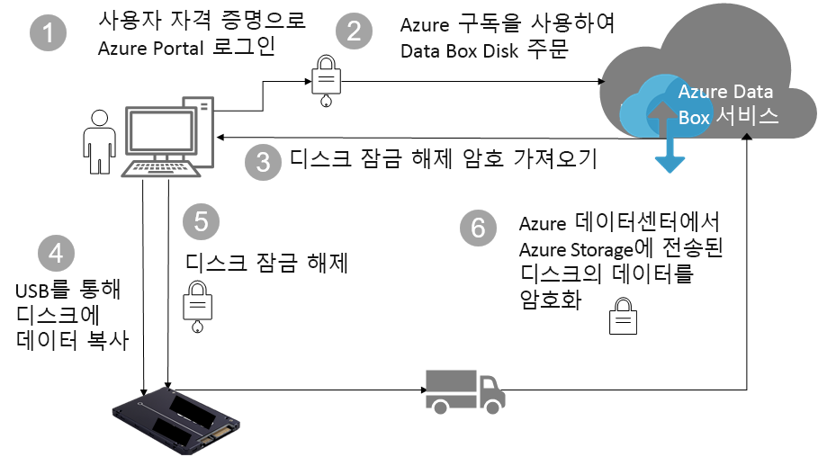

# Azure Data Box Disk 보안 및 데이터 보호(미리 보기)

이 문서에서는 각 Data Box 솔루션 구성 요소 및 저장된 데이터를 보호하는 데 도움을 주는 Azure Data Box Disk 보안 기능을 설명합니다. 

> [!IMPORTANT]
> Data Box Disk는 미리 보기로 제공됩니다. 이 솔루션을 배포하기 전에 [미리 보기에 대한 Azure 서비스 약관](https://azure.microsoft.com/support/legal/preview-supplemental-terms/)을 검토하세요.

## 구성 요소를 통한 데이터 흐름

Microsoft Azure Data Box 솔루션은 서로 상호 작용 하는 네 가지 기본 구성 요소로 이루어져 있습니다.

- **Azure에서 호스팅되는 Azure Data Box 서비스** - 디스크 순서를 만들고, 디스크를 구성한 다음 완료에 대한 순서를 추적하는 데 사용하는 관리 서비스입니다.
- **Data Box Disk** – Azure로 온-프레미스 데이터를 가져올 수 있도록 함께 제공되는 실제 디스크입니다. 
- **디스크에 연결된 클라이언트/호스트** – USB를 통해 Data Box 디스크에 연결하고 보호되어야 하는 데이터를 포함하는 인프라 내의 클라이언트입니다.
- **클라우드 저장소** – 데이터가 저장되는 Azure 클라우드의 위치입니다. 이것이 일반적으로 사용자가 만든 Azure Data Box 리소스에 연결된 저장소 계정입니다.

다음 다이어그램은 온-프레미스에서 Azure로 Azure Data Box Disk 솔루션을 통해 데이터 흐름을 나타냅니다.

## 보안 기능

Data Box Disk는 인증된 엔터티만 데이터를 보고, 수정하거나 삭제할 수 있도록 하여 데이터 보호에 대한 보안 솔루션을 제공합니다. 이 솔루션에 대한 보안 기능은 저장된 데이터의 보안을 보장하는 디스크 및 연결된 서비스를 위한 것입니다. 

### Data Box Disk 보호

Data Box Disk는 다음 기능을 통해 보호됩니다.

- 디스크에 대한 상시 BitLocker AES-128비트 암호화
- 디스크에 대한 보안 업데이트 기능
- 디스크는 잠긴 상태로 제공되며 Data Box Disk 잠금 해제 도구를 통해 잠금 해제될 수 있습니다. 잠금 해제 도구는 Data Box Disk 서비스 포털에서 사용할 수 있습니다.

### Data Box Disk 데이터 보호

Data Box Disk의 내부 및 외부로 흐르는 데이터는 다음 기능을 통해 보호됩니다.

- 데이터의 상시 BitLocker 암호화 
- Azure에 대한 데이터 업로드가 완료되면 디스크에서 데이터 지우기를 보호합니다. 데이터 지우기는 NIST 800-88r1 표준을 따릅니다.

### Data Box 서비스 보호

Data Box 서비스는 다음 기능을 통해 보호됩니다.

- Data Box Disk 서비스에 액세스하려면 Data Box Disk를 포함하는 Azure 구독 조직에 있어야 합니다. 구독은 Azure Portal에서 액세스할 수 있는 기능을 제어합니다.
- Data Box Disk 서비스는 Azure에서 호스팅되므로 Azure 보안 기능으로 보호됩니다. Microsoft Azure에서 제공하는 보안 기능에 대한 자세한 내용은 [Microsoft Azure 보안 센터](https://www.microsoft.com/TrustCenter/Security/default.aspx)로 이동합니다. 
- Data Box Disk는 서비스에서 디스크를 잠금 해제하는 데 사용되는 디스크 암호를 저장합니다. 
- Data Box Disk 서비스는 서비스에 주문 세부 정보 및 상태를 저장합니다. 이 정보는 주문이 삭제될 때 삭제됩니다. 

## 개인 데이터 관리

[!INCLUDE [GDPR-related guidance](../../includes/gdpr-intro-sentence.md)]

Azure Data Box Disk는 서비스의 다음 키 인스턴스에서 개인 정보를 수집하고 표시합니다.

- **알림 설정** - 주문을 만들 때 알림 설정에 따라 사용자의 이메일 주소를 구성합니다. 이 정보는 관리자가 볼 수 있습니다. 이 정보는 작업이 종료 상태에 도달하거나 주문을 삭제하면 서비스에서 삭제됩니다.

- **주문 세부 정보** – 주문이 만들어지면 사용자의 배송 주소, 이메일, 연락처 정보가 Azure Portal에 저장됩니다. 저장되는 정보는 다음과 같습니다.

    - 담당자 이름
    - 전화 번호
    - Email
    - 주소
    - City
    - 우편 번호
    - 시스템 상태
    - 국가/시/도/지역
    - 드라이브 ID
    - 운송업체 계정 번호
    - 배송 추적 번호

    주문 세부 정보는 작업이 완료되거나 주문을 삭제하면 Data Box 서비스에 의해 삭제됩니다.

- **배송 주소** – 주문이 완료되면 Data Box 서비스는 UPS 또는 DHL과 같은 타사 운송 업체에 배송 주소를 제공합니다. 

자세한 내용은 [보안 센터](https://www.microsoft.com/trustcenter)에서 Microsoft 개인 정보 취급 방침을 검토합니다.

## 다음 단계

- [Data Box Disk 요구 사항](data-box-disk-system-requirements.md)을 검토합니다.
- [Data Box Disk 제한 사항](data-box-disk-limits.md)을 이해합니다.
- Azure Portal에서 [Azure Data Box Disk](data-box-disk-quickstart-portal.md)를 신속하게 배포합니다.
