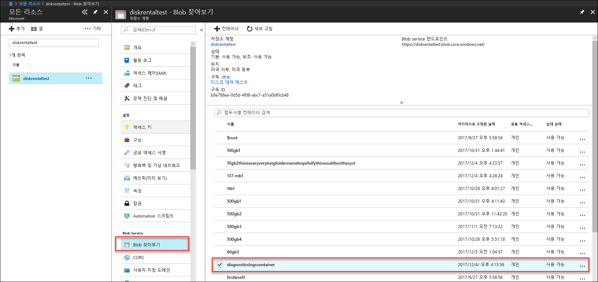
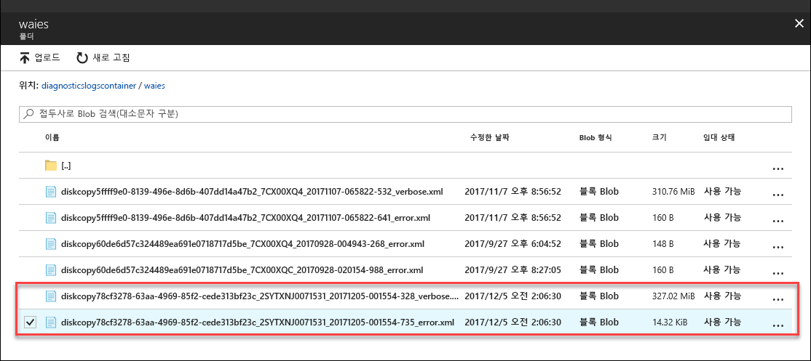

# Azure Data Box Disk에서 문제 해결

이 문서는 Microsoft Azure Data Box Disk에 적용되며 이 솔루션을 배포할 때 발생하는 문제를 해결하는 데 사용하는 워크플로에 대해 설명합니다. 

이 문서에는 다음 섹션이 포함되어 있습니다.

- 진단 로그 다운로드
- 활동 로그 쿼리
- Data Box Disk 잠금 해제 도구 오류
- Data Box Disk 분할 복사 도구 오류

## 진단 로그 다운로드

데이터 복사 프로세스 중 오류가 발생한 경우 포털에서는 진단 로그가 위치한 폴더에 대한 경로를 표시합니다. 

진단 로그는 다음 항목일 수 있습니다.
- 오류 로그
- 자세한 정보 표시 로그  

복사 로그에 대한 경로로 이동하려면 Data Box 주문과 연결된 저장소 계정으로 이동합니다. 

1.  **일반 > 주문 세부 정보**로 이동하고 주문과 연결된 저장소 계정을 기록해둡니다.
 

2.  **모든 리소스**로 이동하고 이전 단계에서 식별된 저장소 계정을 검색합니다. 저장소 계정을 선택하고 클릭합니다.

    

3.  **Blob service > Blob 찾아보기**로 이동하고 저장소 계정에 해당하는 Blob을 찾습니다. **diagnosticslogcontainer > waies**로 이동합니다. 

    

    데이터 복사본에 대한 오류 로그 및 자세한 정보 표시 로그가 모두 표시됩니다. 각 파일을 선택하고 클릭한 다음, 로컬 복사본을 다운로드합니다.

## 활동 로그 쿼리

활동 로그를 사용하여 문제를 해결할 때 오류를 찾거나 조직의 사용자가 리소스를 수정한 방법을 모니터링합니다. 활동 로그를 통해 다음 사항을 확인할 수 있습니다.

- 구독의 리소스에서 수행된 작업
- 작업을 시작한 사람입니다. 
- 작업이 발생한 시간
- 작업의 상태.
- 작업을 조사하는 데 도움이 될 수 있는 기타 속성 값

활동 로그에는 리소스에서 수행된 모든 쓰기 작업(예: PUT, POST, DELETE)이 포함되지만 읽기 작업(예: GET)은 포함되지 않습니다. 

활동 로그는 90일 동안 유지됩니다. 시작 날짜가 90보다 더 오래되지 않은 경우 날짜 범위에 대해 쿼리할 수 있습니다. 인사이트에서 기본 제공 쿼리 중 하나로 필터링할 수도 있습니다. 예를 들어 오류를 클릭한 다음, 특정 오류를 선택하고 클릭하여 근본 원인을 이해합니다.

## Data Box Disk 잠금 해제 도구 오류

| 오류 메시지/도구 동작      | 권장 사항                                                                                               |
|-------------------------------------------------------------------------------------------------------------------------------------|------------------------------------------------------------------------------------------------------|
| 없음  Data Box Disk 잠금 해제 도구가 충돌합니다.                                                                            | BitLocker가 설치되어 있지 않습니다. Data Box Disk 잠금 해제 도구를 실행하는 호스트 컴퓨터에는 BitLocker가 설치되어야 합니다.                                                                            |
| 현재 .Net Framework는 지원되지 않습니다. 지원되는 버전은 4.5 이상입니다.  도구는 메시지를 표시하며 종료됩니다.  | .NET 4.5가 설치되어 있지 않습니다. Data Box Disk 잠금 해제 도구를 실행하는 호스트 컴퓨터에서 .NET 4.5 이상을 설치합니다.                                                                            |
| 잠금을 해제하거나 볼륨을 확인할 수 없습니다. Microsoft 지원에 문의하세요.    도구가 잠긴 드라이브의 잠금을 해제하거나 확인하지 못했습니다. | 도구는 제공된 암호를 사용하여 잠긴 드라이브의 잠금을 해제할 수 없습니다. Microsoft 지원에 다음 단계를 문의합니다.                                                |
| 다음 볼륨의 잠금을 해제하고 확인합니다.  볼륨 드라이브 문자: E: werwerqomnf, qwerwerqwdfda 암호를 사용하여 볼륨의 잠금을 해제할 수 없습니다.   도구는 일부 드라이브의 잠금을 해제하고 성공하거나 실패한 드라이브 문자를 나열합니다.| 부분적으로 성공 제공된 암호를 사용하여 일부 드라이브의 잠금을 해제할 수 없습니다. Microsoft 지원에 다음 단계를 문의합니다. |
| 잠긴 볼륨을 찾을 수 없습니다. Microsoft에서 받은 디스크가 제대로 연결되어 있고 잠긴 상태인지를 확인합니다.          | 도구는 잠긴 드라이브를 찾지 못했습니다. 드라이브는 이미 잠금 해제되거나 검색되지 않습니다. 드라이브가 연결되어 있고 잠겨 있는지 확인합니다.                                                           |
| 심각한 오류: 잘못된 매개 변수 매개 변수 이름: invalid_arg 사용량: DataBoxDiskUnlock /PassKeys:<passkey_list_separated_by_semicolon>  예제: DataBoxDiskUnlock /PassKeys:passkey1;passkey2;passkey3 예제: DataBoxDiskUnlock /SystemCheck 예제: DataBoxDiskUnlock /Help  /PassKeys:       Azure DataBox Disk 순서에서 이 암호를 가져옵니다. 암호는 디스크를 잠금 해제합니다. /Help:           이 옵션은 cmdlet 사용량 및 예제에 대한 도움말을 제공합니다. /SystemCheck:    이 옵션은 시스템이 도구를 실행하기 위한 요구 사항을 충족하는지 확인합니다.  종료하려면 아무 키나 누르세요. | 잘못된 매개 변수가 입력되었습니다. 허용 된 매개 변수만 /SystemCheck, /PassKey, 및 /Help입니다.                                                                            |

## Data Box Disk 분할 복사 도구 오류

|오류 메시지/경고  |권장 사항 |
|---------|---------|
|[정보] 볼륨: m에 대한 BitLocker 암호 검색 중  [오류] 볼륨: m에 대한 BitLocker 키를 검색하는 동안 예외가 발생함  시퀀스에 요소가 없습니다.|이 오류는 대상 Data Box Disk가 오프라인인 경우 발생합니다.   온라인 디스크에 `diskmgmt.msc` 도구를 사용합니다.|
|[오류] 예외를 throw함: WMI 작업이 실패했습니다.  Method=UnlockWithNumericalPassword, ReturnValue=2150694965,  Win32Message=제공된 복구 암호의 형식이 잘못되었습니다.  BitLocker 복구 암호는 48자릿수입니다.  복구 암호 형식이 올바른지 확인하고 다시 시도하십시오.|Data Box Disk 잠금 해제 도구를 사용하여 먼저 디스크 잠금을 해제하고 명령을 다시 시도합니다. 자세한 내용은 다음을 참조하세요. <li> [Windows 클라이언트에 대한 Data Box Disk 잠금 해제](data-box-disk-deploy-set-up.md#unlock-disks-on-windows-client) </li><li> [Linux 클라이언트에 대한 Data Box Disk 잠금 해제](data-box-disk-deploy-set-up.md#unlock-disks-on-linux-client) </li>|
|[오류] 예외를 throw함: 대상 드라이이브에 DriveManifest.xml 파일이 존재합니다.   이는 다른 저널 파일을 사용하여 대상 드라이브가 준비되었을 수 있음을 나타냅니다.  동일한 드라이브에 데이터를 더 추가하려면 이전 저널 파일을 사용합니다. 기존 데이터를 삭제하고 새 가져오기 작업의 대상 드라이브를 다시 사용하려면 드라이브에서 DriveManifest.xml을 삭제합니다. 이 명령을 새 저널 파일을 사용하여 다시 실행합니다.| 이 오류는 다수의 가져오기 세션에 대해 동일한 드라이브 집합을 사용하려고 할 때 수신됩니다.   하나의 드라이브 집합은 하나의 분할 및 복사 세션에만 사용하십시오.|
|[오류] 예외를 throw함: CopySessionId importdata-sept-test-1은 이전 복사 세션을 참조하며 새 복사 세션에 재사용 할 수 없습니다.|이 오류는 새 작업에 대해 이전에 성공적으로 완료된 직업과 동일한 작업 이름을 사용하려고 시도하면 보고됩니다.  새 작업에 대해 고유한 이름을 제공하십시오.|
|[정보] 대상 파일 또는 디렉터리 이름이 NTFS 길이 한도를 초과합니다. |이 메시지는 파일 경로가 길어서 대상 파일의 이름이 바뀐 경우 보고됩니다.  이 동작을 제어하려면 `config.json` 파일에서 disposition 옵션을 수정하십시오.|
|[오류] 예외를 throw함: 잘못된 JSON 이스케이프 시퀀스입니다. |이 메시지는 config.json에 유효하지 않은 형식이 있을 때 보고됩니다.   파일을 저장하기 전에 [JSONlint](https://jsonlint.com/)를 사용하여 `config.json`의 유효성을 검사하십시오.|

## Linux 배포 문제

이 섹션에서는 데이터 복사를 위해 Linux 클라이언트를 사용하는 경우 Data Box Disk를 배포하는 동안 발생하는 몇 가지 주요 문제를 자세히 설명합니다.

### 문제: 드라이브가 읽기 전용으로 탑재됨
 
**원인** 

정리되지 않은 파일 시스템 때문일 수 있습니다. 

Data Box Disk에서는 드라이브를 읽기-쓰기로 다시 탑재할 수 없습니다. 이 시나리오는 dislocker으로 암호 해독한 드라이브에서 지원되지 않습니다. 다음 명령을 사용하여 디바이스를 다시 탑재했을 수 있습니다. 

    `# mount -o remount, rw /mnt/DataBoxDisk/mountVol1`

다시 탑재에 성공했더라도 데이터가 유지되지 않습니다.

**해결 방법**

위의 오류가 표시되면 다음 해결 방법 중 하나를 시도할 수 있습니다.

- [`ntfsfix`](https://linux.die.net/man/8/ntfsfix)(`ntfsprogs` 패키지에서 사용할 수 있음)를 설치하고 관련 파티션에 대해 실행합니다.

- Windows 시스템에 액세스할 수 있는 경우

    - Windows 시스템에 드라이브를 로드합니다.
    - 관리자 권한으로 명령 프롬프트를 엽니다. 볼륨에 대해 `chkdsk`를 실행합니다.
    - 볼륨을 제거한 후 다시 시도해도 됩니다.
 
### 문제: 복사 후 데이터가 유지되지 않는 오류 발생
 
**원인** 

드라이브를 분리한 후 드라이브에 데이터가 없으면(데이터를 복사한 경우에도) 드라이브를 읽기 전용으로 탑재한 후에 읽기/쓰기로 다시 탑재한 것일 수 있습니다.

**해결 방법**
 
이 경우 [드라이브를 읽기 전용으로 탑재](#issue-drive-getting-mounted-as-read-only)에 대한 해결 방법을 참조하세요.

그 외의 경우에는 Data Box Disk 잠금 해제 도구가 있는 폴더에서 로그를 복사하고 [Microsoft 지원](data-box-disk-contact-microsoft-support.md)에 문의하세요.

## Windows 배포 문제

이 섹션에서는 데이터 복사를 위해 Windows 클라이언트를 사용하는 경우 Data Box Disk를 배포하는 동안 발생하는 몇 가지 주요 문제를 자세히 설명합니다.

### 문제: BitLocker에서 드라이브의 잠금을 해제할 수 없습니다.
 
**원인** 

BitLocker 대화 상자에서 암호를 사용했으며 BitLocker의 드라이브 잠금 해제 대화 상자를 통해 디스크의 잠금을 해제했습니다. 이 작업은 가능하지 않습니다. 

**해결 방법**

Data Box Disk의 잠금을 해제하려면 Data Box Disk 잠금 해제 도구를 사용하고 Azure Portal에서 암호를 제공해야 합니다. 자세한 내용은 [자습서: Azure Data Box Disk 압축 풀기, 연결 및 잠금 해제](data-box-disk-deploy-set-up.md#connect-to-disks-and-get-the-passkey)를 참조하세요.
 
### 문제: 일부 볼륨을 잠금 해제하거나 확인할 수 없습니다. Microsoft 지원에 문의하세요.
 
**원인** 

오류 로그에 다음 오류가 표시될 수 있으며, 일부 볼륨을 잠금 해제하거나 확인할 수 없습니다.

`Exception System.IO.FileNotFoundException: Could not load file or assembly 'Microsoft.Management.Infrastructure, Version=1.0.0.0, Culture=neutral, PublicKeyToken=31bf3856ad364e35' or one of its dependencies. The system cannot find the file specified.`
 
이것은 Windows 클라이언트에서 해당 버전의 Windows PowerShell이 없기 때문일 수 있습니다.

**해결 방법**

[Windows PowerShell v 5.0](https://www.microsoft.com/download/details.aspx?id=54616)을 설치하고 작업을 다시 시도할 수 있습니다.
 
그래도 볼륨의 잠금을 해제할 수 없으면 Data Box Disk 잠금 해제 도구가 있는 폴더에서 로그를 복사하고 [Microsoft 지원](data-box-disk-contact-microsoft-support.md)에 문의하세요.

## 다음 단계

- [Azure Portal을 통해 Data Box Disk를 관리](data-box-portal-ui-admin.md)하는 방법을 알아봅니다.
