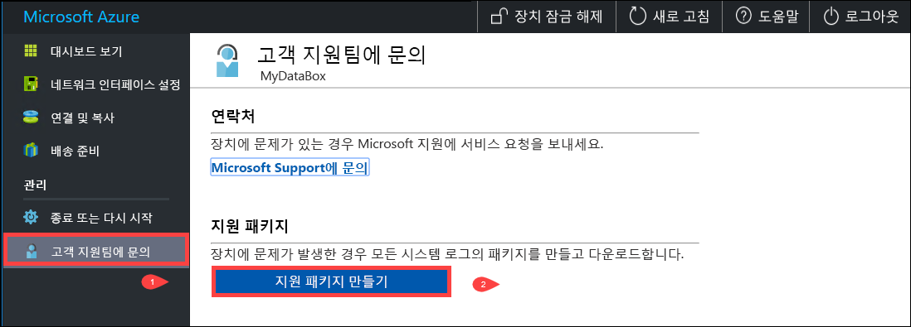
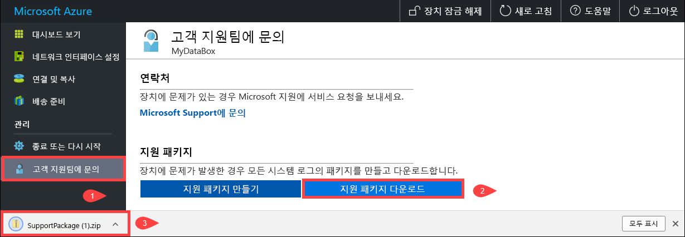
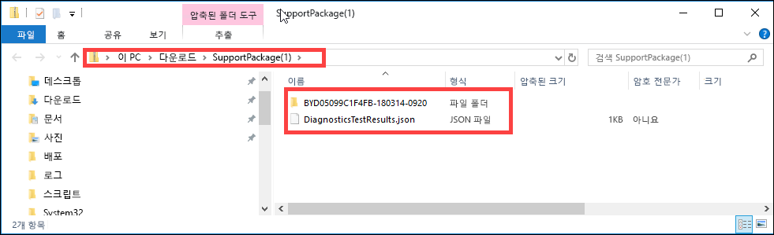
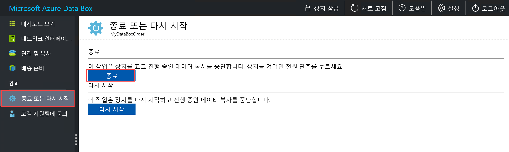
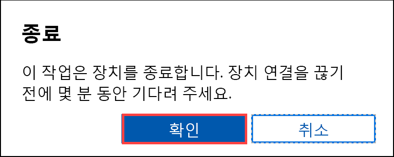
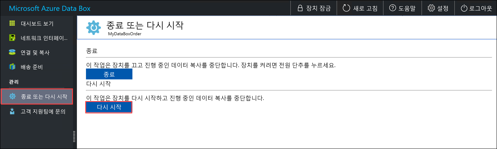
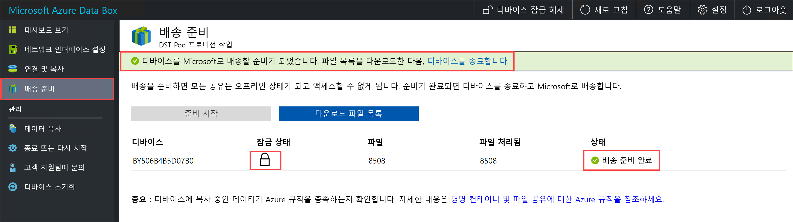
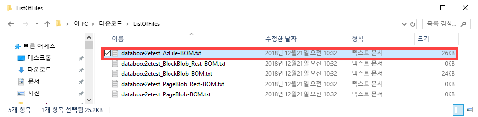
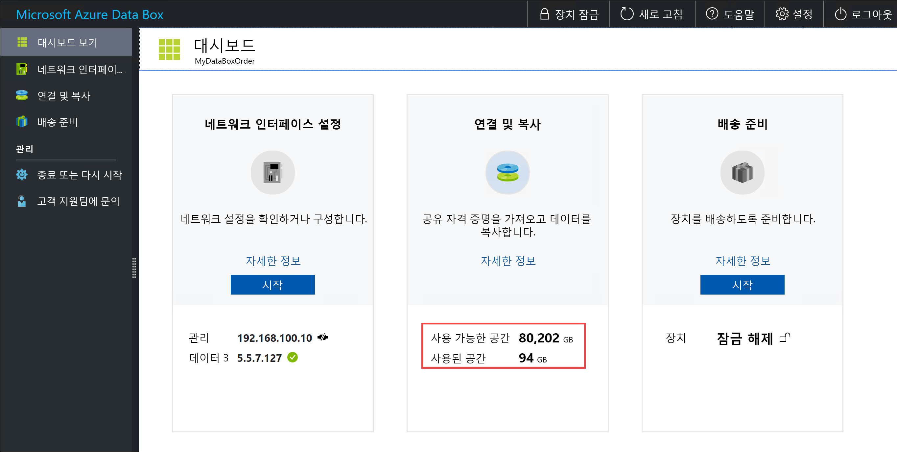
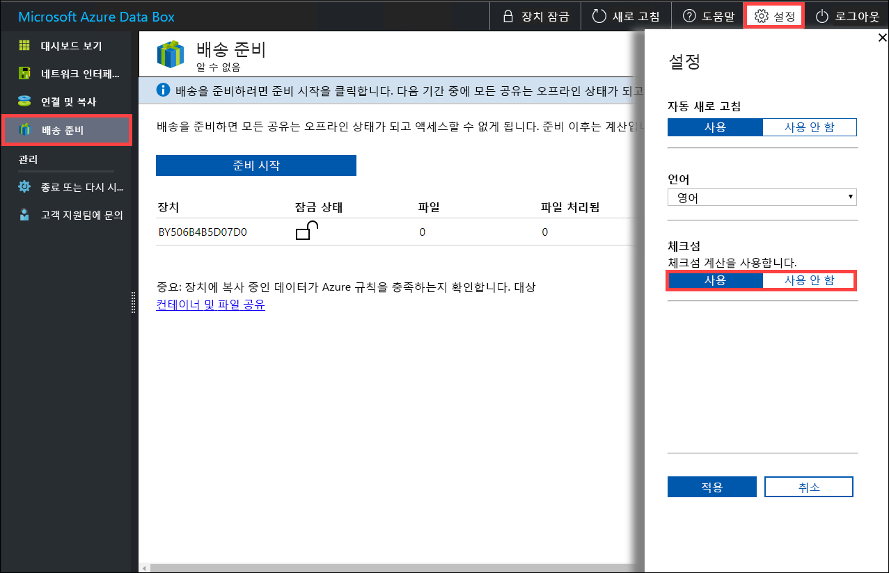

# <a name="use-the-local-web-ui-to-administer-your-data-box-and-data-box-heavy"></a>로컬 웹 UI를 사용 하 여 Data Box 고 상자에 과도 한 데이터를 관리 하려면

이 문서에서는 Data Box 및 데이터 상자 많은 장치에서 수행할 수 있는 구성 및 관리 작업 중 일부를 설명 합니다. Azure portal UI 통해 Data Box 및 데이터 상자 많은 장치 및 장치의 로컬 웹 UI 관리할 수 있습니다. 이 문서에서는 로컬 웹 UI를 사용하여 수행할 수 있는 작업을 중점적으로 설명합니다.

로컬 웹 UI Data Box 및 상자에 과도 한 데이터에 대 한 장치의 초기 구성에 사용 됩니다. 또한 로컬 웹 UI를 종료 또는 장치를 다시 시작, 진단 테스트를 실행 하 고, 소프트웨어를 업데이트 하 고, 복사 로그를 보고 Microsoft 지원에 대 한 로그 패키지 생성에 사용할 수 있습니다. 독립적인 두 노드를 사용 하 여 데이터 상자 많은 장치에서 장치의 각 노드에 해당 하는 두 개의 별도 로컬 웹 Ui에 액세스할 수 있습니다.

이 문서에는 다음 자습서가 포함되어 있습니다.

- 지원 패키지 생성
- 디바이스 종료 또는 다시 시작
- BOM 또는 매니페스트 파일 다운로드
- 디바이스의 사용 가능한 용량 확인
- 체크섬 유효성 검사 건너뛰기

## <a name="generate-support-package"></a>지원 패키지 생성

디바이스 문제가 발생하는 경우 시스템 로그에서 지원 패키지를 만들 수 있습니다. Microsoft 지원에서는 이 패키지를 사용하여 문제를 해결합니다. 지원 패키지를 생성 하려면 다음 단계를 수행 합니다.

1. 로컬 웹 UI에서 **고객 지원에 문의**로 이동한 다음 **지원 패키지 만들기**를 클릭합니다.

    

2. 지원 패키지가 수집됩니다. 이 작업은 몇 분 정도 걸립니다.

    

3. 지원 패키지 만들기가 완료되면 **지원 패키지 다운로드**를 클릭합니다. 

    

4. 다운로드 위치를 찾아서 선택합니다. 폴더를 열어 내용을 확인합니다.

    


## <a name="shut-down-or-restart-your-device"></a>디바이스 종료 또는 다시 시작

종료 하거나 로컬 웹 UI를 사용 하 여 장치를 다시 시작할 수 있습니다. 다시 시작하기 전에 호스트에서 공유를 오프라인으로 전환한 후 디바이스를 다시 시작하는 것이 좋습니다. 이렇게 하면 데이터 손상 가능성이 최소화됩니다. 디바이스를 종료할 때 데이터 복사가 진행 중이지 않은지 확인합니다.

장치를 종료 하려면 다음 단계를 수행 합니다.

1. 로컬 웹 UI에서 **종료 또는 다시 시작**으로 이동합니다.
2. **종료**를 클릭합니다.

    

3. 종료를 확인하라는 메시지가 표시되면 **확인**을 클릭하여 계속 진행합니다.

    

디바이스가 종료되면 전면 패널의 전원 단추를 사용하여 디바이스를 켭니다.

Data Box를 다시 시작하려면 다음 단계를 수행합니다.

1. 로컬 웹 UI에서 **종료 또는 다시 시작**으로 이동합니다.
2. **다시 시작**을 클릭합니다.

    

3. 다시 시작을 확인하라는 메시지가 표시되면 **확인**을 클릭하여 계속 진행합니다.

   디바이스가 종료되었다가 다시 시작됩니다.

## <a name="download-bom-or-manifest-files"></a>BOM 또는 매니페스트 파일 다운로드

자재 명세서의 자료 (BOM) 또는 매니페스트 파일은 Data Box 또는 상자에 과도 한 데이터를 복사 된 파일의 목록을 포함 합니다. 배송 장치를 준비 하는 경우 이러한 파일이 생성 됩니다.

시작 하기 전에 장치에 완료 되도록 **배송 준비** 단계입니다. 다음 단계에 따라 BOM 또는 매니페스트 파일을 다운로드합니다.

1. 장치의 로컬 웹 UI로 이동 합니다. 장치 배송 준비 완료 된 것을 볼 수 있습니다. 디바이스 준비가 완료되면 디바이스 상태가 **배송 준비 완료**로 표시됩니다.

    

2. **파일 목록 다운로드**를 클릭하면 Data Box에 복사된 파일 목록을 다운로드할 수 있습니다.

    

3. 파일 탐색기에서, 디바이스에 연결하는 데 사용된 프로토콜 및 사용된 Azure Storage 유형에 따라 별도의 파일 목록이 생성되는 것을 볼 수 있습니다.

    

   다음 표는 파일 이름을 Azure Storage 유형 및 사용된 연결 프로토콜로 매핑합니다.

    |파일 이름  |Azure Storage 유형  |사용된 연결 프로토콜 |
    |---------|---------|---------|
    |databoxe2etest_BlockBlob.txt     |블록 Blob         |SMB/NFS         |
    |databoxe2etest_PageBlob.txt     |페이지 Blob         |SMB/NFS         |
    |databoxe2etest_AzFile-BOM.txt    |Azure 파일         |SMB/NFS         |
    |databoxe2etest_PageBlock_Rest-BOM.txt     |페이지 Blob         |REST (영문)        |
    |databoxe2etest_BlockBlock_Rest-BOM.txt    |블록 Blob         |REST (영문)         |
    |mydbmdrg1_MDisk-BOM.txt    |관리 디스크:         |SMB/NFS         |
    |mydbmdrg2_MDisk-BOM.txt     |관리 디스크:         |SMB/NFS         |

이 목록을 사용하여 Data Box가 Azure 데이터 센터로 반환된 후 Azure Storage 계정에 업로드된 파일을 확인합니다. 샘플 매니페스트 파일은 아래에 표시되어 있습니다.

> [!NOTE]
> 데이터 상자 Heavy, 두 파일 (BOM) 목록에 해당 장치에 두 개의 노드만 표시 합니다.

```xml
<file size="52689" crc64="0x95a62e3f2095181e">\databox\media\data-box-deploy-copy-data\prepare-to-ship2.png</file>
<file size="22117" crc64="0x9b160c2c43ab6869">\databox\media\data-box-deploy-copy-data\connect-shares-file-explorer2.png</file>
<file size="57159" crc64="0x1caa82004e0053a4">\databox\media\data-box-deploy-copy-data\verify-used-space-dashboard.png</file>
<file size="24777" crc64="0x3e0db0cd1ad438e0">\databox\media\data-box-deploy-copy-data\prepare-to-ship5.png</file>
<file size="162006" crc64="0x9ceacb612ecb59d6">\databox\media\data-box-cable-options\cabling-dhcp-data-only.png</file>
<file size="155066" crc64="0x051a08d36980f5bc">\databox\media\data-box-cable-options\cabling-2-port-setup.png</file>
<file size="150399" crc64="0x66c5894ff328c0b1">\databox\media\data-box-cable-options\cabling-with-switch-static-ip.png</file>
<file size="158082" crc64="0xbd4b4c5103a783ea">\databox\media\data-box-cable-options\cabling-mgmt-only.png</file>
<file size="148456" crc64="0xa461ad24c8e4344a">\databox\media\data-box-cable-options\cabling-with-static-ip.png</file>
<file size="40417" crc64="0x637f59dd10d032b3">\databox\media\data-box-portal-admin\delete-order1.png</file>
<file size="33704" crc64="0x388546569ea9a29f">\databox\media\data-box-portal-admin\clone-order1.png</file>
<file size="5757" crc64="0x9979df75ee9be91e">\databox\media\data-box-safety\japan.png</file>
<file size="998" crc64="0xc10c5a1863c5f88f">\databox\media\data-box-safety\overload_tip_hazard_icon.png</file>
<file size="5870" crc64="0x4aec2377bb16136d">\databox\media\data-box-safety\south-korea.png</file>
<file size="16572" crc64="0x05b13500a1385a87">\databox\media\data-box-safety\taiwan.png</file>
<file size="999" crc64="0x3f3f1c5c596a4920">\databox\media\data-box-safety\warning_icon.png</file>
<file size="1054" crc64="0x24911140d7487311">\databox\media\data-box-safety\read_safety_and_health_information_icon.png</file>
<file size="1258" crc64="0xc00a2d5480f4fcec">\databox\media\data-box-safety\heavy_weight_hazard_icon.png</file>
<file size="1672" crc64="0x4ae5cfa67c0e895a">\databox\media\data-box-safety\no_user_serviceable_parts_icon.png</file>
<file size="3577" crc64="0x99e3d9df341b62eb">\databox\media\data-box-safety\battery_disposal_icon.png</file>
<file size="993" crc64="0x5a1a78a399840a17">\databox\media\data-box-safety\tip_hazard_icon.png</file>
<file size="1028" crc64="0xffe332400278f013">\databox\media\data-box-safety\electrical_shock_hazard_icon.png</file>
<file size="58699" crc64="0x2c411d5202c78a95">\databox\media\data-box-deploy-ordered\data-box-ordered.png</file>
<file size="46816" crc64="0x31e48aa9ca76bd05">\databox\media\data-box-deploy-ordered\search-azure-data-box1.png</file>
<file size="24160" crc64="0x978fc0c6e0c4c16d">\databox\media\data-box-deploy-ordered\select-data-box-option1.png</file>
<file size="115954" crc64="0x0b42449312086227">\databox\media\data-box-disk-deploy-copy-data\data-box-disk-validation-tool-output.png</file>
<file size="6093" crc64="0xadb61d0d7c6d4deb">\databox\data-box-cable-options.md</file>
<file size="6499" crc64="0x080add29add367d9">\databox\data-box-deploy-copy-data-via-nfs.md</file>
<file size="11089" crc64="0xc3ce6b13a4fe3001">\databox\data-box-deploy-copy-data-via-rest.md</file>
<file size="9126" crc64="0x820856b5a54321ad">\databox\data-box-overview.md</file>
<file size="10963" crc64="0x5e9a14f9f4784fd8">\databox\data-box-safety.md</file>
<file size="5941" crc64="0x8631d62fbc038760">\databox\data-box-security.md</file>
<file size="12536" crc64="0x8c8ff93e73d665ec">\databox\data-box-system-requirements-rest.md</file>
<file size="3220" crc64="0x7257a263c434839a">\databox\data-box-system-requirements.md</file>
<file size="2823" crc64="0x63db1ada6fcdc672">\databox\index.yml</file>
<file size="4364" crc64="0x62b5710f58f00b8b">\databox\data-box-local-web-ui-admin.md</file>
<file size="3603" crc64="0x7e34c25d5606693f">\databox\TOC.yml</file>
```

이 파일에 있는 모든 파일 복사 된 데이터 상자 또는 상자에 과도 한 데이터 목록을 포함 합니다. 이 파일의 *crc64* 값은 해당 파일에 대해 생성된 체크섬과 관련이 있습니다.

## <a name="view-available-capacity-of-the-device"></a>디바이스의 사용 가능한 용량 확인

디바이스 대시보드를 통해 디바이스에서 사용 가능한 용량과 사용한 용량을 확인할 수 있습니다.

1. 로컬 웹 UI에서 **대시보드 보기**로 이동합니다.
2. **연결 및 복사** 아래에 디바이스의 사용 가능한 공간과 사용한 공간이 표시됩니다.

    

## <a name="skip-checksum-validation"></a>체크섬 유효성 검사 건너뛰기

기본적으로는 배송을 준비할 때 데이터의 체크섬이 생성됩니다. 드물지만 파일 형식(작은 파일 크기)에 따라 성능이 저하될 수 있습니다. 이러한 경우에는 체크섬을 건너뛸 수 있습니다.

성능이 매우 낮은 경우가 아니면 체크섬은 사용하는 것이 좋습니다.

1. 로컬 웹 UI 장치의 오른쪽 위 모퉁이에서 이동 **설정을**합니다.

    

2. 체크섬 유효성 검사를 **사용 안 함**으로 설정합니다.
3. **적용**을 클릭합니다.

## <a name="next-steps"></a>다음 단계

- 설명 하는 방법 [Azure portal을 통해 Data Box 및 상자에 과도 한 데이터를 관리](data-box-portal-admin.md)합니다.

