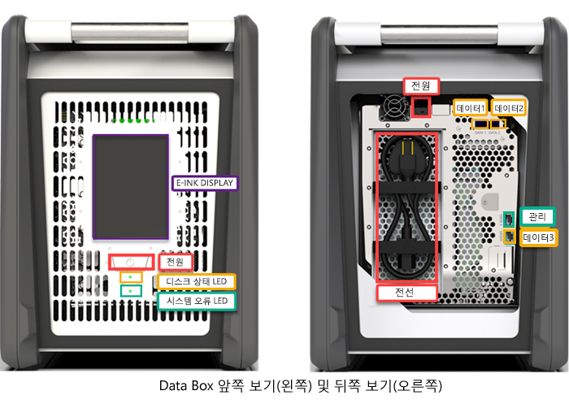
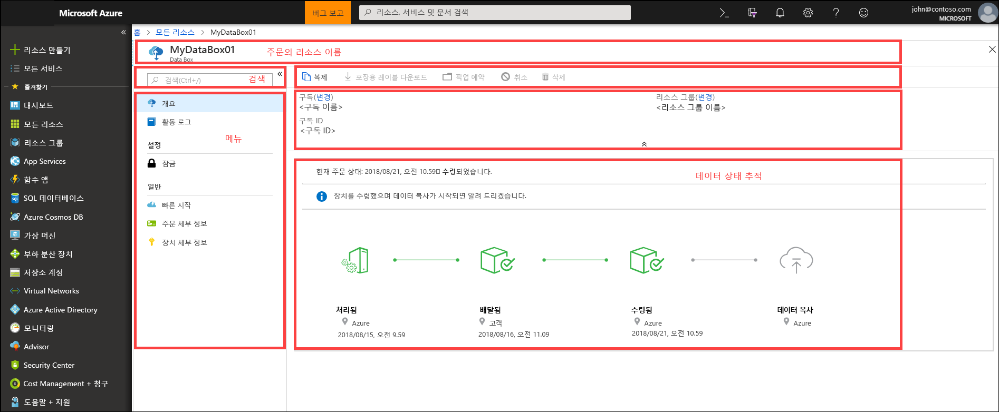
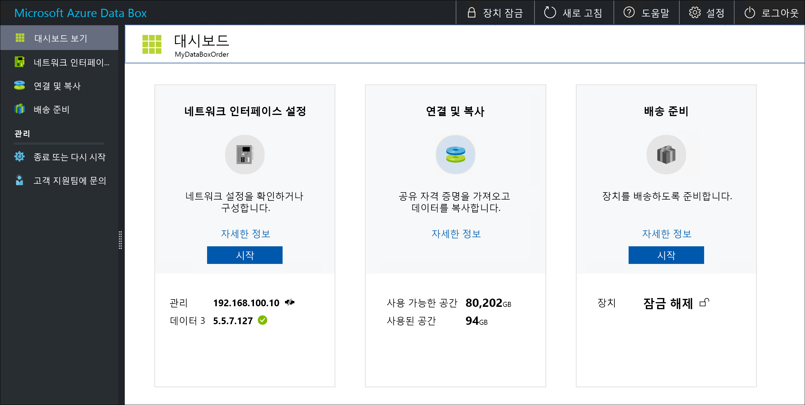

# Azure Data Box란?

Microsoft Azure Data Box 클라우드 솔루션을 사용하면 테라바이트 단위의 데이터를 빠르고 저렴하게 신뢰할 수 있는 방식으로 Azure로 보낼 수 있습니다. 사용자에게 전용 Data Box 저장소 디바이스를 배송하여 안전한 데이터 전송을 더욱 빠르게 실현시켜 드립니다. 각 저장소 디바이스는 사용 가능한 최대 저장소 용량이 80TB이며, 지역 이동 통신 사업자를 통해 사용자의 데이터 센터에 수송됩니다. 디바이스는 운송 중에 데이터를 안전하게 보호하기 위해 견고하게 포장됩니다.

Azure Portal을 통해 Data Box 디바이스를 주문할 수 있습니다. 디바이스를 받게 되면 로컬 웹 UI를 사용하여 신속하게 설정할 수 있습니다. 서버에서 디바이스로 데이터를 복사하고 디바이스를 다시 Azure에 배송합니다. Azure 데이터 센터에서 사용자의 데이터는 디바이스에서 Azure로 자동으로 업로드됩니다. 전체 프로세스는 Azure Portal의 Data Box 서비스에 의해 엔드투엔드 추적됩니다.

## 사용 사례

Data Box는 네트워크 연결에 제한이 없는 시나리오에서 40TB 이상 데이터 크기를 전송하는 데 아주 적합합니다. 데이터 이동은 일회성 전송, 정기적 전송 또는 초기 대량 데이터 전송 후의 정기적 전송일 수 있습니다. Data Box를 데이터 전송에 사용할 수 있는 다양한 시나리오는 다음과 같습니다.

 - **일회성 마이그레이션** - 대량의 온-프레미스 데이터를 Azure로 이동하는 경우입니다. 
     - 온라인 미디어 라이브러리를 만들기 위해 오프라인 테이프에서 Azure로 미디어 라이브러리를 이동합니다.
     - VM 팜에서, SQL Server 및 애플리케이션을 Azure로 마이그레이션합니다.
     - 심층 분석을 위해 기록 데이터를 Azure로 이동하고 HDInsight를 사용하여 보고합니다.

 - **초기 대량 전송** - Data Box(초기값)를 사용하여 초기 대량 전송을 수행한 후에 네트워크를 통해 증분 전송이 수행되는 경우입니다. 
     - 예를 들어, 초기 대량 기록 백업을 Azure로 이동하는 데 Commvault 및 Data Box와 같은 백업 솔루션 파트너가 사용됩니다. 완료되면 증분 데이터가 Azure 저장소로 네트워크를 통해 전송됩니다.

- **정기적 업로드** - 대량의 데이터를 정기적으로 생성하고 Azure로 이동해야 하는 경우입니다. 예를 들어 에너지를 탐사할 때 석유 굴착 장치와 풍력 발전 시설에서 비디오 콘텐츠를 생성하는 경우가 있습니다.      

## 이점

Data Box는 네트워크에 거의 영향을 주지 않으면서 대량의 데이터를 Azure로 이동할 수 있도록 설계되었습니다. 이 솔루션에는 다음과 같은 이점이 있습니다.

- **속도** - Data Box는 1Gbps 또는 10Gbps 네트워크 인터페이스를 사용하여 80TB의 데이터를 Azure로 이동합니다.

- **보안** - Data Box에는 디바이스, 데이터 및 서비스에 대한 보안 보호 기능이 기본적으로 제공됩니다.
  - 디바이스는 나사 변조 방지 및 변조 방지 스티커로 보호되어 견고하게 포장됩니다. 
  - 디바이스의 데이터는 항상 AES 256비트 암호화로 보호됩니다.
  - 디바이스는 Azure Portal에 제공된 암호로만 잠금 해제할 수 있습니다.
  - 서비스는 Azure 보안 기능으로 보호됩니다.
  - 데이터가 Azure에 업로드되면 디바이스의 디스크는 NIST 800-88r1 표준에 따라 완전히 초기화됩니다.
    
    자세한 내용은 [Azure Data Box 보안 및 데이터 보호](data-box-security.md)를 참조하세요.

## 기능 및 사양

Data Box 디바이스에는 이 릴리스의 다음과 같은 기능이 있습니다.

| 사양                                          | 설명              |
|---------------------------------------------------------|--------------------------|
| 무게                                                  | 50lb 이상                |
| 차원                                              | 디바이스 - 너비: 309.0mm 높이: 430.4mm 깊이: 502.0mm |            
| 랙 공간                                              | 장치 쪽 랙에 배치되는 경우 7U(랙에 설치할 수 없음)|
| 필요한 케이블                                         | 전원 케이블 1개(포함)   RJ45 케이블 2개   SFP+ Twinax 구리 케이블 2개|
| Storage 용량                                        | 100TB 디바이스 - RAID 5 보호 후 사용 가능한 용량 80TB|
| 전력 소요량                                            | 전원 공급 장치는 정격 700W입니다.   일반적으로 장치는 375W를 소비합니다.|
| 네트워크 인터페이스                                      | 1 GbE 인터페이스 2개 - MGMT, DATA 3.   MGMT - 관리용, 사용자 구성 불가능, 초기 설치에 사용됨   DATA3 - 데이터용, 구성 가능, 기본적으로 동적임   MGMT 및 DATA 3은 10GbE로 사용할 수도 있음   10GbE 인터페이스 2개 - DATA 1, DATA 2   모두 데이터용으로, 동적(기본값) 또는 정적으로 구성할 수 있음 |
| 데이터 전송 미디어                                     | RJ45, SFP+ 구리 10GbE 이더넷  |
| 보안                                                | 조작 방지 사용자 지정 나사를 사용한 견고한 디바이스 포장   디바이스의 하단에 변조 방지 스티커 부착|
| 데이터 전송 속도                                      | 10GbE 네트워크 인터페이스를 통해 하루 최대 80TB        |
| 관리                                              | 로컬 웹 UI - 일회성 초기 설치 및 구성   Azure Portal - 일일 디바이스 관리        |

## Data Box 구성 요소

Data Box는 다음과 같은 구성 요소를 포함합니다.

* **Data Box 디바이스** - 기본 저장소를 제공하고, 클라우드 저장소와의 통신을 관리하고, 디바이스에 저장된 모든 데이터의 보안과 기밀성을 보장하는 데 도움을 주는 물리적 디바이스입니다. Data Box 디바이스에는 80TB의 사용 가능한 저장소 용량이 있습니다. 

    

    
* **Data Box 서비스** – 다양한 지리적 위치에서 액세스할 수 있는 웹 인터페이스에서 Data Box 디바이스를 관리할 수 있는 Azure Portal의 확장입니다. Data Box 서비스를 사용하여 사용자의 Data Box 디바이스에 대한 일일 관리를 수행합니다. 서비스 작업에는 주문 만들기 및 관리, 경고 보기 및 관리, 공유 관리 방법이 포함됩니다.  

    

    자세한 내용은 [Data Box 서비스를 사용하여 Data Box 디바이스 관리](data-box-portal-ui-admin.md)로 이동하세요.

* **로컬 웹 사용자 인터페이스** – 로컬 네트워크에 연결할 수 있도록 디바이스를 구성한 다음, Data Box 서비스에 디바이스를 등록하는 데 사용되는 웹 기반 UI입니다. 로컬 웹 UI를 사용하여 Data Box 디바이스를 종료 및 다시 시작하고, 복사 로그를 보고, 서비스 요청을 위해 Microsoft 지원에 문의하세요.

    

    웹 기반 UI 사용에 대한 자세한 내용은 [웹 기반 UI를 사용하여 Data Box 관리](data-box-portal-ui-admin.md)로 이동하세요.

## 워크플로

일반적인 흐름에 포함되는 단계는 다음과 같습니다.

1. **주문** - Azure Portal에서 주문을 만들고, 배송 정보를 제공하고, 데이터에 대한 대상 Azure 저장소 계정을 만듭니다. 디바이스가 사용 가능 상태가 되면 Azure에서 배송 추적 ID를 사용하여 디바이스를 준비 및 배송합니다.

2. **수신** - 디바이스가 배송되면 네트워크 및 전원 공급을 위해 디바이스를 지정된 케이블을 사용하여 연결합니다. 디바이스를 켜고 연결합니다. 디바이스 네트워크를 구성하고 데이터를 복사하려는 호스트 컴퓨터에서 공유를 탑재합니다.

3. **데이터 복사** - Data Box 공유에 데이터를 복사합니다.

4. **반환** - 디바이스가 준비되면 전원을 끈 상태로 Azure 데이터 센터로 다시 배송합니다.

5. **업로드** - 데이터가 자동으로 디바이스에서 Azure로 복사됩니다. 디바이스 디스크는 NIST(National Institute of Standard and Technology) 지침에 따라 안전하게 지워집니다.

이 과정에서 모든 상태 변경에 대해 이메일을 통해 알림을 받습니다. 세부적인 흐름에 대한 자세한 내용은 [Azure Portal에서 Data Box 배포](data-box-deploy-ordered.md)로 이동하세요.

## 지역 가용성

Data Box는 서비스가 배포된 지역, 디바이스가 배송되는 국가/지역 및 데이터를 전송하는 대상 Azure 스토리지 계정에 따라 데이터를 전송할 수 있습니다. 

- **서비스 가용성** - 이 릴리스의 경우 Data Box 서비스는 다음과 같은 지역에서 사용할 수 있습니다.
    - 미국 내 모든 지역 - 미국 중서부, 미국 서부 2, 미국 서부, 미국 중남부, 미국 중부, 미국 중북부, 미국 동부 및 미국 동부 2.
    - 유럽 연합 - 유럽 서부 및 유럽 북부.
    - 영국 - 영국 남부 및 영국 서부.
    - 프랑스 - 프랑스 중부 및 프랑스 남부.

- **대상 저장소 계정** - 데이터를 저장하는 저장소 계정은 서비스를 사용할 수 있는 모든 Azure 지역에서 사용할 수 있습니다.  

## 다음 단계

- [Data Box 시스템 요구 사항](data-box-system-requirements.md)을 검토합니다.
- [Data Box 제한](data-box-limits.md)을 알아봅니다.
- Azure Portal에서 [Azure Data Box](data-box-quickstart-portal.md)를 빠르게 배포합니다.

